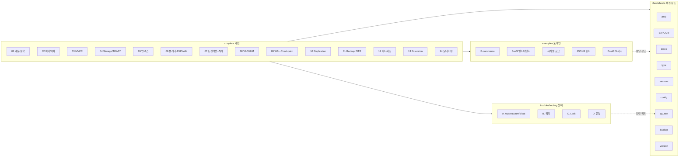
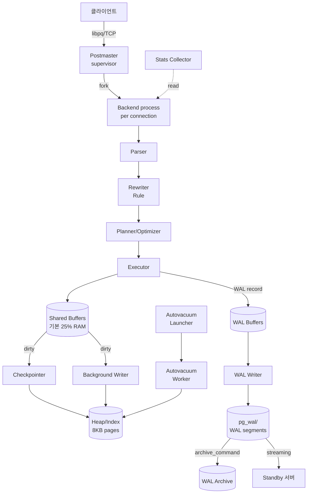

# PostgreSQL 아키텍처 & 운영 학습 가이드

> 공식 문서(postgresql.org/docs, postgresql.kr/docs/13) 기반 지식 저장소
> 개념 이해 → 실무 예제 → 빠른 참조 3단 구성

모든 서비스 엔지니어·DBA·백엔드 개발자가 **운영을 효율화하기 위해** 참조할 수 있도록 구성했다. 공식 문서의 정확성을 유지하면서, 실제 장애·튜닝 경험에서 얻은 노하우를 함께 담았다.

---

## 폴더 구조

```
postgresql-guide/
├── chapters/        ← 개념 학습 (1~14장)         → 목차: chapters/README.md
├── examples/        ← 실무 도메인 예제 (5개)     → 목차: examples/README.md
├── troubleshooting/ ← 장애 케이스 스터디 (13개)  → 목차: troubleshooting/README.md
└── cheatsheets/     ← 빠른 참조 (9개)            → 목차: cheatsheets/README.md
```

> 각 폴더의 `README.md`는 그 영역의 목차·학습 경로·상황별 선택 가이드를 담고 있다.
> - [chapters/](chapters/README.md) — 14장 목차 + 초/중/고급 학습 경로
> - [examples/](examples/README.md) — 5개 도메인 + 도메인 선택 플로우
> - [troubleshooting/](troubleshooting/README.md) — 증상으로 빠르게 찾기
> - [cheatsheets/](cheatsheets/README.md) — 상황별 치트시트 선택 + 자주 쓰는 쿼리 Top 5

### 전체 지식 지도



### PostgreSQL 전체 아키텍처 한눈에 보기



---

## 추천 학습 경로

### 🟢 초심자: "PostgreSQL을 쓰기 시작했다"

```
chapters/ch01_postgresql_overview.md   (왜 PostgreSQL인가, 설계 철학)
  ↓
chapters/ch02_architecture.md          (프로세스 모델, Shared Buffer, WAL)
  ↓
chapters/ch03_mvcc.md                  (PostgreSQL 핵심 — MVCC)
  ↓
cheatsheets/psql_commands.md           (psql 명령 레퍼런스)
```

### 🟡 실무자: "쿼리가 느린데 어디부터 봐야 하나"

```
chapters/ch05_indexes.md               (인덱스 타입별 선택)
  ↓
chapters/ch06_query_planner.md         (EXPLAIN 읽는 법)
  ↓
cheatsheets/explain_reading.md
  ↓
troubleshooting/B1_missing_index.md ~ B4 (쿼리 실수 케이스)
```

### 🟠 운영자/DBA: "장애 대응과 튜닝"

```
chapters/ch08_vacuum_autovacuum.md     (VACUUM, Bloat, XID Wraparound)
  ↓
chapters/ch09_wal_checkpoint.md        (WAL, Checkpoint, 디스크 I/O)
  ↓
chapters/ch14_monitoring_troubleshooting.md
  ↓
troubleshooting/A*, C*, D*             (오토배큠/Lock/운영 장애)
  ↓
cheatsheets/pg_stat_queries.md         (진단 쿼리 모음)
```

---

## 📚 chapters — 개념 학습

### 1부: PostgreSQL 기초

- [**1장. PostgreSQL 개요와 설계 철학**](chapters/ch01_postgresql_overview.md)
  - 객체-관계형(ORDBMS), 확장성, ACID, 다른 DB와의 차이
- [**2장. 아키텍처와 프로세스 모델**](chapters/ch02_architecture.md)
  - Postmaster, Backend, Background Worker, Shared Buffer, WAL Buffer
- [**3장. MVCC — PostgreSQL 성능과 잠금의 비밀**](chapters/ch03_mvcc.md)
  - xmin/xmax, Snapshot, Visibility, Dead Tuple의 탄생

### 2부: 스토리지와 인덱스

- [**4장. Heap, Tuple, Page, TOAST**](chapters/ch04_storage_tuples_toast.md)
  - 8KB 페이지 구조, HOT 업데이트, TOAST가 자동으로 하는 일
- [**5장. 인덱스 타입**](chapters/ch05_indexes.md)
  - B-tree / Hash / GIN / GiST / BRIN / SP-GiST 선택 기준
- [**6장. 쿼리 플래너와 EXPLAIN**](chapters/ch06_query_planner.md)
  - 통계·Cost 모델, 스캔/조인 전략, EXPLAIN (ANALYZE, BUFFERS) 읽기

### 3부: 트랜잭션과 동시성

- [**7장. 트랜잭션과 격리 수준**](chapters/ch07_transactions_isolation.md)
  - Read Committed, Repeatable Read, Serializable, Lock 레벨, Deadlock
- [**8장. VACUUM과 Autovacuum**](chapters/ch08_vacuum_autovacuum.md)
  - Bloat, Dead Tuple, XID Wraparound, Visibility Map

### 4부: 저장·내구성·고가용성

- [**9장. WAL과 Checkpoint**](chapters/ch09_wal_checkpoint.md)
  - Durability, full_page_writes, checkpoint_timeout, wal_compression
- [**10장. 복제(Replication)**](chapters/ch10_replication.md)
  - Streaming, Logical, Synchronous Commit, 스탠바이 지연 모니터링
- [**11장. 백업과 복구**](chapters/ch11_backup_recovery.md)
  - pg_dump, pg_basebackup, PITR, WAL Archiving
- [**12장. 파티셔닝**](chapters/ch12_partitioning.md)
  - Declarative Partitioning, Partition Pruning, 주의사항

### 5부: 운영 실무

- [**13장. 핵심 확장(Extension)**](chapters/ch13_extensions.md)
  - pg_stat_statements, pgaudit, postgis, pg_trgm, pgvector 등
- [**14장. 모니터링과 트러블슈팅**](chapters/ch14_monitoring_troubleshooting.md)
  - pg_stat_* 뷰, 슬로우 쿼리 추적, Lock 분석, Connection 관리

---

## 🛠️ examples — 실무 도메인 예제

실제 서비스에서 자주 마주치는 요구사항을 PostgreSQL로 어떻게 푸는지.

| # | 도메인 | 핵심 개념 |
|---|--------|---------|
| [01](examples/01_ecommerce_orders.md) | 🛒 **E-commerce 주문/재고** | 트랜잭션·Lock, 인덱스, 파티셔닝 |
| [02](examples/02_saas_multitenancy.md) | 🏢 **SaaS 멀티테넌시** | 스키마 전략, RLS, 대량 테넌트 운영 |
| [03](examples/03_timeseries_logs.md) | 📊 **시계열 로그** | BRIN, 파티셔닝, 집계 MV |
| [04](examples/04_json_document.md) | 📄 **JSONB 문서 저장소** | jsonb 연산자, GIN 인덱스 |
| [05](examples/05_geospatial_postgis.md) | 🌍 **지리정보** | PostGIS, GiST, 공간 쿼리 |

---

## 🔥 troubleshooting — 케이스 스터디

### A. Autovacuum / Bloat

| 케이스 | 핵심 증상 |
|--------|---------|
| [A1. Bloat 누적](troubleshooting/A1_bloat_accumulation.md) | 테이블 용량 급증, SELECT 느려짐 |
| [A2. XID Wraparound 경고](troubleshooting/A2_xid_wraparound.md) | `database is not accepting commands` 직전 경고 |
| [A3. 긴 트랜잭션이 VACUUM을 막는다](troubleshooting/A3_long_tx_blocks_vacuum.md) | Dead Tuple 계속 증가 |

### B. 쿼리 실수

| 케이스 | 핵심 증상 |
|--------|---------|
| [B1. 인덱스 누락](troubleshooting/B1_missing_index.md) | 갑자기 Seq Scan 폭주 |
| [B2. 인덱스가 있어도 Seq Scan](troubleshooting/B2_seq_scan_with_index.md) | 통계 오차, 함수 래핑 |
| [B3. 잘못된 조인 순서](troubleshooting/B3_bad_join_order.md) | 중간 결과 폭발 |
| [B4. N+1 쿼리](troubleshooting/B4_n_plus_one.md) | ORM 기본값 주의 |

### C. Lock

| 케이스 | 핵심 증상 |
|--------|---------|
| [C1. 데드락](troubleshooting/C1_deadlock.md) | `deadlock detected` |
| [C2. idle in transaction](troubleshooting/C2_idle_in_transaction.md) | VACUUM·DDL 블록 |
| [C3. DDL이 쿼리를 막는다](troubleshooting/C3_ddl_blocking.md) | AccessExclusiveLock |

### D. 운영 장애

| 케이스 | 핵심 증상 |
|--------|---------|
| [D1. Connection 고갈](troubleshooting/D1_connection_exhaustion.md) | `too many connections`, pgBouncer |
| [D2. Replication Lag](troubleshooting/D2_replication_lag.md) | 스탠바이 지연 누적 |
| [D3. WAL로 인한 디스크 풀](troubleshooting/D3_wal_disk_full.md) | pg_wal 급증, 슬롯 미회수 |

---

## ⚡ cheatsheets — 빠른 참조

| 파일 | 내용 |
|------|------|
| [psql_commands.md](cheatsheets/psql_commands.md) | psql 메타커맨드, 생산성 팁 |
| [explain_reading.md](cheatsheets/explain_reading.md) | EXPLAIN 출력 해석, 노드별 특징 |
| [index_selection.md](cheatsheets/index_selection.md) | 인덱스 타입 선택 플로우차트 |
| [type_selection.md](cheatsheets/type_selection.md) | 타입 선택 가이드, 함정 |
| [vacuum_tuning.md](cheatsheets/vacuum_tuning.md) | autovacuum 파라미터 튜닝 |
| [config_parameters.md](cheatsheets/config_parameters.md) | 필수 postgresql.conf 파라미터 |
| [pg_stat_queries.md](cheatsheets/pg_stat_queries.md) | 진단 쿼리 모음 (Lock, Bloat, 느린 쿼리) |
| [backup_recovery_recipes.md](cheatsheets/backup_recovery_recipes.md) | 백업·복구 레시피 |
| [version_history.md](cheatsheets/version_history.md) | 버전별 주요 변경(10~17), LTS 선택 |

---

## 핵심 원칙 요약

PostgreSQL을 쓸 때 반드시 지켜야 할 원칙을 한 페이지에 압축.

### 설계 원칙

```
1. UPDATE-heavy 워크로드에서 HOT 업데이트가 가능하도록 fillfactor 고려
   → 변경 가능한 컬럼은 가급적 인덱스에서 제외
   → MVCC는 UPDATE에서 새 버전을 "append"하므로 Bloat가 쉽게 쌓인다

2. 인덱스는 "꼭 필요한 쿼리"에만
   → 인덱스마다 WRITE 비용이 늘어나고 Bloat 대상도 증가

3. 트랜잭션은 짧게, 명시적으로 종료
   → idle in transaction이 VACUUM을 막는다

4. 대용량 테이블은 파티셔닝으로 관리성 확보
   → DROP PARTITION은 VACUUM보다 비교할 수 없이 저렴

5. TEXT를 기본으로 쓴다, VARCHAR(N)은 제약이 필요할 때만
   → PostgreSQL에서는 TEXT/VARCHAR 성능 차이 없음
```

### 수집/쓰기 원칙

```
1. 단건 INSERT보다 배치 COPY 또는 multi-row INSERT
   → WAL·트랜잭션 오버헤드 절감

2. 대량 DELETE 대신 파티션 DROP 또는 배치 삭제
   → 한 번에 삭제하면 Autovacuum이 따라가지 못해 Bloat 폭증

3. UPDATE로 인한 Bloat를 인지하고 fillfactor/autovacuum 튜닝
   → pgstattuple, pg_stat_user_tables로 모니터링
```

### 쿼리 원칙

```
1. EXPLAIN (ANALYZE, BUFFERS)을 기본으로 사용
   → 읽은 블록 수(shared hit/read)로 실제 I/O를 측정

2. OR/IN, 함수 래핑, 타입 불일치는 인덱스 비활성의 단골
   → WHERE to_char(created_at,'YYYY-MM-DD') = ... ❌
   → WHERE created_at >= '...' AND created_at < '...' ✅

3. LIMIT + ORDER BY 조합은 인덱스가 ORDER BY 방향과 일치해야 빠르다

4. pg_stat_statements는 기본 탑재
   → "어떤 쿼리가 얼마나 느리고 얼마나 자주 실행되는가"의 최고의 출처
```

### 운영 원칙

```
1. pg_stat_statements, auto_explain을 처음부터 켜둔다
2. autovacuum은 "항상 켜두되", 큰 테이블만 개별 튜닝
3. shared_buffers는 메모리의 25% 수준이 일반적 시작점
4. wal_level, max_wal_senders, max_replication_slots는 사전에 여유 있게
5. 장애 시 진단 순서: 연결 수 → Lock → 긴 트랜잭션 → 쿼리
```

---

## 참고 자료

- **공식 문서(영문)**: [postgresql.org/docs](https://www.postgresql.org/docs/)
- **공식 문서(한글, 13 기준)**: [postgresql.kr/docs/13](https://postgresql.kr/docs/13/)
- **성능/운영 위키**: [wiki.postgresql.org](https://wiki.postgresql.org/)
- **pg_stat_statements**: [postgresql.org/docs/current/pgstatstatements.html](https://www.postgresql.org/docs/current/pgstatstatements.html)
- **소스 아키텍처**: `src/backend/README`

---

## 이 가이드를 쓰는 법

- **처음 보는 사람**: README → 1~3장 → 해당 영역 치트시트
- **운영 중 장애**: `troubleshooting/` 폴더에서 증상 기반 검색
- **튜닝이 필요할 때**: `cheatsheets/pg_stat_queries.md` → 해당 챕터 심화
- **리뷰/검수**: 각 문서 하단의 "공식 문서 참조" 블록을 확인
