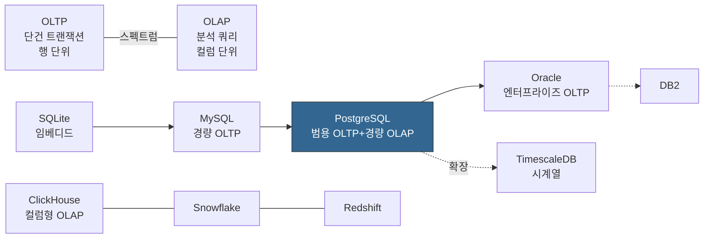
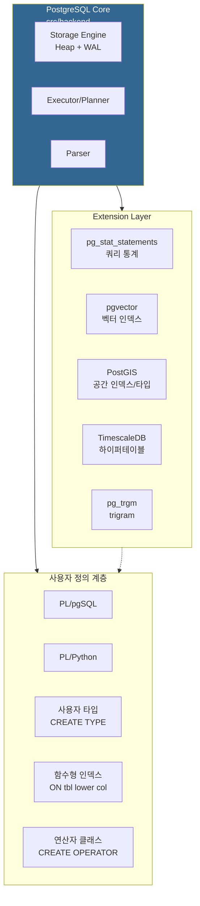
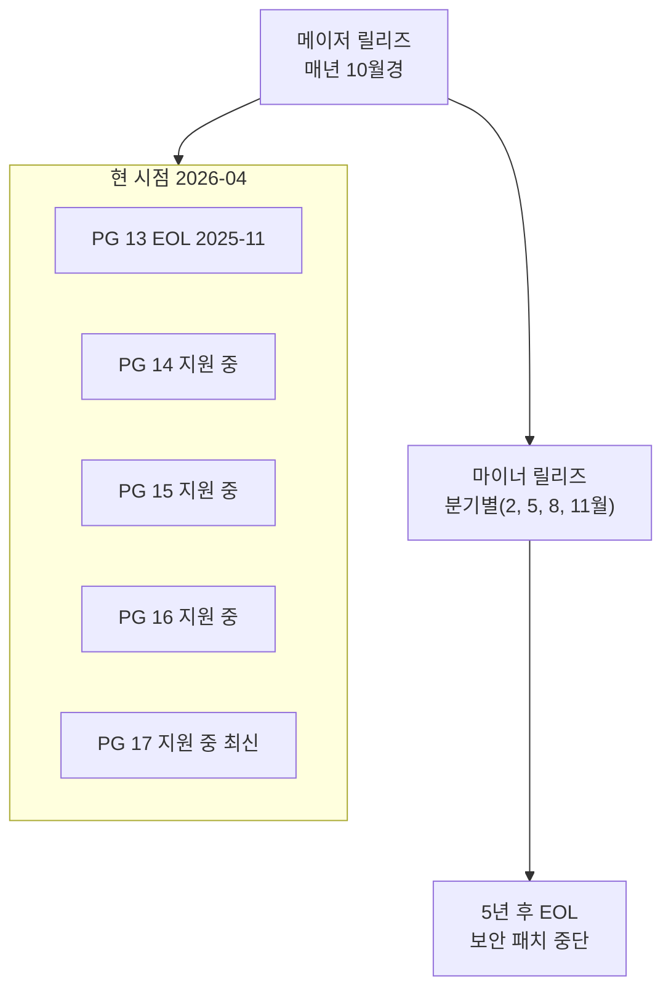

# 1장. PostgreSQL 개요와 설계 철학

PostgreSQL은 "가장 앞선 오픈소스 관계형 데이터베이스"라는 평가를 받는다. 이 평가는 마케팅 문구가 아니라 30년 이상 누적된 설계 결정의 귀결이다. 이 장에서는 PostgreSQL이 무엇이고, 왜 그렇게 설계되었으며, 다른 데이터베이스와 어디서 갈라지는지를 정리한다.

---

## 1.1 PostgreSQL이란 무엇인가

PostgreSQL은 **객체-관계형 데이터베이스 관리 시스템(Object-Relational Database Management System, ORDBMS)** 이다. 단순 RDBMS가 아니라 "객체-관계형"인 이유는, 처음부터 사용자 정의 타입·함수·연산자·인덱스를 일급 시민(first-class citizen)으로 다루도록 설계되었기 때문이다.

공식 문서(postgresql.org/docs/current/intro-whatis.html)의 정의를 그대로 옮기면 이렇다.

> "PostgreSQL is an object-relational database management system (ORDBMS) based on POSTGRES, Version 4.2, developed at the University of California at Berkeley Computer Science Department."

### 기원: Berkeley POSTGRES

- **1986년** UC Berkeley의 Michael Stonebraker가 이끄는 POSTGRES 프로젝트에서 시작.
- **1994년** Andrew Yu와 Jolly Chen이 SQL 인터프리터를 추가하여 **Postgres95**로 공개.
- **1996년** 오픈소스 커뮤니티로 이관되며 **PostgreSQL**로 이름 변경.
- 2026년 기준 PostgreSQL **18**(2025-09 릴리스)이 최신 안정 버전. 17도 여전히 주요 운영 라인. 버전별 변경은 [version_history.md](../cheatsheets/version_history.md) 참고.

Stonebraker의 원래 목표는 "관계형 모델에 객체 지향적 확장성을 더한 차세대 DB"였다. 그 유산이 오늘날까지 이어지는 **Extension 모델**과 **함수형 인덱스**, **사용자 정의 타입**의 뿌리다.

### ACID: 타협 없는 트랜잭션

PostgreSQL은 **ACID(Atomicity, Consistency, Isolation, Durability)** 를 완전히 준수한다. 모든 DDL조차 트랜잭션으로 감쌀 수 있다는 점에서 Oracle·MySQL을 능가한다.

```sql
BEGIN;
CREATE TABLE orders (id bigserial PRIMARY KEY, amount numeric);
ALTER TABLE orders ADD COLUMN created_at timestamptz DEFAULT now();
-- 실패하면 ROLLBACK으로 CREATE까지 전부 되돌림
ROLLBACK;
```

MySQL은 DDL이 묵시적 커밋을 일으키므로 위 같은 원자적 스키마 변경이 불가능하다. PostgreSQL의 이 특성은 마이그레이션 도구(Flyway, Alembic 등)의 설계 철학 자체를 바꾼다.

---

## 1.2 설계 철학: 표준 준수 · 확장성 · 신뢰성

PostgreSQL 커뮤니티가 공개적으로 천명하는 세 가지 가치가 있다.

### (1) SQL 표준 준수(Standards Compliance)

PostgreSQL은 SQL:2023까지의 주요 기능을 선도적으로 구현한다. 공식 문서의 "Appendix D. SQL Conformance"는 수백 개 항목을 표로 정리해 두고 어떤 항목을 준수하는지 명시한다.

대표 사례:
- **Window Function**(`ROW_NUMBER() OVER (PARTITION BY ...)`): SQL:2003 표준. PostgreSQL 8.4(2009)부터 지원.
- **Common Table Expression(CTE)**, **Recursive CTE**: SQL:1999 표준.
- **LATERAL JOIN**, **FILTER 절**, **JSON 경로 표현식(SQL/JSON)**: 모두 표준 추종.

### (2) 확장성(Extensibility)

PostgreSQL은 **커널을 고치지 않고도 기능을 추가할 수 있는** 구조를 처음부터 갖추었다.

- 사용자 정의 **데이터 타입**(`CREATE TYPE`)
- 사용자 정의 **연산자**(`CREATE OPERATOR`)
- 사용자 정의 **함수**(`CREATE FUNCTION`, PL/pgSQL·PL/Python·PL/Perl·PL/Tcl·C)
- 사용자 정의 **인덱스 access method**(`CREATE ACCESS METHOD`)
- **확장 패키지(Extension)**: `CREATE EXTENSION postgis;` 한 줄로 지리정보 기능을 얻는다.

이 확장성이 PostGIS(지리정보), TimescaleDB(시계열), pgvector(벡터 검색), Citus(분산), pg_trgm(유사도 검색) 같은 생태계를 만들어낸 원동력이다.

### (3) 신뢰성(Reliability)

"데이터는 절대 잃어버리면 안 된다"는 원칙이 코드 전반을 관통한다.

- **WAL(Write-Ahead Logging)** 기반 내구성: COMMIT 응답이 돌아오면 해당 트랜잭션은 WAL에 fsync된 상태가 보장된다.
- **fsync·full_page_writes** 기본 ON.
- **MVCC**로 동시성과 읽기 일관성을 동시에 확보(3장에서 심화).
- **Checksum 옵션**(`initdb -k`)으로 디스크 손상 감지.

신뢰성을 위해 PostgreSQL은 성능을 일부 포기한다. 예: full_page_writes는 WAL 크기를 키우지만 이를 끄면 torn page 위험이 있어 기본 OFF로 두지 않는다.

---

## 1.3 다른 DB와의 비교

모든 데이터베이스는 **OLTP ↔ OLAP** 스펙트럼, **표준 준수 ↔ 성능 특화** 스펙트럼 위에 놓인다. PostgreSQL의 위치는 이렇게 요약된다.



PostgreSQL은 **OLTP 중앙에 있으면서** 분석 쿼리(Window, CTE, JSONB, GIN/BRIN 인덱스)까지 자연스럽게 수용하는 **범용(general-purpose)** 포지션에 있다. 이 범용성이 "일단 PostgreSQL로 시작하라"는 업계 격언의 근거다.

### 1.3.1 MySQL과의 차이

| 항목 | PostgreSQL | MySQL(InnoDB) |
|------|------------|---------------|
| MVCC 구현 | **In-heap 다중 버전** (튜플을 테이블에 append) | **Undo log** (변경 전 이미지를 별도 영역에 저장) |
| UPDATE 비용 | 새 버전 생성 → Bloat 발생 → VACUUM 필요 | Undo 영역에 기록 → 주기적 purge |
| DDL 트랜잭션 | **완전 지원** | 대부분 묵시적 커밋(8.0 Atomic DDL 개선됨) |
| 표준 준수도 | 매우 높음 | 느슨함(`GROUP BY` 미엄격 등 기본) |
| 복제 기본 | Streaming(physical) + Logical | Binlog 기반 Logical |
| 기본 인덱스 | **Heap + B-tree**(인덱스에 PK 없음) | **Clustered index**(PK가 곧 데이터 순서) |

PostgreSQL이 **heap 구조**를 유지하는 것은 큰 설계 결정이다. MySQL InnoDB의 clustered index는 PK 범위 스캔이 유리한 반면, secondary index 조회 때 두 번 타기(PK lookup) 때문에 비용이 든다. PostgreSQL은 모든 인덱스가 대등하게 heap을 참조한다.

### 1.3.2 Oracle과의 차이

| 항목 | PostgreSQL | Oracle |
|------|------------|--------|
| 라이선스 | PostgreSQL License(BSD 유사, 무료) | 상용 |
| PL/SQL | PL/pgSQL(거의 호환) | PL/SQL |
| MVCC | In-heap | Undo segment |
| 파티셔닝 | Declarative(10+) | 성숙한 내장 |
| 병렬 쿼리 | 있음(제한적) | 매우 성숙 |
| Materialized View 자동 리프레시 | 없음(수동) | 있음 |
| RAC(공유 디스크 클러스터) | **없음**(shared-nothing 복제) | 있음 |

Oracle에서 PostgreSQL로 이식할 때 가장 큰 걸림돌은 RAC(공유 스토리지 클러스터)의 부재와, 일부 고급 Materialized View·Advanced Queue·AWR 같은 유료 기능이다.

### 1.3.3 ClickHouse와의 차이

ClickHouse는 전혀 다른 범주다. PostgreSQL이 OLTP + 가벼운 분석용이라면, ClickHouse는 **컬럼형 OLAP 전용**이다.

| 항목 | PostgreSQL | ClickHouse |
|------|------------|-----------|
| 저장 모델 | Row-oriented Heap | Columnar MergeTree |
| 트랜잭션 | 완전 ACID | 제한적(파트 단위) |
| UPDATE/DELETE | 일상적 | 무거운 mutation |
| 쿼리 실행 | Row-at-a-time (Executor) | Vectorized |
| 용도 | 서비스 DB | 로그·이벤트 분석 |

"둘 중 하나"가 아니라 "둘 다" 쓰는 경우가 많다. 서비스는 PostgreSQL, 분석은 ClickHouse로 분리하는 아키텍처가 표준화되어 있다.

### 1.3.4 SQLite와의 차이

SQLite는 서버리스 임베디드 DB다. PostgreSQL은 멀티 프로세스 서버다. 비교 대상이라기보다 **용도가 다르다**. 단, 개발 초기에 SQLite로 시작했다가 프로덕션에서 PostgreSQL로 갈아타는 것은 흔한 패턴이므로, SQL 표준 차이점(예: SQLite의 타입 affinity, `AUTOINCREMENT` vs PostgreSQL의 `BIGSERIAL`·`IDENTITY`)을 알아두는 것이 유용하다.

---

## 1.4 PostgreSQL만의 특징

PostgreSQL을 "선택할 이유"는 다음 일곱 가지에 압축된다.

### (1) Extension 생태계

`CREATE EXTENSION` 한 줄로 다음과 같은 고도화 기능을 얻는다.

```sql
CREATE EXTENSION pg_stat_statements;  -- 쿼리 성능 분석
CREATE EXTENSION pg_trgm;              -- 유사도 검색
CREATE EXTENSION postgis;              -- 지리정보
CREATE EXTENSION pgvector;             -- 벡터 임베딩(AI/ML)
CREATE EXTENSION pgaudit;              -- 감사 로깅
CREATE EXTENSION pgcrypto;             -- 암호화
```



이 3계층 구조(Core → Extension → User-defined)가 PostgreSQL의 유연성을 설명한다. **새 기능을 커널 변경 없이 추가할 수 있다**는 뜻이다. 핵심 엔진은 작고 안정적으로 유지하면서, 도메인별 요구사항은 외부 모듈로 해결한다.

### (2) 풍부한 기본 타입

다른 DB에서는 `TEXT`로 억지로 구현하던 것들이 PostgreSQL에서는 **네이티브 타입**이다.

- `JSONB`: 이진 JSON. GIN 인덱스로 `@>`, `?`, `->>` 연산 가속.
- `UUID`: 16바이트 고정. `uuid-ossp`·`pgcrypto`로 생성.
- `ARRAY`: 모든 타입의 배열. `integer[]`, `text[]`, 다차원 가능.
- `HSTORE`: key-value 쌍.
- `RANGE`: `int4range`, `tsrange` 등 구간 타입. `&&`(겹침), `@>`(포함) 연산자.
- `INET`/`CIDR`: IPv4/IPv6 주소·CIDR 블록.
- `MONEY`, `NUMERIC(p,s)`: 정밀 소수.
- `TSVECTOR`/`TSQUERY`: 전문 검색 토큰.
- `GEOMETRY`/`GEOGRAPHY`(PostGIS): 공간 데이터.
- `VECTOR(n)`(pgvector): n차원 임베딩 벡터.

### (3) 고급 인덱스 타입

B-tree 외에 다섯 가지 추가 인덱스가 내장되어 있다(5장 상세).

| 인덱스 | 용도 |
|--------|------|
| **B-tree** | 등가/범위, 기본 |
| **Hash** | 등가 전용 |
| **GIN** | 배열·JSONB·전문 검색(다값 컬럼) |
| **GiST** | 지리·범위·유사도 |
| **SP-GiST** | 공간 분할(비균일 데이터) |
| **BRIN** | 시계열·로그(자연 정렬된 대용량) |

### (4) CTE · Window Function · LATERAL

```sql
-- 재귀 CTE로 조직도 탐색
WITH RECURSIVE org AS (
    SELECT id, name, parent_id, 0 AS depth FROM employees WHERE parent_id IS NULL
    UNION ALL
    SELECT e.id, e.name, e.parent_id, o.depth + 1
    FROM employees e JOIN org o ON e.parent_id = o.id
)
SELECT * FROM org ORDER BY depth;

-- Window Function으로 부서별 순위
SELECT name, salary,
       RANK() OVER (PARTITION BY dept_id ORDER BY salary DESC) AS rank
FROM employees;

-- LATERAL로 각 행별 서브쿼리
SELECT u.id, recent.last_login
FROM users u
LEFT JOIN LATERAL (
    SELECT login_at AS last_login FROM logins
    WHERE user_id = u.id ORDER BY login_at DESC LIMIT 1
) recent ON true;
```

### (5) Row-Level Security (RLS)

테이블 행 단위로 접근 제어를 선언한다. SaaS 멀티테넌시의 표준 패턴.

```sql
ALTER TABLE orders ENABLE ROW LEVEL SECURITY;
CREATE POLICY tenant_isolation ON orders
    USING (tenant_id = current_setting('app.current_tenant')::int);
```

쿼리마다 `WHERE tenant_id = ?`를 붙이지 않아도, 세션 설정만으로 격리가 강제된다.

### (6) 함수형/부분 인덱스

```sql
-- 함수형 인덱스: 대소문자 무시 검색
CREATE INDEX idx_users_email_lower ON users (lower(email));

-- 부분 인덱스: "활성 사용자만" 인덱싱 → 크기·쓰기 비용 절감
CREATE INDEX idx_active_users ON users (created_at)
    WHERE status = 'active';

-- 표현식 + 부분 조합
CREATE INDEX idx_recent_orders ON orders ((amount * tax_rate))
    WHERE created_at > now() - INTERVAL '30 days';
```

### (7) 다중 프로시저 언어

서버 사이드 로직을 SQL 외의 언어로 쓸 수 있다.

- **PL/pgSQL**: 기본 내장. Oracle PL/SQL과 문법 유사.
- **PL/Python**(plpython3u): ML 후처리, 정규식, 외부 API 호출.
- **PL/Perl**, **PL/Tcl**, **PL/V8**(JavaScript, 외부).
- **C 함수**: 최고 성능. 확장 모듈이 이 방식을 쓴다.

---

## 1.5 버전·릴리즈 정책

PostgreSQL 커뮤니티는 **예측 가능한 연 1회 메이저 릴리즈** 정책을 유지한다(공식: postgresql.org/support/versioning/).

- **메이저 버전**: 매년 9~10월 출시. 예: 15 → 16 → 17.
- **지원 기간**: 각 메이저 버전은 **최초 릴리즈 후 5년**간 지원(버그 픽스·보안 패치). 이후 EOL.
- **마이너 버전**: 분기별 누적 버그·보안 수정. 재시작만 필요, dump/restore 불필요.
- **메이저 업그레이드**: `pg_upgrade`로 in-place, 또는 logical replication으로 무중단.



**운영 원칙**: 프로덕션에는 **메이저 최신에서 하나 뒤**(예: 17 출시 시 16)를 쓰는 편이 보수적이다. 마이너 버전은 최신으로 유지한다(보안 패치 누락 금지).

---

## 1.6 이 가이드를 쓰는 법

이 가이드는 세 층으로 구성된다.

1. **chapters/**: 1~14장. 개념을 체계적으로 다진다.
2. **examples/**: 실무 도메인(E-commerce, SaaS, 시계열 등) 예제.
3. **troubleshooting/ · cheatsheets/**: 장애 대응·튜닝 레시피.

권장 동선:

- **처음 쓴다**: 1장 → 2장 → 3장 → `cheatsheets/psql_commands.md`.
- **느린 쿼리가 있다**: 5장(인덱스) → 6장(EXPLAIN) → `troubleshooting/B*`.
- **Bloat·Autovacuum 이슈**: 3장(MVCC) → 4장(Storage) → 8장(VACUUM) → `troubleshooting/A*`.
- **복제·백업 설계**: 9장(WAL) → 10장(Replication) → 11장(Backup).

각 장의 마지막에는 **공식 문서 참조** 블록을 둔다. 본문의 정확성을 재확인하려면 그 링크를 따라가면 된다.

---

## 1.7 Key Takeaways

| 항목 | 요약 |
|------|------|
| **정체성** | ORDBMS. Berkeley POSTGRES(1986) 계보. BSD 유사 라이선스. |
| **설계 가치** | 표준 준수 · 확장성 · 신뢰성. 세 가지 모두 양보하지 않음. |
| **MVCC 특이점** | In-heap 다중 버전. UPDATE는 새 튜플 생성 → VACUUM 필수. |
| **확장성 모델** | Core / Extension / 사용자 정의 3계층. `CREATE EXTENSION`이 핵심. |
| **SQL 표현력** | CTE·Recursive·Window·LATERAL·RLS·함수형 인덱스. |
| **타입 풍부성** | JSONB·UUID·ARRAY·RANGE·INET·TSVECTOR·Vector(ext) 기본 또는 ext. |
| **릴리즈 정책** | 연 1회 메이저, 5년 지원. 마이너는 분기별 무중단 패치. |

---

## 공식 문서 참조

- **PostgreSQL이란**: https://www.postgresql.org/docs/current/intro-whatis.html
- **역사**: https://www.postgresql.org/docs/current/history.html
- **SQL 표준 준수**: https://www.postgresql.org/docs/current/features.html
- **Extension 개발 가이드**: https://www.postgresql.org/docs/current/extend.html
- **릴리즈 정책**: https://www.postgresql.org/support/versioning/
- **한글 문서(13 기준)**: https://postgresql.kr/docs/13/intro-whatis.html
- **소스 아키텍처 개요**: `src/backend/README` (공식 레포)

---

*다음 장: 2장. 아키텍처와 프로세스 모델 — Postmaster·Backend·Shared Buffer·WAL의 구성*
