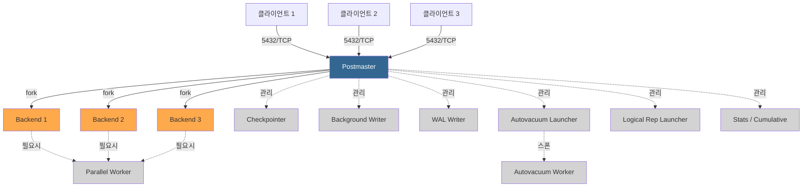
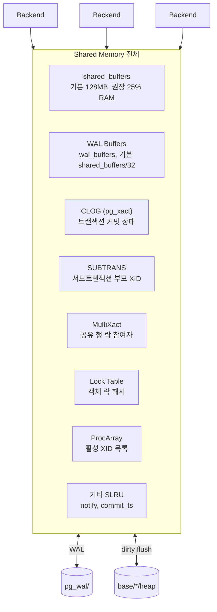
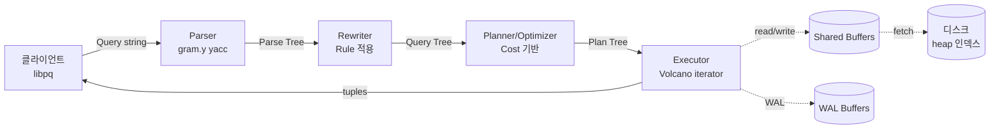
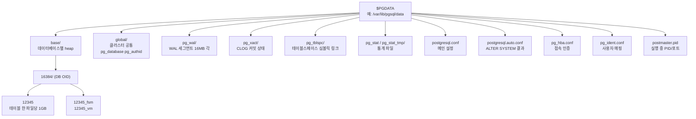

# 2장. 아키텍처와 프로세스 모델

PostgreSQL은 **프로세스 기반 멀티태스킹 DBMS**다. MySQL이나 Oracle이 스레드 기반인 것과 대비된다. 이 결정은 1986년 Berkeley POSTGRES 시절부터 유지되어 온 것이며, 안정성(격리) vs 성능(컨텍스트 스위치) 트레이드오프에서 **안정성을 택한 결과**다. 이 장에서는 PostgreSQL 서버가 뜨는 순간부터 쿼리를 처리하기까지의 전체 경로를 해부한다.

---

## 2.1 프로세스 모델

### 2.1.1 Postmaster — 모든 것의 루트

`pg_ctl start`를 호출하면 **Postmaster**라는 최상위 프로세스가 뜬다. 이 프로세스의 역할은 단 하나: **감독관(supervisor)**.

```
$ ps -ef | grep postgres
postgres  1001    1  ... /usr/pgsql-17/bin/postgres -D /var/lib/pgsql/data  ← Postmaster
postgres  1005 1001  ... postgres: checkpointer
postgres  1006 1001  ... postgres: background writer
postgres  1007 1001  ... postgres: walwriter
postgres  1008 1001  ... postgres: autovacuum launcher
postgres  1009 1001  ... postgres: logical replication launcher
postgres  2001 1001  ... postgres: myuser mydb 10.0.0.5(54321) idle  ← Backend (클라이언트 연결)
```

Postmaster는 **쿼리를 직접 처리하지 않는다**. 자식 프로세스를 감시하고, 죽으면 재시작하거나 crash recovery를 트리거한다. 모든 접속 요청을 받아 새 **Backend 프로세스를 fork**한다.

### 2.1.2 Backend — 연결당 하나

클라이언트가 TCP 5432로 접속하면 Postmaster가 `fork()`를 호출해 **Backend 프로세스**를 만든다. 이후 클라이언트와 Backend는 직접 소켓으로 통신하며, Postmaster는 관여하지 않는다.

**핵심 결과**: 연결 1개 = 프로세스 1개 = 약 5~10MB 메모리. 10,000 커넥션을 열면 수십 GB 메모리가 증발한다. 이것이 **pgBouncer 같은 connection pooler가 필수인 이유**(2.4절).

### 2.1.3 보조 프로세스들

Postmaster가 관리하는 백그라운드 프로세스는 다음과 같다.

| 프로세스 | 역할 |
|----------|------|
| **Checkpointer** | 주기적으로 Shared Buffer의 dirty page를 디스크에 반영(체크포인트). |
| **Background Writer** | Shared Buffer에서 가장 오래된 dirty page를 선제적으로 디스크에 씀. |
| **WAL Writer** | WAL Buffer를 `pg_wal/`로 flush. COMMIT 시는 backend가 직접 fsync. |
| **Autovacuum Launcher** | Dead tuple이 임계치를 넘긴 테이블을 찾아 워커를 스폰. |
| **Autovacuum Worker** | VACUUM·ANALYZE 실제 수행. `autovacuum_max_workers`만큼 동시 실행(기본 3). |
| **Stats Collector** (~PG14) / **Cumulative Statistics System** (PG15+) | `pg_stat_*` 뷰 데이터 수집. PG15부터는 shared memory에 저장. |
| **Logical Replication Launcher/Worker** | 논리 복제 apply. |
| **Parallel Worker** | 병렬 쿼리 실행 시 동적으로 스폰. |
| **Archiver** | `archive_mode=on`일 때 WAL 세그먼트를 외부로 복사. |
| **WAL Receiver / WAL Sender** | 스트리밍 복제 수·발신측. |



"왜 프로세스인가"에 대한 답: **크래시 격리**. 한 Backend가 SIGSEGV로 죽어도 다른 연결은 살아남고, Postmaster는 공유 메모리가 오염되었는지 판단해 필요 시 전체 재시작한다. 스레드 모델이라면 한 스레드의 메모리 오염이 전체를 뒤흔든다.

---

## 2.2 Shared Memory 구성

모든 Backend가 공유하는 영역. `shm_open`·`mmap`으로 할당된다. `postgres -D ... -c shared_buffers=4GB`처럼 파라미터로 크기를 제어한다.



### 2.2.1 shared_buffers

**PostgreSQL이 디스크 블록(8KB 페이지)을 캐시하는 영역.** OS 페이지 캐시와는 별도의 계층이다(이중 캐시 문제는 OS가 거의 알아서 처리).

- 기본값 `128MB`. 프로덕션에서는 **물리 메모리의 20~25%** 가 보편적 출발점.
- 넘어서면 OS 캐시에 의존하는 편이 이득일 때가 많다(PG 내부 LRU는 단순한 clock sweep).
- PG15+ `pg_prewarm`으로 재시작 후 블록을 미리 로드 가능.

### 2.2.2 WAL Buffers

COMMIT 이전 WAL 레코드를 임시 저장. 기본은 `shared_buffers/32`, 최대 16MB. WAL 크기가 큰 워크로드(대량 INSERT·UPDATE)에서는 16MB로 고정이 안전하다.

### 2.2.3 CLOG(pg_xact) · SUBTRANS · MultiXact · SLRU

**CLOG(Commit Log)**: 모든 XID(Transaction ID)의 상태(in-progress / committed / aborted / sub-committed)를 비트 2개로 저장. MVCC 가시성 판단의 필수 경로(3장).

**SUBTRANS**: 서브트랜잭션(SAVEPOINT) 부모 XID 매핑.

**MultiXact**: 같은 행에 여러 트랜잭션이 공유 락을 건 경우의 참여자 목록.

이들은 모두 **SLRU(Simple LRU)** 버퍼로 관리되며 `$PGDATA/pg_xact/`, `pg_subtrans/`, `pg_multixact/` 디렉터리에 페이지 단위로 저장된다.

### 2.2.4 Lock Table · ProcArray

**Lock Table**: `LOCK TABLE`·`SELECT FOR UPDATE`·DDL 등이 잡는 **heavy-weight lock**의 해시 테이블. 모든 Backend가 공유. `max_locks_per_transaction` × `max_connections`로 크기 결정.

**ProcArray**: 지금 이 순간 **살아 있는 트랜잭션의 XID 목록**. MVCC 스냅샷을 뜰 때 이 배열을 스캔해 "나보다 오래된 XID 중 아직 미커밋인 것"을 찾는다. 긴 트랜잭션이 여기를 점유하면 모든 snapshot 계산이 느려진다.

---

## 2.3 클라이언트 요청 흐름: Parse → Rewrite → Plan → Execute

한 SELECT가 클라이언트에서 결과를 받기까지 백엔드에서 벌어지는 일.



### 2.3.1 Parse

**Lexer(flex)** + **Parser(bison/yacc, `src/backend/parser/gram.y`)** 로 쿼리 문자열을 **Parse Tree**로 변환한다. 문법 오류는 이 단계에서 검출된다.

- `PREPARE`·Prepared Statement는 파싱을 캐시해 재사용.
- `pg_stat_statements`는 normalized query(상수가 `$1`로 치환된 형태)의 해시를 집계.

### 2.3.2 Rewrite

**Rule System**이 개입한다. 주로 **View**를 기반 테이블 쿼리로 치환하는 역할.

```sql
CREATE VIEW active_users AS SELECT * FROM users WHERE status = 'active';
SELECT id FROM active_users WHERE country = 'KR';
-- Rewriter가 다음으로 치환:
-- SELECT id FROM users WHERE status = 'active' AND country = 'KR';
```

### 2.3.3 Plan/Optimize

**쿼리 플래너**(`src/backend/optimizer/`)가 **Cost 기반**으로 실행 계획을 결정한다.

- **통계** 입력: `pg_statistic`의 히스토그램·distinct·correlation.
- **접근 경로** 생성: Seq Scan / Index Scan / Bitmap Heap Scan / Index Only Scan.
- **조인 순서**: `join_collapse_limit`(기본 8) 이하는 DP(Dynamic Programming), 초과는 GEQO.
- **조인 방식**: Nested Loop / Hash Join / Merge Join.
- **Cost 모델**: `seq_page_cost=1.0`, `random_page_cost=4.0`(SSD면 `1.1` 권장), `cpu_tuple_cost=0.01` 등.

### 2.3.4 Execute

**Volcano(iterator) 모델**. Plan Tree의 루트 노드에서 `ExecProcNode()`를 호출하면, 각 노드는 한 튜플을 반환하고 자식 노드에 재귀적으로 요청한다.

- 병렬 쿼리는 `Gather`·`Gather Merge` 노드로 부모 노드가 병렬 워커의 튜플을 수집.
- **JIT**(LLVM 기반, PG11+)이 조건 평가·튜플 deform을 기계어로 컴파일.
- Shared Buffer에 없는 블록은 `ReadBuffer`가 디스크에서 로드.

---

## 2.4 Connection Pooling과 pgBouncer

"Backend = 프로세스"라는 구조는 **connection 급증을 허용하지 않는다**. 10,000개의 연결은 10,000개의 프로세스, 수십 GB의 메모리, 그리고 ProcArray·Lock 스캔의 급격한 악화를 의미한다.

공식 문서와 커뮤니티 합의: **`max_connections`는 대략 200~500 수준으로 두고, 그 앞에 pooler를 둔다.**

### pgBouncer 모드

| 모드 | 설명 | 주의 |
|------|------|------|
| **session** | 클라이언트 연결과 backend 연결을 1:1로 연결, 세션 종료까지 유지 | 기본과 동일한 의미. Pool 효과 미미. |
| **transaction** | 트랜잭션 단위로 backend 재할당 | **권장**. 세션 변수(`SET`)·prepared statement 제약 주의. |
| **statement** | 쿼리 단위로 재할당 | 트랜잭션 불가. 거의 사용 안 함. |

Transaction mode에서는 `SET`·`LISTEN/NOTIFY`·명시적 `PREPARE` 같은 세션 상태가 깨질 수 있다. 앱 프레임워크의 "prepared statement cache"를 끄거나 pgBouncer `server_reset_query`로 초기화해야 한다.

---

## 2.5 PGDATA 디렉터리 구조

`initdb`가 만드는 데이터 디렉터리의 핵심 구조.



| 경로 | 내용 |
|------|------|
| `base/<db_oid>/<rel_filenode>` | **테이블·인덱스 본체**. 1GB 단위로 분할(`<filenode>.1`, `.2`...). |
| `base/<db_oid>/<filenode>_fsm` | Free Space Map. 페이지별 빈 공간 추적. |
| `base/<db_oid>/<filenode>_vm` | Visibility Map. 4장에서 심화. |
| `global/` | `pg_database`, `pg_authid` 같은 **클러스터 공통 카탈로그**. |
| `pg_wal/` | WAL 세그먼트. 기본 16MB/파일. 이름: `000000010000000000000001`(타임라인·LSN). |
| `pg_xact/` | CLOG. XID 커밋 상태 비트맵. |
| `pg_tblspc/` | 외부 테이블스페이스로의 심볼릭 링크. |
| `pg_stat/`, `pg_stat_tmp/` | 통계 파일(PG14 이하는 `pg_stat_tmp`, PG15+는 주로 shared memory). |
| `postgresql.conf` | 메인 설정. 직접 편집. |
| `postgresql.auto.conf` | `ALTER SYSTEM`이 덮어쓰는 오버라이드. **`postgresql.conf`보다 우선.** |
| `pg_hba.conf` | Host-Based Authentication. 어느 IP/사용자/DB가 어떤 방식으로 접속 가능한지. |
| `pg_ident.conf` | OS 사용자 → PG 사용자 매핑. |
| `postmaster.pid` | 실행 중인 Postmaster의 PID·포트·시작 시각. |

### 물리 파일 찾기

특정 테이블의 실제 파일 경로를 알고 싶을 때:

```sql
SELECT pg_relation_filepath('orders');
-- base/16384/24576
```

---

## 2.6 설정 계층

동일 파라미터가 여러 곳에서 지정될 수 있다. 우선순위가 명확하다.

```
    높은 우선순위
        ▲
        │  ① SET(세션) / SET LOCAL(트랜잭션)
        │  ② ALTER ROLE ... SET
        │  ③ ALTER DATABASE ... SET
        │  ④ postgresql.auto.conf   ← ALTER SYSTEM
        │  ⑤ postgresql.conf        ← 사람이 편집
        │  ⑥ 서버 시작 옵션(-c)
        │  ⑦ 컴파일 타임 기본값
        ▼
    낮은 우선순위
```

### 대표 명령

```sql
-- 현재 세션만
SET work_mem = '256MB';

-- 이 트랜잭션만 (BEGIN 내부에서)
SET LOCAL statement_timeout = '30s';

-- 특정 사용자 접속 시 항상 적용
ALTER ROLE analyst SET work_mem = '512MB';

-- 특정 DB에 접속 시 항상 적용
ALTER DATABASE reporting SET default_statistics_target = 1000;

-- 서버 전역(postgresql.auto.conf에 기록)
ALTER SYSTEM SET shared_buffers = '4GB';
SELECT pg_reload_conf();  -- reload만으로 반영되는 파라미터도 있고
                          -- shared_buffers처럼 재시작이 필요한 것도 있다
```

### 재시작 필요 vs reload 충분

```sql
-- pg_settings의 context로 확인
SELECT name, setting, context FROM pg_settings
WHERE name IN ('shared_buffers', 'work_mem', 'max_connections');

--       name        |   setting   |   context
-- -------------------+-------------+------------
--  max_connections  | 200         | postmaster  ← 재시작 필요
--  shared_buffers   | 524288      | postmaster  ← 재시작 필요
--  work_mem         | 4096        | user        ← SET으로도 가능
```

| context | 의미 |
|---------|------|
| `internal` | 변경 불가 |
| `postmaster` | 서버 재시작 필요 |
| `sighup` | `pg_reload_conf()` 만으로 반영 |
| `backend` | 새 세션부터 |
| `superuser` | 슈퍼유저 SET 가능 |
| `user` | 모든 사용자 SET 가능 |

---

## 2.7 Key Takeaways

| 항목 | 요약 |
|------|------|
| **프로세스 모델** | Postmaster가 접속마다 Backend를 fork. 크래시 격리가 목적. |
| **보조 프로세스** | Checkpointer, BGWriter, WAL Writer, Autovacuum(Launcher+Worker) 등. |
| **Shared Memory** | shared_buffers가 메인. 외에 WAL Buffers, CLOG, Lock Table, ProcArray. |
| **Connection 한계** | 프로세스 기반이므로 수천 이상은 pgBouncer 필수. |
| **쿼리 경로** | Parse → Rewrite → Plan → Execute. Rule은 Rewrite 단계. |
| **PGDATA** | base/ global/ pg_wal/ pg_xact/ + postgresql.conf / pg_hba.conf. |
| **설정 우선순위** | SET > ALTER ROLE/DB > auto.conf > conf. auto.conf는 ALTER SYSTEM 전용. |

---

## 공식 문서 참조

- **서버 프로세스 개요**: https://www.postgresql.org/docs/current/tutorial-arch.html
- **Backend 및 프로세스**: `src/backend/README` (공식 소스)
- **Shared Memory / 설정**: https://www.postgresql.org/docs/current/runtime-config-resource.html
- **Connection Settings**: https://www.postgresql.org/docs/current/runtime-config-connection.html
- **쿼리 처리 내부**: https://www.postgresql.org/docs/current/overview.html
- **파일 레이아웃**: https://www.postgresql.org/docs/current/storage-file-layout.html
- **ALTER SYSTEM**: https://www.postgresql.org/docs/current/sql-altersystem.html
- **pg_hba.conf**: https://www.postgresql.org/docs/current/auth-pg-hba-conf.html
- **pgBouncer**: https://www.pgbouncer.org/
- **한글 문서(13)**: https://postgresql.kr/docs/13/tutorial-arch.html

---

*다음 장: 3장. MVCC — PostgreSQL 성능과 잠금의 비밀*
