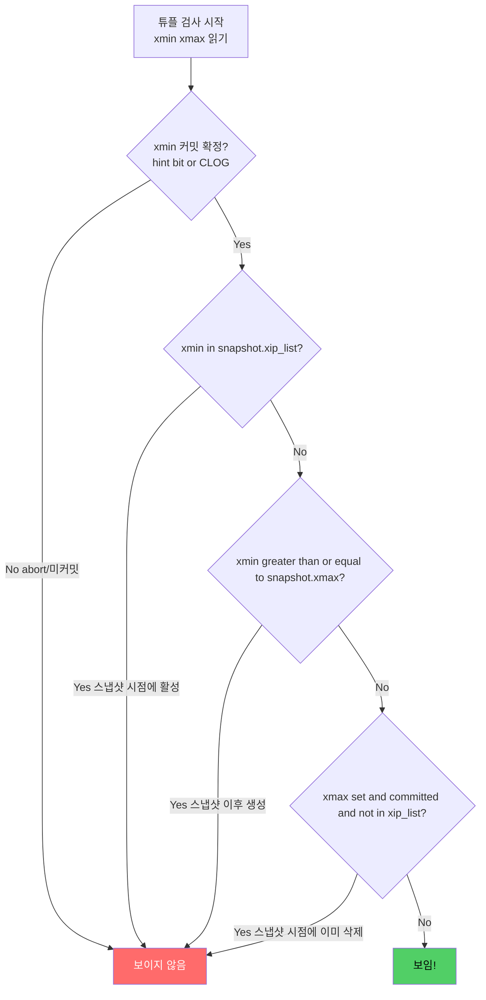
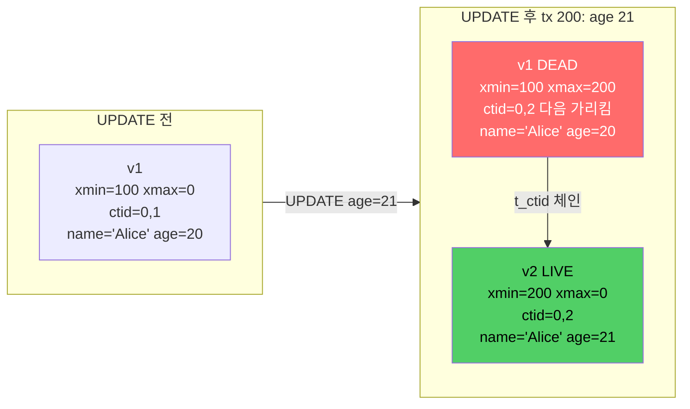
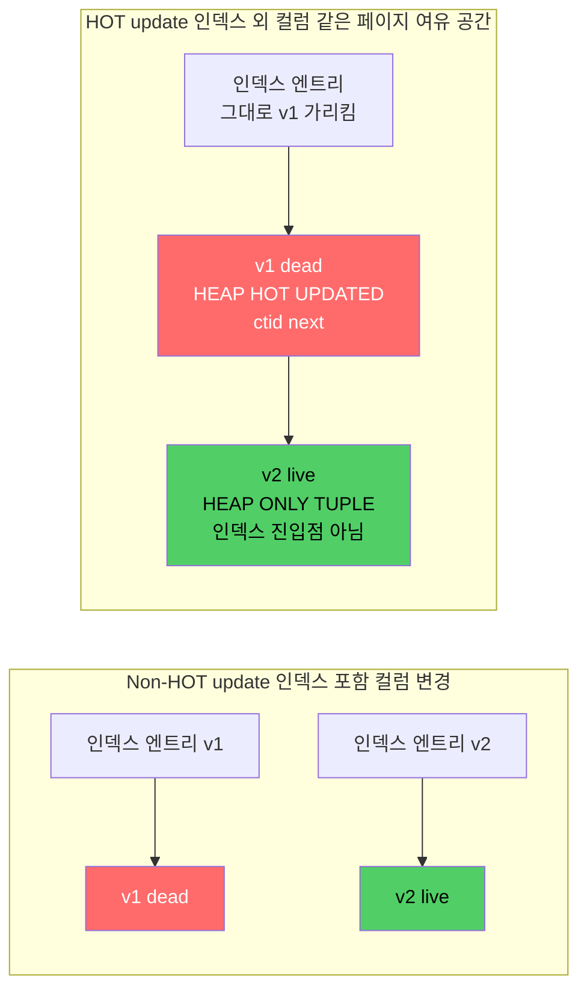
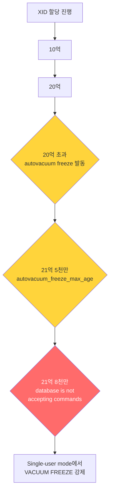

# 3장. MVCC — PostgreSQL 성능과 잠금의 비밀

PostgreSQL을 다른 RDBMS와 구분 짓는 단 하나의 메커니즘을 꼽는다면 **MVCC(Multi-Version Concurrency Control)** 다. MVCC는 동시성 제어 이론이면서, 동시에 PostgreSQL의 **Bloat·VACUUM·XID Wraparound** 같은 거의 모든 운영 이슈의 원천이기도 하다. 3장은 이 가이드의 심장이다. 여기서 놓친 개념은 4장(Storage)·8장(VACUUM)·9장(WAL)에서 대가를 치른다.

---

## 3.1 왜 MVCC인가: "읽기가 쓰기를 막지 않는다"

전통적인 **Two-Phase Locking(2PL)** 방식에서는 읽기(shared lock)와 쓰기(exclusive lock)가 서로를 막는다. 한 트랜잭션이 행을 읽는 동안 다른 트랜잭션의 UPDATE가 대기한다. 반대도 마찬가지다.

PostgreSQL 공식 문서(postgresql.org/docs/current/mvcc-intro.html)의 단 한 문장이 MVCC의 이점을 압축한다.

> "In MVCC locks acquired for querying (reading) data do not conflict with locks acquired for writing data, and so reading never blocks writing and writing never blocks reading."

**핵심 아이디어**: 데이터를 수정하는 대신 **새 버전(version)** 을 만든다. 각 트랜잭션은 자신만의 **일관된 스냅샷(snapshot)** 을 본다. 어떤 버전이 "내게 보이는지"는 튜플 헤더의 메타데이터로 판단한다.

결과:
- **SELECT는 락을 잡지 않는다**(FOR UPDATE 등을 명시하지 않는 한).
- **UPDATE는 새 버전을 쓴다** → 이전 버전은 "dead tuple"로 남는다 → **VACUUM이 이를 회수한다**.
- **대가**: Bloat, XID 관리, VACUUM 운영 오버헤드.

---

## 3.2 튜플 헤더 — MVCC의 물리적 기록

MVCC를 떠받치는 것은 모든 heap 튜플에 붙는 **23바이트 헤더**(`HeapTupleHeaderData`)다. 공식 문서(postgresql.org/docs/current/storage-page-layout.html)에 정의된 구조:

| 필드 | 크기 | 의미 |
|------|------|------|
| `t_xmin` | 4 B | 이 행을 **INSERT한 트랜잭션 XID** |
| `t_xmax` | 4 B | 이 행을 **DELETE/UPDATE한 트랜잭션 XID** (없으면 0) |
| `t_cid` | 4 B | 같은 트랜잭션 내 **Command ID**(`t_xvac`와 오버레이) |
| `t_ctid` | 6 B | 이 튜플의 **현재 물리 주소**, 또는 UPDATE 후 **후속 버전의 주소** |
| `t_infomask2` | 2 B | 컬럼 수 + 플래그 |
| `t_infomask` | 2 B | **플래그 비트**(HEAP_XMIN_COMMITTED, HEAP_XMAX_INVALID, HEAP_HOT_UPDATED 등) |
| `t_hoff` | 1 B | 헤더 끝(= 실제 데이터 시작) 오프셋 |

이 중 MVCC 판단에 쓰이는 핵심은 **`t_xmin`, `t_xmax`, `t_cid`, `t_ctid`** 넷이다.

### 3.2.1 xmin · xmax의 의미

```
INSERT 직후:
  ┌────────────────────────────────────────────────────┐
  │ xmin=100, xmax=0, ctid=(0,1) │ 데이터: "Alice" 100 │
  └────────────────────────────────────────────────────┘

트랜잭션 200이 DELETE 실행:
  ┌────────────────────────────────────────────────────┐
  │ xmin=100, xmax=200, ctid=(0,1)│ 데이터: "Alice" 100│
  └────────────────────────────────────────────────────┘
                    ▲
        "200번이 나를 지웠다"고 표시만 한다.
        실제 물리적 삭제는 VACUUM이 할 일.
```

### 3.2.2 t_infomask 힌트 비트(Hint Bits)

가시성 판단 시마다 CLOG(pg_xact)를 조회하면 너무 느리다. 그래서 PostgreSQL은 **힌트 비트**를 튜플 헤더에 캐시한다.

| 비트 | 의미 |
|------|------|
| `HEAP_XMIN_COMMITTED` | xmin 트랜잭션이 커밋됨(확정) |
| `HEAP_XMIN_INVALID` | xmin이 abort됨 |
| `HEAP_XMAX_COMMITTED` | xmax가 커밋됨(행이 완전히 삭제됨) |
| `HEAP_XMAX_INVALID` | xmax가 abort 또는 null |
| `HEAP_HOT_UPDATED` | 이 튜플이 HOT update로 대체됨 |
| `HEAP_ONLY_TUPLE` | HOT 체인의 중간 튜플(인덱스 진입점 아님) |

힌트 비트는 **처음 방문하는 쿼리가 CLOG를 보고 세팅한다**. 즉 "읽기만 했는데 페이지가 dirty"가 되는 현상이 여기서 생긴다.

---

## 3.3 XID와 Snapshot

### 3.3.1 XID(Transaction ID)

- **32비트 정수**. 즉 약 42억(2³²)개까지만 존재.
- 0, 1, 2는 예약: `InvalidTransactionId`, `BootstrapTransactionId`, `FrozenTransactionId`.
- 실제 할당은 3부터 시작해 순차 증가.

42억은 큰 숫자 같지만 초당 1만 트랜잭션이면 **5일이면 소진**된다. 이 때문에 **XID Wraparound**라는 PostgreSQL 특유의 운영 주제가 존재한다(3.7절).

### 3.3.2 Snapshot의 구조

한 트랜잭션이 시작될 때 **snapshot**이 만들어진다(격리 수준에 따라 매 SQL마다 새로 만들 수도). Snapshot은 세 가지로 구성된다.

| 필드 | 의미 |
|------|------|
| `xmin` | 스냅샷 시점에 **아직 실행 중(in-progress)인 트랜잭션 중 가장 오래된 XID** |
| `xmax` | 스냅샷 시점에 **아직 할당되지 않은 첫 XID**(= 이 이상은 모두 미래) |
| `xip_list` | `xmin ≤ xid < xmax` 범위에서 **스냅샷 시점에 활성 중이던 XID 배열** |

쿼리 실행 중 `pg_snapshot` 함수로 직접 들여다볼 수 있다.

```sql
SELECT txid_current_snapshot();
--  txid_current_snapshot
-- -----------------------
--  10023:10025:10024
--   xmin  xmax   xip_list
```

위 예: XID 10023 미만은 모두 완료, 10025 이상은 미래, 10024는 활성 중.

### 3.3.3 ProcArray

활성 스냅샷을 계산하려면 **지금 이 순간의 활성 트랜잭션 목록**이 필요하다. 이것이 shared memory의 **ProcArray**(2장 참조). 스냅샷을 뜨는 것은 ProcArray를 스캔해 `xip_list`를 만드는 행위다. 긴 트랜잭션이 많아질수록 이 비용이 올라간다.

---

## 3.4 가시성 규칙

"이 튜플이 내 트랜잭션에 보이는가"를 결정하는 로직. 단순화하면 다음 흐름이다.



핵심 원칙(정리):

1. `xmin`이 커밋되지 않았거나 abort면 **보이지 않음**.
2. `xmin`이 스냅샷의 활성 리스트에 있으면 **보이지 않음**(그때 아직 진행 중이었음).
3. `xmin`이 스냅샷 `xmax`보다 크거나 같으면 **보이지 않음**(스냅샷 이후 생성).
4. `xmax`가 커밋되어 있고 스냅샷의 활성 리스트에 없고 스냅샷 `xmax`보다 작으면 **보이지 않음**(이미 삭제됨).
5. 위에 해당하지 않으면 **보임**.

자기 자신의 XID도 특별 처리된다. 내가 방금 INSERT한 행은 `xmin = MyTxId`이므로 당연히 보여야 한다. 같은 트랜잭션 내의 **command id(cid)**로 더 세밀하게 구분한다(같은 트랜잭션에서 INSERT한 직후 SELECT는 `cid > xmin_cid`여야 보임).

### 3.4.1 격리 수준과 스냅샷

| 격리 수준 | 스냅샷 갱신 시점 |
|-----------|------------------|
| **READ COMMITTED** (기본) | **매 SQL 문장마다** 새 스냅샷 |
| **REPEATABLE READ** | **트랜잭션 시작 시** 고정 |
| **SERIALIZABLE** | REPEATABLE READ + SSI(Predicate lock) |

이는 7장에서 심화한다. 여기서의 핵심: 스냅샷은 **MVCC 가시성 판단의 유일한 입력**이라는 것.

---

## 3.5 UPDATE가 새 버전을 만든다 → Dead Tuple → VACUUM

### 3.5.1 UPDATE의 실제 동작

**중요**: PostgreSQL에서 UPDATE는 "제자리 수정"이 아니다. **기존 튜플을 dead로 마크하고 새 튜플을 쓴다**.



결과:
- **이전 버전**: `t_xmax = 200`으로 마크됨. 데이터는 여전히 페이지에 남아 있다. **Dead tuple**.
- **새 버전**: 같은 페이지 또는 다른 페이지에 append. `t_xmin = 200`.
- **인덱스**: 새 버전을 가리키는 엔트리 추가(HOT update 예외, 3.6절).

### 3.5.2 Dead Tuple과 Bloat

스냅샷의 `xmin`보다 오래된 시점에 죽은(dead) 튜플은 이제 **아무도 볼 수 없다**. 그럼에도 페이지에 남아 있다. 이것이 **bloat**.

- 테이블이 UPDATE·DELETE로 dead tuple을 계속 쌓음
- VACUUM이 dead tuple을 회수해 free space로 만들지 않으면, 테이블 크기가 실제 필요량보다 커진다
- 인덱스도 같은 운명(인덱스 bloat)

### 3.5.3 VACUUM의 역할

```
VACUUM orders;
  ├─ 1) 각 페이지 스캔
  ├─ 2) "dead이고, 어떤 스냅샷에도 안 보이는" 튜플 식별
  ├─ 3) ItemId를 DEAD로 마크 → 공간 재사용 가능
  ├─ 4) 인덱스 엔트리도 제거
  ├─ 5) FSM·VM 갱신
  └─ 6) Freeze 필요한 튜플 처리(3.7)
```

VACUUM이 **dead tuple을 회수할 수 있는 기준**은 단 하나: **시스템에서 가장 오래된 스냅샷의 xmin보다 오래 전에 삭제된 튜플.** 긴 트랜잭션이 ProcArray에 남아 있으면 시스템 전체의 "OldestXmin"이 전진하지 못해, **VACUUM이 아무것도 회수하지 못하는** 상황이 벌어진다.

```sql
-- 오래된 활성 트랜잭션 찾기
SELECT pid, state, xact_start, query
FROM pg_stat_activity
WHERE state <> 'idle'
ORDER BY xact_start ASC NULLS LAST
LIMIT 5;
```

8장에서 VACUUM을 심화한다.

---

## 3.6 HOT Update와 fillfactor

**HOT(Heap-Only Tuple) update**는 MVCC로 인한 bloat·인덱스 부담을 완화하는 영리한 최적화다.

### 3.6.1 조건

UPDATE가 HOT이 되려면 **두 조건 모두** 만족해야 한다.

1. **수정된 컬럼 중 어느 것도 인덱스에 포함되어 있지 않다.**
2. **새 버전이 같은 페이지(Heap page)에 쓰일 공간이 있다.**

### 3.6.2 동작



HOT update의 이점:
- **인덱스 엔트리 추가 없음** → 인덱스 bloat 억제
- **인덱스 엔트리 수정 없음** → 쓰기 WAL 절감
- **VACUUM이 아닌 HOT chain pruning** 으로 dead tuple 회수 가능(페이지 내에서만)

인덱스는 여전히 `v1`의 ctid를 가리키지만, `v1`의 `t_ctid`가 `v2`를 가리키므로 **인덱스 스캔은 체인을 따라가서 v2에 도달**한다.

### 3.6.3 fillfactor

HOT의 (2)번 조건("같은 페이지에 공간")을 보장하려면 **페이지에 빈 공간을 미리 남겨 두어야 한다**. 이것이 `fillfactor`.

```sql
-- UPDATE가 잦은 테이블은 80~90% 사용, 10~20% 여유
ALTER TABLE orders SET (fillfactor = 80);
VACUUM FULL orders;  -- fillfactor는 이후 변경·재구성 시 적용됨

-- 확인
SELECT relname, reloptions FROM pg_class WHERE relname = 'orders';
```

| 테이블 성격 | 권장 fillfactor |
|-------------|-----------------|
| INSERT-only(로그·이벤트) | 100 (기본) |
| UPDATE 가끔 | 90 |
| UPDATE 빈번 | 80 (HOT 확률 극대화) |

**주의**: fillfactor를 낮추면 **테이블 크기가 커진다**. HOT update가 실제 발생하지 않는 워크로드(예: 인덱스 컬럼을 매번 수정)에서는 손해다.

### 3.6.4 HOT 비율 확인

```sql
SELECT relname,
       n_tup_upd AS total_updates,
       n_tup_hot_upd AS hot_updates,
       round(100.0 * n_tup_hot_upd / NULLIF(n_tup_upd, 0), 1) AS hot_pct
FROM pg_stat_user_tables
WHERE n_tup_upd > 0
ORDER BY n_tup_upd DESC;
```

`hot_pct`가 90%+면 건강, 50% 미만이면 인덱스 설계·fillfactor를 재검토.

---

## 3.7 XID Wraparound와 Freeze

### 3.7.1 문제

XID는 32비트. 약 21억(2³¹) 증가하면 **원형 비교(modulo 2³²)** 에서 "과거·미래 판정"이 역전된다. 즉 오래된 튜플이 "미래"로 보여 **무한대로 보이지 않게** 된다. 이것이 **XID Wraparound**.



### 3.7.2 Freeze: 해결책

"더 이상 나이 들 필요 없는" 튜플의 `t_xmin`을 **`FrozenTransactionId` (특수 값 2)** 로 치환한다. Frozen 튜플은 모든 현재·미래 트랜잭션에 **무조건 보인다**. wrap 시점을 지나도 안전.

- PG 9.4+는 실제로 XID를 덮어쓰지 않고 **`t_infomask`에 `HEAP_XMIN_FROZEN` 비트만 세팅**한다(WAL 절감, crash recovery 안전성).
- **Visibility Map**에 `all-frozen` 비트가 있어, VACUUM이 이 페이지를 건너뛸 수 있다(4장).

### 3.7.3 관련 파라미터

| 파라미터 | 기본값 | 의미 |
|----------|--------|------|
| `vacuum_freeze_min_age` | 50,000,000 | 이 나이 이상 XID는 VACUUM 중 freeze |
| `vacuum_freeze_table_age` | 150,000,000 | 이 나이 넘으면 전체 테이블 aggressive scan |
| `autovacuum_freeze_max_age` | 200,000,000 | 이 나이 넘으면 **anti-wraparound VACUUM** 강제 발동 |
| `vacuum_failsafe_age` (PG14+) | 1,600,000,000 | 이 나이 넘으면 인덱스 cleanup도 건너뛰며 freeze 강제 |

### 3.7.4 모니터링

```sql
-- 각 DB의 가장 오래된 XID가 wraparound까지 얼마나 남았나
SELECT datname,
       age(datfrozenxid) AS xid_age,
       2^31 - age(datfrozenxid) AS xids_until_wrap
FROM pg_database
ORDER BY age(datfrozenxid) DESC;

-- 테이블 단위
SELECT relname, age(relfrozenxid) AS age
FROM pg_class
WHERE relkind IN ('r','m','t')
ORDER BY age(relfrozenxid) DESC
LIMIT 10;
```

`xid_age`가 2억에 근접하면 즉시 조치(수동 `VACUUM FREEZE`). `troubleshooting/A2_xid_wraparound.md`에 대응 레시피.

---

## 3.8 MySQL InnoDB·Oracle Undo vs PostgreSQL In-heap

MVCC는 PostgreSQL만의 개념이 아니다. 하지만 **구현이 근본적으로 다르다**.

| 구분 | PostgreSQL | MySQL InnoDB | Oracle |
|------|------------|---------------|--------|
| 버전 저장 | **Heap 내부**에 새 튜플 append | **Undo log**(별도 영역)에 "이전 이미지" 기록 | **Undo segment**(tablespace) |
| UPDATE 비용 | 새 버전 write + 인덱스 엔트리(HOT 아니면) | 기존 행 in-place 수정 + undo record | 유사 |
| 과거 버전 조회 | 같은 heap의 옛 튜플 | Undo log 역순 적용으로 재구성 | 동일 |
| 회수 메커니즘 | **VACUUM** | **purge thread** | **undo retention·expire** |
| Bloat 위치 | **Heap 자체** | Undo log | Undo segment |
| 긴 트랜잭션 영향 | Dead tuple 회수 못 함 → 테이블 bloat | Undo 누적 → `ibdata1` bloat, "ORA-01555" 유사 | `ORA-01555 snapshot too old` |

### 3.8.1 트레이드오프

**PostgreSQL의 선택(in-heap)**
- 장점: UPDATE가 단순, 복제·크래시 복구 로직 일관, 과거 버전 조회 빠름.
- 단점: 테이블 bloat, VACUUM 운영 부담, 인덱스 엔트리 증가(HOT으로 완화).

**InnoDB·Oracle의 선택(undo)**
- 장점: 테이블 자체는 bloat 안 됨, 과거 조회 시 heap 스캔 불필요.
- 단점: 과거 버전 재구성 비용, 긴 트랜잭션이 undo를 폭증시킬 때 `snapshot too old`류 오류.

어느 쪽이 우월하지 않다. **운영 습관이 달라져야** 한다는 것이 핵심.

---

## 3.9 실무 관찰

### 3.9.1 pg_stat_user_tables

```sql
SELECT schemaname, relname,
       n_live_tup, n_dead_tup,
       n_tup_ins, n_tup_upd, n_tup_del, n_tup_hot_upd,
       last_autovacuum, last_autoanalyze
FROM pg_stat_user_tables
ORDER BY n_dead_tup DESC
LIMIT 20;
```

핵심 칼럼:
- `n_live_tup`/`n_dead_tup`: 라이브/데드 튜플 추정치.
- `n_tup_upd` vs `n_tup_hot_upd`: HOT 비율.
- `last_autovacuum`: 최근 자동 VACUUM 시각(NULL이면 한 번도 안 됐거나 통계 리셋됨).

### 3.9.2 pageinspect 확장

가장 생생한 관찰은 튜플 헤더를 직접 보는 것.

```sql
CREATE EXTENSION pageinspect;

-- 특정 테이블의 0번 페이지의 튜플 헤더
SELECT lp, t_xmin, t_xmax, t_ctid, t_infomask::bit(16) AS infomask
FROM heap_page_items(get_raw_page('orders', 0))
LIMIT 10;
```

`t_infomask` 비트에서 `HEAP_HOT_UPDATED`, `HEAP_ONLY_TUPLE`, `HEAP_XMIN_FROZEN` 등을 확인할 수 있다.

### 3.9.3 pgstattuple 확장

```sql
CREATE EXTENSION pgstattuple;

SELECT * FROM pgstattuple('orders');
--  table_len | tuple_count | tuple_len | tuple_percent | dead_tuple_count |
--  dead_tuple_len | dead_tuple_percent | free_space | free_percent
```

`dead_tuple_percent`가 20%를 넘으면 bloat 의심, 50%+면 즉시 `VACUUM` 또는 `VACUUM FULL`·`pg_repack` 검토.

### 3.9.4 긴 트랜잭션 감시

```sql
-- 5분 이상 idle in transaction
SELECT pid, usename, application_name,
       now() - xact_start AS tx_age,
       now() - state_change AS idle_age,
       state, query
FROM pg_stat_activity
WHERE state = 'idle in transaction'
  AND now() - state_change > INTERVAL '5 minutes';
```

운영 팁: `idle_in_transaction_session_timeout = '10min'` 로 자동 종료.

---

## 3.10 Key Takeaways

| 항목 | 요약 |
|------|------|
| **왜 MVCC** | "읽기가 쓰기를 막지 않고, 쓰기가 읽기를 막지 않는다". |
| **튜플 헤더** | 23B. xmin·xmax·cid·ctid·infomask가 가시성의 원천. |
| **스냅샷** | `xmin:xmax:xip_list` 구조. ProcArray 스캔으로 생성. |
| **가시성 규칙** | xmin 커밋 & 스냅샷 시점에 안 열려 있음 & xmax 미커밋/null. |
| **UPDATE** | 새 튜플 생성. 옛 튜플은 dead → VACUUM이 회수. |
| **HOT Update** | 인덱스 컬럼 미수정 + 같은 페이지 여유 → 인덱스 엔트리 유지. fillfactor로 유도. |
| **XID Wraparound** | 32비트 제한. Freeze로 회피. autovacuum_freeze_max_age 모니터링 필수. |
| **InnoDB/Oracle 차이** | In-heap vs Undo log. PostgreSQL은 VACUUM 운영 관점이 다르다. |

---

## 공식 문서 참조

- **MVCC 서문**: https://www.postgresql.org/docs/current/mvcc-intro.html
- **트랜잭션 격리**: https://www.postgresql.org/docs/current/transaction-iso.html
- **튜플/페이지 레이아웃**: https://www.postgresql.org/docs/current/storage-page-layout.html
- **Routine Vacuuming**: https://www.postgresql.org/docs/current/routine-vacuuming.html
- **Preventing Transaction ID Wraparound Failures**: https://www.postgresql.org/docs/current/routine-vacuuming.html#VACUUM-FOR-WRAPAROUND
- **HOT 설명(커밋 메시지·README)**: `src/backend/access/heap/README.HOT`
- **pageinspect**: https://www.postgresql.org/docs/current/pageinspect.html
- **pgstattuple**: https://www.postgresql.org/docs/current/pgstattuple.html
- **한글(13)**: https://postgresql.kr/docs/13/mvcc.html

---

*다음 장: 4장. Heap, Tuple, Page, TOAST — MVCC가 실제로 디스크에 쌓이는 방식*
