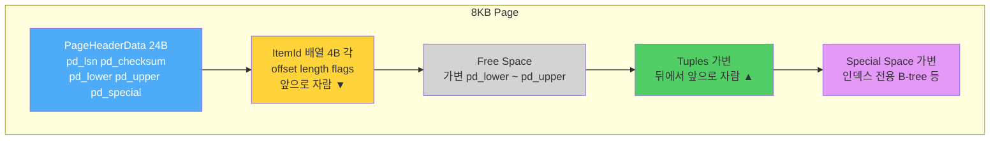
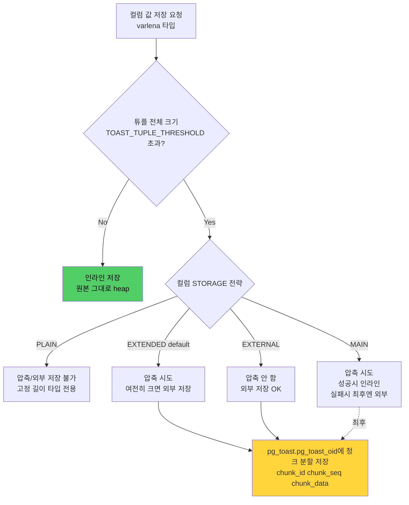
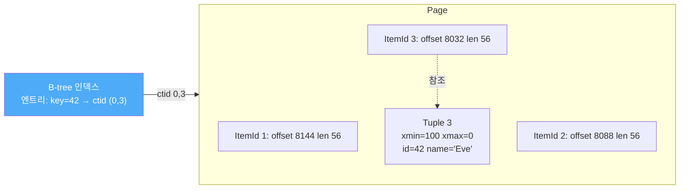

# 4장. Heap, Tuple, Page, TOAST

3장에서 MVCC의 논리를 다뤘다면, 4장은 **MVCC가 디스크 위에 실제로 어떻게 놓이는지**를 다룬다. PostgreSQL 스토리지의 기본 단위는 **8KB 페이지(block)** 다. 이 페이지 안에 튜플이 어떻게 배치되고, 2KB 넘는 값은 어떻게 처리되며(`TOAST`), VM·FSM이 어떤 역할을 하는지가 이 장의 주제다. 4장을 모르면 5장(인덱스), 8장(VACUUM), 9장(WAL) 모두 관찰 대상이 흐릿해진다.

---

## 4.1 페이지(Page / Block) 구조 — 8KB의 해부

PostgreSQL의 모든 heap·index 파일은 **고정 크기 페이지**로 구성된다. 공식 문서(postgresql.org/docs/current/storage-page-layout.html)의 기본값:

- **페이지 크기: 8KB** (`BLCKSZ`, 컴파일 타임 상수. 보통 그대로 둠)
- **테이블 파일: 1GB 단위 세그먼트** (`RELSEG_SIZE = 131072` 블록)
- `base/<db>/<filenode>`, `<filenode>.1`, `<filenode>.2` 로 연속.

### 4.1.1 페이지 내부 5개 영역



| 영역 | 크기 | 설명 |
|------|------|------|
| **PageHeader** | 24B | LSN·checksum·free space 포인터(`pd_lower`, `pd_upper`)·페이지 버전 |
| **ItemId (line pointer)** | 4B 각 | 튜플의 **offset + length**. 앞쪽에서 자람. |
| **Free space** | 가변 | `pd_lower`~`pd_upper` 사이. 튜플이 찰수록 줄어듦. |
| **Tuples** | 가변 | **페이지 끝에서 앞으로** 쌓임. HeapTupleHeader + 데이터. |
| **Special space** | 가변 | 힙은 0. 인덱스(B-tree 등)가 포인터·메타 저장. |

### 4.1.2 왜 양 끝에서 자라나

ItemId는 앞에서, 튜플은 뒤에서 자란다. **왜?**
- ItemId 배열은 인덱스 순서대로 유지되어야 한다(ctid의 두 번째 값 = ItemId 번호).
- 튜플 본체는 가변 길이이므로 뒤쪽에 append가 쉽다.
- `pd_lower`(ItemId 끝) >= `pd_upper`(튜플 시작)가 되면 **페이지 풀(full)**. 새 튜플은 다른 페이지로.

### 4.1.3 PageHeaderData 필드

```c
typedef struct PageHeaderData {
    PageXLogRecPtr pd_lsn;        // 8B 이 페이지의 마지막 WAL LSN
    uint16  pd_checksum;          // 2B 체크섬 (initdb -k)
    uint16  pd_flags;             // 2B 플래그
    LocationIndex pd_lower;       // 2B 자유 공간 시작
    LocationIndex pd_upper;       // 2B 자유 공간 끝
    LocationIndex pd_special;     // 2B special 영역 시작
    uint16  pd_pagesize_version;  // 2B 페이지 크기 + 레이아웃 버전(현재 4)
    TransactionId pd_prune_xid;   // 4B HOT pruning 후보 XID
    ItemIdData  pd_linp[FLEXIBLE_ARRAY];
} PageHeaderData;
```

`pd_lsn`은 WAL·Checkpoint 동기화의 뿌리다. 크래시 복구 시 "이 페이지가 어느 시점까지 적용되었나"의 기준.

---

## 4.2 튜플 구조 — HeapTupleHeader + 데이터

### 4.2.1 튜플 레이아웃

```
┌─────────────────────────────────────────────────────────────────────┐
│                      HeapTupleHeaderData (23B)                      │
│  t_xmin(4) | t_xmax(4) | t_cid/xvac(4) | t_ctid(6) |                │
│  t_infomask2(2) | t_infomask(2) | t_hoff(1)                         │
├─────────────────────────────────────────────────────────────────────┤
│   NullBitmap (선택, HEAP_HASNULL 시 컬럼 수에 비례)                   │
├─────────────────────────────────────────────────────────────────────┤
│   Padding (MAXALIGN, 8바이트 정렬)                                   │
├─────────────────────────────────────────────────────────────────────┤
│   User Data (컬럼별 값, 타입별 alignment 규칙)                        │
└─────────────────────────────────────────────────────────────────────┘
```

- **23바이트 최소 헤더**(3장 3.2 참조). `t_xvac`는 `t_cid`와 **union**(동시에 둘 다 안 쓰임).
- **NullBitmap**: `HEAP_HASNULL` 플래그가 설정된 경우에만 존재. 컬럼 수만큼의 비트.
- **`t_hoff`**: 헤더 끝(= 사용자 데이터 시작) 오프셋. MAXALIGN 반영.

### 4.2.2 Alignment의 비용

PostgreSQL은 **`typalign`** 에 따라 컬럼을 정렬한다. `integer`는 4B, `bigint`는 8B, `numeric`은 4B 정렬 등. 이 때문에 **컬럼 순서가 잘못되면 padding으로 수 바이트가 낭비**된다.

```sql
-- 비효율적 순서 (tinyint → bigint → tinyint)
CREATE TABLE bad (a smallint, b bigint, c smallint);
-- 2B + 6B padding + 8B + 2B + 6B padding = 24B

-- 효율적 순서
CREATE TABLE good (b bigint, a smallint, c smallint);
-- 8B + 2B + 2B + 4B padding = 16B
```

대규모 테이블(수억 행)에서는 컬럼 재배치로 수 GB를 절약한 사례가 흔하다. 운영 팁: **큰 정렬 요구 타입(8B) → 작은 타입(2B) → 가변 타입** 순.

### 4.2.3 MAXALIGN

대부분 64비트 플랫폼에서 `MAXALIGN = 8`. 이 때문에 튜플 전체 크기도 8의 배수로 올림된다. 매우 작은 행(예: 4B 정수 하나)이어도 **최소 32B** 정도를 차지한다.

---

## 4.3 fillfactor와 HOT Update의 관계

fillfactor는 3장에서 MVCC 관점에서 다뤘다. 여기서는 **페이지 관점**에서 다시 본다.

```
fillfactor = 100 (기본)
┌────────────────────────────────────────┐
│ Header │ ItemIds │████████████████████ │  ← 꽉 채움
└────────────────────────────────────────┘
UPDATE → 같은 페이지에 공간 없음 → 새 페이지로 이동 → Non-HOT

fillfactor = 80
┌────────────────────────────────────────┐
│ Header │ ItemIds │████████████░░░░░░░░│  ← 20% 비움
└────────────────────────────────────────┘
UPDATE → 같은 페이지에 여유 → HOT update 성공 → 인덱스 유지
```

HOT update는 다음을 절감한다.
- **인덱스 엔트리 추가·VACUUM**: 없음.
- **WAL**: 새 튜플 + 힙 페이지 수정만, 인덱스 WAL 없음.
- **Bloat**: HOT pruning으로 페이지 내 dead tuple 즉시 회수 가능(VACUUM 대기 불필요).

HOT pruning은 **페이지를 열 때마다 기회가 있으면 자동 수행**된다. `n_tup_hot_upd` 비율로 효과 측정.

---

## 4.4 TOAST — The Oversized-Attribute Storage Technique

한 튜플은 한 페이지에 들어가야 한다. 그런데 8KB 페이지에 어떻게 JSONB 50KB나 텍스트 1MB를 넣을까? **TOAST** 가 답이다.

### 4.4.1 임계치

공식 문서(postgresql.org/docs/current/storage-toast.html)의 기본값:

| 상수 | 기본 | 의미 |
|------|------|------|
| `TOAST_TUPLE_THRESHOLD` | ~2KB | 튜플이 이 크기를 넘으면 TOAST 발동 |
| `TOAST_TUPLE_TARGET` | ~2KB | TOAST 후 튜플의 목표 크기(테이블별 조정 가능) |
| `TOAST_MAX_CHUNK_SIZE` | ~2000B | **한 페이지에 4 chunk가 들어가도록** 산정 |
| 최대 값 크기 | 1GB (2³⁰-1) | `varlena` 헤더의 2비트 제한 |

"2KB"라는 숫자의 근거: 8KB 페이지에 **최소 4개의 튜플은 들어가도록** (`BLCKSZ / 4`).

### 4.4.2 4가지 저장 전략



| 전략 | 압축 | 외부 저장 | 비고 |
|------|------|-----------|------|
| **PLAIN** | X | X | 고정 길이 타입(`integer` 등)의 기본. TOAST 안 함. |
| **EXTENDED** (기본) | O | O | 대부분의 `text`·`jsonb`·`bytea`의 기본. |
| **EXTERNAL** | **X** | O | `substr()`·`length()` 자주 쓰면 압축 해제 비용 피함. |
| **MAIN** | O | 최후 수단 | 압축만 우선, 가능한 한 인라인. |

```sql
-- 현재 전략 확인
SELECT attname, attstorage FROM pg_attribute
WHERE attrelid = 'articles'::regclass AND attnum > 0;
--  attname |  attstorage
--  body    | x   ← EXTENDED
--  title   | x

-- 전략 변경
ALTER TABLE articles ALTER COLUMN body SET STORAGE EXTERNAL;
-- 향후 UPDATE 시부터 적용. 기존 행은 그대로.
```

### 4.4.3 TOAST 테이블의 실체

TOAST가 발동한 컬럼은 **원본 heap이 아니라 `pg_toast.pg_toast_<table_oid>`** 라는 숨겨진 테이블에 청크 단위로 저장된다.

```sql
SELECT relname, reltoastrelid::regclass
FROM pg_class
WHERE relname = 'articles';
--  relname  |     reltoastrelid
--  articles | pg_toast.pg_toast_16432

SELECT * FROM pg_toast.pg_toast_16432 LIMIT 2;
--  chunk_id | chunk_seq |      chunk_data
-- ----------+-----------+----------------------
--   16501   |     0     | \x789c4d8e3b...
--   16501   |     1     | \x2a4f90c1b3...
```

- `chunk_id`: 원본 값의 식별자(OID).
- `chunk_seq`: 청크 순번(0부터).
- `chunk_data`: 압축된 바이너리.
- Unique index: `(chunk_id, chunk_seq)`.

원본 heap의 해당 컬럼에는 **18바이트짜리 TOAST pointer**만 저장된다(varlena 헤더 + OID + size).

### 4.4.4 압축 알고리즘

| 알고리즘 | PG 버전 | 특성 |
|----------|---------|------|
| **pglz** | ~13 | PostgreSQL 자체. 안정적, 속도 보통 |
| **lz4** | **14+** | 훨씬 빠름, 압축률 약간 낮음. `--with-lz4` 빌드 시. |

```sql
-- 컬럼 단위 설정
ALTER TABLE articles ALTER COLUMN body SET COMPRESSION lz4;

-- 기본 변경
ALTER SYSTEM SET default_toast_compression = 'lz4';
```

### 4.4.5 운영 고려사항

- **TOAST는 자동**. 개발자가 직접 호출하는 API 없음.
- **TOAST 테이블도 bloat된다**. 원본 테이블 VACUUM 시 함께 처리되지만, 거대한 jsonb 업데이트가 많으면 TOAST 쪽도 별도 모니터링 필요.
- **TOAST hit은 별도 I/O**. `EXPLAIN (ANALYZE, BUFFERS)`의 `shared read`에 포함.
- **`EXTERNAL`로 두면 substring·prefix 매칭이 빠르다**(압축 해제 없이 필요한 청크만 로드).

---

## 4.5 Visibility Map (VM)과 Free Space Map (FSM)

각 테이블에는 본체 파일 외에 **보조 fork**가 존재한다. 경로 예:

```
base/16384/24576       ← 본체 (MAIN fork)
base/16384/24576_fsm   ← FSM fork
base/16384/24576_vm    ← VM  fork
base/16384/24576_init  ← unlogged 테이블용 init fork
```

### 4.5.1 Visibility Map

각 heap 페이지마다 **2비트**를 둔다(PG9.6+).

| 비트 | 의미 |
|------|------|
| `VISIBILITYMAP_ALL_VISIBLE` | 해당 페이지의 모든 튜플이 **모든 현재·미래 트랜잭션에 보임**(dead가 하나도 없음) |
| `VISIBILITYMAP_ALL_FROZEN` | 해당 페이지의 모든 튜플이 **frozen** 상태 → VACUUM이 건너뛸 수 있음 |

**왜 중요한가**:
1. **Index-Only Scan**: 필요한 컬럼이 모두 인덱스에 있을 때, VM의 `all-visible` 비트가 1이면 **heap을 방문하지 않고 인덱스에서만 결과 생성**. 속도 차이 극명.
2. **VACUUM 가속**: `all-frozen` 페이지는 스캔 대상에서 제외.

```sql
-- Index-Only Scan이 실제로 발동했는지 확인
EXPLAIN (ANALYZE, BUFFERS)
SELECT user_id FROM orders WHERE user_id = 42;
-- Index Only Scan using idx_orders_user ... (rows=...) (actual ...)
--   Heap Fetches: 0   ← VM 비트 1, heap 미방문 (완벽)
--   Heap Fetches: 12  ← VM 비트 0, heap 12페이지 방문 (VACUUM 지연)
```

`Heap Fetches`가 0이 아니면 VACUUM이 오래 안 돈 것. `VACUUM orders;` 실행 후 다시 측정.

### 4.5.2 Free Space Map

각 페이지의 **남은 자유 공간** 을 요약해 관리. 트리 구조로 되어 있어 "256B 이상 공간 가진 페이지"를 빠르게 찾을 수 있다.

INSERT·UPDATE(Non-HOT)가 새 튜플을 넣을 페이지를 결정할 때 FSM을 조회. VACUUM이 공간을 회수하면 FSM을 갱신한다.

```sql
-- pg_freespacemap 확장
CREATE EXTENSION pg_freespacemap;
SELECT * FROM pg_freespace('orders') LIMIT 5;
--  blkno | avail
--   0    | 7200
--   1    | 6800
```

---

## 4.6 CTID / TID — 튜플의 물리 주소

### 4.6.1 구조

모든 heap 튜플은 `(block_number, item_id)` 두 값으로 물리 주소가 정해진다. 이것이 **CTID(Current Tuple ID)**.

```sql
SELECT ctid, id, name FROM users LIMIT 5;
--  ctid  | id | name
-- -------+----+------
--  (0,1) |  1 | Alice
--  (0,2) |  2 | Bob
--  (0,3) |  3 | Charlie
--  (1,1) |  4 | Dave
```

`(0,1)` = 블록 0의 1번 ItemId. ItemId가 실제 페이지 내 오프셋·길이를 가리키므로, CTID → ItemId → 튜플 순으로 접근.



### 4.6.2 CTID는 불안정하다

**CTID는 영구 식별자가 아니다.** UPDATE로 바뀌고, VACUUM FULL·CLUSTER로 재배치되면 달라진다. 애플리케이션이 CTID를 저장해 두면 안 된다. 영구 ID가 필요하면 `bigserial`·`uuid` 같은 논리 키를 쓴다.

단, **진단·복구·pgrepack 내부**에서는 매우 유용하다.

```sql
-- 특정 CTID의 원시 데이터 확인
SELECT t_xmin, t_xmax, t_infomask::bit(16)
FROM heap_page_items(get_raw_page('users', 0))
WHERE lp = 3;
```

### 4.6.3 UPDATE와 CTID 체인

3장에서 본 것처럼, UPDATE는 이전 튜플의 `t_ctid`를 새 튜플의 CTID로 갱신. 인덱스는 여전히 옛 CTID를 가리키지만, MVCC 가시성 + CTID 체인으로 최신 버전에 도달.

```
                   CTID 체인 (같은 논리 행의 버전들)
  ┌────────┐   t_ctid   ┌────────┐   t_ctid   ┌────────┐
  │ v1 DEAD│ ────────→  │ v2 DEAD│ ────────→  │ v3 LIVE│
  │ (0,1)  │            │ (0,7)  │            │ (0,9)  │
  └────────┘            └────────┘            └────────┘
      ▲
      │
  Index entry (key=42 → (0,1))
  → Non-HOT이면 인덱스에도 (0,7), (0,9) 엔트리가 추가된다.
  → HOT이면 인덱스는 (0,1)만 유지, heap 체인을 따라 (0,9)에 도달.
```

---

## 4.7 Key Takeaways

| 항목 | 요약 |
|------|------|
| **페이지 크기** | 8KB 고정. PageHeader(24B) + ItemId(4B 각) + Free + Tuples + Special. |
| **튜플 헤더** | 23B(최소). xmin·xmax·ctid·infomask. 정렬(MAXALIGN 8)로 실제 크기는 더 큼. |
| **컬럼 순서** | 큰 정렬 타입 → 작은 → 가변. 수십억 행에서 수 GB 차이. |
| **fillfactor** | UPDATE 잦은 테이블은 80~90. HOT update 유도. |
| **TOAST** | 2KB 임계. PLAIN/EXTENDED/EXTERNAL/MAIN. `pg_toast.pg_toast_<oid>` 분할 저장. |
| **압축** | PG14+ lz4 지원. pglz보다 빠름. |
| **VM** | all-visible / all-frozen. Index-Only Scan·VACUUM skip의 근거. |
| **FSM** | 페이지별 남은 공간. INSERT·UPDATE의 대상 페이지 선택. |
| **CTID** | (block, itemid). 불안정한 물리 주소. 진단 외 앱 사용 금지. |

---

## 4.8 운영 관찰 예시

### 4.8.1 테이블 크기와 TOAST 크기

```sql
SELECT
  pg_size_pretty(pg_relation_size('articles'))       AS heap,
  pg_size_pretty(pg_relation_size('articles','fsm')) AS fsm,
  pg_size_pretty(pg_relation_size('articles','vm'))  AS vm,
  pg_size_pretty(pg_total_relation_size('articles')) AS total,
  pg_size_pretty(pg_total_relation_size('articles')
                 - pg_relation_size('articles'))     AS indexes_plus_toast;
```

### 4.8.2 TOAST 테이블 bloat

```sql
-- TOAST 테이블 찾기
SELECT c.relname, t.relname AS toast_relname,
       pg_size_pretty(pg_relation_size(t.oid)) AS toast_size
FROM pg_class c
JOIN pg_class t ON t.oid = c.reltoastrelid
WHERE c.relkind = 'r'
ORDER BY pg_relation_size(t.oid) DESC
LIMIT 10;
```

### 4.8.3 Heap Fetches (VM 건강도)

```sql
-- Index-Only Scan인 쿼리의 VM 효율
EXPLAIN (ANALYZE, BUFFERS, FORMAT JSON)
SELECT user_id FROM orders WHERE created_at >= now() - INTERVAL '1 day';
```

Heap Fetches가 0에 가까워야 건강. 값이 크면 `VACUUM orders;` 로 VM 갱신.

---

## 공식 문서 참조

- **페이지 레이아웃**: https://www.postgresql.org/docs/current/storage-page-layout.html
- **파일 레이아웃**: https://www.postgresql.org/docs/current/storage-file-layout.html
- **TOAST**: https://www.postgresql.org/docs/current/storage-toast.html
- **Visibility Map**: https://www.postgresql.org/docs/current/storage-vm.html
- **Free Space Map**: https://www.postgresql.org/docs/current/storage-fsm.html
- **system columns(ctid 등)**: https://www.postgresql.org/docs/current/ddl-system-columns.html
- **소스**: `src/include/storage/bufpage.h`, `src/include/access/htup_details.h`
- **pageinspect**: https://www.postgresql.org/docs/current/pageinspect.html
- **pg_freespacemap**: https://www.postgresql.org/docs/current/pgfreespacemap.html
- **pgstattuple**: https://www.postgresql.org/docs/current/pgstattuple.html
- **한글(13)**: https://postgresql.kr/docs/13/storage.html

---

*다음 장: 5장. 인덱스 타입 — B-tree / Hash / GIN / GiST / BRIN / SP-GiST 선택 기준*
