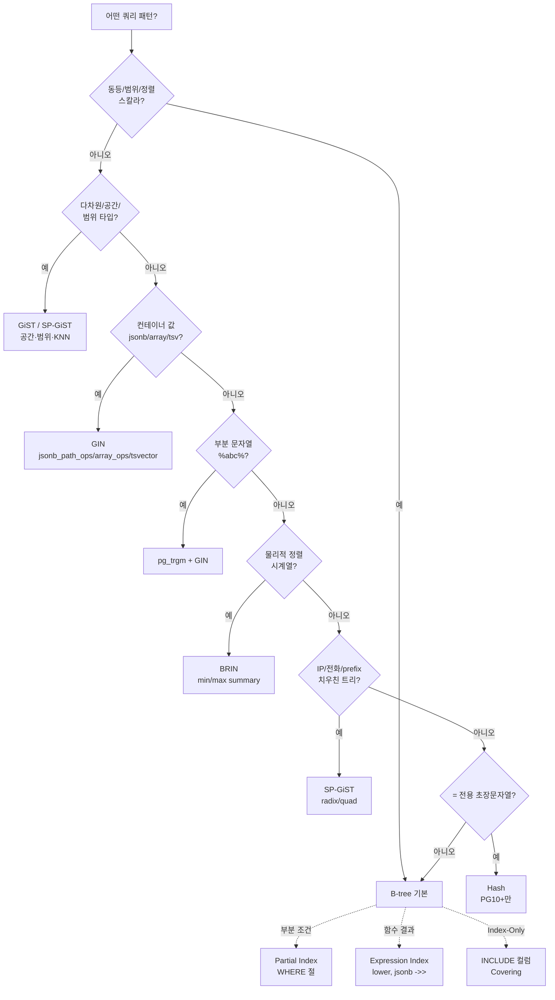
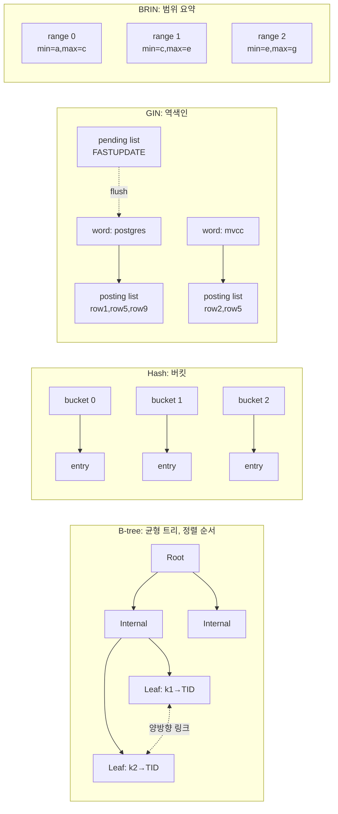

# 5장. 인덱스 타입 — B-tree, Hash, GIN, GiST, BRIN, SP-GiST

PostgreSQL의 인덱스는 단일한 구현이 아니라 **여러 접근 메소드(Access Method, `pg_am`)의 집합**이다. 각 타입은 서로 다른 데이터 분포·쿼리 패턴에 최적화되어 있으며, 선택 오류는 그대로 운영 비용으로 이어진다. 이 장은 공식 문서(`postgresql.org/docs/current/indexes.html`)와 운영 경험을 바탕으로, "언제 어떤 인덱스를 골라야 하는가"를 구조적으로 설명한다.

---

## 5.1 인덱스가 하는 일 — Heap 접근을 우회하는 자료구조

PostgreSQL의 테이블(Heap)은 기본적으로 **정렬되지 않은 튜플의 집합**이다. 쿼리 조건에 맞는 행을 찾기 위해서는 원칙적으로 모든 페이지를 읽어야 한다(Seq Scan). 인덱스는 **키 → TID(튜플 식별자, `(block_number, offset)` 쌍)** 매핑을 유지하여 Heap의 특정 위치만 찍어 읽을 수 있게 한다.

```
Heap (정렬 없음)           Index (정렬·구조화)
  page 0: [t1, t2, t3]       key=5 → (page=2, offset=1)
  page 1: [t4, t5]           key=7 → (page=0, offset=2)
  page 2: [t6, t7, t8]       key=9 → (page=1, offset=0)
```

### 왜 인덱스인가

- **Random I/O 회피**: 인덱스로 필요한 페이지만 골라 읽으므로 전체 테이블을 스캔하지 않는다.
- **정렬 없이 ORDER BY 만족**: B-tree는 이미 정렬되어 있어, 일치하는 키 순서대로 읽으면 별도 Sort 노드가 필요 없다.
- **Index-Only Scan**: Visibility Map이 "all-visible"로 표시한 페이지의 튜플은 Heap 접근 없이 인덱스만으로 응답 가능(9.2+).

### 인덱스의 한계

- **쓰기 비용 증가**: INSERT/UPDATE/DELETE 시 모든 관련 인덱스를 갱신해야 한다.
- **MVCC로 인한 Bloat**: UPDATE는 새 튜플을 삽입하는 방식이므로, 인덱스에도 새 엔트리가 추가된다(HOT이 가능한 경우 예외 — 4장 참조).
- **선택도(selectivity)가 낮으면 Seq Scan이 더 빠름**: 관행적으로 5~10% 이상을 읽어야 하는 조건은 Seq Scan이 유리하다. 플래너는 `random_page_cost`와 `seq_page_cost`의 비율로 이 임계를 판단한다.

### 접근 메소드 확인

```sql
SELECT amname FROM pg_am WHERE amtype = 'i';
-- btree, hash, gist, gin, brin, spgist
```

---

## 5.2 B-tree — 기본값이자 범용 인덱스

B-tree(Lehman & Yao 변형)는 PostgreSQL의 기본 인덱스 타입이다. `CREATE INDEX ... ON t(col)`을 `USING`절 없이 쓰면 자동으로 B-tree가 된다. 다음 연산자를 지원한다:

| 연산자 | 의미 |
|-------|------|
| `<`, `<=`, `=`, `>=`, `>` | 범위/동등 비교 |
| `BETWEEN`, `IN` | 위의 조합 |
| `IS NULL`, `IS NOT NULL` | NULL 비교 (9.1+) |
| `LIKE 'abc%'` | 전방 일치 (단, opclass가 `text_pattern_ops`일 때 안정적) |

### 범위 스캔과 정렬

```sql
CREATE INDEX idx_orders_created ON orders(created_at);

-- 범위: 인덱스의 연속 구간만 스캔
SELECT * FROM orders WHERE created_at >= '2026-04-01' AND created_at < '2026-04-08';

-- ORDER BY: 별도 Sort 노드 없이 인덱스 순서대로 반환
SELECT * FROM orders ORDER BY created_at DESC LIMIT 100;
```

**왜 빠른가**: B-tree의 leaf 페이지는 양방향 링크 리스트로 연결되어 있어, 인덱스 진입점만 이진 탐색으로 찾으면 이후는 순차 읽기다. LIMIT가 있는 정렬 쿼리는 필요한 만큼만 읽고 중단할 수 있다.

### INCLUDE — Covering Index (11+)

`INCLUDE` 절은 **키가 아닌 페이로드 컬럼을 leaf 페이지에 저장**한다. Index-Only Scan 대상을 확장할 때 사용한다.

```sql
CREATE INDEX idx_orders_user_inc
  ON orders(user_id) INCLUDE (amount, status);

-- SELECT amount, status FROM orders WHERE user_id = 123;
-- → Heap 접근 없이 인덱스만으로 응답 가능 (VM이 all-visible인 페이지에 한해)
```

**왜 유용한가**: 일반 복합 인덱스 `(user_id, amount, status)`는 `amount`, `status`가 트리의 정렬 순서에 개입해 페이지 분할을 유발한다. INCLUDE는 정렬에 참여하지 않으므로 트리 효율이 낮아지지 않는다.

### 내림차순 인덱스, NULLS FIRST/LAST

```sql
CREATE INDEX idx_articles_pub ON articles(published_at DESC NULLS LAST);

-- 일치하는 정렬일 때만 인덱스를 그대로 사용
SELECT * FROM articles ORDER BY published_at DESC NULLS LAST LIMIT 20;
```

B-tree는 양방향 스캔이 가능하므로 오름차순 인덱스에서 내림차순 ORDER BY도 쓸 수 있다. 그러나 `(a ASC, b DESC)` 같은 **혼합 정렬**은 인덱스 정의와 ORDER BY 방향이 일치해야 Sort 노드를 생략한다.

### opclass (연산자 클래스)

opclass는 "이 데이터 타입에 대해 어떤 연산자와 비교 함수를 쓸지"를 정의한다.

| opclass | 용도 |
|--------|------|
| `text_ops` (기본) | 로캘 기반 비교, `=`, `<`, `>` |
| `text_pattern_ops` | `LIKE 'abc%'` 최적화 (C 로캘 비교) |
| `varchar_pattern_ops` | varchar용 pattern |
| `bpchar_pattern_ops` | char(N)용 pattern |

```sql
CREATE INDEX idx_users_email ON users(email text_pattern_ops);
-- LIKE 'a%' 같은 prefix 검색에서 안정적으로 인덱스 사용
```

**왜 그런가**: PostgreSQL의 기본 `text_ops`는 로캘(ICU/libc)에 따라 정렬 순서가 달라질 수 있어, 옵티마이저가 LIKE prefix에 대해 인덱스 사용을 망설인다. `*_pattern_ops`는 순수 바이트 비교를 보장하므로 LIKE prefix가 안전하게 범위 스캔으로 변환된다.

### 복합 인덱스의 좌측 접두사 원칙

`CREATE INDEX ON t(a, b, c)`는 다음 쿼리에 효율적이다:

- `WHERE a = ?` ✅
- `WHERE a = ? AND b = ?` ✅
- `WHERE a = ? AND b = ? AND c = ?` ✅
- `WHERE a = ? AND c = ?` ⚠️ (a만 인덱스로 필터, c는 Filter)
- `WHERE b = ?` ❌ (인덱스 미사용 가능성 높음, 단 **Skip Scan** 이 있는 버전에서는 작은 a 카디널리티일 때 일부 활용)

---

## 5.3 Hash — 동등 비교 전용

Hash 인덱스는 `=` 연산자만 지원한다. 9.x까지는 **WAL 로깅이 안 되어 크래시 시 재구축이 필요**했지만, **PostgreSQL 10부터 WAL 지원**이 되어 실전에서도 사용 가능해졌다.

```sql
CREATE INDEX idx_sessions_token ON sessions USING hash(token);
```

### 언제 쓰는가

- 매우 긴 문자열·바이너리의 **동등 매칭**만 수행하는 경우 (B-tree 엔트리가 커지는 것을 피하고 싶을 때)
- 범위 검색이 전혀 필요 없는 경우
- PostgreSQL 10+

그러나 B-tree가 대부분의 상황에서 유사하거나 더 나은 성능을 내므로, **실무에서 Hash의 기본 선택은 드물다**. 공식 문서도 "대부분의 경우 B-tree가 권장된다"고 명시한다.

---

## 5.4 GIN — Generalized Inverted Index

GIN은 **역색인(inverted index)**이다. 하나의 컬럼 값이 여러 "요소(element)"로 쪼개지는 경우, 각 요소가 어떤 행에 포함되는지를 역으로 인덱싱한다.

### 대표 적용 대상

| 대상 | opclass |
|------|--------|
| `tsvector` (전문 검색) | `tsvector_ops` |
| `jsonb` | `jsonb_ops` (기본), `jsonb_path_ops` (경로 전용, 더 작고 빠름) |
| `array` | `array_ops` (`@>`, `<@`, `&&`) |
| `pg_trgm` (trigram) | `gin_trgm_ops` (부분 일치 LIKE `%abc%`) |

### 사용 예

```sql
-- 1. jsonb
CREATE INDEX idx_events_payload ON events USING gin(payload);
-- SELECT * FROM events WHERE payload @> '{"level":"error"}';

-- 2. jsonb path-only (더 작고, 경로+값 = 일치만)
CREATE INDEX idx_events_payload_pops ON events USING gin(payload jsonb_path_ops);

-- 3. 배열
CREATE INDEX idx_posts_tags ON posts USING gin(tags);
-- SELECT * FROM posts WHERE tags @> ARRAY['postgres','mvcc'];

-- 4. 전문 검색
CREATE INDEX idx_docs_tsv ON docs USING gin(to_tsvector('simple', body));

-- 5. 부분 문자열 매칭 (pg_trgm 확장 필요)
CREATE EXTENSION pg_trgm;
CREATE INDEX idx_users_name_trgm ON users USING gin(name gin_trgm_ops);
-- SELECT * FROM users WHERE name ILIKE '%kim%';
```

### FASTUPDATE와 Pending List

GIN은 **삽입 비용이 크다**(요소마다 인덱스 페이지를 건드려야 함). 이 문제를 완화하기 위해 `FASTUPDATE`(기본 on) 옵션이 있다. 새 엔트리는 일단 **pending list**라는 별도 영역에 순차 append 되고, 이후 VACUUM 또는 pending list가 `gin_pending_list_limit`(기본 4MB)를 초과했을 때 본 인덱스로 병합된다.

| 파라미터 | 기본값 | 의미 |
|---------|-------|------|
| `fastupdate` (reloption) | `on` | pending list 사용 여부 |
| `gin_pending_list_limit` | `4MB` | pending list 병합 임계 |

```sql
-- 테이블별 조정
ALTER INDEX idx_events_payload SET (fastupdate = off);
ALTER INDEX idx_events_payload SET (gin_pending_list_limit = '16MB');

-- 수동 병합
SELECT gin_clean_pending_list('idx_events_payload');
```

**왜 off로 바꾸기도 하나**: pending list가 커지면 조회 시 pending list까지 선형 스캔해야 하므로 SELECT 지연이 튈 수 있다. 읽기 지연 민감한 OLTP에서는 off가 유리할 수 있다.

---

## 5.5 GiST — Generalized Search Tree

GiST는 사용자가 정의한 술어(predicate)를 지원하는 **일반화된 자가 균형 트리**다. 내부 노드에 "자식이 포함하는 키들의 bounding box/union"을 저장하는 방식으로 **다차원·비스칼라 데이터**를 인덱싱할 수 있다.

### 대표 적용 대상

- **공간 데이터**: PostGIS의 `geometry`, `geography` — `&&`(bounding box intersect), `<->`(거리)
- **범위 타입**: `int4range`, `tstzrange`, ... — `&&`, `@>`, `<@`
- **유사도**: `pg_trgm`의 `word_similarity_ops`, `gist_trgm_ops`
- **배타 제약**: `EXCLUDE USING gist (...)` — 겹치지 않는 예약 시스템 등

```sql
-- 1. 시간 범위 겹침 방지 (회의실 예약)
CREATE TABLE bookings (
    room_id int,
    period tstzrange,
    EXCLUDE USING gist (room_id WITH =, period WITH &&)
);

-- 2. PostGIS 공간 인덱스
CREATE INDEX idx_shops_geom ON shops USING gist(geom);
-- SELECT * FROM shops ORDER BY geom <-> ST_Point(127.0, 37.5) LIMIT 10;

-- 3. 범위 타입
CREATE INDEX idx_events_period ON events USING gist(period);
-- SELECT * FROM events WHERE period @> '2026-04-24'::timestamptz;
```

### GIN vs GiST — 무엇을 쓸까

| 기준 | GIN | GiST |
|-----|-----|------|
| 조회 속도 | 일반적으로 빠름 (정확한 역색인) | 느림 (bounding box로 필터 후 재확인) |
| 인덱스 크기 | 큼 | 작음 |
| 업데이트 비용 | 큼 (FASTUPDATE 완화) | 작음 |
| 데이터 타입 | array, jsonb, tsvector, 전문검색 | 공간, 범위, 다차원, 유사도(거리) |
| `<->` KNN | 지원 (일부) | **강점** |

공식 권장: 정적 데이터·읽기 위주 전문검색 → GIN, 동적·KNN·공간 → GiST.

---

## 5.6 BRIN — Block Range Index

BRIN은 페이지 범위(기본 128 페이지 = 1MB)의 **요약(min/max, bloom 등)**만 저장하는 초소형 인덱스다. 데이터가 **물리적으로 정렬**된 대용량 테이블(시계열 로그, 센서 데이터 등)에서 탁월하다.

```
table heap (128 pages per range)
  range 0 [pages 0~127]:    min=2026-01-01, max=2026-01-02
  range 1 [pages 128~255]:  min=2026-01-02, max=2026-01-03
  ...

WHERE ts >= '2026-01-10' AND ts < '2026-01-11'
  → 해당 min/max 조건에 안 맞는 range를 skip
```

### 사용 예

```sql
CREATE INDEX idx_logs_ts_brin ON logs USING brin(ts);

-- 페이지 범위 조정 (기본 128)
CREATE INDEX idx_logs_ts_brin2
  ON logs USING brin(ts) WITH (pages_per_range = 32);
```

| 파라미터 | 기본값 | 트레이드오프 |
|---------|-------|-------------|
| `pages_per_range` | `128` | 작게 → 정밀도↑, 인덱스 크기↑ / 크게 → 정밀도↓, 크기↓ |
| `autosummarize` | `off` | BRIN 요약의 자동 업데이트 (10+) |

### 왜 빠른가·왜 빠르지 않을 수 있나

BRIN은 **데이터가 정렬되어 있을 때**만 효과적이다. `ts`가 INSERT 시간 순서와 일치하면 각 range의 min/max 구간이 좁아 거의 이진 탐색에 가깝다. 그러나 데이터가 무작위로 삽입되면 모든 range의 min/max가 유사해져, 대부분 range를 스캔하게 된다.

**보조 수단**: `BRIN bloom ops`(14+)는 동등 매칭에 유리하다.
```sql
CREATE INDEX ON logs USING brin(user_id int8_bloom_ops);
```

---

## 5.7 SP-GiST — Space-Partitioned GiST

SP-GiST는 **비균형(unbalanced) 트리**를 구현하기 위한 프레임워크다. quadtree, k-d tree, suffix tree, radix tree 등 공간이 **재귀적·비대칭적으로 분할되는** 데이터에 효과적이다.

### 대표 적용 대상

- **전화번호, URL, 경로 문자열**: 접두사(prefix) 공유가 많은 트리 (text의 `text_ops`는 SP-GiST용은 아님 — 별도 opclass 필요)
- **IP 주소 / CIDR**: `inet_ops`
- **2D 포인트**: `quad_point_ops`, `kd_point_ops`

```sql
-- IP 주소
CREATE INDEX idx_req_ip ON requests USING spgist(src_ip inet_ops);

-- text에 대한 radix (suffix) tree
CREATE INDEX idx_paths ON files USING spgist(path text_ops);
```

**언제 쓰는가**: B-tree보다 **문자열 접두사가 많고 트리가 극단적으로 치우친** 경우. 대부분의 일반 텍스트는 B-tree + `text_pattern_ops`로 충분하다.

---

## 5.8 Partial / Expression / Covering / Unique

### Partial Index — 조건부 인덱싱

```sql
-- 전체의 3%인 active 행만 인덱싱
CREATE INDEX idx_users_active_email
  ON users(email)
  WHERE is_active = true;
```

**왜 유용한가**: 인덱스 크기를 극적으로 줄이고, 해당 조건 쿼리의 캐시 효율을 높인다. 단, 쿼리가 같은 술어(`WHERE is_active = true`)를 포함해야 옵티마이저가 인덱스를 쓸 수 있다. 부분 인덱스의 술어는 **immutable**해야 하며, `NOW()` 같은 volatile 함수는 허용되지 않는다.

### Expression Index — 표현식 인덱스

```sql
-- 함수 결과에 대한 인덱스
CREATE INDEX idx_users_email_lower ON users(lower(email));
-- SELECT * FROM users WHERE lower(email) = 'kim@example.com';

-- JSONB 필드
CREATE INDEX idx_events_level ON events((payload->>'level'));
```

**주의**: 쿼리의 표현식이 인덱스 정의와 **문법적으로 일치**해야 한다. `lower(email) = 'X'`와 `LOWER(email) = 'X'`는 같지만, `email ILIKE 'X'`는 다른 것으로 취급될 수 있다.

### Covering Index — `INCLUDE`로 Index-Only Scan 확장

앞서 5.2에서 다룬 INCLUDE를 의미한다.

```sql
CREATE UNIQUE INDEX idx_orders_pk ON orders(id) INCLUDE (user_id, amount);
```

### Unique Index — 제약 조건을 동반

```sql
CREATE UNIQUE INDEX idx_users_email_u ON users(lower(email));
-- 같은 email이 대소문자만 달라도 중복 방지
```

PRIMARY KEY나 UNIQUE 제약은 내부적으로 B-tree Unique Index로 구현된다. Partial Unique도 가능하다:

```sql
-- 소프트 삭제 환경에서 "살아있는 행 중에만 unique"
CREATE UNIQUE INDEX idx_users_email_alive
  ON users(email) WHERE deleted_at IS NULL;
```

---

## 5.9 인덱스 선택 플로우차트



---

## 5.10 인덱스 타입 데이터 구조 개념도



---

## 5.11 Partial/Expression/Covering 용례

```mermaid
flowchart TB
    subgraph Partial[Partial Index]
        P_T[users 1000만행]
        P_T -->|WHERE is_active=true<br/>30만행만 인덱싱| P_I[idx_users_active_email]
        P_Q[SELECT ... WHERE email=? AND is_active=true]
        P_Q --> P_I
    end
    subgraph Expression[Expression Index]
        E_T[users]
        E_T -->|lower(email) 결과를 인덱싱| E_I[idx_users_email_lower]
        E_Q[WHERE lower email = kim@x.com]
        E_Q --> E_I
    end
    subgraph Covering[Covering - INCLUDE]
        C_T[orders]
        C_T -->|key=user_id<br/>payload=amount,status| C_I[idx_orders_user_inc]
        C_Q[SELECT amount,status<br/>WHERE user_id=123]
        C_Q -->|VM all-visible시<br/>Heap 미접근| C_I
    end
```

---

## 5.12 인덱스 유지 비용 — Bloat과 Write Amplification

### Write Amplification

한 행의 INSERT·UPDATE는 테이블 페이지 + **모든 관련 인덱스의 페이지**를 건드린다. 인덱스가 N개면 I/O도 대략 N배로 증가한다. UPDATE에서 인덱싱된 컬럼이 변경되지 않고 같은 페이지 내에 새 버전을 만들 수 있으면 **HOT 업데이트**가 일어나 인덱스 갱신을 생략할 수 있다(4장 참조). 따라서:

- **자주 변경되는 컬럼은 가급적 인덱스에서 제외**
- **fillfactor**(테이블 기본 100, 인덱스 90)를 낮춰 HOT 공간을 확보

```sql
ALTER TABLE orders SET (fillfactor = 80);
-- HOT update 성공률 상승, 대신 디스크 점유 20% 증가
```

### Index Bloat

MVCC UPDATE는 새 튜플·새 인덱스 엔트리를 만든다. VACUUM이 Dead 엔트리를 회수하기 전까지 인덱스가 커지고, 경우에 따라 **페이지 분할(split)**이 일어나 원상 복구되지 않는다. 측정:

```sql
-- 확장 pgstattuple 필요
SELECT * FROM pgstattuple('idx_orders_created');
SELECT * FROM pgstatindex('idx_orders_created');

-- 시스템 카탈로그 기반 추정
SELECT schemaname, relname, indexrelname,
       pg_size_pretty(pg_relation_size(indexrelid)) AS idx_size,
       idx_scan, idx_tup_read, idx_tup_fetch
FROM pg_stat_user_indexes
ORDER BY pg_relation_size(indexrelid) DESC
LIMIT 20;
```

### 재구축

```sql
-- 11까지는 인덱스 재생성 동안 쓰기 블록
REINDEX INDEX idx_orders_created;

-- 12+ 비차단 재구축 (ShareUpdateExclusiveLock)
REINDEX INDEX CONCURRENTLY idx_orders_created;

-- 테이블 전체 (같은 옵션 가능)
REINDEX TABLE CONCURRENTLY orders;
```

**왜 CONCURRENTLY인가**: `REINDEX INDEX`는 AccessExclusiveLock을 잡아 쿼리를 블록한다. `CONCURRENTLY`는 백그라운드에서 중복 인덱스를 만들고 원자적으로 교체한다. 대신 실패 시 `INVALID` 상태의 고아 인덱스가 남을 수 있으므로 다음으로 확인:

```sql
SELECT * FROM pg_index WHERE NOT indisvalid;
```

### 사용되지 않는 인덱스 제거

```sql
SELECT s.schemaname, s.relname, s.indexrelname,
       s.idx_scan,
       pg_size_pretty(pg_relation_size(s.indexrelid)) AS size
FROM pg_stat_user_indexes s
JOIN pg_index i ON i.indexrelid = s.indexrelid
WHERE NOT i.indisunique AND NOT i.indisprimary
  AND s.idx_scan < 50   -- 임계는 운영 주기에 맞게
ORDER BY pg_relation_size(s.indexrelid) DESC;
```

`idx_scan = 0`이고 도입 후 충분한 시간이 지났다면 삭제 후보다. 통계는 `pg_stat_reset()` 또는 복제 전환 등으로 리셋될 수 있음에 유의.

---

## 5.13 운영 체크리스트

| 단계 | 확인 |
|-----|------|
| **설계** | 쿼리 패턴 우선. "있으면 좋을 것 같아서"는 금지 |
| **선택** | 5.9 플로우차트. 범용은 B-tree, 특수 데이터만 GIN/GiST/BRIN |
| **생성** | 대형 테이블은 `CREATE INDEX CONCURRENTLY`로 쓰기 블록 회피 |
| **검증** | `EXPLAIN (ANALYZE, BUFFERS)`로 실제 인덱스 사용·Buffer hit 확인 |
| **모니터링** | `pg_stat_user_indexes.idx_scan`, `pgstatindex`, Bloat 크기 |
| **유지** | 주기적 `REINDEX CONCURRENTLY`, 미사용 인덱스 삭제 |

### 자주 하는 실수

1. **LIKE '%abc'** 를 B-tree 인덱스에 기대한다 — prefix가 아니라 suffix이므로 안 됨. `pg_trgm` + GIN이 정답.
2. **타입 불일치** — `WHERE uuid_col = '...'::text` (문자열)은 인덱스 우회 가능. 명시 캐스트 혹은 컬럼 타입과 맞추기.
3. **함수 래핑** — `WHERE to_char(created_at,'YYYY-MM-DD') = '2026-04-24'` → Expression Index를 만들거나 범위 조건으로 변환.
4. **OR** — `WHERE a = ? OR b = ?`는 두 컬럼 각각의 인덱스가 있어도 Bitmap Or로 합쳐야 하며, 둘 다 없으면 Seq Scan. UNION ALL로 쪼개기도 고려.
5. **NULL 무시** — B-tree는 NULL도 인덱싱하지만 `= NULL`은 false. `IS NULL` 서술을 쓴다. 일부 옛 버전은 IS NULL에서 인덱스 미사용이었으나 9.1+ 해결.

---

## 공식 문서 참조

- **인덱스 개요**: https://www.postgresql.org/docs/current/indexes.html
- **인덱스 타입**: https://www.postgresql.org/docs/current/indexes-types.html
- **연산자 클래스**: https://www.postgresql.org/docs/current/indexes-opclass.html
- **Partial Index**: https://www.postgresql.org/docs/current/indexes-partial.html
- **Expression Index**: https://www.postgresql.org/docs/current/indexes-expressional.html
- **INCLUDE / Covering Index (CREATE INDEX)**: https://www.postgresql.org/docs/current/sql-createindex.html
- **pg_trgm 확장**: https://www.postgresql.org/docs/current/pgtrgm.html
- **pgstattuple 확장**: https://www.postgresql.org/docs/current/pgstattuple.html

---

*다음 장: 6장. 쿼리 플래너와 EXPLAIN — 통계·Cost·실행 계획 읽기*
