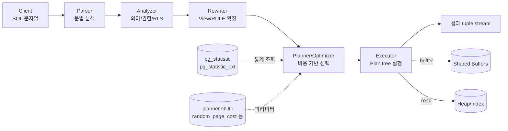
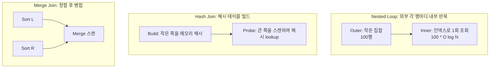
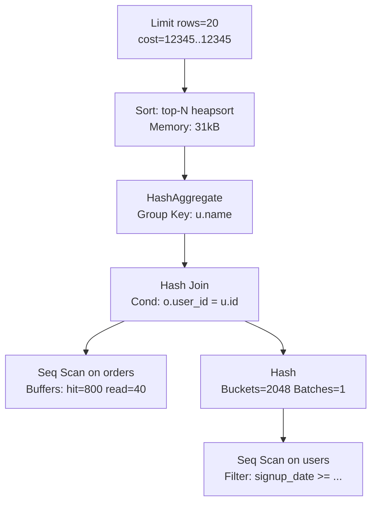

# 6장. 쿼리 플래너와 EXPLAIN — 통계·Cost·실행 계획 읽기

PostgreSQL은 **비용 기반 옵티마이저(cost-based optimizer)**다. 쿼리가 들어오면 가능한 실행 계획들을 열거하고, 각 계획의 예상 비용(cost)을 계산해 **가장 싸 보이는** 하나를 고른다. "싸 보인다"는 판단은 **통계(statistics)**와 **cost 파라미터**에 의존하므로, 둘 중 하나라도 부정확하면 "인덱스가 있는데도 Seq Scan"을 보게 된다. 이 장은 플래너의 내부 구조, 통계의 역할, 스캔·조인 전략, 그리고 EXPLAIN 출력 해석을 다룬다.

---

## 6.1 플래너 파이프라인 — Parser → Rewriter → Planner → Executor

클라이언트가 보낸 SQL 문자열은 네 단계를 거친다.

| 단계 | 하는 일 | 산출물 |
|-----|--------|-------|
| **Parser** | 토큰화·문법 분석 | Parse tree (raw) |
| **Analyzer** | 의미 분석(컬럼·타입 해석, 권한 확인) | Query tree |
| **Rewriter** | 뷰 확장, RULE 적용, RLS 적용 | Rewritten Query tree |
| **Planner/Optimizer** | 실행 계획 생성·비용 비교 | Plan tree |
| **Executor** | Plan tree를 노드 단위로 실행 | 결과 튜플 스트림 |



### 왜 이렇게 나누는가

- **Rewriter**는 뷰·RULE을 확장해 Planner에게 "실제 테이블 조합"을 보여준다. 뷰는 플래너 시점에서 이미 펼쳐진 상태이므로, 뷰라서 느린 것이 아니라 펼친 결과가 느린 것.
- **Planner**는 상수화된 바인드 변수 값(`custom plan`) 또는 일반화된 값(`generic plan`)으로 두 종류 계획을 만들 수 있다. PREPARE 문을 반복 실행하면 비교 후 generic을 고를 수 있는데, 통계 분포가 불균일한 경우 custom으로 고정하는 게 안전할 때도 있다(`plan_cache_mode`로 제어).

### Prepared statements와 plan cache

```sql
PREPARE q(int) AS SELECT * FROM orders WHERE user_id = $1;
EXECUTE q(42);
```

`plan_cache_mode` (12+):
- `auto` (기본): 5회 실행 후 generic과 custom 비용 비교해 generic이 싸면 generic 사용
- `force_custom_plan`: 항상 custom (바인드마다 replan, 분포가 불균일할 때 안전)
- `force_generic_plan`: 항상 generic (replan 비용 제거)

---

## 6.2 Cost 모델 — 숫자가 말하는 것

PostgreSQL은 계획의 비용을 **"단위 없는 상대값"**으로 계산한다. 기준은 "하나의 페이지를 순차 읽는 것 = 1.0".

| 파라미터 | 기본값 | 의미 |
|---------|-------|------|
| `seq_page_cost` | `1.0` | 순차 페이지 읽기 비용 (기준) |
| `random_page_cost` | `4.0` | 무작위 페이지 읽기 비용 (HDD 기준) |
| `cpu_tuple_cost` | `0.01` | 튜플 1개 처리 CPU 비용 |
| `cpu_index_tuple_cost` | `0.005` | 인덱스 엔트리 1개 처리 비용 |
| `cpu_operator_cost` | `0.0025` | 연산자 1회 비용 |
| `parallel_tuple_cost` | `0.1` | 병렬 워커 → 리더에 튜플 전달 비용 |
| `parallel_setup_cost` | `1000` | 병렬 스캔 시작 고정 비용 |
| `effective_cache_size` | `4GB` | OS·Shared Buffer 합산 유효 캐시 크기 (힌트용) |

### 왜 중요한가 — SSD/NVMe 환경의 `random_page_cost`

PostgreSQL의 기본 `random_page_cost = 4.0`은 **회전 디스크(HDD)**를 전제로 한다. SSD/NVMe에서는 순차와 무작위 접근의 차이가 훨씬 작아서 `1.1 ~ 2.0`으로 낮추는 것이 일반적이다. 이 값을 낮추지 않으면 옵티마이저가 Index Scan을 과소평가해 **Seq Scan을 더 선호**하게 된다.

```sql
-- postgresql.conf 권장 (SSD/NVMe 기준)
random_page_cost = 1.1
effective_cache_size = '12GB'   -- RAM의 50~75% 수준
-- cpu_tuple_cost, seq_page_cost는 기본값 유지가 일반적
```

`effective_cache_size`는 실제 메모리를 **예약하지 않는다**. 옵티마이저에게 "얼마까지 캐시되어 있을 것 같다"를 알려주는 힌트일 뿐이다. 이 값이 크면 Index Scan(반복 읽기 시 캐시 활용 가정)을 선호하고, 작으면 무작위 I/O를 두려워해 Seq Scan으로 기운다.

### Cost 계산 감 잡기

Seq Scan의 단순 공식:
```
cost = relpages * seq_page_cost + reltuples * cpu_tuple_cost
```

인덱스를 통한 Index Scan:
```
cost ≈ selectivity * index_pages * random_page_cost
     + selectivity * reltuples * (cpu_tuple_cost + cpu_index_tuple_cost)
     + 필요 Heap 접근 * random_page_cost
```

따라서 `random_page_cost`가 높을수록, 선택도가 낮은(조건이 많은 행을 고르는) 쿼리에서 인덱스는 더 비싸 보인다.

---

## 6.3 통계 — pg_statistic, ANALYZE, CREATE STATISTICS

### pg_stats / pg_statistic

옵티마이저가 선택도를 추정하는 근거가 통계다. **내부 테이블 `pg_statistic`**에 실제 값이, **뷰 `pg_stats`**에 읽기 편한 형태로 노출된다.

```sql
SELECT attname,
       null_frac,           -- NULL 비율
       avg_width,           -- 평균 크기
       n_distinct,          -- 고유값 수 (음수면 비율)
       most_common_vals,    -- 상위 빈도 값 (MCV)
       most_common_freqs,   -- 해당 빈도
       histogram_bounds,    -- MCV 외의 값을 bucket으로 분할
       correlation          -- 물리적 정렬과 논리 정렬의 상관
FROM pg_stats
WHERE tablename = 'orders' AND attname = 'user_id';
```

| 통계 항목 | 쓰임 |
|---------|------|
| `n_distinct` | 동등 조건 선택도 추정 (`1/n_distinct`) |
| `most_common_vals/freqs` | 특정 값의 선택도를 정확히 추정 |
| `histogram_bounds` | 범위 조건(`BETWEEN`, `<`, `>`)의 선택도 |
| `correlation` | Index Scan의 Heap I/O 예측 (1에 가까우면 거의 순차) |
| `null_frac` | `IS NULL` 선택도 |

### ANALYZE

`ANALYZE`가 수집한 통계는 실제 데이터와 시간이 지나면서 괴리된다. 옵티마이저 오판의 가장 흔한 원인이다.

```sql
ANALYZE orders;                    -- 테이블 전체
ANALYZE orders (user_id, status);  -- 특정 컬럼만

-- 샘플링 크기 = default_statistics_target * 300 (행 단위)
SET default_statistics_target = 100;  -- 기본. (1~10000 가능)
ALTER TABLE orders ALTER COLUMN user_id SET STATISTICS 1000;
```

`default_statistics_target`의 기본 `100`은 MCV/histogram을 각 최대 100개까지 수집한다. 분포가 복잡한 대형 테이블은 컬럼별로 `500~1000`으로 올리면 범위 추정이 정확해진다. 비용은 ANALYZE 시간과 pg_statistic 크기 증가.

### 확장 통계 — CREATE STATISTICS

단일 컬럼 통계만으로는 **컬럼 간 상관**을 알 수 없다. 예를 들어 `(city, zip_code)`는 상관이 극도로 높지만(같은 도시는 한정된 zip만 가짐), 기본 통계는 이 둘을 독립으로 가정한다.

```sql
-- 다변수 통계 (10+)
CREATE STATISTICS s_orders_region (ndistinct, dependencies, mcv)
  ON city, zip_code FROM orders;
ANALYZE orders;

-- 조회
SELECT * FROM pg_stats_ext WHERE statistics_name = 's_orders_region';
```

| 종류 | 역할 |
|-----|------|
| `ndistinct` | 컬럼 조합의 고유값 수 |
| `dependencies` | 함수 종속 (A 결정 시 B 결정도) |
| `mcv` (12+) | 다변수 MCV 테이블 |

### expression 통계 (14+)

```sql
-- 표현식 결과에 대한 통계
CREATE STATISTICS s_events_hour ON (extract(hour from ts)) FROM events;
```

함수 래핑 쿼리(`WHERE extract(hour from ts) = 9`)의 선택도 추정을 개선한다.

---

## 6.4 스캔 전략

### Seq Scan

테이블의 모든 페이지를 순차 읽기. 조건을 **튜플 단위 Filter**로 적용. 선택도가 높거나(많이 읽어야 하거나), 작은 테이블은 여기가 최적이다.

```
Seq Scan on orders  (cost=0.00..20543.00 rows=1000000 width=56)
  Filter: (status = 'paid')
```

### Index Scan

인덱스로 TID 리스트를 얻고, **TID 하나마다 Heap 페이지를 무작위로 접근**. 적은 양을 핀셋으로 집어올 때 유리하다.

```
Index Scan using idx_orders_user on orders
  Index Cond: (user_id = 42)
```

### Index Only Scan (9.2+)

Heap을 아예 안 읽는 스캔. 조건: ①필요한 모든 컬럼이 인덱스에 있다, ②해당 페이지가 Visibility Map에서 **all-visible**로 표시되었다.

```
Index Only Scan using idx_orders_user_inc on orders
  Index Cond: (user_id = 42)
  Heap Fetches: 3
```

`Heap Fetches`는 VM이 all-visible이 아니어서 Heap 확인이 필요했던 행 수. VACUUM 후 0에 가까워야 한다.

### Bitmap Heap Scan

"Index Scan이 핀셋이라면 Bitmap Heap Scan은 쓰레받기". 인덱스로 조건에 맞는 페이지 비트맵을 만들고, **페이지를 순차 순서**로 읽은 뒤 recheck.

```
Bitmap Heap Scan on orders
  Recheck Cond: (user_id = 42)
  Heap Blocks: exact=123
  -> Bitmap Index Scan on idx_orders_user
       Index Cond: (user_id = 42)
```

**왜 필요한가**: 선택도가 애매할 때(수천~수만 행), Index Scan은 페이지 랜덤 I/O가 많아지고, Seq Scan은 쓸데없이 많이 읽는다. Bitmap은 중간 선택도에서 최적. 또한 OR/복수 인덱스 결합도 BitmapOr/BitmapAnd로 자연스럽다.

```
-> BitmapOr
   -> Bitmap Index Scan on idx_orders_user
   -> Bitmap Index Scan on idx_orders_status
```

### Parallel Seq Scan

```
Gather (workers=2)
  -> Parallel Seq Scan on orders
```

`max_parallel_workers_per_gather`(기본 2), `min_parallel_table_scan_size`(기본 8MB) 이상의 테이블·충분한 cost 추정에서 트리거. 병렬 오버헤드(`parallel_setup_cost = 1000`)를 넘어야 효과가 있다.

### 선택도 → 전략 감

| 선택도 | 권장 |
|-------|------|
| ~ 0.01% (수십 행) | Index Scan |
| 0.01 ~ 5% | Bitmap Heap Scan |
| > 5~10% | Seq Scan (필요시 Parallel) |

---

## 6.5 조인 전략 — Nested Loop / Hash / Merge



| 전략 | 최적 시나리오 | 약점 |
|-----|-------------|------|
| **Nested Loop** | 외부가 작고 내부에 인덱스가 있을 때 | 외부가 크면 O(N*M) 폭발 |
| **Hash Join** | 한쪽이 `work_mem`에 들어갈 때, 큰 equi-join | 메모리 초과 시 디스크 배치 파일, range 조건 불가 |
| **Merge Join** | 양쪽이 정렬되어 있거나 인덱스가 정렬 제공 | 정렬 비용, equi-join만 |

### work_mem — Hash/Sort의 심장

```
work_mem = 4MB   -- 기본. 너무 작다
```

`work_mem`은 **백엔드 프로세스당, 노드당** 할당되므로 `connections × nodes_per_query × work_mem`이 현실적 상한이다. 16~64MB 사이에서 워크로드에 맞춰 조정하되, 세션 단위로 한시 적용도 가능:

```sql
SET work_mem = '128MB';
SELECT ...; -- 큰 Hash Join 쿼리
RESET work_mem;
```

Hash Join이 메모리를 넘치면 `Batches: N`이 1을 초과하고 디스크 spill이 발생해 느려진다. EXPLAIN ANALYZE 출력에서 `Batches`와 `Memory Usage`를 확인한다.

### 조인 순서 — GEQO

join 테이블이 많아지면 순서 조합이 폭발한다. `join_collapse_limit`(기본 8), `from_collapse_limit`(기본 8) 이상이면 **GEQO(Genetic Query Optimizer)**가 유사 최적을 찾는다. 복잡한 쿼리에서 같은 쿼리가 가끔씩 느려지면 GEQO 비결정성이 원인일 수 있다. `geqo = off` 또는 threshold를 늘려 exhaustive search로 돌리기.

---

## 6.6 EXPLAIN / EXPLAIN ANALYZE / BUFFERS

| 명령 | 동작 | 언제 |
|-----|------|-----|
| `EXPLAIN` | 계획만 출력 (실행 안 함) | 초기 설계 확인 |
| `EXPLAIN ANALYZE` | 실제 실행 후 actual 시간·행 수 측정 | 실전 진단 |
| `EXPLAIN (ANALYZE, BUFFERS)` | 읽은 블록(shared hit/read) 추가 | I/O 진단의 기본 |
| `EXPLAIN (ANALYZE, BUFFERS, VERBOSE)` | 컬럼·스키마 자세히 | 파티션·IO 상세 |
| `EXPLAIN (ANALYZE, BUFFERS, WAL)` | WAL 레코드·바이트 | 쓰기 쿼리 진단 |
| `EXPLAIN (ANALYZE, FORMAT JSON)` | JSON 출력 (도구 파싱) | PEV, explain.dalibo.com |

### 주의 — EXPLAIN ANALYZE는 실제로 실행한다

DELETE/UPDATE를 EXPLAIN ANALYZE 하면 실제로 삭제·수정된다. 안전하게 돌리려면:

```sql
BEGIN;
EXPLAIN (ANALYZE, BUFFERS) DELETE FROM orders WHERE ...;
ROLLBACK;
```

### 예시

```sql
EXPLAIN (ANALYZE, BUFFERS, SETTINGS)
SELECT u.name, SUM(o.amount)
FROM users u
JOIN orders o ON o.user_id = u.id
WHERE u.signup_date >= '2026-01-01'
GROUP BY u.name
ORDER BY 2 DESC
LIMIT 20;
```

```
Limit  (cost=12345.67..12345.72 rows=20 width=48)
       (actual time=234.5..234.6 rows=20 loops=1)
  Buffers: shared hit=1234 read=56
  ->  Sort
        Sort Key: (sum(o.amount)) DESC
        Sort Method: top-N heapsort  Memory: 31kB
        ->  HashAggregate
              Group Key: u.name
              ->  Hash Join
                    Hash Cond: (o.user_id = u.id)
                    Buffers: shared hit=900 read=50
                    ->  Seq Scan on orders o
                          Buffers: shared hit=800 read=40
                    ->  Hash
                          Buckets: 2048  Batches: 1  Memory Usage: 85kB
                          ->  Seq Scan on users u
                                Filter: (signup_date >= '2026-01-01')
                                Rows Removed by Filter: 19200
Planning Time: 0.42 ms
Execution Time: 235.1 ms
Settings: random_page_cost = '1.1'
```

---

## 6.7 EXPLAIN 출력 해석

### 핵심 필드

| 필드 | 의미 |
|-----|------|
| `cost=start..total` | 첫 행 비용 ~ 전체 비용 (단위 없음) |
| `rows` | **예상** 행 수 |
| `actual rows` | **실제** 행 수 (ANALYZE 시) |
| `loops` | 이 노드가 실행된 횟수 (Nested Loop의 내부는 외부 행 수만큼) |
| `Filter` | 스캔 후 추가로 적용된 서술, `Rows Removed by Filter: N` 동반 |
| `Buffers: shared hit=X read=Y dirtied=Z written=W` | Shared Buffer 적중·디스크 읽기·dirty 발생·writeback |

### rows 불일치 — 통계 오차

`(rows=100) actual rows=500000` 같은 큰 괴리는 **통계 부정확**의 신호. 조치:

1. `ANALYZE <table>` 재수행
2. `ALTER TABLE ... ALTER COLUMN c SET STATISTICS 1000;`
3. 다변수 상관이 원인이면 `CREATE STATISTICS`
4. `default_statistics_target` 상향

### loops — Nested Loop 체크

```
-> Index Scan on t2 (actual rows=1 loops=100000)
```

`loops`가 수만~수십만이면 외부 집합이 크고 내부가 인덱스 조회라는 뜻. 한 번은 빠르지만 곱해서 느리다면 **Hash Join이 나을 가능성**.

### Rows Removed by Filter — 인덱스 서술 누락

```
Seq Scan on orders
  Filter: (status = 'paid' AND created_at >= '2026-01-01')
  Rows Removed by Filter: 9900000
```

9.9M이 Filter 단계에서 버려진다면, 해당 서술을 인덱스로 밀어넣어야 한다. Partial Index나 복합 인덱스가 후보.

### Buffers — 진짜 I/O의 거울

- `shared hit`: Shared Buffer에서 가져온 페이지 수
- `shared read`: 디스크(또는 OS page cache)에서 읽은 페이지 수
- `shared dirtied`: 이 쿼리로 인해 dirty가 된 페이지 수 (hint bit 등)
- `shared written`: writeback까지 간 페이지 수

같은 쿼리를 두 번 돌릴 때 `read`가 0으로 수렴하지 않는다면, 캐시 압박·경쟁이 있다는 뜻이다. `EXPLAIN (ANALYZE, BUFFERS)`를 **기본 습관**으로 들여야 한다.

### Sort Method

| 방법 | 의미 |
|-----|------|
| `quicksort Memory: XkB` | work_mem 내 정렬 |
| `top-N heapsort` | `ORDER BY ... LIMIT N`에 최적 |
| `external merge Disk: XkB` | work_mem 초과 → 디스크 spill (느림) |

### EXPLAIN 노드 트리 예시



---

## 6.8 자주 발생하는 오류 패턴

### 1. 함수 래핑

```sql
-- ❌ 인덱스 미사용
WHERE to_char(created_at, 'YYYY-MM-DD') = '2026-04-24'

-- ✅ 범위로 변환 — 인덱스 사용
WHERE created_at >= '2026-04-24' AND created_at < '2026-04-25'

-- ✅ 혹은 Expression Index
CREATE INDEX idx_x ON t(to_char(created_at,'YYYY-MM-DD'));
```

### 2. 타입 불일치

```sql
-- 컬럼이 text인데 int로 비교 → 암묵 캐스트로 인덱스 우회 가능
WHERE code = 12345;    -- code가 text면 → WHERE code::int = 12345로 해석 가능

-- ✅
WHERE code = '12345';
```

UUID, bigint, text 혼용 시 특히 주의. `EXPLAIN`에 `::type` 캐스트가 **인덱스 컬럼 쪽에** 붙어 있으면 인덱스가 죽은 것이다.

### 3. OR

```sql
-- a, b 각각에 인덱스가 있어도 플래너가 Bitmap Or를 못 선택하면 Seq Scan
SELECT * FROM t WHERE a = 1 OR b = 2;

-- ✅ UNION ALL로 분리
SELECT * FROM t WHERE a = 1
UNION ALL
SELECT * FROM t WHERE b = 2 AND a <> 1;
```

### 4. LIKE — prefix vs suffix

```sql
-- ✅ B-tree 가능 (단 text_pattern_ops 권장)
WHERE name LIKE 'abc%'

-- ❌ B-tree 불가 — pg_trgm + GIN 필요
WHERE name LIKE '%abc%'
```

### 5. NULL 처리

```sql
-- ❌ = NULL은 UNKNOWN, 항상 false
WHERE col = NULL

-- ✅
WHERE col IS NULL
```

### 6. 서브쿼리에서 상관 없는 것처럼 보이는 것

```sql
-- LATERAL이 없으면 쿼리가 의미하는 바가 달라질 수 있음
SELECT u.*, (SELECT COUNT(*) FROM orders o WHERE o.user_id = u.id)
FROM users u;
-- 매 행당 서브쿼리 실행 → N+1. 가능하면 JOIN으로.
```

---

## 6.9 auto_explain — 자동 수집

운영에서는 "느린 쿼리만" 자동으로 EXPLAIN을 로그에 남긴다.

```conf
# postgresql.conf
shared_preload_libraries = 'auto_explain'     # (재시작 필요)
auto_explain.log_min_duration = '500ms'       # 이 이상 걸린 쿼리만
auto_explain.log_analyze = on                 # ANALYZE 결과 포함
auto_explain.log_buffers = on                 # Buffers 포함
auto_explain.log_verbose = off
auto_explain.log_triggers = off
auto_explain.log_nested_statements = on       # 함수 내부 쿼리도
auto_explain.sample_rate = 1.0                # 샘플링 비율
auto_explain.log_format = 'text'              # text|xml|json|yaml
```

**왜 샘플링**: `log_analyze = on`은 쿼리 실행에 약간의 오버헤드를 준다(타이밍 수집). 고TPS 시스템에서는 `sample_rate = 0.01 ~ 0.1`로 낮추는 것이 안전.

### 조합 권장

- `pg_stat_statements`: **빈도 × 평균 시간**으로 문제 쿼리 후보 도출
- `auto_explain`: 문제 쿼리의 **실제 계획**을 로그에서 확인
- 수동 `EXPLAIN (ANALYZE, BUFFERS)`: 재현 후 튜닝

---

## 6.10 운영 체크리스트

| 단계 | 도구/쿼리 |
|-----|----------|
| 느린 쿼리 후보 | `pg_stat_statements` `ORDER BY total_exec_time DESC` |
| 실제 계획 수집 | `auto_explain` 로그 혹은 수동 EXPLAIN |
| 통계 이상 확인 | `pg_stats`, `last_analyze`/`last_autoanalyze` in `pg_stat_user_tables` |
| 다변수 상관 의심 | `CREATE STATISTICS` |
| Cost 파라미터 | SSD면 `random_page_cost=1.1`, `effective_cache_size`=RAM의 50~75% |
| Hash/Sort spill | `work_mem` 상향 또는 세션 단위 조정 |
| Index Only Scan | `Heap Fetches`가 낮아지도록 VACUUM 주기 관리 |

### 핵심 원칙 요약

```
1. EXPLAIN (ANALYZE, BUFFERS)를 기본으로 쓴다.
2. rows 예상과 actual 차이가 10배 이상이면 통계 부정확을 의심한다.
3. shared read가 지속되면 캐시가 작거나 쿼리 패턴이 잘못된 것이다.
4. Nested Loop의 loops × inner rows가 총 비용이다.
5. Sort Method: external merge Disk는 곧 work_mem 부족.
6. Heap Fetches가 크면 VACUUM이 부족하다.
```

---

## 공식 문서 참조

- **쿼리 플래너 개요**: https://www.postgresql.org/docs/current/planner-optimizer.html
- **EXPLAIN 사용법**: https://www.postgresql.org/docs/current/using-explain.html
- **EXPLAIN 문법**: https://www.postgresql.org/docs/current/sql-explain.html
- **플래너 cost 상수**: https://www.postgresql.org/docs/current/runtime-config-query.html
- **통계 시스템**: https://www.postgresql.org/docs/current/planner-stats.html
- **확장 통계(CREATE STATISTICS)**: https://www.postgresql.org/docs/current/sql-createstatistics.html
- **auto_explain**: https://www.postgresql.org/docs/current/auto-explain.html
- **pg_stat_statements**: https://www.postgresql.org/docs/current/pgstatstatements.html

---

*다음 장: 7장. 트랜잭션과 격리 수준 — ACID, SSI, Lock, Deadlock*
