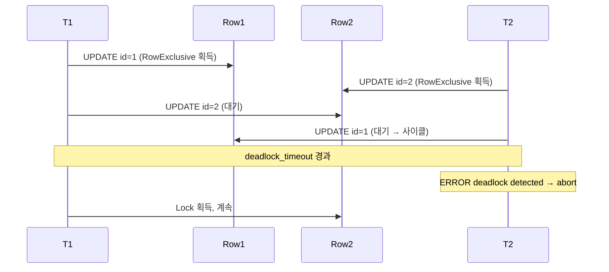

# 7장. 트랜잭션과 격리 수준 — ACID, SSI, Lock, Deadlock

트랜잭션(Transaction)은 "원자적 단위의 작업"이다. 단순하지만 이 단순함 뒤에는 **동시성 제어(concurrency control)**의 모든 문제가 숨어 있다. PostgreSQL은 MVCC(Multi-Version Concurrency Control, 3장 참조) 위에 **세 가지 격리 수준**을 구현하고, 행/테이블 단위의 여러 Lock으로 동시성을 조율한다. 이 장은 ACID의 의미, SQL 표준 이상현상, PostgreSQL이 실제로 제공하는 격리 수준의 차이, 그리고 운영에서 마주치는 Lock·Deadlock 문제를 다룬다.

---

## 7.1 ACID — 트랜잭션의 4대 속성

| 속성 | 의미 | PostgreSQL 구현 근거 |
|-----|------|---------------------|
| **Atomicity** | 전부 커밋되거나 전부 롤백 | WAL, clog, xmin/xmax |
| **Consistency** | 무결성 제약·트리거 위반 시 실패 | CHECK/FK/UNIQUE 제약 |
| **Isolation** | 동시 트랜잭션 간 영향 차단 | MVCC + Lock + 격리 수준 |
| **Durability** | 커밋된 변경은 장애에도 보존 | WAL fsync, checkpoint |

Atomicity와 Durability는 9장(WAL)에서 상세히 다룬다. 이 장은 Isolation에 집중한다.

---

## 7.2 SQL 표준의 이상현상

SQL:1992가 정의한 4가지 이상현상(anomaly)을 기억한다.

| 이상현상 | 정의 |
|---------|------|
| **Dirty Read** | 커밋되지 않은 다른 트랜잭션의 변경을 읽는다 |
| **Non-repeatable Read** | 같은 트랜잭션 내에서 **같은 행**을 다시 읽었는데 값이 바뀌었다 |
| **Phantom Read** | 같은 조건으로 다시 읽었는데 **행 개수**가 바뀌었다 |
| **Serialization Anomaly** (PostgreSQL이 추가한 개념) | 직렬 실행으로는 나올 수 없는 결과가 나온다 |

```mermaid
flowchart LR
    subgraph Anom[이상 현상]
        DR[Dirty Read<br/>미커밋 값 읽음]
        NRR[Non-repeatable<br/>같은 행이 변함]
        PH[Phantom Read<br/>행 개수가 변함]
        SA[Serialization<br/>Anomaly]
    end
    subgraph Iso[PostgreSQL 격리 수준]
        RU[Read Uncommitted<br/>= Read Committed]
        RC[Read Committed<br/>기본]
        RR[Repeatable Read<br/>= Snapshot Isolation]
        SER[Serializable<br/>SSI]
    end
    RU -.x DR 없음.-> DR
    RC -.x.-> DR
    RC -.허용.-> NRR
    RC -.허용.-> PH
    RC -.허용.-> SA
    RR -.x.-> DR
    RR -.x.-> NRR
    RR -.x.-> PH
    RR -.허용.-> SA
    SER -.x.-> DR
    SER -.x.-> NRR
    SER -.x.-> PH
    SER -.x.-> SA
```

### PostgreSQL의 특이점

- **Read Uncommitted**는 표준에 있지만, PostgreSQL에서는 **Read Committed와 동일하게 동작**한다. MVCC 덕분에 "커밋되지 않은 값"을 애초에 읽을 수 없다.
- **Repeatable Read**는 표준보다 강하다. **Phantom Read까지 방지**한다(표준은 NRR만 방지). 내부적으로는 "Snapshot Isolation".
- **Serializable**은 SSI(Serializable Snapshot Isolation)로, 9.1부터 직렬화 보장. 성능 오버헤드 존재.

---

## 7.3 PostgreSQL의 격리 수준 — 실제 동작

### Read Committed (기본값)

- **각 문(statement)마다** 새 스냅샷을 뜬다.
- 이미 커밋된 데이터만 보이고, 실행 도중 다른 트랜잭션이 커밋한 변경은 **다음 문**부터 반영.
- NRR, Phantom, SA 모두 가능.

```sql
-- T1
BEGIN;
SELECT balance FROM accounts WHERE id = 1;   -- 1000

-- (T2가 그 사이 balance를 500으로 UPDATE & COMMIT)

SELECT balance FROM accounts WHERE id = 1;   -- 500  ← NRR 발생
COMMIT;
```

**왜 기본인가**: 대부분의 OLTP는 최신값이 보이는 것이 더 자연스럽다. Snapshot 영속 비용(long snapshot)이 없어 VACUUM 친화적이다.

### UPDATE의 특수 규칙 — Locking Read

Read Committed에서 `UPDATE`/`DELETE`가 이미 다른 트랜잭션이 수정 중인 행을 만나면, **그 트랜잭션의 종료를 기다린 뒤, 커밋되었다면 그 커밋 후 버전으로 다시 검사**한다. 이를 "EvalPlanQual" 재시도라 부르며, 사용자에게는 마치 최신값에 적용되는 것처럼 보인다. 이 때문에 Read Committed에서도 "lost update"는 드물게만 발생한다.

### Repeatable Read — Snapshot Isolation

- 트랜잭션 시작 시점에 **한 번 스냅샷**을 뜨고 끝까지 재사용.
- NRR, Phantom 모두 방지(표준보다 강함).
- 쓰기 충돌 시 **`could not serialize access due to concurrent update`** 에러(40001) → 재시도 필요.

```sql
-- T1
BEGIN ISOLATION LEVEL REPEATABLE READ;
SELECT balance FROM accounts WHERE id = 1;   -- 1000

-- T2: UPDATE accounts SET balance=500 WHERE id=1; COMMIT;

SELECT balance FROM accounts WHERE id = 1;   -- 1000 (여전히 스냅샷)
UPDATE accounts SET balance = balance - 100 WHERE id = 1;
-- ERROR:  could not serialize access due to concurrent update
ROLLBACK;
-- → 애플리케이션이 재시도 로직을 가져야 함
```

### Serializable — SSI

- Repeatable Read의 스냅샷 읽기 + **Predicate Lock**으로 직렬화 충돌 탐지.
- 직렬 실행과 동등한 결과를 보장.
- 충돌 시 `serialization_failure` (SQLSTATE 40001) → **재시도**.

전형적인 "write skew" 예시:

```
제약: 최소 한 명은 당직이어야 한다 (Alice, Bob 모두 당직 중이면 off 가능)

T1: IF (count active = 2) Alice off
T2: IF (count active = 2) Bob off
-- 둘 다 Read Committed/RR에서는 성공 → 둘 다 off → 제약 위반!
-- Serializable에서는 하나가 serialization_failure
```

**비용**: 읽기 집합을 추적하는 Predicate Lock 오버헤드. `max_pred_locks_per_transaction`(기본 64) 부족 시 경고. 고경합 환경은 재시도 폭증 가능.

### 설정

```sql
-- 세션 기본
SET default_transaction_isolation = 'repeatable read';

-- 트랜잭션 시작 시
BEGIN ISOLATION LEVEL SERIALIZABLE;
BEGIN ISOLATION LEVEL SERIALIZABLE READ ONLY DEFERRABLE;  -- SSI에서 재시도 없음 권장 옵션
```

`READ ONLY DEFERRABLE`: 읽기 전용 SSI 트랜잭션의 serialization_failure를 방지. 대신 시작이 지연될 수 있다(안전한 스냅샷을 기다림). 리포팅·배치에 유용.

---

## 7.4 Lock — 테이블 레벨과 행 레벨

MVCC로 **읽기와 쓰기는 서로 블록하지 않지만**, 쓰기-쓰기나 DDL은 Lock이 필요하다. PostgreSQL은 8단계 테이블 레벨 Lock과 여러 행 레벨 Lock을 구분한다.

### 테이블 레벨 Lock 8단계

약한 순서 → 강한 순서:

| Lock mode | 대표 작업 | 호환 (X = 충돌) |
|----------|---------|---------------|
| 1. `ACCESS SHARE` | SELECT | `AccessExclusive`만 X |
| 2. `ROW SHARE` | SELECT FOR UPDATE/SHARE | `Exclusive`, `AccessExclusive` X |
| 3. `ROW EXCLUSIVE` | INSERT/UPDATE/DELETE | 4,5,6,7,8 X |
| 4. `SHARE UPDATE EXCLUSIVE` | VACUUM, ANALYZE, CREATE INDEX CONCURRENTLY | 자기 자신 및 5,6,7,8 X |
| 5. `SHARE` | CREATE INDEX (non-concurrent) | 3,4,6,7,8 X |
| 6. `SHARE ROW EXCLUSIVE` | CREATE TRIGGER, 일부 ALTER | 자기 자신 및 3~8 X |
| 7. `EXCLUSIVE` | REFRESH MATERIALIZED VIEW CONCURRENTLY | 2~8 X |
| 8. `ACCESS EXCLUSIVE` | DROP, TRUNCATE, 대부분 ALTER TABLE, REINDEX(비CONC), VACUUM FULL | 모두 X |

### 호환 그래프 (개념도)

```mermaid
flowchart LR
    subgraph Weak[약한 Lock]
        AS[AccessShare<br/>SELECT]
        RS[RowShare<br/>FOR UPDATE]
        RE[RowExclusive<br/>INSERT/UPDATE/DELETE]
    end
    subgraph Mid[중간 Lock]
        SUE[ShareUpdateExclusive<br/>VACUUM, ANALYZE, CIC]
        SH[Share<br/>CREATE INDEX]
        SRE[ShareRowExclusive<br/>CREATE TRIGGER]
    end
    subgraph Strong[강한 Lock]
        EX[Exclusive<br/>REFRESH MV CONCURRENTLY]
        AE[AccessExclusive<br/>DROP/TRUNCATE/ALTER]
    end
    AS -.호환.-> RS
    AS -.호환.-> RE
    AS -.호환.-> SUE
    AS -.호환.-> SH
    AS -.호환.-> SRE
    AS -.호환.-> EX
    AS -.x.-> AE
    RE -.x.-> SUE
    RE -.x.-> SH
    SUE -.x 자기.-> SUE
    SRE -.x 자기.-> SRE
    AE -.x 모든것.-> AS
```

### 왜 이렇게 많은가

운영에서 가장 자주 만나는 Lock은 `ROW EXCLUSIVE`(INSERT/UPDATE/DELETE)와 `ACCESS EXCLUSIVE`(DDL)다. `ACCESS EXCLUSIVE`는 **읽기조차 차단**하므로, DDL을 잘못 내리면 바로 서비스 장애가 된다. 대안:

- `CREATE INDEX CONCURRENTLY` → `SHARE UPDATE EXCLUSIVE` (INSERT/UPDATE와 공존)
- 11+ `ADD COLUMN ... DEFAULT <non-volatile>`은 더 이상 전체 재기록 안 함 → Lock 시간 단축
- `ALTER TABLE ... SET NOT NULL` 대신, **CHECK 제약 NOT VALID → VALIDATE CONSTRAINT** 패턴 (12+ NOT NULL도 CHECK 통해 경량 검증 가능)
- `lock_timeout`을 짧게 설정해 서비스 차단 회피:

```sql
SET lock_timeout = '2s';
ALTER TABLE orders ADD COLUMN processed_at timestamptz;
-- 2초 내 Lock 못 잡으면 에러 → 재시도 루프
```

### 행 레벨 Lock

UPDATE/DELETE는 **행 단위 배타 Lock**을 잡는다. 명시적 Lock도 가능:

| 문법 | Lock 강도 |
|-----|---------|
| `SELECT ... FOR UPDATE` | 강한 행 배타 (UPDATE 예정) |
| `SELECT ... FOR NO KEY UPDATE` | UPDATE 중 키 미변경 — FK 경합 감소 (9.3+) |
| `SELECT ... FOR SHARE` | 다른 FOR UPDATE 차단, SELECT는 허용 |
| `SELECT ... FOR KEY SHARE` | FK 참조 무결성용, FOR UPDATE 허용 (9.3+) |

**FOR UPDATE의 수식어**:

- `NOWAIT`: 이미 Lock된 행 만나면 즉시 에러
- `SKIP LOCKED`: Lock된 행을 건너뛰고 계속 진행 → **큐 워커** 패턴에 유용 (9.5+)
- `OF <table>`: 조인 중 특정 테이블의 행만 Lock

```sql
-- 큐 소비자 패턴
BEGIN;
SELECT * FROM jobs
WHERE status = 'pending'
ORDER BY created_at
FOR UPDATE SKIP LOCKED
LIMIT 10;

-- → 처리
UPDATE jobs SET status = 'done' WHERE id = ANY(...);
COMMIT;
```

**왜 유용한가**: 여러 워커가 동시에 `SELECT ... FOR UPDATE`를 해도 서로 다른 행을 집게 된다. Lock 대기 없이 수평 확장 가능.

### 행 Lock은 튜플 헤더에 기록된다

PostgreSQL의 행 Lock은 Lock Manager의 메모리에 저장되지 않는다(그러면 금방 고갈된다). 대신 **튜플의 `xmax` 필드에 Lock 보유 xid를 적는 방식**으로 디스크에 기록된다. 따라서 행 수가 많아도 Lock 자체는 고갈되지 않지만, **인플라이트 xid 추적**을 위해 multixact(다중 Lock 보유자 표현)가 사용되며, `MULTIXACT_MEMBER_BUFFERS`/멤버 SLRU가 병목이 될 수 있다.

---

## 7.5 Deadlock — 탐지와 대응

Deadlock은 **A가 B의 Lock을 기다리고, B가 A의 Lock을 기다리는** 상황. PostgreSQL은 `deadlock_timeout`(기본 1s) 이후 대기 그래프를 검사해 사이클을 감지하고, **하나의 트랜잭션을 자동으로 abort**한다.



```
ERROR:  deadlock detected
DETAIL: Process 12345 waits for ShareLock on transaction 98765; blocked by process 67890.
HINT:  See server log for query details.
```

### 서버 로그 설정

```conf
deadlock_timeout = 1s
log_lock_waits = on            # deadlock_timeout 이상 대기 시 WARN 로그
log_line_prefix = '%t %p %d %u %a %r '
```

`log_lock_waits = on`이면 deadlock 직전에 긴 Lock 대기를 로그에 남겨준다. 튜닝 시 매우 유용.

### 예방

1. **접근 순서를 일관되게**: 모든 트랜잭션이 `accounts → orders` 순서로 접근하면 교차 대기 안 생김.
2. **짧은 트랜잭션**: Lock 보유 시간을 최소화.
3. **FOR UPDATE로 명시적 선점**: 읽는 순간 Lock을 잡아 이후 교차 대기 방지.
4. **낮은 격리 → Read Committed + UPSERT**: 같은 key 경합이 잦으면 `INSERT ... ON CONFLICT ...`로 단일 문으로 병합.

---

## 7.6 Advisory Lock — 애플리케이션 수준 Lock

MVCC 행 Lock으로 표현 안 되는 "논리적 잠금"이 필요할 때. 숫자(64-bit 또는 (int32, int32))로 식별되는 임의의 Lock.

```sql
-- 세션 Lock (세션 종료 시 자동 해제)
SELECT pg_advisory_lock(12345);
-- 작업
SELECT pg_advisory_unlock(12345);

-- 트랜잭션 Lock (COMMIT/ROLLBACK 시 자동 해제)
SELECT pg_advisory_xact_lock(12345);

-- Non-blocking
SELECT pg_try_advisory_lock(12345);   -- 성공 시 true, 이미 잡혀있으면 false
```

### 용례

- **크론잡 직렬화**: 여러 인스턴스의 스케줄러가 중복 실행 방지
  ```sql
  SELECT pg_try_advisory_lock(hashtext('daily_rollup'));
  ```
- **논리적 리소스 점유**: 파일 경로, 외부 API 호출 슬롯 등
- **배포 중 DB 마이그레이션**: 단일 프로세스만 마이그레이션 실행

### 주의

- 이름공간 전역이므로 **충돌 규칙을 팀에서 관리**해야 한다.
- 연결 풀(pgBouncer transaction 모드)에서 **세션 Lock은 위험** (다른 요청이 같은 백엔드를 재사용). xact Lock만 사용 권장.

---

## 7.7 pg_locks / pg_blocking_pids() — 실전 진단

### 현재 Lock 상황

```sql
-- 대기 중인 Lock만
SELECT pid,
       mode,
       locktype,
       relation::regclass,
       granted,
       query,
       state
FROM pg_locks l
JOIN pg_stat_activity a USING (pid)
WHERE NOT granted;
```

### 누가 누구를 블록하고 있나 (9.6+)

```sql
SELECT blocked.pid         AS blocked_pid,
       blocked.query       AS blocked_query,
       blocked.state,
       now() - blocked.query_start AS wait_time,
       blocking.pid        AS blocking_pid,
       blocking.query      AS blocking_query,
       blocking.state      AS blocking_state,
       blocking.application_name
FROM pg_stat_activity blocked
JOIN LATERAL (
    SELECT pid, query, state, application_name
    FROM pg_stat_activity
    WHERE pid = ANY(pg_blocking_pids(blocked.pid))
) blocking ON true
WHERE blocked.wait_event_type = 'Lock';
```

### 긴 idle in transaction 찾기 — VACUUM을 막는 주범

```sql
SELECT pid, usename, application_name,
       state,
       xact_start,
       now() - xact_start AS tx_age,
       query
FROM pg_stat_activity
WHERE state IN ('idle in transaction', 'idle in transaction (aborted)')
  AND now() - xact_start > interval '5 minutes'
ORDER BY xact_start;
```

운영에서는 `idle_in_transaction_session_timeout`(기본 0 = 무제한)을 반드시 설정한다:

```conf
idle_in_transaction_session_timeout = '5min'
statement_timeout = '30s'          # 환경에 맞게
lock_timeout = '2s'                # DDL/세션에서 주로 사용
```

### Lock 강제 해제

```sql
-- 부드럽게: 쿼리 취소
SELECT pg_cancel_backend(<pid>);

-- 강제: 연결 종료
SELECT pg_terminate_backend(<pid>);
```

---

## 7.8 SAVEPOINT, 서브트랜잭션, 그리고 오버플로우

### SAVEPOINT

트랜잭션 내부에 **부분 롤백 지점**을 만든다.

```sql
BEGIN;
  INSERT INTO orders (...) VALUES (...);
  SAVEPOINT sp1;
    INSERT INTO order_items (...) VALUES (...);
    -- 에러 발생
    ROLLBACK TO SAVEPOINT sp1;
  INSERT INTO audit (...) VALUES (...);
COMMIT;
```

### 서브트랜잭션과 그 비용

SAVEPOINT 하나가 내부적으로 **새 xid를 할당**받는다(쓰기가 있을 때). 트랜잭션이 많은 서브트랜잭션을 가지면:

- 각 서브 xid가 `xmin/xmax`에 기록될 수 있음
- **서브트랜잭션 캐시(32 엔트리 per backend)**를 초과하면 visibility 검사 때마다 `pg_subtrans` SLRU 조회 → **서브트랜잭션 오버플로우**, 성능 급감

### 14+ 완화

PG14는 `pg_subtrans` SLRU 크기 튜닝과 일부 스냅샷 빌드 최적화로 오버플로우 영향을 완화했으나, **근본 해결은 아니다**. ORM이 모든 쿼리를 암묵 SAVEPOINT로 감싸는 경우(`SET TRANSACTION ... AUTOSAVEPOINT` 류) 관찰 필요.

### 주의 원칙

- **SAVEPOINT는 꼭 필요할 때만**: 예외 처리용이면 pl/pgsql BEGIN..EXCEPTION 블록도 내부적으로 SAVEPOINT를 연다.
- 긴 루프에서 한 번씩 ROLLBACK TO SAVEPOINT를 하지 말 것. 서브 xid가 누적된다.
- **Standby replay에서의 민감도**: 많은 서브트랜잭션 트랜잭션은 Standby의 `KnownAssignedXids`에 부담이 된다.

---

## 7.9 운영 권장치와 체크리스트

### postgresql.conf 기준값

```conf
# 락/타임아웃
deadlock_timeout = 1s
statement_timeout = 0               # 또는 30s ~ 수 분 (워크로드별)
lock_timeout = 0                    # 또는 2s (DDL 보호 세션에서 SET)
idle_in_transaction_session_timeout = 5min
log_lock_waits = on

# 격리
default_transaction_isolation = 'read committed'  # 기본 유지 권장

# SSI
max_pred_locks_per_transaction = 64     # 고경합 서비스는 상향
```

### 쿼리/코드 원칙

| 원칙 | 근거 |
|-----|------|
| 트랜잭션은 짧게, 명시적 종료 | idle in tx가 VACUUM·Replication Slot을 막는다 |
| 격리 수준 상승은 "진짜 필요할 때만" | RR/Serializable은 재시도 루틴을 강제한다 |
| UPSERT는 `INSERT ... ON CONFLICT DO UPDATE` | Deadlock 감소, 애플리케이션 재시도 회피 |
| 접근 순서 고정 | Deadlock 예방 |
| FOR UPDATE SKIP LOCKED로 큐 워커 구현 | 수평 확장, 경합 최소화 |
| DDL 전 `lock_timeout` SET | ACCESS EXCLUSIVE가 서비스 블록하는 것 방지 |
| Advisory Lock은 xact 단위 권장 | 풀링 환경 안전 |
| `idle_in_transaction_session_timeout` 필수 | 실수로 커밋 잊은 세션의 피해 한정 |

### 장애 대응 순서

```
1. 경보 수신 → pg_stat_activity 의 긴 쿼리 / idle in tx 확인
2. pg_blocking_pids() 쿼리로 블록 체인 추적
3. 원인 세션 pg_cancel_backend → 안 되면 pg_terminate_backend
4. DDL이 원인이면 lock_timeout 설정 후 재시도
5. 사후: log_lock_waits 로그 분석, 코드/인덱스 수정
```

---

## 공식 문서 참조

- **트랜잭션 격리**: https://www.postgresql.org/docs/current/transaction-iso.html
- **명시적 Lock**: https://www.postgresql.org/docs/current/explicit-locking.html
- **MVCC 개요**: https://www.postgresql.org/docs/current/mvcc.html
- **동시성 제어**: https://www.postgresql.org/docs/current/mvcc-intro.html
- **SELECT FOR UPDATE / SKIP LOCKED**: https://www.postgresql.org/docs/current/sql-select.html#SQL-FOR-UPDATE-SHARE
- **Advisory Lock 함수**: https://www.postgresql.org/docs/current/functions-admin.html#FUNCTIONS-ADVISORY-LOCKS
- **pg_locks 뷰**: https://www.postgresql.org/docs/current/view-pg-locks.html
- **Deadlock 처리**: https://www.postgresql.org/docs/current/runtime-config-locks.html

---

*다음 장: 8장. VACUUM과 Autovacuum — Bloat, XID Wraparound, Visibility Map*
