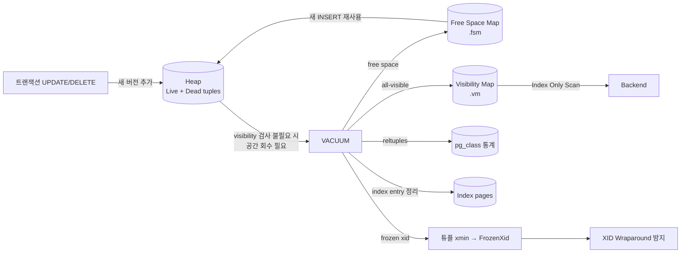
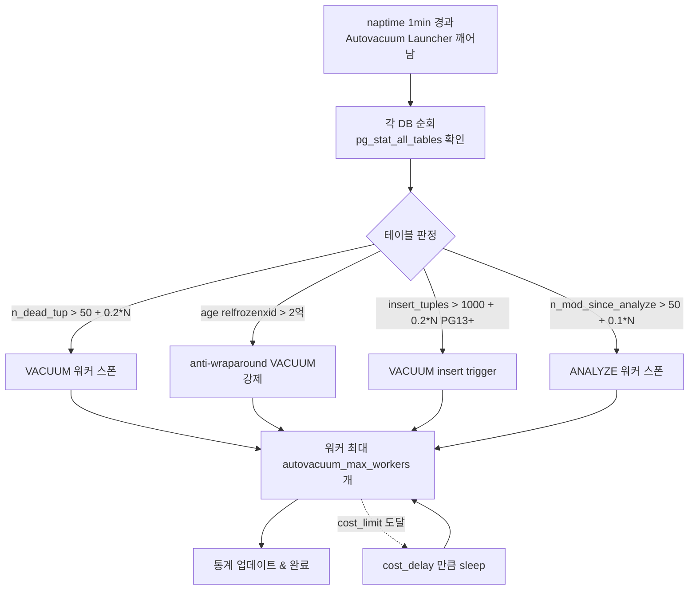
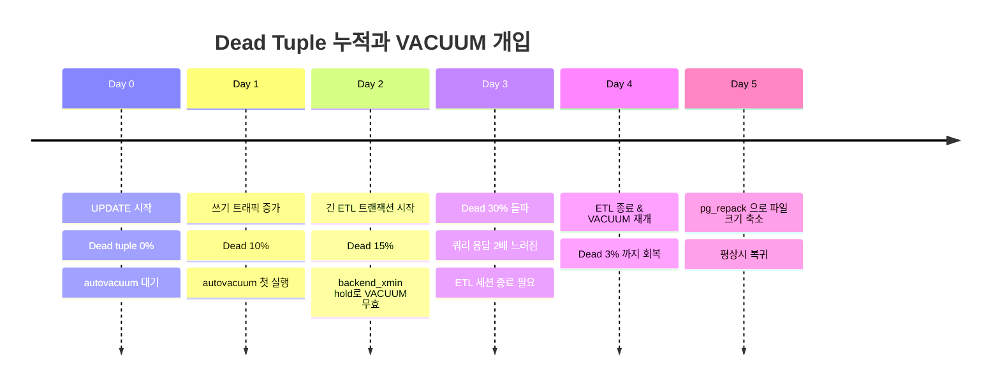
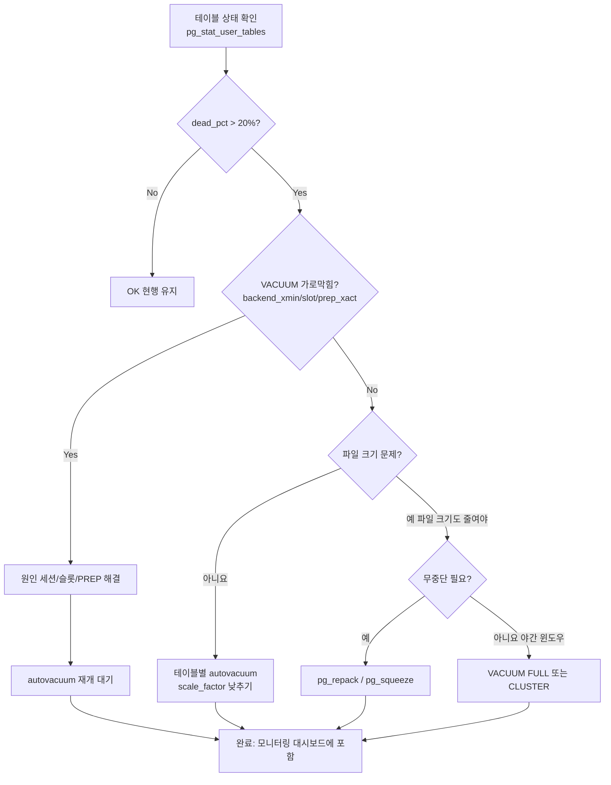

# 8장. VACUUM과 Autovacuum — Bloat, XID Wraparound, Visibility Map

PostgreSQL은 MVCC를 위해 **모든 UPDATE·DELETE가 새 튜플을 만들거나 기존 튜플을 "죽은 상태로 표시"**한다(3장 참조). 이 Dead Tuple을 회수하고, 통계를 갱신하고, XID 소진을 방지하는 **모든 유지보수 작업의 총합**이 VACUUM이다. Autovacuum은 이것을 백그라운드에서 자동으로 수행하는 런처·워커 체계다. 운영 장애의 상당수(Bloat 폭증, XID Wraparound, 쿼리 지연)가 VACUUM 문제로 귀결된다. 이 장은 VACUUM의 내부 동작, Autovacuum 튜닝, 그리고 VACUUM을 방해하는 요인을 다룬다.

---

## 8.1 왜 VACUUM이 필요한가 — MVCC 복습

PostgreSQL의 UPDATE는 "제자리 수정"이 아니라 **새 튜플 삽입 + 기존 튜플의 xmax 표시**다. DELETE는 xmax만 표시하고 물리적으로 지우지 않는다.

```
UPDATE orders SET amount = 200 WHERE id = 1;

-- 이전 튜플: (id=1, amount=100, xmin=100, xmax=200)  ← Dead (xmax=200 커밋됨)
-- 새 튜플:   (id=1, amount=200, xmin=200, xmax=0)    ← Live
```

모든 활성 스냅샷에서 **더 이상 보이지 않는** Dead Tuple은 공간을 회수해야 한다. 이것을 하지 않으면:

1. **Bloat**: 테이블·인덱스가 무한정 커짐 → 스캔 I/O 증가, 캐시 효율 저하
2. **XID Wraparound**: 32-bit xid 순환으로 **갑자기 과거 커밋이 미래처럼 보이는 재앙**
3. **Index-Only Scan 불가**: Visibility Map이 갱신되지 않아 항상 Heap 접근
4. **통계 부정확**: pg_class.reltuples 오류 → 플래너 오판



---

## 8.2 VACUUM이 실제로 하는 일

### 일반 VACUUM (lazy vacuum)

1. **Heap 스캔**: 페이지를 읽어 Dead Tuple을 식별
2. **Index entry 정리**: 각 인덱스를 통째로 스캔하며 Dead Tuple을 가리키는 엔트리 제거
3. **Heap 2차 스캔**: Dead Tuple의 줄(line pointer)을 재사용 가능 상태로 표시, 페이지 내 공간 회수
4. **FSM 갱신**: 각 페이지의 free space 정보를 `.fsm` 파일에 기록 → 이후 INSERT가 재사용
5. **VM 갱신**: 모든 튜플이 live이고 frozen인 페이지를 `.vm`에 `all-visible`/`all-frozen`으로 표시
6. **통계 갱신**: `pg_class.reltuples`, `relpages` 업데이트
7. **XID Freeze**: 충분히 오래된 튜플의 xmin을 `FrozenXid`로 교체 → wraparound 방지

핵심: 일반 VACUUM은 **Heap·Index 파일 크기를 거의 줄이지 않는다**. 페이지 내 공간을 회수할 뿐, 물리적 파일은 테이블 끝에서만 절단된다(그것도 조건부).

### VACUUM FULL

- 테이블을 **전체 재작성**하여 파일 크기를 줄인다.
- `ACCESS EXCLUSIVE` Lock → 읽기도 차단.
- **서비스 중 절대 금지에 가까움**. 대안은 `pg_repack`, `pg_squeeze`.

### VACUUM vs VACUUM FULL vs CLUSTER vs pg_repack

| 도구 | 공간 회수 | Lock | 특징 |
|-----|---------|------|------|
| `VACUUM` | 페이지 내 재사용 | SUE (비차단) | 기본. 파일 크기 안 줄어듦 |
| `VACUUM FULL` | 완전 회수 + 파일 축소 | **AccessExclusive** | 서비스 차단 |
| `CLUSTER` | VACUUM FULL + 인덱스 순 정렬 | AccessExclusive | 물리 정렬 효과 |
| `pg_repack` (확장) | 완전 회수 + 거의 무중단 | **잠시**의 AE만 | 별도 확장, 운영 표준 |
| `pg_squeeze` (확장) | 완전 회수 + 무중단 | 순간 AE | 논리적 복제 기반 |

```sql
-- VACUUM 옵션 (9.0+ / 12+ 기준)
VACUUM (VERBOSE, ANALYZE) orders;
VACUUM (FREEZE) orders;                 -- 모든 가능한 튜플을 즉시 frozen
VACUUM (FULL, ANALYZE) orders;          -- 주의: AccessExclusive
VACUUM (DISABLE_PAGE_SKIPPING) orders;  -- VM 무시, 모든 페이지 검사
VACUUM (INDEX_CLEANUP OFF) orders;      -- 인덱스 정리 건너뛰기 (12+)
VACUUM (PARALLEL 4) orders;             -- 인덱스 병렬 정리 (13+)
```

### Visibility Map의 역할

VM은 테이블당 `.vm` 파일로 존재하며, 페이지별로 2비트를 유지한다:
- `all-visible`: 이 페이지의 모든 튜플이 모든 스냅샷에서 보임 → Index-Only Scan 가능
- `all-frozen`: 모든 튜플이 frozen → VACUUM 건너뛰기 가능 (wraparound anti-vacuum 대상에서도 skip)

`all-frozen`은 9.6에서 도입되었으며, 쓰기가 거의 없는 대형 아카이브 테이블의 반복 freeze 비용을 없앤다.

---

## 8.3 Autovacuum — 언제 자동으로 도는가

Autovacuum Launcher가 주기적으로(`autovacuum_naptime`, 기본 1min) 깨어나 DB 별로 **VACUUM/ANALYZE 필요 테이블**을 식별하고, 워커를 생성한다.

### 트리거 공식

```
autovacuum_vacuum_threshold      = 50    (기본)
autovacuum_vacuum_scale_factor   = 0.2   (기본, 20%)

VACUUM 필요 = (n_dead_tup > threshold + scale_factor * reltuples)
            = 50 + 0.2 * 행수
```

```
autovacuum_analyze_threshold     = 50
autovacuum_analyze_scale_factor  = 0.1   (기본, 10%)

ANALYZE 필요 = (n_mod_since_analyze > threshold + scale_factor * reltuples)
```

13+: `autovacuum_vacuum_insert_threshold`(기본 1000), `autovacuum_vacuum_insert_scale_factor`(기본 0.2)로 **INSERT-only 테이블도 VACUUM 트리거**. 이전에는 append-only 테이블이 autovacuum 대상이 되지 않아 VM 갱신이 지연되고 wraparound 직전에야 emergency vacuum이 도는 문제가 있었다.

### 자동 Freeze 트리거

```
autovacuum_freeze_max_age = 200_000_000  (기본, 2억)

pg_class.relfrozenxid의 age가 이 값 초과 → "anti-wraparound" VACUUM 강제 실행
```

이 VACUUM은 **autovacuum 비활성 테이블에도, 서버 종료 직전에도 뜬다**. 긴 트랜잭션이 막고 있으면 재앙.



---

## 8.4 Autovacuum 튜닝

### 기본값의 한계

| 파라미터 | 기본 | 문제 |
|---------|-----|------|
| `autovacuum_vacuum_scale_factor` | `0.2` | 10억 행 테이블은 2억 Dead Tuple 쌓여야 돈다 |
| `autovacuum_vacuum_cost_limit` | `200` (→ -1이면 `vacuum_cost_limit`=200) | 초당 약 1MB~8MB 읽기 상당. 큰 테이블엔 턱없이 느림 |
| `autovacuum_vacuum_cost_delay` | `2ms` (12+) | 이전 20ms. 과거엔 너무 느렸음 |
| `autovacuum_max_workers` | `3` | 대규모 DB에선 부족 |
| `autovacuum_naptime` | `1min` | 고빈도 쓰기에선 길다 |

### 테이블별 storage parameter

대형·핫 테이블은 개별 설정이 정답:

```sql
ALTER TABLE orders SET (
  autovacuum_vacuum_scale_factor = 0.02,      -- 2%로 낮춤
  autovacuum_vacuum_threshold = 10000,
  autovacuum_analyze_scale_factor = 0.01,
  autovacuum_vacuum_cost_limit = 2000,         -- 더 빠르게
  autovacuum_vacuum_cost_delay = 2ms,
  fillfactor = 85                              -- HOT 업데이트 공간
);

-- Append-only 로그 테이블 — freeze 위주
ALTER TABLE logs SET (
  autovacuum_vacuum_insert_scale_factor = 0.05,
  autovacuum_freeze_min_age = 0,               -- 공격적 freeze
  autovacuum_vacuum_cost_limit = 5000
);
```

### 전역 튜닝 권장치 — 일반 OLTP

```conf
# postgresql.conf
autovacuum = on                                 # 반드시 on
autovacuum_max_workers = 6                      # CPU, DB 수에 맞춤
autovacuum_naptime = 10s                        # 더 자주 깨우기
autovacuum_vacuum_cost_limit = 2000             # 더 많이 읽기 허용
autovacuum_vacuum_cost_delay = 2ms              # 짧은 sleep (기본 유지)
autovacuum_vacuum_scale_factor = 0.1            # 전체 기본 10%
autovacuum_analyze_scale_factor = 0.05          # 전체 기본 5%
autovacuum_vacuum_insert_scale_factor = 0.1     # PG13+

# WAL 폭주 방지
vacuum_cost_page_hit = 1
vacuum_cost_page_miss = 2                        # 14+: 기본 2, 이전 10 (완화)
vacuum_cost_page_dirty = 20
```

**왜 cost_limit이 핵심인가**: cost_delay와 cost_limit이 autovacuum 속도를 제한한다.
```
"한 cycle에 page_hit=1, page_miss=2, page_dirty=20의 비용을 합산,
 cost_limit(200)을 초과하면 cost_delay(2ms) 만큼 sleep"

이상적 스루풋 ≈ cost_limit / cost_delay * 페이지 처리 단가
= 2000 / 0.002s * 8KB ≈ 8 MB/s (dirty 위주일 때)
```

NVMe I/O 수백 MB/s 환경에서는 기본값이 병목이다. cost_limit을 2000~5000으로 상향하는 것이 현대적 권장.

### 모니터링

```sql
-- 진행 중 autovacuum 확인 (9.6+)
SELECT pid, datname, relid::regclass, phase,
       heap_blks_total, heap_blks_scanned,
       heap_blks_vacuumed,
       num_dead_tuples
FROM pg_stat_progress_vacuum;

-- 마지막 실행 시각, dead tuple
SELECT schemaname, relname,
       n_live_tup, n_dead_tup,
       round(n_dead_tup::numeric / NULLIF(n_live_tup,0), 3) AS dead_ratio,
       last_vacuum, last_autovacuum,
       last_analyze, last_autoanalyze,
       vacuum_count, autovacuum_count
FROM pg_stat_user_tables
WHERE n_dead_tup > 10000
ORDER BY n_dead_tup DESC
LIMIT 20;
```

---

## 8.5 XID Wraparound — 가장 위험한 장애

PostgreSQL의 xid는 32비트(약 40억). 이 값이 순환하면서, **특정 xid를 기준으로 "과거/미래"를 판단**하는 visibility 규칙이 붕괴된다. 방지책은 오래된 튜플의 xmin을 `FrozenXid`(special value)로 교체해 "누가 봐도 과거"로 만드는 것.

### 관련 임계값

| 파라미터 | 기본 | 의미 |
|---------|-----|------|
| `vacuum_freeze_min_age` | `50_000_000` | xid가 이만큼 낡으면 VACUUM이 freeze 시도 |
| `vacuum_freeze_table_age` | `150_000_000` | VM 무시하고 전체 테이블 freeze scan |
| `autovacuum_freeze_max_age` | `200_000_000` | 이 나이 넘기면 anti-wraparound VACUUM 강제 |
| 최대 안전선 | `2_000_000_000` | 이보다 커지면 `database is not accepting commands` — 단일 사용자 모드로 수동 VACUUM 필요 |

### 조기 경고 쿼리

```sql
-- 테이블별 frozenxid age
SELECT c.relname,
       age(c.relfrozenxid) AS xid_age,
       pg_size_pretty(pg_table_size(c.oid)) AS size,
       CASE
         WHEN age(c.relfrozenxid) > 1_500_000_000 THEN 'CRITICAL'
         WHEN age(c.relfrozenxid) > 500_000_000 THEN 'WARN'
         ELSE 'OK'
       END AS status
FROM pg_class c
JOIN pg_namespace n ON n.oid = c.relnamespace
WHERE c.relkind IN ('r','m')
  AND n.nspname NOT IN ('pg_catalog','information_schema')
ORDER BY age(c.relfrozenxid) DESC
LIMIT 20;

-- 데이터베이스 단위
SELECT datname,
       age(datfrozenxid) AS xid_age,
       current_setting('autovacuum_freeze_max_age')::int AS freeze_max_age
FROM pg_database
ORDER BY age(datfrozenxid) DESC;
```

**대응**: `xid_age`가 2억 근처면 anti-wraparound autovacuum이 이미 돌고 있어야 한다. 안 돌면 원인은 **VACUUM이 막히고 있다**는 뜻 → 8.7 참조.

---

## 8.6 Bloat 측정

Dead Tuple 누적으로 테이블·인덱스가 실제 데이터보다 커진 상태. 측정 방법 세 가지:

### 1. pg_stat_user_tables (저렴, 추정)

```sql
SELECT schemaname, relname,
       n_live_tup, n_dead_tup,
       round(100.0 * n_dead_tup / NULLIF(n_live_tup + n_dead_tup, 0), 2) AS dead_pct,
       pg_size_pretty(pg_relation_size(relid)) AS size,
       last_autovacuum
FROM pg_stat_user_tables
WHERE n_live_tup > 10000
ORDER BY n_dead_tup DESC;
```

### 2. pgstattuple (정확, 비싸다)

```sql
CREATE EXTENSION pgstattuple;

-- 정확 스캔 (대형 테이블에선 무겁다)
SELECT * FROM pgstattuple('orders');

-- 근사 (샘플링 기반, 9.5+)
SELECT * FROM pgstattuple_approx('orders');

-- 결과 예:
--  table_len | tuple_count | tuple_len | tuple_percent | dead_tuple_count |
--  dead_tuple_len | dead_tuple_percent | free_space | free_percent
```

`dead_tuple_percent`와 `free_percent`의 합이 30% 이상이면 `pg_repack` 등 재구성을 검토.

### 3. 커뮤니티 bloat 쿼리

소위 "ioguix bloat query"가 유명. 통계·페이지 구조를 기반으로 예상 크기 대비 실제 크기 비율을 계산. 정확도는 낮지만 모든 테이블을 한 번에 볼 수 있어 대시보드용으로 적합. (재현이 길어 여기선 생략; wiki.postgresql.org/wiki/Show_database_bloat 참조)

### 인덱스 Bloat

```sql
SELECT * FROM pgstatindex('idx_orders_created');
-- leaf_fragmentation이 높으면 REINDEX 필요

REINDEX INDEX CONCURRENTLY idx_orders_created;   -- 12+
```

---

## 8.7 VACUUM을 막는 요인

VACUUM은 **현재 활성인 모든 스냅샷의 최소 xid보다 오래된 튜플만** 정리할 수 있다. 따라서 오래된 xid를 붙들고 있는 것은 모두 VACUUM의 적이다.

### 원인 진단

```sql
-- 가장 오래된 xmin을 가진 원인
SELECT
  (SELECT pg_size_pretty(pg_database_size(datname)) FROM pg_database
   WHERE datname = current_database()) AS db_size,
  (SELECT max(age(backend_xmin)) FROM pg_stat_activity WHERE backend_xmin IS NOT NULL) AS max_backend_xmin_age,
  (SELECT max(age(xmin)) FROM pg_replication_slots WHERE xmin IS NOT NULL) AS max_slot_xmin_age,
  (SELECT max(age(transaction)) FROM pg_prepared_xacts) AS max_prep_xact_age;
```

### 네 가지 VACUUM killer

| 원인 | 증상 | 해결 |
|-----|------|-----|
| **긴 트랜잭션** | `pg_stat_activity.backend_xmin`이 오래된 xid | `statement_timeout`, `idle_in_transaction_session_timeout` |
| **2PC prepared transaction** | `pg_prepared_xacts`에 남아있는 거래 | `ROLLBACK PREPARED '<gid>'` 정리 |
| **Replication slot** | Standby가 소비 안 해 슬롯이 xmin을 홀드 | `hot_standby_feedback`, 슬롯 정리·`pg_drop_replication_slot` |
| **Long-running cursor / Hot-standby feedback** | 세션의 스냅샷이 오래 유지 | 커서 스트리밍 쿼리 재검토 |

### 활성 긴 트랜잭션 탐지

```sql
SELECT pid, usename, application_name,
       state,
       xact_start,
       now() - xact_start AS tx_age,
       backend_xmin,
       age(backend_xmin) AS xmin_age,
       left(query, 100) AS q
FROM pg_stat_activity
WHERE backend_xmin IS NOT NULL
ORDER BY age(backend_xmin) DESC
LIMIT 20;
```

`xmin_age`가 100M을 넘어가면 autovacuum이 Dead Tuple을 회수하지 못한다는 신호. 주로 ETL, 리포팅, 버그로 커밋 잊은 세션.

### Replication Slot

```sql
SELECT slot_name, slot_type, active,
       restart_lsn, confirmed_flush_lsn,
       xmin, age(xmin) AS xmin_age,
       pg_size_pretty(
         pg_wal_lsn_diff(pg_current_wal_lsn(), restart_lsn)
       ) AS retained_wal
FROM pg_replication_slots
ORDER BY xmin_age DESC NULLS LAST;
```

비활성 슬롯이 오래 유지되면 WAL도 함께 쌓여 디스크 폭주까지 이어진다. 더 이상 쓰지 않는 슬롯은 반드시 `pg_drop_replication_slot`.

---

## 8.8 Bloat 누적 타임라인



---

## 8.9 VACUUM 워크플로 종합



---

## 8.10 운영 권장치 요약

### postgresql.conf 기본 세팅

```conf
# Autovacuum 기본
autovacuum = on
autovacuum_max_workers = 6
autovacuum_naptime = 10s
autovacuum_vacuum_cost_limit = 2000           # SSD/NVMe에선 상향
autovacuum_vacuum_cost_delay = 2ms
autovacuum_vacuum_scale_factor = 0.1
autovacuum_analyze_scale_factor = 0.05
autovacuum_vacuum_insert_scale_factor = 0.1   # PG13+
autovacuum_freeze_max_age = 200000000          # 기본 유지 (극단적 상향 금지)

# 트랜잭션 가드레일
idle_in_transaction_session_timeout = 5min
statement_timeout = 30s                        # 서비스 워크로드에 맞게
log_autovacuum_min_duration = 1s               # 1초 이상 autovacuum 로그
```

### 핫 테이블 개별 세팅

```sql
ALTER TABLE orders SET (
  autovacuum_vacuum_scale_factor = 0.02,
  autovacuum_vacuum_threshold = 5000,
  autovacuum_analyze_scale_factor = 0.01,
  autovacuum_vacuum_cost_limit = 5000,
  autovacuum_vacuum_cost_delay = 2ms,
  fillfactor = 85
);
```

### 운영 체크리스트

| 항목 | 빈도 | 쿼리/명령 |
|-----|-----|---------|
| Dead tuple 비율 대시보드 | 실시간 | `pg_stat_user_tables` |
| age(relfrozenxid) 모니터 | 일간 | pg_class age 쿼리 |
| VACUUM 진행 중 확인 | 실시간 | `pg_stat_progress_vacuum` |
| Autovacuum 느린 로그 | 상시 | `log_autovacuum_min_duration = 1s` |
| Replication slot age | 일간 | `pg_replication_slots` |
| 긴 트랜잭션 | 실시간 | `pg_stat_activity` backend_xmin |
| Bloat 수치 | 주간 | `pgstattuple_approx` 대표 테이블 |
| REINDEX CONCURRENTLY | 월간~분기 | 핵심 인덱스 |
| pg_repack | 분기~반기 | 파일 축소 필요 테이블 |

### 자주 하는 실수

1. **Autovacuum 끄기** — 재앙의 지름길. 특정 테이블만 `autovacuum_enabled = off` 하더라도 anti-wraparound는 여전히 온다.
2. **VACUUM FULL을 운영 중 실행** — AccessExclusive로 서비스 정지.
3. **대량 배치 DELETE 후 방치** — 한꺼번에 수백만 행 삭제 후 Autovacuum을 기다리는 것. 차라리 파티션 DROP 또는 배치 DELETE + 즉시 `VACUUM (ANALYZE) <table>`.
4. **cost_limit 기본값 방치** — 10억 행 테이블에서 기본 `200`이면 autovacuum이 한 번 도는 데 며칠 걸린다.
5. **긴 ETL 트랜잭션** — VACUUM을 전사적으로 마비시킨다. 배치는 작은 단위로 커밋, 혹은 Standby에서 수행.
6. **Replication slot 방치** — 사용 안 하는 슬롯은 즉시 drop. `wal_keep_size` 대신 슬롯을 쓰되 감시.

---

## 공식 문서 참조

- **Routine VACUUM**: https://www.postgresql.org/docs/current/routine-vacuuming.html
- **Autovacuum 설정**: https://www.postgresql.org/docs/current/runtime-config-autovacuum.html
- **VACUUM 명령**: https://www.postgresql.org/docs/current/sql-vacuum.html
- **pg_stat_progress_vacuum**: https://www.postgresql.org/docs/current/progress-reporting.html#VACUUM-PROGRESS-REPORTING
- **pgstattuple 확장**: https://www.postgresql.org/docs/current/pgstattuple.html
- **pg_repack (커뮤니티)**: https://github.com/reorg/pg_repack

---

*다음 장: 9장. WAL과 Checkpoint — Durability, full_page_writes, wal_compression*
