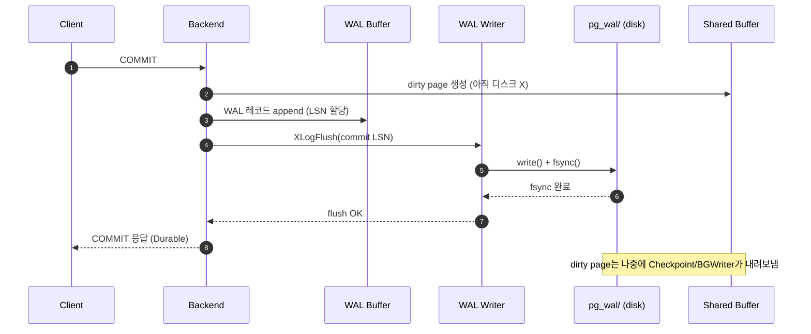
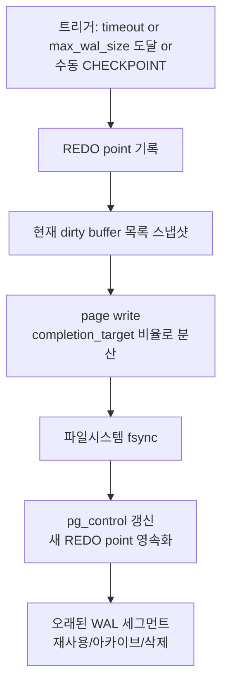
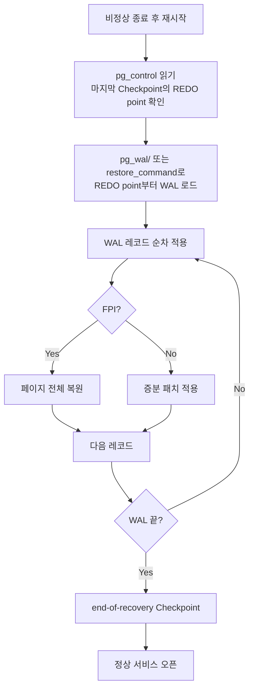

# 9장. WAL과 Checkpoint

> **핵심 요약**
> - WAL(Write-Ahead Log)은 PostgreSQL의 내구성(Durability)·크래시 복구·복제의 공통 기반이다.
> - 변경은 반드시 "WAL 먼저, 데이터 파일 나중"이라는 순서를 따른다. `fsync`의 대상이 WAL인 이유이다.
> - Checkpoint는 주기적으로 Shared Buffer의 dirty page를 데이터 파일로 내려 "복구가 시작될 시작점(redo point)"을 전진시킨다.
> - `pg_wal/` 폭증의 원인 99%는 "누가 WAL을 붙잡고 있는가"이다 — 미회수 replication slot, `archive_command` 실패, `wal_keep_size` 과다.

---

## 9.1 WAL이 하는 일 — 세 가지 역할을 하나의 로그로

PostgreSQL의 WAL은 **한 줄의 선형 로그(linear log)** 로 세 가지 서로 다른 요구를 동시에 만족시킨다.

1. **Durability (내구성)**
   COMMIT이 클라이언트에게 성공으로 돌아가기 전에, 해당 트랜잭션의 변경 사항이 **영속 저장장치(디스크/SSD)의 WAL에 flush** 되어야 한다. 데이터 파일(heap/index)은 아직 디스크에 없어도 된다. 크래시 후 WAL을 리플레이하면 복구되기 때문이다.
2. **Crash Recovery**
   서버가 비정상 종료되면, 재시작 시 마지막 Checkpoint의 redo point부터 WAL을 앞으로 읽어가며 데이터 파일에 반영한다. 즉 WAL은 "잊힌 변경 사항들의 재방송"이다.
3. **Replication의 기반**
   Physical streaming replication은 **WAL 레코드를 그대로 스탠바이로 스트리밍**하고, Logical replication은 WAL을 **디코드**하여 논리적 변경(INSERT/UPDATE/DELETE)으로 변환해 구독자에게 보낸다. 즉 WAL이 없으면 복제도 없다.

이 세 역할이 하나의 로그에 얹혀있기 때문에 PostgreSQL에서 WAL 튜닝은 "내구성 ↔ 성능 ↔ 복제 지연" 사이의 trade-off를 한꺼번에 조정하는 작업이 된다.

### 선 로그, 후 데이터 (Write-Ahead Logging Rule)

WAL의 이름 그대로, **데이터 페이지를 디스크에 내리기 전에 해당 변경을 설명하는 WAL 레코드가 반드시 먼저 flush 되어 있어야 한다**. 이 불변식은 BGWriter·Checkpointer·Backend 어느 프로세스가 page를 쓰든 동일하게 지켜진다.



---

## 9.2 WAL 레코드 구조와 LSN

### WAL 레코드(XLogRecord)
- **헤더**: 길이, 이전 레코드 LSN, xid, Resource Manager ID(heap/btree/gin/…), 체크섬
- **블록 참조(block references)**: 어떤 relfilenode의 어떤 블록이 영향을 받았는지
- **페이로드**: 변경을 재현하는 데 필요한 바이트 (예: INSERT된 튜플 이미지)
- **Full Page Image(FPI)**: Checkpoint 직후 처음 더럽혀지는 페이지는 페이지 전체를 WAL에 기록 (뒤의 9.6 참고)

### LSN (Log Sequence Number)
- WAL 내의 **바이트 단위 위치**를 가리키는 64비트 값 (`pg_lsn` 타입, 표기 `X/Y`).
- 예: `16/B374D848` = `0x16 * 2^32 + 0xB374D848` 바이트 오프셋.
- 복제 지연, 복구 위치, Checkpoint 기록 등 거의 모든 위치 지표가 LSN이다.

```sql
-- 현재 WAL 쓰기 위치
SELECT pg_current_wal_lsn();

-- 두 LSN 사이 거리(바이트)
SELECT pg_wal_lsn_diff('16/B3800000', '16/B0000000');

-- 이 LSN이 어느 WAL 파일에 속하는가
SELECT pg_walfile_name('16/B374D848');
--  →  0000000100000016000000B3
```

---

## 9.3 `wal_level` — 얼마나 자세히 기록할 것인가

| 레벨 | 기록 내용 | 가능한 기능 |
|---|---|---|
| `minimal` | 크래시 복구에 필요한 최소만 | 단일 노드 복구만 |
| `replica` | + 스탠바이 스트리밍/아카이빙에 충분한 정보 | Physical replication, PITR |
| `logical` | + 논리 디코딩(어떤 row가 바뀌었는지 식별) | Logical replication, CDC |

- **v10부터 기본값은 `replica`** — "대부분의 운영 환경에서 바로 복제·PITR을 할 수 있게" 합리화된 기본값.
- `minimal`은 단독 서버에서 벌크 로드 성능만을 최적화할 때만 고려. `COPY FROM`·`CREATE TABLE AS` 등이 **WAL을 건너뛸 수 있는 최적화 경로**가 있다.
- `logical`로 올리면 WAL 양이 눈에 띄게 증가한다 — RID/old row image가 포함되므로. CDC를 쓰는 시스템에서만 활성화.

```conf
# postgresql.conf
wal_level = replica           # default (replica 이상에서만 복제/PITR)
```

`wal_level`은 **서버 재시작이 필요**하다. 또한 변경 시 모든 스탠바이도 함께 재평가해야 한다.

---

## 9.4 WAL 파일과 `pg_wal/` 디렉터리

- WAL은 **세그먼트 파일(기본 16MB)** 의 연속으로 `$PGDATA/pg_wal/`에 저장된다.
- 파일명은 24자리 hex: `[TimelineID(8)][LogID(8)][SegID(8)]`
  예: `000000010000001600000000B3`
- **세그먼트 크기는 `initdb --wal-segsize`로 변경 가능** (1MB ~ 1GB, 2의 멱). 운영 중 변경 불가.
- `pg_wal/`은 **전용 볼륨에 배치**하는 것이 권장된다: 동기적 fsync 부하가 집중되는 경로이기 때문.
- `pg_wal/archive_status/`: `.ready` 파일이 쌓이면 `archive_command`가 아직 처리 못한 WAL이 있다는 신호.

```bash
$ ls -lh $PGDATA/pg_wal/ | head
-rw-------  1 postgres postgres  16M  000000010000001600000000B3
-rw-------  1 postgres postgres  16M  000000010000001600000000B4
drwx------  2 postgres postgres 4.0K  archive_status
```

---

## 9.5 Checkpoint — 복구 시작점을 전진시키기

### 무엇을 하나
1. 현 시점까지 dirty 상태인 shared buffer의 page들을 **데이터 파일로 flush**한다 (write + fsync).
2. `pg_control`의 redo point를 해당 시점의 LSN으로 갱신한다.
3. 이제 그 이전의 WAL은 크래시 복구에 더 이상 필요 없으므로 **재활용/아카이브 대상**이 된다.

### 주요 파라미터

| 파라미터 | 기본값 | 의미 |
|---|---|---|
| `checkpoint_timeout` | `5min` | 시간 기반 Checkpoint 주기 |
| `max_wal_size` | `1GB` | WAL 누적량 기반 Checkpoint 트리거 (soft limit) |
| `min_wal_size` | `80MB` | 재사용을 위해 유지할 최소 WAL |
| `checkpoint_completion_target` | `0.9` (v14+) | Checkpoint I/O를 timeout의 몇 %에 걸쳐 분산 |
| `checkpoint_flush_after` | `256kB` | write 누적 후 OS에 힌트로 flush 요청 |

> **v14 이전에는 `checkpoint_completion_target` 기본값이 `0.5`** 였다. v14에서 `0.9`로 상향되었다. 이미 상향된 값이므로 추가 조정은 대체로 불필요하다.



### Checkpoint 유형
- **Scheduled checkpoint**: `checkpoint_timeout`·`max_wal_size`로 발생. 정상 운영의 대부분.
- **Requested checkpoint**: `CHECKPOINT` 명령, `pg_basebackup` 시작, `pg_start_backup`, 서버 shutdown.
- **End-of-recovery checkpoint**: 크래시 복구 종료 직후 실행.

### "Checkpoint가 너무 자주 일어난다"는 신호
```
LOG:  checkpoints are occurring too frequently (23 seconds apart)
HINT: Consider increasing the configuration parameter "max_wal_size".
```
→ `max_wal_size`를 늘려 WAL 기반 트리거 빈도를 낮춘다. Write-heavy 환경에서 `8GB`~`64GB`까지도 일반적.

---

## 9.6 `full_page_writes`와 Torn Page 방지

### 왜 필요한가
대부분의 OS·디스크는 8KB 쓰기를 **원자적으로 보장하지 않는다**. 쓰는 도중 전원이 끊기면 "앞 4KB는 새 값, 뒤 4KB는 옛 값"인 *torn page*가 디스크에 남을 수 있다.

WAL 레코드는 "해당 페이지의 이 위치에 이 값을 써라"는 **증분 패치**다. 증분 패치는 **올바른 페이지 위에서만 적용 가능**하다. 토른 페이지에 패치를 얹으면 복구가 오히려 망가진다.

### 해결책
**Checkpoint 직후 해당 페이지가 처음 더럽혀질 때, 페이지 전체 이미지(FPI)를 WAL에 기록**한다. 복구 시 먼저 이 FPI로 페이지를 복원하고, 그 위에 증분 WAL을 적용하면 torn page 문제가 해결된다.

```conf
full_page_writes = on         # default, 끄지 말 것
wal_compression = on          # FPI를 압축하여 WAL 양 감소
```

- **거의 모든 운영 시스템에서 `full_page_writes = on`이 필수**이다.
- 예외: 스토리지가 8KB 원자 쓰기를 보장한다는 확신이 있을 때만(PostgreSQL 문서 기준으로도 권장되지 않음).
- FPI는 Checkpoint 직후 WAL 양을 급증시키는 주범이다 → Checkpoint를 너무 자주 하면 WAL이 도리어 더 많이 발생한다는 역설.

---

## 9.7 Background Writer와의 역할 분담

| 프로세스 | 역할 | 끝 상태 |
|---|---|---|
| **Checkpointer** | 주기적으로 "지금 시점 dirty 전부"를 flush, redo point 전진 | 복구 시작점 갱신 |
| **Background Writer (BGW)** | 틈틈이 일부 dirty buffer를 flush, backend가 clean buffer를 잘 찾도록 도움 | backend의 write 지연 완화 |
| **Backend process** | shared_buffer가 꽉 차고 깨끗한 버퍼가 없으면 본인이 dirty를 직접 write | **이 경로가 많아지면 레이턴시 악화** |

### BGWriter 파라미터
```conf
bgwriter_delay = 200ms                  # 라운드 간 대기
bgwriter_lru_maxpages = 100             # 라운드당 최대 쓰기
bgwriter_lru_multiplier = 2.0           # 수요 예측 배수
bgwriter_flush_after = 512kB            # flush 힌트
```

> **진단 팁**: `pg_stat_bgwriter`의 `buffers_backend`가 `buffers_checkpoint`·`buffers_clean` 대비 크다면 → backend가 직접 쓰고 있다는 뜻. `bgwriter_lru_maxpages` 증대 또는 `shared_buffers` 상향 필요.
> (v17부터 일부 컬럼이 `pg_stat_checkpointer`·`pg_stat_io`로 이관되었으니 버전별 뷰 이름을 확인하라.)

---

## 9.8 `synchronous_commit`, `commit_delay`

### `synchronous_commit` — 커밋 응답 시점
| 값 | 의미 | 데이터 손실 위험 |
|---|---|---|
| `on` (기본) | 로컬 WAL flush 완료 후 응답 (복제 있으면 스탠바이 flush까지) | 없음(로컬 한정) |
| `local` | 로컬 WAL flush만. 복제는 대기하지 않음 | 없음(로컬 한정), 스탠바이 지연 시 데이터 불일치 가능 |
| `remote_write` | 스탠바이가 WAL을 OS에 write까지 (fsync는 안 함) | 스탠바이 OS 크래시 시 손실 가능 |
| `remote_apply` | 스탠바이가 리플레이 완료까지 | 읽기 복제 일관성 보장, 가장 느림 |
| `off` | 로컬도 비동기 | **커밋 후 최대 `wal_writer_delay` 동안 손실 가능** |

`off`는 "배치 로그 수집처럼 손실이 소량 허용되는 워크로드"에서만 고려. OLTP에서는 절대 사용하지 않는다.

### 세션 단위 비동기 커밋
```sql
-- 일부 트랜잭션만 빠르게
SET LOCAL synchronous_commit = off;
INSERT INTO event_log SELECT ... FROM staging;
COMMIT;
```

### `commit_delay`, `commit_siblings` — 그룹 커밋
```conf
commit_delay = 0               # 마이크로초. 기본 0 = 비활성
commit_siblings = 5            # delay를 유발하려면 active tx가 이 이상이어야
```
- 동시 커밋이 많을 때 약간의 지연을 주어 **fsync 한 번에 여러 트랜잭션을 묶는다**.
- 최신 하드웨어(NVMe)에서는 효과가 크지 않아 **기본값 0을 유지**하는 경우가 많다.

---

## 9.9 WAL 압축 — `wal_compression`

```conf
wal_compression = on           # 모든 버전 기본 off. v15+는 pglz/lz4/zstd 선택 가능
```

- **주 효과는 Full Page Image의 압축**. 일반 WAL 레코드는 이미 작다.
- v13까지는 활성화 시 pglz만 가능. **v15부터 `pglz` / `lz4` / `zstd` 선택 가능**하다.
- FPI가 많은 워크로드(쓰기 분산된 테이블, 짧은 `checkpoint_timeout`)에서 WAL 양·아카이브 대역폭을 크게 줄인다.
- CPU 비용이 추가되므로 소형 VM에서는 지연이 소폭 증가할 수 있다. 대체로 **on 권장**.

---

## 9.10 운영 이슈 — `pg_wal/` 폭증의 3대 원인

### 증상
`df -h`에서 데이터 디스크 사용률 급등. `pg_wal/` 용량이 `max_wal_size`를 훨씬 초과. 방치하면 **디스크 풀 → PANIC 셧다운**.

### 원인 1. 미회수 Replication Slot
가장 흔한 원인. 슬롯은 "소비자가 읽어갔다고 확인한 지점까지"만 WAL 삭제를 허용한다. 소비자(스탠바이·구독자·디버그용 slot)가 사라졌는데 슬롯만 남으면 WAL이 무한 축적된다.

```sql
SELECT slot_name, slot_type, active, restart_lsn,
       pg_size_pretty(pg_wal_lsn_diff(pg_current_wal_lsn(), restart_lsn)) AS retained
FROM pg_replication_slots
ORDER BY retained DESC;
```

대응:
- 당장 필요 없는 슬롯은 `SELECT pg_drop_replication_slot('name');`
- **`max_slot_wal_keep_size`** (v13+)로 상한을 두어 슬롯이 무제한 WAL을 붙잡지 못하게 한다.

### 원인 2. `archive_command` 실패
`archive_command`가 0을 반환하지 않으면 PostgreSQL은 **해당 WAL을 계속 보관**하며 재시도한다. S3 인증 만료, 디스크 풀, 네트워크 단절 등이 흔한 원인.

```bash
$ ls $PGDATA/pg_wal/archive_status/*.ready | wc -l
# 수천 개 이상이면 경고
```

PostgreSQL 로그에서 `archive command failed`를 확인하고 즉시 고쳐야 한다.

### 원인 3. `wal_keep_size` 과다 (v13+)
```conf
wal_keep_size = 0              # default. 슬롯을 쓰면 0 유지 권장
```
- v12 이전의 `wal_keep_segments`(세그먼트 수)에서 **v13에서 바이트 단위 `wal_keep_size`로 변경**.
- 스탠바이 재연결 여유용 WAL 보관. 슬롯이 있으면 **중복이므로 0이 기본**.

### Crash Recovery 흐름



---

## 9.11 튜닝 가이드 — 워크로드별 관점

### 쓰기 많은 OLTP
```conf
wal_level = replica
max_wal_size = 16GB             # ~ 64GB까지 상향
min_wal_size = 2GB
checkpoint_timeout = 15min      # 더 길게
checkpoint_completion_target = 0.9
wal_compression = on
synchronous_commit = on         # 돈이 걸린 트랜잭션은 반드시 on
wal_buffers = 64MB              # 자동(-1)은 shared_buffers의 1/32이며 상한 16MB. 이보다 크게 쓰려면 반드시 명시 설정 필요
full_page_writes = on
```
- Checkpoint를 **길게·넓게 분산**시켜 peak I/O를 낮춘다.
- `pg_stat_bgwriter`의 `checkpoints_timed` vs `checkpoints_req` 비율을 본다. `_req`가 더 크면 `max_wal_size` 부족.

### 읽기 많은 워크로드
- 위 설정 대부분 기본값으로도 충분.
- `synchronous_commit = off`는 의미 없음 — 읽기는 WAL을 쓰지 않는다.
- 오히려 `shared_buffers`·`effective_cache_size`·읽기 복제 구성이 중요.

### 분석/벌크 로드
- 단일 세션에서 `SET synchronous_commit = off`로 벌크 INSERT 가속.
- 가능하면 `COPY`를 사용하고, 인덱스는 나중에 생성.
- `wal_level = minimal` + 동일 트랜잭션 내 `CREATE TABLE + COPY`는 WAL 건너뛰기(단, 복제·PITR 사용 중이면 `replica` 이상 필수).

---

## 진단 쿼리 모음

```sql
-- Checkpoint 통계 (정시/강제 비율, 분산 효율)
SELECT checkpoints_timed, checkpoints_req,
       buffers_checkpoint, buffers_clean, buffers_backend,
       checkpoint_write_time, checkpoint_sync_time
FROM pg_stat_bgwriter;
-- v17부터는 pg_stat_checkpointer 별도 뷰

-- 현재 WAL 생성 속도 (1초 간격 두 번 찍어 비교)
SELECT pg_current_wal_lsn() AS lsn, clock_timestamp();

-- pg_wal/ 실제 용량
SELECT pg_size_pretty(sum((pg_stat_file('pg_wal/' || name)).size))
FROM pg_ls_dir('pg_wal') AS name
WHERE name ~ '^[0-9A-F]{24}$';

-- 아카이브 적체
SELECT archived_count, failed_count, last_archived_wal, last_archived_time,
       last_failed_wal, last_failed_time
FROM pg_stat_archiver;
```

---

## 체크리스트

- [ ] `wal_level`이 요구 기능에 맞게 설정되어 있는가 (`replica` 이상 권장)
- [ ] `max_wal_size`가 실제 쓰기량 대비 여유 있는가 (Checkpoint too frequent 로그 없음)
- [ ] `full_page_writes = on`이 유지되는가
- [ ] `archive_command`의 실패 카운터가 0인가 (`pg_stat_archiver.failed_count`)
- [ ] `pg_replication_slots`에 고아 슬롯이 없는가
- [ ] `pg_wal/` 볼륨 여유 공간 감시 알림이 있는가
- [ ] `synchronous_commit` 정책이 비즈니스 요구와 일치하는가

---

## 공식 문서 참조

- [Chapter 30. Reliability and the Write-Ahead Log](https://www.postgresql.org/docs/current/wal.html)
- [30.4. WAL Configuration](https://www.postgresql.org/docs/current/wal-configuration.html)
- [30.5. WAL Internals](https://www.postgresql.org/docs/current/wal-internals.html)
- [20.5. Write Ahead Log](https://www.postgresql.org/docs/current/runtime-config-wal.html) — `postgresql.conf` 파라미터 레퍼런스
- [pg_stat_bgwriter / pg_stat_checkpointer](https://www.postgresql.org/docs/current/monitoring-stats.html)
- 관련 치트시트: [`cheatsheets/config_parameters.md`](../cheatsheets/config_parameters.md)
- 관련 장애 케이스: [`troubleshooting/D3_wal_disk_full.md`](../troubleshooting/D3_wal_disk_full.md)
- 다음 장: [10장. Replication](ch10_replication.md)
