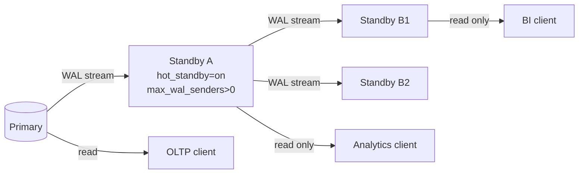
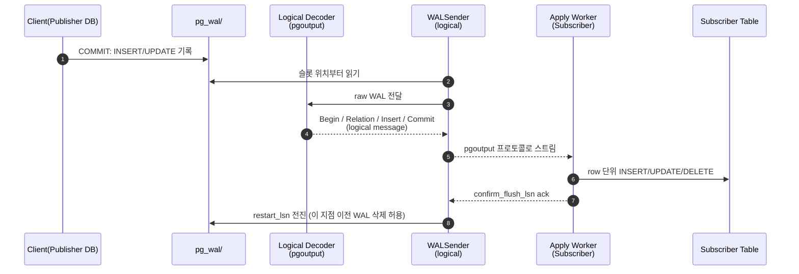
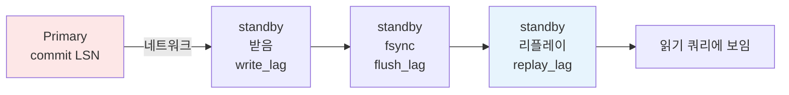
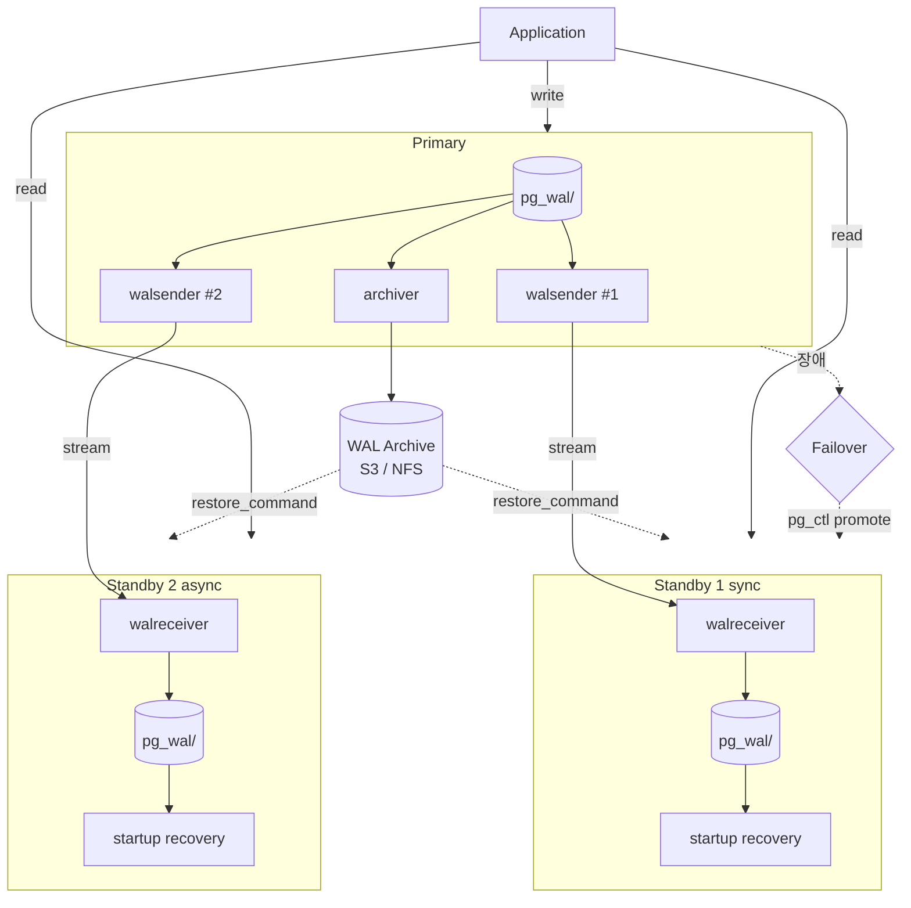

# 10장. Replication — 복제

> **핵심 요약**
> - PostgreSQL은 두 종류의 복제를 제공한다: **Physical(바이트 단위 WAL 스트리밍)** 과 **Logical(논리 변경 디코딩)**.
> - Physical은 "전체 클러스터를 똑같이 복제"하는 HA/재해복구용, Logical은 "특정 테이블만, 다른 버전/다른 스키마로" 복제하는 CDC/마이그레이션용이다.
> - Replication Slot은 "스탠바이가 받지 않은 WAL을 primary가 지우지 않게" 보장하는 약속 장치 — 강력하지만 미회수 시 `pg_wal/`가 터진다.
> - 복제 지연은 **write_lag (WAL 도착) < flush_lag (디스크 영속) < replay_lag (실제 데이터 반영)** 순으로 늘어난다.

---

## 10.1 Physical vs Logical — 복제의 두 축

| 항목 | Physical Replication | Logical Replication |
|---|---|---|
| 단위 | WAL 바이트(블록·레코드) | 논리 row 변경 (INSERT/UPDATE/DELETE) |
| 스코프 | 전체 클러스터(모든 DB, 모든 객체) | 지정한 PUBLICATION (특정 DB·테이블) |
| 스탠바이 쓰기 | 불가 (read-only) | 가능 (독립 primary) |
| 스키마 변경 | 자동으로 함께 복제 | **DDL은 복제되지 않음** (v17까지) |
| 버전 호환 | 메이저 버전 동일 필요 | **서로 다른 메이저 버전** 사이 가능 |
| 용도 | HA, 읽기 분산, DR | CDC, 마이그레이션, 부분 복제 |
| 도입 | v9.0 (스트리밍) | v10 (PUBLICATION/SUBSCRIPTION) |
| 장애 지연 영향 | 비슷 (WAL 스트림) | apply 지연이 더 쉽게 벌어짐 |

> **선택 기준**: "전체 DB를 똑같이, 장애 시 즉시 전환"이면 Physical. "특정 테이블만, 다른 버전/다른 스키마로, 양방향 가능"이면 Logical. **두 가지를 섞어 쓰는 구성도 정상**이다.

---

## 10.2 Streaming Replication 설정

### Primary 측 (`postgresql.conf`)
```conf
wal_level = replica                      # replica 이상 필수
max_wal_senders = 10                     # 동시 접속할 스탠바이·pg_basebackup 수 + 여유
max_replication_slots = 10               # 슬롯을 쓸 예정이면 설정
wal_keep_size = 0                        # 슬롯 사용 시 0 유지 (v13+)
hot_standby = on                         # 스탠바이에서 on일 때 읽기 가능
synchronous_commit = on
```

`pg_hba.conf`에 replication 접속 허용:
```conf
# TYPE  DATABASE       USER          ADDRESS             METHOD
host    replication    replicator    10.0.0.0/16         scram-sha-256
```

복제용 롤 생성:
```sql
CREATE ROLE replicator WITH REPLICATION LOGIN PASSWORD 'xxx';
```

### Standby 측
1. `pg_basebackup`으로 데이터 디렉터리 초기화:
   ```bash
   pg_basebackup -h primary.example -U replicator \
       -D $PGDATA -X stream -R -C -S standby1_slot -P
   ```
   - `-R`: `standby.signal` + `primary_conninfo`를 자동 생성 (v12+)
   - `-C -S`: 실시간으로 physical slot 생성 후 연결
2. `postgresql.auto.conf`에 자동 기록된 내용:
   ```conf
   primary_conninfo = 'host=primary.example port=5432 user=replicator ...'
   primary_slot_name = 'standby1_slot'
   ```
3. `$PGDATA/standby.signal` 파일 존재를 확인 후 기동.

### 핵심 파라미터 요약
| 파라미터 | 위치 | 의미 |
|---|---|---|
| `wal_level = replica` | primary | 복제에 충분한 WAL 기록 |
| `max_wal_senders` | primary | walsender 프로세스 상한 |
| `wal_keep_size` | primary | 슬롯 없이 WAL을 몇 바이트 유지할지 (v13+) |
| `max_slot_wal_keep_size` | primary | **슬롯이 무제한 WAL을 붙잡지 못하게 상한 설정** (v13+) |
| `primary_conninfo` | standby | primary 접속 문자열 |
| `primary_slot_name` | standby | 사용할 physical slot |
| `hot_standby` | standby | 스탠바이에서 읽기 허용 |
| `recovery_target_timeline = 'latest'` | standby | 페일오버 후 새 타임라인 추적 |

---

## 10.3 Replication Slot

### 역할
"스탠바이가 받았음을 확인한 LSN"까지만 `pg_wal/` 삭제를 허용한다. 스탠바이가 잠시 끊겨도 WAL이 보존되므로 **재연결 후 자동 catch-up 가능**.

### Physical Slot
```sql
SELECT pg_create_physical_replication_slot('standby1_slot');
SELECT slot_name, slot_type, active, restart_lsn, confirmed_flush_lsn
FROM pg_replication_slots;
```

### Logical Slot
```sql
SELECT pg_create_logical_replication_slot('cdc_slot', 'pgoutput');
-- wal2json, test_decoding 등 다른 output plugin도 존재
```

### 장점
- 스탠바이의 일시적 단절에 **내성**: WAL이 보존되므로 재동기화 불필요.
- `wal_keep_size`처럼 시간/크기 추측이 아닌 **정확한 필요분만 보관**.

### 위험 — 미회수 슬롯
스탠바이를 폐기했는데 primary에 슬롯만 남았다면 WAL이 무한 축적된다. 이 장애는 치명적이며 `pg_wal/` 폭증의 최빈 원인이다.

**방어책**:
```conf
max_slot_wal_keep_size = 64GB            # v13+. 상한을 넘으면 슬롯을 invalidated로 마킹하고 WAL 정리
```
슬롯이 `invalidated` 상태로 바뀌면 해당 스탠바이는 재동기화가 필요하지만, **primary는 보호된다**.

진단:
```sql
SELECT slot_name, active, wal_status,
       pg_size_pretty(pg_wal_lsn_diff(pg_current_wal_lsn(), restart_lsn)) AS retained_wal
FROM pg_replication_slots
ORDER BY retained_wal DESC;
```

---

## 10.4 Synchronous Replication

### 레벨 (`synchronous_commit`)

| 값 | primary 관점 | 보장 |
|---|---|---|
| `off` | 로컬 WAL도 비동기 | 없음, 커밋 후 손실 가능 |
| `local` | 로컬 WAL flush까지 | 로컬 한정 |
| `on` (기본) | 로컬 + 스탠바이 flush까지 | **스탠바이 디스크에 영속** |
| `remote_write` | 스탠바이 OS write까지 | 스탠바이 OS 크래시 시 손실 가능 |
| `remote_apply` | 스탠바이 리플레이까지 | 읽기 복제 일관성 |

### 대상 스탠바이 지정
```conf
# 이름 기반: 항상 s1, s2가 필수 응답자
synchronous_standby_names = 'FIRST 2 (s1, s2, s3)'

# 쿼럼 기반: 3개 중 아무 2개가 응답하면 커밋
synchronous_standby_names = 'ANY 2 (s1, s2, s3)'
```

이름은 스탠바이의 `application_name`(또는 `cluster_name`)과 매칭된다.

### 실무 주의
- **sync 스탠바이가 하나뿐이면**, 그 스탠바이가 죽는 순간 **primary의 모든 커밋이 무한 대기**한다. 최소 2개 이상, `ANY N` 쿼럼 구성을 권장.
- sync 설정은 **가용성을 위해 가끔 낮춰야 한다**: 스탠바이 재시작 중 primary 커밋 멈춤을 피하려면 일시적으로 `synchronous_commit = local`로 세션 override 가능.
- `remote_apply`는 "방금 쓴 데이터를 스탠바이에서 바로 읽는" causal read 보장에 쓰인다. 지연이 커지니 필요한 트랜잭션만 `SET LOCAL`.

---

## 10.5 Cascading Replication

Primary → Standby A → Standby B 처럼 스탠바이가 다시 소스 역할을 한다. Primary의 walsender 부담을 덜기 위해 사용.



- 캐스케이드된 하위는 **현재 asynchronous만 지원** (synchronous 설정은 A→B 구간에 효과 없음).
- 하위 스탠바이에 `recovery_target_timeline = 'latest'` 필수.

---

## 10.6 Logical Replication (v10+)

### 개념
WAL을 논리 변경으로 디코드하여 구독자(별도 primary)에 적용한다. 구독자는 쓰기가 가능한 독립 클러스터다.

Publisher 측:
```sql
CREATE PUBLICATION pub_orders
  FOR TABLE public.orders, public.order_items;

-- 또는 모든 테이블 (신중히)
CREATE PUBLICATION pub_all FOR ALL TABLES;

-- v15+: 행 필터
CREATE PUBLICATION pub_kr FOR TABLE orders WHERE (country = 'KR');

-- v15+: 열 목록
CREATE PUBLICATION pub_min FOR TABLE customers (id, email);
```

Subscriber 측 (**먼저 동일 스키마 DDL로 테이블을 만든 상태여야 한다**):
```sql
CREATE SUBSCRIPTION sub_orders
  CONNECTION 'host=publisher.example user=repluser dbname=app'
  PUBLICATION pub_orders
  WITH (copy_data = true, create_slot = true, slot_name = 'sub_orders_slot');
```

### `pgoutput`
v10부터 기본 내장 output plugin. wal2json/test_decoding 같은 써드파티 없이도 logical replication이 동작한다. 외부 CDC(Debezium 등)는 여전히 pgoutput을 기반으로 한다.

### 제약
- **DDL은 복제되지 않는다** (v17까지). ALTER TABLE은 양쪽에 수동 적용.
- **시퀀스 값은 복제되지 않았었다**. v16부터 `ALL SEQUENCES`·`FOR ALL SEQUENCES` 추가로 상황이 개선.
- **대용량 트랜잭션의 병렬 apply**는 v16부터 `streaming = parallel`.
- **양방향 복제(BDR)** 는 기본 지원 아님. 외부 확장/툴 필요.

### Logical Replication 데이터 흐름



---

## 10.7 Hot Standby와 Recovery Conflict

### Hot Standby
`hot_standby = on`이면 스탠바이에서 **읽기 쿼리**를 받을 수 있다. 단, 읽기 쿼리와 "primary에서 온 WAL 리플레이"가 충돌하면 쿼리가 **취소**될 수 있다.

### 충돌의 원인
- **Vacuum**: primary에서 특정 행이 vacuum으로 제거되었는데, 스탠바이에서 오래 열려있는 쿼리가 그 행을 보고 있는 snapshot이라면 충돌.
- **AccessExclusiveLock**: primary의 DDL이 스탠바이에서 리플레이되는 순간, 스탠바이의 해당 객체를 읽고 있는 쿼리와 충돌.

### 대응 파라미터

```conf
# 스탠바이 측
max_standby_streaming_delay = 30s        # WAL 적용을 얼마나 늦춰 쿼리에 양보할지
max_standby_archive_delay = 30s          # archive 기반 복구 시
hot_standby_feedback = on                # 스탠바이의 oldest xmin을 primary에 전송
```

- `max_standby_streaming_delay`를 늘리면 쿼리는 살지만 **리플레이 지연이 쌓인다**.
- `hot_standby_feedback = on`은 반대 방향 — 스탠바이의 오래된 쿼리가 필요한 튜플을 primary가 vacuum 하지 않도록 막는다. 단, **primary에 bloat가 쌓일 수 있다**.
- 둘은 trade-off다. "분석 쿼리 위주" 스탠바이는 feedback + 긴 delay, "실시간 HA"는 반대로 설정.

---

## 10.8 읽기 분산 패턴

### 패턴 A. HAProxy + 애플리케이션 역할 분리
```
Writer client  ─→ HAProxy(primary)  ─→ Primary
Reader client  ─→ HAProxy(replicas) ─→ Standby1,2,3 (round-robin)
```
- 앱이 읽기/쓰기를 명시적으로 구분. 가장 단순·안정적.
- 주의: **직전에 쓴 데이터를 바로 읽어야 하는 경로는 primary로** 강제 라우팅 (복제 지연 때문).

### 패턴 B. Quorum 읽기 / causal read
- `synchronous_commit = remote_apply` + 특정 스탠바이 지정으로 "쓴 즉시 스탠바이에서 읽어도 최신"을 보장. 지연 증가를 감수.

### 패턴 C. Logical로 읽기 전용 사본 만들기
- 특정 테이블만 독립된 분석 DB로 복제. 무거운 OLAP이 primary를 건드리지 않게.
- 스키마 최적화(인덱스 추가, 파티셔닝 변경)를 구독자 쪽에서 자유롭게 수행.

---

## 10.9 지연(Lag) 측정

### 핵심 뷰 — `pg_stat_replication` (primary에서 조회)
```sql
SELECT application_name,
       state,                    -- streaming, catchup, backup
       sync_state,               -- async, potential, sync, quorum
       pg_wal_lsn_diff(pg_current_wal_lsn(), sent_lsn)   AS pending_bytes,
       pg_wal_lsn_diff(sent_lsn,  write_lsn)             AS write_bytes,
       pg_wal_lsn_diff(write_lsn, flush_lsn)             AS flush_bytes,
       pg_wal_lsn_diff(flush_lsn, replay_lsn)            AS replay_bytes,
       write_lag, flush_lag, replay_lag
FROM pg_stat_replication;
```

**지연 의미**:
- `write_lag`: primary commit → standby가 WAL을 **받아서 write**할 때까지
- `flush_lag`: primary commit → standby가 **디스크 flush**할 때까지
- `replay_lag`: primary commit → standby가 **실제로 리플레이**할 때까지 (쿼리에 보이는 지연)



### 슬롯 지연
```sql
SELECT slot_name, slot_type, active, wal_status,
       pg_size_pretty(pg_wal_lsn_diff(pg_current_wal_lsn(), restart_lsn)) AS retained_wal,
       pg_size_pretty(pg_wal_lsn_diff(pg_current_wal_lsn(), confirmed_flush_lsn)) AS unconfirmed
FROM pg_replication_slots;
```
- `restart_lsn`이 오랫동안 전진하지 않으면 소비자가 멈춘 것.
- `wal_status`가 `reserved` → `extended` → `unreserved` → `lost`로 진행되면 `max_slot_wal_keep_size`에 도달하고 있다는 신호(v13+).

### 스탠바이 측에서
```sql
SELECT pid, status, received_lsn, flushed_lsn,
       pg_last_wal_receive_lsn(), pg_last_wal_replay_lsn(),
       now() - pg_last_xact_replay_timestamp() AS replay_delay
FROM pg_stat_wal_receiver;
```

---

## 10.10 스위치오버와 페일오버

### 용어 구분
- **Switchover**: 계획된 전환. 구 primary를 정상 종료 후 스탠바이를 승격.
- **Failover**: 장애에 의한 전환. 구 primary가 죽은 상태에서 스탠바이 승격.

### 수동 절차 (기본)
1. 구 primary가 살아 있으면 애플리케이션 트래픽 차단 + `CHECKPOINT` + `pg_ctl stop -m fast`.
2. 스탠바이에서 최신 LSN이 반영되었는지 확인:
   ```sql
   SELECT pg_last_wal_replay_lsn();
   ```
3. 승격:
   ```bash
   pg_ctl promote -D $PGDATA
   # 또는
   psql -c "SELECT pg_promote(wait => true, wait_seconds => 60);"
   ```
4. 스탠바이가 새 타임라인으로 진입 (`000000020000...`). `pg_controldata`의 Latest checkpoint's TimeLineID 확인.
5. 기존 primary를 복구하려면 **pg_rewind**로 새 타임라인에 맞춘 뒤 standby로 재시작.

### 자동화 툴
수동 페일오버는 실수 여지가 크다. 운영에선 다음을 흔히 사용한다.

| 툴 | 특징 |
|---|---|
| **Patroni** | etcd/consul 기반 분산 락으로 리더 선출. 가장 널리 사용. |
| **repmgr** | 2ndQuadrant(EDB) 제공. Patroni보다 단순한 구성. |
| **pg_auto_failover** | Citus Data(Microsoft) 제공. monitor 기반. |
| **Cloud managed** | RDS/Cloud SQL/Aurora 등은 자체 페일오버 |

공통 요구: **Split-brain 방지**(STONITH, 분산 락), **타임라인 관리**, **DNS/VIP 전환**.

### Physical Streaming 전체 아키텍처



---

## 진단·운영 레시피

### 스탠바이 지연 임계 알람
```sql
SELECT application_name,
       COALESCE(EXTRACT(EPOCH FROM replay_lag), 0) AS replay_lag_sec,
       pg_size_pretty(pg_wal_lsn_diff(pg_current_wal_lsn(), replay_lsn)) AS replay_bytes
FROM pg_stat_replication
WHERE COALESCE(EXTRACT(EPOCH FROM replay_lag), 0) > 60
   OR pg_wal_lsn_diff(pg_current_wal_lsn(), replay_lsn) > 1024*1024*1024;  -- 1GB
```

### 고아 슬롯 정리 (주의: 데이터 흐름 확인 후)
```sql
-- 30분 이상 non-active이고 15GB 이상 WAL을 잡고 있는 슬롯
SELECT slot_name
FROM pg_replication_slots
WHERE active = false
  AND pg_wal_lsn_diff(pg_current_wal_lsn(), restart_lsn) > 15 * 1024^3;

-- 확인 후 드롭
SELECT pg_drop_replication_slot('dead_slot_name');
```

### Logical subscription 상태
```sql
-- 구독자에서
SELECT subname, pid, received_lsn, latest_end_lsn,
       last_msg_send_time, last_msg_receipt_time,
       latest_end_time
FROM pg_stat_subscription;

SELECT * FROM pg_subscription_rel;  -- init/ready/sync 상태
```

---

## 체크리스트

- [ ] primary의 `max_wal_senders`가 (스탠바이 수 + pg_basebackup 동시성 + 여유)보다 큰가
- [ ] 각 스탠바이가 physical slot을 사용하고 있는가
- [ ] `max_slot_wal_keep_size`가 설정되어 있는가 (v13+)
- [ ] `pg_stat_replication`의 `replay_lag`을 모니터링하고 있는가
- [ ] `synchronous_standby_names`가 "최소 2개" 또는 `ANY N` 쿼럼인가
- [ ] 스탠바이의 `hot_standby_feedback`·`max_standby_streaming_delay`가 워크로드에 맞는가
- [ ] 페일오버 자동화 툴(Patroni 등)이 있거나, 수동 런북이 문서화되어 있는가
- [ ] pg_rewind·타임라인 전환 경험이 팀에 있는가 (DR 드릴 실시)

---

## 공식 문서 참조

- [Chapter 27. High Availability, Load Balancing, and Replication](https://www.postgresql.org/docs/current/high-availability.html)
- [27.2. Log-Shipping Standby Servers](https://www.postgresql.org/docs/current/warm-standby.html)
- [27.2.5. Streaming Replication](https://www.postgresql.org/docs/current/warm-standby.html#STREAMING-REPLICATION)
- [27.2.6. Replication Slots](https://www.postgresql.org/docs/current/warm-standby.html#STREAMING-REPLICATION-SLOTS)
- [27.2.8. Synchronous Replication](https://www.postgresql.org/docs/current/warm-standby.html#SYNCHRONOUS-REPLICATION)
- [Chapter 29. Logical Replication](https://www.postgresql.org/docs/current/logical-replication.html)
- [pg_stat_replication / pg_replication_slots](https://www.postgresql.org/docs/current/monitoring-stats.html)
- 관련 장애 케이스: [`troubleshooting/D2_replication_lag.md`](../troubleshooting/D2_replication_lag.md), [`troubleshooting/D3_wal_disk_full.md`](../troubleshooting/D3_wal_disk_full.md)
- 이전 장: [9장. WAL과 Checkpoint](ch09_wal_checkpoint.md) · 다음 장: [11장. Backup과 Recovery](ch11_backup_recovery.md)
