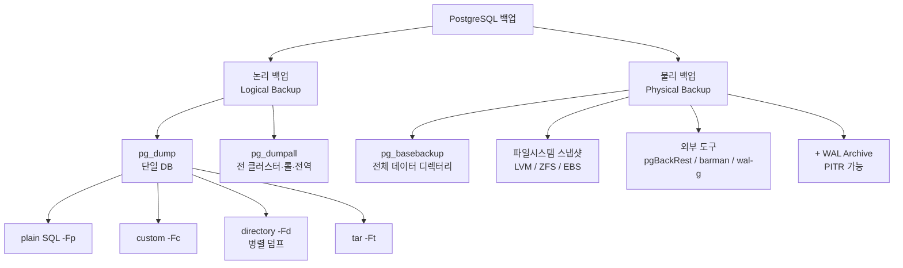
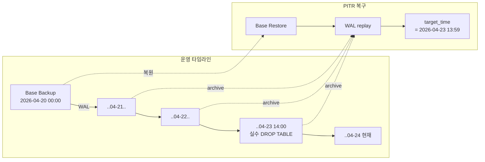
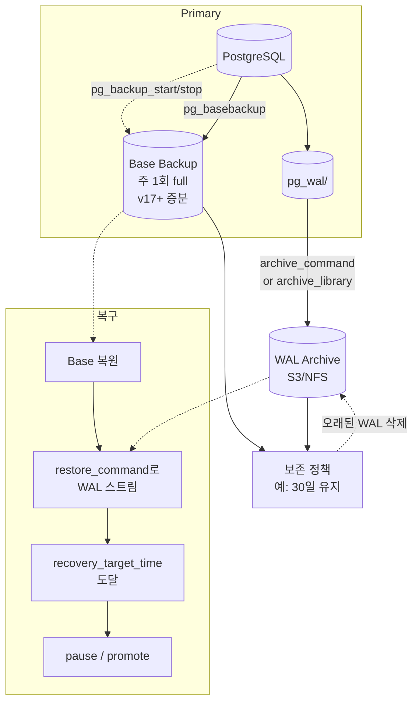

# 11장. 백업과 복구 — Backup & Recovery

> **핵심 요약**
> - PostgreSQL의 백업은 두 축이다: **논리 백업(`pg_dump`/`pg_dumpall` — SQL 재생성)** 과 **물리 백업(`pg_basebackup` + WAL archive — 바이트 단위 복제)**.
> - PITR(Point-In-Time Recovery)은 "base backup + WAL 아카이브"의 조합이다. base만으로는 복구할 수 없고, WAL만으로도 복구할 수 없다.
> - **복구해본 적 없는 백업은 백업이 아니다**. RPO/RTO는 측정해야 의미가 있다.
> - `archive_command`는 실패 시 재시도되며, 실패가 누적되면 `pg_wal/`이 터진다 — 모니터링은 선택이 아니다.

---

## 11.1 백업 방식 분류



| 구분 | 논리 백업 | 물리 백업 |
|---|---|---|
| 단위 | SQL 문(DDL + COPY) | 데이터 파일(8KB page) |
| 크기 | 보통 더 작음 | 원본과 비슷(TOAST 포함) |
| 복구 시간 | 큰 DB에서 **매우 느림**(index 재생성) | 빠름(복사 + WAL 리플레이) |
| 메이저 버전 업그레이드 | **가능** | 불가 (같은 major에서만) |
| 객체 선택 | 테이블·스키마 단위 가능 | 전체 클러스터 단위 |
| PITR | 불가 | **가능** |
| 일관성 | 트랜잭션 일관 snapshot | 시작~종료의 WAL로 일관성 보장 |

> 운영 원칙: **두 가지를 병행**한다. 논리 백업은 "특정 테이블을 실수로 날렸을 때 빠르게 되살리는 보험", 물리 백업+WAL은 "클러스터 전체 재해 복구와 PITR"용.

---

## 11.2 `pg_dump` — 논리 백업

### 기본
```bash
# 단일 DB 덤프 (plain SQL)
pg_dump -h db.example -U postgres app > app.sql

# custom 포맷 (가장 권장되는 선택)
pg_dump -h db.example -U postgres -Fc -f app.dump app

# directory 포맷 + 병렬
pg_dump -h db.example -Fd -j 8 -f /backup/app_dir app
```

### 포맷 비교 (`-F`)
| 값 | 이름 | 특징 |
|---|---|---|
| `p` | plain | 순수 SQL. psql로 복구. 병렬 불가. |
| `c` | custom | 단일 바이너리 파일. `pg_restore`의 선택적 복구·병렬 복구 가능. |
| `d` | directory | 디렉터리. **`pg_dump -j N` 병렬 덤프 가능**. |
| `t` | tar | tar 아카이브. 병렬 복구 가능, 덤프 병렬 불가. |

### 자주 쓰는 옵션
```bash
pg_dump -Fc \
  --jobs=8 \                   # directory 포맷과 함께만 유효
  --schema=public \            # 특정 스키마만
  --exclude-table='audit_*' \  # 제외 테이블 (glob)
  --data-only \                # 데이터만 (스키마 제외)
  --schema-only \              # 스키마만
  --no-owner --no-privileges \ # 이관 시 소유자/권한 정보 제거
  --serializable-deferrable \  # 일관 snapshot 강화
  -f app.dump app
```

### `pg_dumpall` — 전역 객체까지
```bash
# 롤, 테이블스페이스, 설정 포함 전체
pg_dumpall -h db.example -U postgres > cluster.sql

# 롤과 전역만 (DB들은 pg_dump로 따로)
pg_dumpall --roles-only --tablespaces-only > globals.sql
```
- `pg_dump`는 **DB 단위**라 롤·전역 객체가 빠진다. **운영 백업에는 반드시 `pg_dumpall --globals-only`를 함께** 수행한다.

### 일관성
`pg_dump`는 내부적으로 `REPEATABLE READ` (또는 `SERIALIZABLE DEFERRABLE`) 트랜잭션을 열어 **덤프 시작 시점의 snapshot**을 유지한다. 덤프 중 DDL이 생기면 실패할 수 있다.

### 주의: VACUUM·장기 트랜잭션
`pg_dump`는 긴 트랜잭션을 연다. 대용량 DB에서 수 시간~수십 시간 걸릴 수 있고, 이 동안 **autovacuum이 막힌다**. Write 많은 시스템에서는 물리 백업으로 전환하거나 스탠바이에서 덤프한다.

---

## 11.3 `pg_restore` — 복구

### custom/directory/tar 포맷 복구
```bash
# DB를 먼저 만든다
createdb -h db.example app_restored

# 병렬 복구
pg_restore -h db.example -d app_restored \
  --jobs=8 \
  --no-owner --no-privileges \
  app.dump

# plain 포맷은 psql로
psql -h db.example -d app_restored -f app.sql
```

### 선택적 복구
```bash
# 목차 추출
pg_restore -l app.dump > toc.list

# toc.list를 편집해 원하는 항목만 남긴다
pg_restore -L toc.list -d app_restored app.dump
```

### 트랜잭션 래핑
```bash
pg_restore --single-transaction -d app_restored app.dump
```
- 한 트랜잭션으로 묶어 **실패 시 전체 롤백**. 병렬 `-j`와 함께 쓸 수는 없다.

### 복구 최적화 팁
- `fsync = off`, `synchronous_commit = off`, `full_page_writes = off`를 복구 전용 서버에서 **일시 적용** 후 복구 완료 시 복원. (운영 서버에서는 금지)
- `maintenance_work_mem`을 크게 (`4GB` 이상) — 인덱스 생성 병목 완화.
- `max_wal_size`를 크게 — 복구 중 checkpoint 폭주 방지.
- 복구 후 반드시 `ANALYZE` 실행 — 통계가 없으면 쿼리 플랜이 망가진다.

---

## 11.4 `pg_basebackup` — 물리 백업

### 기본
```bash
pg_basebackup -h primary.example -U replicator \
  -D /backup/base_$(date +%Y%m%d) \
  -Ft -z \                          # tar + gzip
  -X stream \                       # 백업 중 WAL을 병렬 스트리밍 포함
  -P --verbose \                    # 진행률
  -C -S backup_slot                 # physical slot으로 WAL 보존
```

### 핵심 옵션
| 옵션 | 의미 |
|---|---|
| `-D <dir>` | 백업 결과 디렉터리 |
| `-F p\|t` | plain(디렉터리 그대로) / tar 아카이브 |
| `-z` / `-Z <n>` | 압축 |
| `-X stream\|fetch\|none` | 백업 중 WAL 처리. **기본 `stream` 권장** |
| `-R` | `standby.signal` + `primary_conninfo` 자동 생성 (standby 구축용, v12+) |
| `-C -S <name>` | physical replication slot 생성 및 사용 (WAL 유실 방지) |
| `--checkpoint=fast\|spread` | 시작 시 즉시 checkpoint(fast)할지 분산할지 |
| `--incremental=<manifest>` | **v17+ 증분 백업** (`pg_combinebackup`으로 병합) |

### 동작 흐름
1. `pg_backup_start(label, fast)` 내부 호출 → checkpoint.
2. 데이터 디렉터리 전체를 tar·copy. `postgresql.conf`·`pg_hba.conf`·**테이블스페이스 포함**.
3. `-X stream`이면 별도 연결로 **백업 동안 생성되는 WAL도 함께 받아** `pg_wal/` 위치에 저장.
4. `pg_backup_stop()` → `backup_label` 파일 생성, 복구 시 이 파일이 "어느 LSN에서 WAL을 적용 시작할지"를 지시.

### 제한
- 전체 클러스터 단위. 특정 DB만 백업은 불가.
- primary 또는 read-only standby 어디서든 가능. 부하를 분산하려면 **standby에서 실행**.

---

## 11.5 WAL Archiving — 연속 아카이브

PITR의 전제 조건. base backup 종료 이후 발생한 **모든 WAL을 영구 보관**해야 "base 이후 임의 시점"으로 복구할 수 있다.

### 파라미터
```conf
wal_level = replica              # minimal은 archive 불가
archive_mode = on                # 서버 시작 시에만 변경 가능
# 단순 예시(공식 문서 레퍼런스). 운영에서는 아래 "⚠️ 주의" 박스 참조
archive_command = 'test ! -f /archive/%f && cp %p /archive/%f'
archive_timeout = 60             # 트래픽 낮을 때 강제 segment 전환(초)
```

> ⚠️ **archive_command 예시의 함정**
> 위 `test ! -f … && cp` 패턴은 공식 문서에도 등장하지만 **내용 검증이 없다**. 목적지에 같은 이름의 손상된 파일이 미리 존재하면, 명령은 실패 리턴을 반복하여 `pg_wal/`이 무한 누적된다. 또한 WAL segment는 동일 파일명이어도 **해시가 같아야 안전**하다.
>
> 운영에서는 다음 중 하나 권장:
> 1. **전용 도구 사용**: `pgBackRest`, `wal-g`, `barman`이 원자적 업로드·해시 검증·병렬·암호화까지 기본 제공.
> 2. **자체 스크립트**: 아래처럼 `cmp`로 내용 일치 검증 후에만 성공 리턴.
>    ```bash
>    # /usr/local/bin/pg_archive.sh
>    set -e
>    SRC="$1"; DST="/archive/$2"
>    if [ -f "$DST" ]; then
>      cmp -s "$SRC" "$DST" && exit 0 || exit 1   # 동일하면 OK, 다르면 실패
>    fi
>    cp "$SRC" "$DST.tmp" && sync "$DST.tmp" && mv "$DST.tmp" "$DST"
>    ```
>    `archive_command = '/usr/local/bin/pg_archive.sh %p %f'`
> 3. **v15+는 `archive_library`**: C 모듈(`basic_archive` 또는 전용 라이브러리) 사용으로 쉘 오버헤드·락 경쟁 제거.

| 파라미터 | 의미 |
|---|---|
| `archive_mode` | on/off/always (always는 스탠바이에서도 아카이브) |
| `archive_command` | 세그먼트 아카이브 쉘 명령. `%p`=full path, `%f`=file name. **0 리턴 = 성공** |
| `archive_library` | v15+. 셸 대신 C 모듈 로드(basic_archive, pgBackRest 등). 셸 오버헤드 제거 |
| `archive_timeout` | 강제 세그먼트 스위치 주기. 과하면 작은 WAL이 많이 생겨 archive 부담 증가 |

### 운영 원칙
- `archive_command`는 **idempotent**여야 한다 (같은 파일 2회 호출되어도 안전).
- 목적지 사전 확인 후 쓰기 (`test ! -f ...`) — 이미 있는 파일 덮어쓰면 아카이브 무결성 파괴.
- **실패 시 재시도**: 0이 아닐 때 PostgreSQL은 해당 WAL을 `pg_wal/`에 계속 남기고 재시도한다 → `pg_wal/` 폭증 위험.
- 상태 모니터링:
  ```sql
  SELECT archived_count, failed_count,
         last_archived_wal, last_archived_time,
         last_failed_wal, last_failed_time
  FROM pg_stat_archiver;
  ```
  `failed_count`가 꾸준히 0이어야 한다.

### S3 기반 예시 (가벼운 도구 병용)
```conf
archive_command = 'envdir /etc/pgenv wal-g wal-push %p'
restore_command = 'envdir /etc/pgenv wal-g wal-fetch %f %p'
```

---

## 11.6 PITR — Point-In-Time Recovery

### 개념
"base backup 복원 + 그 이후 WAL을 특정 타겟까지 재생"하여 임의 시점의 클러스터를 재현한다.



### 절차
1. **데이터 디렉터리 비우기** (복구 대상 서버)
   ```bash
   pg_ctl stop -D $PGDATA
   rm -rf $PGDATA/*
   ```
2. **Base backup 복원**
   ```bash
   tar -xf /backup/base_20260420.tar -C $PGDATA
   ```
3. **`postgresql.conf` 또는 `postgresql.auto.conf`에 복구 파라미터 작성**
   ```conf
   restore_command = 'cp /archive/%f %p'
   recovery_target_time = '2026-04-23 13:59:00+09'
   recovery_target_action = 'pause'    # pause | promote | shutdown
   recovery_target_timeline = 'latest'
   ```
4. **`recovery.signal` 파일 생성** (v12+, `standby.signal`과 구분)
   ```bash
   touch $PGDATA/recovery.signal
   ```
5. **기동**
   ```bash
   pg_ctl start -D $PGDATA
   ```
6. 서버가 WAL을 리플레이하여 타겟에 도달하면 `recovery_target_action`에 따라 동작.
   - `pause` (기본): 복구 지점에서 멈춘다. 데이터를 확인한 후 `SELECT pg_wal_replay_resume();` 또는 `pg_promote()`.
   - `promote`: 즉시 쓰기 가능 상태로 전환.
   - `shutdown`: 읽기 상태로 멈춘 뒤 서버 종료.

### 타겟 지정 옵션
| 파라미터 | 의미 |
|---|---|
| `recovery_target_time` | 타임스탬프 (`timestamptz`) |
| `recovery_target_xid` | 트랜잭션 ID |
| `recovery_target_lsn` | LSN |
| `recovery_target_name` | `pg_create_restore_point('name')`으로 만든 명명 지점 |
| `recovery_target = 'immediate'` | 백업 일관성만 맞추고 즉시 종료 |
| `recovery_target_inclusive` | 타겟 트랜잭션을 포함할지 (기본 `true`) |
| `recovery_target_action` | `pause` / `promote` / `shutdown` |
| `recovery_target_timeline` | `latest` / 특정 ID |

### 버전 노트
- **v12부터 `recovery.conf`가 제거**되었다. 대신 `postgresql.conf`(또는 `.auto.conf`) + `recovery.signal`/`standby.signal` 파일로 모드를 지정한다.
- **v15부터 `archive_library`** (shell-less archive) 도입.
- **v17부터 `pg_basebackup --incremental` + `pg_combinebackup`**으로 증분 물리 백업.

---

## 11.7 외부 도구 비교

| 도구 | 특징 | 장점 | 약점 |
|---|---|---|---|
| **pgBackRest** | C 기반 전용 백업 관리자 | 압축·병렬·증분·델타·보존 정책·S3, 검증 명령 내장 | 설정 초기 학습 비용 |
| **barman** | 2ndQuadrant(EDB) Python 툴 | rsync·streaming 병행, retention, recovery 명령 단순 | 증분 성능은 pgBackRest 대비 낮음 |
| **wal-g** | Citus Data 출신, Go | S3/GCS/Azure 네이티브, 가벼움, 증분 page-level | HA 구성 자동화 적음 |
| **pghoard** | Aiven 제공 | 클라우드 친화, 멀티 백엔드 | 커뮤니티 활성도 낮음 |
| **pg_basebackup** | 기본 내장 | 추가 설치 불필요, 단순 | 증분(v17+), 보존 정책, 검증은 직접 구현 |

### 도구 선택 기준
- **자체 운영 + 수백 GB 이상 + S3**: pgBackRest / wal-g
- **자체 운영 + 수십 GB + 단순 NFS**: pg_basebackup + cron + WAL archive 스크립트
- **Managed (RDS/Aurora/CloudSQL)**: 플랫폼이 제공하는 스냅샷·PITR 사용. 단, 해당 플랫폼 바깥으로의 복원이 필요하다면 pg_dump + wal-g 조합을 병행.

---

## 11.8 복구 테스트 — DR Drill

### 원칙
1. **복구해본 적 없는 백업은 백업이 아니다.** 정기(월 1회 권장) 복구 드릴을 실시한다.
2. **복구 소요 시간을 측정**한다. RTO 수치가 실제 가능한지 확인.
3. 복구 절차서를 **신입 엔지니어가 혼자 따라 할 수 있는 수준**으로 문서화.

### 드릴 체크리스트
```markdown
[ ] 별도 환경(스테이지/샌드박스)에 최신 base backup 복원 성공
[ ] WAL archive 연결 성공 (restore_command)
[ ] 임의 시점(PITR) 복구 성공
[ ] 복구 후 쿼리 검증 (row count, 대표 인덱스 조회)
[ ] 복구 소요 시간 기록 (base 복사 / WAL 리플레이 / total)
[ ] 아카이브 보존 정책이 RPO를 만족하는지 확인
[ ] 설정 파일(postgresql.conf, pg_hba.conf) 함께 백업되는지 확인
[ ] 롤/권한(pg_dumpall --globals-only)이 함께 백업되는지 확인
```

### 파이프라인 전체도



---

## 11.9 RPO / RTO 개념

- **RPO (Recovery Point Objective)**: "어디까지의 데이터를 복구 가능한가" — 장애 시 허용되는 **데이터 손실 시간**.
- **RTO (Recovery Time Objective)**: "얼마나 빠르게 복구 가능한가" — 장애 시 허용되는 **서비스 중단 시간**.

| 구성 | 대략적 RPO | 대략적 RTO | 비용 |
|---|---|---|---|
| 주 1회 pg_dump만 | 최대 1주 | 수 시간 (restore + index 재생성) | 저 |
| 일 1회 base + 15분 WAL archive | 최대 15분 | 1~수 시간 (base 복사 + WAL replay) | 중 |
| 일 1회 base + continuous WAL archive | 초 단위 | 1~수 시간 | 중 |
| + async streaming replica | 초 단위 | 수 분 (페일오버) | 중~고 |
| + sync streaming replica | **0** | 수 분 | 고 |
| + 멀티 리전 sync / Raft HA | 0 | 수 분 | 고 |

**비용-가용성 trade-off가 설계의 본질**이다. SLO와 비즈니스 요구에서 역산해 구성을 결정.

---

## 11.10 운영 체크리스트

### 일일
- [ ] `pg_stat_archiver.failed_count`가 증가하지 않는다
- [ ] 마지막 base backup이 24시간 이내(혹은 SLA 기준) 있다
- [ ] WAL archive 스토리지 사용률 < 임계
- [ ] `pg_wal/` 사용률 < 임계
- [ ] replication lag < 임계 (+ standby의 아카이브 연결 정상)

### 주간
- [ ] base backup 성공 로그 확인
- [ ] 오래된 아카이브/백업의 보존 정책대로 정리됨
- [ ] 스탠바이들의 health check

### 월간 / 분기
- [ ] **DR drill 실시** — 최신 백업에서 별도 환경 복구 성공
- [ ] RPO/RTO 측정치가 목표를 만족하는지 확인
- [ ] `pg_dump`로 논리 백업 검증 (큰 DB면 스탠바이에서)
- [ ] 설정·플랫폼 변경사항을 복구 절차서에 반영

### 이벤트 트리거 (메이저 변경 전후)
- [ ] 메이저 DDL·데이터 이관·버전 업그레이드 전 추가 base backup
- [ ] 아카이브·백업 대상 스토리지 이전 시 복구 가능 여부 재검증

---

## 진단 쿼리 모음

```sql
-- 아카이버 상태
SELECT * FROM pg_stat_archiver;

-- 현재 REDO location
SELECT pg_current_wal_lsn(),
       pg_walfile_name(pg_current_wal_lsn());

-- 복구 모드 여부
SELECT pg_is_in_recovery();

-- PITR pause 중 재개
SELECT pg_wal_replay_resume();

-- 명명 복구 지점 생성 (대형 변경 직전에)
SELECT pg_create_restore_point('before_big_migration_2026_04_24');
```

---

## 자주 만나는 함정

1. **`pg_dumpall --globals-only`를 빠뜨림** — 복구 후 롤이 없어 앱이 접속 실패.
2. **`postgresql.conf`·`pg_hba.conf` 별도 백업 누락** — `pg_basebackup`에는 포함되지만, 튜닝된 conf를 바깥에서 덮어쓰는 운영이면 별도 버전 관리 필요.
3. **아카이브를 primary와 같은 디스크에 저장** — DR 요건 미달. 별도 스토리지·다른 리전 필수.
4. **슬롯만 만들고 소비자 없음** — `pg_wal/`이 지속 증가.
5. **`archive_timeout = 10s`처럼 과도하게 짧음** — 작은 WAL이 폭증하여 archive 처리량 자체가 병목.
6. **`pg_dump` 복구 후 `ANALYZE` 미실행** — 플랜이 망가져 쿼리가 수백 배 느려짐.
7. **복구 절차서에 "이 부분은 그때 판단"이 있음** — 새벽 2시에 판단할 수 있는 팀원은 많지 않다. 모두 확정해 둔다.

---

## 공식 문서 참조

- [Chapter 26. Backup and Restore](https://www.postgresql.org/docs/current/backup.html)
- [26.1. SQL Dump](https://www.postgresql.org/docs/current/backup-dump.html)
- [26.2. File System Level Backup](https://www.postgresql.org/docs/current/backup-file.html)
- [26.3. Continuous Archiving and Point-in-Time Recovery (PITR)](https://www.postgresql.org/docs/current/continuous-archiving.html)
- [pg_basebackup](https://www.postgresql.org/docs/current/app-pgbasebackup.html)
- [pg_dump](https://www.postgresql.org/docs/current/app-pgdump.html) · [pg_restore](https://www.postgresql.org/docs/current/app-pgrestore.html) · [pg_dumpall](https://www.postgresql.org/docs/current/app-pg-dumpall.html)
- [Chapter 49. Archive Modules](https://www.postgresql.org/docs/current/archive-modules.html) — v15+
- [20.5.3. Archiving](https://www.postgresql.org/docs/current/runtime-config-wal.html#RUNTIME-CONFIG-WAL-ARCHIVING)
- [20.5.5. Recovery Target](https://www.postgresql.org/docs/current/runtime-config-wal.html#RUNTIME-CONFIG-WAL-RECOVERY-TARGET)
- 관련 치트시트: [`cheatsheets/backup_recovery_recipes.md`](../cheatsheets/backup_recovery_recipes.md)
- 이전 장: [10장. Replication](ch10_replication.md) · 다음 장: [12장. 파티셔닝](ch12_partitioning.md)
