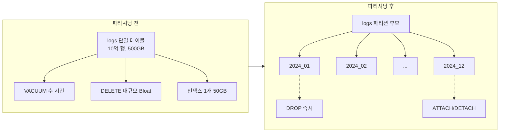
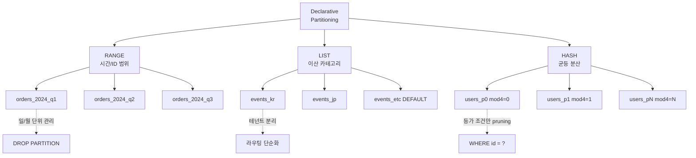
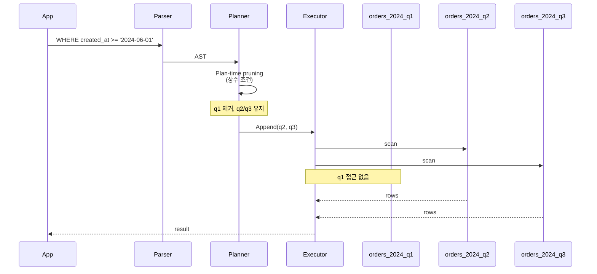
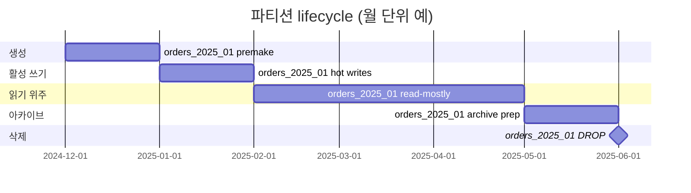

# 12장. 파티셔닝 (Partitioning)

> 수억 행 규모 테이블을 "관리 가능한 크기"로 쪼개는 유일한 표준 기법

PostgreSQL의 파티셔닝은 단일 논리 테이블을 물리적으로 여러 자식 테이블로 분할해, **관리성**, **대량 삭제 성능**, **쿼리 실행 시간**을 모두 개선한다. v10에서 Declarative Partitioning이 도입된 이후 매 릴리스마다 기능이 누적되어, v14~v16에서는 대규모 운영 환경에서 표준 선택지가 되었다.

이 장은 "파티셔닝을 언제, 어떻게, 어떤 함정을 피하면서 쓰는가"를 공식 문서(`ddl-partitioning.html`)와 실제 운영 패턴 기준으로 정리한다.

---

## 12.1 왜 파티셔닝인가

단일 테이블이 수억 행을 넘어가면 세 가지 문제가 동시에 발생한다.

### 1) 관리성 문제

- `VACUUM`이 한 번 도는 데 시간이 오래 걸려 **autovacuum이 따라가지 못한다**.
- 인덱스가 거대해져 `REINDEX`에 락을 장시간 점유한다(CONCURRENTLY를 써도 I/O 비용이 크다).
- `ALTER TABLE` DDL이 전체 테이블을 재작성하며 **수 시간 락을 잡는다**.

### 2) 백업/삭제 비용 문제

- "3개월 지난 로그 삭제"를 `DELETE FROM logs WHERE ts < now() - interval '3 months'`로 실행하면
  - Dead Tuple 대량 생성 → Bloat 폭증
  - WAL 대량 생성 → 복제 지연
  - 인덱스도 함께 정리해야 함
- 반면 **파티션을 DROP**하면
  - 파일을 unlink 하는 수준의 비용 (ms 단위)
  - WAL 거의 생성 안 됨
  - 인덱스도 같이 사라짐

### 3) 쿼리 성능 문제

- 한 달치 쿼리인데 5년치 인덱스를 뒤져야 한다면 B-tree 깊이가 늘어나 매 쿼리마다 몇 블록씩 더 읽는다.
- Planner의 통계(`pg_statistic`)는 테이블 전체 기준이므로, 특정 구간(최근 1일)의 선택도가 왜곡되기 쉽다.
- 파티션이 나눠져 있으면 플래너가 **관련 파티션만 스캔(Partition Pruning)** 한다.



> **요지**: 파티셔닝은 "쿼리를 빠르게 하는 기능"이기 전에 **"거대 테이블을 운영 가능하게 만드는 기능"** 이다.

---

## 12.2 상속 기반(legacy) vs Declarative(v10+)

### 상속 기반 파티셔닝 (Legacy, v9.x 이하의 표준)

- 부모 테이블은 실제 데이터 없는 껍데기.
- 자식 테이블을 `CREATE TABLE child () INHERITS (parent)`로 생성.
- `CHECK` 제약 + 트리거/RULE로 INSERT를 올바른 자식으로 라우팅.
- 파티션 추가마다 트리거 코드 수정 필요 → **유지비용 극심**.
- Constraint Exclusion(`constraint_exclusion = partition`)에 의존.

```sql
-- ❌ Legacy 방식 (v10 이후는 추천하지 않음)
CREATE TABLE logs (id bigserial, ts timestamptz, msg text);
CREATE TABLE logs_2024_01 (
    CHECK (ts >= '2024-01-01' AND ts < '2024-02-01')
) INHERITS (logs);

CREATE FUNCTION logs_insert_trigger() RETURNS TRIGGER AS $$
BEGIN
    IF NEW.ts >= '2024-01-01' AND NEW.ts < '2024-02-01' THEN
        INSERT INTO logs_2024_01 VALUES (NEW.*);
    ELSIF ...
    END IF;
    RETURN NULL;
END; $$ LANGUAGE plpgsql;
```

### Declarative Partitioning (v10+, **현재 표준**)

- `PARTITION BY`로 **파티션 키를 테이블 정의 자체에 선언**.
- 라우팅은 엔진이 담당 → 트리거 불필요.
- v11+에서 PK/FK, default partition, hash partitioning 지원.
- v12+에서 FK 참조 가능, PARTITION OF ... DEFAULT 성능 개선.
- v14+에서 `DETACH PARTITION ... CONCURRENTLY` 지원.

```sql
-- ✅ Declarative (v10+ 권장)
CREATE TABLE logs (
    id        bigserial,
    ts        timestamptz NOT NULL,
    msg       text,
    PRIMARY KEY (id, ts)  -- 파티션 키 포함 필수
) PARTITION BY RANGE (ts);

CREATE TABLE logs_2024_01 PARTITION OF logs
    FOR VALUES FROM ('2024-01-01') TO ('2024-02-01');
```

> **결론**: v10 이상에서 파티셔닝을 새로 도입한다면 **Declarative만 선택**한다. Legacy는 기존 시스템 호환 이외 이유가 없다.

---

## 12.3 RANGE / LIST / HASH 파티셔닝

### 12.3.1 RANGE 파티셔닝

시간·ID 범위처럼 연속된 값에 적합. **가장 일반적**.

```sql
CREATE TABLE orders (
    order_id   bigserial,
    user_id    bigint NOT NULL,
    created_at timestamptz NOT NULL,
    amount     numeric(12,2),
    PRIMARY KEY (order_id, created_at)
) PARTITION BY RANGE (created_at);

CREATE TABLE orders_2024_q1 PARTITION OF orders
    FOR VALUES FROM ('2024-01-01') TO ('2024-04-01');

CREATE TABLE orders_2024_q2 PARTITION OF orders
    FOR VALUES FROM ('2024-04-01') TO ('2024-07-01');

-- 범위는 [from, to) 반개구간
-- '2024-04-01 00:00:00'은 q2에 들어간다
```

### 12.3.2 LIST 파티셔닝

이산 값(국가 코드, 테넌트, 상태 등)에 적합.

```sql
CREATE TABLE events (
    event_id bigserial,
    region   text NOT NULL,
    payload  jsonb,
    PRIMARY KEY (event_id, region)
) PARTITION BY LIST (region);

CREATE TABLE events_kr PARTITION OF events FOR VALUES IN ('KR');
CREATE TABLE events_jp PARTITION OF events FOR VALUES IN ('JP');
CREATE TABLE events_us PARTITION OF events FOR VALUES IN ('US', 'CA');
CREATE TABLE events_etc PARTITION OF events DEFAULT;  -- v11+
```

### 12.3.3 HASH 파티셔닝 (v11+)

값을 균등 분산하고 싶지만 자연스러운 범위/리스트가 없을 때. 주로 **샤딩 흉내**에 쓴다.

```sql
CREATE TABLE users (
    user_id  bigserial,
    email    text NOT NULL,
    PRIMARY KEY (user_id)
) PARTITION BY HASH (user_id);

CREATE TABLE users_p0 PARTITION OF users FOR VALUES WITH (MODULUS 4, REMAINDER 0);
CREATE TABLE users_p1 PARTITION OF users FOR VALUES WITH (MODULUS 4, REMAINDER 1);
CREATE TABLE users_p2 PARTITION OF users FOR VALUES WITH (MODULUS 4, REMAINDER 2);
CREATE TABLE users_p3 PARTITION OF users FOR VALUES WITH (MODULUS 4, REMAINDER 3);
```

> **주의**: HASH 파티션은 **범위 쿼리(`WHERE user_id BETWEEN ...`)에서 가지치기가 안 된다.** 등가 조건(`=`)에서만 효과가 있다.

### 종류별 비교



---

## 12.4 Partition Pruning

플래너가 **필요 없는 파티션을 스캔 대상에서 제외**하는 기법. 파티셔닝의 쿼리 성능 이득의 대부분이 여기서 나온다.

### 12.4.1 Plan-time Pruning (v10+)

쿼리 컴파일 단계에서 상수 조건으로 결정.

```sql
EXPLAIN
SELECT count(*) FROM orders
WHERE created_at >= '2024-01-01' AND created_at < '2024-02-01';

--  Aggregate
--    ->  Seq Scan on orders_2024_q1   -- 1개만 스캔!
```

### 12.4.2 Execution-time Pruning (v11+)

`PREPARE`의 파라미터나 조인 결과처럼 **실행 시점에 값이 결정되는 조건**도 가지치기가 된다. v10에서는 불가능했다.

```sql
PREPARE q (timestamptz) AS
    SELECT * FROM orders WHERE created_at >= $1;

EXPLAIN (ANALYZE) EXECUTE q('2024-06-01');

--  Append
--    Subplans Removed: 1    -- 실행 시 제거됨
--    ->  Seq Scan on orders_2024_q2
--    ->  Seq Scan on orders_2024_q3
```

### 12.4.3 관련 파라미터

| 파라미터 | 기본값 | 설명 |
|---------|--------|------|
| `enable_partition_pruning` | `on` | plan-time/execution-time pruning 모두 제어 |
| `constraint_exclusion` | `partition` | **legacy 상속 파티셔닝** 전용. declarative에는 영향 없음 |



---

## 12.5 Sub-partitioning (RANGE + LIST 조합)

파티션을 또 파티셔닝할 수 있다. 예: 월 단위 RANGE + 지역 LIST.

```sql
CREATE TABLE events (
    event_id bigserial,
    ts       timestamptz NOT NULL,
    region   text NOT NULL,
    payload  jsonb,
    PRIMARY KEY (event_id, ts, region)
) PARTITION BY RANGE (ts);

CREATE TABLE events_2024_q1 PARTITION OF events
    FOR VALUES FROM ('2024-01-01') TO ('2024-04-01')
    PARTITION BY LIST (region);

CREATE TABLE events_2024_q1_kr PARTITION OF events_2024_q1 FOR VALUES IN ('KR');
CREATE TABLE events_2024_q1_jp PARTITION OF events_2024_q1 FOR VALUES IN ('JP');
CREATE TABLE events_2024_q1_us PARTITION OF events_2024_q1 FOR VALUES IN ('US');
```

> **경고**: 파티션 수가 곱으로 늘어난다. 12개월 × 5개 지역 = 60개. **플래너 오버헤드와 운영 복잡도가 선형 이상으로 증가**하므로, 정말 필요한지 먼저 점검할 것.

---

## 12.6 Default Partition (v11+)

어떤 기존 파티션에도 속하지 않는 값을 받는 "캐치올" 파티션.

```sql
CREATE TABLE orders_default PARTITION OF orders DEFAULT;
```

### 함정

- default partition에 데이터가 들어간 상태에서 **새 파티션을 ATTACH하려면**, default에서 해당 범위 데이터가 없음을 증명해야 한다. 대량 데이터가 있으면 `ACCESS EXCLUSIVE` 락이 오래 잡힌다.
- 운영 패턴: **default는 "이상값 감지용"으로만 두고, 실제로 쌓이면 즉시 별도 파티션으로 이관**.

```sql
-- default 파티션 내용 확인
SELECT count(*), min(ts), max(ts) FROM orders_default;

-- default에서 특정 범위를 별도 파티션으로 이동하는 표준 패턴
BEGIN;
ALTER TABLE orders DETACH PARTITION orders_default;
CREATE TABLE orders_2025_01 PARTITION OF orders
    FOR VALUES FROM ('2025-01-01') TO ('2025-02-01');
INSERT INTO orders_2025_01
    SELECT * FROM orders_default
     WHERE ts >= '2025-01-01' AND ts < '2025-02-01';
DELETE FROM orders_default
     WHERE ts >= '2025-01-01' AND ts < '2025-02-01';
ALTER TABLE orders ATTACH PARTITION orders_default DEFAULT;
COMMIT;
```

---

## 12.7 파티션 추가/제거/분리

### 12.7.1 추가 (신규 파티션 생성)

```sql
-- 새 월 파티션 미리 만들기 (운영 표준: 최소 1개월치 여유)
CREATE TABLE logs_2024_12 PARTITION OF logs
    FOR VALUES FROM ('2024-12-01') TO ('2025-01-01');
```

### 12.7.2 제거 (DROP)

```sql
-- 즉시 파일 unlink, 거의 비용 없음
DROP TABLE logs_2024_01;
```

### 12.7.3 분리 (DETACH)

파티션을 부모와의 관계만 끊고 독립 테이블로 남긴다. 아카이빙/이전 용도.

```sql
-- 기본 DETACH: ACCESS EXCLUSIVE 락 필요 (짧지만 블로킹)
ALTER TABLE logs DETACH PARTITION logs_2024_01;
```

### 12.7.4 DETACH ... CONCURRENTLY (v14+)

**운영 중 락 없이** 분리. 2단계로 진행되며 중간에 커밋이 들어간다.

```sql
-- 1단계: FINALIZE되지 않은 상태로 분리 시작 (짧은 락만)
ALTER TABLE logs DETACH PARTITION logs_2024_01 CONCURRENTLY;

-- 만약 중간에 세션이 끊기면 다음 명령으로 완료
ALTER TABLE logs DETACH PARTITION logs_2024_01 FINALIZE;
```

제약:
- 트랜잭션 블록 안에서 실행 불가.
- default partition이 있는 경우 제약이 있음.

### 12.7.5 ATTACH

독립 테이블을 파티션으로 편입. 사전에 `CHECK` 제약을 달아두면 전체 스캔을 생략한다.

```sql
-- ✅ 빠른 ATTACH 패턴
CREATE TABLE logs_2024_12 (LIKE logs INCLUDING ALL);
-- 데이터 적재 후
ALTER TABLE logs_2024_12
    ADD CONSTRAINT logs_2024_12_range
    CHECK (ts >= '2024-12-01' AND ts < '2025-01-01') NOT VALID;
ALTER TABLE logs_2024_12 VALIDATE CONSTRAINT logs_2024_12_range;
ALTER TABLE logs ATTACH PARTITION logs_2024_12
    FOR VALUES FROM ('2024-12-01') TO ('2025-01-01');
-- ATTACH 시 이미 검증된 CHECK가 있으므로 스캔 생략
```

---

## 12.8 주의사항 (함정 총정리)

### 12.8.1 UNIQUE 제약은 파티션 키를 포함해야 한다

```sql
-- ❌ 실패: UNIQUE 제약에 파티션 키가 없다
CREATE TABLE orders (
    order_id bigserial UNIQUE,     -- ERROR
    created_at timestamptz NOT NULL
) PARTITION BY RANGE (created_at);

-- ✅ 파티션 키를 포함한 복합 UNIQUE
CREATE TABLE orders (
    order_id   bigserial,
    created_at timestamptz NOT NULL,
    UNIQUE (order_id, created_at)
) PARTITION BY RANGE (created_at);
```

전역 유일성이 필요하면 **애플리케이션 레벨에서 UUID/ULID로 보장**하거나, 파티셔닝 안 함 중 택해야 한다.

### 12.8.2 글로벌 인덱스가 없다

각 파티션이 자체 로컬 인덱스를 갖는다. 부모에 `CREATE INDEX`를 만들면 **모든 파티션에 동일 인덱스가 각각 생성**된다(v11+).

```sql
CREATE INDEX ON orders (user_id);
-- → 각 파티션별로 orders_2024_q1_user_id_idx 등이 생성됨
```

v12+에서는 `CREATE INDEX ... ON ONLY parent`로 부모만 생성 후, 기존 파티션에 수동 ATTACH 가능하다.

### 12.8.3 FK 지원 (v12+)

- v11: 파티션 테이블을 FK **참조 대상으로 사용 불가**.
- v12+: 참조 대상으로 사용 가능 (`REFERENCES partitioned_table`).
- 각 파티션별로 자식에서의 FK 검증이 이뤄지므로 **파티션 수가 많으면 INSERT 성능 영향**.

### 12.8.4 파티션 수 제한

- 물리 한계는 없지만, **플래너 계획 시간**이 파티션 수에 비례해 증가.
- 경험칙: **1,000개 이하 권장**, 10,000개 이상이면 계획 시간이 수 ms ~ 수십 ms로 튄다.
- v12에서 많은 파티션의 계획 시간 개선, v13에서 추가 개선됨.

```sql
-- 파티션 수 확인
SELECT count(*) FROM pg_inherits
 WHERE inhparent = 'logs'::regclass;
```

### 12.8.5 파티션 키 값은 UPDATE 불가가 원칙

v10: 파티션 키 값을 UPDATE하면 에러.
v11+: 자동으로 DELETE + INSERT로 재라우팅(단, 성능 비용 큼).

### 12.8.6 ROW-LEVEL BEFORE 트리거 제약

v13까지는 파티션 간 이동 UPDATE에서 BEFORE ROW 트리거 제약이 있었다. v13에서 상당 부분 해소.

---

## 12.9 TimescaleDB / pg_partman과의 관계

순정 파티셔닝은 "파티션을 자동으로 만들어주지 않는다." 운영에서는 세 가지 선택지가 있다.

### 12.9.1 pg_partman

PostgreSQL extension. **순정 declarative 위에서 파티션 생성/삭제를 자동화**.

```sql
CREATE EXTENSION pg_partman;

SELECT partman.create_parent(
    p_parent_table    => 'public.logs',
    p_control         => 'ts',
    p_type            => 'native',   -- declarative 기반
    p_interval        => 'daily',
    p_premake         => 7           -- 7일치 미리 생성
);

-- cron/pg_cron으로 주기 실행:
CALL partman.run_maintenance_proc();
```

### 12.9.2 TimescaleDB

**시계열 전용 extension**. 내부적으로 "hypertable" 추상화를 써서 파티셔닝을 자동 관리하고, 압축/연속 집계 등 고급 기능 제공. 파티션이 chunk라는 이름으로 보이지만 기본은 declarative partitioning이 아닌 자체 메커니즘(일부 버전에서는 순정 위에서 구현).

| 항목 | 순정 + pg_partman | TimescaleDB |
|------|-------------------|-------------|
| 파티션 자동화 | ○ | ○ |
| 자동 압축 | ✕ | ○ |
| 연속 집계(MV) | 수동 | ○ |
| 라이선스 | PostgreSQL License | Apache 2.0 (커뮤니티) / TSL(엔터프라이즈) |

### 12.9.3 선택 기준

- 단순 시계열 + 관리 자동화: **pg_partman**
- 압축·연속 집계 등 시계열 DSL까지 원함: **TimescaleDB** (13장 참조)

---

## 12.10 운영 패턴

### 12.10.1 일/월 단위 파티션 설계

대부분의 운영 사례는 다음 중 하나다.

| 패턴 | 보관 기간 | 파티션 단위 | 파티션 개수 |
|------|----------|-----------|----------|
| 고빈도 이벤트 로그 | 30일 | 일 | ~30 |
| 주문/거래 | 3년 | 월 | ~36 |
| 장기 보관 아카이브 | 7년+ | 연/분기 | ~28 |

### 12.10.2 표준 유지보수 작업

```sql
-- ① 신규 파티션 생성 (매월 말 cron)
CREATE TABLE orders_2025_01 PARTITION OF orders
    FOR VALUES FROM ('2025-01-01') TO ('2025-02-01');

-- ② 오래된 파티션 아카이브 후 드롭 (3개월 초과)
-- 먼저 분리 (CONCURRENTLY v14+)
ALTER TABLE orders DETACH PARTITION orders_2024_01 CONCURRENTLY;

-- 별도 DB/S3에 백업
-- pg_dump -t orders_2024_01 ... > archive.sql

-- 드롭
DROP TABLE orders_2024_01;
```

### 12.10.3 파티션 lifecycle



### 12.10.4 잘못 들어온 데이터 처리

default partition에 값이 들어가면 모니터링 알람을 붙인다.

```sql
-- 모니터링 쿼리
SELECT
    to_regclass('public.orders_default') AS dp,
    (SELECT count(*) FROM orders_default) AS rows_in_default;
```

---

## 12.11 진단 쿼리 모음

### 12.11.1 파티션 구조 확인

```sql
-- 부모 테이블의 파티션 목록
SELECT
    c.relname              AS partition,
    pg_get_expr(c.relpartbound, c.oid) AS bound,
    pg_size_pretty(pg_total_relation_size(c.oid)) AS size
FROM pg_inherits i
JOIN pg_class   c ON c.oid = i.inhrelid
JOIN pg_class   p ON p.oid = i.inhparent
WHERE p.relname = 'orders'
ORDER BY c.relname;
```

### 12.11.2 파티션별 통계

```sql
SELECT
    schemaname,
    relname,
    n_live_tup,
    n_dead_tup,
    last_autovacuum,
    last_autoanalyze
FROM pg_stat_user_tables
WHERE relname LIKE 'orders_%'
ORDER BY n_live_tup DESC;
```

### 12.11.3 Pruning이 적용되는지 확인

```sql
EXPLAIN (ANALYZE, BUFFERS)
SELECT count(*) FROM orders
WHERE created_at >= '2024-06-01' AND created_at < '2024-07-01';

-- Append 노드 밑에 하나의 파티션만 있다면 성공
-- 모든 파티션이 나오면 조건이 파티션 키에 안 맞거나 함수 래핑 등 의심
```

### 12.11.4 잘못된 쿼리 패턴 점검

```sql
-- ❌ Pruning 안 됨: 함수 래핑
SELECT * FROM orders
WHERE to_char(created_at, 'YYYY-MM') = '2024-06';

-- ✅ Pruning 됨: 범위 조건
SELECT * FROM orders
WHERE created_at >= '2024-06-01'
  AND created_at <  '2024-07-01';
```

---

## 12.12 체크리스트

- [ ] 파티션 키를 **변경되지 않는 컬럼**으로 선택했는가 (`created_at`, `tenant_id` 등)
- [ ] UNIQUE/PK에 파티션 키가 포함되어 있는가
- [ ] 파티션 개수가 1,000 이내로 유지되는가
- [ ] 일/월 단위 자동 생성/드롭 스크립트가 구축되어 있는가 (pg_partman / pg_cron)
- [ ] default partition에 데이터가 쌓이지 않는지 모니터링하는가
- [ ] 쿼리 EXPLAIN에서 Pruning이 실제 동작하는지 회귀 테스트가 있는가
- [ ] 과거 파티션의 인덱스/테이블 스토리지 클래스(아카이브 tablespace)를 분리했는가

---

## 12.13 버전별 주요 추가 기능 요약

| 버전 | 주요 추가 |
|------|----------|
| v10 | Declarative Partitioning 도입, RANGE/LIST |
| v11 | HASH, DEFAULT partition, 파티션 FK 제약, 파티션 키 UPDATE 자동 라우팅, execution-time pruning |
| v12 | 파티션 테이블을 FK **참조 대상**으로 사용 가능, 플래너 성능 개선 |
| v13 | BEFORE ROW 트리거 제약 완화, 논리 복제 publication 지원 강화 |
| v14 | **DETACH PARTITION CONCURRENTLY**, REINDEX partitioned table 지원 |
| v15 | 파티션 대상 MERGE 지원(제약 있음) |
| v16 | 논리 복제에서 파티션 테이블 지원 강화 |

---

## 공식 문서 참조

- **DDL Partitioning**: [postgresql.org/docs/current/ddl-partitioning.html](https://www.postgresql.org/docs/current/ddl-partitioning.html)
- **ALTER TABLE (ATTACH/DETACH)**: [postgresql.org/docs/current/sql-altertable.html](https://www.postgresql.org/docs/current/sql-altertable.html)
- **Partition Pruning 설명**: ddl-partitioning.html#DDL-PARTITION-PRUNING
- **pg_partman**: [github.com/pgpartman/pg_partman](https://github.com/pgpartman/pg_partman)
- **TimescaleDB**: [docs.timescale.com](https://docs.timescale.com)
- **PostgreSQL Wiki - Partitioning**: [wiki.postgresql.org/wiki/Table_partitioning](https://wiki.postgresql.org/wiki/Table_partitioning)
- 관련 챕터: [ch05 인덱스](ch05_indexes.md), [ch06 플래너](ch06_query_planner.md), [ch08 VACUUM](ch08_vacuum_autovacuum.md)
