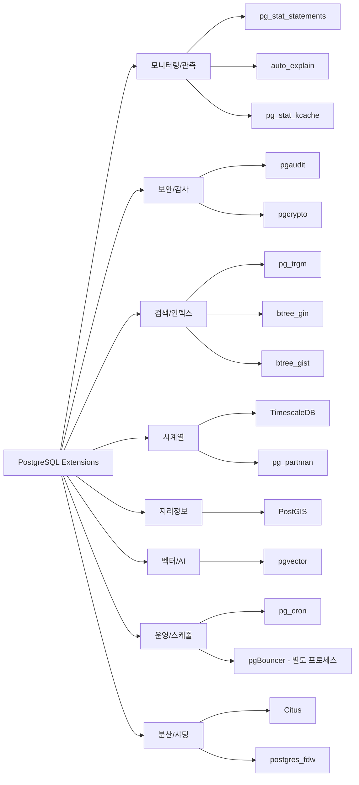
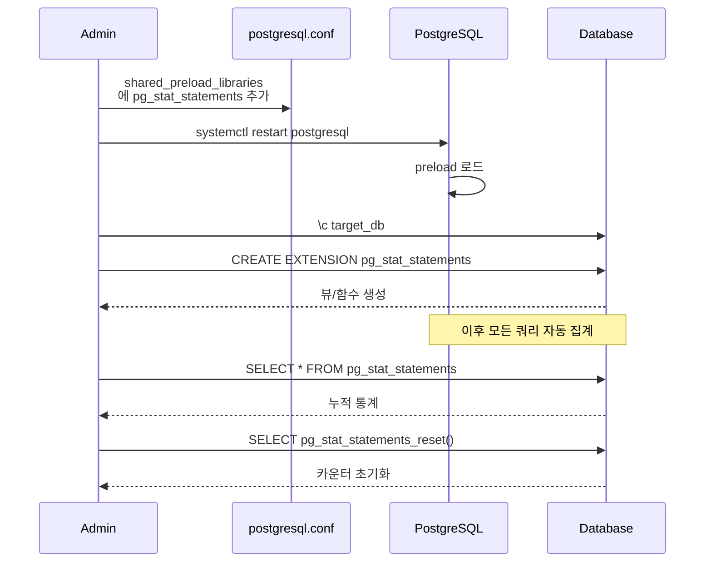

# 13장. 핵심 확장 (Extension)

> PostgreSQL의 진짜 강점은 "엔진 + 확장 생태계". 같은 바이너리로 OLTP, 시계열, 벡터 검색, 감사, 분산까지 모두 커버한다.

PostgreSQL의 Extension은 단순한 플러그인이 아니라 **엔진 내부 API(Hook, SPI, FDW, Index AM)** 에 직접 연결되는 일급 시민이다. 적절한 extension 선택이 아키텍처의 많은 부분을 결정한다. 이 장은 **운영에서 실제로 쓸 법한 extension들만** 추려서, 활성화 방법·주의사항·버전 매트릭스를 정리한다.

---

## 13.1 Extension이란

### 13.1.1 CREATE EXTENSION

Extension은 대개 `.so`(동적 라이브러리) + SQL 스크립트(객체 정의) + control 파일로 배포된다.

```sql
-- 사용 가능한 extension 조회
SELECT name, default_version, installed_version, comment
FROM pg_available_extensions
ORDER BY name;

-- 설치
CREATE EXTENSION pg_stat_statements;

-- 특정 스키마에
CREATE EXTENSION postgis SCHEMA public;

-- 특정 버전 강제
CREATE EXTENSION pg_trgm VERSION '1.6';

-- 업그레이드
ALTER EXTENSION pg_trgm UPDATE TO '1.6';

-- 제거
DROP EXTENSION pg_stat_statements CASCADE;
```

### 13.1.2 관리 뷰

```sql
-- 설치된 extension
SELECT extname, extversion, extrelocatable
FROM pg_extension
ORDER BY extname;

-- extension이 소유한 객체
SELECT
    e.extname,
    n.nspname AS schema,
    c.relname AS object
FROM pg_extension e
JOIN pg_depend   d ON d.refobjid = e.oid AND d.deptype = 'e'
JOIN pg_class    c ON c.oid = d.objid
JOIN pg_namespace n ON n.oid = c.relnamespace
ORDER BY e.extname;
```

### 13.1.3 shared_preload_libraries

일부 extension(`pg_stat_statements`, `auto_explain`, `pgaudit`, `pg_cron` 등)은 **프로세스 시작 시 로드**되어야 한다. `postgresql.conf`에 다음과 같이 추가하고 **PostgreSQL 재시작**이 필요하다.

```conf
# postgresql.conf
shared_preload_libraries = 'pg_stat_statements,auto_explain,pgaudit'
```

> `CREATE EXTENSION`만으로는 동작하지 않는 경우가 많다. preload 여부를 반드시 확인할 것.

### 13.1.4 Extension 카테고리 맵



---

## 13.2 pg_stat_statements — 반드시 켜둘 것

**운영 환경에서 가장 먼저 설치하는 extension.** 실행된 쿼리를 정규화해 실행 횟수·평균 시간·버퍼 히트 등을 누적한다.

### 13.2.1 활성화

```conf
# postgresql.conf
shared_preload_libraries = 'pg_stat_statements'
pg_stat_statements.max = 10000
pg_stat_statements.track = all          # all|top|none
pg_stat_statements.track_utility = on
pg_stat_statements.save = on
track_activity_query_size = 4096        # v14에서 기본 1024 → 실전은 4096 권장
```

재시작 후:

```sql
CREATE EXTENSION pg_stat_statements;
```

### 13.2.2 활성화 흐름



### 13.2.3 핵심 진단 쿼리

```sql
-- 총 실행 시간 TOP 20
SELECT
    substring(query, 1, 100) AS q,
    calls,
    round(total_exec_time::numeric, 0)        AS total_ms,
    round(mean_exec_time::numeric, 2)         AS mean_ms,
    round((100.0 * total_exec_time / sum(total_exec_time) OVER ())::numeric, 2) AS pct
FROM pg_stat_statements
ORDER BY total_exec_time DESC
LIMIT 20;

-- I/O가 많은 쿼리
SELECT
    substring(query, 1, 100) AS q,
    shared_blks_hit,
    shared_blks_read,
    round((100.0 * shared_blks_hit / nullif(shared_blks_hit + shared_blks_read, 0))::numeric, 2) AS hit_pct
FROM pg_stat_statements
ORDER BY shared_blks_read DESC
LIMIT 20;

-- 통계 초기화
SELECT pg_stat_statements_reset();
```

> **v13 이전**: `total_time`, `mean_time` 컬럼명.
> **v13+**: `total_exec_time`, `mean_exec_time`, `total_plan_time`, `mean_plan_time`으로 분리.

---

## 13.3 auto_explain — 느린 쿼리 자동 EXPLAIN

정해진 임계값 이상 오래 걸린 쿼리의 실행 계획을 **로그로 자동 기록**. 장애 후 재현이 안 될 때 결정적이다.

### 13.3.1 설정

```conf
# postgresql.conf
shared_preload_libraries = 'pg_stat_statements,auto_explain'

auto_explain.log_min_duration = '1s'       # 1초 이상 자동 EXPLAIN
auto_explain.log_analyze      = on          # 실제 실행 시간 기록 (비용 있음)
auto_explain.log_buffers      = on
auto_explain.log_timing       = on
auto_explain.log_triggers     = on
auto_explain.log_verbose      = off
auto_explain.log_nested_statements = on    # 함수 내부 쿼리도
auto_explain.sample_rate      = 1.0        # 0~1 샘플링
```

### 13.3.2 함정

- `log_analyze = on`은 **모든 느린 쿼리를 ANALYZE** 하므로 실제 시간보다 10~30% 오버헤드. 프로덕션에서는 `sample_rate = 0.1` 같이 샘플링 권장.
- `log_timing = on`은 고정밀 타이머 호출이 많아 **가상화 환경에서 CPU 오버헤드**. 의심되면 `off`.

---

## 13.4 pgaudit — 감사 로그

**누가, 언제, 어떤 SQL을 실행했는가**를 세션/객체 레벨로 기록. 금융·공공·의료 등 규제 대응 필수.

### 13.4.1 설정

```conf
shared_preload_libraries = 'pgaudit'

pgaudit.log = 'write, ddl, role'   # read, write, function, role, ddl, misc, all
pgaudit.log_catalog = off
pgaudit.log_parameter = on
pgaudit.log_relation = on
pgaudit.log_statement_once = off
```

### 13.4.2 객체 단위 감사

```sql
CREATE ROLE auditor;
GRANT SELECT ON sensitive_table TO auditor;
-- pgaudit.role = 'auditor' 설정 시 해당 권한의 모든 접근이 감사됨
```

### 13.4.3 주의

- 감사 로그는 **저장소·성능 모두 비용**이 있다. 대상 객체/이벤트를 좁히는 게 핵심.
- 클라우드 관리형(RDS/Aurora/Cloud SQL 등)은 고유 구현이 있거나 제공 범위가 다름.

---

## 13.5 pg_trgm — 유사도 검색

**부분 문자열/오타 허용 검색**을 인덱스로 가속. `LIKE '%foo%'`를 인덱스 스캔으로 만든다.

### 13.5.1 설치와 사용

```sql
CREATE EXTENSION pg_trgm;

-- 유사도 계산
SELECT similarity('postgres', 'postgrez');   -- 0.625

-- GIN 인덱스 (가장 일반적)
CREATE INDEX ON users USING GIN (email gin_trgm_ops);

-- 이제 아래 쿼리가 인덱스 사용
EXPLAIN (ANALYZE)
SELECT * FROM users WHERE email LIKE '%@danble.co%';
```

### 13.5.2 GiST vs GIN

| 항목 | GIN | GiST |
|------|-----|------|
| 검색 속도 | 빠름 | 중간 |
| 인덱스 크기 | 큼 | 작음 |
| 빌드 속도 | 느림 | 빠름 |
| 업데이트 비용 | 큼 | 작음 |

**읽기 위주 → GIN**, **쓰기·업데이트가 많고 조금 느려도 OK → GiST**.

### 13.5.3 유사도 연산자

```sql
-- 유사도 임계값 설정
SET pg_trgm.similarity_threshold = 0.3;

-- % 연산자: 임계값 이상
SELECT * FROM users WHERE email % 'postgez';

-- <-> 연산자: 1 - similarity (거리), ORDER BY에 유용
SELECT email FROM users
ORDER BY email <-> 'postgres@'
LIMIT 10;
```

---

## 13.6 btree_gin / btree_gist — 혼합 인덱스

GIN/GiST 인덱스에 **일반 스칼라 타입(int, timestamp 등)도 인덱싱**할 수 있게 해준다. 다중 컬럼 조건에서 특히 유용.

### 13.6.1 대표 사용 예

```sql
CREATE EXTENSION btree_gin;

-- (tenant_id, payload jsonb) 같은 혼합 쿼리
CREATE INDEX ON events
USING GIN (tenant_id, payload jsonb_path_ops);

-- 이제 이런 쿼리가 인덱스 스캔
SELECT * FROM events
WHERE tenant_id = 42
  AND payload @> '{"type":"click"}';
```

```sql
CREATE EXTENSION btree_gist;

-- 시간 범위 + 방 ID 배제 제약 (예약 시스템)
CREATE TABLE reservations (
    room_id   int,
    during    tstzrange,
    EXCLUDE USING GIST (room_id WITH =, during WITH &&)
);
```

---

## 13.7 PostGIS — 지리정보

공간 데이터 표준. 단순 "좌표 저장"이 아니라 **좌표계 변환, 공간 조인, KNN, 라우팅(네트워크)** 까지 커버.

### 13.7.1 설치와 기본

```sql
CREATE EXTENSION postgis;

CREATE TABLE shops (
    id   bigserial PRIMARY KEY,
    name text,
    geom geography(Point, 4326)   -- WGS84
);

CREATE INDEX ON shops USING GIST (geom);

-- 반경 1km 이내
SELECT id, name,
       ST_Distance(geom, 'SRID=4326;POINT(127.0276 37.4979)'::geography) AS dist_m
FROM shops
WHERE ST_DWithin(geom,
                 'SRID=4326;POINT(127.0276 37.4979)'::geography,
                 1000)
ORDER BY dist_m
LIMIT 20;
```

### 13.7.2 geography vs geometry

| 타입 | 좌표계 | 거리 단위 | 용도 |
|------|--------|---------|------|
| `geography` | 구면(WGS84 고정) | 미터 | 전지구 · 거리 |
| `geometry`  | 평면(SRID 선택) | 좌표단위 | 로컬 · 고속 연산 |

실무에서는 **전지구 거리 = `geography`, 로컬 좌표계 공간 분석 = `geometry`** 가 정석.

---

## 13.8 pgvector — 벡터 검색

LLM/임베딩 기반 **유사도 검색**을 PostgreSQL에서 수행. v0.5 이후 HNSW 인덱스 추가로 실전 수준 속도.

### 13.8.1 설치

```sql
CREATE EXTENSION vector;

CREATE TABLE docs (
    id        bigserial PRIMARY KEY,
    content   text,
    embedding vector(1536)     -- OpenAI text-embedding-3-small 기준
);
```

### 13.8.2 인덱스 비교

```sql
-- HNSW (v0.5+): 품질·속도 우수, 빌드 비용 큼
CREATE INDEX ON docs USING HNSW (embedding vector_cosine_ops)
WITH (m = 16, ef_construction = 64);

-- IVFFlat: 빌드 빠름, 메모리 적음, 정확도는 낮음
CREATE INDEX ON docs USING IVFFLAT (embedding vector_cosine_ops)
WITH (lists = 100);   -- 데이터 수 ^ 0.5 근처가 경험칙
```

### 13.8.3 검색

```sql
-- cosine 거리 기준 top-5
SET ivfflat.probes = 10;       -- IVFFlat
SET hnsw.ef_search = 40;       -- HNSW

SELECT id, 1 - (embedding <=> :q) AS similarity
FROM docs
ORDER BY embedding <=> :q
LIMIT 5;
```

### 13.8.4 연산자

| 연산자 | 거리 |
|--------|-----|
| `<->` | L2 (유클리드) |
| `<#>` | 내적 음수(inner product) |
| `<=>` | 코사인 거리(1 - cosine) |

---

## 13.9 TimescaleDB — 시계열

시계열 워크로드에 최적화. Hypertable, 연속 집계, 압축을 엔진 수준에서 지원.

### 13.9.1 Hypertable

```sql
CREATE EXTENSION timescaledb;

CREATE TABLE metrics (
    ts     timestamptz NOT NULL,
    device text,
    value  double precision
);

SELECT create_hypertable('metrics', 'ts', chunk_time_interval => interval '1 day');
```

### 13.9.2 압축

```sql
ALTER TABLE metrics SET (
    timescaledb.compress,
    timescaledb.compress_segmentby = 'device',
    timescaledb.compress_orderby   = 'ts DESC'
);

SELECT add_compression_policy('metrics', interval '7 days');
```

### 13.9.3 연속 집계(Continuous Aggregate)

```sql
CREATE MATERIALIZED VIEW metrics_1m
WITH (timescaledb.continuous) AS
SELECT time_bucket('1 minute', ts) AS bucket,
       device,
       avg(value) AS avg_v,
       max(value) AS max_v
FROM metrics
GROUP BY 1, 2;

SELECT add_continuous_aggregate_policy('metrics_1m',
    start_offset      => interval '1 day',
    end_offset        => interval '1 minute',
    schedule_interval => interval '1 minute');
```

### 13.9.4 라이선스

- **Apache 2.0 (Community Edition)**: hypertable, 기본 압축 등 핵심 기능.
- **TSL (Timescale License)**: 연속 집계의 일부 기능, 계층형 스토리지 등. 클라우드 외 제공에는 제약이 있다. 도입 전 반드시 라이선스 확인.

---

## 13.10 Citus — 샤딩/분산

테이블을 **여러 워커 노드로 분산**해 스케일 아웃. OLTP·분석 모두 대응.

### 13.10.1 분산 테이블

```sql
CREATE EXTENSION citus;

-- 워커 노드 등록
SELECT citus_add_node('worker-1', 5432);
SELECT citus_add_node('worker-2', 5432);

-- 분산 테이블
CREATE TABLE orders (
    order_id  bigserial,
    tenant_id bigint NOT NULL,
    ...
);
SELECT create_distributed_table('orders', 'tenant_id');

-- 참조 테이블 (모든 노드에 복제)
SELECT create_reference_table('country_codes');
```

### 13.10.2 적합 케이스

- **멀티테넌시**: 테넌트 ID 샤드 키.
- **시계열/이벤트**: 시간 샤드 키 + 노드별 분산.

### 13.10.3 한계

- 분산 조인/트랜잭션은 **샤드 키가 일치할 때** 가장 빠르다.
- **FK 제약**이 노드 간에는 제한적. 애플리케이션 레벨 보장이 필요한 경우가 많다.

---

## 13.11 pg_cron — 스케줄링

PostgreSQL 안에서 **cron 문법으로 SQL/함수 실행**. 외부 스케줄러 없이 유지보수 자동화.

### 13.11.1 설치

```conf
shared_preload_libraries = 'pg_cron'
cron.database_name = 'postgres'
```

```sql
CREATE EXTENSION pg_cron;

-- 매일 03:00 VACUUM ANALYZE
SELECT cron.schedule('daily-vacuum', '0 3 * * *',
                     $$VACUUM ANALYZE orders$$);

-- 매월 말 신규 파티션 생성
SELECT cron.schedule('new-partition', '0 0 28 * *',
                     $$SELECT create_next_partition('orders')$$);

-- 작업 목록
SELECT * FROM cron.job;
SELECT * FROM cron.job_run_details ORDER BY start_time DESC LIMIT 20;
```

### 13.11.2 주의

- `cron.database_name` 하나의 DB에만 설정 → 다른 DB에서도 작업은 예약할 수 있지만 `cron.schedule_in_database(...)` 사용.
- Primary에서만 스케줄러가 돌아야 함. Failover 시 새 primary에서 재개되는지 확인.

---

## 13.12 pgBouncer — Connection Pooler (동반 도구)

Extension은 아니지만 **연결 관리의 사실상 표준**. PostgreSQL은 프로세스 기반이라 연결당 메모리가 크고(~10MB), 수천 개 연결을 직접 받으면 비효율.

### 13.12.1 모드

| 모드 | 동작 | 특징 |
|------|-----|------|
| **Session** | 클라이언트 세션 단위로 백엔드 점유 | 기능 제약 없음, 풀 효율 낮음 |
| **Transaction** | 트랜잭션 단위 점유(가장 일반적) | `SET`, prepared statement 주의 |
| **Statement** | 문장 단위(거의 안 씀) | 멀티 문장 트랜잭션 불가 |

### 13.12.2 설정 예

```ini
; pgbouncer.ini
[databases]
appdb = host=127.0.0.1 port=5432 dbname=appdb

[pgbouncer]
listen_port = 6432
pool_mode = transaction
max_client_conn = 5000
default_pool_size = 50
reserve_pool_size = 10
reserve_pool_timeout = 3
server_lifetime = 3600
```

### 13.12.3 Transaction 모드에서의 함정

- `PREPARE ... EXECUTE`, `LISTEN/NOTIFY`, 임시 테이블, `SET` 등은 **같은 세션 보장이 안 됨**.
- 드라이버 레벨의 prepared statement 캐시가 꼬이면 `prepared statement "S_1" does not exist` 에러 → 드라이버에서 비활성화 필요.

---

## 13.13 버전 관리와 업그레이드

### 13.13.1 Extension 버전 확인

```sql
SELECT extname, extversion FROM pg_extension;

SELECT * FROM pg_available_extension_versions
WHERE name = 'pg_stat_statements';
```

### 13.13.2 업그레이드

```sql
-- 최신 기본 버전으로
ALTER EXTENSION pg_stat_statements UPDATE;

-- 특정 버전으로
ALTER EXTENSION pg_trgm UPDATE TO '1.6';
```

### 13.13.3 메이저 업그레이드 시

`pg_upgrade`로 PostgreSQL 메이저 버전을 올릴 때:

1. Source 클러스터에 설치된 모든 extension의 **동일 버전이 target 클러스터에 있어야 함**.
2. PostGIS, TimescaleDB는 메이저 업그레이드 절차가 복잡하므로 **반드시 해당 프로젝트 가이드를 따름**.
3. `shared_preload_libraries`는 target 서버의 `postgresql.conf`에 별도 설정.

### 13.13.4 체크리스트

- [ ] 각 extension의 minimum PostgreSQL 버전 확인
- [ ] `shared_preload_libraries`가 필요한 목록에 모두 포함되어 있는가
- [ ] `CREATE EXTENSION`은 각 데이터베이스별로 실행했는가 (extension은 **DB 단위**)
- [ ] 업그레이드 전 `pg_available_extension_versions`에서 target 버전 확인
- [ ] 감사/보안 extension은 **기본값이 "거의 꺼진 상태"**—실제 감사 대상 설정을 확인

---

## 13.14 운영에서 꼭 고려할 조합

| 목적 | 조합 |
|------|-----|
| 기본 모니터링 | `pg_stat_statements` + `auto_explain` |
| 대량 데이터 관리 | `pg_partman` + `pg_cron` |
| 전문 검색 / 유사 검색 | `pg_trgm` + `btree_gin` |
| 시계열 | `TimescaleDB` 또는 `pg_partman` + `pg_cron` |
| 지리정보 | `postgis` + `postgis_topology` |
| AI/임베딩 | `pgvector` + `pg_trgm`(하이브리드 검색) |
| 규제 대응 | `pgaudit` + `pgcrypto` |
| 확장성 | `Citus` 또는 read replica + pgBouncer |

---

## 공식 문서 참조

- **Extension 일반**: [postgresql.org/docs/current/extend-extensions.html](https://www.postgresql.org/docs/current/extend-extensions.html)
- **pg_stat_statements**: [postgresql.org/docs/current/pgstatstatements.html](https://www.postgresql.org/docs/current/pgstatstatements.html)
- **auto_explain**: [postgresql.org/docs/current/auto-explain.html](https://www.postgresql.org/docs/current/auto-explain.html)
- **pg_trgm**: [postgresql.org/docs/current/pgtrgm.html](https://www.postgresql.org/docs/current/pgtrgm.html)
- **btree_gin / btree_gist**: [postgresql.org/docs/current/btree-gin.html](https://www.postgresql.org/docs/current/btree-gin.html)
- **pgaudit**: [github.com/pgaudit/pgaudit](https://github.com/pgaudit/pgaudit)
- **PostGIS**: [postgis.net/documentation](https://postgis.net/documentation/)
- **pgvector**: [github.com/pgvector/pgvector](https://github.com/pgvector/pgvector)
- **TimescaleDB**: [docs.timescale.com](https://docs.timescale.com)
- **Citus**: [docs.citusdata.com](https://docs.citusdata.com)
- **pg_cron**: [github.com/citusdata/pg_cron](https://github.com/citusdata/pg_cron)
- **pgBouncer**: [pgbouncer.org](https://www.pgbouncer.org/)
- 관련 챕터: [ch05 인덱스](ch05_indexes.md), [ch12 파티셔닝](ch12_partitioning.md), [ch14 모니터링](ch14_monitoring_troubleshooting.md)
