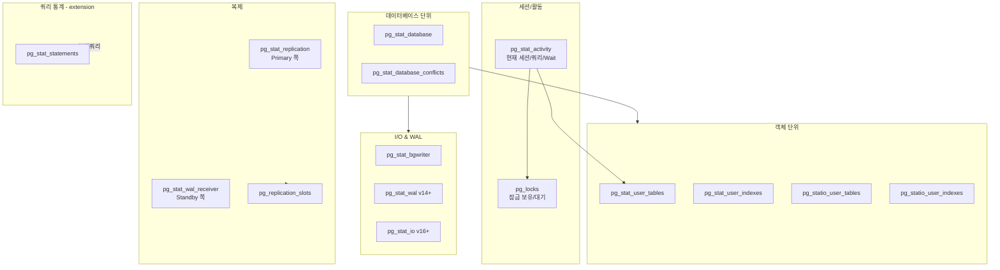
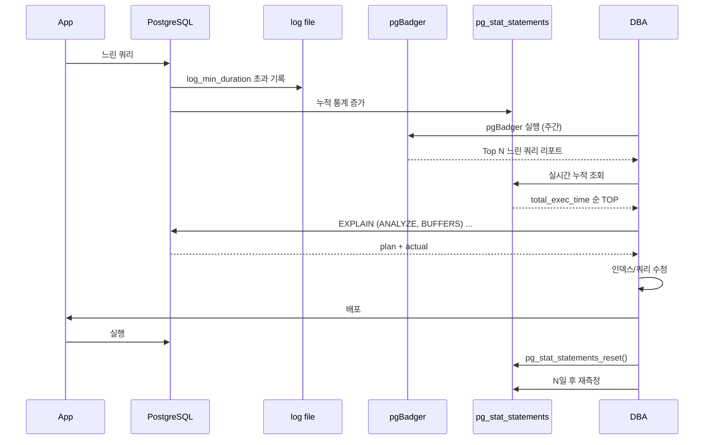
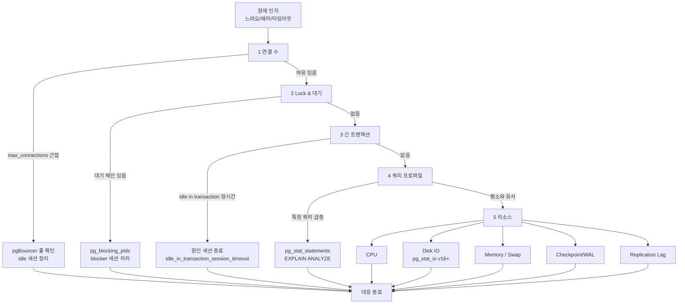

# 14장. 모니터링과 트러블슈팅

> "느려요"는 증상. DBA의 일은 증상을 **측정 가능한 지표**로 번역하는 것.

PostgreSQL은 `pg_stat_*` 뷰와 로그, 그리고 `pg_stat_statements` extension만으로도 **대부분의 장애**를 진단할 수 있다. 이 장은 장애 대응 시의 사고 순서와, 각 단계에서 필요한 SQL/설정/외부 도구를 정리한다.

공식 문서 기준: [monitoring-stats.html](https://www.postgresql.org/docs/current/monitoring-stats.html)

---

## 14.1 pg_stat_* 뷰 총람

PostgreSQL은 내부 상태를 **읽기 전용 뷰**로 노출한다. 주요 뷰는 프로세스/오브젝트/레플리카/WAL/IO 계층별로 나뉜다.

### 14.1.1 뷰 관계도



### 14.1.2 pg_stat_activity — 현재 활동

```sql
SELECT
    pid,
    datname,
    usename,
    application_name,
    client_addr,
    state,                      -- active | idle | idle in transaction | ...
    wait_event_type,
    wait_event,
    now() - xact_start AS xact_age,
    now() - query_start AS query_age,
    substring(query, 1, 100) AS query
FROM pg_stat_activity
WHERE pid <> pg_backend_pid()
ORDER BY xact_start NULLS LAST;
```

| `state` | 의미 |
|--------|------|
| `active` | 쿼리 실행 중 |
| `idle` | 명령 대기 중 |
| `idle in transaction` | **트랜잭션 열어두고 놀고 있음 — Bloat/Lock 원흉** |
| `idle in transaction (aborted)` | 에러 후 롤백 안 함 |
| `fastpath function call` | 내부 함수 호출 |

### 14.1.3 pg_stat_database

```sql
SELECT
    datname,
    numbackends,
    xact_commit,
    xact_rollback,
    blks_read,
    blks_hit,
    round(100.0 * blks_hit / nullif(blks_hit + blks_read, 0), 2) AS cache_hit_pct,
    tup_returned,
    tup_fetched,
    tup_inserted,
    tup_updated,
    tup_deleted,
    deadlocks,
    temp_files,
    temp_bytes,
    stats_reset
FROM pg_stat_database
WHERE datname NOT IN ('template0','template1');
```

- `cache_hit_pct`는 보통 **99% 이상**이 정상. 95% 아래면 shared_buffers 부족 또는 비효율적 시퀀셜 스캔 의심.
- `deadlocks`가 증가하면 14.6 참조.
- `temp_files` / `temp_bytes` 증가 → `work_mem` 부족으로 디스크 정렬·해시.

### 14.1.4 pg_stat_user_tables / pg_stat_user_indexes

```sql
-- 자주 스캔되지만 dead tuple 많은 테이블
SELECT
    schemaname, relname,
    n_live_tup,
    n_dead_tup,
    round(100.0 * n_dead_tup / nullif(n_live_tup + n_dead_tup, 0), 2) AS dead_pct,
    last_autovacuum,
    last_autoanalyze,
    autovacuum_count,
    seq_scan,
    idx_scan
FROM pg_stat_user_tables
ORDER BY n_dead_tup DESC
LIMIT 20;

-- 사용되지 않는 인덱스
SELECT
    s.schemaname, s.relname, s.indexrelname,
    s.idx_scan,
    pg_size_pretty(pg_relation_size(s.indexrelid)) AS size
FROM pg_stat_user_indexes s
JOIN pg_index i ON i.indexrelid = s.indexrelid
WHERE NOT i.indisunique
  AND NOT i.indisprimary
  AND s.idx_scan = 0
ORDER BY pg_relation_size(s.indexrelid) DESC;
```

### 14.1.5 pg_stat_bgwriter — Checkpoint & Background Writer

```sql
SELECT
    checkpoints_timed,
    checkpoints_req,
    round(100.0 * checkpoints_req /
          nullif(checkpoints_timed + checkpoints_req, 0), 2) AS req_pct,
    checkpoint_write_time,
    checkpoint_sync_time,
    buffers_checkpoint,
    buffers_clean,
    maxwritten_clean,
    buffers_backend,
    buffers_backend_fsync,
    buffers_alloc
FROM pg_stat_bgwriter;
```

- `req_pct`가 **30% 이상**이면 checkpoint가 너무 자주 터진다 → `max_wal_size` 증대.
- `buffers_backend` >> `buffers_checkpoint`면 BGW가 못 따라감 → `bgwriter_lru_maxpages` 증대.
- `buffers_backend_fsync`가 0이 아니면 OS fsync가 backend에 섞여 나옴 → **심각 신호**.

### 14.1.6 pg_stat_wal (v14+)

```sql
SELECT
    wal_records,
    wal_fpi,                    -- full page images
    wal_bytes,
    wal_buffers_full,           -- WAL 버퍼 부족 발생 횟수
    wal_write,
    wal_sync,
    wal_write_time,
    wal_sync_time,
    stats_reset
FROM pg_stat_wal;
```

- `wal_buffers_full`이 증가 → `wal_buffers` 증대 필요(기본 shared_buffers의 1/32).
- `wal_fpi` 비율이 매우 높으면 체크포인트 직후 FPI가 몰리는 것 → `checkpoint_timeout` 증대 검토.

### 14.1.7 pg_stat_io (v16+)

**블록 단위 I/O를 backend_type × object × context로 분해**하는 가장 강력한 뷰.

```sql
SELECT
    backend_type,
    object,            -- relation | temp relation
    context,           -- normal | vacuum | bulkread | bulkwrite
    reads, writes, extends, hits,
    evictions, reuses,
    round(io_time::numeric, 2) AS io_ms
FROM pg_stat_io
WHERE reads > 0 OR writes > 0
ORDER BY reads + writes DESC;
```

이전에는 extension(`pg_stat_kcache`)이나 OS 도구에 의존하던 레벨의 분석이 코어에서 가능해짐.

### 14.1.8 pg_stat_replication / pg_stat_wal_receiver

```sql
-- Primary에서
SELECT
    pid, usename, application_name, client_addr,
    state, sync_state,
    pg_wal_lsn_diff(pg_current_wal_lsn(), sent_lsn)     AS sent_lag_bytes,
    pg_wal_lsn_diff(pg_current_wal_lsn(), write_lsn)    AS write_lag_bytes,
    pg_wal_lsn_diff(pg_current_wal_lsn(), flush_lsn)    AS flush_lag_bytes,
    pg_wal_lsn_diff(pg_current_wal_lsn(), replay_lsn)   AS replay_lag_bytes,
    write_lag, flush_lag, replay_lag
FROM pg_stat_replication;

-- Standby에서
SELECT * FROM pg_stat_wal_receiver;
```

### 14.1.9 pg_stat_statements

13.2 참조. 운영 환경의 **장기 누적 쿼리 프로파일**.

---

## 14.2 로그 설정

### 14.2.1 필수 로깅 파라미터

```conf
# postgresql.conf
logging_collector = on
log_destination   = 'stderr,csvlog'     # csvlog는 pgBadger 친화적
log_directory     = 'log'
log_filename      = 'postgresql-%Y-%m-%d_%H%M%S.log'
log_rotation_age  = 1d
log_rotation_size = 100MB
log_line_prefix   = '%m [%p] %q%u@%d '

# 느린 쿼리
log_min_duration_statement = 1000        # ms. 1초 이상 로깅

# DDL은 항상, DML은 너무 많으므로 보통 제외
log_statement = 'ddl'                    # none | ddl | mod | all

# Lock 관련
log_lock_waits = on                      # deadlock_timeout 초과 시 기록
deadlock_timeout = '1s'

# Checkpoint
log_checkpoints = on

# Autovacuum
log_autovacuum_min_duration = '1s'       # 1초 이상 걸린 autovacuum 기록

# 연결/단절
log_connections = off                    # pgBouncer가 있으면 노이즈
log_disconnections = off

# 임시 파일
log_temp_files = 0                       # 모두 기록 (work_mem 진단)
```

> `log_statement = 'all'`은 트래픽 큰 시스템에서 **디스크와 CPU를 모두 잡아먹는다**. 감사 목적이라면 `pgaudit`이 적절.

### 14.2.2 log_line_prefix 권장

```conf
log_line_prefix = '%m [%p] %q%u@%d/%a %h '
# %m = timestamp with ms
# %p = pid
# %u = user, %d = db, %a = app_name, %h = client host
```

---

## 14.3 슬로우 쿼리 추적 표준 워크플로우

증상 → 증거 → 수정 → 검증 루프를 **재현 가능한 형태**로 만든다.



### 14.3.1 표준 EXPLAIN 레시피

```sql
-- 개발/스테이징
EXPLAIN (ANALYZE, BUFFERS, VERBOSE, SETTINGS, WAL, FORMAT TEXT)
<원본 쿼리>;

-- 프로덕션에서 부담 줄일 때
EXPLAIN (ANALYZE, BUFFERS, TIMING OFF, SUMMARY ON, FORMAT TEXT)
<쿼리>;
```

체크포인트:
- `Buffers: shared hit=X read=Y` → read가 크면 캐시 밖 I/O가 많다.
- `Rows Removed by Filter: N` 이 크면 불필요 레코드를 많이 읽음 → 인덱스 조건 재검토.
- `Seq Scan on ...` → 의도된 전체 스캔인가? 통계 부정확인가?

---

## 14.4 Lock 분석

### 14.4.1 Lock 찾기 — 핵심 쿼리

```sql
-- v9.6+의 pg_blocking_pids() 활용
SELECT
    blocked.pid        AS blocked_pid,
    blocked.usename    AS blocked_user,
    blocked.query      AS blocked_query,
    blocking.pid       AS blocking_pid,
    blocking.usename   AS blocking_user,
    blocking.state     AS blocking_state,
    blocking.query     AS blocking_query,
    now() - blocked.xact_start  AS blocked_xact_age,
    now() - blocking.xact_start AS blocking_xact_age
FROM pg_stat_activity AS blocked
JOIN pg_stat_activity AS blocking
  ON blocking.pid = ANY(pg_blocking_pids(blocked.pid))
WHERE blocked.wait_event_type = 'Lock';
```

### 14.4.2 pg_locks 상세

```sql
SELECT
    l.pid,
    l.locktype,
    l.mode,
    l.granted,
    l.relation::regclass AS table,
    l.transactionid,
    a.state,
    a.query
FROM pg_locks l
LEFT JOIN pg_stat_activity a ON a.pid = l.pid
WHERE NOT l.granted
ORDER BY l.pid;
```

### 14.4.3 idle in transaction 킬러

```sql
-- 10분 이상 idle in transaction 전부 표시
SELECT pid, usename, state, xact_start, query
FROM pg_stat_activity
WHERE state = 'idle in transaction'
  AND now() - xact_start > interval '10 minutes';

-- 또는 자동: idle_in_transaction_session_timeout (v9.6+)
-- postgresql.conf
-- idle_in_transaction_session_timeout = '10min'
```

v14+에서는 `idle_session_timeout`도 있다(상태 무관 idle 세션).

### 14.4.4 Lock 모드와 호환성 (요약)

| 모드 | 대표 명령 | 차단 대상 |
|------|---------|---------|
| ACCESS SHARE | `SELECT` | ACCESS EXCLUSIVE만 |
| ROW SHARE | `SELECT ... FOR UPDATE/SHARE` | EXCLUSIVE, ACCESS EXCLUSIVE |
| ROW EXCLUSIVE | `INSERT/UPDATE/DELETE` | SHARE, SHARE ROW EXCLUSIVE, EXCLUSIVE, ACCESS EXCLUSIVE |
| SHARE UPDATE EXCLUSIVE | `VACUUM`, `ANALYZE`, `CREATE INDEX CONCURRENTLY` | 서로 + 상위 |
| SHARE | `CREATE INDEX` (비CONCURRENTLY) | ROW EXCLUSIVE 등 |
| SHARE ROW EXCLUSIVE | — | 대부분 |
| EXCLUSIVE | `REFRESH MATERIALIZED VIEW CONCURRENTLY` | ACCESS SHARE 외 |
| ACCESS EXCLUSIVE | `ALTER TABLE`, `DROP`, `REINDEX` | 모든 것 |

---

## 14.5 Connection 관리

### 14.5.1 파라미터

```conf
max_connections = 300                   # 기본 100
superuser_reserved_connections = 3
reserved_connections = 3                # v16+ (일반 역할 전용 예약)
```

### 14.5.2 적정 연결 수

PostgreSQL 연결당 메모리 사용량: **약 5~10MB + 쿼리 work_mem**.
CPU 코어 × 2~4 정도가 실행 동시성의 상한이므로, 수천 연결을 직접 받는 건 **반드시 pgBouncer**가 필요.

```sql
-- 현재 연결 분포
SELECT
    datname, usename, application_name, state,
    count(*) AS cnt
FROM pg_stat_activity
GROUP BY 1,2,3,4
ORDER BY cnt DESC;
```

### 14.5.3 pgBouncer 모드 요약 (13.12 참조)

| 모드 | 적합성 | 주의 |
|------|-------|-----|
| Session | 호환 100%, 풀 효율 낮음 | 소규모 또는 기존 앱 호환 |
| Transaction | **표준 선택** | SET/PREPARE/Advisory lock 제한 |
| Statement | 거의 사용 안 함 | 멀티문 트랜잭션 불가 |

---

## 14.6 Deadlock 로그 해석

PostgreSQL은 deadlock 감지 시 **자동으로 한 쪽을 롤백**하고 로그에 모든 정보를 남긴다.

```
ERROR:  deadlock detected
DETAIL: Process 12345 waits for ShareLock on transaction 67890;
        blocked by process 54321.
        Process 54321 waits for ShareLock on transaction 67891;
        blocked by process 12345.
        Process 12345: UPDATE accounts SET balance = balance - 100 WHERE id = 1;
        Process 54321: UPDATE accounts SET balance = balance + 100 WHERE id = 2;
HINT:  See server log for query details.
CONTEXT:  while updating tuple (0,1) in relation "accounts"
```

### 해석 순서

1. **어떤 두 트랜잭션**인가 (`pid` 두 개 확인).
2. 각 트랜잭션이 **어떤 락을 갖고 있었고, 무엇을 기다렸는가**.
3. 두 쿼리의 **테이블/키 접근 순서**를 비교 → 반드시 **동일 순서**로 맞추도록 수정.
4. Retry 로직이 애플리케이션에 있는가? 없다면 SERIALIZATION_FAILURE(40P01)에 재시도.

### 예방 체크리스트

- 여러 행을 갱신할 때 **PK 오름차순**으로 정렬 후 UPDATE.
- Advisory lock(`pg_advisory_xact_lock`)으로 순서 강제.
- 장기 트랜잭션을 쪼개서 락 보유 시간 단축.

---

## 14.7 Checkpoint 지표

### 14.7.1 진단

```sql
SELECT
    checkpoints_timed,
    checkpoints_req,
    checkpoint_write_time,
    checkpoint_sync_time,
    buffers_checkpoint,
    buffers_backend,
    buffers_alloc,
    (checkpoints_req::float / nullif(checkpoints_timed + checkpoints_req, 0)) AS req_ratio
FROM pg_stat_bgwriter;
```

### 14.7.2 튜닝 가이드

| 관찰 | 해석 | 조치 |
|------|-----|------|
| `checkpoints_req` 비중 >30% | 체크포인트가 `max_wal_size` 초과로 강제 | `max_wal_size` 증대 (예 1GB → 8GB) |
| `checkpoint_sync_time` 큼 | fsync I/O 스파이크 | `checkpoint_completion_target = 0.9` 유지, 디스크 I/O 점검 |
| `buffers_backend >> buffers_checkpoint` | 백엔드가 직접 dirty flush | `bgwriter_lru_maxpages`, `bgwriter_delay` 조정 |
| checkpoint 로그에 "too frequent" | 빈번한 체크포인트 | `checkpoint_timeout` 증대 (기본 5min → 15min 이상) |

자세한 내용은 [ch09 WAL·Checkpoint](ch09_wal_checkpoint.md) 참조.

---

## 14.8 Replication Lag 지표

### 14.8.1 Primary 측

```sql
SELECT
    application_name,
    state,
    sync_state,
    pg_size_pretty(pg_wal_lsn_diff(pg_current_wal_lsn(), replay_lsn)) AS replay_lag,
    write_lag, flush_lag, replay_lag AS lag_intervals
FROM pg_stat_replication;
```

### 14.8.2 Standby 측

```sql
-- 현재 replay LSN과 master의 차이 (자체 관측)
SELECT
    pg_last_wal_receive_lsn()  AS received,
    pg_last_wal_replay_lsn()   AS replayed,
    pg_last_xact_replay_timestamp() AS last_xact_ts,
    now() - pg_last_xact_replay_timestamp() AS staleness;
```

### 14.8.3 대응

- `replay_lag`은 크지만 `flush_lag` 작음 → Standby가 WAL을 받지만 적용이 느림. 쿼리 충돌(`pg_stat_database_conflicts`)·CPU·I/O 점검.
- `write_lag`부터 크다 → 네트워크/대역폭 점검.
- 동기 복제(`synchronous_commit=on` + `synchronous_standby_names`) 시, standby 장애가 **primary 커밋을 지연**시킨다. `pg_stat_replication.sync_state` 확인.

자세한 내용은 [ch10 Replication](ch10_replication.md).

---

## 14.9 Bloat 감지

### 14.9.1 간이 추정 (빠른 진단)

```sql
SELECT
    schemaname, relname,
    n_live_tup, n_dead_tup,
    round(100.0 * n_dead_tup / nullif(n_live_tup + n_dead_tup, 0), 2) AS dead_pct,
    last_vacuum, last_autovacuum
FROM pg_stat_user_tables
WHERE n_dead_tup > 10000
ORDER BY dead_pct DESC
LIMIT 30;
```

### 14.9.2 pgstattuple (정확하지만 비용 큼)

```sql
CREATE EXTENSION pgstattuple;

SELECT * FROM pgstattuple('orders');
-- dead_tuple_percent, free_percent 확인

SELECT * FROM pgstatindex('orders_pkey');
-- avg_leaf_density 확인
```

### 14.9.3 해결

- 일반 Bloat: `VACUUM` (정상), 필요 시 `VACUUM FULL`은 ACCESS EXCLUSIVE 락이므로 `pg_repack` extension 권장.
- 인덱스 Bloat: `REINDEX CONCURRENTLY` (v12+).

[ch08 VACUUM](ch08_vacuum_autovacuum.md) 참조.

---

## 14.10 장애 시 최상위 진단 순서

현업에서 **"일단 이 순서로 본다"** 가 체화되어 있어야 한다.



### 14.10.1 단계별 핵심 쿼리 묶음

```sql
-- 1) 연결 수
SELECT count(*), state FROM pg_stat_activity GROUP BY state;

-- 2) Lock 체인
SELECT blocked.pid, blocking.pid, blocked.query, blocking.query
FROM pg_stat_activity blocked
JOIN pg_stat_activity blocking
  ON blocking.pid = ANY(pg_blocking_pids(blocked.pid));

-- 3) 긴 트랜잭션
SELECT pid, state, now()-xact_start AS age, query
FROM pg_stat_activity
WHERE xact_start IS NOT NULL
  AND now()-xact_start > interval '1 minute'
ORDER BY age DESC;

-- 4) 쿼리 프로파일 (최근)
SELECT query, calls, round(mean_exec_time::numeric, 2) AS mean_ms,
       round(total_exec_time::numeric, 0) AS total_ms
FROM pg_stat_statements
ORDER BY total_exec_time DESC LIMIT 10;

-- 5) 리소스 단서
SELECT * FROM pg_stat_bgwriter;
SELECT * FROM pg_stat_wal;        -- v14+
SELECT * FROM pg_stat_io;         -- v16+
SELECT * FROM pg_stat_replication;
```

### 14.10.2 안전한 세션 종료

```sql
-- 우선 취소(쿼리만 중단)
SELECT pg_cancel_backend(<pid>);

-- 응답 없으면 강제 종료(세션 자체 종료)
SELECT pg_terminate_backend(<pid>);
```

> `pg_terminate_backend`는 해당 세션의 **미커밋 트랜잭션을 롤백**시킨다. 대상이 장기 쓰기 트랜잭션이면 롤백 시간도 고려.

---

## 14.11 외부 도구

| 도구 | 역할 | 특징 |
|------|-----|------|
| **pgBadger** | 로그 집계 리포트 | `log_line_prefix`, csvlog 기반 HTML 보고서. 무료. 주간 리포트 표준. |
| **pganalyze** | 관리형 관측 | `pg_stat_statements`/로그 기반 자동 추천(인덱스/플랜). 상용. |
| **Datadog / New Relic** | APM/메트릭 | 앱 추적과 통합. PostgreSQL integration 기본 제공. |
| **Percona PMM** | 오픈소스 메트릭 | Grafana 기반 대시보드. `postgres_exporter`와 유사. |
| **postgres_exporter + Prometheus + Grafana** | DIY 메트릭 | 자체 구축. 메트릭 선별 자유도 큼. |
| **check_postgres** | Nagios 플러그인 | 전통적. 임계치 기반 알람. |
| **pg_repack** | Bloat 제거 | Online rebuild. `VACUUM FULL` 대체. |

### 14.11.1 pgBadger 빠른 시작

```bash
# 로그를 csvlog로 두고
pgbadger -o report.html /var/lib/postgresql/*/log/*.csv
```

### 14.11.2 관찰 지표 체크리스트 (Grafana 등)

- TPS, QPS (`xact_commit + xact_rollback` diff)
- Connection 사용률 (`numbackends / max_connections`)
- Cache hit ratio (`blks_hit / (blks_hit + blks_read)`)
- Deadlocks (`pg_stat_database.deadlocks`)
- Checkpoints timed vs req (`pg_stat_bgwriter`)
- Replication lag (bytes, seconds)
- Dead tuple % TOP tables
- WAL generation rate (`pg_stat_wal.wal_bytes` diff, v14+)
- Disk I/O by backend type (`pg_stat_io`, v16+)

---

## 14.12 알림 임계값 권장(시작점)

| 지표 | Warning | Critical |
|------|---------|---------|
| Connection 사용률 | 70% | 90% |
| Cache hit ratio | < 95% | < 90% |
| Deadlock rate | 1/분 | 10/분 |
| Replication lag (bytes) | 100MB | 1GB |
| Replication lag (seconds) | 30s | 120s |
| Long-running xact | > 5min | > 30min |
| Dead tuple % 주요 테이블 | > 20% | > 40% |
| Checkpoint req 비율 | > 30% | > 50% |
| Disk 사용률 (데이터/WAL) | 75% | 90% |

---

## 14.13 장애별 요약표

| 증상 | 즉시 확인할 것 | 주요 해결책 |
|------|-------------|----------|
| `too many connections` | `pg_stat_activity` count, pgBouncer 상태 | pgBouncer 풀 확대, idle 세션 정리 |
| 쿼리 갑자기 느려짐 | `pg_stat_statements`, EXPLAIN | 인덱스/통계/파라미터 sniffing |
| Lock 대기 증가 | `pg_blocking_pids()` | Blocker 종료, 트랜잭션 축소 |
| Deadlock | 로그 detail | 접근 순서 통일, retry |
| Replication lag | `pg_stat_replication` | 네트워크/CPU, 쿼리 충돌 |
| 디스크 WAL 급증 | `pg_replication_slots`, archive | 미회수 슬롯 정리, archive_command |
| Bloat 증가 | `pg_stat_user_tables`, `pgstattuple` | autovacuum 튜닝, pg_repack |
| XID wraparound 경고 | `datfrozenxid` | 긴급 VACUUM FREEZE |

---

## 14.14 체크리스트

- [ ] `pg_stat_statements` + `auto_explain` 기본 탑재
- [ ] `log_min_duration_statement`, `log_lock_waits`, `log_checkpoints`, `log_autovacuum_min_duration` 활성화
- [ ] `idle_in_transaction_session_timeout` 설정
- [ ] pgBouncer 설치 및 모드 결정
- [ ] 주간 pgBadger 리포트 자동화
- [ ] 외부 메트릭 수집(Prometheus/Datadog 등) 설치 및 알림 임계값 정의
- [ ] 장애 진단 플레이북(14.10의 5단계) 문서화
- [ ] 복제 지연 알림
- [ ] Dead tuple % 알림
- [ ] 디스크/WAL 용량 알림

---

## 공식 문서 참조

- **Monitoring / Statistics**: [postgresql.org/docs/current/monitoring-stats.html](https://www.postgresql.org/docs/current/monitoring-stats.html)
- **pg_stat_activity**: monitoring-stats.html#MONITORING-PG-STAT-ACTIVITY-VIEW
- **pg_stat_bgwriter / pg_stat_wal / pg_stat_io**: monitoring-stats.html 내 해당 섹션
- **pg_locks**: [postgresql.org/docs/current/view-pg-locks.html](https://www.postgresql.org/docs/current/view-pg-locks.html)
- **Explicit Locking**: [postgresql.org/docs/current/explicit-locking.html](https://www.postgresql.org/docs/current/explicit-locking.html)
- **pg_stat_statements**: [postgresql.org/docs/current/pgstatstatements.html](https://www.postgresql.org/docs/current/pgstatstatements.html)
- **auto_explain**: [postgresql.org/docs/current/auto-explain.html](https://www.postgresql.org/docs/current/auto-explain.html)
- **Error Logging**: [postgresql.org/docs/current/runtime-config-logging.html](https://www.postgresql.org/docs/current/runtime-config-logging.html)
- **pgBadger**: [pgbadger.darold.net](https://pgbadger.darold.net/)
- 관련 챕터: [ch07 트랜잭션](ch07_transactions_isolation.md), [ch08 VACUUM](ch08_vacuum_autovacuum.md), [ch09 WAL](ch09_wal_checkpoint.md), [ch10 Replication](ch10_replication.md), [ch13 Extension](ch13_extensions.md)
