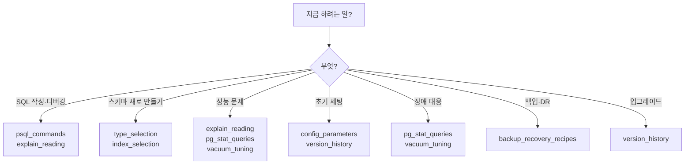

# cheatsheets — 빠른 참조

개념을 아는 상태에서 **"어떻게 하더라?"** 빠르게 찾기 위한 레퍼런스. 설명은 최소화하고 **복붙 가능한 명령·쿼리·표·플로우차트** 중심.

> 📘 전체 가이드 개요는 [../README.md](../README.md) 참고.

---

## 전체 목록

| 파일 | 내용 | 주요 사용처 |
|------|------|-----------|
| [psql_commands.md](psql_commands.md) | psql 메타커맨드, `.psqlrc`, 생산성 팁 | 일상 개발·운영 |
| [explain_reading.md](explain_reading.md) | EXPLAIN 옵션, 노드별 해석, 의심 신호 체크리스트 | 쿼리 튜닝 |
| [index_selection.md](index_selection.md) | 쿼리 패턴 → 인덱스 타입 플로우차트, 6종 비교표 | 인덱스 설계 |
| [type_selection.md](type_selection.md) | 숫자/문자열/시간/UUID/JSON 타입 선택 의사결정 트리 | 스키마 설계 |
| [vacuum_tuning.md](vacuum_tuning.md) | Autovacuum 파라미터 표, Bloat 탐지→조치 플로우 | VACUUM 운영 |
| [config_parameters.md](config_parameters.md) | 필수 `postgresql.conf` 파라미터 + 16GB/4core OLTP 템플릿 | 초기 세팅·튜닝 |
| [pg_stat_queries.md](pg_stat_queries.md) | Lock · Bloat · XID · Replication · I/O 진단 쿼리 13종 | 장애 대응 |
| [backup_recovery_recipes.md](backup_recovery_recipes.md) | pg_dump / pg_basebackup / PITR 레시피, 방식 선택 플로우 | 백업·복구 |
| [version_history.md](version_history.md) | v10 ~ v18 주요 변경, EOL 표, 업그레이드 경로 | 버전 선택·업그레이드 |

---

## 상황별 치트시트 선택



---

## 가장 자주 쓰는 쿼리 Top 5 (pg_stat_queries 발췌)

`pg_stat_queries.md`에서 실전에서 가장 자주 복붙하게 되는 것들만 꼽았다. 자세한 버전은 원본 참조.

### 1) 지금 누가 뭘 하고 있나
```sql
SELECT pid, usename, application_name, state, wait_event_type, wait_event,
       now() - xact_start AS xact_age,
       now() - query_start AS query_age,
       query
FROM pg_stat_activity
WHERE state != 'idle'
ORDER BY xact_age DESC NULLS LAST;
```

### 2) 누가 누굴 막고 있나
```sql
SELECT blocked.pid AS blocked_pid, blocked.query AS blocked_query,
       blocking.pid AS blocking_pid, blocking.query AS blocking_query
FROM pg_stat_activity blocked
JOIN pg_stat_activity blocking
  ON blocking.pid = ANY(pg_blocking_pids(blocked.pid))
WHERE blocked.wait_event_type = 'Lock';
```

### 3) 무거운 쿼리 Top 10 (총 시간 기준)
```sql
SELECT calls, round(total_exec_time::numeric, 1) AS total_ms,
       round(mean_exec_time::numeric, 1) AS mean_ms,
       round((100 * total_exec_time / sum(total_exec_time) OVER ())::numeric, 1) AS pct,
       query
FROM pg_stat_statements
ORDER BY total_exec_time DESC
LIMIT 10;
```

### 4) Dead Tuple 많은 테이블
```sql
SELECT schemaname || '.' || relname AS table,
       n_live_tup, n_dead_tup,
       round(100.0 * n_dead_tup / NULLIF(n_live_tup + n_dead_tup, 0), 1) AS dead_pct,
       last_autovacuum
FROM pg_stat_user_tables
ORDER BY n_dead_tup DESC
LIMIT 20;
```

### 5) XID age (Wraparound 조기 경보)
```sql
SELECT datname, age(datfrozenxid) AS xid_age,
       round(100.0 * age(datfrozenxid) / 2000000000, 1) AS pct_to_wraparound
FROM pg_database
ORDER BY xid_age DESC;
```

---

## 치트시트 사용 요령

- **개념을 모르는 채로는 치트시트만 보지 말 것** — 플로우차트를 잘못 해석하면 튜닝이 역효과를 낸다. 필요하면 해당 [chapters](../chapters/)로 돌아가서 원리 확인.
- **복붙한 쿼리는 `EXPLAIN`과 함께 한 번은 돌려볼 것** — 버전별 컬럼명 차이(`total_time` → `total_exec_time` v13+)가 있다.
- **설정 권장치는 워크로드 의존적** — `config_parameters.md`의 수치는 시작점일 뿐, 실제 부하 측정 후 조정.

---

## 관련 폴더

- [../chapters/](../chapters/) — 개념을 다시 확인해야 할 때
- [../troubleshooting/](../troubleshooting/) — 장애 케이스에서 진단 쿼리 활용
- [../examples/](../examples/) — 설정·인덱스를 실제 도메인에 적용한 사례
