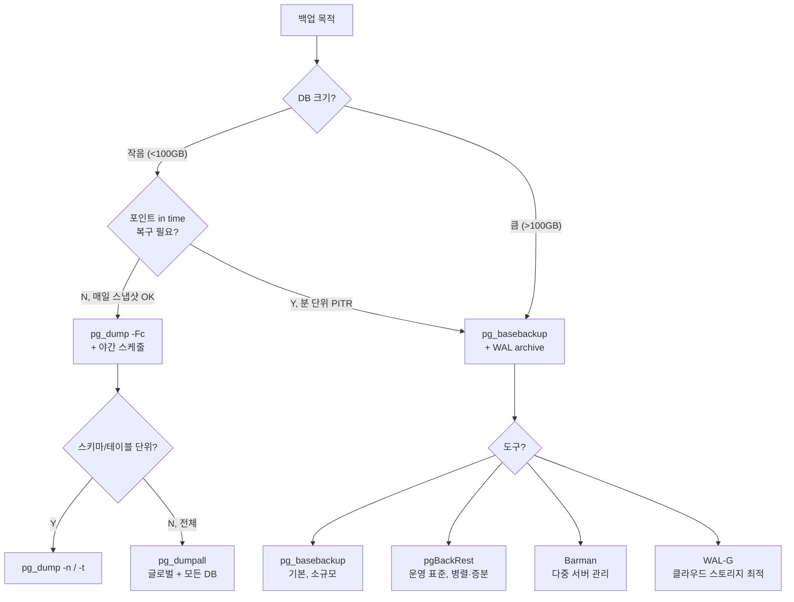

# 치트시트: 백업 / 복구 레시피

PostgreSQL 은 **논리 백업**(pg_dump), **물리 백업**(pg_basebackup), **PITR**(WAL archive) 3가지 전략을 갖는다. 규모·RPO·RTO 에 따라 고른다.

---

## 어떤 방식을 쓸까



---

## 1. pg_dump — 논리 백업

### 기본 포맷

| 포맷 | 옵션 | 특성 |
|------|-----|-----|
| plain (SQL) | `-Fp` (기본) | psql 로 복원, 사람이 편집 가능 |
| custom | **`-Fc`** | 압축, 선택 복원 가능 — **권장** |
| directory | `-Fd` | 병렬 dump/restore 가능 |
| tar | `-Ft` | 일부 기능 제한 |

### 시나리오별 명령

```bash
# 1) 전체 DB, custom 포맷 (최다 사용)
pg_dump -h db.prod -U backup -d app -Fc -f app.dump
pg_dump -h db.prod -U backup -d app -Fc --compress=9 -f app.dump

# 2) 병렬 dump (directory 포맷 전용)
pg_dump -h db.prod -d app -Fd -j 8 -f app_dir
# → app_dir/ 폴더에 테이블별로 파일 생성

# 3) 특정 스키마만
pg_dump -d app -Fc -n reporting  -f reporting.dump
pg_dump -d app -Fc -n 'analytics*' -f analytics.dump
pg_dump -d app -Fc -N pg_temp_*    -f app.dump        # 제외

# 4) 특정 테이블만
pg_dump -d app -Fc -t public.orders -t public.order_items -f orders.dump

# 5) 데이터 없이 스키마만 (검토/환경 복제)
pg_dump -d app -s -f schema.sql

# 6) 데이터만 (기존 스키마에 덮어쓰기)
pg_dump -d app -a -Fc -f data.dump

# 7) 글로벌 객체 (유저·ROLE·TABLESPACE) 포함
pg_dumpall -h db.prod -U postgres --globals-only -f globals.sql
pg_dumpall -h db.prod -U postgres -f cluster.sql        # 전체 클러스터 (큰 곳엔 비권장)
```

### 유용한 플래그

```bash
--no-owner              # 소유자 구문 제외 (다른 환경 복원 시)
--no-privileges         # GRANT/REVOKE 제외
--if-exists --clean     # 기존 객체 DROP 후 생성
--quote-all-identifiers # 식별자 전부 "" 로
--exclude-table-data='audit_*'   # 구조는 포함, 데이터 제외
--snapshot=ID           # 일관된 스냅샷 (병렬)
-j 8                    # directory 포맷 전용 병렬도
-Z 9                    # 압축 레벨 (0~9)
-Z zstd                 # v16+ zstd 압축
```

---

## 2. pg_restore — 복원

```bash
# 1) 새 DB 를 만들어 복원
createdb -h host -U postgres app_restore
pg_restore -h host -U postgres -d app_restore -j 8 app.dump

# 2) 기존 DB 에 덮어쓰기 (위험 — 확인 후)
pg_restore -h host -U postgres -d app --clean --if-exists -j 4 app.dump

# 3) 특정 스키마만
pg_restore -d app -n reporting app.dump

# 4) 특정 테이블만
pg_restore -d app -t orders -t order_items app.dump

# 5) 리스트로 골라 복원
pg_restore -l app.dump > toc.list
# 에디터로 필요한 줄만 남기거나 "; " 로 주석 처리
pg_restore -d app -L toc.list app.dump

# 6) 스키마만 / 데이터만
pg_restore -d app -s app.dump     # 스키마만
pg_restore -d app -a app.dump     # 데이터만

# 7) SQL 로 출력 (검토용)
pg_restore -f - app.dump | less
```

**복원 중 성능 팁:**
```sql
-- 복원 전/중 세션 설정
SET maintenance_work_mem = '2GB';
SET synchronous_commit = off;     -- 복원 중만
SET wal_level = minimal;          -- 복제 안 할 때, 재시작 필요 — 보통 안 건드림
```

plain SQL dump 는 `psql -d app -f dump.sql` 로 복원. 병렬·선택 복원은 불가.

---

## 3. pg_basebackup — 물리 스냅샷

```bash
# 가장 단순한 형태
pg_basebackup -h db.prod -U replicator -D /backup/base_2025-04-24 \
              -Ft -z -P --wal-method=stream

# 옵션
#  -Ft   : tar
#  -z    : gzip 압축
#  -P    : 진행률 표시
#  --wal-method=stream : 백업 중 WAL 을 함께 스트리밍 (권장)
#  -R    : standby.signal + primary_conninfo 생성 (스탠바이용)

# 스탠바이 구축용
pg_basebackup -h primary -U replicator -D /var/lib/postgresql/data \
              -Fp -Xs -R -P -C -S standby1
# -C -S : 백업 중 replication slot 생성
```

필수 준비:
```ini
# postgresql.conf
wal_level = replica
max_wal_senders = 10
```

```
# pg_hba.conf
host replication replicator 10.0.0.0/8 scram-sha-256
```

```sql
CREATE ROLE replicator WITH REPLICATION LOGIN PASSWORD '...';
```

---

## 4. PITR (Point-in-Time Recovery) 기본 세팅

### Primary 설정

```ini
# postgresql.conf
wal_level = replica          # 또는 logical
archive_mode = on
# ⚠️ 레퍼런스 예시 — 운영은 pgBackRest/wal-g 또는 cmp -s 검증 스크립트 권장
archive_command = 'test ! -f /arc/%f && cp %p /arc/%f'
# 운영 권장: archive_command = 'wal-g wal-push %p'  (S3/GCS, 검증/압축/암호화)
archive_timeout = 15min      # 유휴 시 강제 WAL 스위치
```

> ⚠️ 위 `test ! -f && cp`는 목적지 **내용 검증이 없어** 손상된 파일이 이미 있으면 무한 재시도로 `pg_wal/`이 폭증한다. 운영에서는 전용 도구(`pgBackRest`, `wal-g`, `barman`) 또는 `cmp -s` 검증 스크립트 사용. v15+는 `archive_library` 옵션 검토. 상세: [ch11_backup_recovery.md](../chapters/ch11_backup_recovery.md#115-wal-archiving--연속-아카이브)

검증:
```sql
SELECT name, setting FROM pg_settings
WHERE name IN ('archive_mode','archive_command','wal_level');

-- 아카이빙이 밀리지 않는지
SELECT * FROM pg_stat_archiver;
-- archived_count 는 계속 증가, failed_count 는 0 이어야
```

### 베이스 백업 + PITR 복구

```bash
# 1) 베이스 백업
pg_basebackup -D /backup/base_`date +%F` -Ft -z -P -R --wal-method=stream

# 2) 장애 발생 → 새 디렉터리에 풀어 복구
tar xzf /backup/base_2025-04-24/base.tar.gz -C /var/lib/postgresql/data
tar xzf /backup/base_2025-04-24/pg_wal.tar.gz -C /var/lib/postgresql/data/pg_wal

# 3) recovery 설정 (v12+ 는 postgresql.auto.conf 에)
cat >> /var/lib/postgresql/data/postgresql.auto.conf <<'EOF'
restore_command = 'cp /arc/%f %p'
recovery_target_time = '2025-04-24 10:30:00+09'
recovery_target_action = 'promote'        # 완료 후 primary 승격
EOF

# v12+ : recovery.conf 는 없어지고 아래 파일로 신호
touch /var/lib/postgresql/data/recovery.signal      # PITR
# 또는
touch /var/lib/postgresql/data/standby.signal       # 스탠바이 기동

# 4) 기동
pg_ctl -D /var/lib/postgresql/data start
```

### 복구 타깃 종류

```ini
recovery_target_time = '2025-04-24 10:30:00+09'
recovery_target_xid  = '123456789'
recovery_target_lsn  = '0/3000000'
recovery_target_name = 'before-migration'    # pg_create_restore_point 로 생성
recovery_target      = 'immediate'           # 일관성 확보 직후
recovery_target_inclusive = true             # 기본
recovery_target_action    = pause | promote | shutdown
```

---

## 5. WAL Archiving 의 함정

```
archive_command 이 "성공" 을 반환할 때까지 WAL 은 pg_wal/ 에 남는다
  → 아카이빙 실패가 누적되면 pg_wal 디스크 풀 → DB 중단

방지:
1) archive_command 의 반환값·로그를 반드시 모니터
   (pg_stat_archiver.last_failed_time, failed_count)
2) archive_command 는 멱등하게 작성
      test ! -f /arc/%f && cp %p /arc/%f
3) 스토리지 모니터링 + archive_timeout 설정
4) archive_cleanup (pg_archivecleanup) 또는 S3 lifecycle 정책
```

---

## 6. 복구 검증 체크리스트

```
[ ] 복원된 DB 에서 pg_is_in_recovery() = false
[ ] pg_stat_database.xact_commit 증가 (쓰기 가능)
[ ] 주요 테이블 행 수 비교 (샘플 쿼리)
[ ] 최신 예상 트랜잭션이 보이는가
[ ] 인덱스 / 제약 / 시퀀스 오류 없음: pg_dump -s 비교
[ ] 애플리케이션 smoke test
[ ] 시퀀스 setval 확인 (대용량 복제 후 next id 충돌 방지)
    SELECT setval(pg_get_serial_sequence('orders','id'), max(id)) FROM orders;
[ ] 확장(pg_stat_statements 등) 재설치
[ ] 통계 수집: VACUUM ANALYZE
```

---

## 7. 운영 도구 (권장)

| 도구 | 특징 |
|------|-----|
| **pgBackRest** | 병렬, 증분·차등, 압축, 복구 검증 내장. 운영 표준 |
| **Barman** | 다중 서버 중앙 관리, 스트리밍 백업 |
| **WAL-G** | S3/GCS 최적, 증분 base backup |
| **pg_probackup** | block-level 증분 |

```bash
# pgBackRest 예
pgbackrest --stanza=main backup --type=full
pgbackrest --stanza=main backup --type=incr
pgbackrest --stanza=main --delta --type=time \
           --target="2025-04-24 10:30:00+09" restore
```

---

## 8. 증분 백업 (v17+ 기본 도구)

v17 에서 `pg_basebackup --incremental` 도입 + `pg_combinebackup` 으로 병합 복원.

```bash
# 전체 백업
pg_basebackup -D /backup/full -c fast

# 증분 백업 (이전 백업의 manifest 필요)
pg_basebackup -D /backup/inc1 --incremental=/backup/full/backup_manifest

# 복원 전 병합
pg_combinebackup /backup/full /backup/inc1 -o /restore/target
```

---

## 9. 논리 복제 기반 "연속 백업" 대안

**물리 백업의 대안** 으로, 버전 간 이관이나 스키마 단위 미러가 필요할 때:

```sql
-- Publisher
CREATE PUBLICATION pub_all FOR ALL TABLES;

-- Subscriber
CREATE SUBSCRIPTION sub_all
  CONNECTION 'host=primary dbname=app user=repl password=...'
  PUBLICATION pub_all;
```

주: 백업이 아니라 **실시간 복제**. DDL 은 복제되지 않음. DR 용으로는 physical replication 이 더 안전.

---

## 10. 자주 하는 실수

```
1) pg_dump 를 "백업" 으로만 쓰면서 PITR 요구 사항을 못 맞춤
   → 복구 시점이 덤프 시각에 고정됨

2) archive_command 에 단순 cp 사용 → 멱등 아님, 실패 시 무한 재시도
   → test ! -f … && cp 패턴 + 로그 모니터링

3) 백업 성공 확인만 하고 "복원 테스트" 안 함
   → 최소 분기별 복원 드릴

4) 새 환경 복원 후 시퀀스 재조정 잊음 → duplicate key

5) pg_basebackup 을 primary 바쁜 시간에 실행 → I/O 경합
   → 스탠바이에서 받기 or 야간

6) 복구 target_time 을 TZ 없이 지정 → 타임존 혼란
   → 항상 '+09' 등 명시

7) archive 디렉터리 용량 모니터링 누락 → 디스크 풀
```

---

## 참고

- Backup/Restore: https://www.postgresql.org/docs/current/backup.html
- pg_dump: https://www.postgresql.org/docs/current/app-pgdump.html
- pg_restore: https://www.postgresql.org/docs/current/app-pgrestore.html
- pg_basebackup: https://www.postgresql.org/docs/current/app-pgbasebackup.html
- Continuous Archiving: https://www.postgresql.org/docs/current/continuous-archiving.html
- pgBackRest: https://pgbackrest.org/
