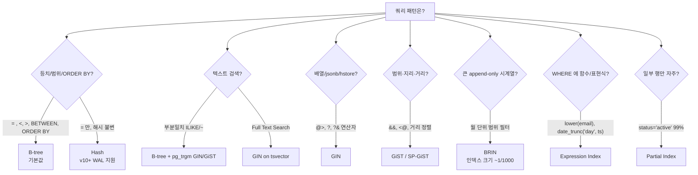

# 치트시트: 인덱스 타입 선택

PostgreSQL 은 다양한 인덱스 타입을 제공한다. **쿼리 패턴과 데이터 분포**에 맞는 타입을 고르는 것이 비용 대비 효율의 핵심.

---

## 빠른 선택 플로우차트



---

## 타입별 특성 표

| 타입 | 지원 연산자 | 적합 데이터 | 주 용도 | 주의 |
|------|-----------|-----------|--------|------|
| **B-tree** | `= < <= >= >` `BETWEEN` `IN` `IS NULL` `ORDER BY` `LIKE 'foo%'` | 스칼라, 정렬 가능 타입 | 기본. 대부분의 인덱스 | `LIKE '%foo'` 는 불가 |
| **Hash** | `=` 만 | 해시 가능 타입 | 매우 큰 등치 단일 쿼리, 긴 키 | v10+ WAL·복제 지원. B-tree 대비 이득은 제한적 |
| **GIN** | `@>` `?` `?&` `?\|` `@@` `=` (array) | 배열, jsonb, tsvector, trgm | FTS, 다값 포함 검색 | 쓰기 느림, `fastupdate=on` 기본(지연 플러시) |
| **GiST** | `&&` `<@` `<<` `~=` `<->` (거리) | geometry, range, tsvector, trgm | 지리·범위·근접 검색 | 손실형 가능, 연산자 클래스 다양 |
| **SP-GiST** | GiST 유사 + 공간 분할 | 비균형 데이터 (접두사 트리, 4분 트리) | IP 접두, 텍스트 접두 | 연산자 클래스 제한 |
| **BRIN** | 범위 연산자 | 물리 순서와 값 순서가 일치 (시계열 append) | 대용량 히트맵형 | 테이블 물리 정렬 무너지면 무의미 |

---

## 변형: Partial / Expression / Covering / Unique

### Partial Index — 조건부

```sql
-- 전체 행 중 일부만 인덱싱 → 크기 감소, WRITE 비용도 감소
CREATE INDEX idx_orders_pending ON orders (created_at)
  WHERE status = 'pending';

-- 중복 허용이지만 NULL 은 unique
CREATE UNIQUE INDEX ux_user_active_email ON users (email)
  WHERE deleted_at IS NULL;
```

쿼리가 `WHERE status = 'pending'` 을 포함해야 사용됨.

### Expression Index — 함수/표현식

```sql
-- 대소문자 무시 검색
CREATE INDEX idx_users_lower_email ON users (lower(email));
SELECT * FROM users WHERE lower(email) = 'a@b.com';   -- 사용됨

-- 날짜 트렁크
CREATE INDEX idx_orders_day ON orders (date_trunc('day', created_at));
```

**함수는 IMMUTABLE 이어야** 한다.

### Covering Index (INCLUDE) — v11+

```sql
-- 인덱스 컬럼엔 아니지만 데이터만 실어 heap 방문 제거
CREATE INDEX idx_orders_user_covering
  ON orders (user_id) INCLUDE (status, amount);

-- Index Only Scan 가능 (VM 이 갱신되어 있어야)
```

### Unique + NULLS NOT DISTINCT — v15+

```sql
-- 이전엔 NULL 여러 개 허용. v15부터 NULL 도 유일 취급 가능
CREATE UNIQUE INDEX ux_a ON t (a) NULLS NOT DISTINCT;
```

---

## 다중 컬럼 인덱스 — 순서 규칙

```sql
CREATE INDEX idx_orders_user_created ON orders (user_id, created_at);
```

**사용 가능:**
- `WHERE user_id = ?`                              (첫 컬럼 사용)
- `WHERE user_id = ? AND created_at > ?`           (둘 다)
- `WHERE user_id = ? ORDER BY created_at`          (Index Scan + sort 제거)
- `WHERE user_id IN (...)`                         (첫 컬럼, 제한적)

**사용 불가 / 비효율:**
- `WHERE created_at > ?`                           (첫 컬럼 미지정)

### 순서 결정 룰

```
1) 등치 필터(=) 컬럼 먼저
2) 그 다음 범위 필터(<, >, BETWEEN) 컬럼
3) 마지막에 ORDER BY 컬럼
4) 선택도(distinct 값 수) 높은 컬럼을 앞으로 (단, 쿼리 패턴 우선)
```

### 예

```sql
-- (tenant_id = ?) AND (status = ?) AND (created_at > ?) ORDER BY created_at
CREATE INDEX ON orders (tenant_id, status, created_at);
-- 등치(tenant, status) → 범위(created_at)
```

---

## 특수 패턴

### LIKE 검색

```sql
-- 접두 검색만 B-tree 로 커버 (LIKE 'foo%')
CREATE INDEX ON t (col text_pattern_ops);   -- 기본 collation 이 C 가 아닐 때

-- 중간 매칭, 대소문자 무시
CREATE EXTENSION pg_trgm;
CREATE INDEX idx_t_col_trgm ON t USING gin (col gin_trgm_ops);
SELECT * FROM t WHERE col ILIKE '%abc%';
```

### JSONB

```sql
CREATE INDEX idx_doc ON orders USING gin (doc);                 -- 모든 키
CREATE INDEX idx_doc_path ON orders USING gin (doc jsonb_path_ops);  -- @> 만, 더 작음

-- 특정 경로만
CREATE INDEX idx_doc_status ON orders ((doc->>'status'));
```

### 배열

```sql
CREATE INDEX ON t USING gin (tags);
SELECT * FROM t WHERE tags @> ARRAY['sale'];
```

### 시계열 (BRIN)

```sql
CREATE INDEX idx_events_ts_brin ON events USING brin (ts)
  WITH (pages_per_range = 128);
-- 테이블이 ts 순으로 append 된 경우에만 효과
```

### 공간/범위

```sql
CREATE INDEX ON reservations USING gist (range);              -- tstzrange 겹침
CREATE INDEX ON places USING gist (location);                 -- PostGIS geometry
CREATE EXTENSION btree_gist;
CREATE INDEX ON bookings USING gist (room_id, during);        -- 동시 예약 방지용 EXCLUSION
```

---

## CREATE/REINDEX CONCURRENTLY — 운영 중 필수

```sql
-- 테이블 잠그지 않고 인덱스 생성 (두 번 스캔, 시간 ~2배)
CREATE INDEX CONCURRENTLY idx_orders_status ON orders (status);

-- 실패 시 INVALID 로 남음 → 확인 후 drop/retry
SELECT indexrelid::regclass, indisvalid
FROM pg_index
WHERE NOT indisvalid;

DROP INDEX CONCURRENTLY IF EXISTS idx_orders_status;

-- REINDEX CONCURRENTLY (v12+)
REINDEX INDEX CONCURRENTLY idx_orders_status;
REINDEX TABLE CONCURRENTLY orders;
```

**주의:**
- `CONCURRENTLY` 는 트랜잭션 블록 안에서 못 씀
- 긴 idle-in-transaction 이 있으면 무한 대기
- 디스크 공간 여유 필요 (기존 + 신규 동시 존재)

---

## 인덱스 사용·효율 점검

```sql
-- 사용 안 되는 인덱스
SELECT schemaname, relname, indexrelname,
       pg_size_pretty(pg_relation_size(indexrelid)) AS size,
       idx_scan
FROM pg_stat_user_indexes
WHERE idx_scan = 0
  AND schemaname NOT IN ('pg_catalog','pg_toast')
ORDER BY pg_relation_size(indexrelid) DESC;

-- 중복 인덱스 후보 (같은 컬럼 조합)
SELECT indrelid::regclass AS table, array_agg(indexrelid::regclass) AS idxs
FROM pg_index
GROUP BY indrelid, indkey
HAVING count(*) > 1;

-- 특정 테이블의 인덱스 크기
SELECT indexrelname, pg_size_pretty(pg_relation_size(indexrelid))
FROM pg_stat_user_indexes WHERE relname = 'orders';
```

---

## 안티패턴

```sql
-- 1) 함수 래핑 → 인덱스 못 씀
WHERE to_char(created_at,'YYYY-MM-DD') = '2025-01-01';   -- ❌
WHERE created_at >= '2025-01-01' AND created_at < '2025-01-02';  -- ✅

-- 2) 암묵적 타입 캐스트
WHERE user_id = '42';    -- user_id int 면 인덱스 못 쓸 수 있음
WHERE user_id = 42;      -- ✅

-- 3) 리딩 와일드카드
WHERE email LIKE '%@example.com';  -- B-tree 못 씀 → pg_trgm GIN 고려

-- 4) OR 조합 (때로 UNION ALL 이 나음)
WHERE a = 1 OR b = 2;

-- 5) 너무 많은 인덱스 — 쓰기마다 전부 갱신, Bloat 늘어남
```

---

## 참고

- Indexes: https://www.postgresql.org/docs/current/indexes.html
- GIN: https://www.postgresql.org/docs/current/gin.html
- BRIN: https://www.postgresql.org/docs/current/brin.html
- CREATE INDEX: https://www.postgresql.org/docs/current/sql-createindex.html
- pg_trgm: https://www.postgresql.org/docs/current/pgtrgm.html
