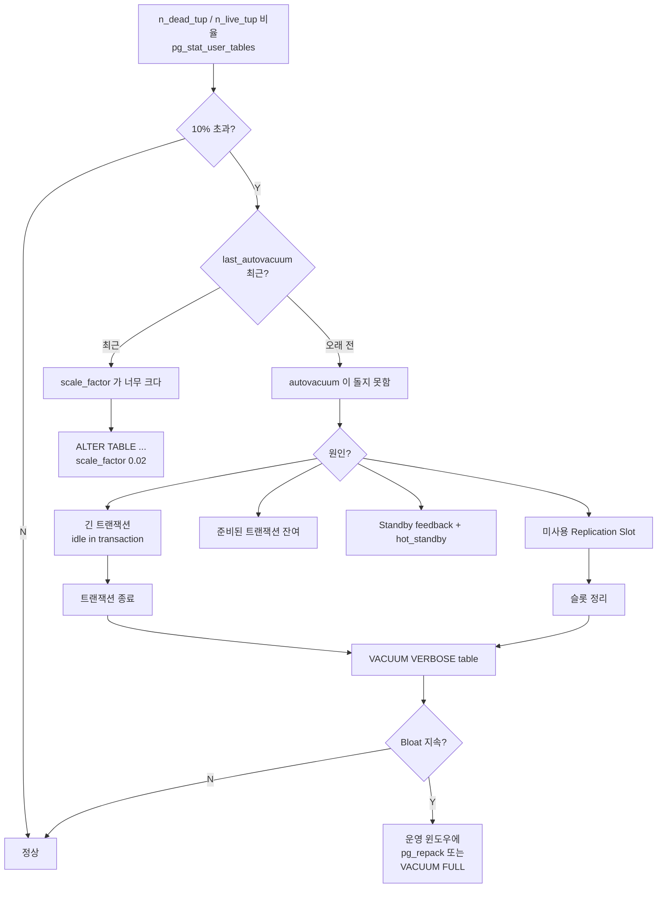

# 치트시트: VACUUM / Autovacuum 튜닝

MVCC 특성상 UPDATE/DELETE 는 Dead Tuple 을 만든다. VACUUM 이 안 따라가면 **Bloat**(쓸모없는 공간)이 쌓이고 **XID Wraparound** 위험도 생긴다. 기본 autovacuum 은 "작은 테이블" 기준. 큰 테이블일수록 **테이블별 튜닝**이 필수.

---

## Autovacuum 트리거 공식

```
VACUUM 실행 조건:
  n_dead_tup > autovacuum_vacuum_threshold
              + autovacuum_vacuum_scale_factor * n_live_tup

ANALYZE 실행 조건:
  (n_ins + n_upd + n_del) > autovacuum_analyze_threshold
                          + autovacuum_analyze_scale_factor * n_live_tup

INSERT-only VACUUM (v13+):
  n_ins_since_vacuum > autovacuum_vacuum_insert_threshold
                     + autovacuum_vacuum_insert_scale_factor * n_live_tup
```

**의미:** 1억 행 테이블은 dead tuple 이 `50 + 0.2 × 1억 = 2천만` 쌓이기 전엔 autovacuum 이 안 뜬다. 큰 테이블일수록 scale_factor 를 **개별 축소** 해야 함.

---

## 핵심 파라미터 표

| 파라미터 | 기본값 | 튜닝 범위 | 의미 |
|---------|-------|---------|------|
| `autovacuum` | on | on 유지 | 끄지 말 것 |
| `autovacuum_naptime` | 1min | 15s~1min | 워커 탐색 주기 |
| `autovacuum_max_workers` | 3 | 3~8 | 동시 워커 수 (CPU·I/O 여유만큼) |
| `autovacuum_vacuum_threshold` | 50 | 그대로 | VACUUM 절대 기준 |
| `autovacuum_vacuum_scale_factor` | 0.2 | 큰 테이블 **0.01~0.05** | VACUUM 상대 기준 |
| `autovacuum_analyze_threshold` | 50 | 그대로 | ANALYZE 절대 기준 |
| `autovacuum_analyze_scale_factor` | 0.1 | 큰 테이블 **0.02** | ANALYZE 상대 기준 |
| `autovacuum_vacuum_insert_threshold` (v13+) | 1000 | 그대로 | append-only VACUUM 기준 |
| `autovacuum_vacuum_insert_scale_factor` (v13+) | 0.2 | 0.05~0.1 | append-only VACUUM 상대 |
| `autovacuum_freeze_max_age` | 2억 | 1.5~4억 | XID 위험치 — 초과 시 "anti-wraparound" 강제 VACUUM |
| `autovacuum_multixact_freeze_max_age` | 4억 | 유사 | multixact 대응 |
| `autovacuum_vacuum_cost_delay` | 2ms | 1~10ms | I/O 스로틀 |
| `autovacuum_vacuum_cost_limit` | -1 (=vacuum_cost_limit) | 1000~10000 | 한 번 sleep 전 누적 비용 |
| `vacuum_cost_page_hit` | 1 | | 캐시 히트 페이지 비용 |
| `vacuum_cost_page_miss` | 2 | | 디스크 읽기 페이지 비용 |
| `vacuum_cost_page_dirty` | 20 | | 더럽힌 페이지 비용 |
| `maintenance_work_mem` | 64MB | 1~2GB | VACUUM/CREATE INDEX 메모리 |
| `vacuum_buffer_usage_limit` (v16+) | 256kB | 2~16MB | VACUUM 의 ring buffer 크기 |

---

## 테이블별 오버라이드 (권장 패턴)

```sql
-- 큰 테이블: 더 자주 VACUUM/ANALYZE
ALTER TABLE orders SET (
  autovacuum_vacuum_scale_factor   = 0.02,
  autovacuum_analyze_scale_factor  = 0.01,
  autovacuum_vacuum_cost_limit     = 2000,
  autovacuum_vacuum_cost_delay     = 2
);

-- append-only 시계열 테이블
ALTER TABLE events SET (
  autovacuum_vacuum_insert_scale_factor = 0.05,
  autovacuum_freeze_max_age = 100000000,        -- 1억 (기본의 절반) → 더 일찍 freeze
  fillfactor = 100
);

-- UPDATE-heavy 테이블 (HOT update 유도)
ALTER TABLE sessions SET (
  fillfactor = 80,                              -- 페이지에 여유 → HOT 증가
  autovacuum_vacuum_scale_factor = 0.05
);

-- 확인
SELECT reloptions FROM pg_class WHERE relname = 'orders';
```

---

## Bloat 탐지 → 조치 플로우



---

## 진단 쿼리

### 1) Dead Tuple 비율

```sql
SELECT schemaname, relname,
       n_live_tup, n_dead_tup,
       round(100.0 * n_dead_tup / NULLIF(n_live_tup,0), 2) AS dead_pct,
       last_autovacuum, last_autoanalyze,
       autovacuum_count, analyze_count
FROM pg_stat_user_tables
WHERE n_dead_tup > 1000
ORDER BY n_dead_tup DESC
LIMIT 20;
```

### 2) XID 위험도

```sql
-- 데이터베이스별 "얼마나 많이 남았는가"
SELECT datname, age(datfrozenxid) AS xid_age,
       round(100.0 * age(datfrozenxid) / 2000000000, 2) AS pct_to_wraparound
FROM pg_database
ORDER BY age(datfrozenxid) DESC;

-- 테이블별
SELECT relname, age(relfrozenxid) AS xid_age
FROM pg_class WHERE relkind = 'r'
ORDER BY age(relfrozenxid) DESC LIMIT 20;
```

기준: `age > 15억` 이면 경보, `18억` 이면 긴급.

### 3) VACUUM 을 막는 원인

```sql
-- 긴 트랜잭션 / idle in transaction
SELECT pid, usename, state, now()-xact_start AS xact_age, query
FROM pg_stat_activity
WHERE xact_start IS NOT NULL
ORDER BY xact_age DESC NULLS LAST LIMIT 10;

-- 미사용 Replication Slot
SELECT slot_name, active, restart_lsn,
       pg_size_pretty(pg_wal_lsn_diff(pg_current_wal_lsn(), restart_lsn)) AS lag
FROM pg_replication_slots;

-- Prepared transaction (2PC)
SELECT * FROM pg_prepared_xacts;
```

### 4) 실제 Bloat 추정 (pgstattuple — 정확, 비쌈)

```sql
CREATE EXTENSION pgstattuple;

-- 샘플링 (크기 큰 테이블용)
SELECT * FROM pgstattuple_approx('orders');

-- 정밀
SELECT * FROM pgstattuple('orders');
SELECT * FROM pgstatindex('idx_orders_user');
```

### 5) 진행 중인 VACUUM

```sql
SELECT p.pid, p.datname, c.relname, p.phase,
       p.heap_blks_total, p.heap_blks_scanned, p.heap_blks_vacuumed,
       round(100.0 * p.heap_blks_scanned / NULLIF(p.heap_blks_total,0), 1) AS scan_pct
FROM pg_stat_progress_vacuum p
JOIN pg_class c ON c.oid = p.relid;
```

---

## 수동 VACUUM 명령

```sql
-- 기본 VACUUM (공간 재사용 표시, OS 에는 반환 안 함)
VACUUM orders;

-- ANALYZE 동반
VACUUM (ANALYZE) orders;

-- 진행 상황 로깅
VACUUM (VERBOSE, ANALYZE) orders;

-- INDEX 도 스킵하지 말고 재계산 (v12+ 기본)
VACUUM (INDEX_CLEANUP ON) orders;

-- freeze 강제 (프리즈 미뤄둔 테이블 복구)
VACUUM (FREEZE) orders;

-- Disk 반환 (AccessExclusiveLock — 서비스 중 금지)
VACUUM FULL orders;

-- 병렬 VACUUM (v13+)
VACUUM (PARALLEL 4) orders;

-- 특정 컬럼만 ANALYZE
ANALYZE orders (status, created_at);
```

---

## Bloat 제거 — 운영 안전 옵션

| 방법 | 락 | 디스크 | 언제 |
|------|----|-------|-----|
| `VACUUM` | 낮음 | 공간 반환 X | 일상 — Autovacuum 조정 우선 |
| `VACUUM FULL` | **ACCESS EXCLUSIVE** | 2x | 다운타임 허용 가능할 때만 |
| `CLUSTER` | **ACCESS EXCLUSIVE** | 2x | 인덱스 순으로 재정렬 + 공간 회수 |
| `pg_repack` | 짧은 락만 | 2x | **운영 중 Bloat 제거의 표준** |
| `pg_squeeze` | 짧은 락만 | 2x | 대안 |
| `REINDEX CONCURRENTLY` (v12+) | 낮음 | 1x + | 인덱스만 bloat 된 경우 |

```bash
# pg_repack 예
pg_repack -h host -U user -d mydb -t orders --no-superuser-check
pg_repack -h host -U user -d mydb --all    # DB 전체
```

---

## I/O 스로틀 튜닝

```
비용 모델:
  각 I/O 당 누적 비용 += (hit=1 or miss=2 or dirty=20)
  누적 비용이 vacuum_cost_limit 도달 시 vacuum_cost_delay ms sleep

결과 "초당 대략적 I/O":
  8KB × (cost_limit / cost_delay / avg_cost_per_page)

예: cost_limit=2000, cost_delay=2ms, 평균 miss 기준
    2000 / 2 = 1000 iter/sec × (2000/2) 페이지 = ... 대략 4~8 MB/s
```

바쁜 서버에서 Bloat 누적이 해결 안 되면 `autovacuum_vacuum_cost_limit` 을 올리거나 `cost_delay` 를 줄여 VACUUM 속도를 높인다.

---

## 빠른 체크리스트

```
[ ] autovacuum = on (절대 끄지 말 것)
[ ] 큰 테이블마다 scale_factor 를 0.02~0.05 로 오버라이드
[ ] maintenance_work_mem = 1~2GB (VACUUM/인덱스 빌드 가속)
[ ] autovacuum_max_workers 와 워커당 비용 예산 균형
[ ] 긴 트랜잭션·미사용 슬롯 감시 (VACUUM blocker)
[ ] XID age 15억 이하 유지 (Datadog/Prometheus 알림)
[ ] log_autovacuum_min_duration = '1s' 로 실제 돌았는지 기록
[ ] append-only 는 insert_scale_factor 와 fillfactor=100
[ ] UPDATE-heavy 는 fillfactor=80~90 으로 HOT update 유도
```

---

## 참고

- Routine Vacuuming: https://www.postgresql.org/docs/current/routine-vacuuming.html
- Autovacuum settings: https://www.postgresql.org/docs/current/runtime-config-autovacuum.html
- VACUUM SQL: https://www.postgresql.org/docs/current/sql-vacuum.html
- pg_repack: https://github.com/reorg/pg_repack
- Wiki Bloat 쿼리: https://wiki.postgresql.org/wiki/Show_database_bloat
