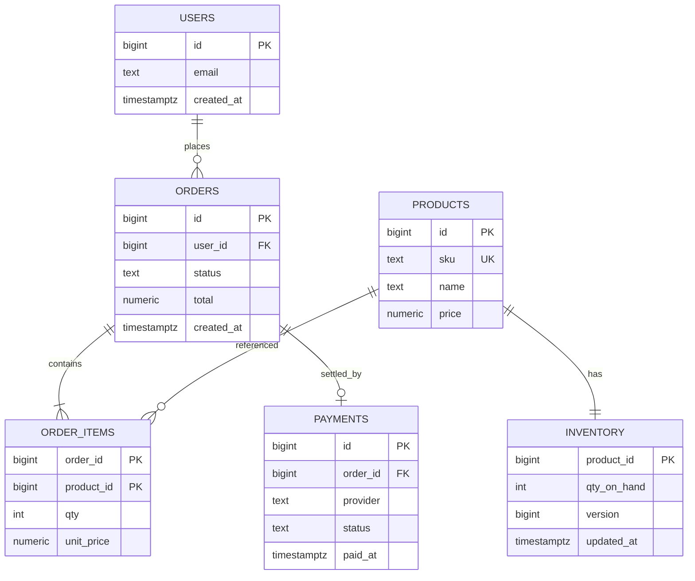
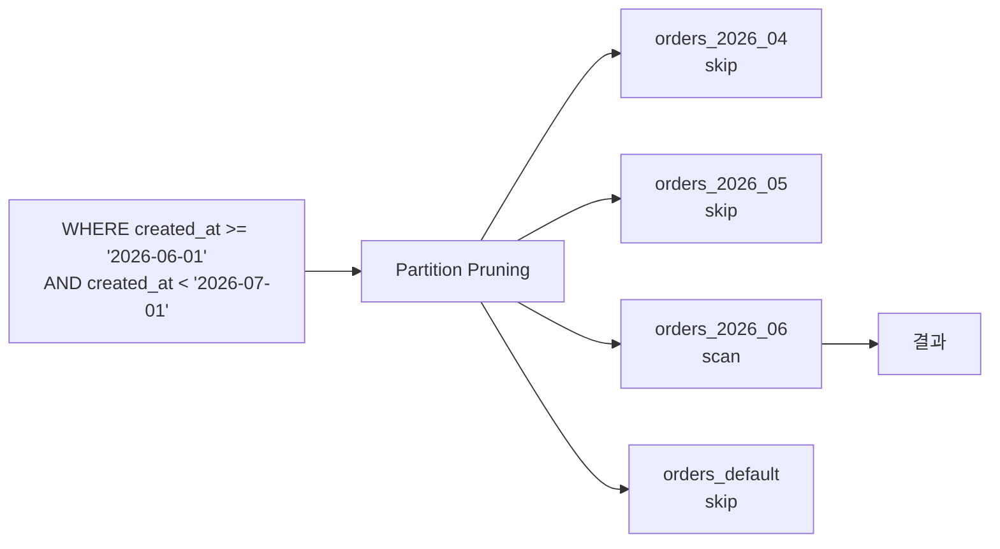
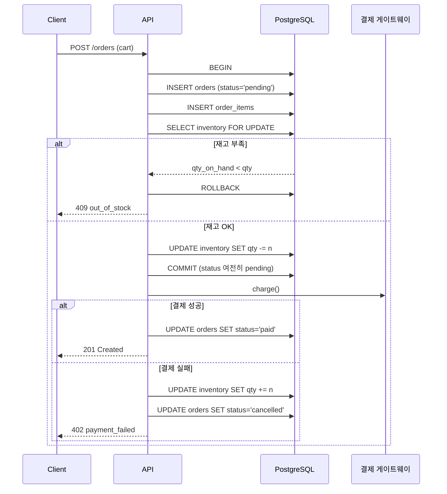

# 예제 1. E-commerce — 주문과 재고

전형적인 커머스 도메인. 상품/주문/결제/재고가 동시에 움직이고, 동일 SKU에 대한 동시 주문, 월별 매출 집계, 실시간 대시보드가 엉켜 있다. PostgreSQL의 MVCC·Lock·파티셔닝·집계 전략이 모두 필요한 종합 시나리오다.

---

## 1. 요구사항

- 상품 수 ~100만 SKU, 일일 주문 ~50만 건, 피크 시 동일 SKU로 수백 건 동시 주문
- 결제 성공 시 재고 차감 → 차감 실패 시 주문 롤백
- 주문 테이블은 5년 이상 보존, 최근 데이터 접근 편중 → 월 단위 파티션
- 대시보드: "오늘 매출", "월별/상태별 주문 수" 수 초 내 응답
- 재고는 절대 음수가 되면 안 된다 (CHECK 제약 + 동시성 제어)

---

## 2. 스키마 설계

### 2.1 ERD



### 2.2 주문 테이블 — 월 단위 파티셔닝

```sql
-- 상위 파티션 테이블 (파티션 키: created_at)
CREATE TABLE orders (
    id            bigserial,
    user_id       bigint      NOT NULL,
    status        text        NOT NULL
                  CHECK (status IN ('pending','paid','shipped','cancelled','refunded')),
    total         numeric(12,2) NOT NULL CHECK (total >= 0),
    created_at    timestamptz NOT NULL DEFAULT now(),
    updated_at    timestamptz NOT NULL DEFAULT now(),
    PRIMARY KEY (id, created_at)                  -- 파티션 키 포함 필수
) PARTITION BY RANGE (created_at);

-- 월별 파티션 (실무에선 pg_partman 권장)
CREATE TABLE orders_2026_04 PARTITION OF orders
    FOR VALUES FROM ('2026-04-01') TO ('2026-05-01');
CREATE TABLE orders_2026_05 PARTITION OF orders
    FOR VALUES FROM ('2026-05-01') TO ('2026-06-01');
CREATE TABLE orders_2026_06 PARTITION OF orders
    FOR VALUES FROM ('2026-06-01') TO ('2026-07-01');

-- 각 파티션에 로컬 인덱스
CREATE INDEX ON orders_2026_04 (user_id, created_at DESC);
CREATE INDEX ON orders_2026_04 (status) WHERE status IN ('pending','paid');
CREATE INDEX ON orders_2026_05 (user_id, created_at DESC);
CREATE INDEX ON orders_2026_05 (status) WHERE status IN ('pending','paid');

-- 기본 파티션 (예측 못한 날짜 흡수용, 운영에선 권장 안 함)
CREATE TABLE orders_default PARTITION OF orders DEFAULT;
```

파티션 구조는 다음과 같이 동작한다.



### 2.3 주문 항목 / 상품 / 재고

```sql
CREATE TABLE products (
    id          bigserial PRIMARY KEY,
    sku         text UNIQUE NOT NULL,
    name        text NOT NULL,
    price       numeric(12,2) NOT NULL CHECK (price >= 0),
    created_at  timestamptz NOT NULL DEFAULT now()
);

CREATE TABLE order_items (
    order_id    bigint NOT NULL,
    order_ts    timestamptz NOT NULL,
    product_id  bigint NOT NULL REFERENCES products(id),
    qty         int    NOT NULL CHECK (qty > 0),
    unit_price  numeric(12,2) NOT NULL CHECK (unit_price >= 0),
    PRIMARY KEY (order_id, product_id),
    FOREIGN KEY (order_id, order_ts) REFERENCES orders(id, created_at)
);
CREATE INDEX ON order_items (product_id, order_ts DESC);

-- 재고: product_id = 1행 원칙. 절대 음수 금지.
CREATE TABLE inventory (
    product_id   bigint PRIMARY KEY REFERENCES products(id),
    qty_on_hand  int     NOT NULL CHECK (qty_on_hand >= 0),
    version      bigint  NOT NULL DEFAULT 0,
    updated_at   timestamptz NOT NULL DEFAULT now()
);
```

`CHECK (qty_on_hand >= 0)`은 최후의 안전장치다. 애플리케이션 레벨 로직이 실수로 음수로 만들면 트랜잭션이 실패한다.

---

## 3. 주문 시퀀스와 동시성

### 3.1 전체 흐름



결제 호출은 외부 I/O이므로 **트랜잭션 밖**에서 수행한다. 결제 대기 중 DB 트랜잭션을 열어두면 재고 락이 수 초간 유지되어 대기열이 터진다.

### 3.2 재고 차감 — 두 가지 패턴

**패턴 A: 비관적 락 (SELECT ... FOR UPDATE)**

```sql
BEGIN;

-- 해당 상품 재고 행에 row lock
SELECT qty_on_hand
FROM   inventory
WHERE  product_id = 42
FOR UPDATE;

-- 애플리케이션 레벨에서 qty_on_hand >= 요청수량 확인 후
UPDATE inventory
SET    qty_on_hand = qty_on_hand - 3,
       updated_at  = now()
WHERE  product_id = 42;

COMMIT;
```

`FOR UPDATE`는 동일 행을 선점하려는 다른 트랜잭션을 **블록**시킨다. 핫 SKU(예: 신상품 오픈)에서는 대기열이 길어진다. 대신 "재고가 음수가 되는 race condition"은 원천 차단된다.

**패턴 B: 낙관적 락 (version 컬럼)**

```sql
-- 1. 현재 버전 조회 (락 없음)
SELECT qty_on_hand, version FROM inventory WHERE product_id = 42;
-- → qty=100, version=12

-- 2. CAS UPDATE: 버전 일치해야만 성공
UPDATE inventory
SET    qty_on_hand = qty_on_hand - 3,
       version     = version + 1,
       updated_at  = now()
WHERE  product_id = 42
  AND  version    = 12
  AND  qty_on_hand >= 3;
-- 반환 행 0: 누군가 먼저 업데이트함 → 재조회 후 재시도
```

경쟁이 적을 때 빠르다. 재시도 로직이 필수이며, 재시도 루프가 길어지면 결국 패턴 A보다 느릴 수 있다.

**선택 기준:**

| 상황 | 권장 |
|------|------|
| 상품 수 많고, 동일 SKU 경쟁 적음 | 낙관적 락 |
| 소수 핫 SKU에 동시 수백 건 | 비관적 락 (+ `SKIP LOCKED`로 큐잉) |
| 한 주문에 10개 상품 동시 차감 | 비관적 락 + `ORDER BY product_id`로 데드락 방지 |

### 3.3 데드락 방지

여러 상품을 한 트랜잭션에서 락할 때는 **항상 동일한 순서(PK 오름차순)**로 잠근다.

```sql
-- 올바른 예: product_id 오름차순으로 잠금
SELECT * FROM inventory
WHERE  product_id = ANY($1)
ORDER BY product_id
FOR UPDATE;
```

순서가 엇갈리면 `deadlock detected`가 터진다. 관련: `troubleshooting/C1_deadlock.md`.

---

## 4. 주요 쿼리 패턴

### 4.1 월별/상태별 주문 집계 (파티션 프루닝)

```sql
EXPLAIN (ANALYZE, BUFFERS)
SELECT status, count(*), sum(total)
FROM   orders
WHERE  created_at >= '2026-04-01'
  AND  created_at <  '2026-05-01'
GROUP  BY status;
```

좋은 실행 계획의 핵심 지표:

```
Append  (cost=... rows=...)
  ->  Seq Scan on orders_2026_04  (cost=...)   ← 해당 파티션만
        Filter: (created_at >= ... AND created_at < ...)
-- orders_2026_05, 06, default 은 "Subplans Removed" 로 표시
```

`Subplans Removed: N`이 보이면 파티션 프루닝이 적용된 것이다. 보이지 않으면:

- `created_at`에 함수 래핑: `date_trunc('month', created_at) = ...` → 프루닝 실패. 범위 조건으로 바꾼다.
- 파라미터 타입 불일치: `created_at >= $1` 에서 `$1`이 text면 안 됨. `timestamptz`로 캐스팅.

### 4.2 "오늘 매출" — 실시간 집계 전략

**전략 1. 기본 SUM (소량이면 충분)**

```sql
SELECT coalesce(sum(total), 0) AS today_sales
FROM   orders
WHERE  created_at >= current_date
  AND  status = 'paid';
```

오늘 파티션만 스캔. 일 10만 건 수준까지는 인덱스 없이도 1초 내.

**전략 2. Materialized View (수 분 지연 허용)**

```sql
CREATE MATERIALIZED VIEW mv_daily_sales AS
SELECT date_trunc('day', created_at) AS day,
       status,
       count(*) AS cnt,
       sum(total) AS revenue
FROM   orders
GROUP  BY 1, 2
WITH DATA;

CREATE UNIQUE INDEX ON mv_daily_sales (day, status);

-- 5분마다 갱신 (pg_cron 또는 외부 스케줄러)
REFRESH MATERIALIZED VIEW CONCURRENTLY mv_daily_sales;
```

`CONCURRENTLY`를 쓰려면 UNIQUE 인덱스가 필수. 조회 중에도 갱신이 가능하다.

**전략 3. Rollup 테이블 + 트리거 (실시간)**

```sql
CREATE TABLE daily_sales_rollup (
    day         date    PRIMARY KEY,
    cnt         bigint  NOT NULL DEFAULT 0,
    revenue     numeric(18,2) NOT NULL DEFAULT 0
);

CREATE OR REPLACE FUNCTION bump_daily_sales() RETURNS trigger AS $$
BEGIN
    IF NEW.status = 'paid' AND (OLD IS NULL OR OLD.status <> 'paid') THEN
        INSERT INTO daily_sales_rollup (day, cnt, revenue)
        VALUES (date_trunc('day', NEW.created_at)::date, 1, NEW.total)
        ON CONFLICT (day) DO UPDATE
            SET cnt = daily_sales_rollup.cnt + 1,
                revenue = daily_sales_rollup.revenue + EXCLUDED.revenue;
    END IF;
    RETURN NEW;
END $$ LANGUAGE plpgsql;

CREATE TRIGGER trg_bump_daily_sales
AFTER INSERT OR UPDATE OF status ON orders
FOR EACH ROW EXECUTE FUNCTION bump_daily_sales();
```

모든 커밋에 트리거가 동작하므로 쓰기 처리량이 피크인 시스템에선 부담이 있다. 경쟁이 심할 때는 `daily_sales_rollup` 행에 락 경합이 생기므로 **일자별이 아닌 시간대별 샤드 키**로 분산하는 것을 고려한다.

### 4.3 사용자의 최근 주문 조회

```sql
SELECT id, status, total, created_at
FROM   orders
WHERE  user_id = $1
  AND  created_at >= now() - interval '90 days'
ORDER  BY created_at DESC
LIMIT  20;
```

`orders_YYYY_MM (user_id, created_at DESC)` 로컬 인덱스가 있으면 최근 3개 파티션만 탐색한다.

---

## 5. 운영 포인트

### 5.1 VACUUM과 Bloat

주문은 `pending → paid → shipped`로 `UPDATE`가 빈번하다. MVCC 특성상 UPDATE는 **새 버전 tuple을 append + 기존 tuple을 dead로 표시**한다. HOT 업데이트 조건(인덱스 컬럼 미변경, 페이지 여유)이 맞지 않으면 인덱스까지 재작성되어 Bloat가 빠르게 쌓인다.

```sql
-- 인덱스 컬럼(status)이 자주 변하는 테이블은 fillfactor를 낮춤
ALTER TABLE orders_2026_04 SET (fillfactor = 80);

-- 자주 UPDATE되는 파티션만 autovacuum 공격적으로
ALTER TABLE orders_2026_04 SET (
    autovacuum_vacuum_scale_factor = 0.02,
    autovacuum_vacuum_cost_limit   = 2000
);
```

과거 월 파티션(변경 없음)은 Bloat이 안 생기므로 개별 튜닝 불필요.

### 5.2 오래된 주문 정리

5년 정책이면 60개월 파티션 유지. 가장 오래된 파티션을 DROP하거나 DETACH → 아카이브.

```sql
-- DELETE는 절대 쓰지 않는다. 대량 삭제는 Bloat를 만든다.
ALTER TABLE orders DETACH PARTITION orders_2021_04;
-- S3 등으로 pg_dump 후
DROP TABLE orders_2021_04;
```

DETACH가 DROP보다 안전하다. 덤프 확인 후 DROP한다.

### 5.3 백업

- 전체: `pg_basebackup` 야간 주 1회 + WAL archiving 상시
- 논리 백업: 파티션 단위 `pg_dump -t orders_2026_04`
- PITR: `recovery_target_time '2026-04-24 10:30:00 KST'` 테스트 분기 구축

### 5.4 모니터링 포인트

```sql
-- 파티션별 행 수 / 크기
SELECT relname,
       pg_size_pretty(pg_total_relation_size(oid)) AS size,
       reltuples::bigint AS approx_rows
FROM   pg_class
WHERE  relname LIKE 'orders_2026%'
ORDER  BY relname;

-- Lock 대기 중인 주문 세션
SELECT pid, usename, wait_event_type, wait_event, query_start, state,
       substring(query,1,120) AS query
FROM   pg_stat_activity
WHERE  wait_event_type = 'Lock'
ORDER  BY query_start;

-- 재고 테이블 bloat 추정
SELECT n_live_tup, n_dead_tup,
       round(n_dead_tup::numeric / nullif(n_live_tup,0), 3) AS dead_ratio
FROM   pg_stat_user_tables
WHERE  relname = 'inventory';
```

### 5.5 흔한 실수

| 실수 | 증상 | 해결 |
|------|------|------|
| 결제 호출을 BEGIN...COMMIT 내부에서 | 수 초간 재고 락 → 대기열 폭주 | 결제는 트랜잭션 바깥 |
| `DELETE FROM orders WHERE created_at < ...` | Autovacuum이 못 쫓아감, Bloat | 파티션 DROP |
| 여러 상품 락 순서 불일치 | deadlock detected | `ORDER BY product_id FOR UPDATE` |
| `CHECK (qty_on_hand >= 0)` 미설정 | 애플리케이션 버그로 재고 음수 | CHECK 제약 필수 |
| `REFRESH MATERIALIZED VIEW` (not CONCURRENTLY) | 조회 블록 | UNIQUE 인덱스 + CONCURRENTLY |

---

## 6. 관련 챕터

- [3장. MVCC](../chapters/ch03_mvcc.md) — UPDATE에서 왜 Bloat가 생기는지
- [5장. 인덱스](../chapters/ch05_indexes.md) — 부분 인덱스, 멀티컬럼 인덱스 설계
- [7장. 트랜잭션과 격리](../chapters/ch07_transactions_isolation.md) — FOR UPDATE, SKIP LOCKED, Deadlock
- [8장. VACUUM](../chapters/ch08_vacuum_autovacuum.md) — fillfactor, autovacuum 튜닝
- [12장. 파티셔닝](../chapters/ch12_partitioning.md) — Declarative Partitioning, Partition Pruning
- [troubleshooting/C1 Deadlock](../troubleshooting/C1_deadlock.md)
- [troubleshooting/A1 Bloat 누적](../troubleshooting/A1_bloat_accumulation.md)
- [cheatsheets/pg_stat_queries.md](../cheatsheets/pg_stat_queries.md) — Lock/Bloat 진단 쿼리
