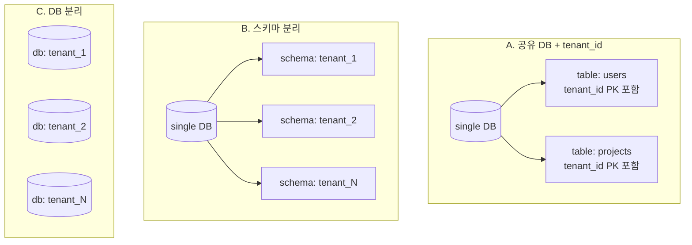
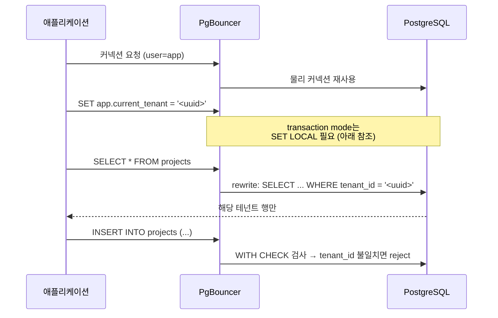
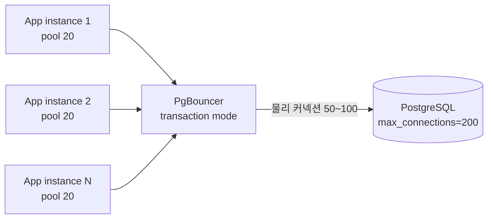

# 예제 2. SaaS 멀티테넌시

SaaS는 "한 DB에 수백~수만 고객사(tenant)를 동시에 수용"하는 구조다. 데이터 격리, 성능 격리, 스키마 진화, 커넥션 관리가 모두 걸린다. PostgreSQL에서 멀티테넌시를 구현하는 3가지 패턴을 비교하고, 가장 널리 쓰이는 **공유 DB + RLS** 패턴을 실무 수준으로 설계한다.

---

## 1. 요구사항

- 고객사(tenant) 수 수백 ~ 수천, 1%의 대형 고객이 전체 트래픽의 70% 차지
- 테넌트 간 데이터가 **절대 섞이면 안 된다** (법적/보안 요구)
- 스키마 변경은 모든 테넌트에 동시 반영
- 대형 테넌트 쿼리가 작은 테넌트를 블록하지 않아야 함
- 테넌트 삭제 (GDPR) 요청 시 해당 데이터 전부 제거

---

## 2. 3가지 전략 비교



| 항목 | A. 공유 DB + tenant_id | B. 스키마 분리 | C. DB 분리 |
|------|----------------------|----------------|-----------|
| 테넌트 수 확장 | 수만 | 수백 (catalog 부담) | 수십 |
| 스키마 변경 | 1회 DDL로 끝 | 모든 스키마에 반복 | 모든 DB에 반복 |
| 격리 강도 | RLS로 격리 | 강 | 최강 |
| 대형 테넌트 영향 | 인덱스/통계 공유로 영향 있음 | 낮음 | 없음 |
| 커넥션 수 | 적음 | 적음 | 테넌트 × 풀 → 폭증 |
| 백업/복구 단위 | 전체 또는 행 수준 (pg_dump --table) | 스키마 단위 | DB 단위 (쉬움) |
| 삭제 요청 대응 | DELETE (Bloat 주의) | DROP SCHEMA (빠름) | DROP DATABASE |
| 요금제/격리 SLA 차등 | 어려움 | 가능 | 자연스러움 |

**일반 가이드:**
- 작은 테넌트 다수 + SaaS 무료/프로 티어: **A. 공유 DB + RLS**
- 대형 B2B + 기업별 SLA: **B. 스키마 분리** 또는 A+B 혼합(대형은 B, 나머지는 A)
- 금융/헬스케어 + 별도 인스턴스 요구: **C. DB 분리**

---

## 3. 공유 DB + tenant_id + RLS 설계

### 3.1 스키마

```sql
-- 테넌트 메타
CREATE TABLE tenants (
    id          uuid PRIMARY KEY DEFAULT gen_random_uuid(),
    slug        text UNIQUE NOT NULL,
    plan        text NOT NULL CHECK (plan IN ('free','pro','enterprise')),
    created_at  timestamptz NOT NULL DEFAULT now()
);

-- 도메인 테이블: tenant_id를 PK 선두에 둔다
CREATE TABLE users (
    tenant_id   uuid NOT NULL REFERENCES tenants(id),
    id          uuid NOT NULL DEFAULT gen_random_uuid(),
    email       citext NOT NULL,
    role        text NOT NULL,
    created_at  timestamptz NOT NULL DEFAULT now(),
    PRIMARY KEY (tenant_id, id),
    UNIQUE (tenant_id, email)
);

CREATE TABLE projects (
    tenant_id   uuid NOT NULL REFERENCES tenants(id),
    id          uuid NOT NULL DEFAULT gen_random_uuid(),
    owner_id    uuid NOT NULL,
    name        text NOT NULL,
    created_at  timestamptz NOT NULL DEFAULT now(),
    PRIMARY KEY (tenant_id, id),
    FOREIGN KEY (tenant_id, owner_id) REFERENCES users(tenant_id, id)
);

CREATE TABLE events (
    tenant_id   uuid NOT NULL,
    id          bigserial,
    project_id  uuid NOT NULL,
    kind        text NOT NULL,
    payload     jsonb NOT NULL,
    created_at  timestamptz NOT NULL DEFAULT now(),
    PRIMARY KEY (tenant_id, id),
    FOREIGN KEY (tenant_id, project_id) REFERENCES projects(tenant_id, id)
);
```

핵심 원칙:
1. **tenant_id는 모든 PK의 선두 컬럼**. 이렇게 해야 인덱스와 외래키가 테넌트 경계를 따라 자연스럽게 구성된다.
2. **FK도 (tenant_id, id)로 복합 참조**. 한 테넌트 행이 다른 테넌트 행을 참조하는 실수를 원천 차단한다.

### 3.2 인덱스 설계

```sql
-- 거의 모든 인덱스는 tenant_id로 시작
CREATE INDEX ON projects (tenant_id, created_at DESC);
CREATE INDEX ON events (tenant_id, project_id, created_at DESC);
CREATE INDEX ON events (tenant_id, created_at DESC);

-- 전역 탐색이 필요한 경우만 tenant_id 없이
CREATE INDEX ON users (email);   -- 로그인 초기 단계, tenant_id 확정 전
```

tenant_id가 없는 쿼리는 수천 테넌트의 데이터를 가로지르는 풀 스캔이 된다. 모든 일반 쿼리에는 반드시 `WHERE tenant_id = ?`가 들어가야 한다.

### 3.3 Row-Level Security (RLS)

RLS는 "SQL에 조건을 빠뜨려도 PostgreSQL이 강제로 필터링"해 주는 안전망이다.

```sql
-- 테이블 단위로 RLS 활성화
ALTER TABLE users    ENABLE ROW LEVEL SECURITY;
ALTER TABLE projects ENABLE ROW LEVEL SECURITY;
ALTER TABLE events   ENABLE ROW LEVEL SECURITY;

-- 슈퍼유저/복제계정은 RLS 우회 (주의해서 사용)
ALTER TABLE users    FORCE ROW LEVEL SECURITY;
ALTER TABLE projects FORCE ROW LEVEL SECURITY;
ALTER TABLE events   FORCE ROW LEVEL SECURITY;

-- 세션별 GUC로 현재 테넌트 주입
-- 애플리케이션이 커넥션 획득 직후 실행:
--   SET app.current_tenant = '<uuid>';

CREATE POLICY tenant_isolation_users ON users
    USING (tenant_id::text = current_setting('app.current_tenant', true));

CREATE POLICY tenant_isolation_projects ON projects
    USING (tenant_id::text = current_setting('app.current_tenant', true));

CREATE POLICY tenant_isolation_events ON events
    USING (tenant_id::text = current_setting('app.current_tenant', true))
    WITH CHECK (tenant_id::text = current_setting('app.current_tenant', true));
```

`USING`은 SELECT/UPDATE/DELETE가 **볼 수 있는** 행을, `WITH CHECK`는 INSERT/UPDATE가 **쓸 수 있는** 행을 각각 제한한다.

### 3.4 RLS 동작 흐름



### 3.5 PgBouncer + RLS의 함정

PgBouncer를 **transaction mode**로 쓰면 한 클라이언트 세션이 여러 백엔드를 오가므로 `SET app.current_tenant` 같은 **세션 GUC가 다음 쿼리에 없을 수 있다**. 해결책은 두 가지다.

1. 매 트랜잭션 시작 시 `SET LOCAL`:
    ```sql
    BEGIN;
    SET LOCAL app.current_tenant = '<uuid>';
    SELECT ... ;
    COMMIT;
    ```
    `SET LOCAL`은 현재 트랜잭션 종료까지만 유효하므로 PgBouncer가 백엔드를 회수해도 안전하다.

2. 랩퍼 함수:
    ```sql
    CREATE FUNCTION set_tenant(t uuid) RETURNS void AS $$
        SELECT set_config('app.current_tenant', t::text, true);  -- local=true
    $$ LANGUAGE sql;
    ```
    `set_config('...', '...', true)`는 `SET LOCAL`과 같다.

애플리케이션 프레임워크에서 "커넥션 획득 → BEGIN → set_tenant() → 쿼리 → COMMIT" 사이클을 표준화해야 한다.

---

## 4. 주요 쿼리 패턴

### 4.1 테넌트 스코프 쿼리 (EXPLAIN 확인)

```sql
EXPLAIN (ANALYZE, BUFFERS)
SELECT id, name, created_at
FROM   projects
WHERE  tenant_id = '11111111-1111-1111-1111-111111111111'
ORDER  BY created_at DESC
LIMIT  50;
```

이상적인 플랜:

```
Limit
  ->  Index Scan Backward using projects_tenant_id_created_at_idx on projects
        Index Cond: (tenant_id = '...')
```

RLS USING 절이 붙었더라도 `tenant_id = <const>` 형태로 전개되므로 인덱스를 탄다. 만약 `Seq Scan`이 나오면:

- `current_setting('app.current_tenant', true)`가 NULL이어서 전체 행이 false로 걸러지는 경우도 있다. (NULL 안전하게 짜야 한다.)
- 작은 테넌트는 통계상 Seq Scan이 더 싸다고 판단될 수 있다 — 정상.

### 4.2 상위 테넌트 순위 (관리자용)

```sql
-- 관리자 계정 (BYPASSRLS) 또는 POLICY 명시적 제외
SELECT tenant_id, count(*) AS events_30d
FROM   events
WHERE  created_at >= now() - interval '30 days'
GROUP  BY tenant_id
ORDER  BY events_30d DESC
LIMIT  20;
```

관리자용 계정은 `ALTER ROLE admin BYPASSRLS;`로 RLS를 우회시킨다. 단, 이 권한은 신중히 관리한다.

### 4.3 테넌트 삭제 (GDPR)

```sql
-- 1. 큰 이벤트 테이블은 배치 삭제 (한 번에 NxNNN만 건 DELETE는 위험)
DO $$
DECLARE
    victim uuid := '11111111-1111-1111-1111-111111111111';
    deleted int;
BEGIN
    LOOP
        DELETE FROM events
        WHERE  tenant_id = victim
          AND  ctid IN (
              SELECT ctid FROM events WHERE tenant_id = victim LIMIT 10000
          );
        GET DIAGNOSTICS deleted = ROW_COUNT;
        EXIT WHEN deleted = 0;
        COMMIT;  -- autonomous batch
    END LOOP;
END $$;

-- 2. 자식 테이블부터 위로
DELETE FROM projects WHERE tenant_id = '11111111-...';
DELETE FROM users    WHERE tenant_id = '11111111-...';
DELETE FROM tenants  WHERE id        = '11111111-...';
```

대용량 테넌트라면 B. 스키마 분리 또는 파티션 분리 구조가 훨씬 유리하다. `DROP SCHEMA tenant_NN CASCADE;` 한 번이면 끝나고 Bloat도 없다.

---

## 5. 운영 포인트

### 5.1 Connection Pooling



- 테넌트 수 × 사용자 수에 비례한 애플리케이션 풀을 **그대로 DB에 꽂으면 파괴적**이다. PgBouncer의 transaction mode로 모아서 물리 커넥션 수를 100 이하로 유지한다.
- PostgreSQL의 `max_connections`는 200~300 이상 올리지 않는다. 각 연결당 ~10MB+ 메모리가 소모된다.

### 5.2 통계와 플래너의 함정

- 대형 테넌트가 전체 데이터의 70%인데, 작은 테넌트 쿼리에도 "평균적인" 통계가 적용되어 Bitmap Scan을 잘못 고르는 경우가 있다.
- `ALTER TABLE events ALTER COLUMN tenant_id SET STATISTICS 10000;`으로 tenant_id 컬럼의 히스토그램/MCV 수를 늘린다. 그러면 플래너가 "이 테넌트는 10만 행, 저 테넌트는 100행"을 구분해 더 좋은 플랜을 짠다.

### 5.3 스키마 마이그레이션

- 공유 DB 방식의 최대 이점: `ALTER TABLE projects ADD COLUMN archived_at timestamptz;` 한 줄이면 모든 테넌트에 적용.
- 단, **큰 테이블에 NOT NULL + DEFAULT 추가**는 13 이후에도 쓰기 락과 rewrite가 발생할 수 있다. 단계를 나눈다.
    1. `ADD COLUMN archived_at timestamptz NULL;` (메타데이터만)
    2. 배치로 기존 행 채우기
    3. `ALTER TABLE ... SET NOT NULL;` (전체 확인 스캔)

### 5.4 대형 테넌트 격리 전략 (A+B 혼합)

```sql
-- 대형 테넌트만 별도 스키마 + 같은 풀로 접근
CREATE SCHEMA tenant_big;
CREATE TABLE tenant_big.events (...) ;

-- search_path를 플랜별로 스위칭
SET search_path = tenant_big, public;
```

또는 대형 테넌트의 이벤트를 `events` 테이블에 그대로 두되, `tenant_id`로 LIST 파티셔닝한다.

```sql
CREATE TABLE events (
    tenant_id uuid, id bigserial, ...
) PARTITION BY LIST (tenant_id);

CREATE TABLE events_big PARTITION OF events FOR VALUES IN ('<big-uuid>');
CREATE TABLE events_default PARTITION OF events DEFAULT;
```

### 5.5 백업 전략

- 전체: `pg_basebackup` + WAL archiving
- 테넌트 단위 추출: `pg_dump -t events` 후 애플리케이션 레벨 필터 (또는 스키마 분리 방식에선 `pg_dump -n tenant_big`)
- 특정 테넌트 복원: 별도 인스턴스에 전체 PITR 후 COPY로 추출이 일반적 — 운영 DB 인라인 복원은 피한다.

### 5.6 흔한 실수

| 실수 | 증상 | 해결 |
|------|------|------|
| RLS 없이 tenant_id 조건을 애플리케이션에만 의존 | 버그 하나로 전체 테넌트 유출 | RLS 강제 |
| PK에 tenant_id 누락 | 인덱스 비효율, FK 복합화 불가 | 모든 PK 선두에 tenant_id |
| PgBouncer transaction mode + `SET`(비 LOCAL) | 다음 쿼리가 다른 테넌트로 | `SET LOCAL` 또는 `set_config(..., true)` |
| 대량 DELETE로 테넌트 삭제 | Bloat, Autovacuum 지연 | 배치 + 파티션/스키마 분리 검토 |
| 테넌트 수가 수천인데 스키마 분리 채택 | pg_catalog 비대, pg_dump 느림 | 공유 DB + RLS로 재설계 |

---

## 6. 관련 챕터

- [5장. 인덱스](../chapters/ch05_indexes.md) — 멀티컬럼 인덱스와 선두 컬럼
- [7장. 트랜잭션과 격리](../chapters/ch07_transactions_isolation.md) — SET LOCAL, 트랜잭션 경계
- [12장. 파티셔닝](../chapters/ch12_partitioning.md) — LIST 파티셔닝으로 대형 테넌트 격리
- [13장. 확장](../chapters/ch13_extensions.md) — `pgaudit`, `pg_stat_statements` 테넌트별 상위 쿼리 추적
- [14장. 모니터링](../chapters/ch14_monitoring_troubleshooting.md) — Connection, Lock, pg_stat_activity
- [troubleshooting/D1 Connection 고갈](../troubleshooting/D1_connection_exhaustion.md)
- [cheatsheets/config_parameters.md](../cheatsheets/config_parameters.md) — max_connections, shared_buffers
