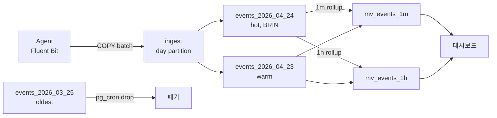

# 예제 3. 시계열 로그/메트릭

초당 수천 건의 이벤트를 수집하고, 최근 데이터는 자주 조회, 오래된 데이터는 주기적으로 폐기. PostgreSQL의 **BRIN 인덱스 + 파티셔닝 + Materialized View** 조합으로 대규모 시계열을 운영한다. 전용 엔진(TimescaleDB, ClickHouse)이 아니어도 수억 행까지는 충분히 감당된다.

---

## 1. 요구사항

- 초당 ~3,000 이벤트 (피크 10,000), 일 ~3억 행
- 보존: 30일, 그 이후 자동 폐기
- 주 쿼리: "최근 1시간 특정 서비스 ERROR 로그", 분/시 단위 집계 대시보드
- payload는 JSON이며 스키마가 자주 진화함
- 수집 측은 배치 INSERT 가능 (COPY 허용)

---

## 2. 전체 파이프라인



---

## 3. 스키마 설계

### 3.1 상위 파티션 테이블 — 일 단위 RANGE 파티션

```sql
CREATE TABLE events (
    ts          timestamptz NOT NULL,
    service     text        NOT NULL,
    level       text        NOT NULL
                  CHECK (level IN ('DEBUG','INFO','WARN','ERROR','FATAL')),
    host        text        NOT NULL,
    trace_id    text,
    payload     jsonb       NOT NULL,
    PRIMARY KEY (ts, service)        -- 파티션 키 포함 필수, 실무에선 id 추가 고려
) PARTITION BY RANGE (ts);

-- 파티션은 pg_partman으로 자동 생성 권장. 수동 예시:
CREATE TABLE events_2026_04_24 PARTITION OF events
    FOR VALUES FROM ('2026-04-24') TO ('2026-04-25');
CREATE TABLE events_2026_04_23 PARTITION OF events
    FOR VALUES FROM ('2026-04-23') TO ('2026-04-24');
```

### 3.2 인덱스 — BRIN을 중심으로

시계열은 `ts`가 **물리 저장 순서와 거의 일치**한다. B-tree는 인덱스만 수십 GB를 차지하지만, BRIN은 수 MB로 같은 스캔 효율을 낸다.

```sql
-- BRIN on ts (매 파티션)
CREATE INDEX ON events_2026_04_24 USING brin (ts) WITH (pages_per_range = 32);

-- service, level로 자주 필터 → 부분 B-tree
CREATE INDEX ON events_2026_04_24 (service, ts DESC)
    WHERE level IN ('ERROR','FATAL');

-- payload 검색용 GIN (jsonb_path_ops: 인덱스 크기 작고 @> 전용)
CREATE INDEX ON events_2026_04_24 USING gin (payload jsonb_path_ops);

-- trace_id로 분산 추적 역조회
CREATE INDEX ON events_2026_04_24 (trace_id) WHERE trace_id IS NOT NULL;
```

**BRIN의 함정**: 데이터가 삽입 순서(= ts 순서)와 다르게 들어오면 BRIN의 min/max 범위가 넓어져 효과가 사라진다. 로그처럼 append-only라면 이상적이다. `pages_per_range`는 16~128 사이에서 튜닝한다.

### 3.3 파티션 수명 관리


```sql
-- pg_cron: 매일 파티션 만들고 오래된 것 제거
SELECT cron.schedule('create_tomorrow_partition', '0 1 * * *', $$
    DO $b$
    DECLARE
        d date := (current_date + 1);
        part text := 'events_' || to_char(d, 'YYYY_MM_DD');
    BEGIN
        EXECUTE format($f$
            CREATE TABLE IF NOT EXISTS %I PARTITION OF events
            FOR VALUES FROM (%L) TO (%L);
            CREATE INDEX IF NOT EXISTS %I ON %I USING brin(ts) WITH (pages_per_range = 32);
            CREATE INDEX IF NOT EXISTS %I ON %I USING gin(payload jsonb_path_ops);
        $f$, part, d, d + 1,
           part || '_brin', part,
           part || '_payload_gin', part);
    END $b$;
$$);

-- 30일 지난 파티션 DROP
SELECT cron.schedule('drop_old_partition', '0 2 * * *', $$
    DO $b$
    DECLARE
        part text;
    BEGIN
        FOR part IN
            SELECT c.relname
            FROM pg_inherits i
            JOIN pg_class   c ON c.oid = i.inhrelid
            JOIN pg_class   p ON p.oid = i.inhparent
            WHERE p.relname = 'events'
              AND c.relname < 'events_' || to_char(current_date - 30, 'YYYY_MM_DD')
        LOOP
            EXECUTE format('DROP TABLE %I', part);
        END LOOP;
    END $b$;
$$);
```

DROP은 순간 완료되며 VACUUM 부담도 없다. **DELETE로 30일치를 지우면** 수억 건의 dead tuple + autovacuum 폭주로 수 시간 장애가 난다.

---

## 4. 대량 수집

### 4.1 COPY가 왕도

```sql
-- 에이전트는 TSV/CSV 또는 바이너리로 COPY
COPY events (ts, service, level, host, trace_id, payload)
FROM STDIN WITH (FORMAT csv, HEADER false);
```

COPY는 `INSERT ... VALUES (...),(...)`보다 **10~20배 빠르다**. WAL도 적게 쓴다.

### 4.2 Multi-row INSERT (ORM 호환)

COPY를 못 쓰는 언어/드라이버는 multi-row INSERT:

```sql
INSERT INTO events (ts, service, level, host, payload) VALUES
    ('2026-04-24 10:00:00+09', 'api', 'INFO',  'h1', '{"k":1}'),
    ('2026-04-24 10:00:00+09', 'api', 'ERROR', 'h1', '{"k":2}'),
    ...  -- 500~1000건 묶음
;
```

단건 INSERT 대비 5~10배 향상. 1000건 이상으로 묶어도 크게 늘지 않는다.

### 4.3 Autovacuum 튜닝

INSERT-only 테이블이어도 `autoanalyze`는 필요하다 (플래너 통계 갱신). 13+는 `autovacuum_vacuum_insert_scale_factor`가 있어 insert-only도 vacuum 대상이 된다 → Freeze와 Visibility Map 유지.

```sql
-- 큰 파티션만 공격적 autoanalyze
ALTER TABLE events SET (
    autovacuum_analyze_scale_factor      = 0.02,
    autovacuum_vacuum_insert_scale_factor = 0.05,
    autovacuum_vacuum_cost_limit         = 2000
);
```

---

## 5. 주요 쿼리

### 5.1 최근 1시간 ERROR 로그

```sql
EXPLAIN (ANALYZE, BUFFERS)
SELECT ts, service, host, payload
FROM   events
WHERE  ts >= now() - interval '1 hour'
  AND  level = 'ERROR'
  AND  service = 'payment-api'
ORDER  BY ts DESC
LIMIT  100;
```

이상적인 플랜:

```
Limit
  ->  Append
        ->  Index Scan using events_2026_04_24_service_level_idx on events_2026_04_24
              Index Cond: ((service = 'payment-api') AND (level IN ('ERROR','FATAL')))
              Filter: (ts >= now() - '01:00:00')
```

오늘 파티션의 **부분 인덱스**(`WHERE level IN ('ERROR','FATAL')`)를 탄다. 전체 인덱스 크기가 작아 훨씬 빠르다.

### 5.2 payload jsonb 검색 (GIN)

```sql
-- user_id=123을 포함한 이벤트
SELECT ts, service, payload
FROM   events
WHERE  ts >= current_date
  AND  payload @> '{"user_id": 123}';
```

`jsonb_path_ops` GIN이 `@>` 연산을 가속한다. 반면 `payload->>'user_id' = '123'`은 GIN을 못 타므로, 자주 쓰는 key는 **Expression Index**를 추가한다.

```sql
CREATE INDEX ON events_2026_04_24 ((payload->>'user_id'));
```

### 5.3 시간 범위 스캔 — BRIN의 힘

```sql
SELECT count(*), avg((payload->>'latency_ms')::int) AS avg_latency
FROM   events
WHERE  ts >= '2026-04-24 09:00:00+09'
  AND  ts <  '2026-04-24 10:00:00+09'
  AND  service = 'api';
```

BRIN은 "ts 9~10시에 해당하는 block 범위"만 뽑아 나머지를 건너뛴다. 오늘 파티션(수천만 행) 중 수 MB만 읽는다.

### 5.4 Trace ID 분산 추적

```sql
SELECT ts, service, level, payload
FROM   events
WHERE  ts >= now() - interval '1 day'   -- 파티션 프루닝 유도
  AND  trace_id = 'abc-123-def-456'
ORDER  BY ts;
```

`trace_id`에 부분 B-tree가 있으면 각 파티션에서 직접 조회. **ts 조건 없이 trace_id만** 걸면 30일치 전 파티션을 훑게 되므로 반드시 범위를 같이 준다.

---

## 6. 집계 — Materialized View + pg_cron

### 6.1 분 단위 rollup

```sql
CREATE MATERIALIZED VIEW mv_events_1m AS
SELECT date_trunc('minute', ts) AS bucket,
       service,
       level,
       count(*) AS cnt,
       count(*) FILTER (WHERE level IN ('ERROR','FATAL')) AS errors
FROM   events
WHERE  ts >= now() - interval '2 day'
GROUP  BY 1, 2, 3
WITH NO DATA;

CREATE UNIQUE INDEX ON mv_events_1m (bucket, service, level);
CREATE INDEX ON mv_events_1m (bucket DESC, service);

-- 매 분 CONCURRENTLY 갱신
SELECT cron.schedule('refresh_mv_1m', '* * * * *',
    'REFRESH MATERIALIZED VIEW CONCURRENTLY mv_events_1m');
```

단점: `REFRESH`는 매번 **전체 집계 재계산**이다. 데이터 범위가 크면 "증분 집계 테이블 + 트리거" 방식이 더 현실적이다.

### 6.2 증분 집계 (연속 집계)

```sql
CREATE TABLE agg_events_1m (
    bucket  timestamptz,
    service text,
    level   text,
    cnt     bigint,
    errors  bigint,
    PRIMARY KEY (bucket, service, level)
);

-- 매 분 직전 1분 구간만 upsert
INSERT INTO agg_events_1m (bucket, service, level, cnt, errors)
SELECT date_trunc('minute', ts), service, level,
       count(*), count(*) FILTER (WHERE level IN ('ERROR','FATAL'))
FROM   events
WHERE  ts >= date_trunc('minute', now()) - interval '1 minute'
  AND  ts <  date_trunc('minute', now())
GROUP  BY 1, 2, 3
ON CONFLICT (bucket, service, level) DO UPDATE
    SET cnt = EXCLUDED.cnt, errors = EXCLUDED.errors;
```

pg_cron으로 매 분 돌리면 "직전 1분치"만 집계한다. 뒤늦게 도착하는 이벤트를 허용하려면 범위를 `-5 minute ~ -1 minute`처럼 늘린다.

---

## 7. TimescaleDB와 비교

| 항목 | 기본 PostgreSQL | TimescaleDB |
|------|----------------|-------------|
| 파티션 관리 | 수동/pg_partman/pg_cron | `create_hypertable` 한 줄 |
| 보존 정책 | pg_cron + DROP | `add_retention_policy` |
| 연속 집계 | MV + cron / 트리거 | `CREATE MATERIALIZED VIEW ... WITH (timescaledb.continuous)` |
| 압축 | 없음 (TOAST 간접) | 네이티브 columnar 압축 |
| 쿼리 최적화 | 파티션 프루닝 | 추가 chunk 메타 최적화 |

수억 행 이상, 다수 팀이 사용, 압축이 중요하면 TimescaleDB로 이사 고려. 수십억 행 이상이거나 분석 비중이 크면 ClickHouse가 더 맞다.

---

## 8. 운영 포인트

### 8.1 파티션 수 상한

- 한 번의 쿼리에 프루닝 후 접근하는 파티션 수는 수십 이하가 적정.
- 전체 파티션 수는 수천까지 가능하지만, `pg_class`/`pg_inherits` 메타가 커져 플래너가 느려진다.
- 30일 × 1일 파티션 = 30개. 이상적.

### 8.2 shared_buffers와 WAL

- 시계열은 write-heavy. `shared_buffers = RAM × 25%`, `max_wal_size = 16GB`부터 시작.
- `synchronous_commit = off` 허용 가능하면(비정상 종료 시 수 초 로그 손실 허용) **쓰기 처리량 2~5배 향상**.
- `wal_compression = on`은 CPU 여유가 있으면 디스크/네트워크 절감.

### 8.3 백업

- 원본 events 테이블은 30일치라 `pg_basebackup`이 무난. WAL archiving 필수.
- 집계 테이블(`agg_events_1m`)은 별도 `pg_dump`로 백업 가능.
- 영구 보관이 필요한 과거 데이터는 DETACH 후 COPY TO로 S3/Parquet 변환이 현실적.

### 8.4 흔한 실수

| 실수 | 증상 | 해결 |
|------|------|------|
| 큰 events 테이블에 B-tree on ts | 인덱스 수십 GB, WAL 폭증 | BRIN으로 전환 |
| DELETE로 30일 이전 삭제 | Dead tuple 폭증, 장기 VACUUM | 파티션 DROP |
| `WHERE date_trunc('day', ts) = '2026-04-24'` | 파티션 프루닝 실패 | 범위 조건으로 |
| trace_id만으로 조회 | 30개 파티션 풀 스캔 | ts 범위 동반 |
| `REFRESH MATERIALIZED VIEW` (non-concurrent) | 조회 블록, 초당 이벤트 적체 | UNIQUE 인덱스 + CONCURRENTLY, 또는 증분 집계 |
| GIN on full `jsonb` (`jsonb_ops`) | 인덱스 크기 2~3배 | `@>` 위주면 `jsonb_path_ops` |

---

## 9. 관련 챕터

- [4장. Heap, Tuple, Page, TOAST](../chapters/ch04_storage_tuples_toast.md) — jsonb와 TOAST
- [5장. 인덱스](../chapters/ch05_indexes.md) — BRIN/GIN/부분 인덱스
- [8장. VACUUM](../chapters/ch08_vacuum_autovacuum.md) — insert-only 워크로드의 autovacuum
- [9장. WAL·Checkpoint](../chapters/ch09_wal_checkpoint.md) — 대량 INSERT의 WAL, checkpoint_timeout
- [12장. 파티셔닝](../chapters/ch12_partitioning.md) — RANGE 파티션, pg_partman
- [13장. 확장](../chapters/ch13_extensions.md) — pg_cron, pg_partman, TimescaleDB
- [cheatsheets/vacuum_tuning.md](../cheatsheets/vacuum_tuning.md)
- [cheatsheets/index_selection.md](../cheatsheets/index_selection.md)
