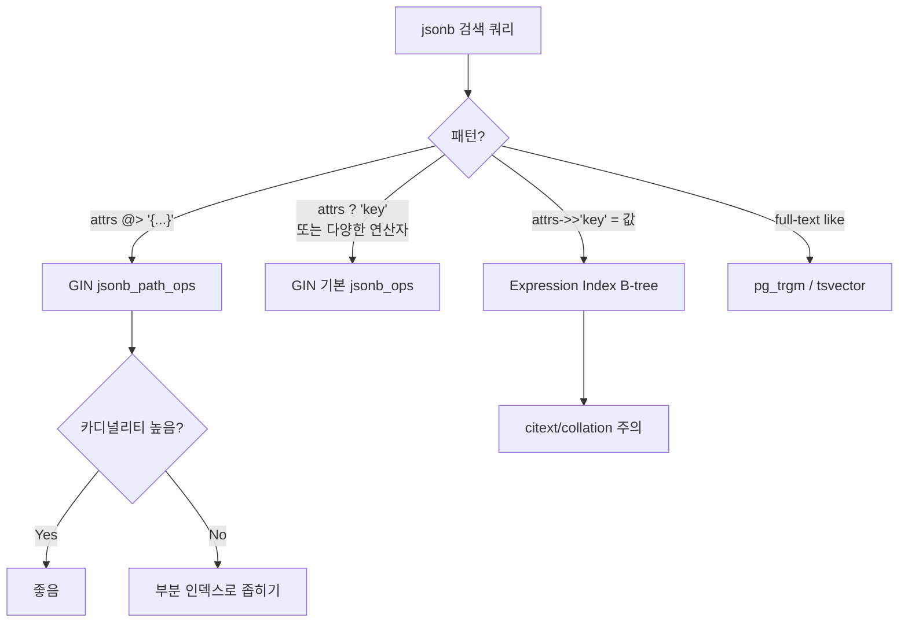

# 예제 4. JSONB 문서 저장소

PostgreSQL의 `jsonb`는 "스키마 유연성이 필요한 필드"를 관계형 위에 얹는 가장 합리적인 선택이다. MongoDB 수준의 표현력과 관계형의 트랜잭션/조인을 동시에 쓴다. 다만 인덱스 선택과 UPDATE 동작을 이해하지 못하면 성능이 크게 무너진다.

---

## 1. 요구사항

- 사용자 프로필, 동적 속성(custom attributes), 이벤트 payload 저장
- 스키마가 자주 바뀌고, 일부 키만 조회하는 경우가 많음
- 검색: `attrs @> '{"plan":"pro"}'`, `attrs->>'country' = 'KR'`, JSONPath
- 동시 UPDATE 허용되나 빈도는 중간
- 크기: 문서당 1~50KB, 총 수천만 건

---

## 2. json vs jsonb

| 항목 | json | jsonb |
|------|------|-------|
| 저장 형식 | 텍스트 원본 그대로 | 파싱된 바이너리 |
| 입력 파싱 | 저장 시 가볍게 검증 | 저장 시 완전 파싱 + 정규화 |
| 공백/키 순서 | 보존 | 소실 |
| 중복 키 | 마지막만 남김 (비표준) | 마지막만 남김 |
| 인덱스 지원 | 거의 없음 | GIN, expression index |
| 연산자 | 기본만 | 풍부 (`@>`, `?`, `?&`, `?|` 등) |
| 처리 속도 | 읽을 때마다 파싱 | 읽기 빠름, 쓰기 조금 느림 |

**실무 결론: 거의 항상 `jsonb`를 쓴다.** 원문 그대로 보존해야 하는 경우(API 로그, 서명 검증)에만 `json`.

---

## 3. 스키마 설계

```sql
CREATE TABLE user_profiles (
    user_id      bigint PRIMARY KEY,
    email        citext UNIQUE NOT NULL,
    attrs        jsonb  NOT NULL DEFAULT '{}'::jsonb,
    created_at   timestamptz NOT NULL DEFAULT now(),
    updated_at   timestamptz NOT NULL DEFAULT now()
);

-- attrs 예시:
-- {
--   "plan": "pro",
--   "country": "KR",
--   "prefs": {"dark_mode": true, "lang": "ko"},
--   "tags": ["beta", "early-adopter"]
-- }
```

### 3.1 정규화 vs 비정규화 결정 기준

```mermaid
flowchart TD
    Q[새 속성 추가] --> Q1{자주 검색/조인?}
    Q1 -->|Yes| C1{값이 고정 타입?}
    Q1 -->|No| J[jsonb에 넣기]
    C1 -->|Yes| COL[별도 컬럼으로 정규화]
    C1 -->|No| Q2{NULL 비율 높음?}
    Q2 -->|Yes| J
    Q2 -->|No| COL
    COL --> IDX[필요 시 인덱스]
    J --> GIN{@> 검색?}
    GIN -->|Yes| GG[GIN jsonb_path_ops]
    GIN -->|No| EXPR[Expression Index on 특정 key]
```

원칙:
- **WHERE 조건에 자주 등장하고, 타입/형식이 고정적**이라면 컬럼으로 승격.
- **희소한/동적/알 수 없는 속성**은 jsonb.
- jsonb 안의 핵심 키는 **Expression Index**로 국소 가속.

---

## 4. 주요 연산자

```sql
-- 샘플
SELECT attrs FROM user_profiles WHERE user_id = 1;
-- {"plan":"pro","country":"KR","prefs":{"dark_mode":true,"lang":"ko"}}

-- -> : jsonb 반환
SELECT attrs->'prefs'       FROM user_profiles WHERE user_id = 1;
-- {"dark_mode":true,"lang":"ko"}

-- ->> : text 반환
SELECT attrs->>'country'    FROM user_profiles WHERE user_id = 1;
-- KR

-- #> / #>> : 경로 접근
SELECT attrs #> '{prefs,lang}'   FROM user_profiles WHERE user_id = 1;
-- "ko"
SELECT attrs #>> '{prefs,lang}'  FROM user_profiles WHERE user_id = 1;
-- ko

-- @> : 포함 (containment), GIN 인덱스로 가속
SELECT count(*) FROM user_profiles
WHERE attrs @> '{"plan":"pro","country":"KR"}';

-- ? / ?& / ?| : 키 존재
SELECT count(*) FROM user_profiles WHERE attrs ? 'plan';
SELECT count(*) FROM user_profiles WHERE attrs ?& array['plan','country'];
SELECT count(*) FROM user_profiles WHERE attrs ?| array['plan','legacy_tier'];
```

### 4.1 JSONPath (12+)

```sql
-- tags 배열에 'beta' 원소가 있는가?
SELECT user_id
FROM   user_profiles
WHERE  attrs @? '$.tags[*] ? (@ == "beta")';

-- 재귀 + 필터
SELECT jsonb_path_query(attrs, '$.prefs.*')
FROM   user_profiles
WHERE  user_id = 1;
```

JSONPath는 표현력이 뛰어나지만 **인덱스 활용은 제한적**이다. 대량 데이터에 성능이 필요한 필터는 `@>`로 치환하는 것이 유리하다.

---

## 5. 인덱스 전략

### 5.1 선택 플로우



### 5.2 GIN — jsonb_ops vs jsonb_path_ops

```sql
-- 기본 (모든 key/value 페어 인덱싱)
CREATE INDEX idx_attrs_gin      ON user_profiles USING gin (attrs);

-- path_ops (@> 전용, 크기 작고 빠름)
CREATE INDEX idx_attrs_pathops  ON user_profiles USING gin (attrs jsonb_path_ops);
```

| 연산자 | jsonb_ops | jsonb_path_ops |
|--------|-----------|----------------|
| `@>` (포함) | O | O |
| `?` (키 존재) | O | X |
| `?&`, `?|` | O | X |
| `@?`, `@@` (JSONPath) | O | O (12+) |
| 인덱스 크기 | 큼 | 약 절반 |

**대부분 `@>`만 쓴다면 `jsonb_path_ops`가 정답.**

### 5.3 Expression Index — 특정 key를 B-tree로

```sql
-- attrs->>'country'로 자주 필터
CREATE INDEX ON user_profiles ((attrs->>'country'));

-- 조건부 Expression Index
CREATE INDEX ON user_profiles ((attrs->>'plan'))
    WHERE attrs->>'plan' IN ('pro','enterprise');

-- 동일 표현식으로 쿼리 작성해야 인덱스를 탄다
SELECT user_id FROM user_profiles WHERE attrs->>'country' = 'KR';
```

Expression Index는 **표현식이 100% 일치해야** 쓰인다. 쿼리에서 `(attrs->>'country')::text`나 `lower(attrs->>'country')`로 쓰면 다른 식으로 간주되어 인덱스를 안 탄다.

### 5.4 연산자·인덱스 매트릭스

| 쿼리 예 | 적합 인덱스 |
|---------|-------------|
| `attrs @> '{"plan":"pro"}'` | GIN `jsonb_path_ops` |
| `attrs ? 'plan'` | GIN `jsonb_ops` |
| `attrs->>'country' = 'KR'` | Expression B-tree on `(attrs->>'country')` |
| `(attrs->>'age')::int > 30` | Expression B-tree on `((attrs->>'age')::int)` |
| `attrs @@ '$.tags[*] == "beta"'` | GIN (`jsonb_ops` 또는 `path_ops` 12+) |
| `attrs::text LIKE '%hello%'` | pg_trgm GIN (비추: text 캐스팅은 fragile) |

---

## 6. INSERT / UPDATE 성능 함정

### 6.1 UPDATE는 항상 "전체 문서 재작성"이다

jsonb는 행(row) 하나에 통째로 저장된다. 부분 수정 함수(`jsonb_set`, `||`)도 내부적으로 새 jsonb 전체를 만들어 행을 **새 버전 tuple로 append**한다. 이는 MVCC 원리이며, 대용량 문서를 자주 UPDATE하면 Bloat와 WAL이 급증한다.

```sql
-- attrs 50KB짜리 문서에서 key 하나 수정
UPDATE user_profiles
SET    attrs = jsonb_set(attrs, '{prefs,dark_mode}', 'false'::jsonb),
       updated_at = now()
WHERE  user_id = 1;
-- → 약 50KB WAL 기록, dead tuple 1건 누적
```

**해결책:**
1. 자주 바뀌는 필드는 **별도 컬럼**으로 분리.
2. 핫 UPDATE 대상은 문서를 잘게 나눠 크기를 줄인다.
3. `fillfactor`를 낮춰 HOT 업데이트 확률을 높인다(**단, jsonb 컬럼은 인덱스에 안 들어가 있을 때**).

```sql
ALTER TABLE user_profiles SET (fillfactor = 80);
```

### 6.2 TOAST

1KB 이상 jsonb는 자동으로 TOAST(out-of-line)로 분리 저장된다. `STORAGE EXTERNAL/EXTENDED`에 따라 압축 여부가 달라진다.

```sql
-- 압축 비활성 (부분 읽기 빨라짐, 크기 커짐)
ALTER TABLE user_profiles ALTER COLUMN attrs SET STORAGE EXTERNAL;

-- 기본값 (압축 + out-of-line)
ALTER TABLE user_profiles ALTER COLUMN attrs SET STORAGE EXTENDED;
```

`attrs->>'key'` 접근은 TOAST 슬라이스의 일부만 읽을 수 있지만, 복잡한 path는 전체 해제(decompress)가 필요하다. 작은 문서만 쓰는 것이 가장 빠르다.

---

## 7. 쿼리 패턴

### 7.1 @> 포함 검색 (GIN 활용)

```sql
EXPLAIN (ANALYZE, BUFFERS)
SELECT user_id, email
FROM   user_profiles
WHERE  attrs @> '{"plan":"pro","country":"KR"}';
```

기대 플랜:

```
Bitmap Heap Scan on user_profiles
  Recheck Cond: (attrs @> '{"plan":"pro","country":"KR"}')
  ->  Bitmap Index Scan on idx_attrs_pathops
        Index Cond: (attrs @> '{"plan":"pro","country":"KR"}')
```

선택도가 낮을수록(매칭 적을수록) 더 빠르다.

### 7.2 부분 컬럼 추출 + 정렬

```sql
SELECT user_id,
       attrs->>'country' AS country,
       (attrs->>'age')::int AS age
FROM   user_profiles
WHERE  attrs->>'country' = 'KR'
ORDER  BY (attrs->>'age')::int DESC
LIMIT  50;
```

`(attrs->>'country')`와 `((attrs->>'age')::int)` 각각에 Expression Index가 필요하다.

### 7.3 Upsert with jsonb merge

```sql
INSERT INTO user_profiles (user_id, email, attrs)
VALUES ($1, $2, $3::jsonb)
ON CONFLICT (user_id) DO UPDATE
    SET attrs = user_profiles.attrs || EXCLUDED.attrs,
        updated_at = now();
```

`||` 연산자는 오른쪽 값으로 덮어쓴다. 깊은 merge가 필요하면 `jsonb_set` 반복이나 커스텀 함수로 구현한다.

### 7.4 배열 처리

```sql
-- tags 배열에 'beta' 추가 (중복 허용)
UPDATE user_profiles
SET    attrs = jsonb_set(attrs, '{tags}', (coalesce(attrs->'tags','[]') || '["beta"]'::jsonb))
WHERE  user_id = 1;

-- 중복 방지 (배열을 정렬된 distinct로 교체)
UPDATE user_profiles
SET    attrs = jsonb_set(
            attrs, '{tags}',
            (SELECT jsonb_agg(DISTINCT x)
             FROM   jsonb_array_elements_text(
                      coalesce(attrs->'tags','[]'::jsonb) || '["beta"]'::jsonb
                    ) AS t(x))
       )
WHERE  user_id = 1;
```

---

## 8. 실전 활용 시나리오

### 8.1 이벤트 payload

동적 이벤트에 대해 스키마를 사전 정의하지 않고 받는다.

```sql
CREATE TABLE events (
    id          bigserial PRIMARY KEY,
    ts          timestamptz NOT NULL DEFAULT now(),
    kind        text NOT NULL,
    payload     jsonb NOT NULL
);

CREATE INDEX ON events (ts DESC);
CREATE INDEX ON events USING gin (payload jsonb_path_ops);
CREATE INDEX ON events ((payload->>'user_id')) WHERE kind = 'click';
```

### 8.2 동적 사용자 속성(EAV 대체)

과거엔 `(user_id, attr_name, attr_value)` EAV 테이블로 설계했지만, jsonb가 훨씬 낫다. 조인이 없고 인덱스도 한 번에 걸린다.

### 8.3 설정(configuration) 저장

Feature flag, 테넌트별 설정 등 스키마가 자주 바뀌는 도메인.

```sql
CREATE TABLE tenant_configs (
    tenant_id uuid PRIMARY KEY,
    config    jsonb NOT NULL DEFAULT '{}'::jsonb,
    version   int  NOT NULL DEFAULT 0,
    updated_at timestamptz NOT NULL DEFAULT now()
);
```

---

## 9. 운영 포인트

### 9.1 Bloat 모니터링

jsonb UPDATE가 빈번한 테이블은 Bloat 비율을 주기 모니터링.

```sql
SELECT relname, n_live_tup, n_dead_tup,
       round(n_dead_tup::numeric / nullif(n_live_tup,0), 3) AS dead_ratio,
       last_autovacuum
FROM   pg_stat_user_tables
WHERE  relname IN ('user_profiles','events')
ORDER  BY dead_ratio DESC NULLS LAST;
```

Bloat 20% 이상이 지속되면 `autovacuum_vacuum_scale_factor`를 낮추거나 `fillfactor` 조정.

### 9.2 GIN 인덱스 유지 비용

GIN은 INSERT/UPDATE 시 **비동기 pending list**에 먼저 쌓였다가 `gin_pending_list_limit` 초과 또는 VACUUM 시 병합된다. 대량 INSERT 중엔 pending list가 커져 쿼리 시 풀 스캔을 동반할 수 있다.

```sql
-- pending list 크기 조정
ALTER INDEX idx_attrs_pathops SET (fastupdate = on, gin_pending_list_limit = 8192);

-- 강제 병합
SELECT gin_clean_pending_list('idx_attrs_pathops');
```

### 9.3 EXPLAIN 힌트

- `Bitmap Index Scan on <gin>` + `Recheck Cond`가 떠야 정상.
- GIN이 잡히지 않으면 `enable_seqscan = off`로 강제 후 비용 비교.
- `@>` 오른쪽 jsonb를 **파라미터 바인딩**할 때는 타입이 `jsonb`여야 한다. 문자열로 바인딩되면 캐스팅이 끼어 인덱스를 못 탈 수 있다.

### 9.4 흔한 실수

| 실수 | 증상 | 해결 |
|------|------|------|
| 모든 것을 jsonb 하나에 | 인덱스 불가, UPDATE 비용 | 자주 쓰이는 키는 컬럼 승격 |
| `jsonb_ops` GIN을 기본으로 | 인덱스 크기 과다 | `@>`만 쓰면 `jsonb_path_ops` |
| Expression Index 표현식 불일치 | 인덱스 미사용 | 쿼리와 동일 표현식 유지 |
| 큰 jsonb를 빈번 UPDATE | Bloat, WAL 폭증 | 자주 바뀌는 필드 분리 |
| `jsonb` 비교에 `::text` 사용 | 키 순서/포맷 차이로 mismatch | `@>`, `=` 직접 사용 |
| `json` 타입을 쓰고 `@>` 시도 | 연산자 없음/풀 스캔 | `jsonb`로 ALTER |

---

## 10. 관련 챕터

- [4장. Heap, Tuple, Page, TOAST](../chapters/ch04_storage_tuples_toast.md) — TOAST와 jsonb 저장
- [5장. 인덱스](../chapters/ch05_indexes.md) — GIN, Expression Index, 부분 인덱스
- [6장. 쿼리 플래너와 EXPLAIN](../chapters/ch06_query_planner.md) — GIN Bitmap Scan 읽기
- [8장. VACUUM](../chapters/ch08_vacuum_autovacuum.md) — UPDATE heavy jsonb의 Bloat
- [13장. 확장](../chapters/ch13_extensions.md) — pg_trgm (full-text 대안)
- [cheatsheets/type_selection.md](../cheatsheets/type_selection.md) — json vs jsonb
- [cheatsheets/index_selection.md](../cheatsheets/index_selection.md)
