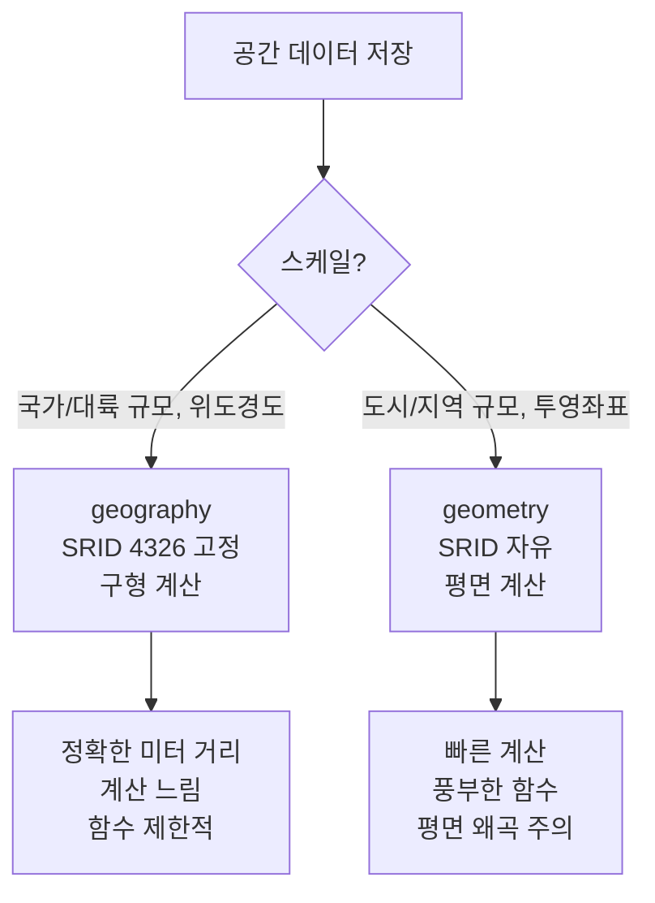
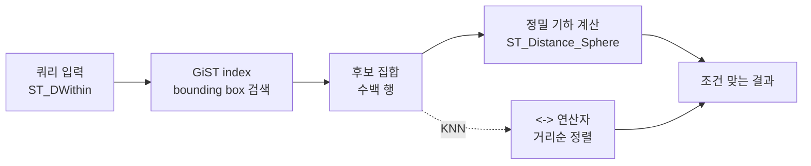

# 예제 5. PostGIS — 지리정보

PostGIS는 PostgreSQL을 사실상 **산업 표준 공간 DB**로 만들어 준 확장이다. "근처 매장 찾기", 배달 반경, 지오펜스, 경로 검색 등 위치 기반 서비스의 기본 엔진이다. geometry/geography 타입과 GiST 인덱스, 좌표계(SRID)를 이해하는 것이 출발점이다.

---

## 1. 요구사항

- 매장 50만 개, 사용자 위치(lat/lng) 기반 근처 매장 검색
- "사용자로부터 3km 이내 매장, 가까운 순 20개" 10ms 내 응답
- 배달 영역(폴리곤) 포함 여부 판정
- 향후 격자 기반 히트맵 필요

---

## 2. 설치와 기본 개념

### 2.1 확장 활성화

```sql
CREATE EXTENSION IF NOT EXISTS postgis;
-- 확인
SELECT PostGIS_Full_Version();
```

### 2.2 geometry vs geography



| 항목 | geometry | geography |
|------|----------|-----------|
| 좌표계 | 임의 SRID | SRID 4326(WGS84) 고정 |
| 계산 모델 | 평면 (유클리드) | 구형 (측지) |
| 거리 단위 | SRID 좌표 단위 | 미터 |
| 지원 함수 | 매우 많음 | 제한적 (`ST_DWithin`, `ST_Distance` 등 핵심) |
| 대륙간 정확도 | 왜곡 심함 | 정확 |
| 속도 | 빠름 | 느림 (~수 배) |

**실무 가이드:**
- 위도/경도(°)로 받아 바로 쓰는 단순 앱: `geography`
- 좁은 범위 + 복잡한 기하 연산 + 고속: `geometry` (SRID 3857/5179 등)
- 하이브리드: 저장은 geography, 계산 시 `::geometry` 캐스팅

### 2.3 SRID

SRID(Spatial Reference Identifier)는 좌표계 ID. 자주 쓰는 것:

| SRID | 이름 | 용도 |
|------|------|------|
| 4326 | WGS84 (위경도) | GPS, 저장용 표준 |
| 3857 | Web Mercator | 웹 지도 타일 (구글/네이버 지도) |
| 5179 | KATEC/UTM-K | 국내 공공 데이터 |
| 5186 | GRS80 중부 | 국내 측량 |

변환은 `ST_Transform`:

```sql
-- 4326 → 3857
SELECT ST_AsText(ST_Transform(ST_SetSRID(ST_MakePoint(127.0, 37.5), 4326), 3857));
```

---

## 3. 스키마 설계

```sql
CREATE TABLE stores (
    id          bigserial PRIMARY KEY,
    name        text NOT NULL,
    category    text NOT NULL,
    -- 저장은 geography(Point, 4326): 위경도 표현
    geog        geography(Point, 4326) NOT NULL,
    -- 좁은 범위에서의 고속 계산용 sibling 컬럼 (선택)
    geom_3857   geometry(Point, 3857)
                GENERATED ALWAYS AS (ST_Transform(geog::geometry, 3857)) STORED,
    created_at  timestamptz NOT NULL DEFAULT now()
);

-- 공간 인덱스: GiST가 기본
CREATE INDEX ON stores USING gist (geog);
CREATE INDEX ON stores USING gist (geom_3857);

-- 카테고리 필터가 자주 들어가면 복합 인덱스
CREATE INDEX ON stores (category);
```

배달 영역(폴리곤):

```sql
CREATE TABLE delivery_zones (
    id        bigserial PRIMARY KEY,
    store_id  bigint NOT NULL REFERENCES stores(id),
    area      geography(Polygon, 4326) NOT NULL,
    priority  int NOT NULL DEFAULT 1
);
CREATE INDEX ON delivery_zones USING gist (area);
CREATE INDEX ON delivery_zones (store_id);
```

데이터 삽입:

```sql
INSERT INTO stores (name, category, geog) VALUES
  ('강남점', 'cafe',
   ST_SetSRID(ST_MakePoint(127.0276, 37.4979), 4326)::geography);

-- GeoJSON으로부터
INSERT INTO stores (name, category, geog) VALUES
  ('홍대점', 'cafe',
   ST_GeomFromGeoJSON('{"type":"Point","coordinates":[126.9234,37.5563]}')::geography);
```

---

## 4. 주요 쿼리

### 4.1 근처 매장 찾기 — ST_DWithin + KNN

```sql
-- 사용자 위치: 위경도 (127.0276, 37.4979)
WITH me AS (
    SELECT ST_SetSRID(ST_MakePoint(127.0276, 37.4979), 4326)::geography AS g
)
SELECT s.id,
       s.name,
       ST_Distance(s.geog, me.g) AS distance_m
FROM   stores s, me
WHERE  ST_DWithin(s.geog, me.g, 3000)   -- 3km 이내 (geography는 미터)
  AND  s.category = 'cafe'
ORDER  BY s.geog <-> me.g               -- KNN 연산자, GiST 인덱스 활용
LIMIT  20;
```

**핵심 포인트:**
- `ST_DWithin(a, b, r)`은 **인덱스를 활용**해 후보를 추려낸다.
- `ST_Distance(a, b) < r`은 후보 전수 계산 → **인덱스 미활용**. 절대 사용하지 말 것.
- `<->` 연산자는 **KNN 정렬**. GiST 인덱스가 있어야 효과적.
- `ORDER BY ST_Distance(...) LIMIT N`은 정렬 전 모두 계산 → 느림.

### 4.2 EXPLAIN 확인

```
Limit
  ->  Index Scan using stores_geog_idx on stores
        Order By: (geog <-> '<point>'::geography)
        Filter: (ST_DWithin(geog, '<point>'::geography, 3000) AND (category = 'cafe'))
```

`Index Scan` + `Order By: (... <-> ...)`가 떠야 정상. 만약 `Sort`가 별도로 붙으면 KNN이 안 타는 것. GiST 인덱스 유무와 연산자 일치를 확인한다.

### 4.3 배달 영역 포함 판정 — ST_Contains / ST_Intersects

```sql
-- 사용자가 어떤 배달권에 들어가는지
SELECT dz.store_id, dz.priority
FROM   delivery_zones dz
WHERE  ST_Contains(
         dz.area::geometry,
         ST_SetSRID(ST_MakePoint(127.028, 37.498), 4326)
       )
ORDER  BY dz.priority DESC
LIMIT  1;
```

- `ST_Contains(a, b)`: a가 b를 완전히 포함?
- `ST_Within(a, b)`: b가 a를 완전히 포함? (인자 순서 반대)
- `ST_Intersects(a, b)`: 교차하는가? (경계 접촉 포함)
- **인덱스 활용**: 모두 GiST에서 bounding box 필터 → 정밀 검사 2단계로 진행.

### 4.4 공간 조인 (근처 편의점 ↔ 카페)

```sql
-- 서로 100m 이내에 있는 편의점-카페 쌍
SELECT c.id AS cafe_id, c.name AS cafe_name,
       s.id AS store_id, s.name AS store_name,
       ST_Distance(c.geog, s.geog) AS d_m
FROM   stores c, stores s
WHERE  c.category = 'cafe'
  AND  s.category = 'convenience'
  AND  c.id <> s.id
  AND  ST_DWithin(c.geog, s.geog, 100);
```

공간 조인은 두 테이블 모두에 GiST가 있어야 한다. 조인 방향에 따라 플래너가 Nested Loop + Index를 고른다.

### 4.5 바운딩 박스 필터 (지도 뷰포트)

```sql
-- 지도 뷰포트 (남서 127.00, 37.48), (북동 127.05, 37.52)
SELECT id, name, ST_Y(geog::geometry) AS lat, ST_X(geog::geometry) AS lng
FROM   stores
WHERE  geog && ST_MakeEnvelope(127.00, 37.48, 127.05, 37.52, 4326)::geography;
```

`&&` 연산자는 **bounding box overlap**. 정밀 검사가 없어 가장 빠르지만, 경계 근처에서 false positive가 있을 수 있다. 지도 뷰포트 쿼리에는 이 정도로 충분하다.

---

## 5. 공간 쿼리 실행 순서



GiST는 2단계 필터다.
1. **Index scan**: 각 기하의 bounding box로 대략 필터.
2. **Recheck**: 정확한 기하 함수로 판정.

bounding box가 좁을수록(점 위주일수록) 1단계 선택도가 높아 빠르다. 복잡한 폴리곤이면 Recheck가 무거워진다.

---

## 6. 거리·면적·투영 함수

```sql
-- 거리 (미터, geography)
SELECT ST_Distance(
    ST_MakePoint(127.0276, 37.4979)::geography,
    ST_MakePoint(126.9234, 37.5563)::geography
);
-- 약 10.9km → 10904.5 정도

-- 거리 (투영 좌표계, meter)
SELECT ST_Distance(
    ST_Transform(ST_SetSRID(ST_MakePoint(127.0276, 37.4979), 4326), 3857),
    ST_Transform(ST_SetSRID(ST_MakePoint(126.9234, 37.5563), 4326), 3857)
);
-- Mercator 왜곡으로 위도에 따라 오차 존재

-- 폴리곤 면적 (m²)
SELECT ST_Area(area::geography) FROM delivery_zones WHERE id = 1;

-- 버퍼 생성 (100m 반경 원)
SELECT ST_Buffer(geog, 100) FROM stores WHERE id = 1;
-- geography의 ST_Buffer는 geometry로 반환됨 → 다시 geography로 캐스팅 주의
```

---

## 7. 성능 팁

### 7.1 ST_DWithin vs ST_Distance <

| 쿼리 | 인덱스 | 속도 |
|------|--------|------|
| `ST_DWithin(a, b, r)` | O | 빠름 |
| `ST_Distance(a, b) < r` | X | 느림 (풀 스캔) |
| `ST_Distance(a, b) <= r` | X | 느림 |

`ST_Distance`는 **값을 먼저 계산**해야 하므로 인덱스로 좁힐 수 없다. 반경 필터는 항상 `ST_DWithin`.

### 7.2 geometry vs geography 전환

- 저장은 `geography(Point, 4326)`로 통일 (위경도 그대로 받기 편함).
- 대량 계산이 필요하면 `geometry(Point, 3857)` sibling 컬럼을 `GENERATED ALWAYS AS` 자동 생성 (위에서 본 패턴).
- 좁은 도시 범위에선 3857로 평면 계산이 몇 배 빠르다.

### 7.3 GiST vs SP-GiST

- **GiST**: 범용. geometry/geography 모두 지원. 실무 1순위.
- **SP-GiST**: 포인트 데이터에서 GiST보다 작고 빠를 수 있지만, 폴리곤 지원 제한. 점 위주 데이터라면 벤치마크 후 선택.

```sql
CREATE INDEX ON stores USING spgist (geom_3857);
```

### 7.4 포인트 클러스터링 (히트맵)

```sql
-- 1km 격자 카운트
SELECT ST_SnapToGrid(geom_3857, 1000) AS grid,
       count(*) AS n
FROM   stores
GROUP  BY grid;
```

`ST_SnapToGrid`로 좌표를 격자 단위로 반올림 → 간단한 히트맵 집계. 타일 서버 연동 시 `ST_AsMVT`로 Mapbox Vector Tile 직접 생성 가능.

---

## 8. 운영 포인트

### 8.1 GiST 인덱스 Bloat

GiST는 인덱스 삽입/삭제 시 균형 유지 비용이 높고 Bloat가 상대적으로 잘 쌓인다. 데이터 교체가 많으면 주기적 `REINDEX CONCURRENTLY`.

```sql
REINDEX INDEX CONCURRENTLY stores_geog_idx;
```

### 8.2 VACUUM과 Visibility Map

공간 쿼리도 Index-Only Scan을 노릴 수 있다. VACUUM이 Visibility Map을 갱신해야 하므로 공간 테이블도 `autovacuum` 정상 동작이 필수.

### 8.3 대용량 로드

공간 데이터 초기 적재는 `COPY` + `shp2pgsql`을 조합.

```bash
shp2pgsql -s 4326 -I roads.shp public.roads | psql -d mydb
# -s SRID, -I GiST index, -c create new table
```

로드 중엔 인덱스를 나중에 만드는 편이 빠르다 (`shp2pgsql -a`로 append만 하고 이후 `CREATE INDEX`).

### 8.4 백업

- PostGIS 설치된 DB의 `pg_dump`는 공간 함수 정의까지 포함됨.
- 복원 대상 DB에 먼저 `CREATE EXTENSION postgis;`가 필요.
- `pg_dump --extension=postgis` 옵션 또는 `postgis_restore.pl` 스크립트 참고.

### 8.5 모니터링

```sql
-- 공간 인덱스 크기
SELECT relname, pg_size_pretty(pg_relation_size(oid)) AS size
FROM   pg_class
WHERE  relkind = 'i'
  AND  relname LIKE '%geog%' OR relname LIKE '%geom%'
ORDER  BY pg_relation_size(oid) DESC;

-- PostGIS 함수 호출 상위 (pg_stat_statements)
SELECT substring(query,1,80), calls, mean_exec_time
FROM   pg_stat_statements
WHERE  query ILIKE '%ST_%'
ORDER  BY total_exec_time DESC
LIMIT  20;
```

### 8.6 흔한 실수

| 실수 | 증상 | 해결 |
|------|------|------|
| `ST_Distance(...) < r` 사용 | 풀 스캔, 수 초 | `ST_DWithin(..., r)` |
| `ORDER BY ST_Distance(...) LIMIT N` | 정렬 전 전수 계산 | `ORDER BY a <-> b LIMIT N` |
| SRID 누락/불일치 | 결과 이상, 에러 | `ST_SetSRID` 또는 `ST_Transform`으로 통일 |
| geometry에 위경도 넣고 미터로 해석 | 거리값 이상 | geography 사용 또는 3857 변환 |
| GiST 없이 공간 쿼리 | Seq Scan | `CREATE INDEX ... USING gist (...)` |
| 폴리곤 과다 정점 | Recheck 부담 | `ST_Simplify`로 단순화 |

---

## 9. 관련 챕터

- [5장. 인덱스](../chapters/ch05_indexes.md) — GiST, SP-GiST
- [6장. 쿼리 플래너](../chapters/ch06_query_planner.md) — KNN 연산자, Index Scan Order By
- [8장. VACUUM](../chapters/ch08_vacuum_autovacuum.md) — GiST Bloat, Visibility Map
- [13장. 확장](../chapters/ch13_extensions.md) — PostGIS 설치, pg_trgm, pgrouting
- [cheatsheets/index_selection.md](../cheatsheets/index_selection.md) — GiST vs SP-GiST
- [cheatsheets/explain_reading.md](../cheatsheets/explain_reading.md) — 공간 쿼리 플랜 해석
