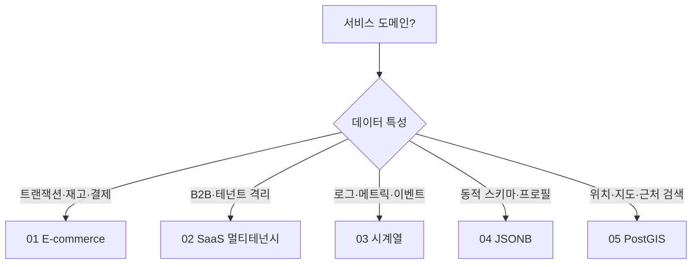

# examples — 실무 도메인 예제

실제 서비스에서 자주 마주치는 요구사항을 PostgreSQL로 **어떻게 설계·운영하는가**. 각 예제는 스키마 · 쿼리 패턴 · 운영 이슈를 완결된 시나리오로 다룬다.

> 📘 전체 가이드 개요는 [../README.md](../README.md) 참고.

---

## 전체 예제

| # | 도메인 | 핵심 개념 | 주로 참고할 챕터 |
|---|--------|---------|---------------|
| [01](01_ecommerce_orders.md) | 🛒 **E-commerce 주문/재고** | 동시성(FOR UPDATE vs 버전컬럼), 파티셔닝, Materialized View, SKIP LOCKED 큐 | [ch07](../chapters/ch07_transactions_isolation.md) · [ch12](../chapters/ch12_partitioning.md) |
| [02](02_saas_multitenancy.md) | 🏢 **SaaS 멀티테넌시** | tenant_id 공유 · 스키마 분리 · DB 분리 3전략, RLS, PgBouncer transaction mode | [ch07](../chapters/ch07_transactions_isolation.md) · [ch13](../chapters/ch13_extensions.md) |
| [03](03_timeseries_logs.md) | 📊 **시계열 로그/메트릭** | BRIN, 일 단위 파티션, pg_cron 자동화, Materialized View 집계, TimescaleDB 비교 | [ch05](../chapters/ch05_indexes.md) · [ch12](../chapters/ch12_partitioning.md) |
| [04](04_json_document.md) | 📄 **JSONB 문서 저장소** | json vs jsonb, 연산자(`->`, `@>`, `?`), GIN 인덱스(jsonb_ops vs jsonb_path_ops), JSONPath | [ch05](../chapters/ch05_indexes.md) · [ch13](../chapters/ch13_extensions.md) |
| [05](05_geospatial_postgis.md) | 🌍 **PostGIS 지리정보** | geometry vs geography, SRID, GiST, ST_DWithin + `<->` KNN | [ch05](../chapters/ch05_indexes.md) · [ch13](../chapters/ch13_extensions.md) |

---

## 예제 선택 가이드

---

## 공통 구성

각 예제는 다음 섹션을 따른다.

1. **요구사항** — 도메인이 무엇을 해결하려 하는가
2. **스키마 설계** — `CREATE TABLE`, 인덱스, 파티션, 제약
3. **쿼리 패턴** — 주요 SELECT/INSERT/UPDATE + EXPLAIN 관찰 포인트
4. **운영 포인트** — Lock, VACUUM, 백업, 성능 함정
5. **Mermaid 다이어그램** — ERD, 시퀀스, 인덱스 선택 플로우 등
6. **관련 챕터 링크**

---

## 예제 횡단 학습 팁

- **파티셔닝**은 01·03에서 다른 각도로 등장 — 01은 RANGE by month(운영 관리), 03은 일 단위(lifecycle 자동화).
- **GIN 인덱스**는 03(로그 payload)·04(JSONB)·[PostGIS/FTS 비교]에서 용도별 차이를 본다.
- **SKIP LOCKED** 큐 패턴은 01에서 다루지만, 큐 시스템 일반에 응용 가능.
- **RLS + PgBouncer transaction mode의 함정**은 02에서만 깊게 다룬다 — 멀티테넌시 시스템을 만들기 전 필독.

---

## 관련 폴더

- [../chapters/](../chapters/) — 개념 먼저 이해하고 싶다면
- [../troubleshooting/](../troubleshooting/) — 예제 운영 중 만나는 장애 케이스
- [../cheatsheets/](../cheatsheets/) — 인덱스/타입/설정 빠른 참조
