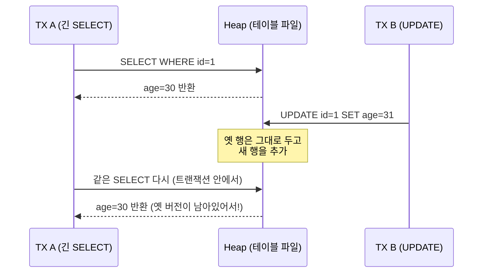
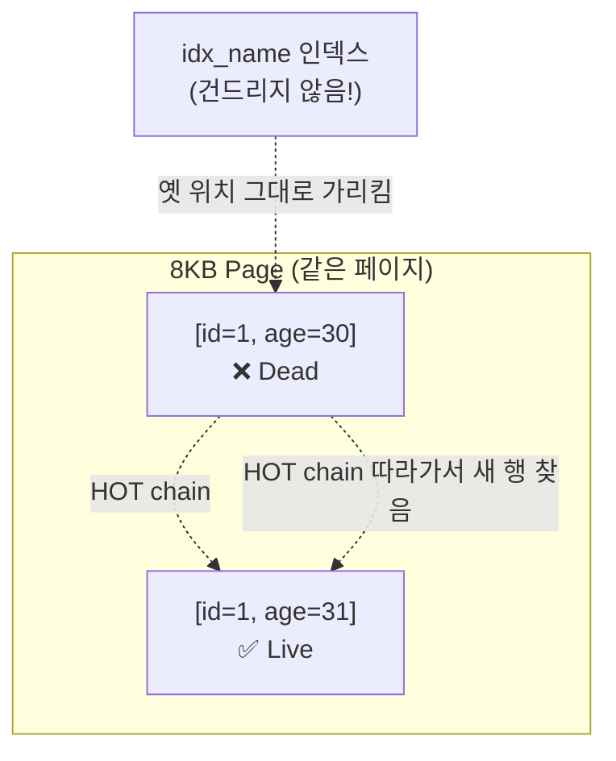

# 처음 배우는 PostgreSQL — ① UPDATE, MVCC, HOT, xmin/xmax

> 이 문서는 챕터·트러블슈팅을 본격적으로 읽기 전에 **운영의 절반을 결정하는 한 가지 개념**을 친근한 어조로 풀어 쓴 학습 자료입니다. 끝까지 읽으면 [3장 MVCC](../chapters/ch03_mvcc.md), [8장 VACUUM](../chapters/ch08_vacuum_autovacuum.md), [A1 Bloat](../troubleshooting/A1_bloat_accumulation.md), [A3 긴 TX](../troubleshooting/A3_long_tx_blocks_vacuum.md)를 한 번에 이해할 수 있습니다.

---

## 1. 한 줄 요약

> **PostgreSQL의 `UPDATE`는 기존 행을 수정하지 않는다.**
> 기존 행에 "죽었다"는 표시만 하고, **변경된 데이터를 새 행으로 추가**한다.
> 그래서 1번 UPDATE = 1행 추가. 100번 UPDATE = 100행 추가.

이 한 가지가 **PG 운영의 절반**을 결정합니다.

---

## 2. 그림으로 보기

`users` 테이블에 행 1개가 있다고 합시다.

```
초기 상태:
┌─────────────────────────────┐
│ [id=1, name='Alice', age=30]│   ← 살아있는 행
└─────────────────────────────┘
```

```sql
UPDATE users SET age = 31 WHERE id = 1;
```

```
UPDATE 후:
┌─────────────────────────────────────┐
│ [id=1, name='Alice', age=30] ❌     │   ← Dead Tuple
│ [id=1, name='Alice', age=31] ✅     │   ← Live Tuple
└─────────────────────────────────────┘
```

테이블 파일이 **2배** 커졌습니다. 이게 "부풀었다(Bloat)"의 시작입니다.

다시 `UPDATE users SET age = 32 WHERE id = 1;`

```
┌─────────────────────────────────────┐
│ [id=1, name='Alice', age=30] ❌     │
│ [id=1, name='Alice', age=31] ❌     │
│ [id=1, name='Alice', age=32] ✅     │
└─────────────────────────────────────┘
```

**한 행을 100번 업데이트하면 디스크엔 100개 버전이 쌓입니다.**

---

## 3. 왜 이렇게 만들었나? — MVCC

이유는 **읽기와 쓰기가 서로 막지 않게** 하려고.

PostgreSQL은 트랜잭션 A가 `age=30`을 읽고 있을 때, 트랜잭션 B가 `age=31`로 UPDATE를 동시에 할 수 있게 합니다. 둘이 만나도 누구도 기다리지 않습니다.

이걸 가능하게 하려면 **옛 버전이 사라지면 안 됩니다.** A가 보던 `age=30`이 그대로 남아 있어야 A는 끝까지 일관된 결과를 봅니다.

이게 **MVCC (Multi-Version Concurrency Control)** 입니다.



A가 끝나기 전까진 **옛 버전을 지울 수 없습니다.** PostgreSQL은 이걸 "이 행이 보이는 트랜잭션이 모두 끝났는가"로 판단합니다.

---

## 4. xmin / xmax — MVCC가 실제로 동작하는 방법

**"옛 행에 죽음 표시"**를 한다고 했는데, 표시는 어떻게 합니까?

PG의 모든 행에는 **숨겨진 시스템 컬럼** 두 개가 있습니다:

```sql
SELECT xmin, xmax, ctid, * FROM users WHERE id = 1;
```

| 컬럼 | 의미 |
|---|---|
| `xmin` | 이 행을 **만든** 트랜잭션 ID |
| `xmax` | 이 행을 **삭제/변경한** 트랜잭션 ID (0이면 살아있음) |
| `ctid` | 행의 물리적 위치 `(페이지번호, 슬롯번호)` |

UPDATE 시:

```
UPDATE 전:  [xmin=100, xmax=0,   age=30]  ← TX 100이 생성, 살아있음

UPDATE 실행 (TX 200):
[xmin=100, xmax=200, age=30]  ← TX 200이 죽임 (Dead)
[xmin=200, xmax=0,   age=31]  ← TX 200이 생성 (Live)
```

**가시성 규칙은 단순합니다** (개념적으로):

> "내 트랜잭션이 시작된 시점에 **xmin이 이미 commit되어 있었고**,
> **xmax는 아직 commit 안 됐거나 0인** 행만 본다."

긴 트랜잭션 A가 TX 150에 시작했다면, A는 위 두 번째 행을 못 봅니다(xmin=200이 미래). 그래서 첫 번째 행이 A에게는 살아있는 것처럼 보이고, 따라서 **VACUUM이 그 행을 못 치웁니다.**

이게 [A3 긴 TX가 VACUUM 차단](../troubleshooting/A3_long_tx_blocks_vacuum.md)의 본질입니다.
**"가장 오래된 트랜잭션 = 모든 Dead Tuple의 인질범"**

### 직접 확인해 보기

```sql
-- 시스템 컬럼은 *에 안 잡히므로 명시적으로 SELECT
CREATE TABLE demo (id int, val text);
INSERT INTO demo VALUES (1, 'a');

SELECT xmin, xmax, ctid, * FROM demo WHERE id = 1;
-- xmin=어떤 TX, xmax=0, ctid=(0,1)

UPDATE demo SET val = 'b' WHERE id = 1;

SELECT xmin, xmax, ctid, * FROM demo WHERE id = 1;
-- xmin=새 TX, xmax=0, ctid=(0,2)  ← 위치도 바뀜!
```

`ctid`가 바뀐다는 건 **물리적 위치가 바뀌었다**는 뜻. 이게 다음 섹션의 핵심입니다.

---

## 5. 평범한 UPDATE의 진짜 비용 — 인덱스 N개 모두 갱신

`users(id, name, age)` 테이블에 `idx_name (name)` 인덱스가 있다고 합시다.

```sql
UPDATE users SET age=31 WHERE id=1;
```

내부에서 일어나는 일:

```
1. heap에 새 행 추가 (다른 ctid)
2. idx_name 인덱스에 새 항목 추가 (옛 ctid → 새 ctid)
3. (idx_age 인덱스가 있다면) idx_age에도 새 항목 추가
4. (idx_email 인덱스가 있다면) idx_email에도 새 항목 추가
5. 옛 행은 Dead Tuple로 표시
```

**인덱스가 N개면 UPDATE 1번에 인덱스 N번 갱신.**
age 컬럼 안 건드리는 인덱스도 건드립니다. 왜냐? **새 행이 다른 위치(다른 ctid)에 저장**됐기 때문에, 모든 인덱스가 새 위치를 가리켜야 하니까요.

이게 **인덱스가 많을수록 UPDATE가 느려지는** 근본 이유입니다.

---

## 6. HOT Update — 인덱스를 안 건드리는 UPDATE

PG에는 특별한 경로가 있습니다: **HOT(Heap-Only Tuple) Update**.

조건이 두 가지:

### 조건 ① — 변경된 컬럼에 인덱스가 없어야 함

- `age`를 바꾸는데 `idx_age`가 없다면 ✅ OK
- 하지만 `idx_name`은 있어도 ✅ OK (name은 안 바뀌니까)

### 조건 ② — 새 행이 **같은 페이지(8KB 블록)** 에 들어갈 자리가 있어야 함

조건 만족 시:



핵심은 **인덱스를 갱신하지 않는다**는 것. 인덱스는 옛 행 위치를 그대로 가리키고, 옛 행이 "여기서 새 행으로 가세요"라는 포인터(HOT chain)를 들고 있습니다.

---

## 7. HOT의 효과 — 측정 가능한 차이

같은 워크로드에서:

| 지표 | 일반 UPDATE | HOT Update |
|---|---|---|
| heap 새 행 추가 | ✅ | ✅ |
| 인덱스 갱신 | **N개 인덱스 모두** | **0개** |
| WAL 양 | 큼 | 작음 |
| 인덱스 Bloat | 누적 | 없음 |
| VACUUM이 인덱스도 청소할 비용 | 있음 | 없음 |

`pg_stat_user_tables`에서 두 값을 항상 같이 봐야 합니다:

```sql
SELECT
    relname,
    n_tup_upd,                    -- 전체 UPDATE 수
    n_tup_hot_upd,                -- 그 중 HOT으로 처리된 수
    round(100.0 * n_tup_hot_upd / NULLIF(n_tup_upd, 0), 1) AS hot_ratio_pct
FROM pg_stat_user_tables
WHERE n_tup_upd > 0
ORDER BY n_tup_upd DESC;
```

**hot_ratio_pct가 90% 이상이면 건강. 30% 이하면 인덱스 설계나 fillfactor 재검토.**

---

## 8. fillfactor — HOT을 가능케 하는 의도적 빈 공간

조건 ②(새 행이 같은 페이지에 들어갈 자리)를 만족시키려면 **페이지에 빈 공간을 미리 남겨야** 합니다.

`fillfactor`는 "이 페이지의 몇 %까지만 데이터로 채울지" 설정입니다.

| fillfactor | 의미 | 사용처 |
|---|---|---|
| 100 (기본) | 페이지를 꽉 채움 | append-only 테이블 (로그) |
| 90 | 10% 빈 공간 확보 | 가벼운 UPDATE |
| 80 | 20% 빈 공간 확보 | UPDATE-heavy 테이블 |
| 70 | 30% 빈 공간 확보 | 매우 heavy한 UPDATE |

```sql
-- 새 테이블 생성 시
CREATE TABLE users (...) WITH (fillfactor = 80);

-- 기존 테이블 변경 (이후 INSERT/UPDATE부터 적용 — 기존 페이지엔 영향 없음)
ALTER TABLE users SET (fillfactor = 80);

-- 기존 데이터에 즉시 적용하려면 재구성
VACUUM FULL users;       -- 또는 pg_repack (온라인)
```

### 트레이드오프

- fillfactor 80 → 페이지의 20%가 빈 공간 → 디스크 사용량 25% 증가 + Seq Scan 25% 느려짐
- 그러나 → HOT 비율 폭증 → UPDATE 빨라지고 Bloat 안 쌓임

**UPDATE-heavy 테이블이라면 이 트레이드오프가 명백히 이득**입니다.

---

## 9. HOT을 깨뜨리는 흔한 실수

```sql
-- users 테이블에 인덱스 5개. 그 중 idx_updated_at (updated_at) 있음.
UPDATE users SET name = 'Bob', updated_at = now() WHERE id = 1;
```

`updated_at`에 인덱스가 있으니 **HOT 불가**. 인덱스 5개 모두 갱신.

### 대안

- 정말 `updated_at`을 인덱싱해야 하나? `created_at`만으로 충분한 경우가 많다.
- 또는 `updated_at`은 별도 테이블로 분리.
- 또는 `updated_at`을 인덱스에서 제외하고, "최근 N일 활동" 같은 쿼리는 **별도 캐싱**으로 처리.

이게 [README의 "설계 원칙"](../README.md)에 적힌 **"변경 가능한 컬럼은 가급적 인덱스에서 제외"**의 정확한 의미입니다.

---

## 10. VACUUM — 옛 버전을 청소하는 사람

PostgreSQL 백그라운드에 **autovacuum**이라는 청소부가 있습니다. 주기적으로 돌면서 "이제 아무도 안 보는 옛 버전"을 찾아서 그 공간을 **재사용 가능 상태로** 표시합니다.

여기서 중요한 건 — **VACUUM은 파일 크기를 줄이지 않습니다.**
그저 그 자리를 "비었다"고 표시할 뿐. 다음 INSERT/UPDATE가 그 빈 공간을 재사용합니다.

```
VACUUM 후:  users 테이블 (파일 크기는 그대로!)
┌─────────────────────────────────────┐
│ [빈 공간 — 재사용 가능]               │
│ [빈 공간 — 재사용 가능]               │
│ [id=1, name='Alice', age=32] ✅     │
└─────────────────────────────────────┘
```

### 부풂이 일어나는 3가지 상황

**① autovacuum이 못 따라갈 만큼 UPDATE가 많을 때**
```
UPDATE 속도 > VACUUM 속도
→ Dead Tuple 계속 쌓임
→ 파일 계속 커짐
```

**② 긴 트랜잭션이 옛 버전을 "보호"할 때**
```
누군가 BEGIN; SELECT ...; (1시간째 안 끝남)
→ 그 동안 모든 Dead Tuple이 "혹시 저 사람이 볼지 모름"으로 분류
→ VACUUM이 못 치움
→ 1시간치 Dead Tuple 누적
```

**③ 한 번 부풀면 줄어들지 않음**
- 일반 VACUUM은 **공간 표시만** 한다 (재사용 가능). 파일은 안 줄어든다.
- 파일을 실제로 줄이려면:
  - `VACUUM FULL` — 테이블 전체 락 (서비스 중단 위험)
  - `pg_repack` — 온라인 재구성 (운영 권장)

---

## 11. MySQL과의 결정적 차이

| | PostgreSQL | MySQL InnoDB |
|---|---|---|
| UPDATE 시 옛 버전 보관 | **테이블 자기 자신**(heap) | **별도 Undo 영역** |
| 결과 | 테이블 자체가 부풀음 → VACUUM 필요 | Undo 영역만 부풀음 → 자동 purge |
| 인덱스 구조 | Heap + 모든 인덱스 동등 | Clustered Index (PK가 데이터 순서) |

MySQL은 옛 버전이 **다른 곳**에 있으니 테이블 파일은 깔끔합니다.
PostgreSQL은 옛 버전이 **테이블 안**에 그대로 있어서 테이블이 부풉니다.

대신 PG는 Undo 영역의 한계 같은 게 없고 (MySQL은 ibuf/undo가 차서 장애 나기도 함), 구조가 단순해서 안정적입니다. **트레이드오프**입니다.

---

## 12. 핵심 정리 — 4가지

```
1. UPDATE = 새 행 추가 + 옛 행 죽음 표시 (xmax 세팅)
2. xmin/xmax = 행에 박힌 시스템 컬럼. MVCC와 VACUUM의 모든 판단 기준
3. HOT Update = 인덱스 안 건드리는 UPDATE
   조건: 변경 컬럼에 인덱스 없음 + 같은 페이지에 자리
4. fillfactor = HOT을 가능케 하는 의도적 빈 공간 (UPDATE-heavy는 80)
```

이 4개를 알면 다음이 자동으로 풀립니다:

- 왜 인덱스를 줄여야 하는가 → HOT 가능성 ↑
- 왜 짧은 트랜잭션이 미덕인가 → 옛 xmin이 풀려서 VACUUM 가능
- 왜 UPDATE 많은 테이블에 fillfactor=80을 다는가 → HOT 비율 ↑
- 왜 "auto-updated_at 컬럼" 같은 패턴이 위험한가 → HOT 불가

---

## 13. 운영자가 매일 봐야 하는 4개 쿼리

### ① HOT 비율
```sql
SELECT relname, n_tup_upd, n_tup_hot_upd,
       round(100.0 * n_tup_hot_upd / NULLIF(n_tup_upd, 0), 1) AS hot_pct
FROM pg_stat_user_tables
WHERE n_tup_upd > 1000
ORDER BY n_tup_upd DESC;
```

### ② Dead Tuple 비율
```sql
SELECT relname, n_live_tup, n_dead_tup,
       round(100.0 * n_dead_tup / NULLIF(n_live_tup + n_dead_tup, 0), 1) AS dead_pct,
       last_autovacuum
FROM pg_stat_user_tables
WHERE n_dead_tup > 1000
ORDER BY n_dead_tup DESC;
```

### ③ 가장 오래된 트랜잭션 (Bloat 인질범 찾기)
```sql
SELECT pid, usename, application_name, state,
       now() - xact_start AS xact_age,
       query
FROM pg_stat_activity
WHERE state IN ('idle in transaction', 'active')
  AND xact_start IS NOT NULL
ORDER BY xact_start ASC NULLS LAST
LIMIT 10;
```

### ④ 테이블·인덱스 크기
```sql
SELECT relname,
       pg_size_pretty(pg_relation_size(relid))         AS heap,
       pg_size_pretty(pg_indexes_size(relid))          AS idx,
       pg_size_pretty(pg_total_relation_size(relid))   AS total
FROM pg_stat_user_tables
ORDER BY pg_total_relation_size(relid) DESC
LIMIT 20;
```

---

## 다음 학습

| 주제 | 어디로 |
|---|---|
| MVCC 본격 정통(가시성 규칙·HOT chain·Snapshot 알고리즘) | [3장 MVCC](../chapters/ch03_mvcc.md) |
| 실제 Bloat 장애 케이스 | [A1 Bloat 누적](../troubleshooting/A1_bloat_accumulation.md) |
| 긴 TX가 VACUUM 막는 시나리오 | [A3 긴 TX가 VACUUM 차단](../troubleshooting/A3_long_tx_blocks_vacuum.md) |
| VACUUM 튜닝 | [8장 VACUUM](../chapters/ch08_vacuum_autovacuum.md) · [vacuum_tuning](../cheatsheets/vacuum_tuning.md) |
| 페이지 구조·TOAST | [4장 Storage](../chapters/ch04_storage_tuples_toast.md) |

---

## 공식 문서 참조

- MVCC 개요: https://www.postgresql.org/docs/current/mvcc-intro.html
- 시스템 컬럼: https://www.postgresql.org/docs/current/ddl-system-columns.html
- HOT Updates: https://www.postgresql.org/docs/current/storage-hot.html (소스 README)
- Routine Vacuuming: https://www.postgresql.org/docs/current/routine-vacuuming.html
- 한글: https://postgresql.kr/docs/13/mvcc-intro.html
