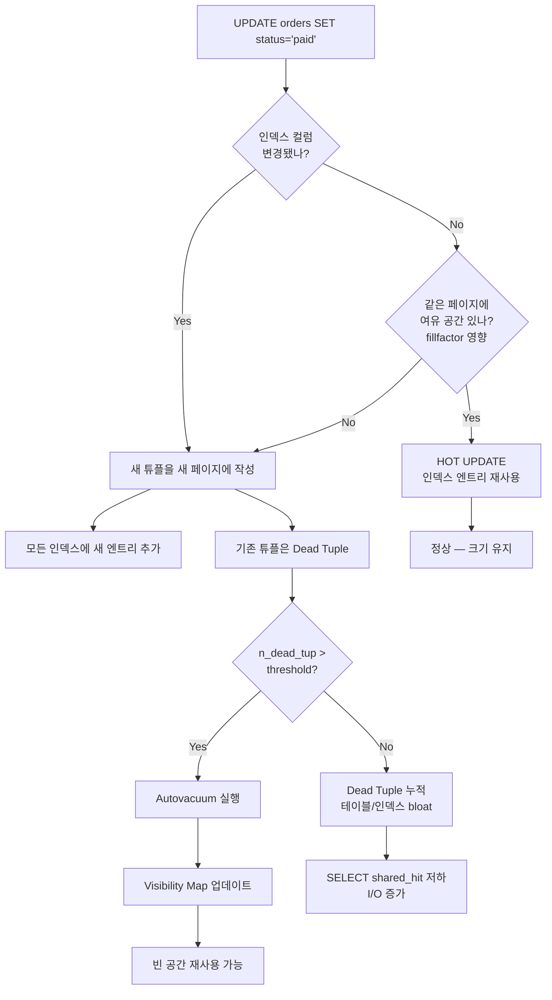
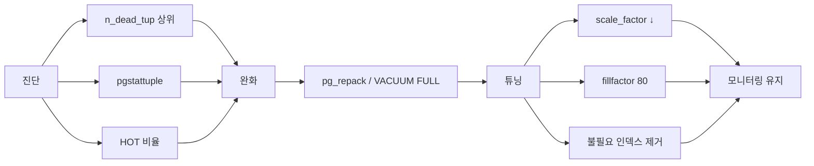

# A1. Bloat 누적 — 테이블이 점점 커지고 SELECT가 느려진다

> **증상 한 줄**: INSERT/UPDATE가 많은 테이블에서 실제 데이터량은 그대로인데 테이블 크기가 2배, 3배로 계속 커지고 `shared_hit` 비율이 떨어지면서 SELECT가 전반적으로 느려진다.

## 증상

| 지표 | 정상 | 장애 상황 |
|------|------|-----------|
| 테이블 크기 (`pg_relation_size`) | 20 GB | 58 GB (데이터는 18 GB 수준) |
| Dead Tuple 비율 `n_dead / (n_live + n_dead)` | 10% 미만 | 55% (live 대비 n_dead_tup/n_live_tup으로 보면 120%) |
| `shared_hit` 비율 | 99%+ | 82% |
| 평균 SELECT 지연 | 2 ms | 45 ms |
| Autovacuum last run | 수 시간 전 | 며칠 전 또는 없음 |

전형적인 경험담:
- 서비스 지표상 주문 건수는 일정한데 `orders` 테이블만 매주 15~20% 커진다.
- 같은 쿼리인데 특정 시간대부터 I/O 대기가 급증한다.
- `VACUUM FULL`을 걸면 갑자기 테이블 크기가 1/3로 줄어든다 (곧 다시 커진다).

---

## 실제 상황 (재현 시나리오)

### 스키마 & 규모

```sql
CREATE TABLE orders (
    order_id        bigserial PRIMARY KEY,
    user_id         bigint NOT NULL,
    status          text   NOT NULL,     -- 'pending' → 'paid' → 'shipped' → 'delivered'
    total_amount    numeric(12,2),
    updated_at      timestamptz DEFAULT now(),
    created_at      timestamptz DEFAULT now()
);

CREATE INDEX idx_orders_user_id   ON orders (user_id);
CREATE INDEX idx_orders_status    ON orders (status);        -- ← UPDATE되는 컬럼에 인덱스
CREATE INDEX idx_orders_updated   ON orders (updated_at);    -- ← UPDATE되는 컬럼에 인덱스
```

- 총 행 수: **5천만 건**
- 하나의 주문은 생성 후 평균 **4회 UPDATE** 발생 (상태 전이 + 배송정보 업데이트)
- 일간 INSERT 50만 건, UPDATE 200만 건
- `status` 컬럼에 인덱스가 걸려 있어 **HOT 업데이트가 막힘**

### 부하 조건 (autovacuum이 따라가지 못함)

```
# postgresql.conf (기본값 유지 — 이게 문제)
autovacuum_vacuum_scale_factor = 0.2     # 20% dead가 돼야 트리거
autovacuum_vacuum_threshold    = 50
# fillfactor                   = 100     # 기본값
```

5천만 행의 20% = **1천만 Dead Tuple이 쌓여야** autovacuum이 돈다. 하루 UPDATE 200만 건 × 4~5일 → 이미 테이블은 너덜너덜.

---

## 원인 분석

### MVCC의 구조적 숙명

PostgreSQL의 UPDATE는 **in-place update가 아니다**.

```
기존 행(xmax 설정) + 새 행(xmin 설정)이 같은 페이지(또는 다른 페이지)에 함께 존재
→ 구 버전은 Dead Tuple로 남는다
→ VACUUM이 visibility map과 함께 회수해야 공간 재사용 가능
```

### HOT 업데이트가 차단되는 조건

HOT(Heap-Only Tuple) 업데이트는 다음 조건에서만 성립한다:
1. **인덱스 컬럼이 변경되지 않아야** 한다.
2. 새 튜플이 같은 페이지에 들어갈 공간이 있어야 한다.

위 스키마는 `status`, `updated_at`에 인덱스가 걸려 있고, UPDATE마다 그 컬럼을 수정하므로 **HOT가 불가능**. 페이지마다 새 튜플을 받을 여유(fillfactor 100%)가 없어 새 페이지가 계속 append된다.

### 전형적인 악순환

```
UPDATE → 새 튜플 새 페이지 → 인덱스 엔트리 추가 → Dead Tuple 누적
     ↑                                                    │
     └────── 테이블/인덱스 크기 증가, SELECT 속도 저하 ──┘
```

---

## 진단 쿼리 (복붙 가능)

### 1. 가장 먼저 볼 것 — Dead Tuple 상위 테이블

```sql
SELECT
    schemaname || '.' || relname                                 AS table,
    n_live_tup,
    n_dead_tup,
    CASE WHEN (n_live_tup + n_dead_tup) = 0 THEN 0
         ELSE round(100.0 * n_dead_tup / (n_live_tup + n_dead_tup), 1)
    END                                                           AS dead_pct,   -- 0~100% 범위로 일관 해석
    last_autovacuum,
    last_vacuum,
    autovacuum_count,
    pg_size_pretty(pg_relation_size(relid))                      AS heap_size,
    pg_size_pretty(pg_total_relation_size(relid))                AS total_size
FROM pg_stat_user_tables
WHERE n_live_tup > 10000
ORDER BY n_dead_tup DESC
LIMIT 20;
```

### 2. 실제 Bloat 추정 (pgstattuple 확장, 정확)

```sql
-- 한 번만: CREATE EXTENSION pgstattuple;

SELECT
    relname,
    pg_size_pretty(table_len)          AS total_size,
    pg_size_pretty(tuple_len)          AS live_data,
    round(tuple_percent::numeric, 1)   AS live_pct,
    round(dead_tuple_percent::numeric, 1) AS dead_pct,
    pg_size_pretty(free_space)         AS free_space
FROM pgstattuple('public.orders') AS s, pg_class c
WHERE c.relname = 'orders';
-- 정상: live_pct > 85
-- 장애: live_pct < 50 → Bloat 심각
```

### 3. 추정용 (pgstattuple 없이, PostgreSQL Wiki 공식 쿼리 요약)

```sql
SELECT
    relname,
    n_live_tup,
    n_dead_tup,
    pg_size_pretty(pg_relation_size(relid))                  AS heap,
    pg_size_pretty(pg_indexes_size(relid))                   AS indexes,
    round(100.0 * n_dead_tup /
          NULLIF(n_live_tup + n_dead_tup, 0), 1)             AS dead_frac_pct
FROM pg_stat_user_tables
WHERE relname = 'orders';
```

### 4. HOT 비율 확인 (HOT 업데이트가 막혀 있는지)

```sql
SELECT
    relname,
    n_tup_upd,
    n_tup_hot_upd,
    CASE WHEN n_tup_upd = 0 THEN NULL
         ELSE round(100.0 * n_tup_hot_upd / n_tup_upd, 1)
    END AS hot_pct
FROM pg_stat_user_tables
WHERE n_tup_upd > 0
ORDER BY n_tup_upd DESC
LIMIT 20;
-- 건강한 OLTP: hot_pct > 70
-- 이 케이스: hot_pct ≈ 5
```

---

## 해결 방법

### 단계 1 — 즉각 완화: 공간 회수

```sql
-- 옵션 A: pg_repack (프로덕션 권장, AccessExclusiveLock 최소)
-- 한 번만: CREATE EXTENSION pg_repack;
-- 쉘에서: pg_repack -d <db> -t public.orders --no-order

-- 옵션 B: VACUUM FULL (테이블 전체 잠금, 새벽 점검 창에서만)
VACUUM FULL VERBOSE public.orders;

-- 옵션 C: 인덱스만 재구성 (v12+)
REINDEX INDEX CONCURRENTLY idx_orders_status;
REINDEX TABLE CONCURRENTLY public.orders;   -- v12+
```

> **주의**: `VACUUM FULL`은 `AccessExclusiveLock`을 잡는다. 온라인 서비스에서는 `pg_repack`을 먼저 검토.

### 단계 2 — 테이블별 autovacuum 튜닝

```sql
ALTER TABLE public.orders SET (
    autovacuum_vacuum_scale_factor = 0.05,   -- 20% → 5%
    autovacuum_vacuum_threshold    = 1000,
    autovacuum_analyze_scale_factor = 0.02,
    autovacuum_vacuum_cost_limit   = 2000    -- 기본 200, I/O 여유 있으면 상향
);
```

UPDATE가 잦은 큰 테이블일수록 **scale_factor를 낮춰** 더 자주 돌게 한다. 5천만 행 × 5% = 250만 Dead 시 트리거, 하루 안에 회수 가능.

### 단계 3 — fillfactor 조정으로 HOT 업데이트 부활

```sql
-- 페이지에 20% 여유 공간 → HOT 가능성 증가
ALTER TABLE public.orders SET (fillfactor = 80);

-- 기존 데이터에 반영하려면 재작성
VACUUM FULL public.orders;   -- 또는 pg_repack
```

### 단계 4 — 불필요한 인덱스 제거

```sql
-- UPDATE 컬럼의 인덱스가 정말 필요한가?
-- 사용량 확인
SELECT
    schemaname || '.' || relname AS table,
    indexrelname                 AS index,
    idx_scan,
    idx_tup_read,
    idx_tup_fetch,
    pg_size_pretty(pg_relation_size(indexrelid)) AS size
FROM pg_stat_user_indexes
WHERE schemaname = 'public' AND relname = 'orders'
ORDER BY idx_scan;

-- idx_scan = 0 (거의 안 읽는 인덱스)는 제거 고려
DROP INDEX CONCURRENTLY idx_orders_updated;
```

### 단계 5 — 설정값 전역 재점검 (postgresql.conf)

```conf
autovacuum_max_workers       = 5           # 기본 3
autovacuum_naptime           = 30s         # 기본 1min
autovacuum_vacuum_cost_limit = 2000        # 기본 200 (I/O 여유 있으면)
maintenance_work_mem         = 1GB         # VACUUM 인덱스 단계 가속
```

---

## 예방 원칙 (체크리스트)

- [ ] UPDATE가 잦은 컬럼에는 **가급적 인덱스를 걸지 않는다**. 필요하면 부분 인덱스(partial index)로 대체 검토.
- [ ] UPDATE-heavy 테이블은 **fillfactor 80~90**으로 생성한다.
- [ ] 큰 테이블(1천만 행+)은 **autovacuum_vacuum_scale_factor를 테이블별로** 낮춘다 (0.02~0.05).
- [ ] `pg_stat_user_tables.n_dead_tup`과 `n_tup_hot_upd / n_tup_upd` 비율을 **정기 대시보드**에 올린다.
- [ ] `pg_stat_user_indexes`로 **사용되지 않는 인덱스**를 분기별로 정리한다.
- [ ] `pgstattuple`을 주요 테이블에 월 1회 실행한다.
- [ ] `VACUUM FULL` 대신 `pg_repack`을 기본 도구로 쓴다.

---

## Mermaid — UPDATE가 Bloat를 만드는 흐름



### 조치 순서 요약



---

## 관련 챕터

- [03장. MVCC — xmin/xmax, Dead Tuple의 탄생](../chapters/ch03_mvcc.md)
- [04장. Heap/Tuple/Page/TOAST — HOT 업데이트와 fillfactor](../chapters/ch04_storage_tuples_toast.md)
- [08장. VACUUM과 Autovacuum](../chapters/ch08_vacuum_autovacuum.md)
- [cheatsheets/vacuum_tuning.md](../cheatsheets/vacuum_tuning.md)
- [cheatsheets/pg_stat_queries.md](../cheatsheets/pg_stat_queries.md)

## 공식 문서 참조

- [Routine Vacuuming](https://www.postgresql.org/docs/current/routine-vacuuming.html)
- [Storage Parameters — fillfactor](https://www.postgresql.org/docs/current/sql-createtable.html#SQL-CREATETABLE-STORAGE-PARAMETERS)
- [pgstattuple](https://www.postgresql.org/docs/current/pgstattuple.html)
- [PostgreSQL Wiki — Show database bloat](https://wiki.postgresql.org/wiki/Show_database_bloat)
