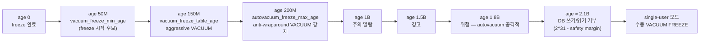
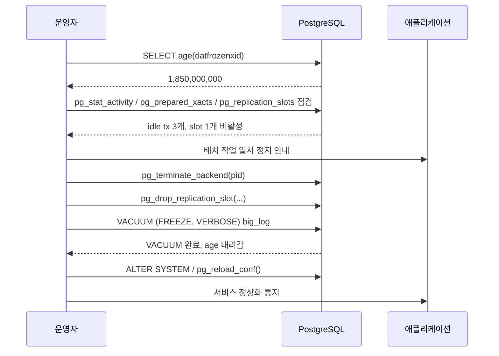

# A2. XID Wraparound 임박 — `database is not accepting commands to avoid wraparound data loss`

> **증상 한 줄**: 서버 로그에 `must be vacuumed within N transactions` 경고가 뜨기 시작하고, 최악의 경우 DB가 **쓰기·읽기 모두 거부**하며 single-user 모드로만 복구할 수 있는 상태에 진입한다.

## 증상

| 단계 | 증상 | `age(datfrozenxid)` |
|------|------|---------------------|
| 정상 | 로그 조용 | ~2억 미만 |
| 주의 | `autovacuum: found orphan temp table` 등 | 2억 ~ 15억 |
| 경고 | `database "foo" must be vacuumed within 178234567 transactions` | 15억 ~ 19억 |
| **위험** | autovacuum이 **anti-wraparound** 모드로 공격적으로 돌고, 일반 쿼리 I/O가 치솟음 | 19억 ~ 20.97억 |
| **장애** | `database is not accepting commands to avoid wraparound data loss` → 읽기/쓰기 거부 | `2^31 - 10^6` 근접 (≈21.47억) |

> PostgreSQL의 트랜잭션 ID는 32비트(= 약 **42.9억**)지만, "미래"와 "과거"를 구분하기 위해 **절반만 사용 가능(약 21.47억)**. 이 한계에 접근하면 DB를 보호하기 위해 멈춘다.

---

## 실제 상황 (재현 시나리오)

### 어떻게 여기까지 오는가

1. 쓰기가 많은 서비스(예: 광고 이벤트 수집, 주문 처리).
2. 누군가 `BEGIN;` 후 애플리케이션 버그로 **며칠 동안 커밋/롤백을 안 함** (idle in transaction).
3. Replication slot 한 개가 **비활성 상태로 방치**(소비자 다운) → horizon이 밀리지 않음.
4. 2PC 준비 트랜잭션이 **commit prepared 누락**으로 며칠째 남음.
5. Autovacuum이 freeze를 못 하고 XID만 계속 소진 → age 수치가 지속 상승.

### 재현용 시뮬레이션 (랩 환경)

```sql
-- XID 진행 상황 보기
SELECT txid_current();

-- horizon을 막는 세션 (다른 psql에서 실행, 종료하지 말 것)
BEGIN;
SELECT 1;
-- (커밋하지 않고 놔둠)

-- 메인 세션에서 대량 트랜잭션 발생시키기
SELECT txid_current() FROM generate_series(1, 1000000);

-- age가 올라가는 것을 관찰
SELECT datname, age(datfrozenxid) FROM pg_database ORDER BY age(datfrozenxid) DESC;
```

프로덕션에서는 이게 **여러 주에 걸쳐 천천히** 진행되기 때문에 아무도 눈치채지 못한다.

---

## 원인 분석

### XID의 한계 — 왜 Wraparound가 생기는가

- PostgreSQL tuple은 `xmin`, `xmax`로 **어느 트랜잭션이 만들고 삭제했는지**를 저장한다.
- XID는 32비트(2^32 ≈ 42.9억)지만, `xmin`이 현재보다 "미래"인지 "과거"인지 **순환 비교**하기 위해 **절반만 사용 가능** (약 21.47억).
- 따라서 주기적으로 "충분히 오래된 행"을 **freeze** 처리해서 `FrozenXid`로 표시해야 한다. (= 해당 튜플은 모두에게 영원히 보인다는 의미)
- `VACUUM FREEZE` 또는 autovacuum의 anti-wraparound VACUUM이 이 일을 한다.

### autovacuum이 freeze를 못 하는 3가지 원인

1. **idle in transaction** — OldestXmin이 진행되지 않아 VACUUM이 dead tuple도 삭제 못 함.
2. **비활성 replication slot** — `pg_replication_slots.catalog_xmin`이 과거에 고정.
3. **prepared transaction 미정리** — `pg_prepared_xacts`에 며칠 묵은 2PC.
4. 또는 **디스크 폭주로 autovacuum worker가 테이블 하나에 몇 시간 갇힘**(간접 원인).

### 중요 파라미터 (기본값 기준)

| 파라미터 | 기본값 | 의미 |
|---------|--------|------|
| `vacuum_freeze_min_age` | 50,000,000 | 튜플 age가 이 값 넘으면 freeze 대상 |
| `vacuum_freeze_table_age` | 150,000,000 | 이 나이 넘으면 aggressive VACUUM 강제 |
| `autovacuum_freeze_max_age` | 200,000,000 | **이 나이 도달 시 반드시 anti-wraparound VACUUM** (autovacuum 꺼져 있어도) |
| `autovacuum_multixact_freeze_max_age` | 400,000,000 | MultiXact 버전 |

---

## 진단 쿼리 (복붙 가능)

### 1. DB별 나이 (가장 큰 신호)

```sql
SELECT
    datname,
    age(datfrozenxid)                                    AS xid_age,
    pg_size_pretty(pg_database_size(datname))            AS db_size,
    -- 한계까지 남은 XID
    2^31 - 1 - age(datfrozenxid)                         AS xids_left
FROM pg_database
ORDER BY age(datfrozenxid) DESC;

-- 위험 기준:
--   < 2 억    : 정상
--   2~15 억   : 주의
--   > 15 억   : 긴급 대응
```

### 2. 테이블별 나이 (상위 20개)

```sql
SELECT
    c.oid::regclass                                      AS table,
    age(c.relfrozenxid)                                  AS xid_age,
    pg_size_pretty(pg_table_size(c.oid))                 AS size,
    s.last_autovacuum,
    s.last_vacuum
FROM pg_class c
LEFT JOIN pg_stat_user_tables s ON s.relid = c.oid
WHERE c.relkind IN ('r','m','t')
ORDER BY age(c.relfrozenxid) DESC
LIMIT 20;
```

### 3. horizon을 막고 있는 범인 찾기 — 3종 세트

```sql
-- (a) 긴 트랜잭션
SELECT
    pid,
    usename,
    datname,
    state,
    xact_start,
    now() - xact_start                                   AS xact_age,
    backend_xmin,
    left(query, 120)                                     AS query
FROM pg_stat_activity
WHERE xact_start IS NOT NULL
  AND state <> 'idle'
ORDER BY xact_start
LIMIT 20;

-- (b) prepared transactions (2PC)
SELECT gid, prepared, owner, database, age(transaction) AS xid_age
FROM pg_prepared_xacts
ORDER BY prepared;

-- (c) replication slot이 horizon을 잡고 있는지
SELECT
    slot_name,
    active,
    slot_type,
    restart_lsn,
    confirmed_flush_lsn,
    age(xmin)                                            AS xmin_age,
    age(catalog_xmin)                                    AS catalog_xmin_age
FROM pg_replication_slots;
```

### 4. 현재 anti-wraparound VACUUM 진행 상황 (v9.6+)

```sql
SELECT
    pid,
    datname,
    relid::regclass AS table,
    phase,
    heap_blks_total,
    heap_blks_scanned,
    heap_blks_vacuumed,
    num_dead_tuples
FROM pg_stat_progress_vacuum;
```

---

## 해결 방법

### 긴급 — age가 이미 18억+ 인 경우

1. **horizon을 막고 있는 것부터 끊는다.**
   ```sql
   -- idle in transaction 즉시 종료
   SELECT pg_terminate_backend(pid)
   FROM pg_stat_activity
   WHERE state = 'idle in transaction'
     AND now() - xact_start > interval '1 hour';

   -- prepared transaction 정리 (DBA가 내용 확인 후)
   ROLLBACK PREPARED 'gid_string_here';

   -- 비활성 replication slot 드롭 (소비자 복구 불가능하면)
   SELECT pg_drop_replication_slot('dead_slot');
   ```

2. **문제 테이블에 수동 VACUUM FREEZE**
   ```sql
   -- age가 큰 테이블부터
   VACUUM (FREEZE, VERBOSE) big_table;
   -- 인덱스도 함께 정리하려면
   VACUUM (FREEZE, VERBOSE, DISABLE_PAGE_SKIPPING) big_table;
   ```

3. **autovacuum worker 수와 cost limit 상향 (즉시 반영)**
   ```sql
   ALTER SYSTEM SET autovacuum_max_workers = 8;
   ALTER SYSTEM SET autovacuum_vacuum_cost_limit = 5000;
   SELECT pg_reload_conf();
   ```

### 이미 read-only로 떨어진 경우 — single-user 모드 복구

> ⚠️ 단일 DB에만 `VACUUM FREEZE`를 실행하면 해결되지 않는다. **클러스터의 모든 DB(`template0` 포함)**를 개별적으로 freeze 해야 한다. 어떤 DB 하나라도 `datfrozenxid`가 임계를 넘으면 클러스터 전체가 다시 read-only로 떨어진다.

```bash
# 1) 서비스 중단
pg_ctl stop -D $PGDATA

# 2) wraparound 원인 제거 — 긴 트랜잭션/prepared xact/미회수 slot 확인
#    (이 단계 안 하면 FREEZE 해도 곧 다시 위험 수위)
#    single-user 진입 전에 stale prepared xact를 정리하려면 start 후 SQL로 처리.

# 3) 모든 DB 목록 확인 (template0도 포함되는지 반드시 체크)
ls $PGDATA/base/       # 디렉터리는 OID 단위

# 4) 각 DB에 대해 single-user 모드 진입 → VACUUM FREEZE
#    shell 루프 예시
for DB in postgres template1 app_db analytics_db; do
  echo "VACUUM FREEZE;" | postgres --single -D $PGDATA "$DB"
done

# 5) template0은 기본이 connection 차단. 먼저 허용 필요.
#    (정상 기동 중일 때 해야 함 — 클러스터를 잠깐 start 가능하면 아래 SQL 먼저)
#    ALTER DATABASE template0 ALLOW_CONNECTIONS true;
#    이후 single-user 로
echo "VACUUM FREEZE;" | postgres --single -D $PGDATA template0

# 6) 정상 기동 후 template0 보호 원복
pg_ctl start -D $PGDATA
psql -c "ALTER DATABASE template0 ALLOW_CONNECTIONS false;"
```

복구 후 확인:
```sql
-- 모든 DB의 frozenxid age가 autovacuum_freeze_max_age 훨씬 아래인지
SELECT datname, age(datfrozenxid) AS xid_age
FROM pg_database ORDER BY xid_age DESC;

-- multixact도 함께 — multixact wraparound는 별도 임계
SELECT datname, mxid_age(datminmxid) AS mxid_age
FROM pg_database ORDER BY mxid_age DESC;
```

> `pg_class.relfrozenxid`의 **테이블 단위 age**도 확인 필수. DB 전체가 통과해도 특정 테이블이 임계를 넘으면 해당 DB가 다시 위험 상태로 진입한다.
>
> ```sql
> SELECT c.oid::regclass, age(c.relfrozenxid) AS xid_age
> FROM pg_class c WHERE c.relkind IN ('r','m','t')
> ORDER BY xid_age DESC LIMIT 20;
> ```

### 재발 방지 — 설정 조정

```conf
# postgresql.conf
idle_in_transaction_session_timeout = '10min'   # 긴 트랜잭션 자동 종료 (v9.6+)
statement_timeout                   = '5min'    # 어플리케이션에서 개별 세팅 권장

autovacuum_freeze_max_age   = 200000000         # 기본. 낮추면 더 빨리 freeze
vacuum_freeze_min_age       = 50000000          # 기본
vacuum_freeze_table_age     = 150000000         # 기본
```

대형 테이블만 개별 튜닝:

```sql
ALTER TABLE big_log SET (
    autovacuum_freeze_max_age = 100000000,
    autovacuum_freeze_min_age = 20000000
);
```

### 모니터링 — 알람 임계값 기준

| 임계값 | 의미 | 액션 |
|--------|------|------|
| `age(datfrozenxid) > 10^9` | 주의 | 슬랙 알림 |
| `> 1.5 × 10^9` | 경고 | 긴급 회의 |
| `> 1.8 × 10^9` | 위험 | 즉시 대응 |

---

## 예방 원칙 (체크리스트)

- [ ] **`idle_in_transaction_session_timeout`을 반드시 설정** (v9.6+). 권장 5~15분.
- [ ] `pg_replication_slots.active = false` 상태가 1시간 이상 지속되면 알람.
- [ ] `pg_prepared_xacts`는 **0이 정상**. 0이 아니면 즉시 조사.
- [ ] `age(datfrozenxid)`를 **주간 대시보드**에 올린다.
- [ ] 수십~수백 GB 테이블은 `autovacuum_freeze_max_age`를 **테이블별로 낮춘다**.
- [ ] 배포 파이프라인에 `BEGIN;` 후 커밋 누락 패턴(ORM connection leak) 검사.
- [ ] 신규 DB 기동 시 `maintenance_work_mem`, `autovacuum_max_workers`를 점검.

---

## Mermaid — XID 진행 타임라인과 임계점



### 대응 절차 시퀀스



---

## 관련 챕터

- [03장. MVCC — xmin/xmax와 Snapshot](../chapters/ch03_mvcc.md)
- [08장. VACUUM과 Autovacuum — Freeze](../chapters/ch08_vacuum_autovacuum.md)
- [cheatsheets/vacuum_tuning.md](../cheatsheets/vacuum_tuning.md)
- [A3. 긴 트랜잭션이 VACUUM을 막는다](A3_long_tx_blocks_vacuum.md)

## 공식 문서 참조

- [Preventing Transaction ID Wraparound Failures](https://www.postgresql.org/docs/current/routine-vacuuming.html#VACUUM-FOR-WRAPAROUND)
- [pg_stat_progress_vacuum](https://www.postgresql.org/docs/current/progress-reporting.html#VACUUM-PROGRESS-REPORTING)
- [Routine Reindexing / single-user mode](https://www.postgresql.org/docs/current/app-postgres.html)
