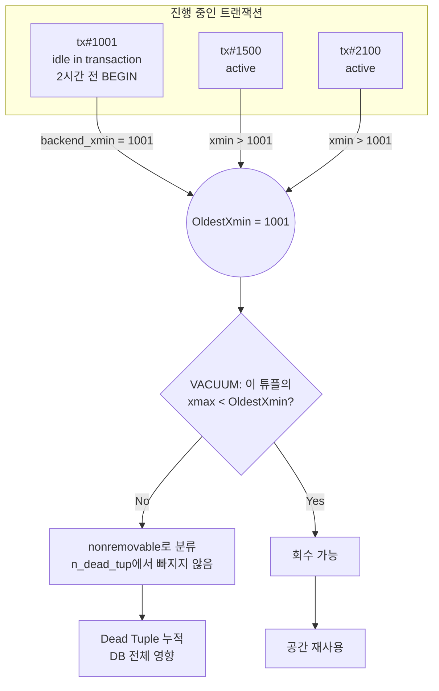
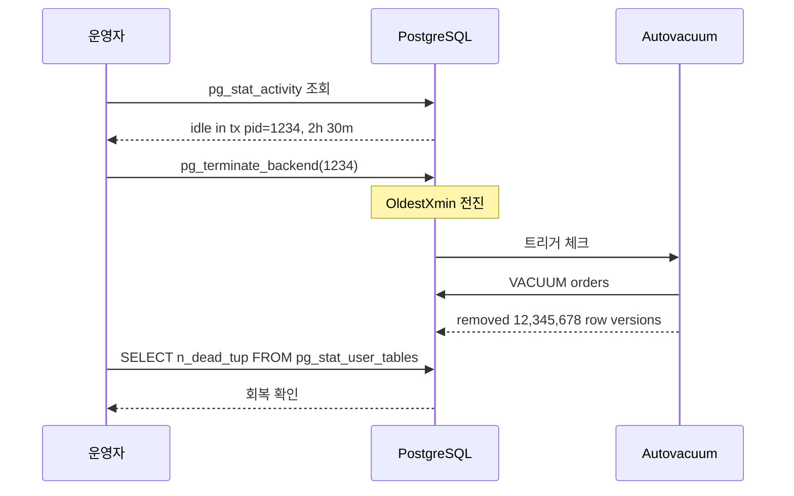

# A3. 긴 트랜잭션이 VACUUM을 막는다 — Dead Tuple은 늘고 공간은 안 돌아온다

> **증상 한 줄**: `pg_stat_user_tables.n_dead_tup`이 **전체 DB 테이블에서 동시에** 계속 올라가고, autovacuum이 열심히 돌아도 Dead Tuple이 줄지 않는다. 원인은 대개 **하나의 `idle in transaction` 세션**.

## 증상

| 지표 | 정상 | 장애 상황 |
|------|------|-----------|
| `n_dead_tup` 추세 | 주기적으로 감소 | 단조 증가 (autovacuum이 돌아도) |
| `last_autovacuum` | 최근 | 최근이지만 효과 없음 |
| `pg_stat_activity`에 `state='idle in transaction'` | 없음/단기 | 수 시간~수 일 유지되는 세션 존재 |
| OldestXmin | 현재 XID 근처 | 며칠 전 XID 고정 |
| `age(datfrozenxid)` | 안정 | 서서히 증가 |

단서: "autovacuum 로그에는 `removed 0 row versions`가 찍힌다" → VACUUM은 성공했는데 **회수 가능한 dead tuple이 0개**로 인식됐다는 뜻. 이게 핵심 시그널이다.

---

## 실제 상황 (재현 시나리오)

### 전형적인 원인 3종

1. **어플리케이션의 `BEGIN;` 후 커밋 누락** — ORM에서 `session.begin()`만 하고 예외 처리에서 `commit()`/`rollback()`을 빠뜨린 케이스.
2. **장시간 조회용 리포팅 쿼리** — 분석가가 `BEGIN; SELECT ... large table;`을 새벽에 띄워두고 퇴근.
3. **psql 세션을 열어두고 자리 비움** — DBA 본인의 실수.

### 재현

```sql
-- Terminal A
BEGIN;
SELECT * FROM orders LIMIT 1;
-- (이 상태로 놔둠)

-- Terminal B: UPDATE 부하 발생
UPDATE orders SET status = 'paid' WHERE status = 'pending';
-- (1시간 뒤)
SELECT n_live_tup, n_dead_tup, last_autovacuum FROM pg_stat_user_tables WHERE relname = 'orders';
-- n_dead_tup는 계속 증가, autovacuum은 돌지만 n_dead_tup가 줄지 않음
```

---

## 원인 분석

### horizon(지평선) 개념

VACUUM은 **"어느 트랜잭션도 더 이상 볼 수 없는" 튜플**만 회수할 수 있다. 즉, 현재 DB 전체에서 가장 오래된 활성 트랜잭션의 snapshot보다 **이전에 삭제/갱신된 튜플**만 제거 대상이다.

```
가장 오래된 활성 tx의 snapshot xmin = OldestXmin
  → VACUUM은 xmax < OldestXmin 인 튜플만 제거 가능
  → 긴 트랜잭션이 OldestXmin을 붙잡고 있으면,
    그 뒤에 생긴 모든 dead tuple은 "살아있는 것으로 간주"되어 회수 불가
```

### 효과

- 테이블이 10개든 1000개든 **DB 전체가 영향**. 긴 트랜잭션 1개가 전부 다 막는다.
- autovacuum은 주기적으로 돌지만 "회수할 게 없다"고 판정하고 그냥 끝난다.
- Dead Tuple이 누적되다 보니 테이블 크기, 인덱스 크기, shared_buffer hit rate 모두 악화.
- 최악의 경우 A2(XID Wraparound)로 이어짐.

### horizon에 관여하는 4종 (모두 체크해야 함)

1. `pg_stat_activity` — 일반 백엔드 세션의 `backend_xmin`
2. `pg_prepared_xacts` — 2PC 준비 트랜잭션
3. `pg_replication_slots.xmin` / `catalog_xmin` — logical slot + hot_standby_feedback
4. 장기 실행 중인 `VACUUM`, `CREATE INDEX CONCURRENTLY` (자체도 스냅샷 유지)

---

## 진단 쿼리 (복붙 가능)

### 1. 가장 오래된 트랜잭션 찾기

```sql
SELECT
    pid,
    usename,
    datname,
    application_name,
    client_addr,
    state,
    backend_xmin,
    xact_start,
    now() - xact_start                       AS xact_duration,
    state_change,
    now() - state_change                     AS since_state_change,
    wait_event_type,
    wait_event,
    left(query, 200)                         AS query
FROM pg_stat_activity
WHERE state <> 'idle'
   OR backend_xmin IS NOT NULL
ORDER BY xact_start NULLS LAST
LIMIT 20;
```

### 2. 특히 `idle in transaction` 만 보기

```sql
SELECT
    pid,
    usename,
    application_name,
    state,
    now() - state_change                     AS idle_for,
    now() - xact_start                       AS xact_age,
    left(query, 200)                         AS last_query
FROM pg_stat_activity
WHERE state = 'idle in transaction'
ORDER BY state_change;
```

### 3. horizon을 막는 **모든 요소** 한눈에 (PostgreSQL 14+ `pg_stat_database`의 확장된 필드 활용)

```sql
WITH horizons AS (
    SELECT 'backend' AS source, pid::text AS id, backend_xmin AS xmin
    FROM pg_stat_activity WHERE backend_xmin IS NOT NULL
    UNION ALL
    SELECT 'prepared', gid, transaction FROM pg_prepared_xacts
    UNION ALL
    SELECT 'slot', slot_name, xmin FROM pg_replication_slots WHERE xmin IS NOT NULL
    UNION ALL
    SELECT 'slot_catalog', slot_name, catalog_xmin FROM pg_replication_slots WHERE catalog_xmin IS NOT NULL
)
SELECT source, id, xmin, age(xmin) AS xmin_age
FROM horizons
ORDER BY age(xmin) DESC
LIMIT 20;
```

### 4. autovacuum이 실제로 dead tuple을 못 회수하고 있는지 확인

```sql
-- VACUUM VERBOSE 출력
VACUUM (VERBOSE) public.orders;
-- INFO:  vacuuming "public.orders"
-- INFO:  "orders": found 0 removable, 12345678 nonremovable row versions
--                                       ^^^^^^^^^^^^^^^^^^
--             "nonremovable"가 크면 → horizon이 막혀있다는 직접 증거
```

---

## 해결 방법

### 즉각 조치

```sql
-- 1) 문제 세션 식별 후 종료
SELECT pg_terminate_backend(pid)
FROM pg_stat_activity
WHERE state = 'idle in transaction'
  AND now() - state_change > interval '15 min';

-- 2) 수동 VACUUM (대상 테이블이 특정되면)
VACUUM (VERBOSE, ANALYZE) public.orders;

-- 3) 2PC 정리
ROLLBACK PREPARED '<gid>';
```

### 근본 조치 — 설정값

```conf
# postgresql.conf
idle_in_transaction_session_timeout = '10min'      # v9.6+, 트랜잭션 유지된 idle만 종료
idle_session_timeout                = '1h'         # v14+, 트랜잭션 없는 idle 세션도 종료
statement_timeout                   = '5min'       # 개별 문 타임아웃

# (참고) 리포팅 전용 유저에게만 길게 허용하고 싶다면
ALTER ROLE analyst SET idle_in_transaction_session_timeout = '1h';
ALTER ROLE analyst SET statement_timeout                    = '30min';
```

### 어플리케이션 레벨

```python
# 잘못된 패턴 (커밋 누락 가능)
with engine.connect() as conn:
    conn.begin()
    do_work(conn)
    # commit 잊음 → idle in transaction

# 올바른 패턴 — 컨텍스트 매니저
with engine.begin() as conn:       # 예외 시 자동 rollback, 정상 종료 시 commit
    do_work(conn)
```

```sql
-- 연결 풀(PgBouncer) 관점
-- pool_mode = transaction 으로 쓰면
-- 어플에서 BEGIN 후 대기 상태가 오래 가면 해당 서버 연결이 실제로 막힘.
-- server_idle_timeout, query_wait_timeout, idle_transaction_timeout 을 pgbouncer.ini에서 설정.
```

### 리포팅/분석 워크로드 분리

- 무거운 분석 트랜잭션은 **standby** 또는 **logical replica**로 보낸다.
- `BEGIN ISOLATION LEVEL REPEATABLE READ; SELECT ...;`이 필요하면 별도 DB로 분리.

---

## 예방 원칙 (체크리스트)

- [ ] `idle_in_transaction_session_timeout`을 **반드시** 설정 (기본 0 = 무제한은 위험).
- [ ] `statement_timeout`을 글로벌/롤별로 명시.
- [ ] 어플리케이션 코드에서 **트랜잭션 컨텍스트 매니저** 사용 강제(코드 리뷰 체크 항목).
- [ ] 모니터링: `pg_stat_activity.xact_start`로 계산한 최장 트랜잭션 지속 시간을 대시보드화.
- [ ] PgBouncer 사용 시 `idle_transaction_timeout`을 적극 활용.
- [ ] 리포팅/ETL 배치는 전용 계정으로 분리해서 별도 timeout 정책 적용.
- [ ] `VACUUM VERBOSE` 로그에서 `nonremovable` 숫자를 주기적으로 확인.

---

## Mermaid — horizon이 막히는 구조



### horizon 해제 후 회복 시퀀스



---

## 관련 챕터

- [03장. MVCC — Snapshot, Visibility](../chapters/ch03_mvcc.md)
- [07장. 트랜잭션과 격리 수준](../chapters/ch07_transactions_isolation.md)
- [08장. VACUUM과 Autovacuum — horizon](../chapters/ch08_vacuum_autovacuum.md)
- [A2. XID Wraparound](A2_xid_wraparound.md)
- [C2. idle in transaction이 DDL을 막는다](C2_idle_in_transaction.md)

## 공식 문서 참조

- [idle_in_transaction_session_timeout](https://www.postgresql.org/docs/current/runtime-config-client.html#GUC-IDLE-IN-TRANSACTION-SESSION-TIMEOUT)
- [Routine Vacuuming — Recovering disk space](https://www.postgresql.org/docs/current/routine-vacuuming.html#VACUUM-BASICS)
- [pg_stat_activity](https://www.postgresql.org/docs/current/monitoring-stats.html#MONITORING-PG-STAT-ACTIVITY-VIEW)
