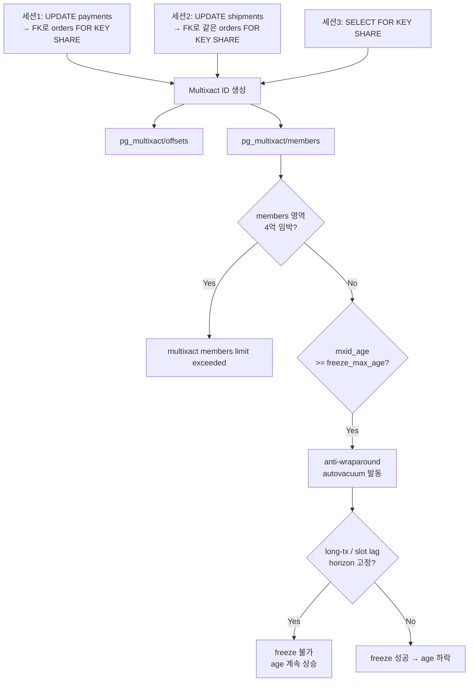
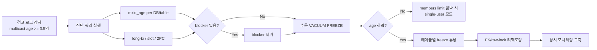
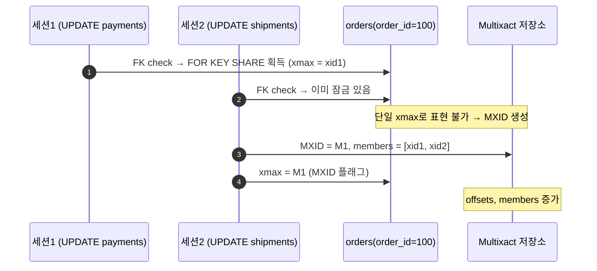

# A4. Multixact ID Wraparound — `multixact "members" limit exceeded`

> **증상 한 줄**: 일반 XID Wraparound는 잠잠한데 `multixact "members" limit exceeded` 혹은 `database must be vacuumed within N multixacts` 경고가 뜨고, 어느 순간 autovacuum이 anti-wraparound 모드로 공격적으로 돌면서 일반 쿼리의 I/O가 치솟는다.

## 증상

| 지표 | 정상 | 주의 | 장애 상황 |
|------|------|------|-----------|
| `mxid_age(datminmxid)` | ~1억 미만 | 2~3억 | **4억 임박** (`autovacuum_multixact_freeze_max_age` 초과) |
| 로그 메시지 | 조용 | `autovacuum: VACUUM ... (to prevent wraparound)` | `database "foo" must be vacuumed within N multixacts` |
| pg_multixact 디렉터리 크기 | 수십 MB | 수백 MB | **수 GB** (members/offsets) |
| autovacuum worker 상태 | 일상 VACUUM | anti-wraparound 일부 | 전 worker가 anti-wraparound 점유 |
| 일반 SELECT 지연 | 2 ms | 5 ms | 30~200 ms (I/O 경합) |

공통 로그 패턴:

```
WARNING:  database "shop" must be vacuumed within 98765432 multixacts
HINT:  To avoid a database shutdown, execute a database-wide VACUUM in that database.
ERROR:  multixact "members" limit exceeded
DETAIL:  This command would create a multixact with 1234567 members, but the remaining space only allows for ...
```

`pg_stat_activity`에는 `FOR KEY SHARE`, `FOR SHARE` 잠금을 얻는 SELECT가 평소보다 많이 누적되어 있다.

---

## 실제 상황 (재현 시나리오)

### 스키마 & 부하 조건

전형적인 커머스/결제 도메인.

```sql
CREATE TABLE users (
    user_id     bigserial PRIMARY KEY,
    email       text UNIQUE NOT NULL,
    status      text NOT NULL DEFAULT 'active'
);

CREATE TABLE orders (
    order_id    bigserial PRIMARY KEY,
    user_id     bigint NOT NULL REFERENCES users(user_id),   -- FK
    status      text NOT NULL,
    total       numeric(12,2),
    created_at  timestamptz DEFAULT now()
);

CREATE TABLE payments (
    payment_id  bigserial PRIMARY KEY,
    order_id    bigint NOT NULL REFERENCES orders(order_id), -- FK
    method      text NOT NULL,
    paid_at     timestamptz
);

CREATE TABLE shipments (
    shipment_id bigserial PRIMARY KEY,
    order_id    bigint NOT NULL REFERENCES orders(order_id), -- FK
    carrier     text,
    tracking    text
);
```

- `orders.user_id`, `payments.order_id`, `shipments.order_id` 모두 FK.
- 한 주문 처리 중 결제·배송·알림 서비스가 **동시에** 해당 `orders` 행을 참조한다.
- 초당 수천 건 트랜잭션, 대부분 짧지만 일부 장기 트랜잭션이 섞임.

### 타임라인 (3주간 서서히 쌓임)

```
Day  1: autovacuum_multixact_freeze_max_age = 400,000,000 (기본)
        mxid_age(datminmxid) = 50,000,000 — 정상
Day  7: 결제-정산 배치가 SELECT FOR KEY SHARE로 orders를 대량 잠금
        mxid_age = 180,000,000
Day 14: long-running analytic 트랜잭션이 datminmxid를 붙잡음
        mxid_age = 320,000,000 — 경고 로그 시작
Day 19: anti-wraparound autovacuum이 전 worker 점유, I/O 급증
        mxid_age = 385,000,000
Day 21: members 영역 고갈 → multixact "members" limit exceeded
        일부 쿼리 실패, 긴급 장애 대응
```

---

## 원인 분석

### Multixact ID란 무엇인가

- 일반 트랜잭션 XID는 `xmin`/`xmax`로 **단일 트랜잭션**만 기록한다.
- 한 row에 **여러 트랜잭션이 동시에** 잠금을 걸 때(예: `SELECT ... FOR KEY SHARE` 여러 세션, 또는 FK 제약 검사를 위한 row lock 다수), 단일 `xmax`로는 표현할 수 없다.
- 이때 **Multixact ID(MXID)** 를 `xmax`에 기록하고, 실제 참여 트랜잭션 목록은 `pg_multixact/members`, `pg_multixact/offsets`에 별도로 저장한다.
- MXID도 XID와 마찬가지로 **32비트**이며, 사용 가능 범위는 약 **~21억** (실질적 경고 임계는 `autovacuum_multixact_freeze_max_age` = 기본 4억).

### 왜 FK가 문제인가

PostgreSQL 9.3부터 FK 제약 검사는 `ROW SHARE` 수준의 잠금(즉 `SELECT ... FOR KEY SHARE`)을 사용한다. 참조하는 자식 행을 INSERT/UPDATE할 때 **부모 행을 `KEY SHARE`로 잡는다**.

```
UPDATE payments SET paid_at = now() WHERE order_id = 100;
  ↳ orders(order_id=100)에 FOR KEY SHARE 암묵 획득
UPDATE shipments SET tracking = 'xyz' WHERE order_id = 100;  (동시 세션)
  ↳ 같은 orders(100)에 FOR KEY SHARE 두 번째 획득
→ 두 트랜잭션이 동시에 같은 row에 잠금 → Multixact 생성
```

FK가 많고 병렬도가 높을수록 Multixact가 빠르게 소진된다.

### 두 가지 한계: offsets와 members

Multixact는 두 개의 한계선이 있다:

1. **offsets** — MXID 자체의 개수 (기본 임계 `autovacuum_multixact_freeze_max_age = 400M`)
2. **members** — 각 MXID에 참여하는 트랜잭션 목록의 총합 (임계 `autovacuum_multixact_freeze_max_age` 외에 `multixact_member_buffer` 관련 내부 상한이 별도)

`members` 영역이 먼저 고갈되는 경우가 흔하다 — 하나의 MXID에 수십 명의 참여자가 붙으면 빠르게 찬다.

### 왜 autovacuum이 못 따라가는가

- Autovacuum은 `relminmxid`가 `autovacuum_multixact_freeze_max_age`를 초과한 테이블을 **anti-wraparound** 모드로 VACUUM한다.
- long-running transaction / replication slot lag / 2PC prepared가 `datminmxid` 진행을 **block**하면 autovacuum이 freeze를 해도 horizon이 안 밀린다.
- 즉, XID wraparound와 **같은 블로커들**이 Multixact에도 영향을 준다.

### 흐름 요약



---

## 진단 쿼리 (복붙 가능)

### 1. 데이터베이스별 MXID age — 가장 먼저 볼 것

```sql
SELECT
    datname,
    age(datfrozenxid)                       AS xid_age,
    mxid_age(datminmxid)                    AS mxid_age,
    pg_size_pretty(pg_database_size(datname)) AS db_size
FROM pg_database
ORDER BY mxid_age(datminmxid) DESC;
-- 정상:  mxid_age < 1억
-- 주의:  1~3억
-- 위험:  3.5억 이상 (freeze_max_age 임박)
```

### 2. 현재 설정값 확인

```sql
SELECT name, setting, unit, short_desc
FROM pg_settings
WHERE name IN (
    'autovacuum_multixact_freeze_max_age',
    'vacuum_multixact_freeze_min_age',
    'vacuum_multixact_freeze_table_age',
    'autovacuum_freeze_max_age',
    'autovacuum_naptime'
);
```

### 3. 테이블별 relminmxid age 상위 20

```sql
SELECT
    c.oid::regclass                         AS table,
    age(c.relfrozenxid)                     AS xid_age,
    mxid_age(c.relminmxid)                  AS mxid_age,
    pg_size_pretty(pg_relation_size(c.oid)) AS size,
    s.last_autovacuum,
    s.autovacuum_count
FROM pg_class c
LEFT JOIN pg_stat_user_tables s ON s.relid = c.oid
WHERE c.relkind IN ('r', 'm', 't')            -- 테이블/머티뷰/toast
ORDER BY mxid_age(c.relminmxid) DESC NULLS LAST
LIMIT 20;
```

### 4. Horizon을 막는 세션/슬롯 탐지

```sql
-- (a) 오래된 트랜잭션
SELECT pid, usename, state, xact_start,
       now() - xact_start AS xact_duration,
       backend_xmin, query
FROM pg_stat_activity
WHERE state IN ('active', 'idle in transaction', 'idle in transaction (aborted)')
  AND xact_start IS NOT NULL
ORDER BY xact_start ASC
LIMIT 10;

-- (b) 비활성 replication slot
SELECT slot_name, active, restart_lsn,
       pg_wal_lsn_diff(pg_current_wal_lsn(), restart_lsn) AS lag_bytes
FROM pg_replication_slots
WHERE NOT active OR pg_wal_lsn_diff(pg_current_wal_lsn(), restart_lsn) > 1e9;

-- (c) 2PC prepared transactions
SELECT gid, prepared, owner, database FROM pg_prepared_xacts
ORDER BY prepared ASC;
```

### 5. Multixact 디렉터리 크기 (OS 레벨)

```sql
-- 데이터 디렉터리 기준 (superuser)
SELECT pg_size_pretty(sum((pg_stat_file(name)).size)) AS members_size
FROM pg_ls_dir('pg_multixact/members') AS t(name);

SELECT pg_size_pretty(sum((pg_stat_file(name)).size)) AS offsets_size
FROM pg_ls_dir('pg_multixact/offsets') AS t(name);
```

### 6. FK·row-lock 쿼리 패턴 탐지

```sql
-- pg_stat_statements로 FOR KEY SHARE / FOR SHARE 쿼리 상위
-- 한 번만: CREATE EXTENSION pg_stat_statements;
SELECT calls, total_exec_time::int AS total_ms,
       mean_exec_time::numeric(10,2) AS mean_ms,
       left(query, 120) AS query
FROM pg_stat_statements
WHERE query ILIKE '%for key share%'
   OR query ILIKE '%for share%'
ORDER BY calls DESC
LIMIT 20;
```

### 7. anti-wraparound autovacuum worker 현황

```sql
SELECT pid, datname, query, state,
       now() - query_start AS running,
       backend_xmin
FROM pg_stat_activity
WHERE backend_type = 'autovacuum worker'
  AND query ILIKE '%prevent wraparound%';
```

---

## 해결 방법

### 즉시 조치 — 서비스가 죽기 직전

1. **장기 트랜잭션·비활성 슬롯 즉시 제거** (가장 빠른 효과)

```sql
-- idle in transaction 강제 종료 (신중히)
SELECT pg_terminate_backend(pid)
FROM pg_stat_activity
WHERE state = 'idle in transaction'
  AND now() - xact_start > interval '10 minutes';

-- 비활성 replication slot 드롭 (소비자 상태 확인 후)
SELECT pg_drop_replication_slot('stale_slot_name');

-- prepared transaction 정리
ROLLBACK PREPARED 'gid_here';
```

2. **수동 VACUUM** — anti-wraparound autovacuum을 기다리지 말고 직접

```sql
-- 전체 DB freeze — maintenance window 동안
VACUUM (FREEZE, VERBOSE);

-- 특정 테이블만 (우선순위 높은 것부터)
VACUUM (FREEZE, VERBOSE, PARALLEL 4) public.orders;
```

> 일반 `VACUUM`도 `relminmxid`를 전진시킨다. `FREEZE` 옵션은 더 공격적으로 truncate한다. Multixact 한정 처리가 목적이면 일반 `VACUUM`도 OK.

3. **members limit exceeded** 에러가 이미 난 경우 — 단일 유저 모드 복구 시나리오

```bash
# 최악의 경우 (DB가 쓰기 거부) — 공식 문서 복구 절차
pg_ctl stop -D $PGDATA
postgres --single -D $PGDATA postgres
# 단일 유저 모드에서
VACUUM FREEZE;
```

### 단계별 조치 — 완화

#### (a) 테이블별 freeze 튜닝

```sql
-- FK 타깃이 되는 부모 테이블은 더 공격적으로
ALTER TABLE public.orders SET (
    autovacuum_multixact_freeze_max_age = 150000000,   -- 기본 4억 → 1.5억
    autovacuum_freeze_max_age           = 150000000,
    autovacuum_vacuum_scale_factor      = 0.05
);

ALTER TABLE public.users SET (
    autovacuum_multixact_freeze_max_age = 150000000,
    autovacuum_freeze_max_age           = 150000000
);
```

#### (b) 전역 설정 재점검 (postgresql.conf)

```conf
# 기본값들 (v14~v17 동일)
autovacuum_multixact_freeze_max_age = 200000000    # 기본 4억 → 2억으로 인하
autovacuum_freeze_max_age           = 150000000    # XID도 함께
autovacuum_max_workers              = 5             # 기본 3
autovacuum_naptime                  = 20s           # 기본 1min
vacuum_multixact_freeze_min_age     = 5000000       # 기본 5M
vacuum_multixact_freeze_table_age   = 150000000     # 기본 1.5억
maintenance_work_mem                = 1GB           # VACUUM 인덱스 단계 가속
```

> `freeze_max_age`를 너무 낮추면 VACUUM 부하가 상시 높아진다. 2~3억 수준이 현실적 타협점.

#### (c) v14+ failsafe 확인

PostgreSQL 14부터 `vacuum_failsafe_age`, `vacuum_multixact_failsafe_age`(기본 16억)가 도입되어 wraparound 임박 시 cost-based throttling을 무시하고 최대 속도로 VACUUM한다. 이 값이 기본으로 켜져 있는지 확인.

```sql
SELECT name, setting FROM pg_settings
WHERE name IN ('vacuum_failsafe_age', 'vacuum_multixact_failsafe_age');
```

### 근본 조치 — 재발 방지

1. **FK 관계에서 `SELECT FOR SHARE`/`FOR KEY SHARE` 남발 리팩토링**
   - 불필요한 `FOR SHARE` 제거 (단순 읽기라면 잠금 불필요).
   - 긴 트랜잭션 안에서 `FOR UPDATE` → `FOR NO KEY UPDATE`로 하향 조정 가능한지 검토 (FK 영향 최소화).
2. **짧은 트랜잭션 규율**
   - `idle_in_transaction_session_timeout = 60s` 등 타임아웃 설정.
   - 외부 API 호출을 트랜잭션 **바깥**으로 분리.
3. **Replication slot 감시**
   - 비활성 slot 경보, slot lag 대시보드.
4. **배치 설계**
   - 정산·리포트 배치가 거대한 단일 트랜잭션으로 FK 타깃을 광범위 잠그지 않도록 chunk 처리.
5. **모니터링**
   - `mxid_age(datminmxid)`, `members/offsets` 디렉터리 크기를 대시보드에 상시.

---

## 예방 원칙 (체크리스트)

- [ ] `mxid_age(datminmxid)` 를 **XID age와 함께** 대시보드에 표시한다 (임계 2억 경보).
- [ ] 비활성 replication slot / 오래된 2PC / 장기 트랜잭션 **3종 세트**를 상시 감시한다.
- [ ] `idle_in_transaction_session_timeout` 과 `statement_timeout` 을 항상 설정한다.
- [ ] FK가 많은 부모 테이블에는 `autovacuum_multixact_freeze_max_age` 를 테이블별로 낮춘다 (1.5~2억).
- [ ] 애플리케이션 코드에서 불필요한 `SELECT ... FOR SHARE` / `FOR KEY SHARE` 를 정기 코드 리뷰한다.
- [ ] PostgreSQL **14 이상**으로 업그레이드하여 `vacuum_multixact_failsafe_age` 를 활용한다.
- [ ] 대형 배치는 chunk 단위로 쪼개 긴 트랜잭션을 만들지 않는다.
- [ ] 월 1회 `VACUUM (FREEZE)` 를 전 DB에 예방적으로 실행 (low-traffic 시간대).

---

## Mermaid — 조치 순서 (incident response)



### Multixact 생성 타임라인



---

## 관련 챕터 / 치트시트 / 다른 케이스

- [03장. MVCC — xmin/xmax/MXID](../chapters/ch03_mvcc.md)
- [07장. 트랜잭션과 격리 수준 — Row Lock 모드](../chapters/ch07_transactions_isolation.md)
- [08장. VACUUM과 Autovacuum — anti-wraparound](../chapters/ch08_vacuum_autovacuum.md)
- [14장. 모니터링과 트러블슈팅](../chapters/ch14_monitoring_troubleshooting.md)
- [cheatsheets/vacuum_tuning.md](../cheatsheets/vacuum_tuning.md)
- [cheatsheets/pg_stat_queries.md](../cheatsheets/pg_stat_queries.md)
- 관련 케이스: [A2. XID Wraparound](./A2_xid_wraparound.md), [A3. 장기 트랜잭션이 VACUUM을 막는다](./A3_long_tx_blocks_vacuum.md), [C2. idle in transaction](./C2_idle_in_transaction.md)

## 공식 문서 참조

- [Preventing Multixact Wraparound Failures](https://www.postgresql.org/docs/current/routine-vacuuming.html#VACUUM-FOR-MULTIXACT-WRAPAROUND)
- [Explicit Locking — Row-Level Locks](https://www.postgresql.org/docs/current/explicit-locking.html#LOCKING-ROWS)
- [Routine Vacuuming — Preventing Transaction ID Wraparound Failures](https://www.postgresql.org/docs/current/routine-vacuuming.html#VACUUM-FOR-WRAPAROUND)
- [PostgreSQL 14 Release Notes — vacuum_failsafe_age](https://www.postgresql.org/docs/14/release-14.html)
