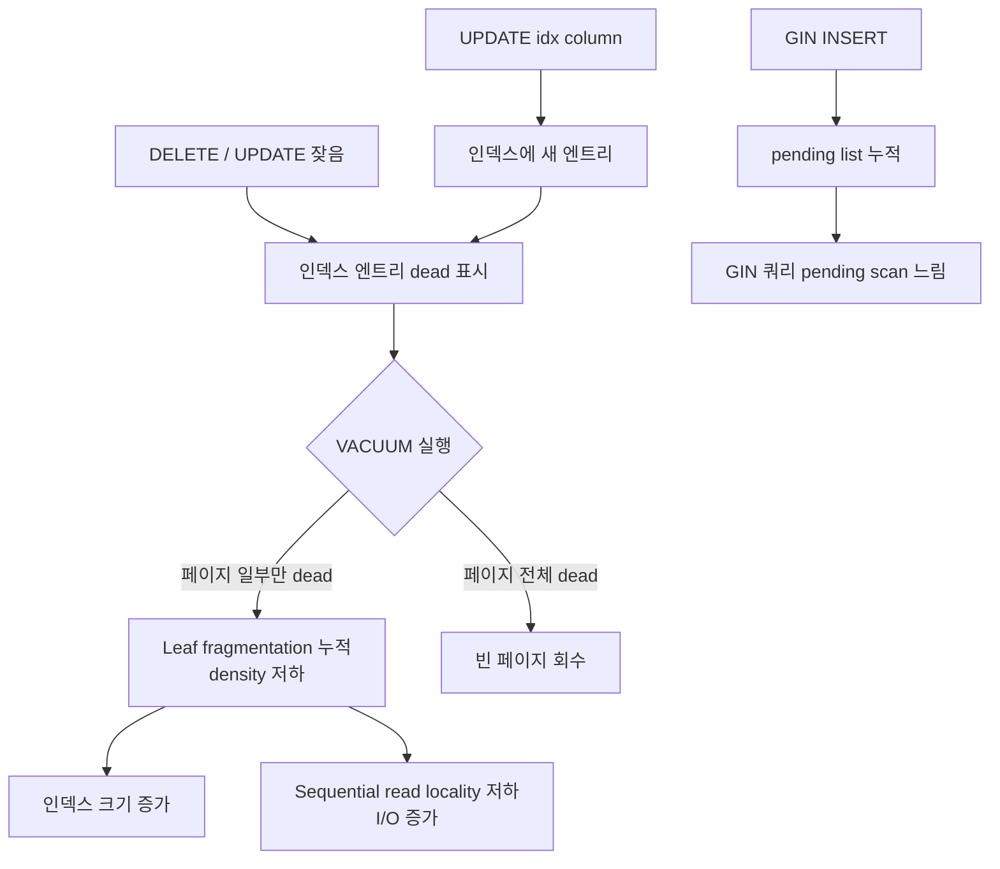
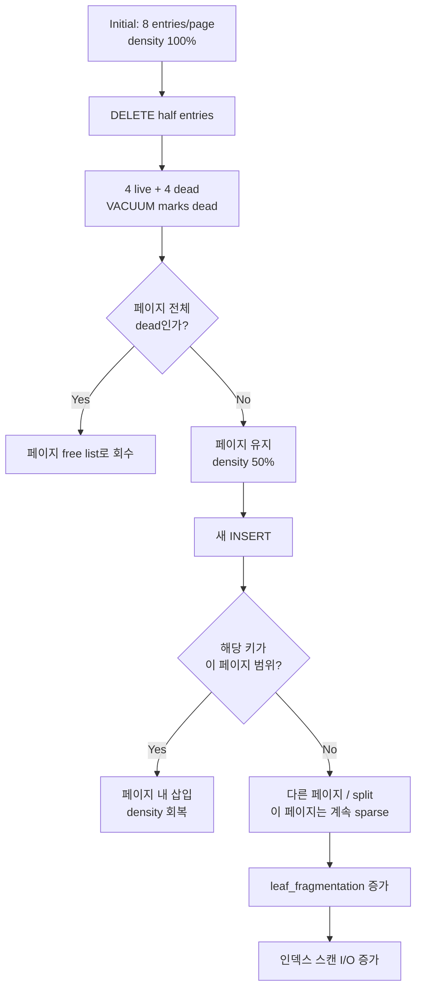
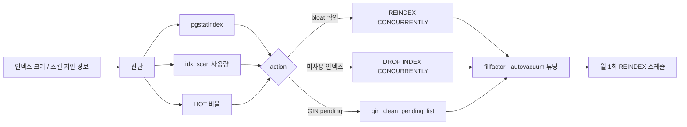

# A5. 인덱스 단독 Bloat — 테이블은 멀쩡한데 인덱스만 비대해진다

> **증상 한 줄**: 테이블 bloat는 정상인데 **인덱스만** 2~5배로 커지고, 인덱스 스캔의 `shared_hit` 비율이 떨어지면서 원래 밀리초 쿼리가 수십~수백 밀리초로 느려진다.

## 증상

| 지표 | 정상 | 장애 상황 |
|------|------|-----------|
| `pg_relation_size(table)` | 20 GB | 22 GB (정상) |
| `pg_indexes_size(table)` | 8 GB | 32 GB (인덱스 4배) |
| pgstatindex `avg_leaf_density` | 85~90% | 30~45% |
| pgstatindex `leaf_fragmentation` | < 10% | 40~70% |
| 인덱스 스캔 평균 지연 | 1~2 ms | 20~80 ms |
| `idx_blks_hit` 비율 | 99%+ | 70~85% |
| GIN pending list 크기 | 0 B | 수백 MB |

전형적인 경험담:
- `VACUUM FULL`을 돌려도 **테이블은 안 줄고 인덱스만** 줄어든다.
- `pg_stat_user_tables.n_dead_tup` 비율은 5% 미만으로 건강한데 SELECT가 느리다.
- `REINDEX INDEX CONCURRENTLY`를 한 번 돌리면 쿼리가 즉시 정상화된다 (한 달 뒤 또 느려짐).
- GIN 인덱스에 FTS(`to_tsvector`)·JSONB 인덱스가 걸린 테이블에서 유독 발생.

---

## 실제 상황 (재현 시나리오)

### 스키마 — 삭제·업데이트가 잦은 상태 테이블

```sql
CREATE TABLE sessions (
    session_id    uuid PRIMARY KEY,
    user_id       bigint NOT NULL,
    expires_at    timestamptz NOT NULL,
    last_seen     timestamptz NOT NULL,   -- 5초마다 UPDATE
    metadata      jsonb NOT NULL
);

CREATE INDEX idx_sessions_user      ON sessions (user_id);
CREATE INDEX idx_sessions_expires   ON sessions (expires_at);
CREATE INDEX idx_sessions_last_seen ON sessions (last_seen);          -- UPDATE 대상 컬럼 인덱스
CREATE INDEX idx_sessions_meta_gin  ON sessions USING gin (metadata); -- GIN
```

- 동시 세션 1천만 건, 초당 20만 UPDATE (last_seen 갱신).
- 매 10분마다 배치가 `DELETE FROM sessions WHERE expires_at < now()` — 한 번에 수십만 건.
- INSERT도 초당 1000건.

### 타임라인

```
Day  0: REINDEX 직후 — idx_sessions_user = 1.2 GB, avg_leaf_density 90%
Day  7: 2.1 GB, density 75% — 아무도 눈치 못 챔
Day 14: 3.8 GB, density 55% — 쿼리 p99 10ms → 35ms
Day 21: 5.4 GB, density 42%, fragmentation 55% — SRE 경보
Day 28: 6.9 GB, density 33% — REINDEX CONCURRENTLY 수행
```

---

## 원인 분석

### 왜 인덱스만 bloat되는가

VACUUM은 **힙 페이지**에서 dead tuple을 수거하면서 인덱스 엔트리도 함께 지운다. 그러나:

1. **인덱스 페이지는 page 단위로만 회수된다.** 한 페이지 안의 튜플이 **모두 dead**가 되어야 빈 페이지로 free list에 반환된다. 일부만 dead면 그 페이지는 그대로 남는다.
2. **B-tree는 structure-preserving**. 내부 노드 분할(split)은 발생하지만 병합(merge)은 제한적. 삭제가 많아도 트리 구조는 느리게 축소된다.
3. **fragmentation**. B-tree leaf는 정렬된 상태를 유지해야 하므로, random 삭제 후 "구멍"은 남고 새 삽입은 다른 위치에 들어간다 → leaf density 저하.
4. **HOT update 실패**. 인덱스 컬럼을 UPDATE하면 해당 인덱스에 **매번 새 엔트리**가 추가된다. 구 엔트리는 VACUUM으로 지워지지만 페이지 회수는 별도 문제.

### B-tree 페이지 분할·삭제 패턴

```
초기:         [10|20|30|40|50|60|70|80]   ← 8 entries, 100%
일부 삭제:    [10| _|30| _|50| _|70| _]   ← 50% occupied
삽입(21):     [10| _|21|30| _|50| _|70| _| 80 새 페이지 분할]
            페이지 내 덧씀도 있지만 fragmentation은 계속 증가
```

VACUUM은 dead entry는 지워도 빈 페이지 수거 (`btree_vacuum_page`)는 매우 제한적.

### GIN 인덱스의 추가 함정 — pending list

GIN 인덱스에는 `FASTUPDATE=on` (기본)이 있어, INSERT 시 **즉시 GIN 트리에 반영하지 않고** pending list에 버퍼링한다. 나중에 VACUUM 또는 `gin_clean_pending_list()` 호출 시 실제 트리로 병합된다.

- pending list가 계속 커지면 GIN 쿼리 시 pending을 순차 스캔 → 쿼리 극저하.
- Autovacuum이 GIN에 대해 충분히 자주 돌지 않으면 pending이 수백 MB까지 누적.

### 전형적인 악순환



---

## 진단 쿼리 (복붙 가능)

### 1. 인덱스 크기 상위 + 사용량 교차 확인

```sql
SELECT
    schemaname || '.' || relname                         AS table,
    indexrelname                                         AS index,
    pg_size_pretty(pg_relation_size(indexrelid))         AS idx_size,
    idx_scan,
    idx_tup_read,
    idx_tup_fetch,
    CASE WHEN idx_scan = 0 THEN 'UNUSED'
         WHEN idx_scan < 100 THEN 'RARELY'
         ELSE 'OK'
    END                                                  AS usage
FROM pg_stat_user_indexes
ORDER BY pg_relation_size(indexrelid) DESC
LIMIT 30;
```

### 2. pgstatindex — leaf density, fragmentation (정확)

```sql
-- 한 번만: CREATE EXTENSION pgstattuple;
SELECT
    i.relname                    AS index,
    pg_size_pretty(pg_relation_size(i.oid)) AS size,
    s.avg_leaf_density,
    s.leaf_fragmentation,
    s.leaf_pages,
    s.empty_pages,
    s.deleted_pages,
    s.internal_pages
FROM pg_class i
JOIN pg_index x    ON x.indexrelid = i.oid
JOIN pg_class t    ON t.oid = x.indrelid
CROSS JOIN LATERAL pgstatindex(i.oid::regclass::text) s
WHERE t.relname = 'sessions'
ORDER BY s.avg_leaf_density ASC;
-- 건강: avg_leaf_density > 80, leaf_fragmentation < 20
-- bloat: avg_leaf_density < 60, leaf_fragmentation > 40
```

### 3. PostgreSQL Wiki 인덱스 bloat 추정 쿼리 (확장 없이)

```sql
-- 대략적 bloat 추정 (wiki.postgresql.org/wiki/Index_Maintenance)
WITH idx AS (
    SELECT
        c.oid                                  AS idxoid,
        c.relname                              AS idxname,
        t.relname                              AS tblname,
        c.reltuples                            AS est_rows,
        c.relpages                             AS pages,
        pg_relation_size(c.oid)                AS idx_bytes
    FROM pg_class c
    JOIN pg_index x ON x.indexrelid = c.oid
    JOIN pg_class t ON t.oid = x.indrelid
    WHERE c.relkind = 'i' AND t.relkind = 'r'
)
SELECT
    tblname, idxname,
    pg_size_pretty(idx_bytes)                          AS size,
    est_rows,
    pages,
    round(idx_bytes::numeric / NULLIF(est_rows,0), 1)  AS bytes_per_row
FROM idx
ORDER BY idx_bytes DESC
LIMIT 20;
-- bytes_per_row 가 인덱스 평균보다 비정상적으로 크면 bloat 의심
```

### 4. GIN pending list 크기

```sql
SELECT
    i.relname                AS index,
    gin_metapage_info(get_raw_page(i.relname::regclass::text, 0)) AS meta
FROM pg_class i
JOIN pg_index x ON x.indexrelid = i.oid
JOIN pg_am am   ON am.oid = i.relam
WHERE am.amname = 'gin';

-- 또는 간단히 pending list 현황 (extension pageinspect)
-- 한 번만: CREATE EXTENSION pageinspect;
SELECT * FROM gin_metapage_info(get_raw_page('idx_sessions_meta_gin', 0));
-- pending_head/pending_tail 페이지 차이가 크면 pending list가 길다
```

### 5. HOT 업데이트 실패율 (인덱스 bloat 선행 지표)

```sql
SELECT
    schemaname || '.' || relname AS table,
    n_tup_upd,
    n_tup_hot_upd,
    CASE WHEN n_tup_upd = 0 THEN NULL
         ELSE round(100.0 * n_tup_hot_upd / n_tup_upd, 1)
    END AS hot_pct
FROM pg_stat_user_tables
WHERE n_tup_upd > 10000
ORDER BY n_tup_upd DESC;
-- hot_pct < 30 이면 인덱스 bloat 가속
```

### 6. 인덱스 스캔 I/O 효율

```sql
SELECT
    schemaname || '.' || indexrelname AS index,
    idx_blks_read,
    idx_blks_hit,
    CASE WHEN idx_blks_read + idx_blks_hit = 0 THEN NULL
         ELSE round(100.0 * idx_blks_hit / (idx_blks_read + idx_blks_hit), 2)
    END AS hit_ratio
FROM pg_statio_user_indexes
WHERE idx_blks_read + idx_blks_hit > 1000
ORDER BY hit_ratio ASC
LIMIT 20;
-- hit_ratio < 90% 이면 cold, bloat 원인 가능
```

### 7. 인덱스 정의 확인 (중복·미사용 탐지)

```sql
SELECT indrelid::regclass AS table,
       indexrelid::regclass AS index,
       pg_get_indexdef(indexrelid) AS definition,
       indisvalid, indisready
FROM pg_index
WHERE indrelid = 'public.sessions'::regclass;
```

---

## 해결 방법

### 즉시 조치 — 장애 쿼리 살리기

#### (a) REINDEX CONCURRENTLY (v12+)

```sql
-- 개별 인덱스 (권장, AccessExclusiveLock 없음)
REINDEX INDEX CONCURRENTLY public.idx_sessions_user;

-- 테이블의 모든 인덱스 (v12+)
REINDEX TABLE CONCURRENTLY public.sessions;

-- DB 전체 (매우 조심)
REINDEX DATABASE CONCURRENTLY shop;  -- v12+
```

> `REINDEX CONCURRENTLY`는 `ROW EXCLUSIVE` 수준 잠금만 사용. 단, 작업 중 임시로 인덱스 크기 2배 필요.

#### (b) GIN pending list 즉시 정리

```sql
-- FASTUPDATE GIN의 pending list를 실제 트리로 병합
SELECT gin_clean_pending_list('public.idx_sessions_meta_gin');
```

#### (c) 긴급 시 — 백업 스왑

큰 인덱스라 REINDEX CONCURRENTLY가 너무 오래 걸리면:

```sql
-- 새 인덱스를 다른 이름으로 생성 후 스왑
CREATE INDEX CONCURRENTLY idx_sessions_user_new ON public.sessions (user_id);
BEGIN;
DROP INDEX idx_sessions_user;
ALTER INDEX idx_sessions_user_new RENAME TO idx_sessions_user;
COMMIT;
```

### 단계별 조치 — 완화

#### (a) fillfactor 조정 (B-tree 기본 90)

```sql
-- UPDATE 잦은 인덱스는 fillfactor를 낮춰 페이지 내 여유 확보
ALTER INDEX public.idx_sessions_user SET (fillfactor = 80);
REINDEX INDEX CONCURRENTLY public.idx_sessions_user;
```

> B-tree 인덱스 기본 fillfactor는 90. Unique 인덱스나 insert-only면 90 유지, update-heavy면 80~85.

#### (b) GIN FASTUPDATE / pending_list 튜닝

```sql
-- GIN pending list 임계 설정 (기본 4MB)
ALTER INDEX public.idx_sessions_meta_gin SET (gin_pending_list_limit = 16384);  -- 16MB (KB 단위)

-- 또는 FASTUPDATE 끄기 (INSERT 시 즉시 트리 갱신, INSERT 느려짐)
ALTER INDEX public.idx_sessions_meta_gin SET (fastupdate = off);
```

#### (c) 테이블별 autovacuum 튜닝 (HOT 비율 회복)

```sql
ALTER TABLE public.sessions SET (
    fillfactor = 80,                                 -- HOT update 공간 확보
    autovacuum_vacuum_scale_factor = 0.02,           -- 기본 0.2 → 0.02
    autovacuum_vacuum_insert_scale_factor = 0.05,    -- v13+
    autovacuum_analyze_scale_factor = 0.02
);
-- 이후 테이블 재작성
-- pg_repack -d shop -t public.sessions
```

### 근본 조치 — 재발 방지

1. **인덱스 정리**
   - `idx_scan = 0` 또는 `< 100` 인덱스는 **DROP**. 인덱스가 적을수록 bloat 총량이 준다.
   - 중복 인덱스 제거 (`(a, b)` 있으면 `(a)` 불필요).
2. **HOT update 유지**
   - 자주 UPDATE되는 컬럼에 인덱스를 걸지 않는다. 꼭 필요하면 partial/expression index로.
3. **파티셔닝**
   - 시계열 데이터라면 파티셔닝 후 오래된 파티션은 `DROP` (VACUUM/REINDEX 불필요).
4. **정기 REINDEX 스케줄**
   - 대형 update-heavy 테이블은 월 1회 `REINDEX CONCURRENTLY`를 maintenance window에 수행.
5. **pg_repack 인덱스 모드**
   - `pg_repack -i <index_name>` — 단일 인덱스만 online 재구성.

---

## 예방 원칙 (체크리스트)

- [ ] `pg_stat_user_indexes.idx_scan = 0` 인덱스는 분기별로 **DROP**.
- [ ] update-heavy 테이블의 인덱스는 **fillfactor 80**으로 생성·관리.
- [ ] pgstatindex `avg_leaf_density` 를 **주요 인덱스에 한해 월 1회** 측정해 대시보드에 축적.
- [ ] GIN 인덱스에 `gin_pending_list_limit` 를 명시 설정하고, 정기 `gin_clean_pending_list()` 를 스케줄.
- [ ] HOT 비율 (`n_tup_hot_upd / n_tup_upd`) 을 상시 모니터링 — 30% 미만이면 인덱스 재설계 신호.
- [ ] `REINDEX CONCURRENTLY` 사용 (v12+). `REINDEX` 는 AccessExclusiveLock이므로 주의.
- [ ] `VACUUM FULL` 은 **테이블 bloat 제거용**이고 인덱스 단독 bloat에는 `REINDEX` 가 정답.
- [ ] 시계열 데이터는 파티셔닝으로 인덱스 수명을 제한.

---

## Mermaid — B-tree 페이지 fragmentation 진행



### 조치 순서



---

## 관련 챕터 / 치트시트 / 다른 케이스

- [05장. 인덱스 — B-tree/GIN/GiST 구조](../chapters/ch05_indexes.md)
- [04장. Heap/Page — HOT 업데이트와 fillfactor](../chapters/ch04_storage_tuples_toast.md)
- [08장. VACUUM과 Autovacuum](../chapters/ch08_vacuum_autovacuum.md)
- [cheatsheets/vacuum_tuning.md](../cheatsheets/vacuum_tuning.md)
- [cheatsheets/index_selection.md](../cheatsheets/index_selection.md)
- [cheatsheets/pg_stat_queries.md](../cheatsheets/pg_stat_queries.md)
- 관련 케이스: [A1. Bloat 누적](./A1_bloat_accumulation.md), [A3. 장기 트랜잭션이 VACUUM을 막는다](./A3_long_tx_blocks_vacuum.md), [B2. 인덱스가 있는데도 Seq Scan](./B2_seq_scan_with_index.md)

## 공식 문서 참조

- [Routine Reindexing](https://www.postgresql.org/docs/current/routine-reindex.html)
- [REINDEX](https://www.postgresql.org/docs/current/sql-reindex.html) — `CONCURRENTLY` 옵션 (v12+)
- [GIN Tips](https://www.postgresql.org/docs/current/gin-tips.html) — FASTUPDATE와 pending list
- [Index Storage Parameters — fillfactor](https://www.postgresql.org/docs/current/sql-createindex.html#SQL-CREATEINDEX-STORAGE-PARAMETERS)
- [pgstattuple — pgstatindex()](https://www.postgresql.org/docs/current/pgstattuple.html)
- [PostgreSQL Wiki — Index Maintenance](https://wiki.postgresql.org/wiki/Index_Maintenance)
