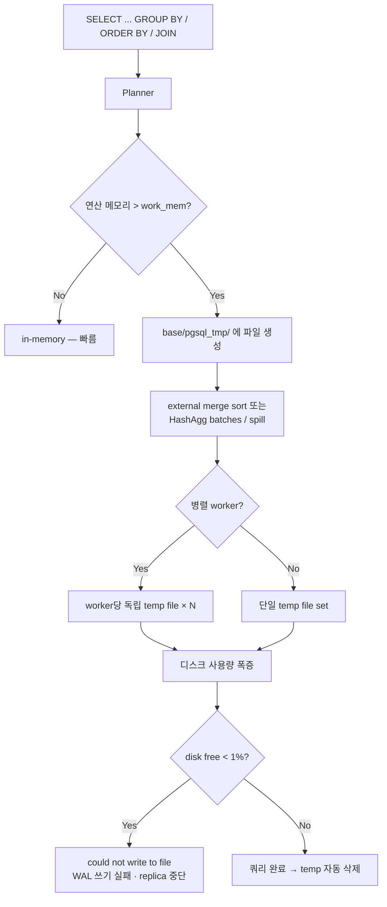
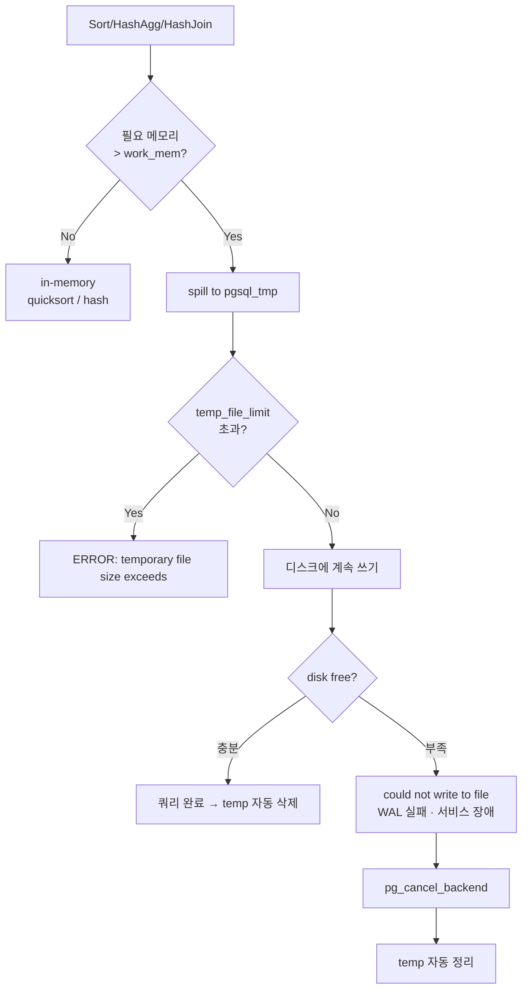
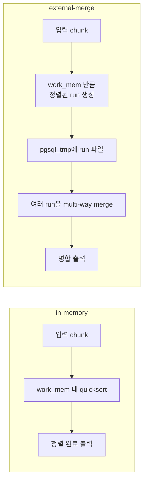

# A6. Temp File로 인한 디스크 풀 — 쿼리 하나가 서비스를 내린다

> **증상 한 줄**: 특정 분석 쿼리 하나가 실행되는 동안 `$PGDATA/base/pgsql_tmp/` 용량이 수십 GB~수 TB로 폭증하여 **데이터 디스크가 99% 도달**, WAL 쓰기 실패·신규 연결 실패·replica 중단까지 동반 장애가 난다.

## 증상

| 지표 | 정상 | 장애 상황 |
|------|------|-----------|
| `$PGDATA` 디스크 사용률 | 60% | **99~100%** |
| `base/pgsql_tmp/` 크기 | 0 B~수 MB | 수십 GB~TB |
| 로그 에러 | 없음 | `could not write to file "base/pgsql_tmp/pgsql_tmp12345.0"` |
| `pg_stat_database.temp_bytes` 증가율 | 낮음 | 분당 수 GB |
| 애플리케이션 영향 | 없음 | `could not write to WAL`, 신규 connection 실패, replica streaming 중단 |
| EXPLAIN ANALYZE 출력 | `Sort Method: quicksort` | `Sort Method: external merge  Disk: 2487520kB` |

공통 로그 패턴:

```
ERROR:  could not write to file "base/pgsql_tmp/pgsql_tmp12345.7": No space left on device
STATEMENT:  SELECT user_id, sum(amount) FROM events GROUP BY user_id ORDER BY 2 DESC;

LOG:  temporary file: path "base/pgsql_tmp/pgsql_tmp12345.0", size 2147483648
LOG:  duration: 238412.512 ms  statement: ...
```

---

## 실제 상황 (재현 시나리오)

### 스키마 & 규모

```sql
CREATE TABLE events (
    event_id    bigserial PRIMARY KEY,
    user_id     bigint NOT NULL,
    event_type  text,
    amount      numeric(12,2),
    created_at  timestamptz DEFAULT now(),
    payload     jsonb
);

-- 5억 건, 원본 크기 280 GB
```

- 데이터 디스크: 1 TB, 현재 사용량 600 GB (60%).
- `work_mem = 4MB` (기본값 방치).
- 분석가 A가 애드혹 쿼리를 Redash에서 실행:

```sql
SELECT user_id, event_type,
       sum(amount) AS total,
       count(*)    AS cnt
FROM events
WHERE created_at >= now() - interval '90 days'
GROUP BY user_id, event_type
ORDER BY total DESC;
```

### 타임라인

```
14:02  쿼리 시작 — Seq Scan on events (예상 rows 280M)
14:05  base/pgsql_tmp/ = 12 GB (HashAgg batches 2048개로 분할 시작)
14:12  base/pgsql_tmp/ = 85 GB — 디스크 사용률 75%
14:18  base/pgsql_tmp/ = 160 GB — 디스크 사용률 85%
14:24  병렬 worker 4개까지 각자 temp file 만들며 가속 — 220 GB
14:28  디스크 99% — WAL 쓰기 시작 실패, primary 서비스 중단 경보
14:29  "could not write to file pgsql_tmp*" 에러
14:30  SRE: pg_cancel_backend → 쿼리 종료, temp file 자동 삭제, 복구
```

**핵심**: 쿼리 종료 시 temp file은 **자동 삭제**되지만, 실행 중엔 수 TB까지도 커질 수 있다.

---

## 원인 분석

### Temp file이 언제 생기는가

PostgreSQL은 다음 연산에서 **work_mem을 초과**하면 디스크에 임시 파일을 쓴다:

| 연산 | 디스크 전환 방식 | EXPLAIN 표기 |
|------|------------------|---------------|
| Sort | external merge sort | `Sort Method: external merge  Disk: NkB` |
| Hash Aggregate | batching (v13+는 spill) | `Planned Partitions: N`, `Disk Usage: NkB` |
| Hash Join | batch 분할 | `Buckets: N  Batches: M  Memory Usage: NkB` |
| Materialize / CTE | spill 가능 | `Buffers: ... temp read=N written=M` |
| Window function | Sort 기반이면 동일 | `Sort Method: external merge` |
| 병렬 쿼리 | **worker당 work_mem** | 병렬 worker 수만큼 배수 |

### 경로와 네이밍

- 위치: `$PGDATA/base/pgsql_tmp/` (또는 `temp_tablespaces` 설정 시 해당 tablespace의 `pgsql_tmp/`).
- 파일명: `pgsql_tmp<PID>.<sequence>`.
- 쿼리 종료·취소 시 **자동 삭제**. 백엔드 크래시로 남은 파일은 다음 startup 시 recovery 과정에서 제거.

### 왜 수 GB까지 커지는가

1. **work_mem 기본값이 너무 작다** (`4MB`). 거대한 GROUP BY / ORDER BY는 수 GB~TB 소팅이 필요.
2. **병렬 쿼리는 worker당 work_mem**. 4 worker × 4MB가 아니라, 각 worker가 **자기 4MB**만 쓰고 그 다음부터 temp file. 총 temp 사용량은 worker 수만큼 배수.
3. **HashAgg**는 v12 이전까지 메모리 초과 시 **work_mem 무시하고 메모리 사용** (OOM 위험) → v13부터 spill 도입.
4. `temp_file_limit = -1` (기본) — per-session 무제한.
5. 여러 사용자가 **동시에** 큰 쿼리를 돌리면 누적 효과.

### 흐름



---

## 진단 쿼리 (복붙 가능)

### 1. 현재 temp file을 쓰고 있는 백엔드 (핵심)

```sql
SELECT
    pid,
    usename,
    state,
    now() - query_start                   AS running,
    pg_size_pretty(temp_files_bytes)      AS temp_size,
    left(query, 200)                      AS query
FROM (
    SELECT a.*,
           sum((pg_stat_file(pg_ls_dir_path)).size) OVER (PARTITION BY a.pid) AS temp_files_bytes
    FROM pg_stat_activity a
    LEFT JOIN LATERAL (
        SELECT 'base/pgsql_tmp/' || name AS pg_ls_dir_path
        FROM pg_ls_dir('base/pgsql_tmp') AS name
        WHERE name LIKE 'pgsql_tmp' || a.pid || '.%'
    ) f ON true
) x
WHERE state = 'active' AND pid <> pg_backend_pid()
ORDER BY temp_files_bytes DESC NULLS LAST
LIMIT 20;
```

### 2. 현재 temp 디렉터리 내용 (빠른 확인)

```sql
-- v12+
SELECT name, size, modification
FROM pg_ls_tmpdir()
ORDER BY size DESC
LIMIT 20;

-- 특정 tablespace의 temp
SELECT * FROM pg_ls_tmpdir('pg_default');
```

### 3. DB별 누적 temp 사용량

```sql
SELECT
    datname,
    temp_files,
    pg_size_pretty(temp_bytes)       AS total_temp,
    round(temp_bytes::numeric / NULLIF(temp_files,0) / 1024 / 1024, 1) AS avg_mb_per_file,
    stats_reset
FROM pg_stat_database
WHERE temp_files > 0
ORDER BY temp_bytes DESC;
```

### 4. log_temp_files로 모든 temp file 로그 남기기

```sql
-- 세션/DB/전역 레벨
ALTER SYSTEM SET log_temp_files = 0;    -- 0 = 모든 temp file 로그, -1 = 끔, N KB 이상만
SELECT pg_reload_conf();

-- 로그 포맷:
-- LOG:  temporary file: path "base/pgsql_tmp/pgsql_tmp12345.0", size 1073741824
```

### 5. EXPLAIN ANALYZE로 사전 탐지

```sql
EXPLAIN (ANALYZE, BUFFERS, VERBOSE, SETTINGS)
SELECT user_id, event_type, sum(amount)
FROM events
WHERE created_at >= now() - interval '90 days'
GROUP BY user_id, event_type
ORDER BY 3 DESC;

-- 확인 포인트:
--   Sort Method: external merge  Disk: 2487520kB
--   HashAggregate   Batches: 2048  Disk Usage: 12345MB
--   Buffers: ... temp read=XX written=YY
```

### 6. 최근 로그에서 큰 temp file 추출 (쉘)

```bash
grep "temporary file" $PGDATA/log/postgresql-*.log | \
  awk -F'size ' '{print $2}' | \
  sort -n | tail -20

# 또는
grep "could not write to file" $PGDATA/log/postgresql-*.log
```

### 7. pg_stat_statements로 temp IO 상위 쿼리

```sql
-- v13+
SELECT calls,
       total_exec_time::int            AS total_ms,
       temp_blks_read,
       temp_blks_written,
       pg_size_pretty((temp_blks_written * 8192)::bigint) AS temp_written,
       left(query, 150)                AS query
FROM pg_stat_statements
WHERE temp_blks_written > 1000
ORDER BY temp_blks_written DESC
LIMIT 20;
```

---

## 해결 방법

### 즉시 조치 — 디스크 풀 시

```sql
-- 1. 디스크를 먹는 쿼리 찾기
SELECT pid, usename, query_start, left(query,200) AS query
FROM pg_stat_activity
WHERE state = 'active'
ORDER BY query_start;

-- 2. 쿼리 cancel (우선) — temp file은 즉시 삭제됨
SELECT pg_cancel_backend(12345);

-- 3. cancel이 안 먹으면 terminate
SELECT pg_terminate_backend(12345);

-- 4. 크래시로 남은 temp file 수동 정리 (매우 신중)
--    일반적으로 postmaster 재시작 시 자동 정리되므로 필요 없음
--    OS에서 직접 삭제는 오퍼레이션 실패 위험, 권장하지 않음
```

> **중요**: `pg_cancel_backend()` 가 성공하면 temp file은 **백엔드 종료 전에 자동 삭제**된다. 디스크는 초 단위로 복구된다.

### 단기 조치 — 쿼리 레벨 work_mem 상향

문제 쿼리만 더 큰 work_mem으로 돌려서 temp file을 줄이거나 in-memory로 유도.

```sql
-- 세션 단위
SET work_mem = '1GB';
SELECT ...;
RESET work_mem;

-- 트랜잭션 단위 (권장 — 자동 복구)
BEGIN;
SET LOCAL work_mem = '1GB';
SET LOCAL hash_mem_multiplier = 2.0;    -- v13+, Hash* 연산에 추가 배수
SELECT ...;
COMMIT;

-- 특정 유저/DB 기본값
ALTER ROLE analyst IN DATABASE shop SET work_mem = '512MB';
```

> **주의**: 병렬 쿼리는 worker당 work_mem. 4 worker × 1GB = **실제 4GB 이상** 소비 가능. `max_parallel_workers_per_gather` 도 함께 확인.

### 중장기 조치 — 서버 설정

#### (a) 전역 work_mem 재조정

```conf
# postgresql.conf
work_mem = 32MB              # 기본 4MB → 16~64MB
hash_mem_multiplier = 2.0    # v13+, HashAgg/HashJoin에 work_mem × 2
temp_file_limit = 100GB      # per-session 상한 — 방어선
```

**공식 용량 계산**:
```
peak_memory ≈ max_connections × work_mem × (avg_operators_per_query, 보통 1~3)
             + shared_buffers
             + maintenance_work_mem × autovacuum_max_workers
```

예: `max_connections=200, work_mem=64MB` → 최악 `200 × 64MB × 3 = 37.5GB`. 서버 RAM을 넘지 않도록.

#### (b) temp_file_limit로 방어선 설치 (핵심)

```conf
temp_file_limit = 50GB       # 세션이 이 크기 넘으면 ERROR로 쿼리 실패 (디스크는 보호)
```

**트레이드오프**: 초과 시 해당 쿼리는 실패하지만 서버 전체를 살린다. 프로덕션에 **반드시 설정 권장**.

#### (c) temp_tablespaces로 I/O 분리

```sql
-- 별도 디스크에 tablespace 생성
CREATE TABLESPACE temp_fast LOCATION '/mnt/nvme1/pg_temp';

-- 전역 적용
ALTER SYSTEM SET temp_tablespaces = 'temp_fast';
SELECT pg_reload_conf();
```

- 데이터/WAL 디스크와 **물리적으로 분리** → temp가 커져도 본 서비스 영향 격리.
- SSD/NVMe로 배치하면 external sort도 빨라짐.

#### (d) log_temp_files로 상시 감시

```conf
log_temp_files = 10MB       # 10MB 이상 temp file만 로그
```

### 근본 조치 — 쿼리/스키마 재설계

1. **인덱스로 Sort 대체**
   - `ORDER BY created_at` 에 `created_at` 인덱스가 있으면 Sort 없이 Index Scan.
   - GROUP BY도 해당 컬럼에 인덱스 있으면 `GroupAggregate` 선택 (메모리 적게).
2. **미리 집계 (Materialized View / Summary Table)**
   - 애드혹 분석 → 일별 집계 테이블 운영.
3. **파티셔닝**
   - `WHERE created_at >= '...'` 로 필요한 파티션만 스캔.
4. **거대 JOIN 대신 window / CTE 분할**
   - 병렬 temp가 4 worker × 수 GB가 되는 상황을 single-shot으로.
5. **DISTINCT/ORDER BY 제거**
   - 비즈니스상 불필요한데 관성으로 붙어 있는 경우 다수.
6. **전용 분석 복제본 분리**
   - 큰 OLAP 쿼리를 read replica로 오프로드.

---

## 예방 원칙 (체크리스트)

- [ ] `temp_file_limit` 를 **반드시 설정** (프로덕션: 50~100 GB). 디스크 풀 방어의 마지막 보루.
- [ ] `log_temp_files = 10MB` 로 상시 가시성 확보.
- [ ] `pg_stat_database.temp_bytes` 일간 추세를 대시보드에 표시.
- [ ] `work_mem` 은 `max_connections × work_mem × 3 < RAM × 0.5` 를 만족하도록 보수적으로.
- [ ] 분석·배치 유저는 `ALTER ROLE ... SET work_mem = '...'` 로 별도 상향.
- [ ] `temp_tablespaces` 로 temp와 데이터/WAL 디스크를 분리 (특히 저장 용량이 빠듯한 환경).
- [ ] EXPLAIN ANALYZE에서 `external merge` / `HashAgg batches` / `temp written` 이 보이는 쿼리를 주간 리뷰.
- [ ] 애드혹 쿼리가 자주 도는 경우 `statement_timeout` 을 유저 레벨로 설정 (`ALTER ROLE analyst SET statement_timeout = '10min'`).
- [ ] 거대 분석 쿼리는 **read replica로 오프로드**.

---

## Mermaid — work_mem 초과 흐름과 방어선



### in-memory vs external sort



---

## 관련 챕터 / 치트시트 / 다른 케이스

- [06장. 쿼리 플래너와 EXPLAIN](../chapters/ch06_query_planner.md)
- [14장. 모니터링과 트러블슈팅](../chapters/ch14_monitoring_troubleshooting.md)
- [cheatsheets/config_parameters.md](../cheatsheets/config_parameters.md)
- [cheatsheets/explain_reading.md](../cheatsheets/explain_reading.md)
- [cheatsheets/pg_stat_queries.md](../cheatsheets/pg_stat_queries.md)
- 관련 케이스: [B6. work_mem / 디스크 정렬](./B6_work_mem_disk_sort.md), [D3. WAL 디스크 풀](./D3_wal_disk_full.md), [B3. 잘못된 조인 순서](./B3_bad_join_order.md)

## 공식 문서 참조

- [Resource Consumption — work_mem](https://www.postgresql.org/docs/current/runtime-config-resource.html#GUC-WORK-MEM)
- [Resource Consumption — temp_file_limit](https://www.postgresql.org/docs/current/runtime-config-resource.html#GUC-TEMP-FILE-LIMIT)
- [Resource Consumption — hash_mem_multiplier](https://www.postgresql.org/docs/current/runtime-config-resource.html#GUC-HASH-MEM-MULTIPLIER) (v13+)
- [Client Connection Defaults — temp_tablespaces](https://www.postgresql.org/docs/current/runtime-config-client.html#GUC-TEMP-TABLESPACES)
- [Logging What To Log — log_temp_files](https://www.postgresql.org/docs/current/runtime-config-logging.html#GUC-LOG-TEMP-FILES)
- [System Information Functions — pg_ls_tmpdir](https://www.postgresql.org/docs/current/functions-admin.html#FUNCTIONS-ADMIN-GENFILE)
