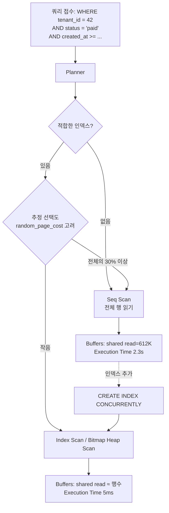
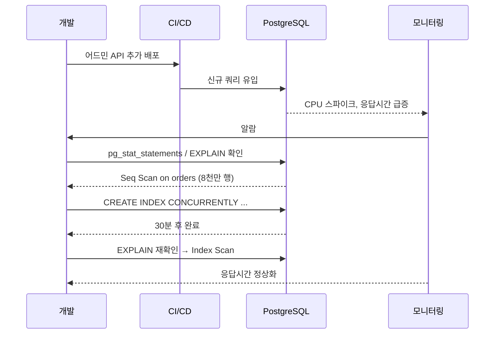

# B1. 인덱스 누락 — 갑자기 Seq Scan이 폭주한다

> **증상 한 줄**: 어제까지 멀쩡하던 쿼리가 **배포 직후 또는 데이터가 임계치를 넘자** 갑자기 수 초~수십 초로 느려진다. `EXPLAIN`으로 보면 인덱스 대신 **Seq Scan**이 찍힌다.

## 증상

| 지표 | 배포 전 | 배포 후 |
|------|---------|---------|
| 평균 응답시간 | 5 ms | 2,300 ms |
| `pg_stat_user_tables.seq_scan` 증가율 | 거의 0 | 분당 수백 건 |
| `shared_read` / `shared_hit` | 극소 | 급증 |
| CPU % | 30% | 95% |
| Disk IOPS | 평탄 | 스파이크 |

증거: `pg_stat_statements`에서 `total_time` 상위 쿼리가 **계산 비용이 과도하게 높은** 쿼리로 바뀌었고, 모두 같은 테이블을 스캔한다.

---

## 실제 상황 (재현 시나리오)

### 스키마

```sql
CREATE TABLE users (
    user_id    bigserial PRIMARY KEY,
    email      text UNIQUE NOT NULL,
    tenant_id  bigint NOT NULL,
    deleted_at timestamptz,
    created_at timestamptz DEFAULT now()
);

CREATE TABLE orders (
    order_id    bigserial PRIMARY KEY,
    user_id     bigint NOT NULL REFERENCES users(user_id),
    tenant_id   bigint NOT NULL,
    status      text NOT NULL,
    created_at  timestamptz DEFAULT now()
);

CREATE INDEX idx_orders_user_id ON orders (user_id);
-- tenant_id에 인덱스 없음, status에도 없음
```

데이터 규모: `users` 200만, `orders` 8천만.

### 배포 직후 유입된 신규 쿼리

```sql
-- 새로 추가된 어드민 대시보드 API
SELECT COUNT(*)
FROM orders
WHERE tenant_id = 42
  AND status    = 'paid'
  AND created_at >= now() - interval '7 days';
```

`tenant_id`, `status`, `created_at` 어느 컬럼도 인덱스가 없다 → **풀 Seq Scan 8천만 행**.

### EXPLAIN 결과

```
QUERY PLAN
----------------------------------------------------------------
 Finalize Aggregate  (cost=1423500.00..1423500.01 rows=1 width=8)
                    (actual time=2318.441..2318.442 rows=1 loops=1)
   Buffers: shared read=612341
   ->  Gather  (cost=1423499.79..1423499.90 rows=2 width=8)
         Workers Planned: 2
         Workers Launched: 2
         ->  Partial Aggregate
               ->  Parallel Seq Scan on orders
                     Filter: ((tenant_id = 42)
                              AND (status = 'paid'::text)
                              AND (created_at >= (now() - '7 days'::interval)))
                     Rows Removed by Filter: 26234567
 Planning Time: 0.245 ms
 Execution Time: 2318.512 ms
```

---

## 원인 분석

### 왜 이렇게 되는가

1. **서비스 초기**에는 `orders`가 10만 건 → Seq Scan도 100ms 이내. 아무도 눈치 못 챔.
2. **트래픽이 커져** 8천만 건이 되자 Seq Scan 비용이 급격히 선형 증가.
3. **신규 쿼리 조건(tenant_id, status)** 을 고려하지 않고 배포 → 플래너가 선택할 인덱스가 없다.
4. `pg_stat_statements`를 켜두지 않아서 **어떤 쿼리가 범인인지** 초반에 못 잡음.

### 복합 인덱스의 선택적 원칙

- **카디널리티가 높은 컬럼을 앞**에 두지만, **항상 WHERE에 포함되는 컬럼**이 먼저 오는 게 실무 정석.
- `tenant_id` 없이 `status`만 조회하는 API도 있다면 `status`가 선두여야 할 수도 있다 → 접근 패턴에 따라 다름.

---

## 진단 쿼리 (복붙 가능)

### 1. Seq Scan 상위 테이블

```sql
SELECT
    schemaname || '.' || relname                  AS table,
    seq_scan,
    seq_tup_read,
    idx_scan,
    CASE WHEN seq_scan + idx_scan = 0 THEN NULL
         ELSE round(100.0 * seq_scan / (seq_scan + idx_scan), 1)
    END                                            AS seq_pct,
    pg_size_pretty(pg_relation_size(relid))       AS size
FROM pg_stat_user_tables
WHERE seq_scan > 0
ORDER BY seq_tup_read DESC
LIMIT 20;
-- seq_pct가 높고 seq_tup_read가 큰 테이블부터 의심
```

### 2. pg_stat_statements — 비용 상위 쿼리

```sql
-- 한 번만: CREATE EXTENSION pg_stat_statements;
-- postgresql.conf: shared_preload_libraries = 'pg_stat_statements'

SELECT
    substring(query, 1, 120)                       AS query,
    calls,
    total_exec_time,
    mean_exec_time,
    rows,
    shared_blks_read,
    shared_blks_hit
FROM pg_stat_statements
ORDER BY total_exec_time DESC
LIMIT 20;
```

### 3. 특정 쿼리 EXPLAIN 확인

```sql
EXPLAIN (ANALYZE, BUFFERS, VERBOSE)
SELECT COUNT(*)
FROM orders
WHERE tenant_id = 42
  AND status    = 'paid'
  AND created_at >= now() - interval '7 days';
```

### 4. 사용되지 않는 기존 인덱스 (정리 대상)

```sql
SELECT
    schemaname || '.' || relname                  AS table,
    indexrelname                                   AS index,
    idx_scan,
    pg_size_pretty(pg_relation_size(indexrelid))  AS size
FROM pg_stat_user_indexes
WHERE idx_scan = 0
ORDER BY pg_relation_size(indexrelid) DESC
LIMIT 20;
```

---

## 해결 방법

### 단계 1 — 올바른 인덱스 설계

접근 패턴이 `tenant_id`로 항상 필터링하고, 그 안에서 `status` + `created_at` 범위인 경우:

```sql
-- 복합 인덱스 (tenant_id, status, created_at)
CREATE INDEX CONCURRENTLY idx_orders_tenant_status_created
    ON orders (tenant_id, status, created_at DESC);
```

**Covering index** (include 컬럼, v11+) 가 도움되는 경우:

```sql
CREATE INDEX CONCURRENTLY idx_orders_tenant_status_covering
    ON orders (tenant_id, status, created_at DESC)
    INCLUDE (user_id, order_id);
-- Index Only Scan 유도
```

### 단계 2 — 부분 인덱스(partial index)로 크기/유지비용 절감

`status = 'paid'` 비율이 전체의 10% 이하면 부분 인덱스가 훨씬 저렴:

```sql
CREATE INDEX CONCURRENTLY idx_orders_paid_recent
    ON orders (tenant_id, created_at DESC)
    WHERE status = 'paid';
```

### 단계 3 — `CONCURRENTLY` 반드시 사용

```sql
-- ❌ 프로덕션에서 절대 안 됨: 테이블 AccessExclusiveLock
CREATE INDEX idx_x ON big (col);

-- ✅ 온라인 생성 (오래 걸리지만 잠금 최소)
CREATE INDEX CONCURRENTLY idx_x ON big (col);

-- 실패 시 INVALID 상태 확인
SELECT indexrelid::regclass, indisvalid
FROM pg_index
WHERE NOT indisvalid;
-- INVALID 인덱스는 REINDEX CONCURRENTLY 또는 DROP
```

### 단계 4 — 만든 인덱스가 실제로 쓰이는지 검증

```sql
-- 24시간 뒤
SELECT indexrelname, idx_scan, idx_tup_read
FROM pg_stat_user_indexes
WHERE indexrelname = 'idx_orders_tenant_status_created';
-- idx_scan > 0 이면 OK
```

### 단계 5 — 통계 갱신 (대용량 INSERT 직후 등)

```sql
ANALYZE orders;
-- 또는 특정 컬럼만
ANALYZE orders (tenant_id, status, created_at);
```

---

## 예방 원칙 (체크리스트)

- [ ] `pg_stat_statements`를 **처음부터** 켠다 (`shared_preload_libraries`).
- [ ] `auto_explain`을 슬로우 쿼리 로깅에 연결 (`auto_explain.log_min_duration`).
- [ ] 배포 시 **새 쿼리의 `EXPLAIN`**을 리뷰 체크리스트에 포함.
- [ ] 인덱스 생성은 **반드시** `CONCURRENTLY`.
- [ ] 카디널리티가 낮은 단일 컬럼(예: `status`)에 단독 인덱스는 지양, **복합 인덱스나 부분 인덱스**로 설계.
- [ ] **Multi-column 인덱스**는 "항상 같이 쓰이는 컬럼"을 기준으로 구성.
- [ ] 신규 인덱스 생성 전 `pg_stat_user_indexes`로 **유사 인덱스 중복** 점검.
- [ ] 대시보드: 주간 상위 Seq Scan 테이블, 사용 안 되는 인덱스 리포트.

---

## Mermaid — Seq Scan vs Index Scan 플래너 판단 흐름



### 배포 ~ 장애 ~ 수습 시퀀스



---

## 관련 챕터

- [05장. 인덱스 타입](../chapters/ch05_indexes.md)
- [06장. 쿼리 플래너와 EXPLAIN](../chapters/ch06_query_planner.md)
- [cheatsheets/index_selection.md](../cheatsheets/index_selection.md)
- [cheatsheets/explain_reading.md](../cheatsheets/explain_reading.md)
- [B2. 인덱스가 있어도 Seq Scan](B2_seq_scan_with_index.md)

## 공식 문서 참조

- [Using EXPLAIN](https://www.postgresql.org/docs/current/using-explain.html)
- [Indexes — Multicolumn / Partial / Covering](https://www.postgresql.org/docs/current/indexes.html)
- [CREATE INDEX — CONCURRENTLY](https://www.postgresql.org/docs/current/sql-createindex.html)
- [pg_stat_statements](https://www.postgresql.org/docs/current/pgstatstatements.html)
