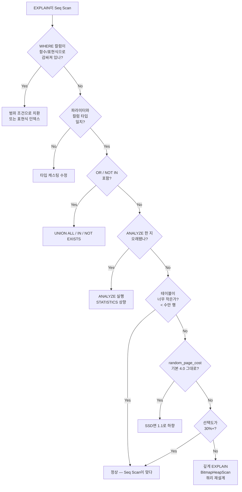

# B2. 인덱스가 있어도 Seq Scan — "분명히 인덱스 걸었는데요?"

> **증상 한 줄**: `\d tablename`에 인덱스가 분명히 있는데 `EXPLAIN`은 Seq Scan만 찍는다. 원인은 대개 **쿼리 작성 방식**이나 **통계/설정**에 있다.

## 증상

| 케이스 | 플래너 선택 | 실행 시간 |
|--------|-------------|-----------|
| 정상 기대 | Index Scan on `idx_created_at` | 3 ms |
| 실제 | Seq Scan (Filter 포함) | 1,200 ms |

`\d+` 에는 인덱스가 `idx_orders_created_at btree (created_at)`로 잘 등록돼 있다. 그런데도 플래너가 쓰지 않는다.

---

## 실제 상황 (재현 시나리오)

### 6가지 대표 원인을 하나씩 재현

```sql
CREATE TABLE orders (
    order_id    bigint PRIMARY KEY,
    user_id     bigint,
    status      text,
    amount      numeric(12,2),
    created_at  timestamptz
);
CREATE INDEX idx_orders_created_at ON orders (created_at);
CREATE INDEX idx_orders_user_id    ON orders (user_id);
CREATE INDEX idx_orders_status     ON orders (status);

-- 8천만 행 삽입 후
```

### (1) 함수/표현식 래핑

```sql
-- ❌ Seq Scan
SELECT * FROM orders
WHERE date_trunc('day', created_at) = '2026-04-20';

-- ❌ Seq Scan
SELECT * FROM orders
WHERE to_char(created_at, 'YYYY-MM-DD') = '2026-04-20';

-- 플래너는 인덱스 키 그 자체(created_at)에만 인덱스를 쓸 수 있음.
-- 함수로 감싼 결과값에는 인덱스가 없다.
```

### (2) 타입 불일치 (bigint vs text)

```sql
-- ❌ user_id는 bigint인데 문자열 비교
SELECT * FROM orders WHERE user_id = '12345';
-- → 암묵적 캐스팅이 역방향으로 일어나면 인덱스 사용 못함.
-- (실제로 대부분 잘 되지만, 특히 text = bigint 조합에서 문제가 자주 생김)
```

### (3) OR / NOT IN

```sql
-- ❌ 흔히 Seq Scan으로 떨어짐
SELECT * FROM orders WHERE user_id = 1 OR status = 'paid';

-- ❌ NOT IN + NULL 가능성
SELECT * FROM orders WHERE user_id NOT IN (SELECT id FROM blocked_users);
```

### (4) 통계가 오래됨

```sql
-- 1시간 동안 1천만 행 벌크 INSERT 후 ANALYZE 안 함
-- → pg_statistic에는 예전 분포가 남아있어 플래너가 잘못 선택
```

### (5) 테이블이 작음

```sql
-- 테이블이 5만 행이면 Seq Scan이 맞다.
-- 페이지 몇 개만 읽으면 되는데 인덱스를 타면 더 느림.
```

### (6) `random_page_cost`가 SSD에 비해 너무 높음

```sql
-- 기본값 4.0 은 HDD 시절 기준
-- NVMe SSD에서는 1.1 ~ 1.5 가 현실적
SHOW random_page_cost;  -- 4
-- → 플래너가 Index Scan의 비용을 과대 평가 → Seq Scan 선호
```

### EXPLAIN 출력 예시 (원인 1번)

```
 Seq Scan on orders  (cost=0.00..1783421.00 rows=404040 width=...)
                     (actual time=0.041..1178.334 rows=412000 loops=1)
   Filter: (date_trunc('day'::text, created_at) =
            '2026-04-20 00:00:00+00'::timestamp with time zone)
   Rows Removed by Filter: 79588000
   Buffers: shared hit=123 read=523400
 Planning Time: 0.318 ms
 Execution Time: 1178.412 ms
```

---

## 원인 분석

### 인덱스가 비활성화되는 메커니즘

플래너는 **"이 쿼리 조건이 인덱스 키에 직접 맞닿아 있는가"**를 본다.

| 조건 | 인덱스 사용 |
|------|-------------|
| `created_at >= '2026-04-20' AND created_at < '2026-04-21'` | ✅ |
| `date_trunc('day', created_at) = ...` | ❌ (일반 인덱스), ✅ (표현식 인덱스 있으면) |
| `EXTRACT(month FROM created_at) = 4` | ❌ |
| `user_id = 12345` | ✅ |
| `user_id::text = '12345'` | ❌ |
| `status IN ('paid', 'shipped')` | ✅ (일반적) |
| `status = 'paid' OR user_id = 1` | 플래너 판단에 따라 다름, 종종 Seq Scan |

### 핵심 규칙

1. **컬럼을 함수/표현식으로 감싸지 않는다.** 범위로 치환할 수 있으면 치환.
2. **타입을 명확하게 일치**시킨다. ORM에서 파라미터 타입 확인.
3. **OR 조건은 UNION으로 분해**하거나 **BitmapOr**가 탈 수 있게 인덱스 구성.
4. **ANALYZE는 대량 변경 후 반드시** 실행.

---

## 진단 쿼리 (복붙 가능)

### 1. EXPLAIN으로 Filter vs Index Cond 구분

```sql
EXPLAIN (ANALYZE, BUFFERS, VERBOSE)
SELECT * FROM orders WHERE created_at >= '2026-04-20' AND created_at < '2026-04-21';

-- Index Cond: (created_at >= ...) ← 인덱스로 처리
-- Filter:     (status = 'paid')    ← 인덱스 이후에 후처리
```

### 2. 통계 상태 점검

```sql
SELECT
    schemaname,
    relname,
    last_analyze,
    last_autoanalyze,
    n_mod_since_analyze,
    n_live_tup
FROM pg_stat_user_tables
WHERE relname = 'orders';
```

### 3. 컬럼별 통계 품질 (default_statistics_target)

```sql
SELECT attname, n_distinct, most_common_vals, most_common_freqs, histogram_bounds
FROM pg_stats
WHERE tablename = 'orders' AND attname IN ('status', 'user_id', 'created_at');
```

### 4. 현재 설정 확인

```sql
SELECT name, setting, unit, short_desc
FROM pg_settings
WHERE name IN (
    'random_page_cost',
    'seq_page_cost',
    'effective_cache_size',
    'default_statistics_target',
    'cpu_tuple_cost',
    'cpu_index_tuple_cost',
    'work_mem'
);
```

---

## 해결 방법

### (1) 함수 래핑 제거 → 범위로 치환

```sql
-- ❌ → ✅
SELECT * FROM orders
WHERE created_at >= '2026-04-20'
  AND created_at <  '2026-04-21';

-- 꼭 함수를 써야 하면 표현식 인덱스
CREATE INDEX idx_orders_day ON orders (date_trunc('day', created_at));
```

### (2) 타입 일치

```sql
-- ❌
SELECT * FROM orders WHERE user_id = '12345';
-- ✅
SELECT * FROM orders WHERE user_id = 12345;

-- ORM이 자동 캐스팅을 망치는 경우 bind type 강제
SELECT * FROM orders WHERE user_id = $1::bigint;
```

### (3) OR → UNION ALL / IN

```sql
-- ❌ OR
SELECT * FROM orders WHERE user_id = 1 OR status = 'paid';

-- ✅ UNION ALL (각 분기가 서로 다른 인덱스를 탈 수 있음)
SELECT * FROM orders WHERE user_id = 1
UNION ALL
SELECT * FROM orders WHERE status = 'paid' AND user_id <> 1;

-- ✅ IN (같은 컬럼의 여러 값이면 이게 최선)
SELECT * FROM orders WHERE status IN ('paid','shipped');
```

### (4) 통계 갱신

```sql
ANALYZE orders;

-- 대용량 배치 직후에는 스크립트에 포함
COPY orders FROM '...';
ANALYZE orders;

-- 통계 샘플 크기 확대 (기본 100 → 1000)
ALTER TABLE orders ALTER COLUMN status SET STATISTICS 1000;
ANALYZE orders;
```

### (5) 테이블이 너무 작으면 — **괜찮다**

플래너가 맞다. 무리하게 인덱스를 강제하지 말 것. `enable_seqscan = off` 같은 글로벌 설정은 금지.

### (6) SSD 환경 플래너 힌트

```conf
# postgresql.conf
random_page_cost       = 1.1          # NVMe SSD
seq_page_cost          = 1.0
effective_cache_size   = '24GB'       # 보통 메모리의 50~75%
effective_io_concurrency = 200        # SSD는 높게
```

### (7) 임시로 인덱스 강제 (테스트 용도만)

```sql
SET LOCAL enable_seqscan = off;
EXPLAIN ANALYZE SELECT ...;
-- 실제 비용과 비교. 프로덕션에서는 끄지 말 것.
```

---

## 예방 원칙 (체크리스트)

- [ ] WHERE 절의 **컬럼 쪽에는 함수/연산을 두지 않는다**. 상수 쪽으로 옮긴다.
- [ ] 쿼리 템플릿의 **바인드 파라미터 타입**을 서버 컬럼 타입과 맞춘다.
- [ ] 대용량 INSERT/UPDATE/DELETE 후 **ANALYZE** 또는 autovacuum 대기.
- [ ] SSD 서버라면 `random_page_cost = 1.1` 로 초기 세팅.
- [ ] `default_statistics_target`를 복잡한 분포 컬럼에만 1000으로 상향.
- [ ] OR 쿼리는 **Bitmap Or** 계획이 나오는지 `EXPLAIN`으로 확인.
- [ ] `NULL` 의미를 갖는 컬럼에는 `NOT IN` 대신 `NOT EXISTS` 사용.
- [ ] 표현식 쿼리가 반복되면 **표현식 인덱스**를 명시적으로 만든다.

---

## Mermaid — 인덱스 비활성화 원인 분기



---

## 관련 챕터

- [05장. 인덱스 타입 — 표현식/부분 인덱스](../chapters/ch05_indexes.md)
- [06장. 쿼리 플래너와 EXPLAIN](../chapters/ch06_query_planner.md)
- [cheatsheets/explain_reading.md](../cheatsheets/explain_reading.md)
- [cheatsheets/config_parameters.md](../cheatsheets/config_parameters.md)
- [B1. 인덱스 누락](B1_missing_index.md)
- [B3. 잘못된 조인 순서](B3_bad_join_order.md)

## 공식 문서 참조

- [Indexes and ORDER BY / Expression Indexes](https://www.postgresql.org/docs/current/indexes-expressional.html)
- [Planner / Optimizer](https://www.postgresql.org/docs/current/planner-optimizer.html)
- [Statistics Used by the Planner](https://www.postgresql.org/docs/current/planner-stats.html)
- [ALTER TABLE ... SET STATISTICS](https://www.postgresql.org/docs/current/sql-altertable.html)
