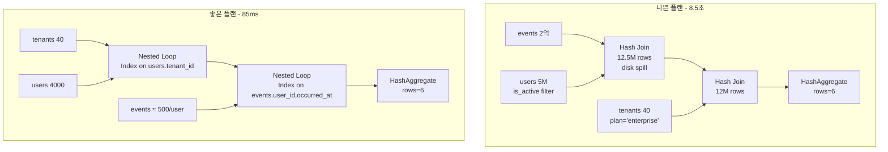
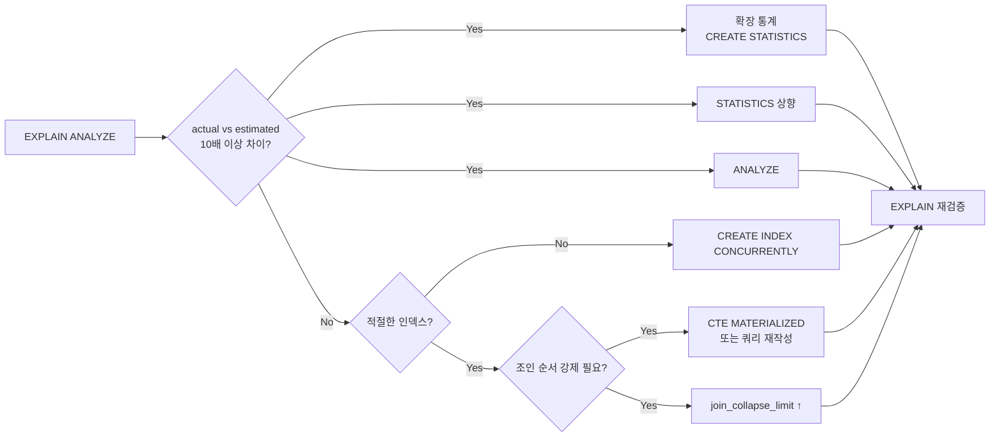

# B3. 조인 순서 오류 — 중간 결과가 폭발한다

> **증상 한 줄**: 3개 이상 테이블을 조인하는 쿼리가 이상하게 느리다. `EXPLAIN (ANALYZE)`를 보면 **estimated rows**와 **actual rows**가 10배~100배 차이 나면서 중간 해시 테이블이 메모리를 넘어 디스크로 떨어진다.

## 증상

| 지표 | 정상 | 장애 |
|------|------|------|
| EXPLAIN 하단 `Execution Time` | 50 ms | 8,500 ms |
| Hash Join의 "Rows Removed by Filter" | 소량 | 수천만 |
| `work_mem` 초과로 인한 `Batches: N (disk)` | 1 (memory) | 16 (disk) |
| 플래너의 `rows` 추정 vs 실제 | 일치 | 1,000 예상 → 실제 1,200,000 |

징후: 동일 쿼리가 파라미터에 따라 **엄청나게** 다른 속도로 실행된다 (plan skew).

---

## 실제 상황 (재현 시나리오)

### 스키마

```sql
CREATE TABLE tenants (
    tenant_id bigserial PRIMARY KEY,
    plan      text,                    -- 'free', 'pro', 'enterprise'
    region    text
);

CREATE TABLE users (
    user_id    bigserial PRIMARY KEY,
    tenant_id  bigint REFERENCES tenants,
    is_active  boolean
);

CREATE TABLE events (
    event_id   bigserial PRIMARY KEY,
    user_id    bigint REFERENCES users,
    event_type text,
    occurred_at timestamptz
);

-- 데이터: tenants 2천, users 500만, events 2억
-- enterprise plan의 tenant는 2% 뿐, 이들이 events의 60%를 생성
```

### 문제 쿼리

```sql
-- enterprise 플랜의 활성 유저의 지난 7일 이벤트 수
SELECT t.region, COUNT(*) AS cnt
FROM events e
JOIN users   u ON u.user_id   = e.user_id
JOIN tenants t ON t.tenant_id = u.tenant_id
WHERE t.plan = 'enterprise'
  AND u.is_active
  AND e.occurred_at >= now() - interval '7 days'
GROUP BY t.region;
```

### 실제 나온 EXPLAIN (나쁜 플랜)

```
 HashAggregate  (actual time=8523.441..8523.502 rows=6 loops=1)
   ->  Hash Join  (actual rows=12,000,000)
         Hash Cond: (u.tenant_id = t.tenant_id)
         ->  Hash Join  (actual rows=12,500,000)
               Hash Cond: (e.user_id = u.user_id)
               ->  Seq Scan on events e
                     Filter: (occurred_at >= now() - '7 days'::interval)
                     Rows Removed by Filter: 188,000,000
               ->  Hash  (actual rows=4,700,000)
                     Batches: 16 (disk)    -- ← work_mem 초과
                     ->  Seq Scan on users u
                           Filter: is_active
         ->  Hash  (actual rows=2,000)
               ->  Seq Scan on tenants t
                     Filter: (plan = 'enterprise')
 Execution Time: 8523.612 ms
```

**문제**: `tenants`를 가장 나중에 조인 → users 500만 전체와 events 1,200만을 먼저 해시 조인 → 그다음에 enterprise 40개만 남김. 순서가 거꾸로다.

### 원했던 플랜

```
 HashAggregate
   ->  Nested Loop
         ->  Seq Scan on tenants t  (rows=40, plan='enterprise')
         ->  Index Scan users_tenant_idx  (rows=100/tenant)
         ->  Index Scan events_user_recent  (rows=500/user)
 Execution Time: 85 ms
```

---

## 원인 분석

### 왜 플래너가 틀리나

1. **컬럼 간 상관관계**를 모름. `plan = 'enterprise'`와 `events.occurred_at >= ...`은 독립 변수가 아니다 (enterprise 유저가 이벤트 생성의 60%). 플래너는 독립 가정을 해서 예상 rows를 크게 틀린다.
2. **`default_statistics_target`이 낮음**. 히스토그램 정확도가 떨어져 선택도 오차 발생.
3. **ANALYZE 미실행** 이후 대량 변화.
4. **join_collapse_limit / from_collapse_limit** 기본 8 — 테이블 수가 많아지면 포기하고 그냥 FROM 순서대로 씀.
5. **인덱스가 없어** Nested Loop 옵션이 원천 차단.

### 핵심: 추정 rows vs 실제 rows

```
EXPLAIN ANALYZE의 각 노드에서
rows= 추정   vs  (actual ... rows=실제)
   ↑                 ↑
   이 둘이 10배 이상 차이 나면 통계가 고장난 것
```

---

## 진단 쿼리 (복붙 가능)

### 1. EXPLAIN (ANALYZE, BUFFERS) — 기본 도구

```sql
EXPLAIN (ANALYZE, BUFFERS, VERBOSE, SETTINGS)
SELECT t.region, COUNT(*) AS cnt
FROM events e
JOIN users   u ON u.user_id   = e.user_id
JOIN tenants t ON t.tenant_id = u.tenant_id
WHERE t.plan = 'enterprise'
  AND u.is_active
  AND e.occurred_at >= now() - interval '7 days'
GROUP BY t.region;
-- estimated vs actual 확인, Batches: disk 여부 확인
```

### 2. 확장 통계(`CREATE STATISTICS`) 대상 찾기

```sql
-- 상관관계가 의심되는 컬럼 쌍을 직접 세어 본다
SELECT plan, COUNT(*) FROM tenants GROUP BY plan;
SELECT plan, AVG(event_cnt) FROM (
    SELECT t.plan, t.tenant_id, COUNT(*) AS event_cnt
    FROM tenants t
    JOIN users u ON u.tenant_id = t.tenant_id
    JOIN events e ON e.user_id = u.user_id
    WHERE e.occurred_at >= now() - interval '7 days'
    GROUP BY t.plan, t.tenant_id
) s GROUP BY plan;
-- 특정 plan에 event가 편중돼 있으면 확장 통계 필요
```

### 3. 현재 플래너 설정

```sql
SELECT name, setting FROM pg_settings
WHERE name IN (
    'join_collapse_limit',
    'from_collapse_limit',
    'geqo_threshold',
    'default_statistics_target',
    'work_mem',
    'enable_hashjoin',
    'enable_mergejoin',
    'enable_nestloop'
);
```

---

## 해결 방법

### 단계 1 — 필요 인덱스 확보

```sql
-- Nested Loop를 탈 수 있도록
CREATE INDEX CONCURRENTLY idx_users_tenant_active
    ON users (tenant_id) WHERE is_active;

CREATE INDEX CONCURRENTLY idx_events_user_recent
    ON events (user_id, occurred_at DESC);

-- 또는 BRIN (이벤트가 시간순 append-only일 때)
CREATE INDEX idx_events_occurred_brin
    ON events USING BRIN (occurred_at);
```

### 단계 2 — 확장 통계 (v10+, `CREATE STATISTICS`)

```sql
CREATE STATISTICS stx_tenant_plan_region (dependencies, ndistinct)
    ON plan, region FROM tenants;

CREATE STATISTICS stx_users_tenant_active (dependencies)
    ON tenant_id, is_active FROM users;

ANALYZE tenants;
ANALYZE users;
```

이후 플래너의 `rows` 추정치가 실제와 훨씬 가까워진다.

### 단계 3 — `default_statistics_target` 상향

```sql
ALTER TABLE events ALTER COLUMN user_id SET STATISTICS 1000;
ALTER TABLE users  ALTER COLUMN tenant_id SET STATISTICS 1000;
ANALYZE events;
ANALYZE users;
```

### 단계 4 — `join_collapse_limit` 조정

```sql
-- 세션/어플 레벨
SET join_collapse_limit = 12;   -- 기본 8
SET from_collapse_limit = 12;

-- 전역 (신중히)
ALTER SYSTEM SET join_collapse_limit = 12;
```

주의: 높이면 플래너가 더 많은 순서를 시도하지만 **planning time이 길어진다**. 12~16 권장.

### 단계 5 — 쿼리 리라이팅

**CTE로 작은 쪽 먼저 줄이기** (v12부터 CTE는 기본 inline. `AS MATERIALIZED` 명시):

```sql
WITH enterprise_tenants AS MATERIALIZED (
    SELECT tenant_id, region
    FROM tenants
    WHERE plan = 'enterprise'
)
SELECT t.region, COUNT(*) AS cnt
FROM enterprise_tenants t
JOIN users u ON u.tenant_id = t.tenant_id AND u.is_active
JOIN events e ON e.user_id = u.user_id
           AND e.occurred_at >= now() - interval '7 days'
GROUP BY t.region;
```

**IN / EXISTS**로 변환 (중간 결과 작게):

```sql
SELECT t.region, COUNT(*) AS cnt
FROM events e
JOIN users u ON u.user_id = e.user_id AND u.is_active
JOIN tenants t ON t.tenant_id = u.tenant_id
WHERE t.tenant_id IN (SELECT tenant_id FROM tenants WHERE plan='enterprise')
  AND e.occurred_at >= now() - interval '7 days'
GROUP BY t.region;
```

### 단계 6 — `work_mem` 상향 (Hash 디스크 스필 방지)

```sql
-- 세션 단위
SET work_mem = '128MB';
-- 쿼리 실행 후 원복
RESET work_mem;
```

전역을 무턱대고 올리면 동시성 × 해시 조인 × Sort 조합으로 메모리 폭발하니 **특정 배치 쿼리 세션에만** 적용.

### 단계 7 — 최후 수단: `pg_hint_plan` 확장

```sql
-- pg_hint_plan 설치 시
/*+ Leading((t (u e))) NestLoop(t u) NestLoop(t u e) */
SELECT ...
-- 플래너를 강제. 통계 수정으로 해결 안 되는 특수 쿼리에만.
```

---

## 예방 원칙 (체크리스트)

- [ ] 3-way 이상 조인 쿼리는 **반드시 `EXPLAIN (ANALYZE, BUFFERS)`**로 actual rows 검증.
- [ ] 상관관계 있는 컬럼 조합에 `CREATE STATISTICS` (v10+).
- [ ] 대용량 테이블은 관련 컬럼에 `SET STATISTICS 1000`.
- [ ] 배치/리포트 직전에 `ANALYZE` 명시.
- [ ] `work_mem`을 **세션 단위**로 조정하는 템플릿 스크립트 준비.
- [ ] 조인 테이블이 8개 넘어가면 `join_collapse_limit` 검토.
- [ ] 가장 선택적인 조건을 가진 테이블이 **첫 번째 조인 피연산자**가 되게 쿼리 설계.
- [ ] 파티션 테이블 조인은 `enable_partitionwise_join = on` 고려.

---

## Mermaid — 잘못된 순서 vs 올바른 순서



### 조치 순서



---

## 관련 챕터

- [05장. 인덱스 타입](../chapters/ch05_indexes.md)
- [06장. 쿼리 플래너와 EXPLAIN](../chapters/ch06_query_planner.md)
- [cheatsheets/explain_reading.md](../cheatsheets/explain_reading.md)
- [B2. 인덱스가 있어도 Seq Scan](B2_seq_scan_with_index.md)

## 공식 문서 참조

- [Controlling the Planner — join_collapse_limit](https://www.postgresql.org/docs/current/runtime-config-query.html)
- [Extended Statistics — CREATE STATISTICS](https://www.postgresql.org/docs/current/planner-stats.html#PLANNER-STATS-EXTENDED)
- [work_mem](https://www.postgresql.org/docs/current/runtime-config-resource.html#GUC-WORK-MEM)
- [Partition-wise joins](https://www.postgresql.org/docs/current/runtime-config-query.html#GUC-ENABLE-PARTITIONWISE-JOIN)
