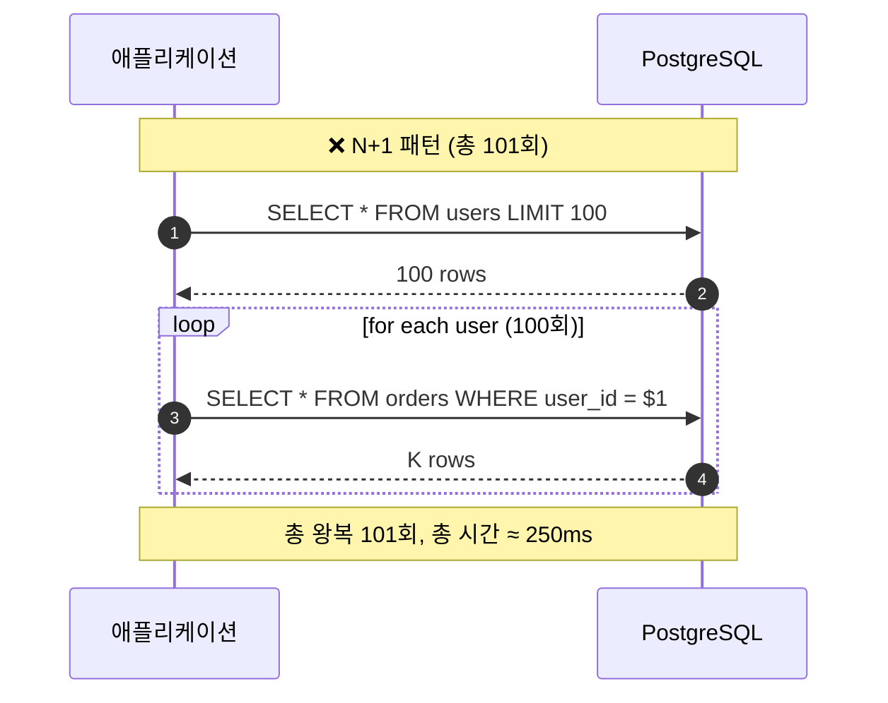
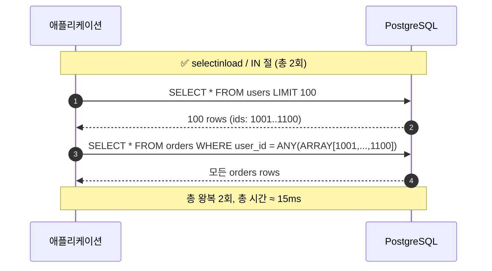
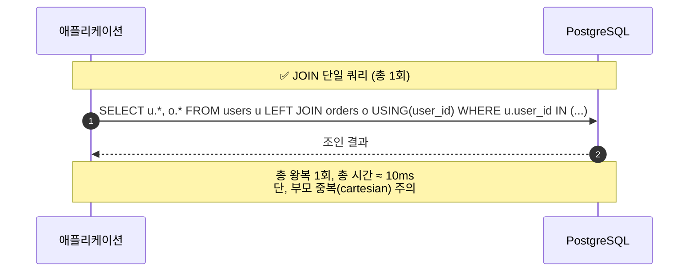
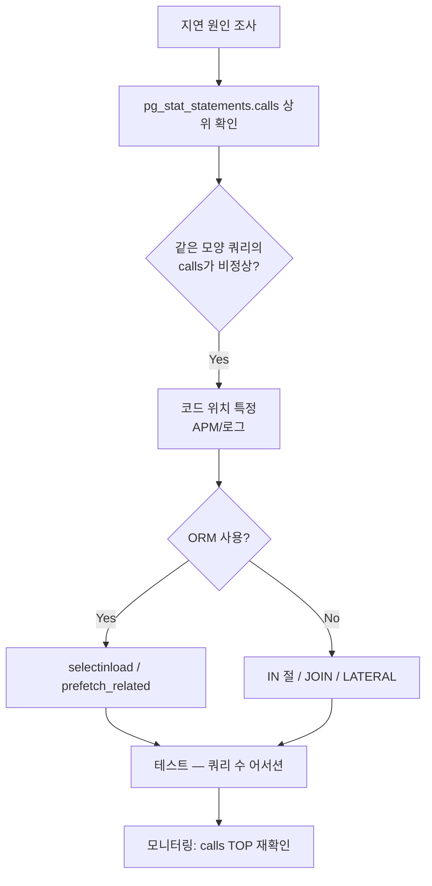

# B4. N+1 쿼리 — 한 화면에 수백 번 실행되는 같은 패턴 쿼리

> **증상 한 줄**: 단일 페이지 로딩 중 DB 쪽에 **동일한 모양의 쿼리가 수십~수백 번** 반복 실행된다. 개별 쿼리는 0.3ms로 빠르지만 합쳐서 200ms~1s를 잡아먹는다.

## 증상

| 지표 | 정상 | N+1 상황 |
|------|------|----------|
| 페이지 하나당 DB 왕복 | 2~5회 | 101회 (N=100) |
| 평균 개별 쿼리 시간 | 0.5 ms | 0.3 ms (개별은 빠름) |
| 총 DB time | 2 ms | 300 ms |
| `pg_stat_statements.calls` 상위 패턴 | 고른 분포 | 한 쿼리가 압도 |
| Connection pool wait | 드묾 | 피크 시간대 대기 빈발 |

전형적 로그(`log_statement=all`):

```
LOG:  SELECT * FROM orders WHERE user_id = 1001
LOG:  SELECT * FROM orders WHERE user_id = 1002
LOG:  SELECT * FROM orders WHERE user_id = 1003
...
LOG:  SELECT * FROM orders WHERE user_id = 1100
```

---

## 실제 상황 (재현 시나리오)

### 스키마

```sql
CREATE TABLE users (
    user_id bigserial PRIMARY KEY,
    name    text,
    email   text
);

CREATE TABLE orders (
    order_id bigserial PRIMARY KEY,
    user_id  bigint REFERENCES users,
    total    numeric(12,2),
    status   text,
    created_at timestamptz DEFAULT now()
);
CREATE INDEX idx_orders_user ON orders(user_id);
```

### 문제 코드 (Python + SQLAlchemy)

```python
# ❌ 전형적인 N+1
users = session.query(User).limit(100).all()          # 쿼리 1회
for u in users:
    print(u.name, [o.status for o in u.orders])        # 유저마다 orders 1회 = 100회
# 총 101번의 DB 왕복
```

### 또는 ORM 없이 직접 짠 경우

```python
user_ids = [row[0] for row in db.execute("SELECT user_id FROM users LIMIT 100")]
for uid in user_ids:
    orders = db.execute(f"SELECT * FROM orders WHERE user_id = {uid}").fetchall()
    ...
```

### pg_stat_statements에서 보이는 모습

```sql
SELECT query, calls, mean_exec_time, total_exec_time
FROM pg_stat_statements
ORDER BY calls DESC
LIMIT 5;
```

```
               query                | calls   | mean_exec_time | total_exec_time
------------------------------------+---------+----------------+------------------
 SELECT * FROM orders WHERE user_id=$1 | 8234512 |      0.29      |   2,388,009
 SELECT * FROM users WHERE user_id=$1  | 8128411 |      0.21      |   1,706,966
```

→ calls가 수백만: 명백한 N+1.

---

## 원인 분석

### ORM의 기본 전략 — Lazy Loading

대부분의 ORM(SQLAlchemy, Django ORM, ActiveRecord, JPA/Hibernate)은 **연관 객체를 접근 시점에** 로드한다. 편리하지만 반복문 안에서는 곧 N+1로 이어진다.

### 비용 구조

```
개별 왕복 비용 = 네트워크 + parse + plan + execute + fetch + commit(트랜잭션 오버헤드)
             ≈ 0.3 ms 로 보여도 실제는
             TCP latency(0.1ms) + context switch(수십 μs) 이 N배로 누적
```

연결 풀 관점에서도 심각:
- 1 페이지 = 101 쿼리 = 101 × holding 시간 → **풀 소진**
- PgBouncer `pool_mode=transaction` 이면 트랜잭션 종료 전까지 서버 세션 점유.

### 진짜 위험한 형태

1. **웹 리스트 페이지** (리스트 N개 × 연관 조회) — 가장 흔함.
2. **GraphQL resolver** — 해결책으로 DataLoader 필수.
3. **로그 처리 루프** — 10,000건 배치에서 10,000 × 소쿼리.

---

## 진단 쿼리 (복붙 가능)

### 1. pg_stat_statements — 같은 모양 쿼리의 calls 추적

```sql
SELECT
    queryid,
    left(query, 150)                              AS query,
    calls,
    round(total_exec_time::numeric, 1)            AS total_ms,
    round(mean_exec_time::numeric, 3)             AS mean_ms,
    rows
FROM pg_stat_statements
WHERE calls > 10000
ORDER BY calls DESC
LIMIT 20;
```

### 2. calls/sec TOP (최근 pg_stat_statements 리셋 후)

```sql
-- 리셋: SELECT pg_stat_statements_reset();
-- 부하 관측 후
WITH s AS (
    SELECT stats_reset FROM pg_stat_database WHERE datname = current_database()
)
SELECT
    left(query, 120)                                      AS query,
    calls,
    round(calls / EXTRACT(EPOCH FROM now() - s.stats_reset)::numeric, 2) AS calls_per_sec
FROM pg_stat_statements, s
ORDER BY calls DESC
LIMIT 10;
```

### 3. 로그 기반 — `log_min_duration_statement`

```conf
log_min_duration_statement = 0            # 모든 쿼리 로깅 (개발/스테이징만)
log_statement              = 'none'
log_duration               = off
```

운영에서는 `auto_explain`:

```conf
shared_preload_libraries = 'pg_stat_statements, auto_explain'
auto_explain.log_min_duration = '50ms'
auto_explain.log_analyze      = on
auto_explain.log_nested_statements = on
```

### 4. 어플리케이션 APM

- SQLAlchemy: `echo='debug'` 또는 `sqlalchemy.engine` 로거.
- Django: `django-debug-toolbar`의 SQL 패널.
- 공통: Datadog/New Relic의 "동일 쿼리 반복 감지" 룰.

---

## 해결 방법

### 해법 1 — Eager Loading

```python
# SQLAlchemy
from sqlalchemy.orm import selectinload, joinedload

# selectinload: 2회 쿼리로 끝 (부모 IN 절)
users = session.query(User).options(selectinload(User.orders)).limit(100).all()
# SQL:
# 1) SELECT * FROM users LIMIT 100
# 2) SELECT * FROM orders WHERE user_id IN (1001,1002,...,1100)

# joinedload: 1회 LEFT JOIN
users = session.query(User).options(joinedload(User.orders)).limit(100).all()
```

```python
# Django
users = User.objects.prefetch_related('orders')[:100]    # 2 queries
users = User.objects.select_related('profile')[:100]     # FK JOIN
```

### 해법 2 — IN 절로 배치 조회

```python
# ORM 없이
user_ids = [1001, 1002, ..., 1100]
rows = db.execute(
    "SELECT * FROM orders WHERE user_id = ANY(%s)",
    (user_ids,)
).fetchall()

# 유저별로 파이썬에서 그룹화
by_user = defaultdict(list)
for r in rows:
    by_user[r['user_id']].append(r)
```

```sql
-- 서버에서 집계까지 할 수 있으면 베스트
SELECT user_id, json_agg(row_to_json(o)) AS orders
FROM orders o
WHERE user_id = ANY($1)
GROUP BY user_id;
```

### 해법 3 — JOIN 한 방

```sql
SELECT u.user_id, u.name,
       o.order_id, o.status, o.total
FROM users u
LEFT JOIN orders o ON o.user_id = u.user_id
WHERE u.user_id IN (...)
ORDER BY u.user_id;
```

### 해법 4 — DataLoader 패턴 (GraphQL)

```javascript
// 같은 tick 안에 모인 user_id들을 IN으로 한 번에
const loader = new DataLoader(async (ids) => {
  const rows = await pg.query(
    'SELECT * FROM users WHERE user_id = ANY($1)', [ids]
  );
  return ids.map(id => rows.find(r => r.user_id === id));
});
```

### 해법 5 — LATERAL로 "부모당 상위 N개" 패턴

```sql
-- 각 유저의 최근 주문 3건
SELECT u.user_id, u.name, o.*
FROM users u
LEFT JOIN LATERAL (
    SELECT * FROM orders
    WHERE user_id = u.user_id
    ORDER BY created_at DESC
    LIMIT 3
) o ON true
WHERE u.user_id IN (...);
```

### 해법 6 — 캐싱 (읽기 비율이 절대적일 때)

```python
# Redis / in-process LRU
orders = cache.get(f"user:{uid}:orders") or fetch_from_db(uid)
```

캐시는 **일관성 관리 비용**이 붙으므로 ORM 최적화가 먼저.

---

## 예방 원칙 (체크리스트)

- [ ] **코드 리뷰 체크리스트**에 "반복문 안 DB 접근 없음" 포함.
- [ ] ORM을 쓴다면 `selectinload` / `prefetch_related` / `fetch join` 패턴을 팀 표준으로.
- [ ] **개발 환경**에서 `log_min_duration_statement = 0`으로 전 쿼리 로깅.
- [ ] CI 통합 테스트에 **"한 요청당 쿼리 수 ≤ N"** 어서션 (ex. `django-perf-rec`, SQLAlchemy `statement_count`).
- [ ] `pg_stat_statements.calls` Top 10을 **주간 리포트**로 팀 공유.
- [ ] GraphQL이면 DataLoader 기본 탑재.
- [ ] 리스트 API는 **페이지네이션 크기에 비례한 DB 왕복이 일정**하도록 설계.
- [ ] PgBouncer `pool_mode=transaction` 사용 시 특히 주의 (짧은 쿼리가 많으면 풀 회전이 빨라져 문제를 감추지만 근본은 같다).

---

## Mermaid — N+1 시퀀스 vs 배치/JOIN 시퀀스







### 점검 및 수정 플로우



---

## 관련 챕터

- [06장. 쿼리 플래너와 EXPLAIN](../chapters/ch06_query_planner.md)
- [13장. 핵심 확장 — pg_stat_statements](../chapters/ch13_extensions.md)
- [14장. 모니터링과 트러블슈팅](../chapters/ch14_monitoring_troubleshooting.md)
- [cheatsheets/pg_stat_queries.md](../cheatsheets/pg_stat_queries.md)
- [B1. 인덱스 누락](B1_missing_index.md)
- [B3. 잘못된 조인 순서](B3_bad_join_order.md)

## 공식 문서 참조

- [pg_stat_statements](https://www.postgresql.org/docs/current/pgstatstatements.html)
- [auto_explain](https://www.postgresql.org/docs/current/auto-explain.html)
- [LATERAL subqueries](https://www.postgresql.org/docs/current/queries-table-expressions.html#QUERIES-LATERAL)
- [SQLAlchemy — Relationship Loading](https://docs.sqlalchemy.org/en/20/orm/loading_relationships.html)
- [Django — prefetch_related / select_related](https://docs.djangoproject.com/en/stable/ref/models/querysets/#prefetch-related)
