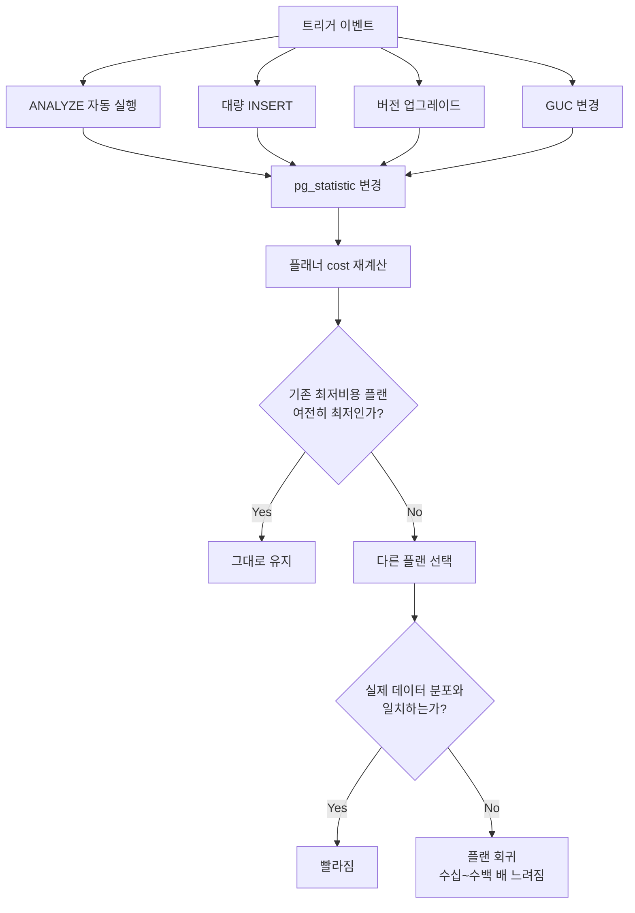
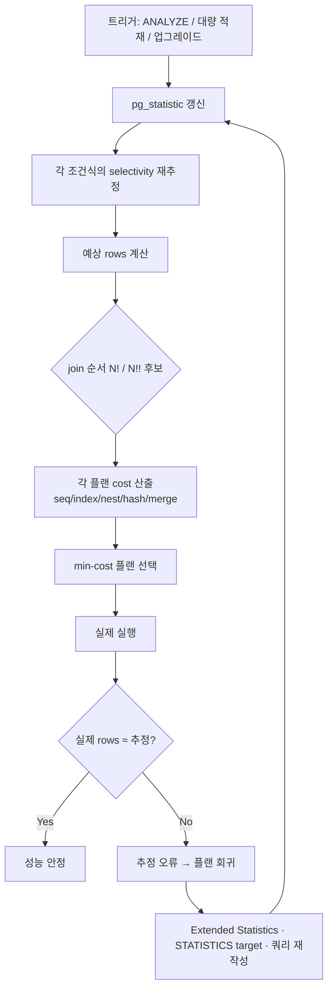
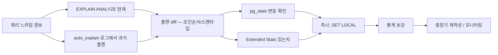

# B5. 플랜 회귀 — 어제까지 50ms였던 쿼리가 오늘 5초

> **증상 한 줄**: 코드 변경이 전혀 없었는데 특정 쿼리가 **수십~수백 배** 느려졌다. 보통 `ANALYZE` 직후, 대량 데이터 적재 후, 마이너 버전 업그레이드 이후 갑자기 발생하며 `EXPLAIN`을 찍어 보면 **조인 순서·조인 방식이 바뀌어 있다**.

## 증상

| 지표 | 정상 (어제) | 장애 (오늘) |
|------|-------------|-------------|
| `pg_stat_statements.mean_exec_time` | 48 ms | 5,120 ms |
| EXPLAIN 조인 순서 | `small → big` (Nested Loop + index) | `big → small` (Hash Join + Seq Scan) |
| Rows 추정 vs 실제 | 실제 100, 추정 95 | 실제 100, **추정 9,500,000** |
| Buffers read | 2,800 | 340,000 |
| CPU 사용률 | 낮음 | 급증, I/O wait 동반 |

전형적인 트리거 이벤트:

- 새벽 ANALYZE 자동 실행 후 아침 장애.
- 대용량 배치 적재(수천만 행 INSERT) 직후.
- `pg_upgrade` 또는 minor version 업그레이드 이후.
- 파티션 detach/attach 이후.
- `random_page_cost` 등 GUC 변경 이후.

---

## 실제 상황 (재현 시나리오)

### 스키마 & 데이터 분포

이커머스 주문 검색 쿼리.

```sql
CREATE TABLE users (
    user_id   bigserial PRIMARY KEY,
    country   text NOT NULL,
    tier      text NOT NULL         -- 'free' 99%, 'premium' 1%
);
CREATE INDEX idx_users_country_tier ON users (country, tier);

CREATE TABLE orders (
    order_id   bigserial PRIMARY KEY,
    user_id    bigint NOT NULL REFERENCES users,
    status     text NOT NULL,
    amount     numeric(12,2),
    created_at timestamptz NOT NULL
);
CREATE INDEX idx_orders_user       ON orders (user_id);
CREATE INDEX idx_orders_created    ON orders (created_at);
```

- `users`: 5천만, `orders`: 10억.
- `country = 'KR' AND tier = 'premium'` 유저는 전체의 **0.01%** (5000명).
- 두 컬럼은 **독립적이지 않다**: `tier='premium'` 유저는 특정 country에 집중.

### 문제 쿼리

```sql
SELECT o.*
FROM orders o
JOIN users u ON u.user_id = o.user_id
WHERE u.country = 'KR'
  AND u.tier = 'premium'
  AND o.created_at >= now() - interval '7 days';
```

### 타임라인

```
어제 09:00  정상 — 48 ms
            Plan: users에서 country+tier로 5000명 → orders NL(idx_orders_user) join
02:30      자동 ANALYZE가 orders 돌면서 created_at 분포 재계산
            + users.tier 통계도 바뀜 (premium 비율 추정 변동)
오늘 09:00  장애 — 5,120 ms
            Plan: orders created_at으로 500만 행 → users hash join (seq scan 유발)
09:05      SRE 알림, EXPLAIN 비교 시작
09:15      SET LOCAL enable_hashjoin = off 로 응급 복구 (22 ms)
```

---

## 원인 분석

### PostgreSQL 플래너는 통계 기반이다

- 플래너는 `pg_statistic` (노출: `pg_stats` 뷰) 의 히스토그램·MCV·n_distinct·null_frac를 읽어 **예상 rows**를 추정.
- 이 추정치로 cost를 계산하고 **가장 싼 플랜 하나**를 고른다.
- 힌트 문법이 없기 때문에 통계가 틀어지면 플래너는 그대로 잘못된 플랜을 고른다.

### 회귀의 5가지 전형적 원인

#### (1) ANALYZE로 통계 변경 → 선택률 추정 변동

- `users.tier = 'premium'` 의 선택률: ANALYZE 전 0.05 → 후 0.01로 변경.
- 실제로는 두 조건(`country='KR' AND tier='premium'`)이 상관관계여서 **곱의 법칙이 틀림**. 플래너는 독립 가정으로 계산.
  - 독립 가정: `0.01 × 0.03 = 0.0003` → 5000만 × 0.0003 = 15000 추정
  - 실제: 5000
- 이 작은 차이로 Nested Loop vs Hash Join 경계가 뒤집힘.

#### (2) Extended Statistics 누락 (상관 컬럼)

PostgreSQL 10+는 `CREATE STATISTICS`로 다중 컬럼 상관관계를 학습할 수 있지만, **기본적으로는 독립 가정**. `country` + `tier`처럼 상관이 강한 조합에서 회귀 발생.

#### (3) n_distinct 추정 실패

대용량 테이블에서 ANALYZE는 기본 `default_statistics_target = 100` 로 **30,000 행 샘플**만 읽는다. 고유값이 많은 컬럼의 n_distinct는 실제보다 **작게** 추정되기 쉽다.

```sql
SELECT attname, n_distinct FROM pg_stats WHERE tablename = 'orders';
--  user_id | -0.5    ← 실제로는 -0.99 (거의 유니크)
```

#### (4) 버전 업그레이드로 플래너 알고리즘/상수 변동

- v12 → v13: incremental sort 도입으로 일부 플랜 변경.
- v13 → v14: hash_mem_multiplier 도입, HashAgg spill 변경.
- v15 → v16: ORDER BY/DISTINCT 개선으로 플랜 재선택.
- 마이너 업그레이드에서도 estimator 튜닝이 들어올 수 있음.

#### (5) join_collapse_limit / from_collapse_limit 경계

- 기본 `join_collapse_limit = 8`, `from_collapse_limit = 8`.
- JOIN이 8개를 넘으면 플래너는 **GEQO**(genetic query optimizer) 사용 → 비결정적, 회귀 가능.
- 배치에서 JOIN이 9→10 늘어나면 플랜이 확 바뀌는 경우.

### 흐름 요약



---

## 진단 쿼리 (복붙 가능)

### 1. 플랜 비교 — 현재 플랜 확인

```sql
EXPLAIN (ANALYZE, BUFFERS, VERBOSE, SETTINGS)
SELECT o.*
FROM orders o
JOIN users u ON u.user_id = o.user_id
WHERE u.country = 'KR' AND u.tier = 'premium'
  AND o.created_at >= now() - interval '7 days';
```

확인 포인트:
- `rows` 추정 vs 실제 (`actual rows`) 차이.
- Join 타입: Nested Loop / Hash Join / Merge Join.
- Scan 타입: Seq / Index / Bitmap.
- `Planning Time` vs `Execution Time`.
- `Settings` 라인 (GUC 변경 흔적).

### 2. `pg_stat_statements` 로 급변 쿼리 탐지

```sql
-- 한 번만: CREATE EXTENSION pg_stat_statements;
SELECT
    queryid,
    calls,
    round(mean_exec_time::numeric, 2)   AS mean_ms,
    round(stddev_exec_time::numeric, 2) AS stddev_ms,
    round(max_exec_time::numeric, 2)    AS max_ms,
    rows,
    shared_blks_read,
    shared_blks_hit,
    left(query, 120)                    AS query
FROM pg_stat_statements
WHERE calls > 100
ORDER BY mean_exec_time DESC
LIMIT 20;

-- 최근 24h 대비 이전 버전 비교가 가능하도록 스냅샷을 적재해 두는 것이 이상적
-- (pg_stat_statements_reset은 신중히)
```

### 3. 해당 컬럼의 통계 조회

```sql
SELECT
    schemaname, tablename, attname,
    null_frac,
    n_distinct,
    array_length(most_common_vals::text[], 1)  AS mcv_count,
    most_common_vals,
    most_common_freqs,
    array_length(histogram_bounds::text[], 1)  AS hist_buckets
FROM pg_stats
WHERE tablename IN ('users','orders')
  AND attname  IN ('country','tier','user_id','created_at');
```

### 4. Extended Statistics 존재 여부

```sql
SELECT
    stxname, stxrelid::regclass AS table,
    stxkeys, stxstattarget, stxkind
FROM pg_statistic_ext;

-- stxkind: 'd' = n_distinct, 'f' = functional dependency, 'm' = MCV
```

### 5. auto_explain으로 회귀 쿼리 자동 로깅

```conf
# postgresql.conf
shared_preload_libraries = 'auto_explain'   -- 재시작 필요
auto_explain.log_min_duration = 500ms        -- 500ms 이상 자동 로그
auto_explain.log_analyze = on
auto_explain.log_buffers = on
auto_explain.log_verbose = on
auto_explain.log_nested_statements = on
auto_explain.log_settings = on
auto_explain.sample_rate = 1.0               -- 샘플링 비율
```

로그에 `EXPLAIN (ANALYZE, BUFFERS)` 출력이 고스란히 남아 회귀 당시 플랜을 사후 분석 가능.

### 6. 파라미터 값별 플랜 차이 (prepared statement 계열)

```sql
-- v16+ : 바인드 변수 없이 generic plan 확인
EXPLAIN (GENERIC_PLAN)
SELECT * FROM orders WHERE user_id = $1;
```

### 7. 관련 GUC 스냅샷

```sql
SELECT name, setting, reset_val, source, boot_val
FROM pg_settings
WHERE name IN (
    'random_page_cost', 'seq_page_cost', 'cpu_tuple_cost',
    'effective_cache_size', 'work_mem', 'default_statistics_target',
    'join_collapse_limit', 'from_collapse_limit', 'geqo_threshold',
    'enable_nestloop', 'enable_hashjoin', 'enable_mergejoin',
    'enable_seqscan', 'enable_indexscan', 'enable_bitmapscan',
    'plan_cache_mode'
)
ORDER BY name;
```

---

## 해결 방법

### 즉시 조치 — 서비스 복구

#### (a) 세션 레벨로 문제 플랜 노드 차단

```sql
-- Nested Loop가 맞는 답인데 Hash Join이 선택된 경우
SET LOCAL enable_hashjoin = off;
-- 반대 상황
SET LOCAL enable_nestloop = off;

-- 혹은 seq scan 강제 차단
SET LOCAL enable_seqscan = off;

-- 트랜잭션 단위로만 영향, COMMIT/ROLLBACK 후 자동 복귀
```

> **주의**: 전역 `ALTER SYSTEM SET enable_... = off` 는 **금지**. 다른 쿼리에 역효과.

#### (b) 애플리케이션 레벨 힌트 (SET LOCAL wrapper)

JDBC/Python에서 트랜잭션 시작과 함께 주입:

```sql
BEGIN;
SET LOCAL enable_hashjoin = off;
SET LOCAL work_mem = '64MB';
SELECT ... ;  -- 문제 쿼리
COMMIT;
```

#### (c) 최신 통계로 재시도

```sql
ANALYZE public.users;
ANALYZE public.orders;
-- 그리고 EXPLAIN 다시 확인 — 바로 복구될 수도 있음
```

### 단기 조치 — 통계 보강

#### (a) Extended Statistics 생성 (상관 컬럼)

```sql
-- country와 tier가 상관관계일 때
CREATE STATISTICS stat_users_country_tier (dependencies, mcv, ndistinct)
ON country, tier FROM public.users;

ANALYZE public.users;

-- 확인
SELECT * FROM pg_stats_ext WHERE statistics_name = 'stat_users_country_tier';
```

#### (b) 컬럼별 statistics target 상향

```sql
-- 기본 100 → 1000 (더 정밀한 히스토그램, ANALYZE 시간 증가)
ALTER TABLE public.orders ALTER COLUMN created_at SET STATISTICS 1000;
ALTER TABLE public.users  ALTER COLUMN country    SET STATISTICS 1000;
ANALYZE public.orders;
ANALYZE public.users;
```

#### (c) n_distinct 수동 지정

```sql
-- -1 = 모든 값이 유니크 (user_id 같은 경우)
ALTER TABLE public.orders ALTER COLUMN user_id SET (n_distinct = -1);

-- 절대값으로 n_distinct 고정도 가능
-- ALTER TABLE ... SET (n_distinct = 1000000);
ANALYZE public.orders;
```

### 중장기 조치

#### (a) plan_cache_mode 조정 (Prepared Statement 관련)

```sql
-- 파라미터 값 편차 심한 쿼리용
SET plan_cache_mode = force_custom_plan;  -- 매 실행마다 re-plan
-- 또는 force_generic_plan
```

> 관련 케이스: [B7. Prepared Statement 플랜 캐시 함정](./B7_prepared_statement_trap.md)

#### (b) 쿼리 재작성

- 상관 서브쿼리를 LATERAL JOIN으로.
- WHERE 조건을 `WHERE ... IN (SELECT ...)` 로 변형해 플래너 선택지 제한.
- CTE에 `MATERIALIZED` (v12+) 를 명시해 중간 결과 고정.

```sql
-- 예: 작은 결과를 CTE MATERIALIZED로 고정 → Nested Loop 유도
WITH premium_kr AS MATERIALIZED (
    SELECT user_id FROM users
    WHERE country = 'KR' AND tier = 'premium'
)
SELECT o.*
FROM premium_kr p
JOIN orders o ON o.user_id = p.user_id
WHERE o.created_at >= now() - interval '7 days';
```

#### (c) pg_hint_plan 확장 도입 (마지막 수단)

```sql
-- 확장 설치 후
/*+ HashJoin(u o) IndexScan(o idx_orders_user) */
SELECT ... ;
```

- 비공식 확장이지만 특정 케이스에서 유효. 버전 호환성 주의.

#### (d) ANALYZE 타이밍 조율

```conf
# postgresql.conf
autovacuum_analyze_scale_factor = 0.05   # 기본 0.1
```

- 큰 테이블일수록 잦은 ANALYZE가 해롭지 않음.
- 또는 대형 배치 직후 **명시적으로 ANALYZE**를 돌려 워밍업.

#### (e) 플랜 스냅샷 보관

- `pg_store_plans` (일본 커뮤니티) 또는 커스텀 스크립트로 주요 쿼리의 플랜을 일 단위로 저장.
- 회귀 발생 시 이전 플랜과 diff 가능.

### 근본 조치 — 재발 방지

1. **auto_explain 상시 켜두기** — 회귀 디버깅 자산.
2. **pg_stat_statements 스냅샷 정기 저장** — mean_exec_time 추세 비교.
3. **Extended Statistics를 상관 컬럼마다** 사전 구축.
4. **업그레이드 전 플랜 리그레션 테스트** — 주요 쿼리 세트를 리허설.
5. **배치 후 ANALYZE를 파이프라인에 명시** — 자동 실행을 기다리지 않음.

---

## 예방 원칙 (체크리스트)

- [ ] `auto_explain.log_min_duration = 500ms` 로 상시 로깅.
- [ ] `pg_stat_statements` 를 상시 활성화하고 스냅샷을 일 단위로 저장.
- [ ] 상관관계가 있는 컬럼 조합에는 **`CREATE STATISTICS`** 를 사전에 만든다.
- [ ] 고 cardinality 컬럼에는 **`SET STATISTICS 1000`** 으로 히스토그램을 촘촘하게.
- [ ] 큰 배치 적재 직후 반드시 **`ANALYZE`** 를 파이프라인에서 호출.
- [ ] `join_collapse_limit` / `from_collapse_limit` 를 기본 8에서 필요 시 10~12로 상향 (테스트 후).
- [ ] 마이너 버전 업그레이드 전 **주요 쿼리의 EXPLAIN** 을 사전/사후 비교.
- [ ] 문제 발생 시 `SET LOCAL enable_xxx = off` 는 **세션 레벨**에서만. 전역 변경 금지.
- [ ] 플랜이 중요한 쿼리는 `WITH ... AS MATERIALIZED` / LATERAL 로 구조화하여 플래너 자유도를 제한.

---

## Mermaid — 통계 변경 → 플랜 결정 흐름



### 사후 분석 순서



---

## 관련 챕터 / 치트시트 / 다른 케이스

- [06장. 쿼리 플래너와 EXPLAIN](../chapters/ch06_query_planner.md)
- [05장. 인덱스 — 선택성·상관관계](../chapters/ch05_indexes.md)
- [14장. 모니터링과 트러블슈팅](../chapters/ch14_monitoring_troubleshooting.md)
- [cheatsheets/explain_reading.md](../cheatsheets/explain_reading.md)
- [cheatsheets/config_parameters.md](../cheatsheets/config_parameters.md)
- [cheatsheets/pg_stat_queries.md](../cheatsheets/pg_stat_queries.md)
- 관련 케이스: [B1. 인덱스가 없다](./B1_missing_index.md), [B2. 인덱스 있는데 Seq Scan](./B2_seq_scan_with_index.md), [B3. 잘못된 조인 순서](./B3_bad_join_order.md), [B7. Prepared Statement 플랜 캐시 함정](./B7_prepared_statement_trap.md)

## 공식 문서 참조

- [Using EXPLAIN](https://www.postgresql.org/docs/current/using-explain.html)
- [Statistics Used by the Planner](https://www.postgresql.org/docs/current/planner-stats.html)
- [Extended Statistics](https://www.postgresql.org/docs/current/planner-stats.html#PLANNER-STATS-EXTENDED)
- [Controlling the Planner with Explicit JOIN Clauses](https://www.postgresql.org/docs/current/explicit-joins.html)
- [Planner Method Configuration — enable_*](https://www.postgresql.org/docs/current/runtime-config-query.html#RUNTIME-CONFIG-QUERY-ENABLE)
- [auto_explain](https://www.postgresql.org/docs/current/auto-explain.html)
- [pg_stat_statements](https://www.postgresql.org/docs/current/pgstatstatements.html)
