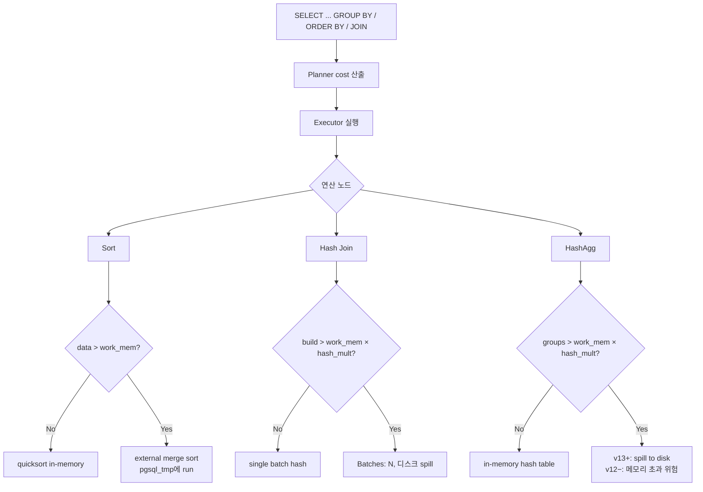
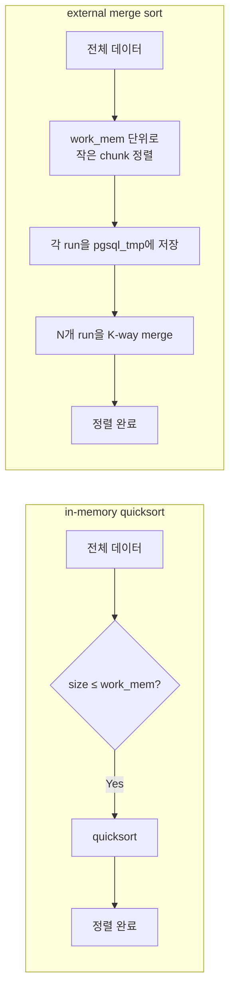
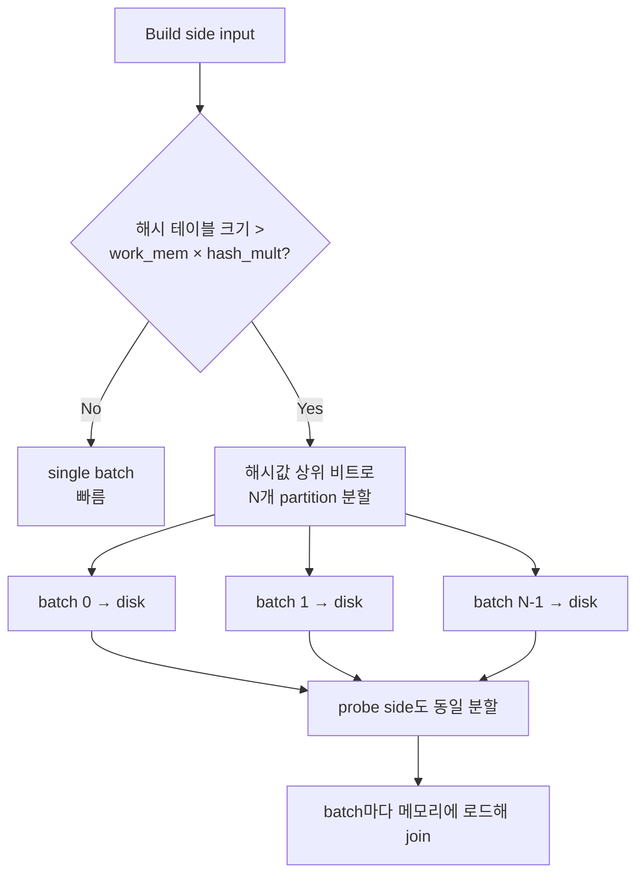
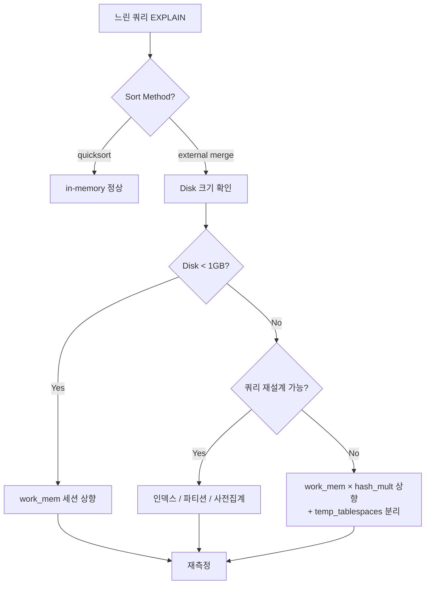

# B6. work_mem 부족 — 디스크 정렬과 HashAgg 배치 분할

> **증상 한 줄**: 같은 쿼리가 데이터가 늘어나면서 점점 느려진다. `EXPLAIN ANALYZE` 출력에 `Sort Method: external merge Disk: 2487520kB` 또는 `Buckets: 1024  Batches: 256  Memory Usage: 16384kB` 가 보이고, 실행 시간이 **in-memory 대비 10~100배** 늘어나 있다.

## 증상

| 지표 | 정상 (in-memory) | 장애 (디스크 spill) |
|------|------------------|---------------------|
| EXPLAIN Sort Method | `quicksort Memory: 3584kB` | `external merge  Disk: 2487520kB` |
| EXPLAIN Hash Join | `Batches: 1  Memory: 16 MB` | `Batches: 256  Memory: 16 MB` |
| EXPLAIN HashAggregate | `Memory: 8192kB` | `Planned Partitions: 256  Disk Usage: 4096MB` (v13+) |
| `pg_stat_statements.temp_blks_written` | 0 | 수백만~수억 |
| 쿼리 지연 | 120 ms | 45,000 ms |
| CPU vs I/O | CPU 90% | I/O wait 60%+ |
| `pg_stat_database.temp_files` 증가 | 드묾 | 초당 수 건 |

---

## 실제 상황 (재현 시나리오)

### 스키마 & 쿼리

분석 리포트 — 유저별 이벤트 집계.

```sql
CREATE TABLE events (
    event_id   bigserial PRIMARY KEY,
    user_id    bigint NOT NULL,
    event_type text,
    amount     numeric(12,2),
    created_at timestamptz NOT NULL
);
-- 3억 행, 45 GB
```

```sql
-- 장애 쿼리
SELECT user_id,
       event_type,
       count(*)       AS cnt,
       sum(amount)    AS total,
       avg(amount)    AS avg_amt
FROM events
WHERE created_at >= now() - interval '30 days'
GROUP BY user_id, event_type
ORDER BY total DESC
LIMIT 10000;
```

### 부하 조건

- 기본 `work_mem = 4MB` (기본값 방치).
- 30일 데이터: 약 5천만 행, 200만 유니크 `user_id`.
- GROUP BY 결과 카디널리티: 약 300만 행.
- 정렬 대상 크기: 약 180 MB.

### 타임라인

```
한 달 전: 데이터 1억 행 → 12초
2주 전: 데이터 2억 행 → 28초 (external merge sort 시작)
오늘:  데이터 3억 행 → 93초, p99 180초
       EXPLAIN ANALYZE에 external merge Disk: 4.2GB 관찰
```

---

## 원인 분석

### work_mem의 역할

`work_mem` 은 **하나의 실행 노드(operator) 하나가 쓸 수 있는 메모리 상한**이다. 연산별로:

| 연산 | work_mem 초과 시 동작 |
|------|----------------------|
| Sort | external merge sort — 임시 파일에 정렬된 run을 쓰고 multi-way merge |
| Hash Join | batch 분할 — 해시 테이블을 N개 partition으로 나눠 디스크에 저장하며 점진 처리 |
| HashAggregate | v13+: spill to disk (이전: 메모리 초과해도 스필 없이 사용, OOM 위험) |
| Materialize / CTE | spill 가능 |
| Window function (정렬 필요) | Sort와 동일 |
| SetOp (UNION, INTERSECT 등) | Sort 기반일 때 동일 |

### external merge sort의 내부

```
입력 데이터 → work_mem 크기만큼 in-memory 정렬 (run 생성)
       ↓
    → pgsql_tmp 에 run 파일 저장
       ↓
    → 여러 run을 merge (K-way merge)
       ↓
    → 정렬된 출력
```

- Run 크기가 `work_mem` 과 비례. work_mem이 작을수록 run 개수 많아지고 merge I/O 급증.
- work_mem 4MB에서 180MB 데이터 정렬 → **45개 run, 2패스 merge**, I/O 몇 배.

### Hash Join batch 분할

```
빌드 측 전체 → 해시 테이블이 work_mem 초과
  → 해시값 상위 비트로 N개 partition 분할
  → 각 partition 쌍을 디스크에 저장
  → partition마다 메모리에 로드해 join 수행
```

- `Batches: 1` 이 정상 (in-memory)
- `Batches: 256` = 빌드측이 256 조각으로 쪼개졌다는 뜻 → 디스크 I/O 급증.

### HashAggregate — v13부터 spill 가능

- **v12 이하**: HashAgg는 work_mem을 **넘어도 계속 메모리 사용** (spill 불가). OOM 위험.
- **v13+**: spill to disk 도입. `EXPLAIN ANALYZE`에 `Planned Partitions: N  Disk Usage: X kB`.

### 병렬 쿼리와 work_mem

- `max_parallel_workers_per_gather = 4` 라면 Sort/Hash 각 노드는 **worker당 work_mem** 을 독립적으로 사용.
- 동일 쿼리에서 `work_mem = 64MB`, leader + 4 worker = **최대 5 × 64MB = 320MB** 메모리 소모.
- 동시에 여러 연산 노드가 있으면 더 배수.

### `hash_mem_multiplier` (v13+)

- Hash 계열 연산만 **work_mem × hash_mem_multiplier** 만큼 사용 가능.
- 기본 1.0 (v13), 2.0 (v15+).
- Sort는 여전히 work_mem, HashJoin/HashAgg/SetOp Hash만 배수 적용.

### 흐름 요약



---

## 진단 쿼리 (복붙 가능)

### 1. EXPLAIN ANALYZE 포인트 체크

```sql
EXPLAIN (ANALYZE, BUFFERS, VERBOSE, SETTINGS)
SELECT user_id, event_type, count(*), sum(amount)
FROM events
WHERE created_at >= now() - interval '30 days'
GROUP BY user_id, event_type
ORDER BY 4 DESC LIMIT 10000;
```

확인 라인:
- `Sort Method: external merge  Disk: NkB` ← 발생한 경우
- `Sort Method: quicksort  Memory: NkB` ← 정상
- `HashAggregate  ...  Planned Partitions: N  Disk Usage: NkB` (v13+)
- `Hash Join  ...  Buckets: N  Batches: M  Memory Usage: NkB`
- `Buffers: shared hit=X read=Y, temp read=Z written=W`
- `Workers Planned: 4  Workers Launched: 4`

### 2. 현재 work_mem 및 관련 GUC

```sql
SELECT name, setting, unit, boot_val, reset_val, source
FROM pg_settings
WHERE name IN (
    'work_mem', 'hash_mem_multiplier',
    'maintenance_work_mem', 'temp_file_limit',
    'max_parallel_workers_per_gather', 'max_worker_processes',
    'enable_hashagg', 'enable_sort', 'enable_hashjoin'
);
```

### 3. temp 사용량 폭증 탐지

```sql
SELECT
    datname,
    temp_files,
    pg_size_pretty(temp_bytes)               AS total_temp,
    round(temp_bytes::numeric / NULLIF(temp_files,0) / 1024 / 1024, 1) AS avg_mb,
    stats_reset
FROM pg_stat_database
WHERE temp_files > 0
ORDER BY temp_bytes DESC;
```

### 4. pg_stat_statements — temp I/O 상위 쿼리

```sql
SELECT
    calls,
    round(total_exec_time::numeric)   AS total_ms,
    round(mean_exec_time::numeric, 2) AS mean_ms,
    temp_blks_read,
    temp_blks_written,
    pg_size_pretty((temp_blks_written * 8192)::bigint) AS temp_written,
    left(query, 200) AS query
FROM pg_stat_statements
WHERE temp_blks_written > 1000
ORDER BY temp_blks_written DESC
LIMIT 20;
```

### 5. log_temp_files 활성화

```sql
ALTER SYSTEM SET log_temp_files = '10MB';  -- 10MB 이상만 로그 (너무 작은 값은 노이즈)
SELECT pg_reload_conf();
```

### 6. 연결당 실제 사용 메모리 (Linux)

```bash
# 백엔드 PID 조회
psql -c "SELECT pid, state, query_start FROM pg_stat_activity WHERE state='active';"

# RSS 확인
ps -o pid,rss,cmd -p <PID>
# 또는 여러 백엔드 전체
ps -o pid,rss,cmd -C postgres | sort -k2 -n | tail -20
```

### 7. 특정 쿼리의 worker별 메모리 (v13+)

```sql
EXPLAIN (ANALYZE, VERBOSE)
  SELECT ... ;
-- Workers 섹션에서 각 worker의 Sort Memory, Hash Memory 확인
```

---

## 해결 방법

### 즉시 조치 — 문제 쿼리만 work_mem 상향

```sql
-- 트랜잭션 레벨 (권장)
BEGIN;
SET LOCAL work_mem = '256MB';
SET LOCAL hash_mem_multiplier = 2.0;   -- v13+
SELECT ... ;
COMMIT;

-- 세션 레벨
SET work_mem = '256MB';
SELECT ... ;
RESET work_mem;
```

**얼마나 올려야 하나?**
- EXPLAIN의 `Disk: 2487520kB` 를 기준. 대략 **temp 크기의 1.2~1.5배** 로 올리면 in-memory 전환.
- 180MB 데이터 → `work_mem = 256MB` 면 in-memory sort 가능.

### 단기 조치 — 유저·DB 기본값 조정

```sql
-- 분석가만 큰 work_mem
ALTER ROLE analyst SET work_mem = '256MB';

-- 특정 DB의 배치 유저
ALTER ROLE batch IN DATABASE analytics SET work_mem = '512MB';

-- 특정 세션에서 Hash 연산만 선호
SET hash_mem_multiplier = 2.0;
```

### 중장기 조치 — postgresql.conf

```conf
# 적정 work_mem 계산
#   peak = max_connections × work_mem × (avg_concurrent_operators, 보통 2~3)
#        + maintenance_work_mem × autovacuum_max_workers
#        + shared_buffers
#   peak < RAM × 0.7  가 안전

work_mem                 = 32MB     # 기본 4MB → 32~64MB
hash_mem_multiplier      = 2.0      # v13+, Hash 계열만 배수
maintenance_work_mem     = 2GB      # VACUUM, REINDEX, CREATE INDEX
temp_file_limit          = 50GB     # session당 temp 방어선
log_temp_files           = 10MB
```

**예시 계산**: `max_connections=200, work_mem=32MB` → 최악 `200 × 32MB × 3 = 19.2GB`.

### 근본 조치 — 쿼리 재작성

#### (a) 인덱스로 Sort 제거

```sql
-- ORDER BY created_at DESC LIMIT N 형태
CREATE INDEX idx_events_created_desc ON events (created_at DESC);
-- → Sort 노드 제거, Index Scan으로 바로 정렬된 결과
```

#### (b) 인덱스로 GroupAggregate 유도

```sql
-- GROUP BY user_id, event_type 에 인덱스
CREATE INDEX idx_events_group ON events (user_id, event_type)
    INCLUDE (amount);
-- → 플래너가 GroupAggregate 선택 가능 (sorted input)
-- HashAgg보다 메모리 적게 씀
```

#### (c) 파티셔닝으로 대상 데이터 축소

```sql
-- created_at 기준 월 단위 파티션
CREATE TABLE events (...) PARTITION BY RANGE (created_at);
-- WHERE created_at >= now() - interval '30 days' 가 파티션 pruning으로 대상 축소
```

#### (d) 사전 집계 (Materialized View / Summary Table)

```sql
CREATE MATERIALIZED VIEW mv_events_daily AS
SELECT user_id, event_type, date_trunc('day', created_at) AS day,
       count(*) AS cnt, sum(amount) AS total
FROM events
GROUP BY user_id, event_type, day;
-- 매일 REFRESH MATERIALIZED VIEW CONCURRENTLY
```

#### (e) 불필요한 ORDER BY / DISTINCT 제거

- `SELECT DISTINCT ... ORDER BY ...` 에서 DISTINCT가 비즈니스상 불필요한 경우가 의외로 많음.
- 화면 페이징의 기본 정렬이 대량 Sort 유발 — 인덱스 정렬 컬럼으로 변경.

#### (f) 병렬 제한

```sql
-- 병렬 worker가 각자 work_mem을 먹어 메모리가 부족한 경우
SET max_parallel_workers_per_gather = 0;   -- 해당 세션 병렬 off
```

---

## 예방 원칙 (체크리스트)

- [ ] EXPLAIN ANALYZE 검토 시 **`Sort Method: external merge`**, **`Batches: > 1`**, **`Disk Usage`** 이 3가지를 항상 확인.
- [ ] `log_temp_files = 10MB` 로 상시 temp 발생 로그.
- [ ] `work_mem` 전역은 보수적으로(16~32MB), **유저 레벨로 상향** (`ALTER ROLE`).
- [ ] 병렬 쿼리 환경에서 `max_parallel_workers_per_gather × work_mem` 이 세션당 메모리 한도를 넘지 않도록.
- [ ] `temp_file_limit` 설정으로 폭주 방어 (관련: [A6. Temp File 디스크 풀](./A6_temp_file_disk_full.md)).
- [ ] v13+로 업그레이드하여 **HashAggregate spill** 과 **hash_mem_multiplier** 활용.
- [ ] GROUP BY/ORDER BY 대상 컬럼에 인덱스 검토 — Sort 자체를 제거.
- [ ] 반복적인 대형 집계는 **Materialized View** 로.
- [ ] 주간 `pg_stat_statements.temp_blks_written` 상위 쿼리 리뷰.

---

## Mermaid — in-memory vs external sort 비교



### Hash Join batch 분할



### 튜닝 의사결정



---

## 관련 챕터 / 치트시트 / 다른 케이스

- [06장. 쿼리 플래너와 EXPLAIN — 메모리 관련 연산](../chapters/ch06_query_planner.md)
- [05장. 인덱스 — Sort 제거·GroupAggregate 유도](../chapters/ch05_indexes.md)
- [12장. 파티셔닝](../chapters/ch12_partitioning.md)
- [14장. 모니터링과 트러블슈팅](../chapters/ch14_monitoring_troubleshooting.md)
- [cheatsheets/explain_reading.md](../cheatsheets/explain_reading.md)
- [cheatsheets/config_parameters.md](../cheatsheets/config_parameters.md)
- [cheatsheets/pg_stat_queries.md](../cheatsheets/pg_stat_queries.md)
- 관련 케이스: [A6. Temp File 디스크 풀](./A6_temp_file_disk_full.md), [B5. 플랜 회귀](./B5_plan_regression.md), [B3. 잘못된 조인 순서](./B3_bad_join_order.md)

## 공식 문서 참조

- [Resource Consumption — work_mem](https://www.postgresql.org/docs/current/runtime-config-resource.html#GUC-WORK-MEM)
- [Resource Consumption — hash_mem_multiplier](https://www.postgresql.org/docs/current/runtime-config-resource.html#GUC-HASH-MEM-MULTIPLIER) (v13+)
- [Resource Consumption — temp_file_limit](https://www.postgresql.org/docs/current/runtime-config-resource.html#GUC-TEMP-FILE-LIMIT)
- [Query Planning — enable_hashagg](https://www.postgresql.org/docs/current/runtime-config-query.html#GUC-ENABLE-HASHAGG)
- [Using EXPLAIN — Sort / Hash / Aggregate 노드](https://www.postgresql.org/docs/current/using-explain.html)
- [PostgreSQL 13 Release Notes — HashAggregate spill to disk](https://www.postgresql.org/docs/13/release-13.html)
