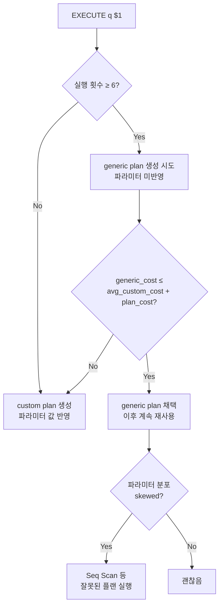
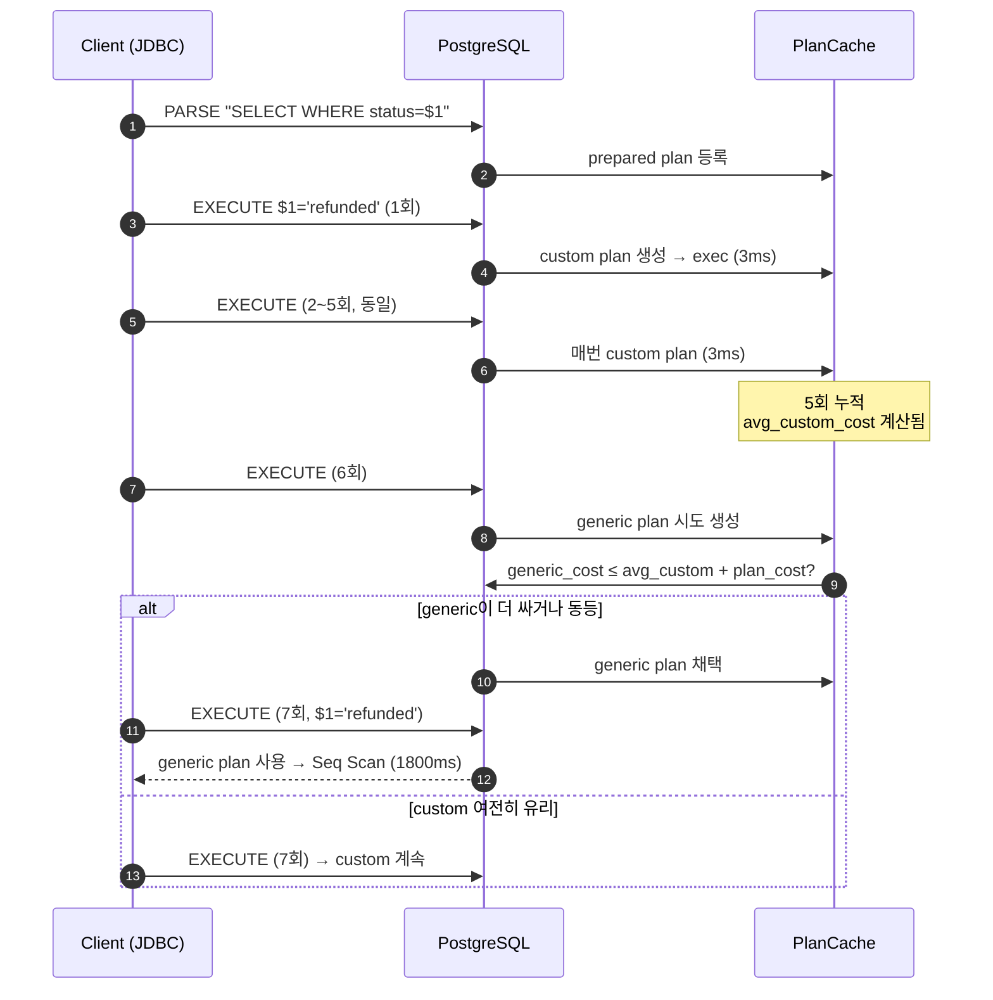
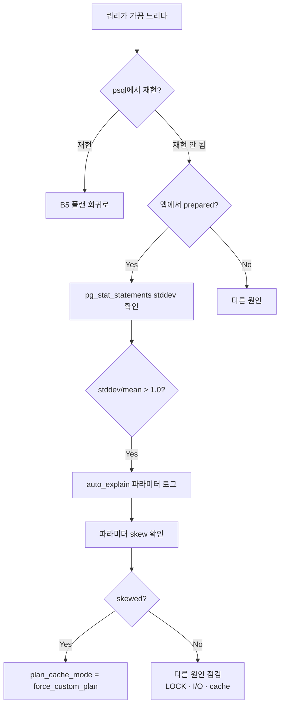

# B7. Prepared Statement 플랜 캐시 함정 — psql에선 빠른데 앱에선 느리다

> **증상 한 줄**: JDBC·psycopg·node-pg 같은 드라이버에서 특정 파라미터 값 쿼리만 **비정상적으로** 느리다. `psql`에서 같은 쿼리를 직접 실행하면 정상. 쿼리를 처음 몇 번 돌릴 땐 빠르다가 **6번째 실행부터 갑자기** 느려진다.

## 증상

| 지표 | psql 직접 실행 (custom plan) | 앱 드라이버 (generic plan) |
|------|------------------------------|-----------------------------|
| 실행 시간 | 3 ms | 1,800 ms |
| EXPLAIN | Index Scan on idx_orders_user | **Seq Scan on orders** |
| Rows 추정 | 50 (실제값 기반) | 500,000 (파라미터 무시한 평균) |
| pg_stat_statements mean | 3 ms | 변동 폭 수백 배 (일부 파라미터만 느림) |
| 재현 조건 | 항상 빠름 | **5번 실행 후부터** 돌발적 |

전형적 증상 호소:
- "JDBC에서만 느리다, psql에선 멀쩡하다."
- "배포 직후엔 빠른데 몇 시간 지나면 느려진다."
- "특정 유저 ID / 상태 값으로만 타임아웃 난다."
- "pgBouncer transaction pooling 도입 후 prepared statement 에러가 간헐 발생."

---

## 실제 상황 (재현 시나리오)

### 스키마 (skewed data)

```sql
CREATE TABLE orders (
    order_id bigserial PRIMARY KEY,
    user_id  bigint NOT NULL,
    status   text   NOT NULL,    -- 'delivered' 98%, 'pending' 1.5%, 'refunded' 0.5%
    amount   numeric(12,2),
    created_at timestamptz DEFAULT now()
);
CREATE INDEX idx_orders_user   ON orders (user_id);
CREATE INDEX idx_orders_status ON orders (status);
-- 5억 행, MCV: delivered=0.98, pending=0.015, refunded=0.005
```

### 문제 쿼리 (bound parameter)

```sql
-- 앱에서 prepared statement로 실행
PREPARE q AS
SELECT * FROM orders WHERE status = $1 ORDER BY created_at DESC LIMIT 100;

-- 1~5회: 빠름 (custom plan, $1='refunded' → Index Scan on idx_orders_status)
EXECUTE q('refunded');  -- 3ms
EXECUTE q('refunded');  -- 3ms
...

-- 6번째부터: 느림 (generic plan 선택)
EXECUTE q('refunded');  -- 1800ms, Seq Scan
```

### 타임라인

```
10:00  배포, 앱 시작 — 모든 쿼리 빠름 (custom plan)
10:12  특정 엔드포인트 p99 급증 경보 (60ms → 1800ms)
10:15  SRE가 해당 유저로 직접 psql 실행 — 3ms (정상)
10:20  pg_stat_statements 로 동일 query의 mean_exec_time 분산 확인
10:30  plan_cache_mode=force_custom_plan 설정 후 복구
```

---

## 원인 분석

### Prepared Statement의 2가지 플랜 전략

PostgreSQL은 Prepared Statement (`PREPARE` / `EXECUTE` 또는 드라이버 자동) 실행 시 두 가지 플랜을 구분한다:

| 플랜 | 시점 | 특징 |
|------|------|------|
| **custom plan** | `EXECUTE` 할 때마다 바인드 값으로 재계획 | 파라미터 값에 최적 · 계획 비용 있음 |
| **generic plan** | `PREPARE` 시 한 번 만들고 재사용 | 계획 비용 없음 · 파라미터 무시 (평균 selectivity 가정) |

### `plan_cache_mode = auto` (기본) 의 동작

1. 1~5번째 실행: **custom plan** 생성. 실행 비용 기록.
2. 6번째 실행: **generic plan** 을 시도 생성. 그 비용과 **평균 custom plan 비용**을 비교.
   - `generic_cost ≤ avg_custom_cost + planning_cost` → 이후 generic plan 사용
   - 아니면 계속 custom plan
3. generic plan이 한 번 채택되면 **계속 사용** (단, 테이블 invalidation 시 재계획).

### 왜 skewed data에서 망가지는가

- Generic plan은 파라미터를 **실제 값이 아니라 평균 selectivity** 로 가정.
- `status = $1` 에서 `$1='refunded'` 이면 실제 selectivity 0.005, 결과 2.5M 중 250만.
  - **Custom plan**: selectivity 0.005 → IndexScan on idx_orders_status (빠름)
  - **Generic plan**: 평균 selectivity = 1/n_distinct = 1/3 ≈ 0.33 → Seq Scan (느림, 실제 값에서는 참사)

### MCV 히스토그램은 custom plan에서만 쓰인다

- `pg_stats.most_common_vals` 의 정확한 frequency는 **파라미터 값이 알려져야** 활용 가능.
- Generic plan은 값을 모르니 **평균값** (`(1 - sum(mcv_freqs)) / (n_distinct - num_mcv)`) 으로 추정.
- 결과: skewed 분포에서 generic plan은 거의 항상 오답.

### 드라이버별 동작

| 드라이버 | 기본 동작 |
|---------|-----------|
| psycopg2 | `server_side_binding=False` (기본) → 매번 문자열로 전송 (이 문제 없음) |
| psycopg (psycopg3) | `prepare_threshold=5` (기본) — 5번 호출되면 prepared로 전환 |
| PgJDBC | `prepareThreshold=5` (기본) — 동일 |
| node-pg | 명시적으로 `name` 지정 시 prepared |
| Go pgx | `PreferSimpleProtocol = false` 기본 → prepared 기본 사용 |

### pgBouncer의 함정

- **session pooling**: prepared statement 정상 작동.
- **transaction pooling / statement pooling**: prepared statement가 **세션에 종속**이라 서로 다른 백엔드로 라우팅되면 "prepared statement does not exist" 에러.
- pgBouncer 1.21+ (2023) 부터 transaction mode에서 prepared statement **제한적** 지원 (`max_prepared_statements` 설정).

### 흐름 요약



---

## 진단 쿼리 (복붙 가능)

### 1. 현재 준비된 prepared statement 조회

```sql
SELECT name, statement, prepare_time,
       parameter_types, result_types,
       from_sql, generic_plans, custom_plans
FROM pg_prepared_statements;
-- v14+: generic_plans / custom_plans 컬럼으로 실행 카운트 확인
```

### 2. plan_cache_mode 확인

```sql
SHOW plan_cache_mode;
-- auto (기본), force_custom_plan, force_generic_plan
```

### 3. Generic plan 강제로 보기 (v16+)

```sql
-- 실제 실행 없이 generic plan의 구조 확인
EXPLAIN (GENERIC_PLAN)
SELECT * FROM orders WHERE status = $1 ORDER BY created_at DESC LIMIT 100;

-- 비교: 특정 값의 custom plan
EXPLAIN
SELECT * FROM orders WHERE status = 'refunded' ORDER BY created_at DESC LIMIT 100;
```

### 4. pg_stat_statements — 분산이 큰 쿼리

```sql
SELECT
    queryid,
    calls,
    round(mean_exec_time::numeric, 2)   AS mean_ms,
    round(stddev_exec_time::numeric, 2) AS stddev_ms,
    round((stddev_exec_time / NULLIF(mean_exec_time, 0))::numeric, 2) AS cv,
    round(min_exec_time::numeric, 2)    AS min_ms,
    round(max_exec_time::numeric, 2)    AS max_ms,
    left(query, 150) AS query
FROM pg_stat_statements
WHERE calls > 100
ORDER BY stddev_exec_time DESC
LIMIT 20;
-- cv (coefficient of variation) 가 크면 파라미터 편차가 있는 쿼리
-- (prepared statement 트랩 유력 후보)
```

### 5. auto_explain으로 파라미터 로깅

```conf
# postgresql.conf
shared_preload_libraries   = 'auto_explain'
auto_explain.log_min_duration = 100ms
auto_explain.log_analyze      = on
auto_explain.log_buffers      = on
auto_explain.log_parameter_max_length = -1   -- 파라미터 전체 로깅
```

로그에 아래가 남는다:
```
LOG:  duration: 1782.123 ms  plan:
      Query Text: SELECT * FROM orders WHERE status = $1 ORDER BY created_at DESC LIMIT 100
      Query Parameters: $1 = 'refunded'
      ->  Seq Scan on orders ... (estimated rows=166666666, actual rows=2500000)
```

### 6. 현재 activity의 prepared 여부

```sql
SELECT pid, usename, state, query,
       query_id, xact_start, now() - query_start AS running
FROM pg_stat_activity
WHERE state = 'active'
ORDER BY running DESC NULLS LAST
LIMIT 20;
```

### 7. 통계 분포 확인 (skewed 여부)

```sql
SELECT attname, n_distinct,
       most_common_vals,
       most_common_freqs,
       null_frac
FROM pg_stats
WHERE tablename = 'orders' AND attname = 'status';
```

---

## 해결 방법

### 즉시 조치 — 세션/트랜잭션 레벨 강제

```sql
-- 문제 쿼리만 항상 custom plan
SET plan_cache_mode = force_custom_plan;

-- 트랜잭션 단위
BEGIN;
SET LOCAL plan_cache_mode = force_custom_plan;
EXECUTE q('refunded');
COMMIT;
```

효과: 매 실행마다 re-plan → 파라미터 반영 → skewed에도 올바른 플랜. 대신 계획 비용 추가 (보통 1ms 미만).

### 단기 조치

#### (a) 애플리케이션에서 prepared 비활성

- **PgJDBC**: `prepareThreshold=0` (threshold 넘지 않음 = never prepared)
- **psycopg3**: `prepare_threshold=None`
- **pgx (Go)**: `PreferSimpleProtocol = true`
- **node-pg**: 쿼리 오브젝트에 `name` 속성 주지 않기

#### (b) 특정 쿼리만 unprepare

```sql
-- 서버 레벨 (현재 세션의 prepared만 영향)
DEALLOCATE q;

-- 전체
DEALLOCATE ALL;
```

#### (c) `plan_cache_mode` 를 유저/DB 기본값으로

```sql
-- 특정 유저의 모든 쿼리에 적용
ALTER ROLE appuser SET plan_cache_mode = force_custom_plan;

-- 특정 DB
ALTER DATABASE shop SET plan_cache_mode = force_custom_plan;
```

> `force_generic_plan` 은 반대 방향 — generic plan만 쓰도록 강제. 파라미터 분포가 균등한 쿼리에 적합.

### 중장기 조치

#### (a) 쿼리 재작성 — skewed 값 분리

```sql
-- Before: 하나의 쿼리로 모든 status 처리
SELECT * FROM orders WHERE status = $1 LIMIT 100;

-- After: 자주 쓰이는 값은 상수로 인라인 (다른 쿼리로 분리)
-- 애플리케이션 로직에서 분기
-- if status in ('refunded', 'pending'):
--     execute ("SELECT ... WHERE status = 'refunded' ...")  ← 상수라 매번 full plan
-- else:
--     execute prepared
```

#### (b) 부분 인덱스 (Partial Index)

```sql
-- skewed 값에만 인덱스
CREATE INDEX idx_orders_status_rare ON orders (created_at DESC)
    WHERE status IN ('refunded', 'pending');
-- generic plan이 이 인덱스를 고를 가능성 상승
```

#### (c) Extended Statistics

```sql
CREATE STATISTICS stat_orders_status ON status FROM orders;
ANALYZE orders;
-- n_distinct / MCV를 generic plan이 더 잘 활용 (제한적)
```

#### (d) v16+: `EXPLAIN (GENERIC_PLAN)` 으로 사전 검증

- 배포 전 주요 prepared 쿼리를 generic plan으로 EXPLAIN하여 플랜 회귀 가능성 확인.

### pgBouncer 환경 — 특별 주의

1. **session mode** 사용 — prepared statement 무난.
2. **transaction mode 에서 prepared 쓰려면**:
   - pgBouncer 1.21+ 필요.
   - `pgbouncer.ini` 에 `max_prepared_statements = 100` 설정.
   - 애플리케이션 드라이버가 server-side prepared를 사용하되 named statement 관리를 풀 친화적으로.
3. 문제 발생 시 로그:
   ```
   ERROR: prepared statement "S_1" does not exist
   ```
4. 가장 안전한 해결: **드라이버 prepared를 비활성** 하고 client-side parameter binding 사용 (psycopg2 기본 동작).

---

## 예방 원칙 (체크리스트)

- [ ] Skewed 데이터(특정 값 빈도 ≥ 95%)에 파라미터 바인딩 쿼리를 쓰는 경우, **`plan_cache_mode = force_custom_plan`** 을 유저 레벨로 설정.
- [ ] `pg_stat_statements` 의 `stddev_exec_time / mean_exec_time` 비율이 큰 쿼리를 **주간 리뷰**.
- [ ] `auto_explain.log_parameter_max_length = -1` 로 느린 쿼리의 파라미터 값을 남긴다.
- [ ] 드라이버의 `prepareThreshold` 를 팀 내 표준으로 정한다 (보통 `0` = 비활성 또는 `100+` = 충분히 warmed up된 쿼리만).
- [ ] pgBouncer transaction mode를 쓴다면 **드라이버 prepared 비활성** 을 기본으로.
- [ ] PostgreSQL **v16 이상** 이면 배포 전 `EXPLAIN (GENERIC_PLAN)` 으로 주요 쿼리 검증.
- [ ] Skewed 값 빈도 컬럼에는 **partial index** 검토.
- [ ] `pg_prepared_statements.generic_plans / custom_plans` (v14+) 모니터링으로 전환 시점 파악.

---

## Mermaid — 1~5회 custom → 6회+ generic 전환



### 문제 해결 의사결정



---

## 관련 챕터 / 치트시트 / 다른 케이스

- [06장. 쿼리 플래너와 EXPLAIN — 통계·선택률](../chapters/ch06_query_planner.md)
- [07장. 트랜잭션과 격리 수준](../chapters/ch07_transactions_isolation.md)
- [14장. 모니터링과 트러블슈팅](../chapters/ch14_monitoring_troubleshooting.md)
- [cheatsheets/explain_reading.md](../cheatsheets/explain_reading.md)
- [cheatsheets/pg_stat_queries.md](../cheatsheets/pg_stat_queries.md)
- [cheatsheets/config_parameters.md](../cheatsheets/config_parameters.md)
- 관련 케이스: [B5. 플랜 회귀](./B5_plan_regression.md), [B2. 인덱스 있는데 Seq Scan](./B2_seq_scan_with_index.md), [D1. 커넥션 고갈](./D1_connection_exhaustion.md)

## 공식 문서 참조

- [PREPARE](https://www.postgresql.org/docs/current/sql-prepare.html)
- [EXECUTE](https://www.postgresql.org/docs/current/sql-execute.html)
- [Query Planning — plan_cache_mode](https://www.postgresql.org/docs/current/runtime-config-query.html#GUC-PLAN-CACHE-MODE)
- [EXPLAIN — GENERIC_PLAN 옵션](https://www.postgresql.org/docs/16/sql-explain.html) (v16+)
- [pg_prepared_statements](https://www.postgresql.org/docs/current/view-pg-prepared-statements.html)
- [auto_explain — log_parameter_max_length](https://www.postgresql.org/docs/current/auto-explain.html)
- [PgJDBC — Server Prepared Statements](https://jdbc.postgresql.org/documentation/server-prepare/)
- [pgBouncer — Prepared Statements Support](https://www.pgbouncer.org/config.html#max_prepared_statements) (1.21+)
