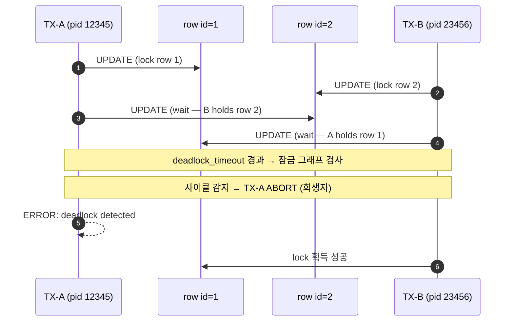
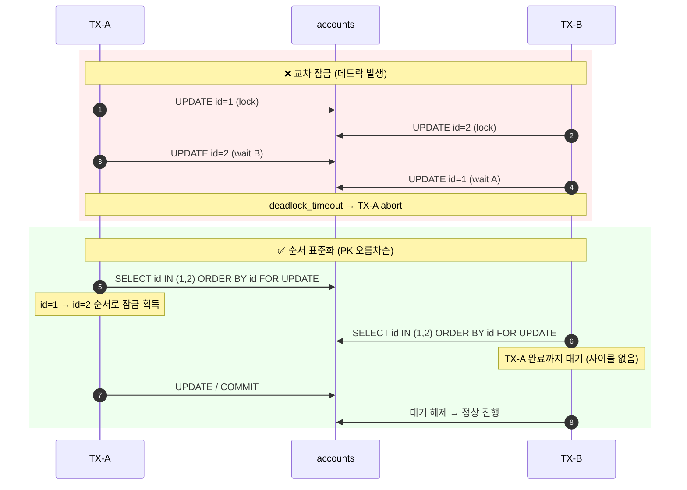

# C1. Deadlock — 두 트랜잭션이 서로를 기다리다 한쪽이 죽는다

> **증상 박스**
> - `ERROR: deadlock detected`
> - `DETAIL: Process 12345 waits for ShareLock on transaction 98765; blocked by process 23456.`
> - 동일 주문/결제/재고 로직에서 간헐적으로 트랜잭션 실패
> - 실패한 트랜잭션은 자동으로 ROLLBACK 되지만, 애플리케이션은 5xx로 떨어진다

---

## 증상

PostgreSQL은 일정 주기(`deadlock_timeout`, 기본 1s)로 잠금 그래프를 체크해 사이클이 있으면 **한쪽 트랜잭션을 강제 ABORT**한다.

```
2026-04-24 13:22:01 KST [12345] ERROR:  deadlock detected
2026-04-24 13:22:01 KST [12345] DETAIL:  Process 12345 waits for ShareLock on transaction 98765; blocked by process 23456.
        Process 23456 waits for ShareLock on transaction 98764; blocked by process 12345.
        Process 12345: UPDATE accounts SET balance = balance - 100 WHERE id = 2
        Process 23456: UPDATE accounts SET balance = balance + 100 WHERE id = 1
2026-04-24 13:22:01 KST [12345] HINT:  See server log for query details.
2026-04-24 13:22:01 KST [12345] CONTEXT:  while updating tuple (0,5) in relation "accounts"
```

서비스에서는 이렇게 보인다.

- Sentry/Datadog에 `deadlock detected` 예외 급증
- 같은 API에서 일부 요청만 실패 (재시도하면 성공)
- DB CPU/메모리 지표는 정상 — 순수한 동시성 충돌

---

## 실제 상황

계좌 이체 API. 동시에 두 사용자가 서로에게 송금했다.

```
TX-A: user1 → user2 로 100원
TX-B: user2 → user1 로 50원

TX-A 코드:                           TX-B 코드:
  UPDATE accounts SET balance=..        UPDATE accounts SET balance=..
    WHERE id = 1;                         WHERE id = 2;
  UPDATE accounts SET balance=..        UPDATE accounts SET balance=..
    WHERE id = 2;                         WHERE id = 1;
```

두 트랜잭션이 **반대 순서**로 같은 두 행을 잠그면서 사이클이 만들어진다. 한쪽이 희생(abort)되어야만 풀린다.

---

## 원인 분석

### 1) PostgreSQL의 행 잠금

```
UPDATE / DELETE / SELECT FOR UPDATE
  → 해당 튜플에 RowExclusiveLock (사실은 xmax 기록 + Transaction ID Lock)

다른 TX가 같은 튜플을 수정/잠금 시도
  → 첫 TX의 commit/rollback까지 대기 (ShareLock on transaction)
```

### 2) 데드락 사이클



### 3) 자주 보이는 패턴

| 패턴 | 설명 |
|------|------|
| 계좌 이체 | 두 계정을 반대 순서로 UPDATE |
| 재고 차감 + 주문 INSERT | FK로 묶인 테이블을 순서 다르게 접근 |
| 배치 업데이트 | `WHERE id IN (...)` 의 처리 순서가 플래너에 따라 다름 |
| 외래키 | 자식 INSERT가 부모에 `ShareLock` → 다른 TX의 부모 UPDATE와 충돌 |
| SELECT FOR UPDATE 누락 | 읽은 값으로 UPDATE 시 다른 TX와 교차 |

---

## 진단 쿼리

### 서버 설정 먼저 확인

```sql
-- 데드락을 감지하는 주기 (기본 1s)
SHOW deadlock_timeout;

-- 잠금 대기를 로그로 남기기 (반드시 on 권장)
SHOW log_lock_waits;

-- 운영 권장: postgresql.conf
-- log_lock_waits = on
-- deadlock_timeout = '1s'
-- log_line_prefix = '%m [%p] %q%u@%d '
```

### 현재 잠금 상태

```sql
-- 어떤 세션이 어떤 세션을 막고 있는가
SELECT
    blocked.pid           AS blocked_pid,
    blocked.usename       AS blocked_user,
    blocked.query         AS blocked_query,
    blocking.pid          AS blocking_pid,
    blocking.usename      AS blocking_user,
    blocking.query        AS blocking_query,
    blocked.wait_event_type,
    blocked.wait_event,
    now() - blocked.xact_start AS blocked_duration
FROM pg_stat_activity AS blocked
JOIN pg_stat_activity AS blocking
  ON blocking.pid = ANY(pg_blocking_pids(blocked.pid))
WHERE blocked.wait_event_type = 'Lock';
```

### pg_locks 로 상세히

```sql
SELECT
    l.pid,
    l.locktype,
    l.mode,
    l.granted,
    l.relation::regclass AS relation,
    a.state,
    a.query
FROM pg_locks l
JOIN pg_stat_activity a ON a.pid = l.pid
WHERE NOT l.granted OR l.locktype IN ('transactionid','tuple','relation')
ORDER BY l.pid;
```

### 데드락 발생 통계

```sql
-- 데이터베이스별 누적 데드락 수
SELECT datname, deadlocks FROM pg_stat_database WHERE datname = current_database();
```

---

## 해결

### 1) 자원 접근 순서 표준화 (가장 중요)

**규칙: 여러 행을 잠글 때는 항상 PK 오름차순으로.**

```sql
-- ❌ 나쁜 예: 호출자가 넘긴 순서대로
UPDATE accounts SET balance = balance - :amt WHERE id = :from_id;
UPDATE accounts SET balance = balance + :amt WHERE id = :to_id;

-- ✅ 좋은 예: 항상 작은 id 먼저 잠금 획득
BEGIN;
SELECT id FROM accounts
 WHERE id IN (:from_id, :to_id)
 ORDER BY id
 FOR UPDATE;              -- 작은 id부터 순서대로 잠금
UPDATE accounts SET balance = balance - :amt WHERE id = :from_id;
UPDATE accounts SET balance = balance + :amt WHERE id = :to_id;
COMMIT;
```

두 트랜잭션이 같은 순서로 잠금을 획득하면 사이클이 생길 수 없다.

### 2) 배치 UPDATE/DELETE 는 ORDER BY 고정

```sql
-- 플래너가 순서를 바꿀 수 있으므로 명시적으로 정렬된 CTE로 잠근다
WITH locked AS (
    SELECT id FROM orders
    WHERE status = 'pending'
    ORDER BY id              -- 순서 고정
    FOR UPDATE
)
UPDATE orders SET status = 'processing'
WHERE id IN (SELECT id FROM locked);
```

### 3) 큐 워커는 SKIP LOCKED

N개의 워커가 같은 큐 테이블을 폴링할 때 효과적.

```sql
-- 워커가 "잠기지 않은" 작업만 가져간다 → 서로를 기다리지 않음
BEGIN;
SELECT id, payload FROM job_queue
 WHERE status = 'ready'
 ORDER BY created_at
 LIMIT 10
 FOR UPDATE SKIP LOCKED;
-- ... 처리 ...
UPDATE job_queue SET status='done' WHERE id IN (...);
COMMIT;
```

### 4) 애플리케이션 재시도 로직

데드락은 **정상적으로 발생할 수 있는 상황**이다. SQLSTATE `40P01` 을 잡아 재시도.

```python
# Python 예시
import psycopg
from psycopg.errors import DeadlockDetected
import time, random

def run_with_retry(fn, max_retry=3):
    for attempt in range(max_retry):
        try:
            return fn()
        except DeadlockDetected:
            if attempt == max_retry - 1:
                raise
            time.sleep(0.05 * (2 ** attempt) + random.random() * 0.05)  # exponential backoff
```

### 5) 트랜잭션 짧게 유지

트랜잭션이 길수록 충돌 확률이 기하급수적으로 오른다.

```
규칙:
  - BEGIN 후 외부 API 호출 금지
  - 파일 업로드 후 BEGIN
  - 사용자 입력 대기 중 BEGIN 상태 유지 금지
```

---

## 예방

```
설계 단계 체크리스트:

  1. "이 트랜잭션이 건드리는 모든 테이블/행을 어떤 순서로 잠그는가"
     → 문서화. 모든 코드에서 동일 순서 준수.

  2. 외래키가 걸린 테이블은 부모 → 자식 순서로 접근

  3. 배치 작업은 ORDER BY 고정 + SKIP LOCKED 고려

  4. ORM 의 "lazy load" 가 숨은 UPDATE를 만드는지 확인
     (save 시점에 dirty field 만 UPDATE 하는 설정 권장)

  5. log_lock_waits = on + deadlock_timeout 1s
     → 데드락 직전 "오래 대기 중" 로그부터 보이면 조기 감지 가능

  6. 장애 후 반드시 pg_stat_database.deadlocks 추세 관찰
     → 코드 변경으로 줄어드는지 확인
```

---

## Mermaid — 데드락 방지 전후



---

## 관련 챕터

- [7장. 트랜잭션과 격리 수준](../chapters/ch07_transactions_isolation.md) — Lock 모드 전체 매트릭스
- [3장. MVCC](../chapters/ch03_mvcc.md) — xmax, Transaction ID Lock 동작 원리
- [C2. idle in transaction](C2_idle_in_transaction.md) — 긴 트랜잭션이 데드락 확률을 높이는 구조
- [C3. DDL이 쿼리를 막는다](C3_ddl_blocking.md) — DDL 과 데드락의 교차 사례
- [cheatsheets/pg_stat_queries.md](../cheatsheets/pg_stat_queries.md) — Lock 진단 쿼리 모음
