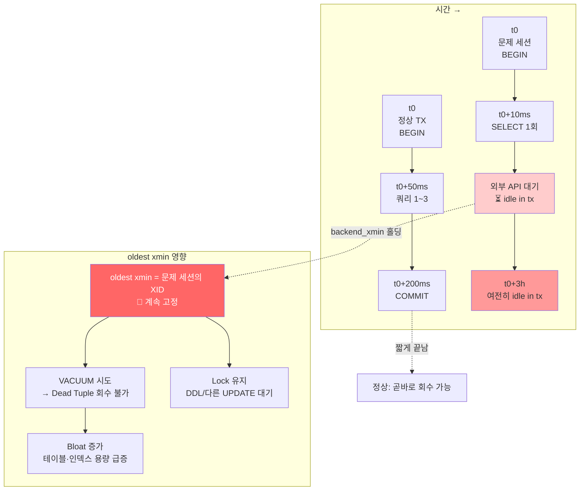

# C2. idle in transaction — BEGIN만 치고 잊힌 세션이 DB를 마비시킨다

> **증상 박스**
> - `pg_stat_activity` 에 `state = 'idle in transaction'` 세션이 수 시간째 살아있음
> - VACUUM 이 돌아도 Dead Tuple 이 줄지 않고 테이블 Bloat 가 계속 증가
> - DDL, 장기 실행 UPDATE 가 아무 이유 없이 대기 상태
> - 모니터링 대시보드에 `max xact age` / `oldest xmin` 경고

---

## 증상

서비스는 멀쩡한데 다음과 같은 현상이 동시에 나타난다.

1. **테이블 용량이 계속 증가**한다 — 데이터 건수는 그대로인데.
2. `ALTER TABLE ... ADD COLUMN`, `REINDEX CONCURRENTLY` 같은 작업이 **무한 대기**.
3. Autovacuum 로그에 `skipping vacuum of "foo" --- lock not available` 또는 `oldest xmin: 12345678` 가 수 시간째 그대로.
4. `pg_stat_activity` 를 보면 한 세션이 쿼리를 끝낸 상태로 수 시간째 트랜잭션을 열어두고 있다.

```
 pid  |  usename  |    state              | backend_start        | xact_start           | query
------+-----------+-----------------------+----------------------+----------------------+-------------------------
 7821 | app_user  | idle in transaction   | 2026-04-24 04:10:02  | 2026-04-24 04:10:05  | SELECT * FROM orders ...
 7911 | app_user  | idle                  | 2026-04-24 08:30:11  | (null)               | ...
 8012 | autovac   | active                | 2026-04-24 13:00:00  | 2026-04-24 13:00:00  | autovacuum: VACUUM ...
```

`pid 7821` 은 9시간째 BEGIN 상태. 이 세션 하나가 전 DB를 조금씩 마비시키고 있다.

---

## 실제 상황

주문 처리 API. 결제 PG 사에 HTTP 요청을 보내기 전에 트랜잭션을 열었다.

```python
# ❌ 실제로 장애를 낸 코드
with conn.transaction():           # BEGIN
    order = db.insert_order(...)   # 1) DB INSERT
    payment = pg_client.charge(    # 2) 외부 HTTP 호출 (p99 15초, 타임아웃 60초)
        order.amount
    )
    db.update_order_paid(order.id) # 3) DB UPDATE
    # ↑ 2) 에서 예외 발생 시 with 블록을 빠져나가며 ROLLBACK
```

대부분은 문제없이 돈다. 그런데 결제사 측 네트워크 이슈로 **HTTP 요청이 수 분간 매달려 있는 케이스**가 생기면서, 그 시간 동안 `idle in transaction` 세션이 누적됐다.

더 심각한 케이스: ORM 의 예외 처리 버그로 `except` 블록에서 `rollback()` 을 호출하지 않고 그냥 에러를 로깅만 했다. 세션은 연결 풀로 반환되지만 **트랜잭션은 열린 상태**로 재사용된다.

---

## 원인 분석

### 왜 치명적인가 — MVCC 의 oldest xmin

PostgreSQL 의 VACUUM 은 "이 튜플을 아무도 읽지 않을 때" 만 Dead Tuple 로 회수한다.

```
oldest xmin = 현재 열려 있는 가장 오래된 스냅샷의 XID

VACUUM 이 회수할 수 있는 조건:
  dead_tuple.xmax < oldest xmin

하나의 idle in transaction 세션이 있으면:
  oldest xmin = 그 세션이 BEGIN 했을 때의 XID 에 고정
  → 그 이후 만들어진 모든 Dead Tuple 이 회수 불가
  → 테이블 전체가 Bloat
```

즉, **한 세션의 BEGIN 하나가 전체 DB 의 VACUUM 을 무력화**한다.

### 추가 피해

| 항목 | 영향 |
|------|------|
| VACUUM | Dead Tuple 회수 불가 → Bloat 증가 |
| Index | Bloat 와 함께 불필요한 페이지 스캔 → 쿼리 느려짐 |
| Lock | BEGIN 시 획득한 행/테이블 잠금이 계속 유지 |
| Connection | 풀 1슬롯 점유 (최악의 경우 전체 슬롯이 idle in tx 가 될 수 있음) |
| Replication | logical slot 이 WAL 회수 못 함 (`restart_lsn` 고정) |
| XID Wraparound | 긴 트랜잭션이 수일~수주 살면 wraparound 임박 |

### 상태 구분

```
state              설명                                          VACUUM 영향
-----------------  ------------------------------------------    -----------
active             쿼리 실행 중                                   (정상)
idle               트랜잭션 종료, 커넥션만 유휴                    (정상)
idle in transaction
                   BEGIN 친 상태에서 쿼리 없음                    ☠️ oldest xmin 고정
idle in transaction (aborted)
                   트랜잭션 내 에러 발생 후 롤백/커밋 안 한 상태    ☠️ 위와 동일
```

---

## 진단 쿼리

### 1) idle in transaction 세션 전수 조회

```sql
SELECT
    pid,
    usename,
    application_name,
    client_addr,
    state,
    now() - xact_start        AS xact_age,
    now() - state_change      AS idle_age,
    backend_xmin,
    wait_event_type,
    wait_event,
    left(query, 120)          AS last_query
FROM pg_stat_activity
WHERE state IN ('idle in transaction', 'idle in transaction (aborted)')
ORDER BY xact_start;
```

### 2) "oldest xmin" 이 누구 때문에 고정되어 있는지

```sql
SELECT
    datname,
    pid,
    usename,
    state,
    backend_xmin,
    now() - xact_start AS xact_age,
    query
FROM pg_stat_activity
WHERE backend_xmin IS NOT NULL
ORDER BY backend_xmin ASC      -- 가장 오래된 XID 순
LIMIT 10;
```

### 3) 상태별 집계

```sql
SELECT state, count(*), max(now() - xact_start) AS max_age
FROM pg_stat_activity
WHERE state IS NOT NULL
GROUP BY state
ORDER BY count DESC;
```

### 4) VACUUM 이 왜 회수 못 하는지

```sql
-- autovacuum 로그 확인
SELECT relname, last_autovacuum, n_dead_tup, n_live_tup,
       round(n_dead_tup::numeric / NULLIF(n_live_tup,0) * 100, 1) AS dead_pct
FROM pg_stat_user_tables
ORDER BY n_dead_tup DESC LIMIT 10;
```

### 5) 긴급 — 특정 세션 종료

```sql
-- 취소 시도 (현재 쿼리만 취소)
SELECT pg_cancel_backend(7821);

-- 강제 종료 (세션 자체 제거)
SELECT pg_terminate_backend(7821);

-- 10분 이상 idle in transaction 전부 종료
SELECT pg_terminate_backend(pid)
FROM pg_stat_activity
WHERE state IN ('idle in transaction','idle in transaction (aborted)')
  AND now() - state_change > interval '10 minutes';
```

---

## 해결

### 즉시 조치 — 서버 측 가드레일

```sql
-- 10분 이상 idle in transaction 은 DB 가 자동 종료
ALTER SYSTEM SET idle_in_transaction_session_timeout = '10min';

-- 쿼리 자체도 최대 실행 시간 제한
ALTER SYSTEM SET statement_timeout = '60s';

-- 15분 이상 걸리는 트랜잭션 전체를 종료 (PG14+)
ALTER SYSTEM SET idle_session_timeout = '30min';

SELECT pg_reload_conf();
```

특정 애플리케이션에만 짧게 걸고 싶다면:

```sql
ALTER ROLE app_worker SET idle_in_transaction_session_timeout = '30s';
ALTER ROLE batch_job  SET idle_in_transaction_session_timeout = '10min';
```

### 근본 조치 1 — 트랜잭션 경계 재설계

```python
# ✅ 외부 호출은 트랜잭션 밖으로
def checkout(order_req):
    # 1. 주문 생성 (짧은 TX)
    with conn.transaction():
        order = db.insert_order(order_req, status='pending')

    # 2. 외부 결제 (TX 밖)
    payment = pg_client.charge(order.amount)   # 느려도 OK

    # 3. 결과 반영 (짧은 TX)
    with conn.transaction():
        db.update_order(order.id, status=payment.status)
```

### 근본 조치 2 — try/finally 로 반드시 종료

```python
conn = pool.getconn()
try:
    conn.autocommit = False
    cur = conn.cursor()
    cur.execute("BEGIN")
    do_work(cur)
    conn.commit()
except Exception:
    conn.rollback()     # 반드시 롤백
    raise
finally:
    pool.putconn(conn)  # 풀로 반환 (idle 상태 보장)
```

### 근본 조치 3 — 커넥션 풀 가드

pgBouncer `server_reset_query = DISCARD ALL` 또는 `RESET ALL` 을 설정해 풀로 돌아오는 세션의 트랜잭션/세션 상태를 초기화.

```ini
# pgbouncer.ini
server_reset_query = DISCARD ALL
server_check_query = SELECT 1
server_check_delay = 30
```

### 근본 조치 4 — 모니터링 알람

```sql
-- 5분 초과 idle in transaction 이 1개라도 있으면 알람
SELECT count(*)
FROM pg_stat_activity
WHERE state IN ('idle in transaction','idle in transaction (aborted)')
  AND now() - state_change > interval '5 minutes';
```

---

## 예방

```
설계 체크리스트:

  1. BEGIN 과 COMMIT 사이에 외부 호출(HTTP, 파일 I/O, 사용자 입력) 금지
     → "DB → 외부 → DB" 는 두 개의 TX 로 쪼갠다.

  2. ORM 사용 시 context manager 를 신뢰하지 말고 로그로 검증
     → "트랜잭션 진입/종료" 를 디버그 로그로 확인.

  3. idle_in_transaction_session_timeout 을 반드시 설정
     → 프로덕션 기본값: 5~10분.
     → 배치 전용 DB는 30분 이상도 허용.

  4. backend_xmin 기준으로 oldest xmin 을 모니터링
     → 임계치 초과 시 해당 세션을 자동으로 종료하는 잡 구성.

  5. autovacuum 통계 알림
     → n_dead_tup / n_live_tup > 20% 가 며칠째 유지되면 점검.
```

---

## Mermaid — 정상 TX vs idle in tx 가 oldest xmin 을 붙잡는 모습



---

## 관련 챕터

- [3장. MVCC](../chapters/ch03_mvcc.md) — xmin/xmax, 스냅샷, oldest xmin 개념
- [8장. VACUUM과 Autovacuum](../chapters/ch08_vacuum_autovacuum.md) — Dead Tuple 회수 조건
- [A1. Bloat 누적](A1_bloat_accumulation.md) — 이 장의 장기 결과
- [A3. 긴 트랜잭션이 VACUUM을 막는다](A3_long_tx_blocks_vacuum.md) — 자매 케이스
- [C3. DDL이 쿼리를 막는다](C3_ddl_blocking.md) — idle in tx 가 DDL 을 막는 시나리오
- [D1. Connection 고갈](D1_connection_exhaustion.md) — idle in tx 의 하류 증상
