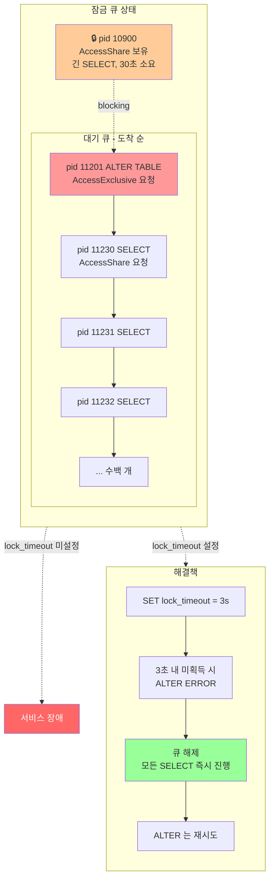

# C3. DDL이 쿼리를 막는다 — 한 줄 ALTER TABLE 이 전 서비스를 세운다

> **증상 박스**
> - 배포 직후 모든 API 의 p99 가 수십 초로 폭증
> - `pg_stat_activity` 에 수백 개의 세션이 `wait_event_type = 'Lock'` 으로 대기
> - `pg_blocking_pids()` 추적하면 하나의 `ALTER TABLE` 세션이 있음
> - 쿼리 자체는 단순한 `SELECT * FROM users WHERE id = $1`

---

## 증상

새벽도 아닌 한낮에 "인덱스 하나 추가" 배포가 들어갔다. 몇 분 뒤 장애.

```
API p99: 50ms → 18,000ms
Active connections: 40 → 480 (max_connections 500)
pg_stat_activity:
  pid 11201 (운영자): ALTER TABLE users ADD COLUMN is_verified boolean NOT NULL DEFAULT false;
                      state=active, wait_event=Lock, wait_event_type=Lock
  pid 11230 (앱):     SELECT * FROM users WHERE id = $1
                      state=active, wait_event=relation, wait_event_type=Lock
  pid 11231 (앱):     SELECT ...
                      state=active, wait_event=relation, wait_event_type=Lock
  ...
  (수백 개의 SELECT 가 같은 이유로 대기)
```

운영자 입장에서는 "`ALTER` 가 왜 안 끝나지" 이고, 서비스는 이미 죽어있다.

---

## 실제 상황

배포 플로우는 이랬다.

```
1. (30초 전) 사용자의 긴 분석 쿼리 한 개가 SELECT 중  — pid 10900
2. 배포 도중 ALTER TABLE users ADD COLUMN ...   — pid 11201
3. 이후 들어오는 모든 신규 SELECT users     — pid 11230, 11231, ...
```

ALTER 는 pid 10900 이 `AccessShareLock` 을 놓을 때까지 기다리고, 신규 쿼리는 ALTER 의 `AccessExclusiveLock` 뒤에 줄을 선다. **한 명 뒤에 모두가 밀리는 구조**가 만들어진다.

---

## 원인 분석

### PostgreSQL 테이블 잠금 모드

| 명령어 | 잠금 모드 | 충돌 대상 |
|--------|----------|-----------|
| `SELECT` | AccessShareLock | AccessExclusive |
| `SELECT FOR UPDATE` | RowShareLock | Exclusive, AccessExclusive |
| `UPDATE/DELETE/INSERT` | RowExclusiveLock | Share, ShareRow..., Exclusive, AccessExclusive |
| `CREATE INDEX` | ShareLock | RowExclusive 이상 |
| `CREATE INDEX CONCURRENTLY` | ShareUpdateExclusive | 더 약함 |
| `VACUUM`, `ANALYZE` | ShareUpdateExclusive | |
| **`ALTER TABLE` (대부분)** | **AccessExclusiveLock** | **모든 것** |
| `DROP TABLE`, `TRUNCATE`, `REINDEX` | AccessExclusiveLock | 모든 것 |

`AccessExclusiveLock` 은 **다른 모든 잠금과 충돌**한다. 가장 강한 잠금이다.

### 대기 큐의 공정성 문제

PostgreSQL 잠금 큐는 **도착 순서**를 지킨다. ALTER 가 뒤에 들어왔어도 한번 줄을 서면, 그 다음에 온 `SELECT` 는 ALTER 뒤에 붙는다.

```mermaid
flowchart LR
    subgraph Hold[현재 보유]
        LR1[pid 10900<br/>SELECT (AccessShare)<br/>긴 분석 쿼리]
    end
    subgraph Queue[대기 큐]
        direction TB
        Q1[pid 11201<br/>ALTER TABLE<br/>AccessExclusive] --> Q2[pid 11230<br/>SELECT<br/>AccessShare]
        Q2 --> Q3[pid 11231<br/>SELECT<br/>AccessShare]
        Q3 --> Q4[pid 11232<br/>SELECT<br/>...]
    end
    LR1 -->|t+30s 후 COMMIT| Release
    Release --> Q1
    Q1 -->|AccessExclusive 획득| Exec[ALTER 실행 ~수 분]
    Exec -->|완료| Q2
    style Q1 fill:#ff9999
    style LR1 fill:#ffdd99
```

즉 긴 SELECT 가 30초짜리여도, ALTER 가 1초짜리여도, **그 뒤에 들어온 모든 SELECT 는 30초 + ALTER 시간 만큼 밀린다.**

### PG11 이후 완화된 ALTER 들

버전별로 "테이블 rewrite 없이" 수행되는 DDL 이 늘었다. 잠금은 여전히 AccessExclusive 이지만 시간이 짧다.

| PG 버전 | 개선 |
|--------|------|
| 9.4+ | `ALTER TABLE ... ADD COLUMN DEFAULT <non-volatile>` 는 즉시 (옵션) |
| 11+ | `ADD COLUMN ... DEFAULT <non-volatile>` 는 rewrite 없음 (fast default) |
| 11+ | `ADD COLUMN ... NOT NULL DEFAULT` 도 rewrite 없음 |
| 12+ | `ALTER TABLE ... SET NOT NULL` 이 기존 CHECK 제약으로 증명 가능하면 스캔 생략 |
| 12+ | `REINDEX CONCURRENTLY` 추가 |

**하지만** rewrite 가 없어도 `lock_timeout` 없이 무작정 시도하면 여전히 큐를 막는다.

---

## 진단 쿼리

### 지금 누가 무엇을 막고 있는가

```sql
SELECT
    blocked.pid            AS blocked_pid,
    blocked.usename        AS blocked_user,
    blocked.state,
    blocked.wait_event_type,
    blocked.wait_event,
    now() - blocked.xact_start AS waiting_for,
    blocked.query          AS blocked_query,
    blocking.pid           AS blocking_pid,
    blocking.usename       AS blocking_user,
    blocking.state         AS blocking_state,
    blocking.query         AS blocking_query
FROM pg_stat_activity blocked
JOIN LATERAL unnest(pg_blocking_pids(blocked.pid)) AS b(pid) ON true
JOIN pg_stat_activity blocking ON blocking.pid = b.pid
WHERE blocked.wait_event_type = 'Lock'
ORDER BY blocked.xact_start;
```

### 대기 큐 길이

```sql
SELECT
    wait_event_type,
    wait_event,
    count(*) AS n,
    max(now() - xact_start) AS max_wait
FROM pg_stat_activity
WHERE wait_event_type = 'Lock'
GROUP BY 1,2
ORDER BY n DESC;
```

### 어떤 관계(테이블/인덱스)에서 막혔는가

```sql
SELECT
    l.pid,
    l.relation::regclass AS relation,
    l.mode,
    l.granted,
    a.state,
    now() - a.xact_start AS age,
    a.query
FROM pg_locks l
JOIN pg_stat_activity a USING (pid)
WHERE l.relation IS NOT NULL
ORDER BY relation, granted DESC, pid;
```

---

## 해결

### 즉시 조치 — 원인 세션 제거

```sql
-- 1) ALTER TABLE 세션 자체를 죽인다 (=줄 해제)
SELECT pg_terminate_backend(11201);

-- 2) 그래도 앞줄의 긴 SELECT 가 있다면 그것도
SELECT pg_terminate_backend(10900);
```

### 근본 조치 1 — lock_timeout 필수

DDL 배치는 **반드시** `lock_timeout` 을 건다. 큐 선두에서 무한정 기다리다가 서비스를 죽이지 않게.

```sql
BEGIN;
SET LOCAL lock_timeout = '3s';          -- 잠금 획득 3초 제한
SET LOCAL statement_timeout = '60s';    -- 실행도 제한
ALTER TABLE users ADD COLUMN is_verified boolean NOT NULL DEFAULT false;
COMMIT;
```

`lock_timeout` 이 터지면 ALTER 는 ERROR 로 깔끔히 실패하고, 큐가 풀린다. 실패한 DDL 은 재시도하면 된다.

### 근본 조치 2 — CONCURRENTLY 를 쓰는 DDL 은 쓰자

```sql
-- ❌ AccessExclusive (테이블 전체 잠금)
CREATE INDEX idx_users_email ON users(email);

-- ✅ ShareUpdateExclusive (쓰기/읽기 계속 가능)
CREATE INDEX CONCURRENTLY idx_users_email ON users(email);
```

주의 사항:

- 트랜잭션 블록 안에서는 불가 (`BEGIN` 없이 직접 실행)
- 실패하면 `INVALID` 상태의 인덱스가 남는다 → `DROP INDEX CONCURRENTLY ...` 후 재시도
- `REINDEX CONCURRENTLY` (PG12+), `DROP INDEX CONCURRENTLY` 도 동일

### 근본 조치 3 — ADD COLUMN 은 두 단계로

```sql
-- ❌ volatile default 는 테이블 전체 rewrite
ALTER TABLE users ADD COLUMN api_key text DEFAULT gen_random_uuid()::text;

-- ✅ 두 단계로 분리
-- Step 1: default 없이 추가 (rewrite 없음, 짧은 AccessExclusive)
BEGIN;
SET LOCAL lock_timeout = '3s';
ALTER TABLE users ADD COLUMN api_key text;
COMMIT;

-- Step 2: 배치로 값 채우기 (다른 쿼리 블록 안 함)
DO $$
DECLARE r RECORD;
BEGIN
  FOR r IN SELECT id FROM users WHERE api_key IS NULL LIMIT 10000 LOOP
    UPDATE users SET api_key = gen_random_uuid()::text WHERE id = r.id;
    PERFORM pg_sleep(0.001);
  END LOOP;
END $$;

-- Step 3: 필요하면 NOT NULL 제약 추가 (PG12+ CHECK 제약 트릭)
ALTER TABLE users ADD CONSTRAINT api_key_notnull CHECK (api_key IS NOT NULL) NOT VALID;
ALTER TABLE users VALIDATE CONSTRAINT api_key_notnull;   -- ShareUpdateExclusive, 쓰기 가능
-- 이후 NOT NULL 로 전환
ALTER TABLE users ALTER COLUMN api_key SET NOT NULL;
ALTER TABLE users DROP CONSTRAINT api_key_notnull;
```

### 근본 조치 4 — FK, CHECK 는 NOT VALID → VALIDATE

```sql
-- ❌ 전체 테이블 스캔 + AccessExclusive
ALTER TABLE orders ADD CONSTRAINT fk_user FOREIGN KEY (user_id) REFERENCES users(id);

-- ✅ 두 단계
-- Step 1: NOT VALID 로 추가 (기존 데이터 검증 생략, 신규 데이터만 검증)
ALTER TABLE orders
  ADD CONSTRAINT fk_user FOREIGN KEY (user_id) REFERENCES users(id) NOT VALID;

-- Step 2: 기존 데이터 검증 (ShareUpdateExclusive, 동시 쿼리 가능)
ALTER TABLE orders VALIDATE CONSTRAINT fk_user;
```

### 근본 조치 5 — 배포 래퍼

운영 조직은 DDL 을 직접 돌리지 않는다. 아래처럼 감싸는 래퍼를 만든다.

```sql
-- safe_ddl.sql
DO $$
DECLARE
    tries int := 0;
BEGIN
    WHILE tries < 20 LOOP
        BEGIN
            SET LOCAL lock_timeout = '2s';
            SET LOCAL statement_timeout = '120s';

            -- 여기에 실제 DDL
            EXECUTE 'ALTER TABLE users ADD COLUMN is_verified boolean';

            RAISE NOTICE 'DDL succeeded on try %', tries;
            EXIT;
        EXCEPTION WHEN lock_not_available THEN
            tries := tries + 1;
            RAISE NOTICE 'lock_timeout, retry %', tries;
            PERFORM pg_sleep(5);
        END;
    END LOOP;
END $$;
```

---

## 예방

```
운영 규칙:

  1. DDL 은 반드시 lock_timeout 과 함께
     → 기본값 배포 스크립트에 SET lock_timeout 이 없으면 PR reject

  2. 인덱스 조작은 CONCURRENTLY 가 기본
     → CREATE / DROP / REINDEX 모두

  3. ADD COLUMN
     - default 없이 추가 후 배치 UPDATE
     - NOT NULL 은 CHECK NOT VALID → VALIDATE 경로

  4. FK, CHECK 는 NOT VALID → VALIDATE

  5. 배포 전 체크
     SELECT * FROM pg_stat_activity
     WHERE state='active' AND now()-xact_start > interval '1 minute';
     → 긴 쿼리가 있으면 배포 연기 또는 해당 세션 먼저 정리

  6. 모니터링
     - wait_event_type='Lock' 대기 세션 수 > 10 → 알람
     - AccessExclusiveLock 보유 세션 발견 → 즉시 알람
```

---

## Mermaid — DDL 이 만드는 대기 큐



---

## 관련 챕터

- [7장. 트랜잭션과 격리 수준](../chapters/ch07_transactions_isolation.md) — Lock 모드 매트릭스 전체
- [5장. 인덱스](../chapters/ch05_indexes.md) — CREATE INDEX CONCURRENTLY 상세
- [C1. Deadlock](C1_deadlock.md) — DDL 과 데드락 교차
- [C2. idle in transaction](C2_idle_in_transaction.md) — DDL 을 막는 또 다른 주범
- [cheatsheets/pg_stat_queries.md](../cheatsheets/pg_stat_queries.md) — pg_blocking_pids 쿼리 템플릿
