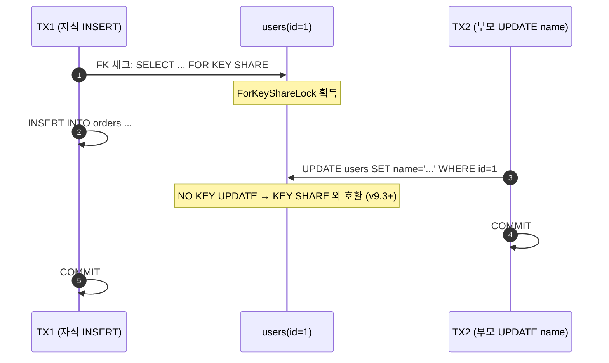
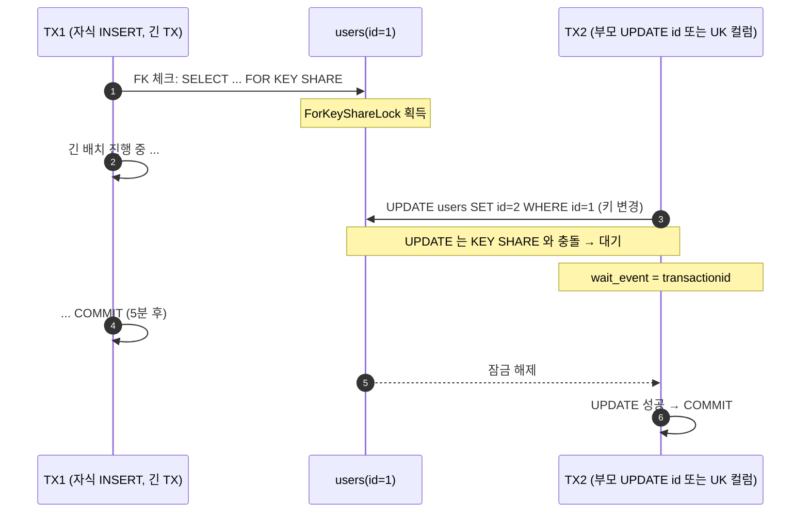

# C4. FK 참조에 의한 Share Lock 상승 — 자식 INSERT 가 부모 UPDATE 를 막는다

> **증상 박스**
> - 자식 테이블 INSERT/UPDATE 시 부모 테이블 행에 **암묵적 ShareLock** 이 걸린다
> - `UPDATE users SET name=...` 같은 평범한 부모 UPDATE 가 원인 불명으로 대기
> - `pg_stat_activity.wait_event = Lock`, `wait_event_type = transactionid`
> - 로그에 보이는 쿼리는 `INSERT INTO orders ...` 인데 실제로는 `users` 테이블에서 잠금 충돌이 난다
> - v9.3 이전에는 이 증상이 훨씬 심했고, 9.3+ 에서 `FOR KEY SHARE` 로 완화되었음에도 여전히 빈번하게 재발

---

## 증상

| 관측 지점 | 현상 |
|-----------|------|
| 애플리케이션 | 주문(자식) 생성 API 와 회원정보(부모) 수정 API 가 서로 대기 |
| `pg_stat_activity` | `wait_event_type = Lock`, `wait_event = transactionid` 혹은 `tuple` |
| `pg_locks` | 자식 세션이 부모 행에 `ForKeyShareLock` 보유, 부모 UPDATE 는 `ExclusiveLock` 대기 |
| 서버 로그 | `log_lock_waits = on` 이면 `still waiting for ShareLock on transaction ...` |
| 지표 | 데드락은 아니지만 p99 latency 급등 |

```
2026-04-24 14:02:11 KST [31001] LOG:  process 31001 still waiting for
  ShareLock on transaction 88211 after 1000.123 ms
2026-04-24 14:02:11 KST [31001] DETAIL:  Process holding the lock: 30988.
  Wait queue: 31001.
2026-04-24 14:02:11 KST [31001] CONTEXT:  while locking tuple (0,42) in relation "users"
2026-04-24 14:02:11 KST [31001] STATEMENT:  UPDATE users SET name = $1 WHERE id = $2
```

운영자가 `INSERT INTO orders ...` 를 의심조차 못 하는 이유는, 로그에 보이는 피해자 쿼리가 항상 부모 UPDATE 이기 때문이다. 진짜 범인은 **자식 테이블에 INSERT 를 넣은 긴 트랜잭션**이다.

---

## 실제 상황

### 재현 시나리오

```sql
-- 스키마
CREATE TABLE users (
    id   bigint PRIMARY KEY,
    name text,
    tier text
);

CREATE TABLE orders (
    id      bigserial PRIMARY KEY,
    user_id bigint NOT NULL REFERENCES users(id),
    amount  numeric,
    created_at timestamptz DEFAULT now()
);
CREATE INDEX ON orders(user_id);

INSERT INTO users VALUES (1, 'alice', 'gold'), (2, 'bob', 'silver');
```

### 타임라인

```
시각       TX1 (긴 배치: 주문 대량 INSERT)      TX2 (회원정보 수정 API)
--------- ------------------------------------- -----------------------------------
14:00:00  BEGIN;
14:00:01  INSERT INTO orders(user_id, amount)
            VALUES (1, 100);
          -- PG 내부: users(id=1) 에 ForKeyShareLock 획득
14:00:05                                        BEGIN;
14:00:05                                        UPDATE users SET name='Alice'
                                                 WHERE id=1;
                                                 -- ShareLock on transaction(TX1) 대기
                                                 -- (tuple lock)
14:00:06  INSERT INTO orders ... (9999건 진행)
14:02:30                                        -- log_lock_waits 로
                                                 --   "still waiting ..." 남음
14:05:00  COMMIT;
14:05:00                                        -- 대기 해제, UPDATE 성공 → COMMIT
```

TX1 은 `UPDATE users` 를 한 적이 없는데도 `users.id=1` 에 잠금을 걸어두었다. 이유는 FK 선언 때문이다.

---

## 원인 분석

### 1) FK 가 만드는 암묵적 잠금

PostgreSQL 은 자식 테이블에 INSERT/UPDATE 될 때 **참조 무결성** 을 보장해야 한다. "내가 참조하는 부모 행이 내 트랜잭션이 끝나기 전에 사라지거나 PK 가 바뀌면 안 된다" 는 보장을 위해 부모 행에 `SELECT ... FOR KEY SHARE` 를 획득한다.

```
자식 INSERT/UPDATE 시 FK 컬럼의 부모 행에 대해:
  v9.2 이하 : SELECT ... FOR SHARE       (ShareLock, 부모 UPDATE 를 거의 다 막음)
  v9.3+    : SELECT ... FOR KEY SHARE   (PK/UK 변경 UPDATE 만 충돌)
```

### 2) 행 잠금 매트릭스 (v9.3+)

| 보유 모드 \ 요청 모드 | KEY SHARE | SHARE | NO KEY UPDATE | UPDATE |
|-----------------------|:---------:|:-----:|:-------------:|:------:|
| KEY SHARE             |  OK       |  OK   |  OK           |  대기  |
| SHARE                 |  OK       |  OK   |  대기         |  대기  |
| NO KEY UPDATE         |  OK       | 대기  |  대기         |  대기  |
| UPDATE                |  대기     | 대기  |  대기         |  대기  |

요점:
- `FOR KEY SHARE` vs 일반 `UPDATE` (= `NO KEY UPDATE`) → **OK** (충돌하지 않음)
- `FOR KEY SHARE` vs **키 컬럼을 바꾸는 `UPDATE`** → **대기**

즉, 부모의 PK/UK 를 바꾸는 UPDATE 만 자식 INSERT 와 충돌하는 게 설계 의도다.

### 3) 그런데 왜 현장에서는 여전히 막히는가

세 가지 함정이 있다.

**(a) HOT update 조건을 깨는 컬럼 변경** — 부모 UPDATE 가 인덱스 컬럼을 건드리면 내부적으로 더 무거운 잠금으로 상승한다. 특히 PK 나 UNIQUE 인덱스가 걸린 컬럼을 UPDATE 하면 `NO KEY UPDATE` 가 아니라 `UPDATE` 로 승격된다.

**(b) MultiXact 가 끼는 순간** — 두 개 이상의 트랜잭션이 동시에 같은 부모 행을 `FOR KEY SHARE` 로 잠그면 MultiXact ID 가 발급된다. MultiXact 는 일반 xid 와 다른 SLRU 영역을 쓰고, wraparound 도 별도로 관리된다 ([A4 MultiXact 이슈](A4_multixact_wraparound.md) 와 연계). 부모 UPDATE 는 이 MultiXact 전체가 끝날 때까지 대기한다.

**(c) FK 인덱스 누락** — 자식의 FK 컬럼에 인덱스가 없으면, 부모 DELETE/UPDATE 시 RI trigger 가 자식 전체를 스캔하면서 `ShareRowExclusiveLock` 에 가까운 비용을 일으킨다. 이건 행 단위가 아니라 테이블 단위 이슈로 번진다.

### 4) 자식 INSERT 의 잠금 상승 흐름

```
INSERT INTO orders(user_id, amount) VALUES (1, 100);
  │
  ├─ orders 테이블에 RowExclusiveLock
  ├─ FK 제약조건 검사 (RI_FKey_check_ins)
  │    └─ SELECT 1 FROM users WHERE id = 1 FOR KEY SHARE
  │         └─ users(id=1) 튜플에 ForKeyShareLock 획득
  │            (트랜잭션 종료까지 보유)
  └─ 자식 테이블에 튜플 기록

자식 트랜잭션이 길어지면 → 부모 행이 계속 잠겨 있다
```

---

## 진단 쿼리

### 누가 누구를 막고 있는가

```sql
SELECT
    blocked.pid                             AS blocked_pid,
    blocked.query                           AS blocked_query,
    blocked.wait_event_type,
    blocked.wait_event,
    blocking.pid                            AS blocking_pid,
    blocking.query                          AS blocking_query,
    now() - blocking.xact_start             AS blocker_duration
FROM pg_stat_activity AS blocked
JOIN pg_stat_activity AS blocking
  ON blocking.pid = ANY(pg_blocking_pids(blocked.pid))
WHERE blocked.wait_event_type = 'Lock'
ORDER BY blocker_duration DESC;
```

### pg_locks 에서 FK 형 잠금 확인

```sql
SELECT
    l.pid,
    l.locktype,
    l.mode,
    l.granted,
    l.relation::regclass AS relation,
    l.transactionid,
    a.query
FROM pg_locks l
LEFT JOIN pg_stat_activity a ON a.pid = l.pid
WHERE l.mode IN ('ShareLock', 'RowShareLock', 'ForKeyShareLock', 'ForShareLock')
   OR NOT l.granted
ORDER BY l.pid, l.granted;
```

`ForKeyShareLock` 이 부모 테이블 행에 걸려 있고, `ShareLock`(transactionid) 이 대기 중인 세션이 부모 UPDATE 라면 이 케이스다.

### FK 컬럼에 인덱스가 없는 자식 찾기

```sql
SELECT c.conrelid::regclass AS child_table,
       a.attname            AS fk_column,
       c.confrelid::regclass AS parent_table
FROM pg_constraint c
JOIN pg_attribute a
  ON a.attrelid = c.conrelid AND a.attnum = ANY(c.conkey)
WHERE c.contype = 'f'
  AND NOT EXISTS (
    SELECT 1 FROM pg_index i
    WHERE i.indrelid = c.conrelid
      AND a.attnum = ANY(i.indkey)
  );
```

### log_lock_waits 로 조기 감지

```conf
# postgresql.conf
log_lock_waits = on
deadlock_timeout = '1s'   # 1s 넘게 대기하면 로그 남김
log_line_prefix = '%m [%p] %q%u@%d '
```

---

## 해결 방법

### 즉시 (incident 진행 중)

```sql
-- 1. 가해자 TX 식별
SELECT pid, now() - xact_start AS tx_age, state, query
FROM pg_stat_activity
WHERE xact_start IS NOT NULL
ORDER BY xact_start
LIMIT 20;

-- 2. 긴 자식 INSERT/UPDATE 트랜잭션을 종료
SELECT pg_terminate_backend(<pid>);
```

### 단기 (며칠 내)

- **FK 제약 지연 평가** — 배치 작업에서 한시적 적용.
  ```sql
  -- 테이블 정의 시점 선택지
  ALTER TABLE orders
    ADD CONSTRAINT orders_user_fk FOREIGN KEY (user_id) REFERENCES users(id)
    DEFERRABLE INITIALLY DEFERRED;

  -- 세션에서 제약 체크를 커밋 직전까지 미룬다
  SET CONSTRAINTS ALL DEFERRED;
  ```
  효과: FK 체크가 COMMIT 시점에 몰려 이뤄지므로 중간 잠금 보유 시간이 짧아진다. 단, 대량 배치에서 한꺼번에 체크 비용이 나가므로 배치 크기 조절 필요.

- **트랜잭션 짧게** — 자식 INSERT/UPDATE 가 들어간 TX 안에서 외부 API 호출, 파일 I/O 금지.

- **부모 UPDATE 를 PK 변경이 아닌 컬럼만 바꾸도록 보장** — ORM 이 dirty field 만 UPDATE 하도록 설정.

### 근본 (설계 레벨)

1. **부모의 PK/UK 를 바꾸지 않는다** — 한번 부여된 `users.id` 를 재사용하거나 바꾸는 워크플로 자체를 제거.
2. **자식 FK 컬럼에 반드시 인덱스** — `orders(user_id)` 에 인덱스가 없으면 부모 DELETE/UPDATE 가 자식 전체 스캔을 유발한다.
3. **핫 부모는 비동기 분리** — `users.last_login_at` 처럼 자주 바뀌는 컬럼은 별도 테이블(`user_activity`) 로 분리해 FK 와 격리.
4. **MultiXact 모니터링** — `pg_multixact` 디렉토리 크기와 `SELECT datminmxid FROM pg_database` 추적. `autovacuum_multixact_freeze_max_age` 를 감시. (A4 케이스 참조)
5. **배치 설계 규칙** — "FK 가 걸린 테이블 대량 INSERT" 는 가능하면 오프피크로, 동시에 부모 UPDATE 가 실행되지 않도록 윈도우 분리.

---

## 예방 원칙

```
설계 체크리스트
  □ 모든 자식 FK 컬럼에 인덱스가 있는가 (진단 쿼리로 주기 점검)
  □ 부모 테이블의 PK/UK 를 바꾸는 로직이 존재하는가
  □ 자식 테이블에 대량 INSERT 하는 잡이 있는가 → 트랜잭션 분할
  □ ORM 설정: full-row UPDATE 대신 dirty-field UPDATE 인가
  □ log_lock_waits=on, deadlock_timeout=1s 가 설정되어 있는가

운영 체크리스트
  □ pg_locks 에서 ForKeyShareLock 지속 시간 모니터링
  □ pg_stat_database.xact_commit vs xact_rollback 비율
  □ MultiXact 발급량 (mxid_age) 추적
  □ "평범한 부모 UPDATE 가 느려졌다" 라는 리포트가 들어오면 FK 의심
```

---

## Mermaid

### 정상 흐름 (충돌 없음)



### 충돌 흐름 (PK 변경 또는 MultiXact)



---

## 관련 챕터 / 치트시트 / 다른 케이스

- [7장. 트랜잭션과 격리 수준](../chapters/ch07_transactions_isolation.md) — Row lock 매트릭스 전체표
- [3장. MVCC](../chapters/ch03_mvcc.md) — xmax, MultiXact 내부 구조
- [5장. 인덱스](../chapters/ch05_indexes.md) — FK 인덱스 선정
- [C1. 데드락](C1_deadlock.md) — FK 가 만드는 데드락 패턴과 교차
- [C2. idle in transaction](C2_idle_in_transaction.md) — 긴 트랜잭션이 FK 잠금 보유시간을 늘리는 구조
- [C3. DDL blocking](C3_ddl_blocking.md) — ALTER TABLE 이 FK 대기와 얽히는 사례
- [cheatsheets/pg_stat_queries.md](../cheatsheets/pg_stat_queries.md) — Lock 진단 쿼리 모음
- [cheatsheets/index_selection.md](../cheatsheets/index_selection.md) — FK 인덱스 설계
- 공식 문서: https://www.postgresql.org/docs/current/explicit-locking.html#LOCKING-ROWS
