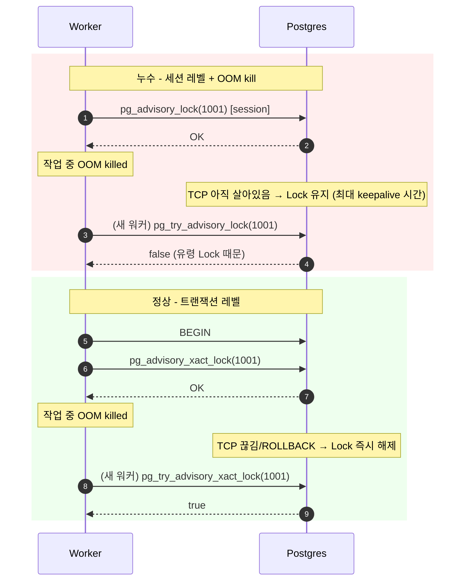
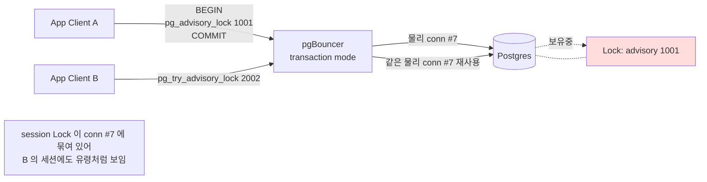

# C5. Advisory Lock 누수 — 크론이 죽은 뒤에도 계속 잠겨 있다

> **증상 박스**
> - `pg_try_advisory_lock(...)` 이 특정 키에서 계속 `false` 반환
> - 크론/워커가 한참 전에 죽었는데 해당 job 만 영원히 "이미 실행 중"
> - `pg_locks` 에 `locktype = advisory`, `granted = t` 인 Lock 이 남아있고 소유 세션은 `idle`
> - pgBouncer transaction 모드 환경에서 **다른 요청의 응답이 뒤섞이는** 유령 Lock 증상
> - 심한 경우 수천 개의 advisory lock 이 누적되어 `pg_locks` 조회가 느려진다

---

## 증상

| 관측 지점 | 현상 |
|-----------|------|
| 애플리케이션 | 배치 스케줄이 "이미 실행 중" 에러로 반복 실패 |
| `pg_locks` | `locktype='advisory'`, `classid/objid` 로 식별되는 잠금이 잔존 |
| `pg_stat_activity` | 해당 pid 는 `state='idle'` 또는 `state='idle in transaction'` |
| 재시작 후 | 인스턴스를 재기동하면 사라지므로 "유령" 으로 오인 |
| 메트릭 | `pg_locks` 행 수가 우상향으로 누적 |

```sql
-- 증상 예시: 누수된 advisory lock
SELECT locktype, classid, objid, mode, granted, pid
FROM pg_locks
WHERE locktype = 'advisory';

 locktype | classid | objid | mode           | granted | pid
----------+---------+-------+----------------+---------+------
 advisory |       0 |  1001 | ExclusiveLock  | t       | 45201
 advisory |       0 |  1002 | ExclusiveLock  | t       | 45201  ← 같은 pid 가 여러 개 보유
 advisory |       0 |  1003 | ExclusiveLock  | t       | 45201
```

```sql
SELECT pid, state, wait_event, now() - state_change AS idle_for, query
FROM pg_stat_activity
WHERE pid = 45201;

 pid   | state | wait_event  | idle_for   | query
-------+-------+-------------+------------+--------
 45201 | idle  | ClientRead  | 02:34:11   | SELECT pg_advisory_lock(1001)
```

2시간 넘게 idle 인데 Lock 을 계속 쥐고 있다.

---

## 실제 상황

### 재현 시나리오 A — 워커 프로세스 비정상 종료

```
+-----------+     +----------+     +-----------+
| cron job  | ──▶ | pg conn  | ──▶ | Postgres  |
+-----------+     +----------+     +-----------+
      │
      │ pg_advisory_lock(1001) → OK
      │ (작업 수행 중 OOM kill)
      │ ✗ 프로세스 종료
      │
      │ 그런데 TCP 연결이 아직 살아있다 (keepalive 미설정)
      │ → Postgres 입장에선 "그 세션" 이 살아있으니 Lock 유지
```

### 재현 시나리오 B — pgBouncer transaction 모드의 유령 Lock

```
애플리케이션 → pgBouncer(transaction mode) → Postgres
    │                    │                       │
    │  TX1: BEGIN        │                       │
    │  SELECT            │                       │
    │    pg_advisory_lock(1001);                 │
    │  COMMIT            │                       │
    │  (pgBouncer 는 TX 끝나면 연결을 풀로 반납)  │
    │                    │                       │
    │  ← 다른 클라이언트가 같은 연결을 빌려감     │
    │                                            │
    │  TX2: pg_try_advisory_lock(2001) → false??  ← 왜?
```

세션 레벨 advisory lock 은 **물리 커넥션 수명** 동안 유지된다. pgBouncer transaction 모드는 커넥션을 재사용하므로, 앞서 쓰인 세션 Lock 이 다음 사용자에게 그대로 물려진다.

### 타임라인 (시나리오 A)

```
10:00:00  cron-worker-A 기동
10:00:01  SELECT pg_advisory_lock(1001);   -- 세션 레벨, 획득
10:00:02  거대한 파일 처리 시작 (메모리 4GB)
10:03:30  OOM killer → 워커 프로세스 SIGKILL
10:03:30  그러나 TCP 소켓은 아직 FIN 미전송 (keepalive 2시간 기본값)
10:03:30~ cron-worker-B, C, D 가 pg_try_advisory_lock(1001) → false
11:00:00  운영자: "어제부터 배치가 안 돈다?"
12:02:11  TCP keepalive 만료 → 서버가 연결 종료 → Lock 해제
```

---

## 원인 분석

### 1) Advisory Lock 의 두 가지 스코프

| 함수 | 스코프 | 자동 해제 시점 |
|------|--------|----------------|
| `pg_advisory_lock(k)` | **세션** | 세션 종료 또는 `pg_advisory_unlock(k)` 명시 호출 |
| `pg_advisory_xact_lock(k)` | **트랜잭션** | COMMIT/ROLLBACK 시 자동 |
| `pg_try_advisory_lock(k)` | 세션 (non-blocking) | 동일 |
| `pg_try_advisory_xact_lock(k)` | 트랜잭션 (non-blocking) | 동일 |

세션 레벨은 **"이 물리 커넥션" 이 끊어지지 않는 한** 계속 유지된다. Postgres 는 언제 누가 `unlock` 을 까먹었는지 알 수 없다.

### 2) 왜 하필 누수되는가

세 가지 구조적 원인:

**(a) 예외 경로에서 unlock 누락** — try/finally 로 감싸지 않은 코드.
```python
# 나쁜 예
cur.execute("SELECT pg_advisory_lock(%s)", (job_id,))
do_work()                                         # 여기서 예외가 나면
cur.execute("SELECT pg_advisory_unlock(%s)", ...) # 실행되지 않음
```

**(b) 프로세스 비정상 종료** — OOM kill, SIGKILL, 노드 재시작. 정상 종료면 드라이버가 연결을 닫아 Lock 해제되지만, SIGKILL 은 소켓만 남긴다. TCP keepalive 기본값이 2시간이라 그 사이 "유령" 상태가 된다.

**(c) pgBouncer transaction 모드** — 세션 단위 상태(temp table, prepared statement, **advisory lock**) 는 풀링과 호환되지 않는다. pgBouncer 공식 문서도 "session-level features는 session pool mode 에서만 안전" 이라고 명시.

### 3) classid / objid 해석

Advisory lock 은 64비트 키를 쓰거나 32비트 두 개(classid, objid) 로 쪼개 쓸 수 있다.

```sql
-- 단일 bigint 키
SELECT pg_advisory_lock(1234567890123);

-- (classid, objid) 두 개의 int
SELECT pg_advisory_lock(1001, 2002);   -- 예: 테넌트 1001, job 2002
```

`pg_locks.classid, objid` 가 두 번째 형식으로 기록된다. 키 설계 시 **의미 있는 네임스페이스** 를 쓰면 진단이 수월하다.

---

## 진단 쿼리

### 현재 잡혀 있는 advisory lock 전부

```sql
SELECT
    l.pid,
    l.classid,
    l.objid,
    l.mode,
    l.granted,
    a.state,
    a.wait_event,
    now() - a.state_change AS idle_for,
    a.application_name,
    a.client_addr,
    a.query
FROM pg_locks l
LEFT JOIN pg_stat_activity a ON a.pid = l.pid
WHERE l.locktype = 'advisory'
ORDER BY idle_for DESC NULLS LAST;
```

### 오래된 idle 세션이 보유한 advisory lock

```sql
SELECT a.pid,
       a.state,
       now() - a.state_change AS idle_for,
       count(*) FILTER (WHERE l.locktype = 'advisory') AS adv_lock_count
FROM pg_stat_activity a
LEFT JOIN pg_locks l ON l.pid = a.pid
WHERE a.state IN ('idle', 'idle in transaction')
  AND a.state_change < now() - interval '10 minutes'
GROUP BY a.pid, a.state, a.state_change
HAVING count(*) FILTER (WHERE l.locktype = 'advisory') > 0
ORDER BY idle_for DESC;
```

### 누가 누구를 막고 있는가

```sql
SELECT
    blocked.pid      AS blocked_pid,
    blocked.query    AS blocked_query,
    blocking.pid     AS blocking_pid,
    blocking.state   AS blocking_state,
    blocking.query   AS blocking_query
FROM pg_stat_activity blocked
JOIN pg_stat_activity blocking
  ON blocking.pid = ANY(pg_blocking_pids(blocked.pid))
WHERE blocked.query ILIKE '%advisory%';
```

---

## 해결 방법

### 즉시 (incident 진행 중)

```sql
-- 1. 문제 세션 식별
SELECT pid, state, now() - state_change AS idle_for, application_name
FROM pg_stat_activity
WHERE pid IN (
  SELECT pid FROM pg_locks WHERE locktype='advisory'
);

-- 2. 해당 세션에서 직접 해제 가능하면
SELECT pg_advisory_unlock_all();          -- 그 세션 내에서만 동작

-- 3. 외부에서 강제 종료 (연결이 끊기며 Lock 해제)
SELECT pg_terminate_backend(<pid>);
```

### 단기 (1~2일 내)

**(a) 모든 advisory lock 을 transaction 스코프로 전환**
```sql
-- Before
SELECT pg_advisory_lock(1001);
-- ... work ...
SELECT pg_advisory_unlock(1001);

-- After: BEGIN/COMMIT 안에서 쓰고 잊는다
BEGIN;
SELECT pg_advisory_xact_lock(1001);
-- ... work ...
COMMIT;   -- 자동 해제
```

**(b) try/finally 패턴 강제**
```python
import psycopg
from contextlib import contextmanager

@contextmanager
def advisory_lock(conn, key):
    with conn.cursor() as cur:
        cur.execute("SELECT pg_advisory_lock(%s)", (key,))
    try:
        yield
    finally:
        with conn.cursor() as cur:
            cur.execute("SELECT pg_advisory_unlock(%s)", (key,))

with advisory_lock(conn, job_id):
    do_work()
```

**(c) TCP keepalive 단축** — `postgresql.conf`:
```conf
tcp_keepalives_idle = 60       # 60초 무통신이면 probe 시작
tcp_keepalives_interval = 10
tcp_keepalives_count = 6        # 합쳐서 120초 안에 죽은 연결 감지
```

### 근본 (설계 레벨)

1. **원칙: 크리티컬 섹션은 `pg_advisory_xact_lock` 기본** — 세션 레벨은 정말 세션 끝까지 유지해야 할 이유가 있을 때만.
2. **pgBouncer transaction 모드에서는 세션 레벨 advisory lock 전면 금지** — 사용 여부를 CI 에서 grep 로 차단.
3. **키 네임스페이스 설계** — `(tenant_id_hash, job_type_id)` 같은 복합 키로 충돌 최소화 + 진단 용이성.
4. **Lock holder 메트릭** — `pg_locks` 에서 advisory lock 개수를 Prometheus 로 노출, 급증 감지.
5. **idle_in_transaction_session_timeout** 도 함께 설정 — 구조적으로 긴 idle 제거. (C2 와 연계)

---

## 예방 원칙

```
코드 규칙
  □ 기본은 pg_advisory_xact_lock
  □ 세션 레벨이 꼭 필요하면 context manager/try-finally 필수
  □ application_name 설정 (어느 워커가 잠갔는지 추적 가능하게)

인프라 규칙
  □ pgBouncer transaction mode 에 붙는 DSN 에서는 세션 advisory lock 사용 금지
  □ TCP keepalive 60s/10s/6 로 서버와 클라이언트 양쪽 설정
  □ idle_in_transaction_session_timeout = '5min'

모니터링
  □ pg_locks WHERE locktype='advisory' 카운트 시계열
  □ 10분 넘게 idle 인 세션이 advisory lock 보유하면 경보
  □ 배치 실패 반복 횟수 → "이미 실행 중" 에러 구별 태깅
```

---

## Mermaid

### 누수 흐름 vs 정상 흐름



### pgBouncer transaction 모드의 함정



---

## 관련 챕터 / 치트시트 / 다른 케이스

- [7장. 트랜잭션과 격리 수준](../chapters/ch07_transactions_isolation.md) — Lock 모드 전체 개요
- [14장. 모니터링/트러블슈팅](../chapters/ch14_monitoring_troubleshooting.md) — pg_locks 관찰 포인트
- [C1. 데드락](C1_deadlock.md) — 다른 종류의 잠금 충돌
- [C2. idle in transaction](C2_idle_in_transaction.md) — idle 세션이 advisory lock 을 쥐고 있는 경우의 확장
- [D1. 커넥션 고갈](D1_connection_exhaustion.md) — pgBouncer 설정과 교차
- [cheatsheets/pg_stat_queries.md](../cheatsheets/pg_stat_queries.md) — Lock 진단 쿼리 모음
- [cheatsheets/config_parameters.md](../cheatsheets/config_parameters.md) — tcp_keepalives, idle timeout 설정
- 공식 문서: https://www.postgresql.org/docs/current/explicit-locking.html#ADVISORY-LOCKS
