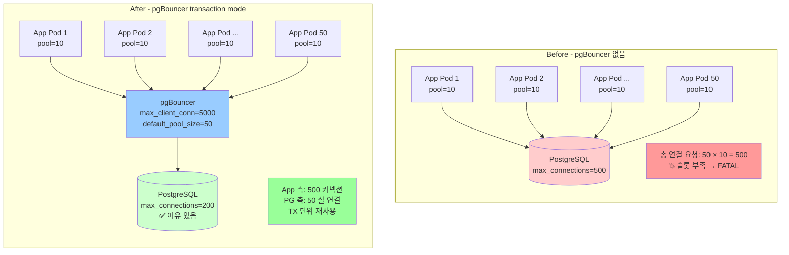

# D1. Connection 고갈 — max_connections 를 찍고 서비스가 로그인도 못 한다

> **증상 박스**
> - `FATAL: sorry, too many clients already`
> - `FATAL: remaining connection slots are reserved for non-replication superuser connections`
> - 신규 배포 후 트래픽이 늘지도 않았는데 connection 수만 급증
> - 앱 로그에 `connection pool exhausted` 나 DB 측 인증 실패

---

## 증상

앱 서비스 15개 pod 로 운영 중이던 서비스에서 파드 수를 30개로 늘린 직후.

```
pg_stat_activity 카운트: 320 → 498
max_connections:         500
superuser_reserved_connections: 3

→ 신규 커넥션 FATAL
→ 배포 중인 새 파드는 DB 연결 실패로 기동 불가
→ 심지어 관리자 psql 로그인도 막힘
```

PG 로그:

```
FATAL:  sorry, too many clients already
FATAL:  remaining connection slots are reserved for non-replication superuser connections
```

---

## 실제 상황

배포 엔지니어 관점.

```
앱 설정:
  HikariCP.maximumPoolSize = 20
  Uvicorn workers per pod = 4
  → pod 당 최대 커넥션: 20 × 4 = 80
  → 15 pod 시:  80 × 15 = 1,200 (상한)
  → 평소 유효 점유:  약 300 (대부분 idle)

DB:
  max_connections = 500

파드를 30개로 스케일 아웃한 순간
  → 상한 2,400, 실제 점유 약 600
  → 500 초과 → 신규 연결 FATAL
```

**계산을 안 했다**는 게 본질이다. 풀 × 프로세스 × 파드 가 `max_connections` 를 넘으면 언젠가 터진다.

---

## 원인 분석

### 커넥션 하나의 비용

PostgreSQL 은 **연결당 백엔드 프로세스 하나를 fork** 한다 (프로세스 모델).

```
커넥션 1개당 추정:
  - 기본 메모리:      5~10 MB (process overhead)
  - work_mem 사용 시: work_mem × 해시/소트 노드 수 만큼 추가
  - 캐시:              각 백엔드가 자체 catalog 캐시 유지

500 커넥션 × 10 MB = 5 GB  (베이스라인)
500 커넥션 × work_mem(4MB) × 쿼리당 3~5 노드 = 6~10 GB  (쿼리 중)

→ 커넥션이 많을수록 RAM 소모 + 컨텍스트 스위칭 + catalog 캐시 중복
```

### max_connections 는 큰 게 답이 아니다

500 → 2000 으로 늘린다고 해결되지 않는다. OS 레벨 컨텍스트 스위칭과 락 경합이 급증하고, VACUUM·체크포인트 타이밍도 불안정해진다.

운영 경험치:

- `max_connections` 는 **500 이하** 로 유지하는 게 이상적
- 그 이상 필요하면 **반드시 pgBouncer 같은 외부 풀러**

### 네 가지 고갈 패턴

| 패턴 | 설명 |
|------|------|
| 계산 미스 | pool × process × pod > max_connections |
| idle in tx 누적 | [C2](C2_idle_in_transaction.md) 참고, 장기 세션이 슬롯 점유 |
| 풀 누수 | 앱 코드가 `conn.close()` 를 못 부르는 경로 |
| 장기 쿼리 | 쿼리가 늦으면 풀이 금방 바닥, 신규 요청이 풀 대기 후 DB 에 재요청 |

---

## 진단 쿼리

### 연결 상태 총괄

```sql
-- 상태별 카운트
SELECT state, count(*) FROM pg_stat_activity
GROUP BY state ORDER BY 2 DESC;

-- 사용자/앱별
SELECT
    usename,
    application_name,
    client_addr,
    count(*)
FROM pg_stat_activity
GROUP BY 1,2,3
ORDER BY 4 DESC;
```

### 유휴·장기 세션 식별

```sql
-- 30분 이상 유휴 세션
SELECT pid, usename, application_name,
       now() - backend_start AS session_age,
       now() - state_change AS idle_age,
       state
FROM pg_stat_activity
WHERE state IN ('idle','idle in transaction')
  AND now() - state_change > interval '30 minutes'
ORDER BY idle_age DESC;
```

### 현재 limit 과 여유

```sql
SHOW max_connections;
SHOW superuser_reserved_connections;
SHOW reserved_connections;  -- PG16+

SELECT
    max_conn,
    used,
    res_for_super,
    max_conn - used AS remaining
FROM (
    SELECT
        (SELECT setting::int FROM pg_settings WHERE name='max_connections') AS max_conn,
        (SELECT count(*) FROM pg_stat_activity) AS used,
        (SELECT setting::int FROM pg_settings WHERE name='superuser_reserved_connections') AS res_for_super
) s;
```

### 풀 누수 흔적

```sql
-- 1시간 이상 같은 쿼리에서 idle 인 비정상 세션
SELECT pid, usename, application_name,
       state, query,
       now() - state_change AS idle
FROM pg_stat_activity
WHERE state = 'idle'
  AND now() - state_change > interval '1 hour'
  AND application_name NOT LIKE '%pgbouncer%'
ORDER BY idle DESC;
```

---

## 해결

### 즉시 조치 1 — 슬롯 확보

```sql
-- 10분 이상 idle in tx 세션 종료 (위험도 낮음)
SELECT pg_terminate_backend(pid)
FROM pg_stat_activity
WHERE state IN ('idle in transaction','idle in transaction (aborted)')
  AND now() - state_change > interval '10 minutes';

-- 1시간 이상 그냥 idle 세션도 정리 (앱 풀 설정 이슈)
SELECT pg_terminate_backend(pid)
FROM pg_stat_activity
WHERE state = 'idle'
  AND now() - state_change > interval '1 hour';
```

### 즉시 조치 2 — superuser_reserved_connections

관리자가 접속조차 못하는 상황을 방지.

```ini
# postgresql.conf
max_connections = 500
superuser_reserved_connections = 5     # 기본 3 에서 상향
reserved_connections = 10              # PG16+, 특정 역할용
```

### 근본 조치 1 — pgBouncer (가장 효과적)

**Transaction pooling** 모드가 실무 권장.

```
[databases]
app_prod = host=pg-primary port=5432 dbname=app

[pgbouncer]
listen_addr = 0.0.0.0
listen_port = 6432

pool_mode = transaction         ; session | transaction | statement
max_client_conn = 5000          ; 앱이 걸 수 있는 수
default_pool_size = 50          ; DB 쪽에 유지할 실 연결 수
min_pool_size = 10
reserve_pool_size = 5
reserve_pool_timeout = 3

server_reset_query = DISCARD ALL
server_check_query = SELECT 1
server_check_delay = 30

ignore_startup_parameters = extra_float_digits
```

효과:

```
Before: app 5000 conn → PG 5000 slot  (터짐)
After:  app 5000 conn → pgBouncer → PG 50 slot  (유지)
```

#### pgBouncer 풀 모드 비교

| 모드 | 언제 반환 | 제약 |
|------|----------|------|
| session | 클라이언트 연결 종료 시 | 사실상 풀링 효과 없음 |
| **transaction** | 매 COMMIT/ROLLBACK 시 | `SET` 세션 변수, `LISTEN/NOTIFY`, prepared stmt 제한 |
| statement | 매 쿼리 후 | 트랜잭션 불가 |

`transaction` 모드의 제약:
- `SET LOCAL` 은 OK, `SET` 은 다음 TX 로 넘어가지 않음
- Prepared statement 는 앱 레벨 캐시 필요 (libpq 는 `SELECT pg_prepared_statements` 격리 필요)
- Advisory lock 을 세션 레벨로 쓸 수 없음 → `pg_advisory_xact_lock` 사용

### 근본 조치 2 — 앱 풀 크기 재설계

```
공식 (pgBouncer 없을 때):
  Σ(pod × process × pool_size) + 운영용 여유 < max_connections - reserved

예시:
  max_connections = 200
  superuser_reserved = 5
  운영 여유 = 10
  → 사용 가능 185

  pod 30 × process 4 × pool_size = 185
  → pool_size = 1.5 ≈ 2
  (현실적이지 않음 → 이 시점에 pgBouncer 도입)
```

HikariCP 기본값 `maximumPoolSize = 10` 은 대부분의 서비스에서 과하다. `4~8` 로 시작 + pgBouncer 조합이 현대적 기본 구성.

### 근본 조치 3 — statement / idle_in_transaction / idle_session timeout

슬롯을 되돌려받는 기본 장치.

```sql
ALTER SYSTEM SET statement_timeout = '30s';
ALTER SYSTEM SET idle_in_transaction_session_timeout = '10min';
ALTER SYSTEM SET idle_session_timeout = '1h';    -- PG14+
SELECT pg_reload_conf();
```

### 근본 조치 4 — 모니터링 알람

```sql
-- 현재 연결이 max 의 80% 초과하면 알람
SELECT
    CASE WHEN used::float / max_conn > 0.8 THEN 'ALERT' ELSE 'OK' END AS status,
    used,
    max_conn
FROM (
  SELECT
    (SELECT count(*) FROM pg_stat_activity) AS used,
    (SELECT setting::int FROM pg_settings WHERE name='max_connections') AS max_conn
) s;
```

Prometheus `postgres_exporter` 사용 시:
```
pg_stat_activity_count / pg_settings_max_connections > 0.8
```

---

## 예방

```
체크리스트:

  1. 도입 초기부터 pgBouncer 를 "기본 인프라" 로
     → 앱이 작아도 당연히 있다는 전제.

  2. 앱 풀 크기 × pod 수 × 프로세스 수 < max_connections - 여유
     → 계산 결과를 위키/아키텍처 문서에 명시.

  3. HikariCP/SQLAlchemy/Sequelize 등 풀 라이브러리의 maxSize 기본값을 맹신 금지
     → 10 이상은 대부분 과다.

  4. idle_in_transaction_session_timeout 은 반드시 설정

  5. CI 에 풀 누수 테스트 포함
     → 테스트 종료 후 pg_stat_activity 가 원상복귀인지 확인

  6. max_connections 를 늘리는 건 "최후 수단"
     → 늘릴 때는 work_mem × max_connections 메모리 계산 먼저.
```

---

## Mermaid — pgBouncer 도입 전 / 후



---

## 관련 챕터

- [2장. 아키텍처](../chapters/ch02_architecture.md) — 프로세스 모델, 커넥션 비용
- [14장. 모니터링](../chapters/ch14_monitoring_troubleshooting.md) — pg_stat_activity 활용
- [C2. idle in transaction](C2_idle_in_transaction.md) — 슬롯을 잠그는 또 다른 패턴
- [cheatsheets/config_parameters.md](../cheatsheets/config_parameters.md) — max_connections, work_mem 연관 관계
- [cheatsheets/pg_stat_queries.md](../cheatsheets/pg_stat_queries.md) — 연결 진단 쿼리 모음
