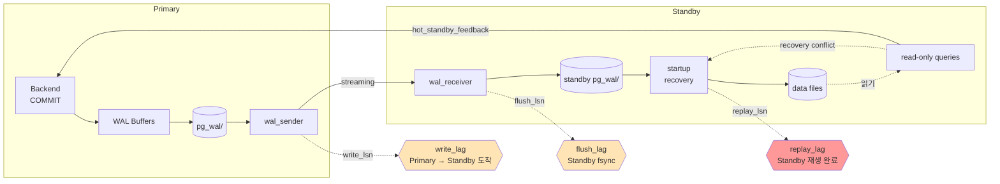

# D2. Replication Lag — Standby 가 따라가지 못한다

> **증상 박스**
> - `pg_stat_replication.replay_lag` 이 수 초 → 수 분 → 수 시간으로 증가
> - Standby 에서 조회한 데이터가 Primary 와 다름 (오래됨)
> - Standby 에서 실행 중이던 쿼리가 `FATAL: terminating connection due to conflict with recovery`
> - `pg_replication_slots.restart_lsn` 이 고정되며 Primary 의 pg_wal 용량 증가

---

## 증상

리포팅용 Standby 를 운영 중. 평소 lag 50ms 이하였는데 어느 시점부터 계속 늘어난다.

```
-- Primary 에서
SELECT application_name, state,
       write_lag, flush_lag, replay_lag,
       pg_wal_lsn_diff(pg_current_wal_lsn(), replay_lsn) AS replay_bytes_behind
FROM pg_stat_replication;

 application_name | state     | write_lag    | flush_lag    | replay_lag   | replay_bytes_behind
 -----------------+-----------+--------------+--------------+--------------+--------------------
 standby-report   | streaming | 00:00:02.310 | 00:00:02.310 | 00:01:45.002 | 248,233,472   (236 MB)
```

- `write_lag` / `flush_lag` 는 작음 → 네트워크/디스크 쓰기는 정상
- `replay_lag` 가 큼 → **Standby 가 WAL 을 받았지만 재생을 못 하고 있음**

함께 나타나는 증상:

```
Standby 로그:
  LOG:  restored log file "000000010000003200000045" from archive
  ERROR:  canceling statement due to conflict with recovery
  DETAIL:  User query might have needed to see row versions that must be removed.

Primary pg_wal 디렉토리가 느리게 부풀기 시작 (hot_standby_feedback 미사용 시 반대)
```

---

## 실제 상황

Standby 에 한 분석가가 `SELECT ... FROM orders ... WHERE created_at BETWEEN ...` 식의 2시간짜리 쿼리를 돌렸다. 동시에 Primary 에서는 VACUUM 이 오래된 튜플을 정리했고, 그 정리 정보를 Standby 가 재생하려는 순간 "아직 이 튜플을 읽고 있는 쿼리" 와 충돌했다.

Standby 의 재생 스레드는 두 가지 중 하나를 선택한다.

1. `max_standby_streaming_delay` 만큼 재생을 미룬다 → **replay_lag 증가**
2. 쿼리를 강제 종료 → 분석가 쿼리가 실패

운영자가 `max_standby_streaming_delay = 30min` 으로 늘려두어서, Standby 는 계속 재생을 미루고 있었다.

---

## 원인 분석

### WAL 흐름과 Lag 측정 지점

```
Primary                                Standby
  │                                      │
  │ (1) commit → WAL 생성                 │
  │─ WAL sender ──────→ WAL receiver ───▶ │ (2) 수신 (write_lag)
  │                                      │─▶ 디스크 fsync (flush_lag)
  │                                      │─▶ startup/recovery 가 재생 (replay_lag)
  │                                      │
  │                                      └─▶ read-only 쿼리
```

| 지표 | 의미 | 주된 병목 |
|------|------|----------|
| `write_lag` | Standby 가 수신까지 | 네트워크 |
| `flush_lag` | Standby 디스크 fsync 까지 | 디스크 I/O |
| `replay_lag` | Standby 재생 완료까지 | 충돌 회피 지연 / 단일 스레드 재생 |

### Replay 가 느려지는 이유

1. **Recovery conflict** — Standby 쿼리와 Primary VACUUM 이 충돌
   - `max_standby_streaming_delay` 로 재생을 미룬다 (기본 30s)
   - `hot_standby_feedback = on` 이면 Standby 가 쓰고 있는 스냅샷 정보를 Primary 로 보내 VACUUM 을 늦춘다 (대신 Primary Bloat 위험)

2. **Primary 쓰기 폭주** — 대량 INSERT/UPDATE 로 WAL 속도 > Standby 재생 속도
   - Standby 재생은 **단일 startup 프로세스** (PG17+ 에서 병렬화 일부 개선)

3. **네트워크** — AZ 간 또는 리전 간 Standby 는 latency/throughput 에 예민

4. **Standby 디스크 느림** — flush_lag 가 먼저 커짐

5. **Replication slot 이지만 소비가 중단** — 고아 슬롯은 Primary WAL 을 무한 보유 (→ [D3](D3_wal_disk_full.md))

### hot_standby_feedback 트레이드오프

```
hot_standby_feedback = off:
  Primary VACUUM 이 자유 → Standby 쿼리는 종종 취소됨

hot_standby_feedback = on:
  Standby 쿼리가 안 끊김 → Primary 가 Dead Tuple 을 회수 못 함 → Primary Bloat
```

리포팅 워크로드가 크면 `on` + VACUUM 튜닝, OLTP 워크로드가 크면 `off` + Standby 쿼리 짧게 쓰는 전략.

---

## 진단 쿼리

### Primary 측

```sql
-- 복제 상태 한눈에
SELECT
    pid,
    usename,
    application_name,
    client_addr,
    state,
    sync_state,                          -- async / sync / potential
    pg_current_wal_lsn() AS primary_lsn,
    sent_lsn, write_lsn, flush_lsn, replay_lsn,
    pg_wal_lsn_diff(pg_current_wal_lsn(), replay_lsn) AS replay_bytes_behind,
    write_lag, flush_lag, replay_lag
FROM pg_stat_replication;

-- Replication slot 상태 (논리/물리)
SELECT
    slot_name,
    slot_type,
    active,
    restart_lsn,
    confirmed_flush_lsn,
    pg_wal_lsn_diff(pg_current_wal_lsn(), restart_lsn) AS retained_bytes
FROM pg_replication_slots
ORDER BY retained_bytes DESC NULLS LAST;

-- pg_wal 디스크 사용량 누적 (슬롯이 소비하지 않아 쌓이는 양)
SELECT
    pg_size_pretty(sum(size)) AS total_wal
FROM pg_ls_waldir();
```

### Standby 측

```sql
-- 복구 모드 확인
SELECT pg_is_in_recovery();

-- 재생 지연 (초 단위)
SELECT
    CASE WHEN pg_last_wal_receive_lsn() = pg_last_wal_replay_lsn() THEN 0
         ELSE EXTRACT(EPOCH FROM now() - pg_last_xact_replay_timestamp())
    END AS replay_lag_sec;

-- 수신·재생 LSN
SELECT
    pg_last_wal_receive_lsn() AS receive_lsn,
    pg_last_wal_replay_lsn()  AS replay_lsn,
    pg_last_xact_replay_timestamp() AS last_replayed_tx_ts;

-- recovery conflict 발생 횟수 (PG14+)
SELECT datname, confl_tablespace, confl_lock, confl_snapshot,
       confl_bufferpin, confl_deadlock
FROM pg_stat_database_conflicts;
```

---

## 해결

### 즉시 조치 1 — Standby 쿼리 정리

```sql
-- Standby 에서 장기 쿼리 종료
SELECT pg_terminate_backend(pid)
FROM pg_stat_activity
WHERE state = 'active'
  AND now() - xact_start > interval '10 minutes';
```

### 즉시 조치 2 — 네트워크/디스크 확인

```bash
# Primary <-> Standby 간 RTT
ping -c 5 standby_host

# Standby 디스크 IO 상황
iostat -xm 1
```

### 근본 조치 1 — recovery conflict 완화

```ini
# Standby: postgresql.conf

# 쿼리 우선 (리포팅 Standby)
max_standby_streaming_delay = 5min
hot_standby_feedback = on                 # 대신 Primary Bloat 모니터링
```

```ini
# 복제 우선 (HA 용 Standby)
max_standby_streaming_delay = 30s
hot_standby_feedback = off
```

### 근본 조치 2 — 장기 쿼리는 Standby 전용 DB 로 분리

```
리포팅용 쿼리가 재생을 막는다면:
  - 전용 "reporting standby" 를 두고 hot_standby_feedback=on, delay 길게
  - HA 용 standby 는 feedback=off, delay 짧게
```

### 근본 조치 3 — 네트워크·쓰기 튜닝

```ini
# Primary
wal_compression = on                       # WAL 크기 감소 (PG10~; lz4/zstd 는 PG15+)
wal_writer_delay = 200ms
max_wal_senders = 10
wal_keep_size = 2GB                        # streaming 간격 여유
```

### 근본 조치 4 — 동기 복제 오해 제거

동기 복제는 lag 를 줄이지 않는다. **오히려 Primary commit 이 Standby 를 기다린다**.

```ini
synchronous_commit = on                    # 로컬 WAL fsync 까지
# synchronous_commit = remote_write        # Standby 가 WAL 을 받은 시점
# synchronous_commit = remote_apply        # Standby 재생 완료까지 → Primary 가 느려짐
synchronous_standby_names = ''             # 비설정 = 비동기 (lag 허용)
```

"지연을 줄이고 싶다"는 목적으로 `synchronous_commit = remote_apply` 를 켜면 Primary 처리량이 반토막 난다. 지연은 네트워크·재생 스레드 성능 문제이지 동기화 설정으로 풀 게 아니다.

### 근본 조치 5 — Replication slot 누수 해결

```sql
-- 버려진 슬롯 (active=false 이면서 restart_lsn 이 움직이지 않는 것)
SELECT slot_name, active,
       pg_wal_lsn_diff(pg_current_wal_lsn(), restart_lsn) AS behind_bytes
FROM pg_replication_slots
WHERE NOT active
ORDER BY behind_bytes DESC;

-- 삭제 (주의: 복구 중인 Standby 의 슬롯이 아님을 확인)
SELECT pg_drop_replication_slot('orphan_slot_name');

-- 예방: PG13+ 안전장치
ALTER SYSTEM SET max_slot_wal_keep_size = '10GB';
```

---

## 예방

```
체크리스트:

  1. 복제 지연 3대 지표 (write/flush/replay_lag) 를 항상 대시보드화
     → 어느 단계가 문제인지 먼저 구분.

  2. Standby 의 역할 구분
     - HA 용:  delay 짧게, feedback=off
     - 리포팅: delay 길게, feedback=on, 쿼리 timeout 명시

  3. hot_standby_feedback=on 일 때는
     - Primary Dead Tuple / Bloat 을 함께 모니터링
     - 분석가용 쿼리는 statement_timeout 필수

  4. Replication slot 은 "누가 어떤 목적으로 만들었는지" 문서화
     - 고아 슬롯 없애는 주기적 점검
     - max_slot_wal_keep_size 설정으로 안전장치

  5. 네트워크
     - AZ 간 복제는 RTT 와 throughput 상한 확인
     - WAL 압축 (wal_compression)

  6. 테스트
     - 평상시 lag p99 를 SLO 로 관리 (예: < 5s)
     - 장애 훈련: Standby 중단 → slot 쌓임 → archive 동작 확인
```

---

## Mermaid — WAL 흐름과 Lag 측정 포인트



---

## 관련 챕터

- [9장. WAL과 Checkpoint](../chapters/ch09_wal_checkpoint.md) — WAL 생성·플러시 원리
- [10장. Replication](../chapters/ch10_replication.md) — 스트리밍·논리·동기 복제 전체
- [D3. WAL로 인한 디스크 풀](D3_wal_disk_full.md) — slot 누수의 말기 증상
- [C2. idle in transaction](C2_idle_in_transaction.md) — Primary 쪽 oldest xmin 과 연관
- [cheatsheets/pg_stat_queries.md](../cheatsheets/pg_stat_queries.md) — 복제 진단 쿼리
