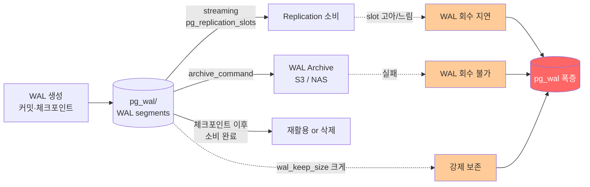
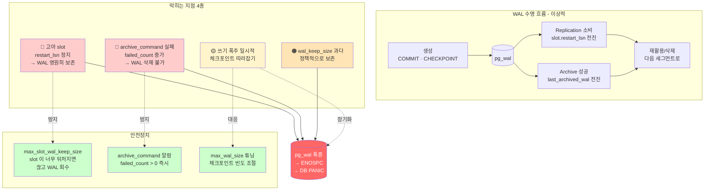

# D3. WAL 로 인한 디스크 풀 — pg_wal 이 부풀다가 DB 가 멈춘다

> **증상 박스**
> - `pg_wal/` 디렉토리 용량이 평소 대비 수십~수백 배로 팽창
> - `ERROR: could not extend file "base/xxx": No space left on device`
> - `PANIC: could not write to log file ...`
> - Primary 가 write 를 거부하거나 재기동 실패
> - `pg_replication_slots`, `pg_stat_archiver` 에 이상 징후

---

## 증상

어느 날 새벽 PagerDuty. "Primary DB 디스크 사용률 98%". 원인 확인하니 데이터 파일이 아니라 `pg_wal/` 이 폭증.

```bash
$ du -sh /var/lib/postgresql/15/main/*
 12G    base/
  2G    global/
648G    pg_wal/           # 😱 평소 4GB 수준
 48M    pg_stat_tmp/
```

Primary 로그:
```
ERROR:  could not extend file "base/16385/24579": No space left on device
FATAL:  could not write to file "pg_wal/xlogtemp.1234": No space left on device
PANIC:  could not write to log file: No space left on device
```

이쯤되면 DB 는 새 커밋을 거부한다. 조치하지 않으면 kill 후 재기동 시에도 복구 불가 상태가 될 수 있다.

---

## 실제 상황

세 가지 원인이 동시에 혹은 따로 일어난다.

### 케이스 1 — 고아 Replication slot

테스트용 Standby 를 며칠 전에 철거했는데, **Primary 에 만들어둔 slot 은 그대로였다.**

```sql
SELECT slot_name, active, restart_lsn,
       pg_wal_lsn_diff(pg_current_wal_lsn(), restart_lsn) AS behind_bytes
FROM pg_replication_slots;

 slot_name            | active | restart_lsn     | behind_bytes
 ---------------------+--------+-----------------+------------------
 test_standby_20260301| f      | 4A/32000000     | 623,145,984,000  ← 580GB
```

slot 은 "이 LSN 까지 누군가 소비할 때까지 WAL 을 보관해야 한다" 고 Primary 에 알려주는 장치. 아무도 소비하지 않으면 WAL 이 무한 누적된다.

### 케이스 2 — archive_command 실패

PITR 을 위해 WAL 을 S3 로 아카이브하는데, 권한 만료/버킷 오타 등으로 계속 실패.

```sql
SELECT * FROM pg_stat_archiver;

 archived_count | last_archived_wal       | last_failed_wal       | failed_count
 ---------------+-------------------------+-----------------------+-------------
         18923  | 000000010000003200000044| 000000010000003300000000|      2,142
```

`archive_command` 가 0 (성공) 을 반환하지 않으면 PostgreSQL 은 해당 WAL 을 **삭제하지 않고** 재시도한다. 영원히.

### 케이스 3 — wal_keep_size 과다

```ini
wal_keep_size = 100GB   # 이전엔 wal_keep_segments
```

HA 요건으로 큰 값을 설정해두고 잊음. 쓰기 폭주가 겹치면 그 크기만큼 pg_wal 이 항상 유지된다.

---

## 원인 분석

### WAL 수명 주기



PostgreSQL 이 WAL 세그먼트를 회수(재활용 또는 삭제) 하려면 **세 가지 조건이 동시에 만족**해야 한다.

```
1. 체크포인트가 지나 이미 데이터 파일에 반영된 WAL 이어야 한다.
2. Replication slot 이 있다면 모든 slot 의 restart_lsn 이 지나야 한다.
3. archive_command 가 설정되었다면 archive 가 성공해야 한다.
4. wal_keep_size 로 강제 보존되는 구간이 아니어야 한다.
```

하나라도 못 지나면 그 세그먼트는 남는다. pg_wal 은 **"가장 뒤처진 소비자"가 결정하는 저수지**다.

### 왜 위험한가

- pg_wal 이 가득 차면 커밋이 안 됨 → 앱 전체 장애
- 완전 풀이면 PostgreSQL 이 PANIC 으로 내려가고, 재기동 시에도 WAL 복구를 위해 공간이 더 필요할 수 있어 **복구 자체가 어려워진다**
- 임시 방편으로 pg_wal 파일을 `rm` 하면 **DB 가 망가진다** (복구 불가 상태)

---

## 진단 쿼리

### 1) pg_wal 현재 크기와 파일 수

```bash
du -sh /var/lib/postgresql/15/main/pg_wal/
ls /var/lib/postgresql/15/main/pg_wal/ | wc -l
```

```sql
SELECT pg_size_pretty(sum(size)) AS total_wal,
       count(*) AS n_segments
FROM pg_ls_waldir();
```

### 2) Replication slot 점검 (가장 흔한 원인)

```sql
SELECT
    slot_name,
    slot_type,
    active,
    active_pid,
    database,
    restart_lsn,
    confirmed_flush_lsn,
    pg_size_pretty(
        pg_wal_lsn_diff(pg_current_wal_lsn(), restart_lsn)
    ) AS retained_wal
FROM pg_replication_slots
ORDER BY pg_wal_lsn_diff(pg_current_wal_lsn(), restart_lsn) DESC NULLS LAST;
```

기준:
- `active = f` 이고 `retained_wal` 이 수 GB 이상 → 고아 슬롯 의심
- `active = t` 지만 `retained_wal` 이 계속 증가 → 소비자(Standby/CDC) 가 느림

### 3) Archive 상태

```sql
SELECT
    archived_count,
    last_archived_wal,
    last_archived_time,
    failed_count,
    last_failed_wal,
    last_failed_time,
    stats_reset
FROM pg_stat_archiver;
```

기준:
- `failed_count > 0` 이고 `last_failed_time` 이 최근 → archive_command 가 계속 실패 중
- `last_archived_time` 이 한참 전 → archive 가 멈춤

### 4) 설정 점검

```sql
SELECT name, setting, unit FROM pg_settings
WHERE name IN (
  'wal_keep_size','wal_keep_segments',
  'max_slot_wal_keep_size',
  'archive_mode','archive_command','archive_library',
  'max_wal_size','min_wal_size','checkpoint_timeout'
);
```

### 5) 체크포인트 빈도

```sql
SELECT * FROM pg_stat_bgwriter;
-- checkpoints_req (요청 기반) 이 많으면 max_wal_size 부족 신호
```

---

## 해결

### 🚨 긴급 조치 — 공간 확보 순서

```
1) DB 를 멈추지 말 것. rm 으로 pg_wal 파일 삭제 절대 금지.
2) "다른" 디스크의 파일부터 지워 공간 확보:
     - 오래된 애플리케이션 로그, core dump
     - pg_log / postgresql.log 오래된 것
3) 그동안 원인을 특정한다.
```

#### 원인 A — 고아 slot

```sql
-- 확인
SELECT slot_name, active,
       pg_size_pretty(pg_wal_lsn_diff(pg_current_wal_lsn(), restart_lsn)) AS retained
FROM pg_replication_slots
WHERE NOT active;

-- 이 slot 이 정말 버려진 것인지 100% 확신한 뒤 삭제
--   (해당 이름의 Standby/CDC 가 살아있지 않은지 인프라팀 확인)
SELECT pg_drop_replication_slot('test_standby_20260301');

-- 삭제 직후 pg_wal 이 체크포인트 타이밍에 정리되기 시작
CHECKPOINT;
```

#### 원인 B — archive_command 실패

```bash
# 실패 원인 파악: 직접 같은 명령을 셸에서 시도
sudo -u postgres aws s3 cp /var/lib/postgresql/15/main/pg_wal/000000010000003300000000 s3://mybucket/wal/000000010000003300000000
```

해결:
- IAM/권한/네트워크/버킷 이름 수정
- `postgresql.conf` 수정 후 `SELECT pg_reload_conf();` (archive_command 는 reload 로 반영)

임시 bypass (데이터 보호를 포기하는 것이므로 팀과 합의 후):
```sql
-- 아카이빙 일시 중단 (WAL 은 소비된 것부터 바로 회수됨)
ALTER SYSTEM SET archive_mode = off;   -- 재기동 필요
-- 또는 아카이브 실패를 성공으로 속이는 command 로 임시 대체 (매우 위험, PITR 구간 손상)
ALTER SYSTEM SET archive_command = '/bin/true';
SELECT pg_reload_conf();
```

장애 해소 후 올바른 `archive_command` 로 복구하고 누락 구간 재생성을 고민해야 한다 (PITR 타임라인 영향).

#### 원인 C — wal_keep_size 과다

```sql
ALTER SYSTEM SET wal_keep_size = '2GB';
SELECT pg_reload_conf();
CHECKPOINT;
```

#### 원인 D — 쓰기 폭주 일시적

```sql
-- 체크포인트를 수동으로 더 자주 (일시)
CHECKPOINT;
ALTER SYSTEM SET max_wal_size = '16GB';   -- 여유 확대
SELECT pg_reload_conf();
```

### 근본 조치 — 안전장치 `max_slot_wal_keep_size` (PG13+)

"slot 이 이 이상 WAL 을 붙잡으면 그냥 끊겠다" 는 최상위 브레이크.

```sql
ALTER SYSTEM SET max_slot_wal_keep_size = '10GB';
SELECT pg_reload_conf();
```

효과:
- slot 이 10GB 이상 지연되면 Primary 가 해당 slot 의 `restart_lsn` 을 초과해 WAL 을 회수
- Standby 는 더이상 따라갈 수 없어 `SELECT pg_replication_slots` 에서 `wal_status='lost'` 가 됨
- Standby 를 재생성해야 하지만 **Primary 는 살아남는다**

트레이드오프 명확히: Standby 의 연속성을 포기하고 Primary 의 가용성을 지킨다.

### 근본 조치 — archive_command 는 멱등하고 실패 감지되게

```bash
# 나쁜 예 — 덮어쓰기로 아카이브 무결성 파괴
archive_command = 'cp %p /mnt/archive/%f'

# 좋은 예 (권장) — 전용 도구가 원자적 업로드·해시 검증·재시도까지 처리
archive_command = 'pgbackrest --stanza=main archive-push %p'
archive_command = 'wal-g wal-push %p'

# 자체 스크립트 — cmp 로 내용 일치까지 검증해야 무한 재시도 방지
# /usr/local/bin/pg_archive.sh
#   set -e
#   SRC="$1"; DST="/mnt/archive/$2"
#   if [ -f "$DST" ]; then
#     cmp -s "$SRC" "$DST" && exit 0 || exit 1
#   fi
#   cp "$SRC" "$DST.tmp" && sync "$DST.tmp" && mv "$DST.tmp" "$DST"
archive_command = '/usr/local/bin/pg_archive.sh %p %f'

# 최소 레퍼런스(공식 문서에 등장하지만 내용 검증 없음 — 운영 비권장)
# archive_command = 'test ! -f /mnt/archive/%f && cp %p /mnt/archive/%f'
```

> ⚠️ `test ! -f && cp` 패턴은 대상 파일이 **이미 손상된 상태로 존재**하면 무한히 실패 리턴 → `pg_wal/` 폭증. 파일 내용을 검증하는 `cmp -s` 또는 전용 도구를 사용해야 한다.

### 근본 조치 — 모니터링 지표

```
알람 조건 예시:
  - pg_wal 디스크 > 70%
  - pg_replication_slots.retained_wal > 5GB 인 slot 존재
  - pg_stat_archiver.failed_count 최근 5분 > 0
  - max(pg_wal_lsn_diff(pg_current_wal_lsn(), restart_lsn)) > 1GB
```

---

## 예방

```
체크리스트:

  1. replication slot 은 "만들었으면 추적한다"
     - 이름에 목적/소유자 포함 (예: standby_report_dashboard)
     - 사용 종료 시 즉시 DROP
     - 주기적으로 (월 1회) 고아 슬롯 점검

  2. max_slot_wal_keep_size 는 프로덕션 기본값
     - PG13+ 기본 탑재, 반드시 설정
     - 값은 pg_wal 여유의 절반 이하

  3. archive_command 는 전용 도구 사용
     - pgBackRest / WAL-G / Barman
     - failed_count 알람 필수
     - 복구 훈련 정기 실시

  4. wal_keep_size 는 streaming 의 안전 버퍼일 뿐
     - 상황이 바뀌면 slot 으로 대체

  5. pg_wal 전용 마운트 권장
     - 데이터 파일과 분리된 볼륨
     - 풀이 나도 DB 전체가 멈추지 않음

  6. 모니터링
     - pg_wal 용량, slot retained_wal, archiver failed_count 3종 세트
     - 체크포인트 시간/요청 횟수도 함께
```

---

## Mermaid — WAL 수명 흐름과 막히는 지점



---

## 관련 챕터

- [9장. WAL과 Checkpoint](../chapters/ch09_wal_checkpoint.md) — WAL 아키텍처 전체
- [10장. Replication](../chapters/ch10_replication.md) — replication slot 상세
- [11장. Backup과 복구](../chapters/ch11_backup_recovery.md) — archive_command, PITR
- [D2. Replication Lag](D2_replication_lag.md) — slot 누적의 전조 증상
- [cheatsheets/config_parameters.md](../cheatsheets/config_parameters.md) — max_wal_size, max_slot_wal_keep_size 세팅
- [cheatsheets/backup_recovery_recipes.md](../cheatsheets/backup_recovery_recipes.md) — pgBackRest/WAL-G 레시피
