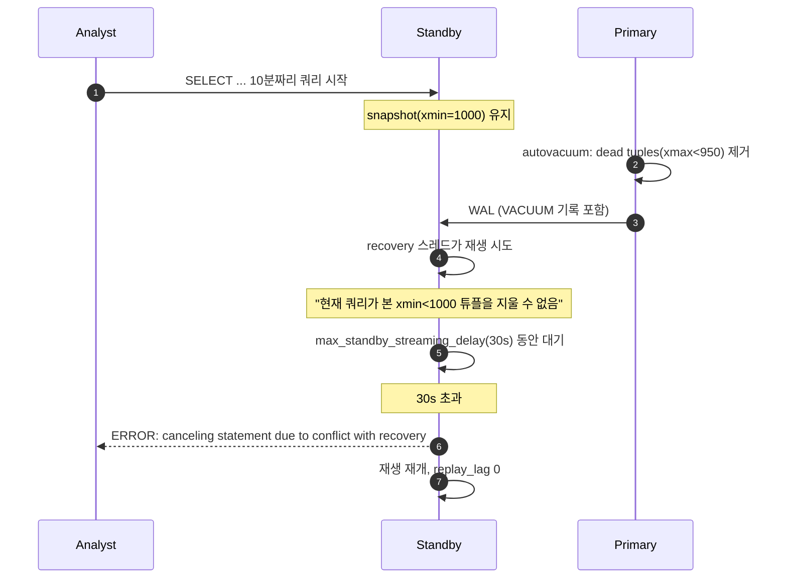
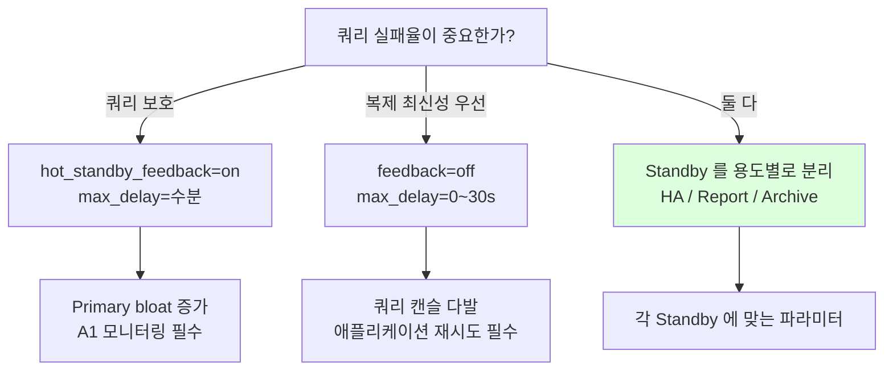

# D4. Standby Recovery Conflict — 분석 쿼리가 갑자기 캔슬된다

> **증상 박스**
> - Standby 에서 실행 중이던 긴 쿼리가 `ERROR: canceling statement due to conflict with recovery` 로 중단
> - `pg_stat_database_conflicts` 의 `confl_*` 컬럼이 주기적으로 증가
> - 혹은 반대로, `replay_lag` 가 계속 증가 (쿼리는 살지만 재생이 밀린다)
> - `hot_standby_feedback=on` 으로 돌린 뒤에는 Primary 쪽 bloat 가 심해짐
> - 리포트용 Standby 에서 "어제 잘 돌던 배치" 가 오늘 실패

---

## 증상

| 관측 지점 | 현상 |
|-----------|------|
| Standby 로그 | `ERROR: canceling statement due to conflict with recovery` |
| `pg_stat_database_conflicts` | `confl_snapshot`, `confl_bufferpin`, `confl_lock`, `confl_tablespace`, `confl_deadlock` 증가 |
| `pg_stat_replication` | `replay_lag` 가 5~30s 진폭으로 출렁, 혹은 우상향 |
| 애플리케이션 | 분석가/BI 도구 쿼리의 일부가 40001, ProcessInterrupts 로 실패 |
| 운영자 | `max_standby_streaming_delay` vs `hot_standby_feedback` 간 트레이드오프 고민 |

```
2026-04-24 03:14:27 KST [12901] ERROR:  canceling statement due to conflict with recovery
2026-04-24 03:14:27 KST [12901] DETAIL:  User query might have needed to see row versions that must be removed.
2026-04-24 03:14:27 KST [12901] STATEMENT:  SELECT product_id, SUM(amount)
                                            FROM   sales
                                            WHERE  created_at >= '2026-03-01'
                                            GROUP  BY product_id;
```

```sql
SELECT datname,
       confl_tablespace,
       confl_lock,
       confl_snapshot,
       confl_bufferpin,
       confl_deadlock
FROM pg_stat_database_conflicts
WHERE datname = current_database();

 datname | confl_tablespace | confl_lock | confl_snapshot | confl_bufferpin | confl_deadlock
---------+------------------+------------+----------------+-----------------+----------------
 prod    |                0 |          3 |           2841 |              12 |              0
                                              ^^^^
                                   대부분의 캔슬은 snapshot 충돌
```

---

## 실제 상황

### 재현 시나리오

```sql
-- Standby 에서 분석가가 10분짜리 대용량 쿼리 실행
-- (snapshot 을 10분간 유지하는 셈)
psql -h standby -U analyst -d prod <<SQL
EXPLAIN ANALYZE
SELECT user_id, count(*)
FROM   events
WHERE  occurred_at BETWEEN '2026-03-01' AND '2026-04-01'
GROUP  BY user_id;
SQL
```

```sql
-- Primary 에서 동시에 평소처럼 VACUUM 이 돈다
VACUUM (VERBOSE) events;
-- → 오래된 dead tuple 제거
-- → 해당 정리 내역이 WAL 로 전송됨
```

### 타임라인

```
시각       Primary                                Standby
--------- -------------------------------------- ------------------------------------
03:00:00  autovacuum: events (threshold 충족)
03:00:00                                          분석가 SELECT 시작 (snapshot 잡힘)
03:00:05  dead tuple 제거 완료, WAL 송신          재생: 같은 페이지 pruning 시도
                                                   └─ "현재 쿼리가 이 tuple 을 볼 필요가
                                                       있을지도" → 재생 지연 시작
03:00:35  (Primary 는 이미 다른 작업)              max_standby_streaming_delay=30s 초과
03:00:35                                          쿼리 강제 취소 (snapshot conflict)
                                                  재생 재개, replay_lag 리셋
03:00:36                                          분석가: ERROR canceling statement ...
```

분석가 쿼리가 길수록, Primary 에 VACUUM/HOT prune 이 잦을수록, 이 충돌이 빈번해진다.

---

## 원인 분석 (PG 내부 상세)

### 1) Standby 의 recovery 스레드 vs 읽기 세션

```
Primary                           Standby
  │                                 │
  │─ WAL ─────────────────────────▶ │  startup/recovery 프로세스 (단일 스레드)
  │  (VACUUM, DDL, DROP 등 기록)    │    │
  │                                 │    │  WAL 재생하려고 보니
  │                                 │    │  같은 블록/튜플을 현재 세션이 읽고 있음
  │                                 │    ▼
  │                                 │  충돌 → 둘 중 하나를 희생시켜야 함
```

### 2) 여섯 가지 conflict 유형

| 유형 | 발생 조건 | `pg_stat_database_conflicts` 컬럼 |
|------|-----------|------------------------------------|
| **snapshot** | Primary 의 VACUUM/HOT prune 이 old tuple 제거 → Standby 쿼리 snapshot 과 충돌 | `confl_snapshot` |
| **buffer pin** | 재생 중 블록을 가져가려는데 쿼리가 buffer pin 유지 | `confl_bufferpin` |
| **lock** | Primary 의 AccessExclusiveLock(DROP/ALTER) 이 재생되려 하는데 Standby 쿼리가 같은 relation 을 읽는 중 | `confl_lock` |
| **tablespace** | Primary 에서 DROP TABLESPACE, Standby 에 열린 temp file 이 해당 TS 에 있을 때 | `confl_tablespace` |
| **database** | DROP DATABASE 재생 시 Standby 에 해당 DB 접속이 있는 경우 | (접속 종료) |
| **deadlock** | 재생 스레드와 read 세션 사이 교차 대기 (드물음) | `confl_deadlock` |

압도적 다수는 **snapshot conflict** 다.

### 3) 핵심 파라미터

```conf
# Standby postgresql.conf
hot_standby = on                         # 기본 on
max_standby_streaming_delay = '30s'      # 스트리밍 재생을 미룰 수 있는 상한
max_standby_archive_delay   = '30s'      # archive 재생 상한
hot_standby_feedback        = off        # Standby 의 oldest xmin 을 Primary 에 통보
```

- `max_standby_streaming_delay = 30s` : 30초까진 재생을 미뤄 쿼리를 지킨다. 초과하면 쿼리를 취소한다.
- `max_standby_streaming_delay = -1` : **무제한 대기**. 쿼리는 절대 안 죽지만 replay_lag 가 계속 누적 → 복제 지연 알람 폭풍.
- `hot_standby_feedback = on` : Standby 의 읽기 세션 xmin 이 Primary 로 전달돼 Primary 의 VACUUM 이 거기까지 청소 못 한다. 쿼리는 보호되지만 **Primary bloat 위험**. (A1 과 직결)

### 4) 트레이드오프 삼각형

```
       쿼리 완료 보장
         (no cancel)
              ▲
              │
              │  hot_standby_feedback=on
              │  max_standby_streaming_delay=-1
              │
              ◆ 선택 불가능: 세 꼭짓점 동시 만족
              │
              │
   Primary bloat 최소 ◆ ───────── ◆ Standby 최신성 유지 (replay_lag 0)
```

세 가지를 동시에 만족할 수 없다. 워크로드에 맞게 두 개를 고르고 세 번째를 포기해야 한다.

---

## 진단 쿼리

### 어떤 유형의 충돌인가

```sql
-- Standby 에서 실행
SELECT datname,
       confl_tablespace,
       confl_lock,
       confl_snapshot,
       confl_bufferpin,
       confl_deadlock,
       stats_reset
FROM pg_stat_database_conflicts
ORDER BY confl_snapshot DESC;
```

### 복제 지연

```sql
-- Primary 에서 실행
SELECT application_name,
       state,
       write_lag, flush_lag, replay_lag,
       pg_wal_lsn_diff(pg_current_wal_lsn(), replay_lsn) AS replay_behind_bytes
FROM pg_stat_replication;
```

### 현재 파라미터 확인

```sql
-- Standby
SHOW hot_standby_feedback;
SHOW max_standby_streaming_delay;
SHOW max_standby_archive_delay;

-- Primary 에서 Standby 피드백 적용 여부
SELECT application_name, backend_xmin
FROM pg_stat_replication;
-- backend_xmin 이 null 이면 feedback off
```

### 로그 설정

```conf
# postgresql.conf
log_recovery_conflict_waits = on        -- v14+, 재생이 지연될 때 로그
log_min_messages = warning
log_line_prefix = '%m [%p] %q%u@%d '
```

---

## 해결 방법

### 즉시 (incident 진행 중)

```sql
-- 1. replay_lag 가 심각하면 Standby 에서 blocker 찾기
SELECT pid, now() - xact_start AS tx_age, state, query
FROM pg_stat_activity
WHERE datname = current_database()
  AND pid <> pg_backend_pid()
ORDER BY xact_start
LIMIT 10;

-- 2. 특정 세션을 종료 (필요 시)
SELECT pg_terminate_backend(<pid>);

-- 3. 혹은 문제 쿼리를 재시도 + LIMIT 으로 축소
```

### 단기 (워크로드 분리가 어려운 상황)

**옵션 A — 쿼리 보호 우선**
```conf
# Standby postgresql.conf
max_standby_streaming_delay = '10min'   # 10분 한도로 보호
hot_standby_feedback        = on        # Primary 가 VACUUM 자제
```
부작용: Primary bloat, `pg_stat_all_tables.n_dead_tup` 상승, `vacuum` 통계 주의.

**옵션 B — 복제 최신성 우선**
```conf
max_standby_streaming_delay = '0'       # 즉시 캔슬
hot_standby_feedback        = off
```
부작용: 쿼리 실패율 상승 → 애플리케이션 재시도 필수.

**옵션 C — 지연 standby 추가**
```conf
# 별도의 "archival" standby
recovery_min_apply_delay = '1h'         # 1시간 지연 재생 (복구 백업용)
```
주요 용도: 실수 복구 버퍼. 분석용으로는 부적합.

### 근본 (설계 레벨)

1. **용도별 Standby 분리**
   - Primary : OLTP
   - Standby-A (HA) : `feedback=off`, `max_delay=30s` (복제 최신성 우선)
   - Standby-B (Report) : `feedback=on`, `max_delay=5min` (분석 쿼리 보호)
   - Standby-C (Archive) : `recovery_min_apply_delay=1h` (실수 대비)

2. **분석 쿼리 시간 제한**
   ```sql
   -- Standby 에서 접속하는 분석가 계정에 기본 타임아웃
   ALTER ROLE analyst SET statement_timeout = '10min';
   ALTER ROLE analyst SET idle_in_transaction_session_timeout = '5min';
   ```

3. **핫 테이블은 Primary vacuum freeze 로 여유** — `events`, `sales` 같은 append-only 테이블은 `autovacuum_freeze_max_age` 를 낮춰 Primary 에서 선제 청소.

4. **`hot_standby_feedback` 모니터링** — 켠 뒤에는 Primary `pg_stat_all_tables.n_dead_tup` 을 반드시 알람. A1 bloat 이슈가 대신 터진다.

5. **테이블/쿼리 레벨에서 지연 용인** — BI 도구가 "5분 예전 스냅샷" 을 받아도 되는 워크로드라면 재시도 로직 + 캐시로 해결.

---

## 예방 원칙

```
운영 체크리스트
  □ 용도별 Standby 분리 (HA / Report / Archive)
  □ 분석 계정에 statement_timeout 기본 설정
  □ hot_standby_feedback 켜면 Primary bloat 경보 필수
  □ log_recovery_conflict_waits = on (v14+)
  □ pg_stat_database_conflicts 시계열 대시보드
  □ replay_lag 알람 임계치는 "캔슬보다 지연을 택하는지" 에 따라 다르게

설계 원칙
  □ BI 도구에 "읽기용 Standby 는 캔슬 가능" 이라는 재시도 전제 공유
  □ 길이 쿼리(> 10분) 는 전용 분석 DB 로 분리
  □ Primary 의 대량 DDL(DROP/ALTER)이 예정되면 Standby 쿼리 차단 공지
```

---

## Mermaid

### snapshot conflict 시퀀스



### 파라미터 선택지 트리



---

## 관련 챕터 / 치트시트 / 다른 케이스

- [10장. Replication](../chapters/ch10_replication.md) — 스트리밍/로지컬 복제 전체 구조
- [8장. VACUUM/Autovacuum](../chapters/ch08_vacuum_autovacuum.md) — VACUUM 이 WAL 을 남기는 방식
- [3장. MVCC](../chapters/ch03_mvcc.md) — snapshot, xmin 개념
- [A1. Bloat 누적](A1_bloat_accumulation.md) — hot_standby_feedback 의 부작용
- [A3. 긴 TX 가 VACUUM 을 막는다](A3_long_tx_blocks_vacuum.md) — 같은 구조가 Standby 쪽에서 작동
- [D2. Replication Lag](D2_replication_lag.md) — replay_lag 증가와 교차
- [D3. WAL 디스크 풀](D3_wal_disk_full.md) — feedback off 시 slot 이슈와 교차
- [cheatsheets/config_parameters.md](../cheatsheets/config_parameters.md) — standby 파라미터 한 장 정리
- 공식 문서: https://www.postgresql.org/docs/current/hot-standby.html#HOT-STANDBY-CONFLICT
