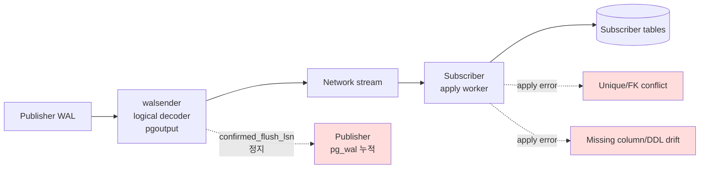
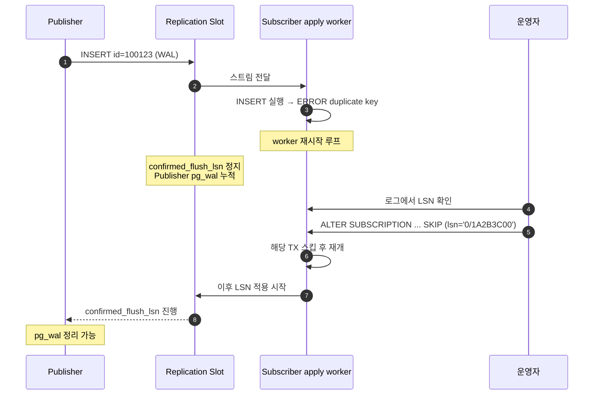

# D5. Logical Replication 장애 — Apply Lag, Conflict, Slot 미회수

> **증상 박스**
> - Subscriber 의 `pg_stat_subscription.latest_end_lsn` 이 멈추거나 급격히 뒤처짐
> - `pg_stat_subscription_stats.apply_error_count` 증가 (v15+)
> - Subscriber 로그에 `ERROR: duplicate key value violates unique constraint` 또는 `relation "xxx" does not exist`
> - Publisher 쪽 `pg_replication_slots.confirmed_flush_lsn` 이 정지 → `pg_wal` 용량 폭증
> - Subscription 삭제 뒤 남은 **고아 slot** 이 D3(WAL disk full) 로 이어지는 합병증

---

## 증상

| 관측 지점 | 현상 |
|-----------|------|
| Subscriber | apply worker 재시작 반복, `latest_end_lsn` 정지 |
| `pg_stat_subscription_stats` | `apply_error_count`, `sync_error_count` 증가 (v15+) |
| Publisher | `pg_replication_slots.confirmed_flush_lsn` 움직이지 않음, `pg_wal_lsn_diff` 로 누적 측정 |
| Subscriber 로그 | `duplicate key`, `no tuple identifier`, `column ... does not exist` |
| Metric | Publisher 디스크 우상향 → D3 증상 전조 |

```
# Subscriber log
2026-04-24 05:12:07 KST [8912] LOG:  logical replication apply worker for subscription "sub_orders" has started
2026-04-24 05:12:07 KST [8912] ERROR: duplicate key value violates unique constraint "orders_pkey"
2026-04-24 05:12:07 KST [8912] DETAIL: Key (id)=(100123) already exists.
2026-04-24 05:12:07 KST [8912] CONTEXT: processing remote data for replication origin "pg_16407" during "INSERT"
                                        for replication target relation "public.orders" in transaction 12345678
```

apply worker 는 충돌이 나면 **무한 재시도** 한다. 그러면서 `pg_wal` 은 계속 쌓이고, 구독자는 영원히 따라잡지 못한다.

---

## 실제 상황

### 세 가지 주된 장애 모드

**(1) Conflict by unique/FK** — Subscriber 에 수동 INSERT 가 섞여 PK 가 겹치거나, FK 대상 부모 행이 아직 도착하지 않음.

**(2) DDL drift** — Publisher 에 `ALTER TABLE ADD COLUMN` 을 쳤는데 Subscriber 에 동일 DDL 적용을 까먹음. Logical replication 은 DDL 을 복제하지 않는다 (v15 이하 기준).

**(3) Apply lag 폭주** — Publisher 에 한 번에 수백만 건 INSERT. Subscriber 의 apply worker 는 단일 스레드(v15 이하) 라 병목.

**(4) Orphan slot** — `DROP SUBSCRIPTION` 전에 Subscriber 를 네트워크 단절 상태로 날려버린 뒤, Publisher 에 slot 만 남음. Publisher WAL 이 영구 누적.

### 타임라인 예시 (DDL drift + conflict)

```
시각       Publisher                              Subscriber
--------- -------------------------------------- ------------------------------------
14:00:00  정상 동작, lag 0
14:05:00  ALTER TABLE orders
            ADD COLUMN coupon_code text;
14:05:30  INSERT INTO orders(... , coupon_code)
            VALUES (..., 'SPRING10');
14:05:30                                          apply worker 수신
                                                  → ERROR: column "coupon_code" does
                                                     not exist in public.orders
14:05:30~                                         worker 재시작 루프
                                                  → confirmed_flush_lsn 정지
14:30:00  pg_wal 사용률 60%→80%
15:00:00  (D3 전조) pg_wal 90%, 운영자 인지
```

---

## 원인 분석 (PG 내부 상세)

### 1) Logical replication 파이프라인

```
Publisher                                         Subscriber
  │                                                 │
  │ commit → WAL                                    │
  │        │                                        │
  │        ▼                                        │
  │ walsender (logical decoder, pgoutput)           │
  │        │                                        │
  │        │ pg_replication_slots 가 진행 LSN 기록  │
  │        │                                        │
  │        ▼                                        │
  │ 네트워크 스트림  ─────────────────────────────▶ │ apply worker (per subscription)
  │                                                 │   │
  │                                                 │   │ INSERT/UPDATE/DELETE 재수행
  │                                                 │   │ (일반 SQL 로 재전개)
  │                                                 │   ▼
  │                                                 │ 로컬 테이블에 적용
  │ ◀── confirmed_flush_lsn 업데이트 ───────────────│
```

핵심: **재수행은 일반 SQL 처럼 들어간다.** 그래서 `UNIQUE`, FK, CHECK, trigger 가 전부 작동한다. 충돌은 Subscriber 관점에서는 그냥 "SQL 오류" 다.

### 2) 버전별 주요 차이

| 버전 | 기능 |
|------|------|
| v10  | Logical replication 최초 도입 (INSERT/UPDATE/DELETE only) |
| v13  | 파티션 테이블 publish 지원 |
| v14  | `streaming=on` (in-progress tx 스트리밍), 2PC 복제 |
| v15  | `pg_stat_subscription_stats`, `ALTER SUBSCRIPTION ... SKIP (lsn = ...)`, row filter, column list |
| v16  | `streaming=parallel` (대용량 TX 병렬 적용), 바이너리 복제 |

많이 쓰는 기능이 **v15 이상에서 훨씬 관리 용이** 하므로 버전 업이 가장 강력한 예방책이다.

### 3) 왜 apply worker 는 무한 재시도하는가

apply worker 는 "한 번 실패한 transaction 은 반드시 적용되어야 한다" 를 원칙으로 한다. Skip 하려면 사람이 LSN 을 지정해 명시적으로 건너뛰어야 한다. 그 사이 slot 의 `confirmed_flush_lsn` 은 진전되지 않고 Publisher WAL 은 쌓인다.

### 4) DDL 이 복제되지 않는 이유

Logical decoding 은 heap 수준 row change 를 토해낸다. DDL 은 catalog 변경이라 "row" 로 표현되지 않는다. Publisher 와 Subscriber 의 스키마가 **선배포** 되어야 한다. (v15+ 에 publish DDL 옵션 확장 중이지만 아직 제한적)

---

## 진단 쿼리

### Subscriber 쪽 상태

```sql
-- 전체 구독 상태
SELECT subname,
       pid,
       received_lsn,
       latest_end_lsn,
       latest_end_time,
       now() - latest_end_time AS since_last_apply
FROM pg_stat_subscription;
```

```sql
-- v15+: 에러 카운터
SELECT subname,
       apply_error_count,
       sync_error_count,
       stats_reset
FROM pg_stat_subscription_stats;
```

### Publisher 쪽 slot 상태

```sql
SELECT slot_name,
       plugin,
       slot_type,
       active,
       active_pid,
       restart_lsn,
       confirmed_flush_lsn,
       pg_wal_lsn_diff(pg_current_wal_lsn(), confirmed_flush_lsn) AS behind_bytes,
       pg_size_pretty(
         pg_wal_lsn_diff(pg_current_wal_lsn(), confirmed_flush_lsn)
       ) AS behind
FROM pg_replication_slots
WHERE slot_type = 'logical'
ORDER BY behind_bytes DESC;
```

`active = f` 이고 `behind_bytes` 가 크면 고아 slot 유력.

### 진짜 원인 특정: Subscriber 로그

```conf
# Subscriber postgresql.conf
log_replication_commands = on
log_min_messages = info
```

로그의 `CONTEXT: processing remote data for replication origin ... during "INSERT" for replication target relation "..." in transaction <xid>` 가 핵심 단서다.

### 어떤 LSN 에서 막혔는가

```sql
-- v15+ 가능: 현재 apply 가 막힌 트랜잭션 LSN 추정
SELECT sub.subname,
       stat.received_lsn,
       stat.latest_end_lsn,
       slots.confirmed_flush_lsn
FROM pg_subscription sub
JOIN pg_stat_subscription stat USING (subname)
LEFT JOIN pg_replication_slots slots ON slots.slot_name = sub.subname;
```

---

## 해결 방법

### 즉시 (incident 진행 중) — conflict

**(a) v15+ SKIP 으로 특정 LSN 건너뛰기**
```sql
-- subscriber 에서 실행
-- 로그에서 확보한 LSN 을 전달
ALTER SUBSCRIPTION sub_orders SKIP (lsn = '0/1A2B3C00');

-- apply 가 재개되면서 해당 TX 를 스킵
```

**(b) v14 이하 또는 수동 정리**
```sql
-- 1. 일단 멈춤
ALTER SUBSCRIPTION sub_orders DISABLE;

-- 2. Subscriber 의 충돌 데이터 수동 정리
DELETE FROM orders WHERE id = 100123;   -- 중복된 레코드 제거

-- 3. 재개
ALTER SUBSCRIPTION sub_orders ENABLE;
```

**(c) DDL drift 복구**
```sql
-- Subscriber 에 누락된 DDL 선반영 (publisher 와 동일 스키마)
ALTER TABLE orders ADD COLUMN coupon_code text;

-- 그 다음 subscription enable
ALTER SUBSCRIPTION sub_orders ENABLE;
```

### 단기 — apply lag

**(a) v16+ 병렬 스트리밍**
```sql
ALTER SUBSCRIPTION sub_orders SET (streaming = parallel);
```

**(b) v14+ 스트리밍 on (부분 완화)**
```sql
ALTER SUBSCRIPTION sub_orders SET (streaming = on);
-- in-progress 큰 TX 을 스트리밍으로 받아 Subscriber 에 임시 파일로 저장
```

**(c) 테이블별 subscription 분리**
```sql
-- 거대 테이블은 자체 subscription 으로 떼내면 apply worker 가 분리되어 병렬 효과
CREATE SUBSCRIPTION sub_events
  CONNECTION '...'
  PUBLICATION pub_events;
```

**(d) 큰 트랜잭션 분해** — ETL 이 `INSERT ... SELECT` 로 5천만 건을 한 TX 로 넣는 패턴을 배치 단위로 쪼갠다.

### 단기 — 고아 slot (D3 전조)

```sql
-- Publisher 에서 active=f, 소유자 subscription 이 이미 없는 slot 확인
SELECT slot_name, active, confirmed_flush_lsn
FROM pg_replication_slots
WHERE slot_type='logical' AND NOT active;

-- 정말 고아인지 확인 후 제거 (주의: WAL 을 바로 재활용 가능하게 됨)
SELECT pg_drop_replication_slot('sub_orders');
```

### 근본 — 올바른 DROP SUBSCRIPTION 절차

```sql
-- Subscriber 에서
-- 1) 일단 disable
ALTER SUBSCRIPTION sub_orders DISABLE;

-- 2) Publisher 쪽 slot 과의 연결 분리 (핵심)
ALTER SUBSCRIPTION sub_orders SET (slot_name = NONE);

-- 3) Subscription 제거 (이제 Publisher slot 은 건드리지 않음)
DROP SUBSCRIPTION sub_orders;

-- 4) Publisher 에서 slot 명시적 제거
-- (publisher)
SELECT pg_drop_replication_slot('sub_orders');
```

`slot_name = NONE` 을 건너뛰면 Subscriber 가 접속이 안 되는 상태에서 `DROP SUBSCRIPTION` 이 블록되거나 실패하며, 그 뒤 고아 slot 이 Publisher 에 남는다.

---

## 예방 원칙

```
스키마 변경 프로세스 (필수)
  □ DDL 적용 순서: Subscriber → Publisher
     (ADD COLUMN 은 Subscriber 먼저, DROP COLUMN 은 Publisher 먼저)
  □ 모든 DDL 은 마이그레이션 파이프라인으로 자동 배포
  □ Publisher/Subscriber 스키마 diff 를 CI 에서 검증 (schema drift 감지)

운영 모니터링
  □ pg_stat_subscription_stats.apply_error_count, sync_error_count 알람
  □ pg_replication_slots.confirmed_flush_lsn 진행 여부
  □ pg_wal_lsn_diff(pg_current_wal_lsn(), confirmed_flush_lsn) > 10GB 알람
  □ log_replication_commands=on (Subscriber)

성능 가이드
  □ 단일 subscription 에 수많은 테이블 몰지 말 것
  □ v16+ 환경에서는 streaming=parallel 기본 고려
  □ 거대 테이블은 별도 subscription
  □ 대용량 ETL 은 배치 분할
  □ Subscriber 쪽 직접 쓰기 금지 (충돌 원인 1위)

DROP 절차
  □ 반드시 DISABLE → SET (slot_name = NONE) → DROP → slot drop 순서
  □ 끝난 뒤 pg_replication_slots 확인
```

---

## Mermaid

### 정상 파이프라인 vs 충돌 지점



### Conflict 발생과 복구 시퀀스



---

## 관련 챕터 / 치트시트 / 다른 케이스

- [10장. Replication](../chapters/ch10_replication.md) — physical vs logical, slot 구조
- [9장. WAL/Checkpoint](../chapters/ch09_wal_checkpoint.md) — logical decoding 이 WAL 을 유지하는 메커니즘
- [11장. Backup & Recovery](../chapters/ch11_backup_recovery.md) — PITR 과 slot 이슈
- [D2. Replication Lag](D2_replication_lag.md) — physical replica 쪽 대응 (교차 참조)
- [D3. WAL 디스크 풀](D3_wal_disk_full.md) — 고아 slot 이 직접 이어지는 증상
- [D4. Standby Recovery Conflict](D4_recovery_conflict.md) — physical replica 충돌과의 대비
- [cheatsheets/config_parameters.md](../cheatsheets/config_parameters.md) — wal_level, max_replication_slots, max_logical_replication_workers
- [cheatsheets/version_history.md](../cheatsheets/version_history.md) — logical replication 버전별 기능 차이
- 공식 문서: https://www.postgresql.org/docs/current/logical-replication.html
