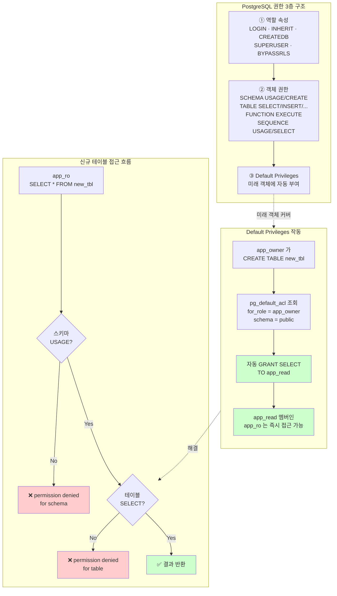

# E1. 권한 오류 — GRANT 했는데도 새 테이블이 안 보인다

> **증상 박스**
> - `ERROR: permission denied for table orders`
> - `ERROR: permission denied for schema public`
> - 어제까지 잘 되던 리포트 계정이 오늘 새로 만든 테이블만 못 읽는다
> - v15 로 신규 설치한 DB 에서 일반 유저가 `CREATE TABLE` 을 못한다

---

## 증상

| 증상 | 전형적 에러 | 자주 나오는 상황 |
|------|-------------|------------------|
| 기존 테이블 접근 실패 | `permission denied for table orders` | 새로 만든 읽기 전용 유저에게 GRANT 가 빠짐 |
| 신규 테이블 접근 실패 | `permission denied for table new_event` | 예전에 `GRANT SELECT ON ALL TABLES` 만 한 경우 |
| public 스키마 CREATE 실패 | `permission denied for schema public` | PG15+ 에서 기본 CREATE 권한이 제거됨 |
| 함수/시퀀스 실패 | `permission denied for function xxx`, `for sequence yyy` | 객체 종류별로 GRANT 가 따로 필요 |
| 소유권 오류 | `must be owner of table xxx` | 소유자가 아닌 역할이 ALTER/DROP 시도 |

운영 현장에서 가장 자주 반복되는 패턴은 이것이다.

```
Day 1:  CREATE ROLE app_ro;
        GRANT USAGE ON SCHEMA public TO app_ro;
        GRANT SELECT ON ALL TABLES IN SCHEMA public TO app_ro;
        → 정상 동작, 배포 완료.

Day 30: 마이그레이션으로 새 테이블 new_event 추가.
        → app_ro 가 new_event 를 못 읽는다.
        → 개발팀 "어제까지 됐는데요?"
```

"됐는데요" 는 어제 만든 테이블엔 GRANT 가 들어갔기 때문이고, 오늘 만든 테이블엔 아무 권한도 없기 때문이다. `GRANT ... ON ALL TABLES` 는 **이미 존재하는** 테이블에만 적용된다.

---

## 실제 상황 — 타임라인

리포트용 읽기 전용 계정을 만든 지 한 달이 지난 서비스.

```
T+0d   관리자: CREATE ROLE report_ro LOGIN PASSWORD '...';
       관리자: GRANT USAGE ON SCHEMA public TO report_ro;
       관리자: GRANT SELECT ON ALL TABLES IN SCHEMA public TO report_ro;
       → BI 대시보드 정상.
T+14d  앱팀: 마이그레이션으로 테이블 payment_log 생성 (소유자 app_rw).
       → report_ro 는 payment_log 에 대해 아무 권한 없음.
T+15d  BI 담당: "payment_log 가 뭘로도 안 잡혀요"
          ERROR: permission denied for table payment_log
       관리자가 즉시 GRANT SELECT ON payment_log TO report_ro; → 해결.
T+45d  같은 일이 또. "이번엔 refund_log 요."
```

근본 해결책은 **미래 객체에 대한 권한(Default Privileges)** 을 설정하는 것이다. `ALTER DEFAULT PRIVILEGES` 를 쓰지 않으면 같은 장애가 테이블 추가 시마다 반복된다.

---

## 원인 분석

### 1) PostgreSQL 권한 체계 3층

```
① 역할(Role) 자체의 속성
     SUPERUSER · CREATEDB · CREATEROLE · REPLICATION · LOGIN · INHERIT · BYPASSRLS
     (CREATE ROLE / ALTER ROLE 로 설정)

② 객체(Object) 별 권한
     TABLE    : SELECT, INSERT, UPDATE, DELETE, TRUNCATE, REFERENCES, TRIGGER
     SCHEMA   : USAGE, CREATE
     FUNCTION : EXECUTE
     SEQUENCE : USAGE, SELECT, UPDATE
     DATABASE : CONNECT, CREATE, TEMPORARY
     (GRANT / REVOKE 로 부여)

③ 기본 권한(Default Privileges)
     앞으로 생성될 객체에 자동으로 부여할 권한
     (ALTER DEFAULT PRIVILEGES)
```

이 세 층이 모두 맞아야 접근이 된다. "테이블 권한" 만 주면 스키마 `USAGE` 가 없어 실패하고, 스키마 `USAGE` 만 주면 테이블 권한이 없어 실패한다.

### 2) `GRANT ON ALL TABLES` 의 한계

```sql
GRANT SELECT ON ALL TABLES IN SCHEMA public TO app_ro;
```

이 문장은 **실행 시점에 존재하는** 모든 테이블에 한 번 GRANT 를 건다. 이후에 생성되는 테이블에는 소급 적용되지 않는다. 많은 팀이 이 한 줄을 "끝" 이라고 착각한다.

### 3) `ALTER DEFAULT PRIVILEGES` 의 의미

```sql
-- "앞으로 owner_role 이 public 스키마에 만드는 모든 테이블에
--  app_ro 에게 SELECT 를 자동 부여한다"
ALTER DEFAULT PRIVILEGES FOR ROLE owner_role IN SCHEMA public
  GRANT SELECT ON TABLES TO app_ro;
```

핵심 포인트:
- **누가 만들었을 때** 적용할지를 `FOR ROLE` 로 지정 (보통 앱 유저 또는 마이그레이션 유저)
- **어느 스키마에서** 를 `IN SCHEMA` 로 지정
- **어떤 객체 타입에** 를 `ON TABLES|SEQUENCES|FUNCTIONS|TYPES|SCHEMAS` 로 지정

`FOR ROLE` 을 생략하면 "현재 역할이 만드는 객체" 에만 적용된다. 다른 마이그레이션 유저가 만들면 다시 새지기 때문에, 실제 객체를 만드는 역할을 정확히 지정해야 한다.

### 4) PG15+ public 스키마 변화

PostgreSQL 15 부터는 `public` 스키마의 기본 `CREATE` 권한이 **PUBLIC 그룹에서 제거**되었다.

```sql
-- PG14 이전 (신규 DB):
--   public 스키마는 PUBLIC 에게 USAGE, CREATE 모두 부여됨
--   → 아무 유저나 public 에 테이블을 만들 수 있었다 (보안상 바람직하지 않음)

-- PG15+ (신규 DB):
--   public 스키마는 PUBLIC 에게 USAGE 만 부여됨
--   → 일반 유저는 public 에 CREATE 못함
--   → 일부 마이그레이션 도구(django, flyway, alembic 등)가 에러
```

대응:

```sql
-- 특정 앱 역할에만 CREATE 허용 (권장)
GRANT CREATE ON SCHEMA public TO app_rw;

-- 예전처럼 모두에게 허용 (비권장, 보안 약화)
GRANT CREATE ON SCHEMA public TO PUBLIC;
```

### 5) 역할 계층과 `INHERIT`

여러 역할을 관리할 때는 그룹 역할(NOLOGIN) + 로그인 역할 조합이 깔끔하다. 권한은 그룹에만 부여하고 로그인 유저는 `INHERIT` 로 자동 상속받도록 설계하면 개별 유저마다 GRANT 를 반복하지 않아도 된다. (구체 예시는 아래 "해결 — 근본" 섹션 참조)

---

## 진단 쿼리

### 1) 현재 유저의 권한 확인

```sql
-- 특정 테이블에 대한 특정 유저의 SELECT 가능 여부
SELECT has_table_privilege('app_ro', 'public.orders', 'SELECT');
SELECT has_schema_privilege('app_ro', 'public', 'USAGE');
SELECT has_function_privilege('app_ro', 'public.my_fn(int)', 'EXECUTE');
```

### 2) 테이블별 권한 덤프 (psql)

```
\dp public.orders

                                    Access privileges
 Schema |  Name  | Type  |          Access privileges          | ...
--------+--------+-------+-------------------------------------+-----
 public | orders | table | app_rw=arwdDxt/app_rw              +|
        |        |       | app_ro=r/app_rw                     |
```

권한 축약 해석:

| 문자 | 의미 |
|------|------|
| `r` | SELECT (read) |
| `w` | UPDATE (write) |
| `a` | INSERT (append) |
| `d` | DELETE |
| `D` | TRUNCATE |
| `x` | REFERENCES |
| `t` | TRIGGER |
| `/role` | 누가 부여했는지(grantor) |

### 3) information_schema 에서 한 번에

```sql
-- 어떤 유저가 어떤 테이블에 어떤 권한을 가지는지
SELECT grantee, table_schema, table_name, privilege_type
FROM information_schema.table_privileges
WHERE grantee = 'app_ro'
ORDER BY table_schema, table_name;
```

### 4) Default Privileges 현재 설정

```sql
SELECT
    pg_get_userbyid(defaclrole) AS for_role,
    nspname                     AS schema,
    defaclobjtype,              -- r=TABLE, S=SEQUENCE, f=FUNCTION, T=TYPE, n=SCHEMA
    defaclacl                   AS default_acl
FROM pg_default_acl
LEFT JOIN pg_namespace ON pg_namespace.oid = defaclnamespace
ORDER BY for_role, schema;
```

결과가 비어 있으면 **미래 객체에 자동 부여되는 권한이 전혀 없다**는 뜻. 앞으로 만들어지는 테이블마다 수동 GRANT 가 필요하다.

### 5) 스키마 권한과 역할 멤버십

```sql
-- 스키마 권한
SELECT n.nspname AS schema,
       pg_catalog.array_to_string(n.nspacl, E'\n') AS access
FROM pg_namespace n
WHERE n.nspname NOT LIKE 'pg_%' AND n.nspname != 'information_schema';

-- 역할 멤버십 (누가 누구의 그룹인지)
SELECT r.rolname AS member, m.rolname AS group_role
FROM pg_auth_members g
JOIN pg_roles r ON r.oid = g.member
JOIN pg_roles m ON m.oid = g.roleid
ORDER BY r.rolname;
```

---

## 해결

### 즉시 — 빠진 권한만 정확히 GRANT

```sql
-- 1) 스키마 USAGE 가 없으면 아무것도 안 된다. 가장 먼저 확인.
GRANT USAGE ON SCHEMA public TO app_ro;

-- 2) 특정 테이블만 급한 대로
GRANT SELECT ON public.payment_log TO app_ro;

-- 3) 지금 존재하는 모든 테이블에 한 번에
GRANT SELECT ON ALL TABLES IN SCHEMA public TO app_ro;
GRANT USAGE, SELECT ON ALL SEQUENCES IN SCHEMA public TO app_ro;
```

### 단기 — Default Privileges 로 미래까지 커버

```sql
-- 핵심: "app_rw (실제 마이그레이션을 실행하는 역할)가
--        앞으로 public 에 만드는 모든 테이블/시퀀스에 대해
--        app_ro 에게 권한을 자동 부여"
ALTER DEFAULT PRIVILEGES FOR ROLE app_rw IN SCHEMA public
  GRANT SELECT ON TABLES TO app_ro;

ALTER DEFAULT PRIVILEGES FOR ROLE app_rw IN SCHEMA public
  GRANT USAGE, SELECT ON SEQUENCES TO app_ro;

-- 쓰기 유저용
ALTER DEFAULT PRIVILEGES FOR ROLE app_rw IN SCHEMA public
  GRANT INSERT, UPDATE, DELETE ON TABLES TO app_write;
```

`FOR ROLE app_rw` 부분을 빠뜨리면 "내가 지금 만드는 객체" 에만 적용되므로, 실제 DDL 을 실행하는 역할(마이그레이션 유저) 을 정확히 넣어야 한다.

### 근본 — 역할 설계 재구성

```sql
-- 소유자 역할 (실제 DDL 을 실행, 테이블 소유)
CREATE ROLE app_owner NOLOGIN;

-- 권한 묶음 역할 (NOLOGIN)
CREATE ROLE app_read  NOLOGIN;
CREATE ROLE app_write NOLOGIN;

-- 실제 로그인 유저
CREATE ROLE app_api LOGIN PASSWORD '...' INHERIT;
CREATE ROLE bi_user LOGIN PASSWORD '...' INHERIT;

-- 멤버십
GRANT app_read, app_write TO app_api;
GRANT app_read TO bi_user;

-- 스키마 USAGE 부여
GRANT USAGE ON SCHEMA public TO app_read, app_write;

-- 소유자의 기본 권한 설정 (이후 생성되는 것 포함)
ALTER DEFAULT PRIVILEGES FOR ROLE app_owner IN SCHEMA public
  GRANT SELECT ON TABLES TO app_read;
ALTER DEFAULT PRIVILEGES FOR ROLE app_owner IN SCHEMA public
  GRANT INSERT, UPDATE, DELETE ON TABLES TO app_write;
ALTER DEFAULT PRIVILEGES FOR ROLE app_owner IN SCHEMA public
  GRANT USAGE, SELECT ON SEQUENCES TO app_read, app_write;

-- 기존 객체도 한 번에 정리
GRANT SELECT ON ALL TABLES IN SCHEMA public TO app_read;
GRANT INSERT, UPDATE, DELETE ON ALL TABLES IN SCHEMA public TO app_write;
```

### PG15+ public 스키마 대응

```sql
-- 앱 유저가 public 에 테이블을 만들어야 한다면
GRANT CREATE ON SCHEMA public TO app_owner;

-- 또는 전용 스키마를 쓰는 게 낫다 (권장)
CREATE SCHEMA app AUTHORIZATION app_owner;
-- 이후 검색 경로
ALTER ROLE app_api SET search_path = app, public;
```

전용 스키마를 쓰면 public 의 기본 보안을 지키면서도 앱 DDL 에 제약이 없다.

---

## 예방

```
체크리스트:

  1. 새 역할을 만들 때 항상 3층을 설계한다
       - 역할 속성(LOGIN/NOLOGIN/INHERIT)
       - 객체 권한(스키마 USAGE + 테이블/시퀀스 권한)
       - Default Privileges (미래 객체)

  2. 권한은 그룹 역할에만 부여하고, 로그인 유저는 멤버십으로 관리
       - 앱 배포마다 권한 관리 단순화
       - 유저 삭제/추가 시 권한 재설정 불필요

  3. ALTER DEFAULT PRIVILEGES 의 FOR ROLE 을 정확히 지정
       - "실제 DDL 을 실행하는 역할" 이름
       - CI/CD 에서 마이그레이션 유저가 바뀌면 Default Privileges 도 갱신

  4. PG15 로 이행 시 public 스키마 CREATE 권한 확인
       - 업그레이드 전 dry-run 에서 마이그레이션이 실패하지 않는지
       - 전용 스키마로 분리하는 게 장기적으로 깔끔

  5. 정기 감사(audit)
       - \dp 스냅샷을 주기적으로 저장
       - 예상치 못한 권한이 생겼으면 원인 추적
       - pg_default_acl, information_schema.table_privileges 비교

  6. 슈퍼유저는 비상시에만
       - 애플리케이션은 절대 SUPERUSER 로 접속하지 않는다
       - CREATEDB/CREATEROLE 도 꼭 필요한 역할에만
```

---

## Mermaid — 권한 3층과 Default Privileges 흐름



---

## 관련 챕터 · 치트시트 · 케이스

- [2장. PostgreSQL 아키텍처](../chapters/ch02_architecture.md) — 역할/데이터베이스/스키마 전체 관계
- [E2. RLS 정책 함정](E2_rls_policy_trap.md) — 행 단위 권한(ROW LEVEL SECURITY) 의 또 다른 함정
- [F2. 관리형 PG 제약](F2_managed_pg_limitations.md) — `rds_superuser` 등 특권 역할 이슈
- [cheatsheets/psql_commands.md](../cheatsheets/psql_commands.md) — `\dp`, `\dn+`, `\du` 등
- [cheatsheets/config_parameters.md](../cheatsheets/config_parameters.md) — 권한 관련 파라미터

### 공식 문서

- [DDL: Privileges](https://www.postgresql.org/docs/current/ddl-priv.html)
- [ALTER DEFAULT PRIVILEGES](https://www.postgresql.org/docs/current/sql-alterdefaultprivileges.html)
- [PostgreSQL 15 Release Notes — public schema](https://www.postgresql.org/docs/15/release-15.html)
